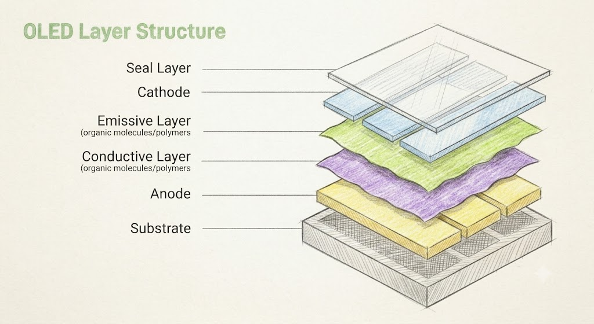
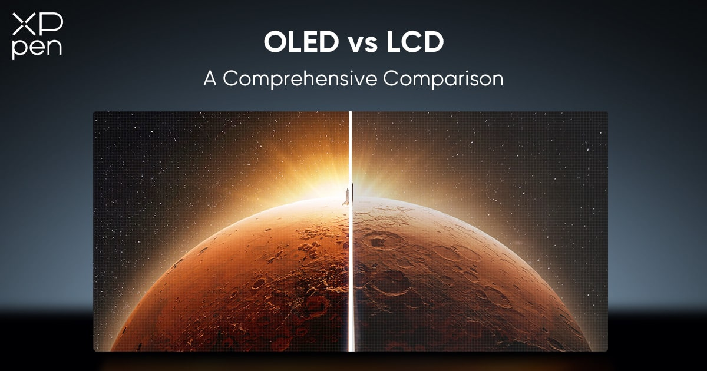
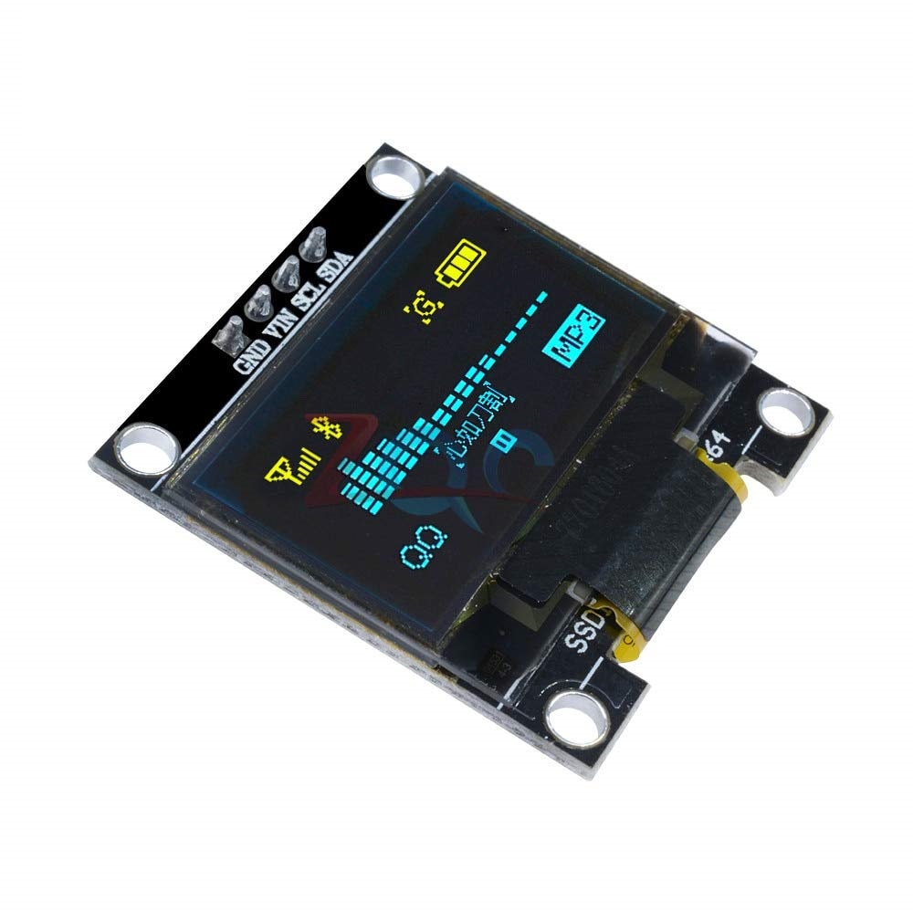
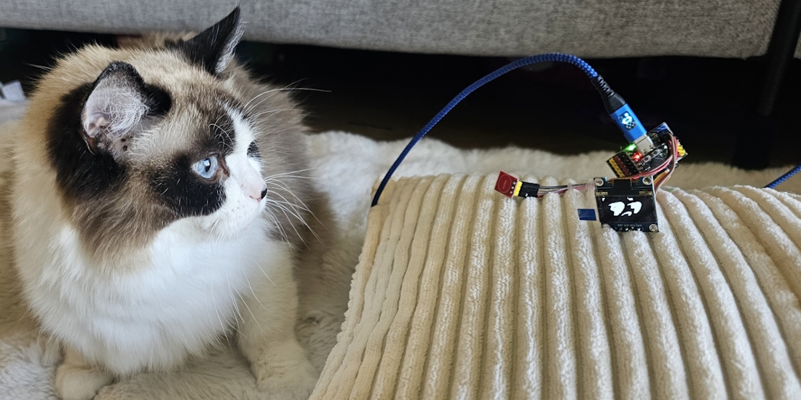

---
#Required fields
title: "Apa Itu OLED? Dari TV Puluhan Juta Sampai Modul Murah di AliExpress"
description: "Bedah teknologi OLED dari dasar: kenapa TV flagship pakai OLED, modul murah di AliExpress beda apa, dan istilah OLED vs AMOLED vs PLED yang bikin bingung"
pubDate: 2026-07-04
category: "deepdive"
cover: "../../assets/blog/DD_OLED/OLED-1-layer-structure.jpg"
coverAlt: "Visual representation of Apa Itu OLED? Dari TV Puluhan Juta Sampai Modul Murah di AliExpress"

#Core Fields
tags: ["OLED"]
author: "Thomas Agung Nugraha"
lang: "id-ID"
draft: false

#recommended
slug: "oled-deepdive-1-apa-itu-oled"
excerpt: "Banyak orang bingung beda OLED murah dan premium. Saya akan jelaskan secara sederhana cara kerja emisi cahaya mandiri di layar."
updatedDate: 2026-07-04

#Optional-series support
series: "OLED Deep Dive"
seriesOrder: 1

#Optional:SEO & Indexing
canonicalURL: "https://t-agung.id/blog/oled-deepdive-1-apa-itu-oled"
keywords:
  - OLED
noindex: false

#Optional-table-of-content
showToc: true

#optional-internal linking
relatedPosts:
  - oled-deepdive-2
---

Moko lagi duduk di atas laptop saya, matanya fokus ke layar yang nunjukin modul OLED 0.96 inci seharga Rp. 15 ribu di AliExpress. Dia nggak bisa baca, tapi ketertarikan pada sesuatu yang menyala adalah hal yang universal.

Kamu pernah beli modul OLED kecil itu? Keren kan, OLED, pasti mahal. Tapi Rp. 15 ribu? Langsung beli buat project Arduino. Pas barang datang, nyala: kuning-biru, 128x64 pixel, kecil banget. Terus kamu liat TV OLED di toko elektronik: puluhan juta, hitamnya pekat, warnanya hidup. Kedua-duanya "OLED", tapi bedanya kayak langit dan bumi.

Padahal kedua-duanya beneran OLED. Bedanya cuma kelasnya.

Gini contohnya, kalau kamu liat tulisan "mobil" di iklan TV dan tulisan "mobil" di papan bengkel sebelah, keduanya mobil. Tapi satu bisa mobil sport keluaran terbaru, satunya motor matic yang dipakein spion biar kelihatan keren. OLED juga gitu.

Di bagian pertama dari seri deep dive OLED ini, kita bahas dari awal: apa itu OLED, kenapa teknologi ini bikin semua TV dan HP brand berlomba-lomba push, dan kenapa modul Rp. 15 ribu di AliExpress nggak bisa diharapkan tampil kayak TV OLED 65 inci yang harganya nyampe puluhan juta.

## Kenapa Semua Orang Tiba-tiba Ngomongin OLED?

Kalau kamu beli TV atau HP baru tahun ini, hampir pasti ketemu tulisan besar "OLED" di brosurnya. Samsung, LG, Sony, bahkan HP mid-range sekarang udah pakai layar OLED.

Alasannya sederhana. OLED punya tiga keunggulan yang LCD nggak bisa ngejar.

**Pertama: kontras.** OLED bisa nampilin hitam yang bener-bener hitam karena setiap piksel bisa mati total. LCD? Backlight-nya tetap nyala meskipun gambarnya gelap, jadi hitam-nya jadi abu-abu. Nonton film horor di OLED dan LCD, perbedaannya langsung keliatan. OLED itu kayak matinya lampu di kamar gelap total. LCD itu kayak kamu taruh sarung di depan lampu: masih ada cahaya yang nembus dan ngga gelap pekat.

 Struktur lapisan OLED disederhanakan: dari substrate sampai encapsulation. Setiap piksel punya lapisan organik yang nyala saat dialiri listrik.

**Kedua: tipis.** OLED nggak butuh backlight. Lapisan organiknya cuma beberapa ratus nanometer, lebih tipis dari rambut manusia sekitar 100 kali. HP sekarang bisa setipis kue lapis karena OLED-nya nggak perlu ruang buat lampu sorot di belakang.

**Ketiga: bisa fleksibel.** Lapisannya tipis dan organik, jadi bisa ditekuk. Ini yang bikin HP lipat jadi mungkin. LCD? Masih butuh panel kaca yang kaku, kayak mencoba melipat kaca jendela. Ada sih Organic LCD, tapi karena layernya banyak, susah ngebuatnya.

Cuman ceritanya nggak segampang itu. OLED di TV flagship itu nggak sama dengan modul OLED murah di AliExpress. Bedanya di mana? Kita ngobrolinnya di bawah.

## OLED vs LCD: Analogi yang Gampang Dicerna

Bayangin kamu punya dua ruangan.

**LCD itu kayak ruangan dengan lampu besar di belakangnya.** Mau nampilin gambar gelap? Taruh tirai di depan lampu. Tapi lampunya tetap nyala, cuma tertutup. Makanya LCD nampilin hitam, dia nggak pernah hitam total. Selalu ada cahaya yang bocor dari balik tirai.

**OLED itu kayak ruangan di mana setiap titik punya lampu sendiri-sendiri.** Mau hitam? Matikan lampunya. Mau putih terang? Nyalakan penuh. Setiap piksel adalah sumber cahayanya sendiri.

 Perbandingan visual: LCD butuh backlight sementara OLED setiap pikselnya nyala sendiri. Sumber: concept-phones.com

Perbedaan mendasarnya:

|                     | LCD                           | OLED                        |
| ------------------- | ----------------------------- | --------------------------- |
| Sumber cahaya       | Backlight (lampu di belakang) | Setiap piksel nyala sendiri |
| Hitam sempurna      | Sulit (cahaya bocor)          | Ya (piksel dimatikan)       |
| Ketebalan           | Butuh layer backlight         | Tipis (tanpa backlight)     |
| Respon              | Sekitar 5ms                   | Sekitar 0.1ms               |
| Sudut pandang       | Memudar di samping            | Hampir sempurna (178°)      |
| Daya (gambar gelap) | Tetap boros (backlight nyala) | Hemat (piksel gelap = mati) |

Perhatikan baris terakhir. Di OLED, kalau gambarnya gelap, pikselnya mati, dan piksel mati nggak ngerjakin apa-apa, jadi hemat daya. Di LCD, backlight tetap nyala meskipun gambarnya hitam. Makanya OLED lebih hemat kalau kamu suka dark mode.

## OLED di Dunia Nyata: dari TV ke Modul DIY

### OLED di TV dan Smartphone Premium

OLED yang kamu lihat di TV Samsung QD-OLED, LG WOLED, atau layar HP iPhone dan Galaxy, itu semua adalah **AMOLED** *(Active Matrix OLED)*. Artinya setiap piksel punya transistor sendiri yang ngontrol seberapa terang piksel itu nyala.

Ciri khasnya:

- Warna kereng dan akurat
- Kontras tinggi (hitam pekat)
- Respon cepat (0.1ms)
- Bisa fleksibel (untuk foldable phones)
- Harga: mulai dari normalnya Rp. 10 jutaan untuk HP, Rp. 20 jutaan lebih untuk TV 55 inci

### Modul OLED Murah di AliExpress: Apa yang Sebenarnya Kamu Beli

Sekarang buka AliExpress. Cari "OLED module". Kamu bakal ketemu modul 0.96 inci I2C/SPI seharga Rp. 15-25 ribu. Warnanya kuning-biru. Resolusinya 128x64 pixel. Kecil dan simple.

 Modul OLED 0.96 inci SSD1306 yang terkenal di kalangan maker: murah, kecil, dan cuma dua warna.

Ini juga OLED, tapi jenisnya beda. Ini yang disebut **PMOLED** (Passive Matrix OLED). Bedanya:

- **Nggak punya transistor per piksel.** Alamat piksel dilakukan baris per baris, seperti scan line di TV lama.
- **Monokrom.** Cuma satu warna (umumnya kuning-biru), nggak butuh tiga material emisi berbeda.
- **Kecil.** PMOLED cuma praktis untuk layar di bawah 2 inci. Buat layar besar, efisiensinya turun drastis.
- **Murah banget.** Modul 0.96 inci SSD1306 itu standar industri untuk project Arduino dan ESP32.

Kenapa warnanya kuning-biru? Karena modul murah pakai material emisi tunggal: biasanya biru atau kuning-hijau. OLED TV punya tiga material emisi (merah, hijau, biru) per piksel. Beda kelas, beda harga, beda pengalaman.

<!-- MOKO PICTURE IDEA #1 -->

<!-- Pose: Moko duduk di samping laptop dengan modul OLED kecil di atas meja -->

<!-- Caption: "Moko juga nggak paham kenapa modul OLED murah cuma kuning-biru. Tapi dia tetap suka." -->

<!-- Photo: ../../assets/blog/oled_deepdive/01.moko-module.jpg -->

<!-- Status: PHOTO NEEDED (requires actual photo of Moko) -->

## PLED: Keluarga OLED yang Beda

### Apa Itu PLED?

Nah, di sini banyak orang bingung. Di datasheet atau forum, kamu sering lihat kata "PLED". Apa itu?

**PLED itu Polymer OLED.** Beda dari OLED biasa yang pakai molekul kecil (Small Molecule OLED), PLED pakai rantai polimer: molekul organik yang lebih panjang dan kompleks.

Perbedaan cara produksi:

- **Small Molecule OLED**: Diendapkan di ruang vakum (vacuum thermal evaporation). Presisi tinggi, kualitas konsisten, dipakai di smartphone dan TV.
- **PLED**: Bisa dicetak atau disemprot (solution processing). Lebih murah, potensi roll-to-roll manufacturing, tapi kontrol lapisan kurang presisi.

### Modul AliExpress: PMOLED atau PLED?

Jawabannya: modul OLED murah di AliExpress (SSD1306, 0.96 inci) sebenarnya pakai **PMOLED dengan material small molecule**, bukan PLED.

Tapi kenapa orang sering bilang PLED?

Karena ada kesamaan: modul kecil, monokrom, murah, dan diproduksi dengan cara sederhana. Tapi secara teknis, dia PMOLED (Passive Matrix addressing) + small molecule OLED materials. Bukan polimer.

Kenapa bedanya penting? Karena PLED dan PMOLED itu dua dimensi yang berbeda:

- **PMOLED vs AMOLED** = bedanya cara alamat piksel (passive matrix vs active matrix)
- **Small Molecule vs PLED** = bedanya material (molekul kecil vs polimer)

Modul AliExpress adalah PMOLED + Small Molecule. TV Samsung adalah AMOLED + Small Molecule. Keduanya "OLED" tapi beda di dua dimensi sekaligus.

## Istilah-Istilah yang Bikin Bingung

Kalau kamu baca forum atau datasheet, ini istilah yang sering muncul dan bikin pusing:

**OLED**: Istilah umum. Organic Light-Emitting Diode. Lapisan organik yang nyala saat dialiri listrik.

**AMOLED**: Active Matrix OLED. Setiap piksel punya transistor sendiri. Ini yang dipakai di smartphone dan TV. Resolusi tinggi, ukuran besar, kontrol presisi.

**PMOLED**: Passive Matrix OLED. Alamat baris per baris, nggak punya transistor per piksel. Kecil, murah, monokrom. Modul AliExpress itu PMOLED.

**PLED**: Polymer OLED. Pakai material polimer, bukan molekul kecil. Potensi produksi murah, tapi belum matang untuk display konsumen.

**WOLED**: White OLED + color filter. OLED nyala putih, terus difilter jadi warna. LG Display pakai ini untuk TV.

**QD-OLED**: Quantum Dot OLED. Biru OLED + quantum dot yang ubah sebagian biru jadi merah dan hijau. Samsung Display pakai ini. Lebih efisien dari WOLED karena quantum dot lebih presisi dari color filter.

**PHOLED**: Phosphorescent OLED. Pakai bahan langka (iridium, platinum) yang bisa panen 100% exciton. Ini yang dipakai di smartphone dan TV sekarang: jauh lebih efisien dari OLED fluorescent biasa.

**TADF**: Thermally Activated Delayed Fluorescence. Tanpa bahan langka, konversi triplet jadi singlet pakai panas. Teknologi masa depan yang bikin OLED lebih murah karena nggak butuh logam mulia.

## Kenapa OLED Jadi Game Changer?

Dari pengalaman saya di Sony, Intel, dan Motherson: OLED itu bukan sekadar "layar bagus." Ini perubahan fundamental di cara kita bikin display.

Waktu dulu saya evaluasi display dengan OLED pertama kali, sensasinya kayak nemu warna baru yang nggak pernah ada sebelumnya. Hitam yang bener-bener hitam, bukan "abu-abu gelap." Di ruangan gelap, bedanya luar biasa. Saya sampai harus meyakinkan diri sendiri bahwa layar itu nggak rusak, karena hitamnya terlalu pekat.

Sekarang OLED mulai masuk ke mobil: bukan cuma infotainment, tapi juga ambient lighting dan HUD. Responsif 0.1ms itu beda banget sama 5ms pas lagi nyetir 120 km/jam di tol.

 Kokpit mobil yang dulu penuh tombol fisik, sekarang jadi layar OLED besar yang responsif. Perubahannya cukup cepat untuk yang baru pertama kali nyoba.

## Intinya

OLED itu revolusi display. Dari layar tebal yang butuh lampu di belakang, kita punya layar setipis kue lapis yang tiap pikselnya nyala sendiri.

Hitamnya hitam beneran. Responsnya kilat. Dan harganya? Mulai dari Rp. 15 ribu aja udah bisa dapet modul PMOLED untuk project Arduino.

Tapi "OLED" itu payung besar. Ada AMOLED di TV flagship, ada PMOLED di modul murah, ada PLED yang masih berkembang, dan ada WOLED vs QD-OLED yang bersaing di pasar TV.

Di bagian selanjutnya, kita bedah lebih dalam: kenapa PMOLED dan AMOLED beda fundamental, gimana cara kerja active matrix, dan kenapa OLED biru lebih cepat rusak dari warna lainnya.

Moko ngga puas kayaknya ama OLED kecil yang monochrome

---

*Seri OLED Deepdive akan berlanjut dengan pembahasan: Active vs Passive Matrix, konsumsi daya OLED, material emissive layer, degradasi dan burn-in, manufaktur, QD-OLED, OLED di automotive, dan cutting-edge OLED 2026.*
