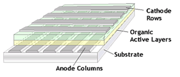
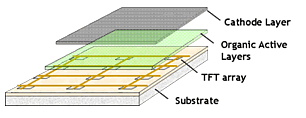
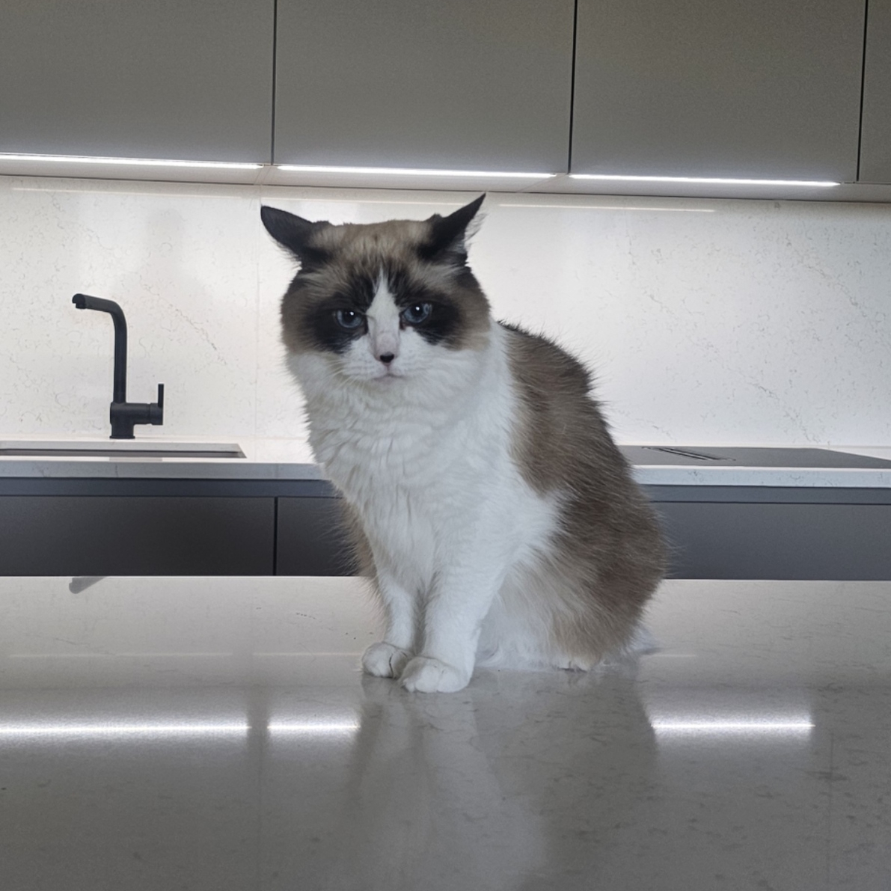

---
#Required fields
title: "Active Matrix vs Passive Matrix: Kenapa Layar HP Bisa Kaya Warna, Tapi OLED Murah Tidak"
description: "Bedah PMOLED dan AMOLED: kenapa modul OLED murah dari Cina tampilannya beda dari layar HP flagship, padahal sama-sama OLED. Kita bahas duty cycle, scanning, dan transistor per piksel."
pubDate: 2026-07-06
category: "deepdive"
cover: "../../assets/blog/DD_OLED/OLED-2-pmoled-structure.png"
coverAlt: "Visual representation of Active Matrix vs Passive Matrix: Kenapa Layar HP Bisa Halus, Tapi OLED Murah Tidak"

#Core Fields
tags: ["OLED"]
author: "Thomas Agung Nugraha"
lang: "id-ID"

#recommended
slug: "oled-deepdive-2-passive-vs-active-matrix"
excerpt: "Dari duty cycle hingga jumlah transistor per piksel, saya jelaskan perbedaan PMOLED dan AMOLED yang membuat tampilan layar HP flagship terasa begitu mulus."
updatedDate: 2026-07-04

#Optional-series support
series: "OLED Deep Dive"
seriesOrder: 2

#Optional:SEO & Indexing
canonicalURL: "https://t-agung.id/blog/oled-deepdive-2-passive-vs-active-matrix"
keywords:
  - OLED
noindex: false

#Optional-table-of-content
showToc: true

#optional-internal linking
relatedPosts:
  - oled-deepdive-1-apa-itu-oled
  - oled-deepdive-3

draft: false
---

Tahun kemarin saya beli modul OLED 0,96 inci dari Cina. Harganya? sekitar Rp. 15 ribu. Pas nyampe dan saya colokin ke ESP32, dia nyala bagus. Kontrasnya tajam, hitamnya bener-bener hitam. Tapi terus saya mikir: modul seharga Rp. 15 ribu ini sama-sama OLED dengan layar Samsung Galaxy yang harganya puluhan juta. Kenapa tampilannya beda sedramatis itu?

Saya posting pertanyaan ini di grup maker Indonesia, jawabannya satu suara: "Karena beda cara piksel dikontrol."

Jadi benar, sama-sama bikin cahaya, tapi hasilnya bukan satu level. Di bagian pertama seri ini kita sudah bahas apa itu OLED dan kenapa material organik bisa bercahaya. Kalau kamu belum baca, mending balik dulu. [Bagian 1 - Apa Itu OLED?](../oled-deepdive-1-apa-itu-oled/)

Di sini kita bedah perbedaannya.

## Dua gedung, dua cara nyalain lampu

Coba bayangin dua gedung apartemen, masing-masing punya seratus lampu di setiap kamar. Gedung pertama, listriknya dihidupkan per lantai: satu lantai nyala, lantai lain mati, terus bergantian cepat banget. Gedung kedua, setiap kamar punya saklar sendiri.

Keduanya bisa bikin semua lampu nyala. Tapi gedung pertama lebih tidak efisien, lebih boros, dan tidak bisa menyalakan semua lampu sekaligus.

Perbedaan antara PMOLED dan AMOLED persis kayak gitu.

## Refreshing: Gimana Cara Kerja Matrix Display?

Sebelum masuk ke bedah teknis, kita perlu paham dulu gimana cara kerja display matrix secara umum.

Di layar display, piksel disusun dalam grid: baris horizontal dan kolom vertikal. Buat nyalain satu piksel tertentu, kamu perlu tahu persis di baris ke berapa dan kolom ke berapa piksel itu berada.

Contoh sederhana: layar 128x64 piksel punya 128 kolom dan 64 baris. Total 8.192 piksel. Kalau kamu mau nyalain piksel di posisi baris 5, kolom 30, sistem harus kirim sinyal ke baris 5 DAN kolom 30 secara bersamaan.

Di sini ada dua pendekatan.

**Pendekatan pertama (Passive Matrix):** Sistem scan baris per baris. Baris 1 nyala sebentar, terus baris 2, terus baris 3, dan seterusnya. Karena mata manusia tidak bisa bedain kecepatan scan, hasilnya kelihatan seperti semua piksel nyala bersamaan.

**Pendekatan kedua (Active Matrix):** Setiap piksel punya saklar sendiri (transistor) yang bisa nyala terus-menerus tanpa perlu di-scan ulang. Saklar ini mempertahankan state piksel sampai sinyal baru datang.

Mari kita bedah satu per satu.

## PMOLED: Simple, Murah, tapi Ada Batas

### Gimana Cara Kerjanya?

PMOLED itu Passive Matrix OLED. "Passive" artinya tidak ada komponen aktif di setiap piksel. Kontrol dilakukan dari luar: driver IC nyetel tegangan ke baris dan kolom secara bergantian.

Prosesnya gini.

1. Driver nyalain baris 1, kasih tegangan ke kolom-kolom yang mau nyala.
2. Baris 1 mati.
3. Driver nyalain baris 2, kasih tegangan ke kolom yang mau nyala.
4. Ulang sampai semua baris selesai. Ini satu frame.
5. Ulang lagi untuk frame berikutnya (biasanya 60 frame per detik).

Karena mata manusia punya *persistence of vision*, otak kita "megang" gambar selama sekitar 1/16 detik - kamu tidak ngerasa layar itu di-update baris per baris. Tapi yang kamu lihat memang hanya sekitar 1/64 dari layar yang benar-benar nyala di setiap momen (untuk layar 64 baris). Sisanya mengandalkan afterimage di otak kita.

Struktur PMOLED (Passive Matrix): piksel diatur dalam grid tanpa transistor individual. Setiap baris dinyalakan secara bergantian - hanya satu baris aktif dalam satu waktu.

### Masalah: Duty Cycle

Di sinilah PMOLED mulai kena masalah. Konsep yang namanya *duty cycle*.

Duty cycle itu rasio waktu satu piksel aktif dibanding total waktu satu frame. Kalau layarmu punya 64 baris dan setiap baris aktif satu per satu, maka setiap piksel cuma nyala selama 1/64 dari total waktu.

Duty cycle = 1/64, kira-kira 1,6 persen.

Artinya, piksel cuma nyala sekitar 1,6 persen dari waktu. Sisanya gelap. Buat bikin layar kelihatan seterang layar AMOLED yang pikselnya nyala 100 persen dari waktu, PMOLED harus mengalirkan arus yang jauh lebih tinggi saat piksel aktif.

Coba pikirin begini.

Bayangin tiga orang kerja bareng. Satu orang kerja 8 jam, dua orang kerja 30 menit. Buat dapetin output yang sama, yang kerja 30 menit harus kerja jauh lebih keras di jam kerjanya. Piksel PMOLED juga gitu: dia harus kerja jauh lebih keras dalam waktu singkat buat dapetin brightness yang sama.

Konsekuensinya.

- **Brightness terbatas.** Karena arus tinggi bikin material organik cepat rusak.
- **Lifetime pendek.** Material organik yang terus dialiri arus tinggi akan degrade lebih cepat.
- **Ukuran maksimal sekitar 3 inci.** Layar lebih besar berarti lebih banyak baris, duty cycle makin kecil, arus makin tinggi, lifetime makin singkat.

### PMOLED di Dunia Nyata

Meskipun ada batasan, PMOLED punya tempat sendiri. Saya sendiri masih sering pakai modul OLED 0,96 inci buat test project cepat. Nggak ribet, colok langsung jalan.

- **Modul OLED 0,96 inci (SSD1306)** - Yang kamu beli di AliExpress seharga Rp. 15-25 ribu. Resolusi 128x64, monokrom kuning-biru. Ini standar industri untuk project Arduino dan ESP32.
- **Smartwatch entry-level** - Jam tangan murah yang butuh display hemat daya tapi kontras tinggi.
- **Indikator industri** - Panel kontrol yang butuh display sederhana, tahan banting, dan murah.
- **Kalkulator dan perangkat kecil** - Tempat di mana display kecil dengan informasi minimal sudah cukup.

Kelebihan PMOLED yang tidak boleh disalahartikan: dia **murah banget** dan **udah cukup** untuk aplikasi yang tidak butuh resolusi tinggi atau ukuran besar. Buat project DIY yang cuma perlu nampilin suhu, jam, atau angka sensor, dan ngga mikirin long term reliability, PMOLED itu perfect.

## AMOLED: Setiap Piksel Punya "Otak"

### Gimana Cara Kerjanya?

AMOLED itu Active Matrix OLED. "Active" karena setiap piksel punya komponen aktif sendiri: **TFT (Thin Film Transistor)** dan **kapasitor penyimpanan**.

Struktur AMOLED (Active Matrix): berbeda dengan PMOLED, setiap piksel punya kontrol aktif. Layar ini bisa mempertahankan gambar tanpa perlu di-scan ulang.

Struktur satu piksel AMOLED:

- **TFT** - Transistor yang bertindak sebagai saklar. Nyalain atau matikan aliran arus ke piksel.
- **Kapasitor** - Menyimpan muatan listrik yang menentukan brightness piksel setelah TFT menutup.

*Sirkuit piksel AMOLED (2T1C): dua transistor dan satu kapasitor bekerja bareng untuk kontrol brightness presisi per piksel.*

Cara kerjanya lebih elegan dari PMOLED.

1. Driver kirim sinyal ke piksel tertentu.
2. TFT di piksel itu terbuka, arus mengalir.
3. Kapasitor menyimpan tegangan.
4. TFT menutup, tapi kapasitor masih nahan tegangan - piksel tetap nyala dengan brightness yang sudah diset.
5. Piksel terus menyala sampai sinyal baru datang yang mengubah brightness.

Perbedaan fundamental: **AMOLED tidak perlu scan baris per baris.** Setiap piksel bisa nyala terus-menerus dengan brightness yang konsisten karena kapasitor menjaga state-nya.

Waktu saya masih di Intel, 2015 sampai 2018, kita sering ngobrol soal TFT array design untuk display. Konsep dasar itu sama: kamu butuh sesuatu yang bisa "ingat" state piksel antara satu refresh cycle ke cycle berikutnya. Di LCD, kapasitor di TFT array nyimpen voltase buat liquid crystal. Di OLED, kapasitor nyimpen voltase buat kontrol arus ke material organik. Sama-sama kapasitor, sama-sama buat nyimpen state, tapi mediumnya yang beda.

Sebenarnya konsep basic ini saya sudah kenal lebih awal, waktu saya masih di Sony VAIO Architecture Team antara 2008 sampai 2013. Waktu itu kita lagi diskusi soal kenapa laptop ultrabook butuh panel display yang bisa lebih tipis dan lebih hemat daya. TFT array adalah jawabannya, dan dari situlah saya mulai paham kenapa Active Matrix bisa jadi game changer buat display portable.

### Kenapa AMOLED Bisa Lebih Baik?

Karena duty cycle-nya mendekati 100 persen. Piksel AMOLED nyala hampir sepanjang waktu, bukan cuma saat barisnya di-scan. Ini bikin beberapa hal.

- **Brightness lebih tinggi** - Arus yang dialirkan bisa lebih rendah karena piksel nyala terus, bukan cuma 1,6 persen waktu.
- **Lifetime lebih panjang** - Arus lebih rendah berarti material organik tidak terdegradasi secepat PMOLED.
- **Resolusi tinggi bisa dicapai** - Tidak masalah kalau layarmu 1920x1080 atau 3840x2160. Setiap piksel punya kontrol sendiri.
- **Refresh rate tinggi** - 60Hz, 90Hz, 120Hz, bahkan 240Hz di layar gaming. Karena setiap piksel bisa di-update independen.
- **Ukuran besar bisa dicapai** - TV OLED 77 inci dari LG? AMOLED. Tidak ada batasan ukuran seperti PMOLED.
- **Fleksibel** - AMOLED bisa diproduksi di substrat plastik, bukan cuma kaca. Ini yang bikin HP lipat dan layar melengkung jadi mungkin.

### AMOLED di Dunia Nyata

AMOLED itu display di hampir semua perangkat premium. Waktu saya kerja di Motherson buat automotive HMI, hampir semua dashboard premium yang kita sentuh pakai AMOLED. Alasannya jelas: kontras tinggi, respons cepat, dan bisa ditekuk mengikuti desain kabin mobil.

- **Smartphone flagship** - Samsung Galaxy, iPhone, Xiaomi Pro series. Semua AMOLED.
- **Smartwatch premium** - Apple Watch, Samsung Galaxy Watch. Layar melengkung dengan always-on display.
- **TV OLED** - LG WOLED (42-97 inci), Samsung QD-OLED (42-77 inci).
- **Monitor OLED** - Untuk gaming dan creative work. 27 inci sampai 49 inci ultrawide.
- **Layar automotive** - Dashboard, infotainment, ambient lighting di mobil premium.
- **Tablet dan laptop** - iPad Pro, MacBook Pro (masih LCD tapi OLED sedang diuji).

## Perbandingan untuk Maker dan Engineer

Kalau kamu engineer atau hobbyist yang mau pilih display buat project, ini perbandingannya.

|              | PMOLED                          | AMOLED                                    |
| ------------ | ------------------------------- | ----------------------------------------- |
| Ukuran       | Maks ~3 inci                    | Tiada batasan (0,2" sampai 97")           |
| Resolusi     | Rendah (128x64 umum)            | Tinggi (1920x1080, 3840x2160)             |
| Warna        | Monokrom (kuning-biru, hijau)   | RGB penuh                                 |
| Brightness   | Terbatas (duty cycle)           | Tinggi (piksel nyala 100%)                |
| Refresh rate | Rendah                          | Tinggi (60-240Hz)                         |
| Lifetime     | Pendek (10.000-20.000 jam)      | Panjang (50.000-100.000 jam)              |
| Harga modul  | Rp. 15-25 ribu                  | Mulai Rp. 500 ribu (module) sampai jutaan |
| Interface    | I2C/SPI (sederhana)             | MIPI DSI (butuh controller)               |
| Aplikasi     | DIY, indikator, wearables murah | Smartphone, TV, monitor, automotive       |
| Fleksibel    | Tidak                           | Ya (plastic substrate)                    |

### Kapan Pilih PMOLED?

- Project Arduino/ESP32 yang butuh display kecil
- Kamu mau nampilin angka, teks pendek, atau grafik sederhana
- Budget terbatas dan monokrom sudah cukup
- Kamu mau belajar dasar-dasar display interfacing

### Kapan Pertimbangkan AMOLED?

- Kamu butuh warna, resolusi tinggi, atau ukuran besar
- Project butuh selalu-nyala (always-on display)
- Kamu buat produk konsumen, bukan prototype
- Kamu butuh fleksibilitas (layar melengkung/foldable)

Catatan buat hobbyist: modul AMOLED yang siap pakai itu jauh lebih susah didapat dan lebih mahal dari modul PMOLED. Buat project hobby, PMOLED itu lebih gampang diintegrasi. Tapi kalau kamu mau bikin produk serius yang butuh kualitas, AMOLED satu-satunya pilihan.

## Intinya

PMOLED dan AMOLED itu OLED, tapi bukan OLED yang sama. Bedanya ada di cara piksel dikontrol: passive scanning vs active transistor-per-piksel. PMOLED murah, sederhana, dan cocok untuk project kecil. AMOLED mahal, kompleks, tapi bisa bikin layar dari HP flagship sampai TV 97 inci.

Gini analoginya: PMOLED kayak lampu pijar di kamar tidur, simpel dan cukup buat baca buku sebelum tidur. AMOLED kayak pencahayaan studio profesional, bisa diatur per sumber cahaya dan hasilnya jauh lebih presisi. Keduanya cahaya, tapi level kontrolnya beda.

Di bagian berikutnya, kita masuk ke konsumsi daya. Kenapa menghitung berapa watt OLED itu tidak sesederhana "kalikan voltase sama arus". Spoilernya: jawabannya ada di duty cycle dan karakteristik material organik yang tidak linear. Jadi kalau kamu pernah kepikiran kenapa OLED di smartwatch bisa hemat banget, tapi OLED di TV boros, Bagian 3 bakal jawab itu.

Dan Moko?

Moko duduk di atas batu putih yang dingin, keliatan mukanya bosen dengerin tuannya njelasin masalah OLED

 

Dia udah bosen dengerin saya ngejelasin masalah OLED.
Katanya "OLED emang lebih dingin dari LCD ? gara-gara ngga butuh backlight ?  tapi lebih dingin mana ama batu putih ini ?" Moko nggak peduli apakah layarnya passive matrix atau active matrix. Bagi dia, yang penting pas lagi panas-panas gini mendingan duduk di tempat yang dingin.

---

*Referensi dari blog sebelumnya: [Bagian 1 - Apa Itu OLED?](../oled-deepdive-1-apa-itu-oled/)*

