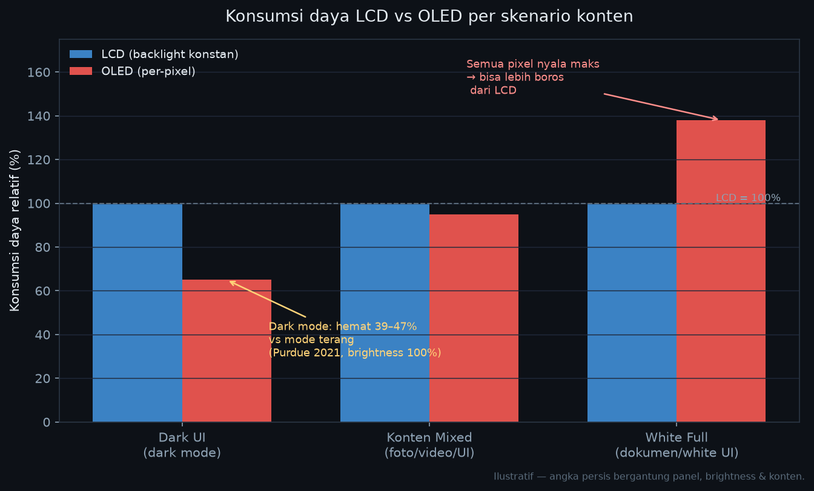
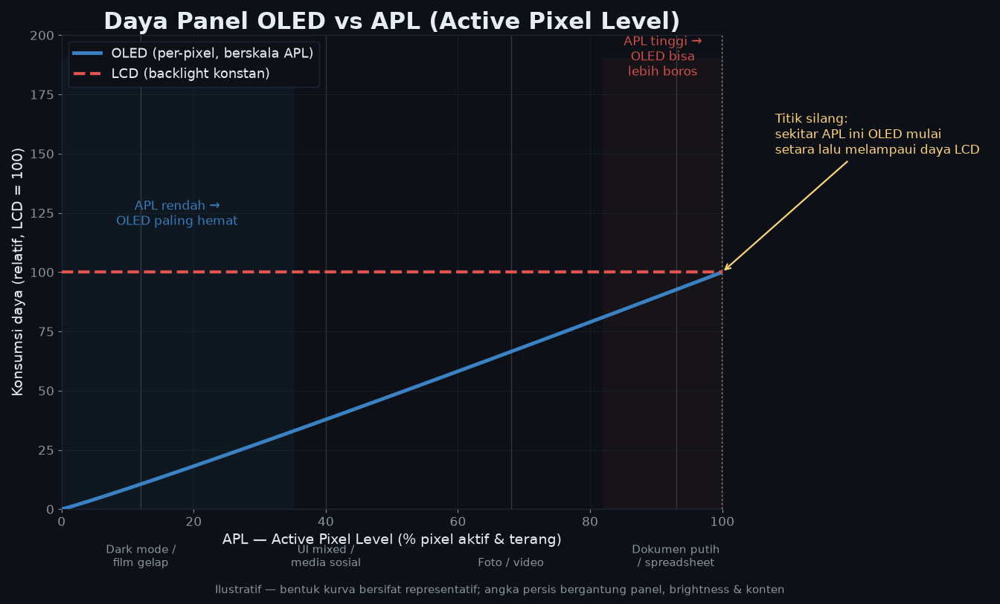
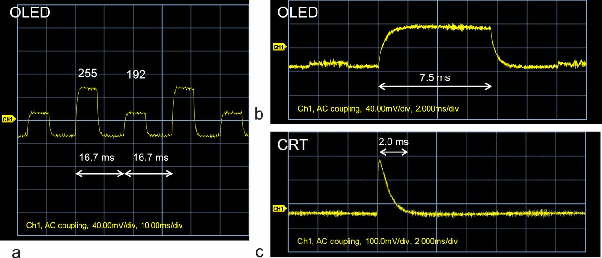
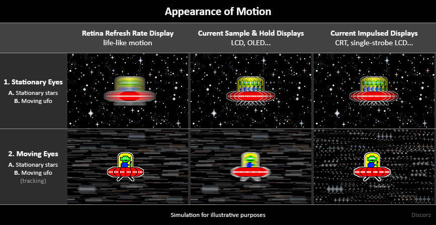
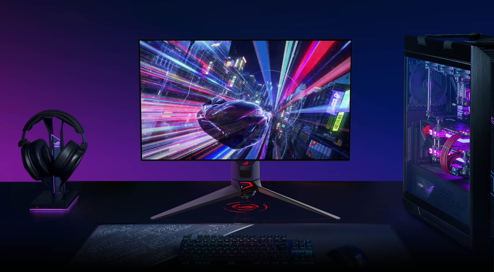
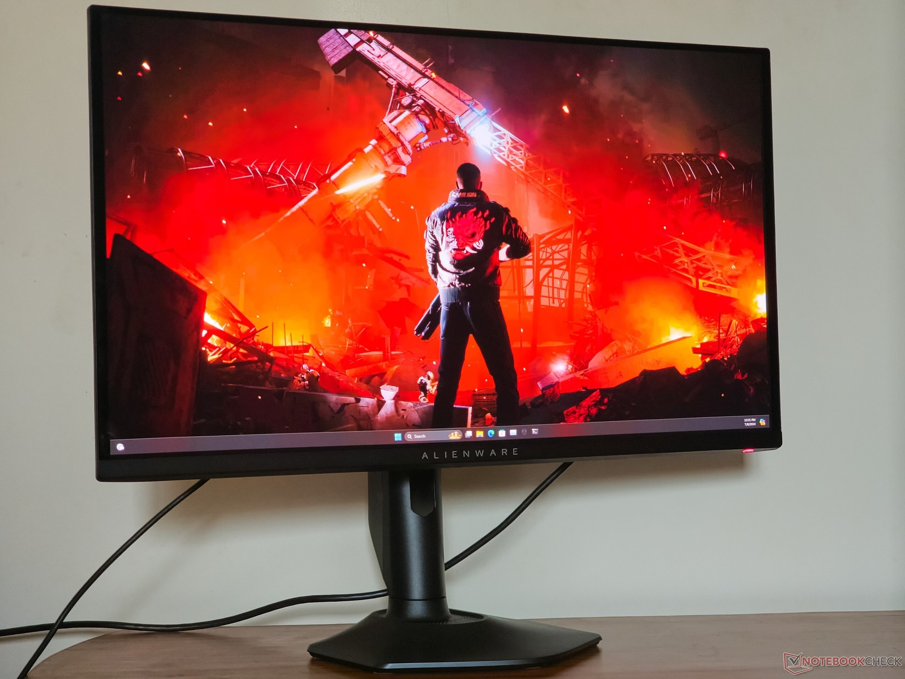

---
#Required fields
title: "OLED Deepdive 3: Power Consumption & Refresh Rate"
description: "Kenapa OLED bisa lebih hemat (atau justru lebih boros) dari LCD? APL, dark mode, response time 0,03ms, dan kenapa frontier gaming OLED sekarang sudah di 720Hz, dibedah dari sudut engineer display."
pubDate: 2026-08-30
category: "deepdive"
cover: "../../assets/blog/DD_OLED/OLED-3-power-comparison.png"
coverAlt: "Perbandingan konsumsi daya LCD vs OLED per skenario konten"

#Core Fields
tags: ["OLED", "Power Consumption", "Refresh Rate", "Gaming Monitor"]
author: "Thomas Agung Nugraha"
lang: "id-ID"
draft: false

#recommended
slug: "oled-deepdive-3-power-and-refresh-rate"
excerpt: "Daya OLED itu content-dependent: gelap hemat, putih boros. Dan soal refresh rate, frontier gaming OLED sekarang sudah 720Hz dengan response time 0,02ms. Saya bedah angkanya."
updatedDate: 2026-08-30

#Optional-series support
series: "OLED Deep Dive"
seriesOrder: 3

#Optional:SEO & Indexing
canonicalURL: "https://t-agung.id/blog/oled-deepdive-3-power-and-refresh-rate"
keywords:
  - OLED power consumption
  - OLED refresh rate
  - dark mode baterai
  - OLED gaming monitor
  - 720Hz OLED
  - response time OLED
noindex: false

#Optional-table-of-content
showToc: true

#optional-internal linking
relatedPosts:
  - oled-deepdive-2-passive-vs-active-matrix
  - oled-deepdive-4-luminous-evolution
---

*Bagian 3 dari seri OLED Deep Dive*

> **Part 1** → [Bagian 1: Apa Itu OLED?](/blog/oled-deepdive-1-apa-itu-oled/)
> **Part 2** → [Bagian 2: Passive vs Active Matrix](/blog/oled-deepdive-2-passive-vs-active-matrix/)

Di Deepdive 1 kita sudah bahas cara kerja pixel OLED: setiap pixel menerangi dirinya sendiri, nggak butuh backlight. Di Deepdive 2 kita bedah bedanya PMOLED dan AMOLED. Kali ini masuk ke dua hal yang sering bikin orang bingung: **konsumsi daya** dan **refresh rate**. Dua hal ini saling terkait, dan pemahaman tentang keduanya akan mengubah cara kamu memilih layar, baik untuk HP, laptop, maupun monitor.

Saya dulu yakin banget OLED itu selalu lebih hemat baterai. Sebelum saya bener-bener nyelam ke angka-angka di balik layar. Ternyata jawabannya nggak sesederhana "OLED hemat" atau "OLED boros", dan jawabannya nggak selalu intuitif.

## Part A: Kenapa OLED Bisa Lebih Hemat (dan juga bisa Lebih Boros)

### Konsep utama : Pixel-Level Power

Ini konsep yang paling penting untuk dipahami: **daya OLED dikonsumsi per pixel, bukan per layar.**

Bayangkan LCD itu seperti lampu neon di langit-langit ruang kelas atau auditorium. Mau kamu pakai ruang kelas itu untuk satu orang atau seratus orang, lampu neonnya menyala sama, daya yang sama. Backlight menyala penuh, terus-menerus, tanpa peduli apa yang tampil di layar. OLED lebih seperti lampu meja yang ada di setiap bangku. Bangku kosong? Lampunya mati, nggak pakai daya. Seratus bangku kosong, satu orang duduk? Hanya satu lampu yang menyala.

Konsekuensi langsungnya:

- **Layar gelap (dark UI)** → pixel-pixelnya mati → daya minimal. Ini kenapa dark mode di HP OLED bisa benar-benar hemat baterai.
- **Layar putih penuh (white UI)** → semua pixel nyala di maksimum → daya maksimum. Di skenario ini, OLED bisa lebih boros dari LCD.
- **Konten mixed (foto, video, UI)** → bervariasi, tergantung konten.

<i>LCD stabil di semua skenario karena backlight tetap nyala. OLED naik-turun mengikuti konten: gelap hemat, terang boros.</i>

### APL: Rahasia Tersembunyi yang Nentuin Hemat atau Boros

Di sinilah bagian yang bikin OLED nggak selalu jadi juara hemat energi. Ada konsep namanya APL, *Active Pixel Level*, seberapa banyak dan seberapa terang pixel yang aktif di layar.

Daya OLED berskala langsung dengan APL. APL rendah, nonton film gelap, baca chat dengan dark theme, subtitle di latar hitam, OLED sangat efisien. APL tinggi, buka dokumen putih sepanjang hari, spreadsheet, video dengan scene yang terang, OLED jadi haus energi. Saya pernah lihat panel OLED 6 inci yang nyerep lebih banyak daya dari LCD seukuran sama waktu menampilkan layar putih penuh, karena semua pixelnya menyala maksimal sementara backlight LCD tetap di daya yang sama.

Jadi kalau ada yang bertanya "OLED hemat atau boros?", jawabannya: **tergantung konten.** Kayak lagi pilih mobil bensin atau listrik. Di jalan kota yang sering berhenti, listrik irit. Di tol full gas terus, tergantung efisiensi masing-masing. Untuk penggunaan sehari-hari, scroll media sosial, nonton YouTube, chat, OLED cenderung menang karena UI modern kebanyakan dark-themed dan APL-nya rendah. Tapi kalau kamu pekerja yang buka dokumen putih sepanjang hari, OLED bukan jawaban hemat energi.

<i>Semakin tinggi APL, semakin terang dan luas kontennya, semakin besar daya yang ditarik panel OLED.</i>

### Angkanya: Berapa Sebenarnya Hematnya?

Mari kita masuk ke angka. Riset dari University of Purdue (2021) mengukur konsumsi daya smartphone OLED dengan per-frame power profiler di aplikasi Android nyata, membandingkan **mode terang (light mode) vs mode gelap (dark mode)** di layar yang sama. Hasilnya menarik:

- **Brightness 100% (terang penuh)**: switching ke dark mode hemat **39–47%** daya dibanding mode terang.
- **Brightness 30–50% (kondisi dalam ruangan, auto-brightness default)**: hemat cuma **3–9%**.

Catatan penting: angka 39–47% itu penghematan **mode gelap vs mode terang di layar OLED yang sama**, bukan perbandingan OLED vs LCD. Artinya, dark mode paling terasa manfaatnya ketika kamu pakai layar di brightness tinggi. Di brightness normal dalam ruangan, penghematannya kecil, bahkan kebanyakan pengguna nggak akan ngerasain bedanya.

Dan sebaliknya: **konten terang (white UI) di brightness tinggi** adalah skenario paling boros untuk OLED, semua pixel menyala di maksimum, sementara LCD dengan backlight tetap di daya yang sama. Pola ini konsisten di review laptop dan monitor: **semakin gelap kontennya, semakin besar penghematan OLED. Semakin terang, semakin kecil, bahkan bisa jadi pemborosan.**

Dan ini bukan cuma teori. Kalau kamu perhatikan, hampir semua HP flagship modern (Samsung Galaxy, Google Pixel, iPhone 13 Pro+) sudah pakai layar OLED. Dan mereka semua punya dark mode yang secara default disarankan.

> **💡 Pro Tip:** Kalau kamu pakai HP OLED, dark mode bukan cuma soal gaya, ini fitur yang benar-benar menghemat baterai. Tapi jangan salah: dark mode di HP LCD nggak memberikan penghematan signifikan, karena backlight tetap menyala. Hematnya cuma kalau layarnya OLED (atau e-ink).

### Nah, gimana Laptop dan Monitor?

Di laptop dan monitor, situasinya agak beda:

1. **Konten desktop lebih terang** dari konten mobile. Wallpaper, window manager, dokumen, sebagian besar UI desktop cukup terang. Jadi penghematan dark mode nggak seagresif di HP.
2. **Brightness biasanya lebih tinggi** di laptop/monitor (250–500 nits) dibanding HP (100–300 nits di auto mode). Semakin tinggi brightness, semakin besar daya yang dipakai oleh pixel yang menyala.
3. **OLED laptop masih relatif baru** di segmen konsumen (2022–2026), jadi data real-world masih terbatas. Tapi review dari The Verge, Notebookcheck, dan RTINGS secara konsisten menunjukkan: OLED laptop lebih hemat di konten gelap, lebih boros di konten terang.

### LTPO dan Adaptive Refresh Rate

Layar yang refresh 120Hz terus-menerus, bahkan saat menampilkan konten statis (misalnya kamu baca artikel dan nggak scroll), itu pemborosan. Pixel-pixelnya di-refresh 120 kali per detik untuk menampilkan gambar yang sama.

LTPO memungkinkan panel menurunkan refresh rate secara dinamis, iPhone 14 Pro+ bisa turun ke **1Hz** untuk Always-On Display, dan **24–48Hz** untuk konten yang hampir statis. iPad Pro generasi M4 pakai ProMotion 10–120Hz untuk skenario produktivitas. Ini penghematan yang signifikan, dan hanya mungkin karena LTPO bisa mengubah frekuensi refresh secara dinamis. Tanpa LTPO, layar AMOLED harus refresh di minimum 48–60Hz terus-menerus.

> **💡 Pro Tip:** Kalau kamu cari laptop OLED untuk produktivitas (bukan gaming), pastikan punya adaptive refresh rate (LTPO). Untuk konten statis, baca, ngetik, coding, refresh rate rendah berarti baterai lebih awet. Tanpa LTPO, kamu bayar harga penuh 120Hz untuk konten yang tidak bergerak.

## Part B: Refresh Rate, Apa yang Sebenarnya Terjadi?

### Fundamental : Hertz

Refresh rate = berapa kali per detik layar memperbarui gambar yang ditampilkan. 60Hz = 60 gambar per detik. 120Hz = 120 gambar per detik. 240Hz = 240 gambar per detik.

Secara teori, semakin tinggi refresh rate, semakin smooth gerakan di layar. Ini sudah jadi standard di gaming, dan semakin banyak masuk ke segmen produktivitas. Tapi ada nuansa yang sering nggak dibahas:

1. **Refresh rate layar ≠ frame rate konten.** Layar 120Hz nggak akan menampilkan 120fps kalau konten (game, video) hanya 30fps. Kamu butuh konten dengan frame rate yang sesuai.
2. **Adaptive Sync (G-Sync/FreeSync)**: teknologi yang mensinkronkan refresh rate layar dengan frame rate GPU, mencegah screen tearing. Penting di gaming; di konten non-gaming, refresh rate adaptif (LTPO) lebih relevan.
3. **Perceived smoothness**: perbedaan 60Hz ke 120Hz terasa sangat jelas. Dari 120Hz ke 240Hz, perbedaannya lebih halus, masih terasa, tapi nggak se-dramatis lompatan pertama. Dari 240Hz ke 480Hz, perbedaannya sudah sangat kecil untuk kebanyakan orang.

### Response Time, Ini Dia Keuntungan OLED

Di Deepdive 2, kita bahas struktur pixel. Kali ini dari sudut motion, dan di sinilah keunggulan intrinsik OLED muncul: **response time.**

Pixel OLED bisa on/off dalam hitungan microsecond, monitor OLED modern dispek di **0,03ms GTG** (dan yang terbaru sudah 0,02ms). Pixel LCD butuh waktu untuk berubah: biasanya **1–5ms**, dan itu sudah pakai overdrive, teknik memaksa kristal cair berubah lebih cepat.

Batasnya di OLED bukan material-nya, tapi driving circuit-nya. Material OLED sendiri sudah sangat cepat, yang perlu dikejar adalah seberapa cepat elektronika driver bisa memberi sinyal ke pixel.

Tapi ada satu hal yang sering nggak dipahami: **refresh rate tinggi pada LCD nggak sepenuhnya menghilangkan motion blur.** LCD punya masalah lain, backlight yang tetap menyala selama transisi pixel. Ini menciptakan "persistence blur": pixel yang sedang berubah masih menyala (atau belum mati) saat frame berikutnya sudah dimulai.

OLED nggak punya masalah ini. Pixelnya langsung off, nggak ada persistence. Jadi di refresh rate yang sama (misalnya 120Hz), OLED akan terlihat lebih jernih untuk motion dibanding LCD, bahkan LCD yang lebih cepat.

<i>Gap-nya jauh: pixel OLED on-off dalam microsecond, LCD butuh 1–5ms bahkan dengan overdrive.</i>

### Black Frame Insertion (BFI): Nguatin Nuansa

Ada satu teknologi yang sering disebut dalam konteks motion clarity: **Black Frame Insertion (BFI).**

BFI bekerja dengan menyisipkan frame hitam di antara frame-frame konten. Di LCD, BFI memakai strobing backlight, backlight mati sebentar di antara frame, mengurangi persistence blur. Di OLED, BFI bekerja pada level pixel: setiap pixel di-black-frame di antara frame, tanpa perlu backlight strobing karena OLED tidak punya backlight.

Tapi BFI **bukan** alasan utama kenapa motion OLED terlihat clean. Alasannya lebih fundamental:

1. **Instant-off pixels**: pixel OLED mati dalam microsecond, tidak ada ghosting.
2. **No backlight persistence**: tidak ada cahaya backlight yang "menyusup" selama transisi.
3. **BFI**: tambahan opsional yang bisa membantu lebih jauh di refresh rate tertentu, dengan trade-off: screen jadi lebih gelap dan potensi flicker/latensi.

Di beberapa monitor OLED gaming, BFI hadir sebagai opsi, misalnya "OLED Motion" di TV LG, atau BFI mode di monitor ASUS. Jadi kalau kamu melihat review monitor OLED yang memuji motion clarity, sebagian besar itu karena faktor 1 dan 2. BFI adalah bonus, bukan penyebab utama.

<i>Backlight LCD tetap nyala saat pixel sedang berubah, sumber "persistence blur" yang nggak dimiliki OLED.</i>

> **💡 Pro Tip:** Kalau kamu punya monitor OLED gaming dengan BFI, coba bandingkan BFI on vs off. Beberapa orang suka sharpness tambahan, sebagian lagi merasa brightness drop-nya nggak sebandar. Ini sangat personal, cobain sendiri deh.

### Frontier-nya: 240Hz → 360Hz → 480Hz → 720Hz

Marketplace gaming OLED bergerak cepat, dan frontier-nya terus naik:

- **240Hz**: sudah jadi standard monitor OLED gaming premium: ASUS ROG Swift OLED **PG27AQDM** (1440p), Alienware **AW3225QF** (4K).
- **360Hz**: Alienware **AW2725DF** (1440p) dan MSI MPG 271QRX.
- **480Hz**: ASUS ROG Swift OLED **PG27AQDP** (1440p, MLA+), consumer tertinggi saat artikel ini ditulis.
- **540Hz**: LG Display sudah produksi massal panel OLED gaming 4th Gen di 540Hz sejak H2 2025.
- **720Hz**: di CES 2026, LG Display unveil monitor OLED 27 inci dengan **720Hz** dan response time **0,02ms**: refresh rate tertinggi di dunia untuk display OLED saat ini.

<i>ASUS ROG Swift OLED PG27AQDM (240Hz), bukti OLED tak butuh backlight untuk tetap tajam saat gerakan cepat.</i>

<i>Alienware AW2725DF (360Hz), refresh tinggi OLED bikin blur praktis hilang.</i>

Apakah 480–720Hz worth it? Untuk competitive esports (CS2, Valorant, Apex), iya, setiap frame yang lebih cepat berarti reaksi lebih cepat. Untuk single-player atau konten non-gaming, perbedaannya marginal.

Yang lebih penting dari refresh rate tertinggi: **refresh rate yang konsisten.** Layar 120Hz yang stabil lebih baik dari layar 240Hz yang drop ke 90fps karena GPU nggak kuat refresh rate tinggi.

### Refresh Rate dan Power Consumption

Sekarang kita hubungkan dua topik di artikel ini. Refresh rate lebih tinggi = power consumption lebih tinggi. Setiap refresh, pixel-pixel harus di-update. Di 240Hz, itu terjadi 240 kali per detik. Di 60Hz, 60 kali per detik.

Di LCD, ini kurang jadi masalah karena backlight sudah menyala terus, refresh hanya mengubah voltage di transistor. Di OLED, refresh rate tinggi berarti pixel-pixel terus-menerus di-charge dan di-switch. Ini konsumsi daya yang nyata.

Jadi monitor OLED 240Hz yang menampilkan konten putih penuh akan mengonsumsi daya signifikan lebih tinggi dibanding monitor LCD 60Hz. Ini trade-off yang harus diterima.

> **💡 Pro Tip:** Kalau kamu pakai monitor OLED 240Hz untuk kerja (bukan gaming), aktifkan adaptive sync dan turunkan refresh rate ke 120Hz atau 60Hz saat tidak perlu. Penghematan dayanya nyata, dan untuk konten non-gaming, kamu nggak akan kehilangan apa-apa.

## Overviewnya

OLED dan refresh rate adalah dua topik yang saling terkait:

| Aspek                  | OLED                       | LCD                     |
| ---------------------- | -------------------------- | ----------------------- |
| Power di konten gelap  | Sangat hemat (pixel mati)  | Backlight tetap nyala   |
| Power di konten terang | Lebih boros                | Lebih efisien           |
| Motion clarity         | Lebih jernih (instant-off) | Ada persistence blur    |
| Refresh rate tinggi    | Smooth, tapi boros daya    | Smooth, backlight tetap |
| Sweet spot             | Konten gelap + 60–120Hz    | Konten terang + 60Hz    |

Tidak ada jawaban universal. Pilihan yang tepat tergantung **konten apa yang paling sering kamu tampilkan** dan **berapa lama kamu pakai layar dalam sehari.**

## Kapan Kamu Harus Peduli (dan Kapan Tidak)

**Harus peduli kalau:**

- Kamu cari laptop/monitor untuk kerja 8+ jam sehari → power consumption dan refresh rate adaptif sangat mempengaruhi baterai dan kenyamanan
- Kamu gamer → refresh rate dan motion clarity langsung terasa
- Kamu pakai HP OLED → dark mode + adaptive refresh rate = baterai lebih awet

**Tidak perlu terlalu peduli kalau:**

- Kamu pakai layar 4–5 jam sehari untuk konten mixed → perbedaan power tidak signifikan
- Kamu bukan gamer dan tidak ngerasain motion blur → 60Hz sudah cukup
- Kamu sudah happy dengan setup saat ini → nggak perlu upgrade demi angka di spec sheet

## Selanjutnya

Di Deepdive 4, kita bahas **evolusi material OLED**: dari fluorescent yang cuma memanfaatkan 25% exciton, sampai phosphorescent, TADF, dan tandem stack yang bikin layar makin cerah dan awet.

> **Part 1** → [Bagian 1: Apa Itu OLED?](/blog/oled-deepdive-1-apa-itu-oled/)
>
> **Part 2** → [Bagian 2: Passive vs Active Matrix](/blog/oled-deepdive-2-passive-vs-active-matrix/)
> 
> **Part 4** masih dalam penulisan. 

---

*References: University of Purdue (2021), "Dark Mode May Not Save Your Phone's Battery Life as Much as You Think" (per-frame OLED power profiler, press release Januari 2021); LG Display Newsroom (2026), CES 2026 "The OLED Wave", 720Hz OLED gaming display, 0.02ms response; RTINGS OLED monitor reviews (2025–2026); ASUS ROG / Dell Alienware product specifications; Apple iPad Pro & iPhone technical specifications.*

*Part 3 dari series OLED Deepdive. Ditulis oleh Thomas Agung.*