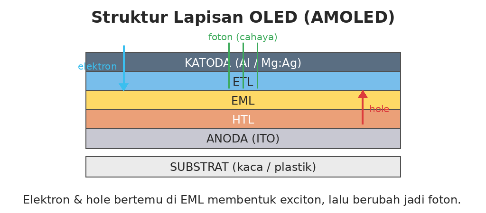
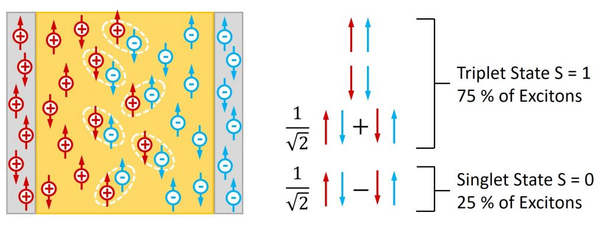
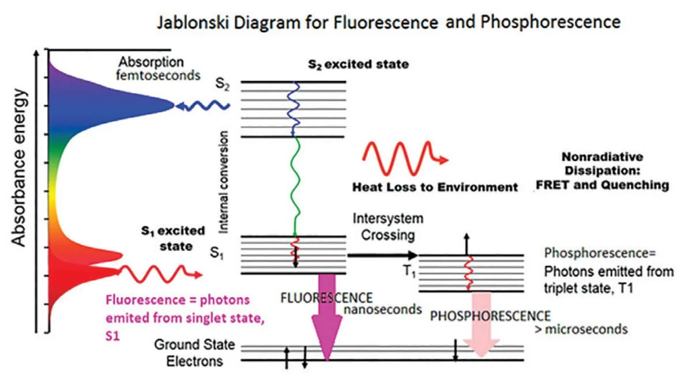
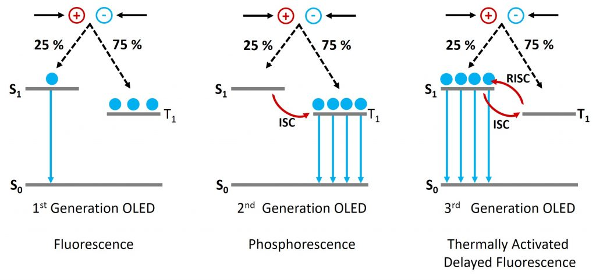
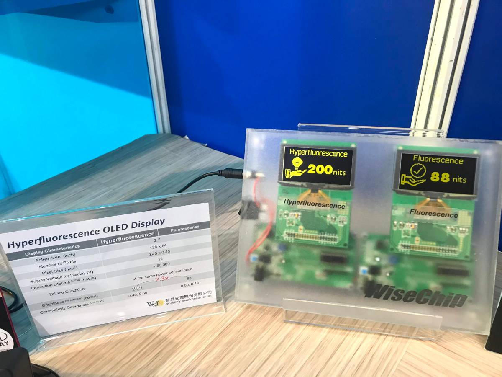
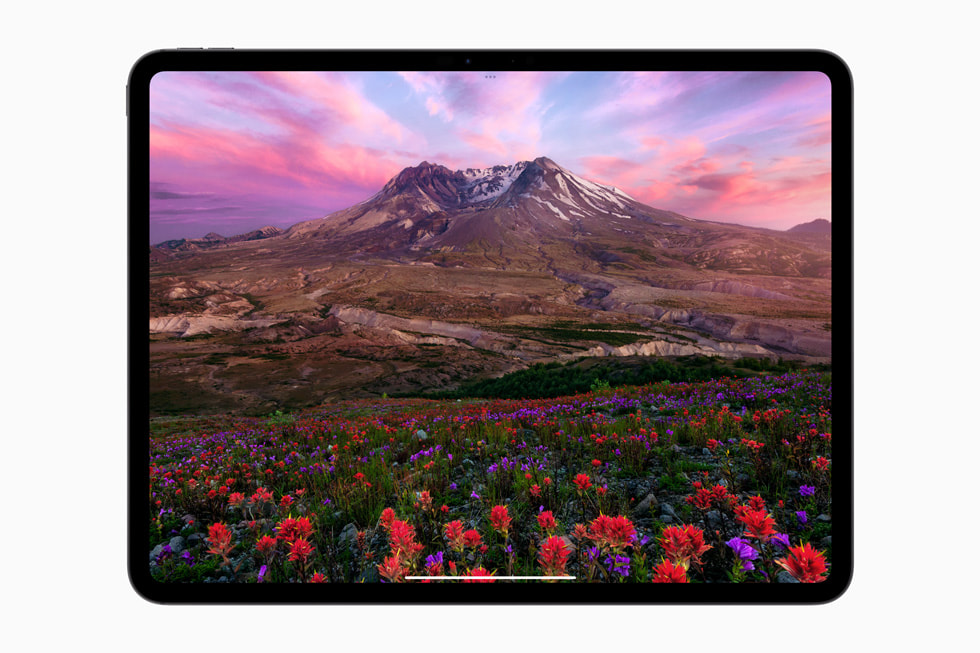

---
#Required fields
title: "OLED Deepdive 4: Dari Fluorescent ke TADF: Evolusi Material OLED yang Bikin Layar Makin Cerah dan Tahan Lama"
description: "Bedah dunia material organik OLED: kenapa triplet (75%) terbuang di OLED fluorescent, gimana phosphorescent dan TADF manfaatin semuanya, sampai tandem stack yang bikin biru tahan lama."
pubDate: 2026-09-02
category: "deepdive"
cover: "../../assets/blog/DD_OLED/OLED-4-layer-structure.png"
coverAlt: "Dari Fluorescent ke TADF: Evolusi Material OLED yang Bikin Layar Makin Cerah dan Tahan Lama"
tags: ["OLED"]
author: "Thomas Agung Nugraha"
lang: "id-ID"
slug: "oled-deepdive-4-luminous-evolution"
excerpt: "Dari fluorescent yang cuma pakai 25 persen exciton sampai TADF dan tandem stack, saya bedah evolusi material OLED yang bikin layar makin cerah dan awet."
updatedDate: 2026-09-02
series: "OLED Deep Dive"
seriesOrder: 4
canonicalURL: "https://t-agung.id/blog/oled-deepdive-4-luminous-evolution"
keywords:
  - material OLED
  - TADF
  - phosphorescent OLED
  - exciton
  - triplet
  - tandem OLED
  - blue OLED
noindex: false
showToc: true
relatedPosts:
  - oled-deepdive-3-power-and-refresh-rate
  - oled-deepdive-5-lifetime-and-degradation
draft: false
---

*Bagian 4 dari seri OLED Deep Dive*

<i>OLED itu tumpukan lapisan tipis. EML di tengah adalah tempat cahaya lahir, dan juga tempat fisika kuantum paling aneh terjadi.</i>

Seri OLED masuk bagian keempat. Tiga bagian sebelumnya kita sudah bahas apa itu OLED, bedanya PMOLED dan AMOLED, plus soal daya dan refresh rate. Kalau kamu belum baca, mending balik dulu. Di sini saya nggak bakal mengulang dasar-dasarnya. Topiknya hari ini: dari elektron sampai foton, gimana OLED beneran memancarkan cahaya, dan kenapa layar yang dua tahun lalu beneran cerah, sekarang udah nggak secerah itu. 

## Layar OLED kamu yang makin redup

 Pernah ngerasa layar OLED kamu, yang dua tahun lalu beneran menyilaukan, sekarang udah nggak secerah dulu? Bukan cuma soal piksel mati atau burn-in. Di dalam sana, material organiknya udah mulai lelah. Saya ngalamin ini sendiri. Waktu masih di tim arsitektur Sony VAIO tahun 2008 sampai 2013, kami rutin ngelacak brightness panel prototype setelah ribuan jam tes. Panel yang keluar dari fabrikasi dengan 500 nits bisa turun 15 sampai 20 persen cuma setelah 3.000 jam pemakaian. Angka itu terdengar kecil di atas kertas, tapi mata kamu langsung ngerasainnya. Nonton film di ruang terang, tiba-tiba harus naikin brightness ke batas maksimal biar kelihatan sama terangnya kayak dulu. Coba bayangin kamu masukin 100 orang ke sebuah ruangan. Berapa yang keluar bawa surat, foton, dalam hal ini? Berapa yang cuma keluar bawa keringat, alias panas? Efisiensi OLED itu soal bikin sebanyak mungkin orang keluar bawa surat, bukan keringat. Dan ternyata, hukum fisika nentuin berapa banyak yang boleh bawa surat. Bukan engineer-nya. 

## Struktur Lapisan OLED: dari substrat sampai katoda

 Sebelum masuk ke fisika kuantumnya, kita lihat dulu "gedung"-nya. OLED itu tumpukan lapisan tipis. Tiap lapisan punya tugas spesifik. Gagal satu, OLED mati. Dari bawah ke atas: 

- **Substrat:** kaca atau plastik sebagai pondasi. Smartphone? Kaca. Foldable? Plastik yang fleksibel.
  
  - **Anoda (ITO):** pintu masuk hole, muatan positif. ITO singkatan indium tin oxide, material transparan yang konduktif.
  - **HTL (Hole Transport Layer):** jalan tol yang nganter hole ke lapisan emisi.
  - **EML (Emissive Layer):** tempat elektron dan hole bertemu. Ini jantungnya. Cahaya lahir di sini.
  - **ETL (Electron Transport Layer):** jalur elektron menuju lapisan emisi.
  - **Katoda (Logam):** pintu masuk elektron. Biasanya campuran magnesium-silver atau aluminium. Alur sederhananya: elektron masuk dari katoda, hole masuk dari anoda, keduanya ketemu di EML, pertemuan mereka disebut exciton, lalu exciton pecah jadi foton (cahaya) atau panas. 
  
  
<i>Struktur lapisan OLED: dari substrat sampai katoda. EML (emissive layer) di tengah adalah tempat cahaya lahir.</i>

Simpel? Iya. Tapi di dalam EML ada fisika kuantum yang tidak sesederhana itu. 

## Dari Elektron ke Foton: Exciton dan Efisiensi

### Exciton dalam bahasa santai

Elektron dan hole bertemu di EML. Mereka terikat karena tarikan elektrostatik, dan pasangan terikat ini disebut exciton. Elektron bermuatan negatif, hole bermuatan positif (lubang karena kekurangan elektron). Keduanya saling tarik, dan pasangan inilah sumber cahaya. Tapi tidak semua pasangan menghasilkan cahaya. Sebagian cuma jadi panas. Rasio inilah yang membedakan generasi OLED. 

### Singlet dan triplet: masalah spin

Bayangkan dua penari di panggung. Kalau mereka menari berlawanan arah, gerakannya selaras dan menghasilkan harmoni. Kalau menari searah, gerakannya kurang selaras dan butuh usaha ekstra buat nyamain. Begitu juga exciton. Ada dua jenis berdasarkan spin elektronnya: **Singlet:** spin elektron berlawanan arah. Seperti dua penari yang gerakannya selaras. Ini bisa langsung berubah jadi cahaya. **Triplet:** spin elektron searah. Seperti dua penari yang gerakannya kurang selaras. Ini tidak bisa langsung jadi cahaya kalau materialnya biasa. Nah, di sinilah fisika nggak bisa dinegosiasi. Statistik spin bilang: dari semua exciton yang terbentuk, cuma 25 persen yang jadi singlet, 75 persen sisanya triplet. Rasio 1:3 ini bukan desain engineering. Ini hukum dasar mekanika kuantum, persis seperti yang kamu temuin kalau baca paper OLED mana pun (saya cross-check lewat literatur spin-statistics 1:3, angkanya konsisten di mana-mana). 

<i>Statistik spin exciton: cuma 25 persen jadi singlet (bisa langsung jadi cahaya), 75 persen jadi triplet.</i>
 

<i>Diagram Jablonski: singlet dan triplet exciton dalam material OLED. 25% bisa langsung jadi cahaya, 75% sisanya butuh "jalan pintas" lewat material khusus. Source: Horiba</i>

### IQE dan EQE: dua angka yang beda, dua angka yang nyata

Kalau kamu baca paper OLED, pasti nemu dua angka efisiensi: **IQE (Internal Quantum Efficiency):** dari 100 exciton yang terbentuk di dalam EML, berapa yang jadi foton? **EQE (External Quantum Efficiency):** dari 100 elektron yang masuk, berapa foton yang bener-bener keluar dari layar dan sampai ke matamu? EQE selalu lebih kecil dari IQE. Foton yang udah lahir di EML bisa terperangkap di dalam panel karena total internal reflection, mereka nggak bisa keluar, jadi hilang jadi panas. Secara angka: OLED generasi pertama pakai material fluorescent punya EQE cuma sekitar 2 sampai 5 persen. OLED modern dengan phosphorescent atau TADF? EQE udah di angka 20 sampai 30 persen. Artinya dari 100 elektron masuk, sekitar 20 sampai 30 foton beneran sampai ke mata kamu. Itu juga alasan kenapa brightness OLED terus naik selama 10 tahun terakhir. Bukan karena materialnya "lebih terang" per se, tapi karena makin banyak foton yang berhasil keluar. Waktu saya kerja di Intel dari 2015 sampai 2018, display driver IC yang tim saya develop harus baca data efisiensi dari panel lalu kompensasi secara real-time. Salah satu fokusnya soal kompensasi arus supaya piksel tetap konsisten meski efisiensi bergeser. Angka IQE dan EQE bukan cuma teori di paper buat kami. Itu parameter yang langsung masuk ke firmware driver. 

## Fluorescent, Phosphorescent, dan TADF: evolusi material

Ini bagian paling seru, karena di sinilah industri OLED berlomba selama 20 tahun terakhir. 

### Fluorescent: generasi pertama dengan batas keras 25 persen

OLED pertama pakai material fluorescent. Masalahnya jelas: fluorescent cuma bisa manfaatin singlet exciton, yang cuma 25 persen dari total. 75 persen sisanya, triplet, cuma jadi panas. Efisiensi maksimum fluorescent adalah 25 persen IQE. Batasan keras dari fisika kuantum, bukan batasan engineering. Mau redesign berapa kali pun, angka 25 persen tidak bakal geser. Ini bukan kritik. Fluorescent adalah awal yang sangat baik buat teknologi yang belum ada 40 tahun lalu. Tapi jelas, ada ruang besar buat evolusi. 

### Phosphorescent: berat, mahal, tapi tembus 100 persen

Tim peneliti di Princeton menemukan terobosan tahun 1998. Mereka pakai material dengan atom berat, iridium atau platinum, yang bikin triplet exciton juga bisa jadi cahaya lewat mekanisme spin-orbit coupling. Hasilnya? IQE bisa sampai 100 persen, karena semua exciton, singlet dan triplet, jadi cahaya. Bukan 25 persen lagi. Material phosphorescent buat warna merah dan hijau udah sangat matang. Stabil, efisien, dan dipakai di produk komersial bertahun-tahun. Tapi phosphorescent biru? Masih jadi masalah. Material biru phosphorescent degrade lebih cepat dari merah dan hijau. Ini bottleneck utama OLED: biru yang nggak tahan lama berarti panel redup lebih cepat dan white point bergeser ke kuning seiring waktu. 

### TADF: efisiensi tinggi tanpa atom berat

Masalah phosphorescent biru butuh solusi, dan solusinya datang dari material TADF, Thermally Activated Delayed Fluorescence. Cara kerjanya elegan: triplet exciton naik energi jadi singlet exciton secara thermal, lalu fluoresen dari sana. Proses ini disebut RISC (Reverse Intersystem Crossing). Triplet yang tadinya nggak bisa jadi cahaya, sekarang bisa naik ke singlet dan bersinar juga. Keuntungan TADF:

- Nggak perlu iridium atau platinum. Atom berat itu mahal dan langka.

- Efisiensi mendekati 100 persen IQE, setara phosphorescent.

- Potensi material biru yang lebih stabil. TADF masih dalam riset intensif. Stabilitas jangka panjang belum sepenuhnya terpecahkan, tapi ini harapan terbesar buat OLED generasi berikutnya. Beberapa produsen udah mulai integrate TADF di host layer, dan hasilnya menjanjikan. 
  
  
<i>Evolusi material OLED: fluorescent (25% IQE) ke phosphorescent (~100% IQE) ke TADF (mendekati 100% tanpa atom berat).</i>

  
  ## Encapsulation: melindungi material organik
  
  ### Kenapa encapsulasi itu krusial
  
  Material organik sangat sensitif terhadap oksigen dan uap air. Satu tetes air bisa merusak panel OLED secara permanen, bukan cuma bikin spot gelap, bisa mati total. Saya pernah liat langsung waktu di Motherson buat project automotive HMI. Panel OLED yang tidak di-encapsulate dengan benar, kena kelembaban kabin mobil di iklim tropis, langsung gagal dalam hitungan bulan. Encapsulation bukan opsional, itu kebutuhan mutlak. Solusi pertama: encapsulasi kaca. Efektif banget, tapi kaku, berat, dan tidak bisa dibengkokkan. 
  
  ### Evolusi ke thin-film encapsulation
  
  Solusi kedua yang sekarang jadi standar: thin-film encapsulation (TFE). Tumpukan lapisan inorganic dan organic yang saling bergantian, tipis, fleksibel, dan tahan penetrasi air. TFE inilah yang bikin foldable OLED, rollable display, dan wearable device jadi mungkin. Tanpa TFE, Galaxy Fold atau device sejenis tidak akan pernah ada. Ibarat jaket raincoat buat panel: tipis, tapi kedap air. 
  
  ## Driving Circuit dan Compensation: biar nggak belang
  
  ### Kenapa circuit makin kompleks
  
  OLED degrade seiring waktu, dan tiap piksel degrade dengan laju beda-beda tergantung konten yang ditampilkan. Piksel biru degrade lebih cepat dari merah dan hijau. Kalau tidak ada kompensasi, panel kelihatan tidak merata setelah ribuan jam, bagian yang sering nyala terang jadi redup duluan, bagian yang jarang dipakai masih terang. Hasilnya: panel belang-belang. 
  
  ### Solusi: compensation circuit
  
  Produsen ngerespons dengan driving circuit yang lebih kompleks. Tiap piksel punya transistor tambahan yang mengukur dan mengkompensasi penurunan kinerja secara real-time. Saya lihat ini firsthand di Intel. Display driver IC nggak cuma ngirim sinyal ke piksel, tapi juga monitor tegangan tiap piksel, deteksi degradasi, lalu kompensasi otomatis. Tanpa compensation circuit, panel OLED terlihat tidak seragam dalam waktu relatif singkat. Dengan compensation, bedanya jauh lebih kecil dan bisa dipertahankan bertahun-tahun. Di smartphone, compensation inilah yang bikin logo brand di splash screen tidak tertanam permanen setelah 2 tahun. Di TV, compensation yang bikin white balance tetap stabil meski dipakai ribuan jam. 
  
  ## Implikasi ke Pengguna: Brightness, Lifetime, dan Burn-in
  
  ### Kenapa panel OLED makin redup
  
  Material biru degrade lebih cepat dari merah dan hijau. Dua efek: Pertama, panel lebih redup secara keseluruhan, biru itu komponen penting di white point, dan biru yang degrade bikin total brightness turun. Kedua, white point bergeser ke kuning. Kamu mungkin tidak notice di layar baru, tapi setelah 2 sampai 3 tahun, bedanya kelihatan. Produsen mengatasi ini dengan subpixel shifting (distribusi beban ke piksel tetangga), luminance compensation (turunin brightness piksel yang udah lama nyala), dan riset material biru yang lebih tahan lama. 
  
  ### Dark mode dan moving elements: bukan cuma estetika
  
  Burn-in terjadi kalau piksel yang sama terus menampilkan konten sama, logo HP, status bar, navigation bar. Semua bisa jadi ghost image permanen. Dark mode bukan cuma soal gaya. Piksel gelap = piksel mati = nggak degrade. Moving UI elements juga membantu: konten yang selalu berubah berarti nggak ada piksel yang stuck di satu warna. Android dan iOS udah include pixel shifting otomatis di background. Kamu nggak perlu setting apa-apa. 
  
  > **Di mana teknologi ini hidup hari ini (Bagian 4):**
  > 
  > - **Fluorescent (25% IQE):** LG OLED TV generasi pertama (WRGB, 2013-2015), Galaxy ponsel OLED awal.
  > - **Phosphorescent R/G (~100% IQE):** Galaxy S24 Ultra, iPhone 15 Pro Max, seluruh TV OLED LG & Sony. (Biru masih fluorescent di banyak panel.)
  > - **TADF:** WiseChip 2,7 inci PMOLED kuning (2019, Kyulux Hyperfluorescence) - satu-satunya yang benar-benar shipping.

<i>WiseChip 2,7 inci (2019) dari Kyulux. TADF pertama yang benar-benar dijual, bukan cuma di laboratorium.</i>

> - **TFE (thin-film encapsulation):** Galaxy Fold & semua foldable/rollable.
> - **Compensation circuit:** setiap panel OLED modern, dari HP sampai TV.
> - **Tandem (buat brightness & lifetime):** iPad Pro M4 (2024), LG G5 (tandem 4-stack, 2025). (Catatan: LG G4 2024 pakai MLA, bukan tandem.)

<i>
iPad Pro M4 (2024), tandem OLED pertama di perangkat Apple. Lebih terang dan tahan lama.</i>

## Penutup

OLED bukan cuma material yang nyala. Itu sistem kompleks dari elektron, exciton, efisiensi kuantum, encapsulasi, sampai driving circuit. Evolusi dari fluorescent ke phosphorescent ke TADF nunjukin gimana riset material terus mendorong batas efisiensi OLED. Material biru phosphorescent yang kurang stabil masih jadi tantangan terbuka. TADF menjanjikan, tapi butuh beberapa tahun lagi buat maturity penuh. Di antara semuanya, konsumen terus dapet layar yang lebih cerah, lebih efisien, dan lebih awet. Moko tidur di atas laptop lama saya yang layarnya OLED, panelnya udah agak redup. Dia nggak peduli sama degradasi material biru, buat dia yang penting permukaannya hangat. Tapi buat kita yang peduli, memahami exciton dan evolusi material ini bukan teori kosong: ini penjelasan kenapa layar kamu makin redup, kenapa dark mode itu berguna, dan kenapa produsen terus ngeriset material baru. Di bagian berikutnya kita hadapi musuh bebuyutan material OLED: umur. Kenapa piksel biru selalu lebih dulu mati, apa itu burn-in sebenarnya, dan breakthrough 2025 yang bikin umur OLED melompat. Di bagian keenam kita bahas tantangan manufacturing: dari Fine Metal Mask sampai masalah yield, kenapa memproduksi OLED besar itu susah banget. Sampai jumpa di bagian berikutnya, dan kalau kamu punya layar OLED yang udah berumur, coba perhatiin white point-nya. Masih putih bersih, atau udah agak kekuningan?

>**Part 1** → [Bagian 1: Apa Itu OLED?](/blog/oled-deepdive-1-apa-itu-oled/)  
>**Part 2** → [Bagian 2: Passive vs Active Matrix](/blog/oled-deepdive-2-passive-vs-active-matrix/)  
>**Part 3** → [Bagian 3: Power Consumption & Refresh Rate](/blog/oled-deepdive-3-power-and-refresh-rate/)  
>**Part 5** masih dalam penulisan. 

---

*References: OLED-Info, OLED technology: introduction and basics; Noctiluca, Excitons in OLEDs; Noctiluca, Quantum efficiency (EQE vs IQE); Noctiluca, TADF technology; Ossila, TADF in OLEDs; Patsnap, OLED emitter materials landscape 2026; MDPI, Overcoming the limitation of spin statistics in OLEDs (Hot Exciton Mechanism).*

*Part 4 dari series OLED Deepdive. Ditulis oleh Thomas Agung.*
