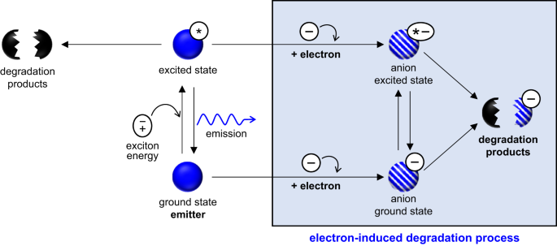
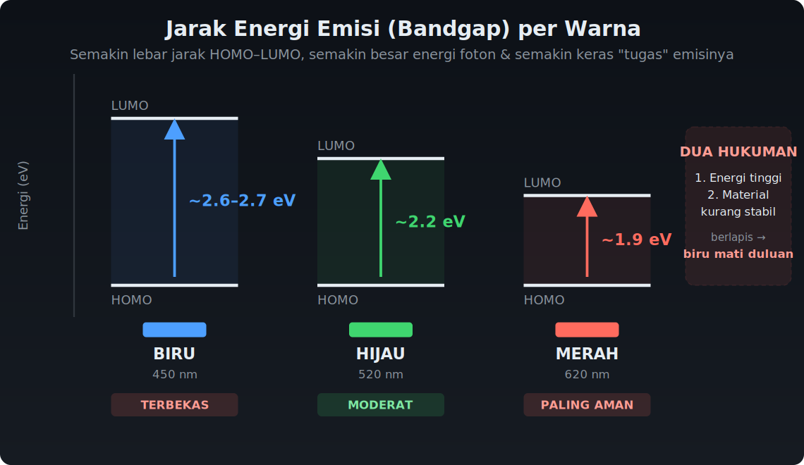
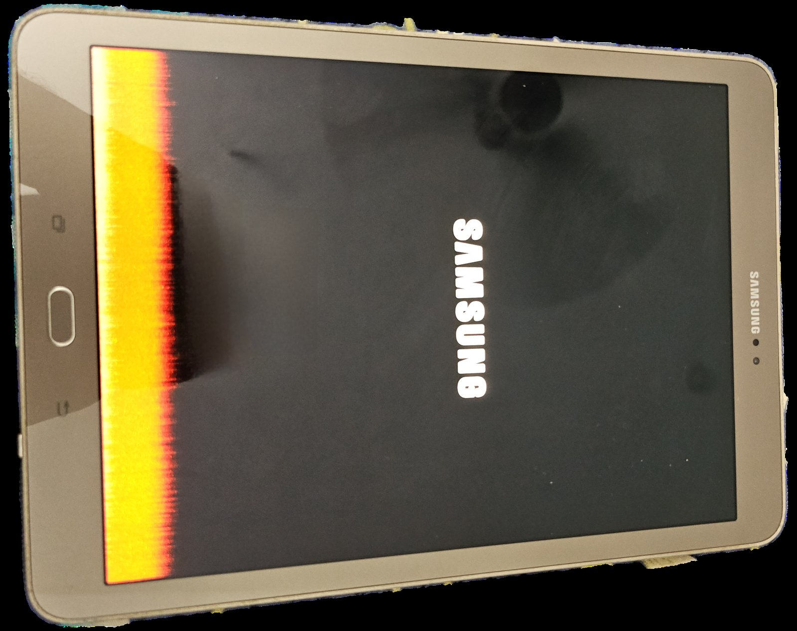
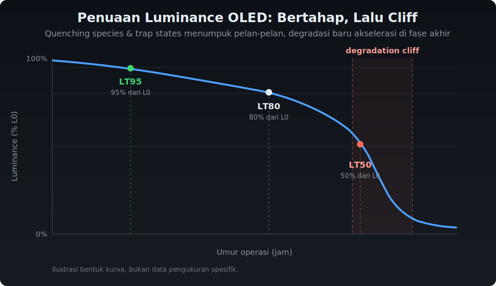
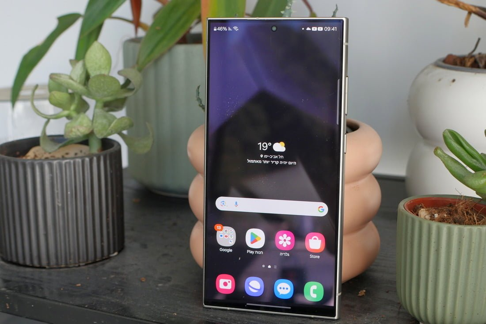
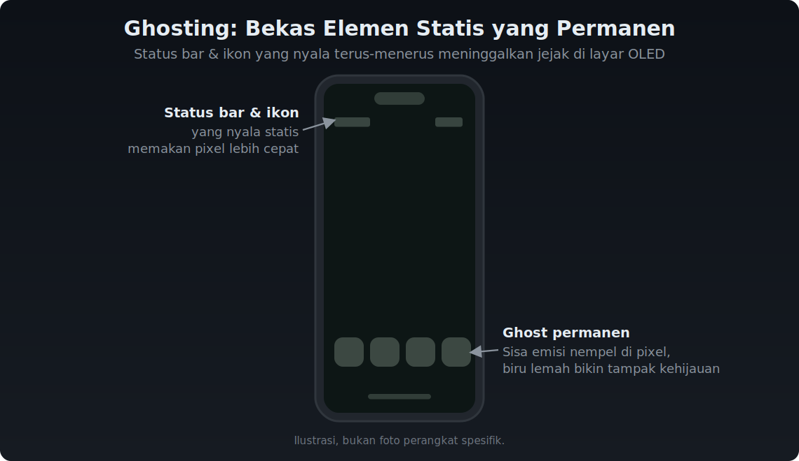

---
#Required fields
title: "Kenapa OLED Biru Cepat Mati? Degradasi, Burn-in, dan Breakthrough 2025"
description: "Kenapa piksel biru OLED selalu jadi korban? Dari mekanisme degradasi elektron, burn-in, sampai breakthrough 2025: blue phosphorescent LG dan TADF yang bikin umur OLED melompat."
pubDate: 2026-09-14
category: "deepdive"
cover: "../../assets/blog/DD_OLED/OLED-5-burn-in-example.jpg"
coverAlt: "Kenapa OLED Biru Cepat Mati? Degradasi, Burn-in, dan Breakthrough 2025"

#Core Fields
tags: ["OLED"]
author: "Thomas Agung Nugraha"
lang: "id-ID"

#recommended
slug: "oled-deepdive-5-lifetime-and-degradation"
excerpt: "Dari mekanisme degradasi elektron sampai blue phosphorescent LG 2025, saya jelaskan kenapa OLED biru cepat mati dan breakthrough apa yang akhirnya bikin umurnya melompat."
updatedDate: 2026-09-14

#Optional-series support
series: "OLED Deep Dive"
seriesOrder: 5

#Optional:SEO & Indexing
canonicalURL: "https://t-agung.id/blog/oled-deepdive-5-lifetime-and-degradation"
keywords:
  - lifetime OLED
  - burn-in OLED
  - blue OLED degradasi
  - PHOLED biru
  - TADF
  - LT95 OLED
noindex: false

#Optional-table-of-content
showToc: true

#optional-internal linking
relatedPosts:
  - oled-deepdive-4-luminous-evolution
  - oled-deepdive-6-manufacturing

draft: false
---

*Bagian 5 dari seri OLED Deep Dive*

Moko dulu sering tidur di atas laptop lama saya, yang layarnya OLED. Waktu masih baru, warnanya cerah banget. Sekarang udah agak pudar, terutama di area yang sering nyala. Kalau kamu perhatiin, warna yang bertahan paling lama biasanya merah sama hijau. Biru? Langsung hilang duluan.

OLED punya masalah persis sama: pixel biru selalu yang mati duluan. Dan ini bukan masalah kecil. Selama 25 tahun, seluruh industri display kejar-kejaran coba selesain ini.

Saya lihat sendiri efeknya. Waktu di Sony VAIO, kita kerjain tablet generasi pertama dengan panel OLED. Beberapa bulan dipakai, panel yang tadinya hitam pekat mulai kelihatan agak kehijauan di area logo yang nempel permanen. Saya bilang ke tim, "layarnya ada masalah." Mereka jawab, "nggak, itu normal. Biru yang udah lelah." Referensi pertama saya soal degradasi OLED bukan dari jurnal, tapi dari panel prototipe yang mulai ngeluarin warna yang nggak seharusnya.

Di bagian kelima dari seri deep dive OLED ini, kita bedah kenapa umur OLED selalu jadi masalah, kenapa biru adalah si korban paling setia, dan breakthrough 2025 yang bikin semuanya berubah. Kalau belum baca bagian sebelumnya soal evolusi material OLED, [cek Part 4 dulu](https://t-agung.id/blog/oled-deepdive-4-luminous-evolution), karena akar masalah biru ini justru ada di dunia material organik yang kita bahas di sana.

<i>Pixel biru butuh energi paling tinggi untuk emisi, membuatnya paling rentan terhadap degradasi. Elektron, bukan hole, yang jadi penyebab utama kerusakan.</i>

## Mengapa Biru Mati Lebih Cepat?

Jawabannya sederhana, tapi bikin pusing: semuanya soal energi.

Pixel biru butuh energi paling tinggi di antara tiga warna primer. Masih ingat diagram energi dari artikel sebelumnya? Biru punya panjang gelombang paling pendek, yang berarti foton biru membawa energi paling besar. Dalam dunia material organik, energi tinggi itu artinya potensi merusak yang lebih besar.

<i>Bandgap HOMO–LUMO per warna: biru ~2.6–2.7 eV, hijau ~2.2 eV, merah ~1.9 eV. Semakin lebar jaraknya, semakin besar energi foton dan semakin berat "tugas" emisinya.</i>

Secara angka, jarak energinya (bandgap) jelas beda: foton merah butuh ~1.9 eV, hijau ~2.2 eV, dan biru ~2.6 sampai 2.7 eV. Artinya, tiap foton biru yang dipancarkan, material emisif harus "ngeluarin" energi paling besar. Energi tinggi itu bikin ikatan kimia di molekul lebih gampang putus, lebih gampang bereaksi sama muatan listrik yang lewat, dan akhirnya lebih cepat rusak.

Tapi energi tinggi cuma separuh ceritanya. Ini bagian yang sering nggak disebut: biru kena **dua hukuman sekaligus**, bukan satu.

Pertama, hukuman energi. Seperti yang baru dijelaskan, foton biru butuh bandgap terbesar, jadi materialnya bekerja di bawah stres paling tinggi. Kedua, hukuman material. Selama 25 tahun, material biru yang stabil dan efisien cuma fluorescent, yang maksimal efisiennya 25 persen karena cuma bisa manfaatin eksiton singlet. Merah dan hijau sudah lama pakai phosphorescent yang manfaatin singlet plus triplet, efisiensi internal 100 persen. Material biru phosphorescent yang baru matang 2018 ke atas memang lebih baik, tapi ikatan kimianya masih lebih rentan dibanding red dan green yang sudah teruji bertahun-tahun.

Jadi bukan cuma "biru butuh energi lebih besar." Biru butuh energi lebih besar DAN pakai material yang lebih rapuh. Dua hukuman berlapis. Bayangin tiga orang yang lari setiap hari: merah di jalan datar, hijau di tanjakan ringan, biru di bukit terjal sambil bawa beban di punggungnya. Si biru pasti lebih cepat kelelahan, bukan karena dia lemah, tapi karena tugasnya memang paling berat dan dia berangkat dengan modal terburuk.

Penelitian di *Nature Communications* (Kim et al., 2023) menemukan sesuatu yang mengejutkan: elektron, bukan hole, yang jadi penyebab utama degradasi biru. Ini penting, karena selama ini fokus industri lebih ke manajemen hole transport. Penelitian ini membalikkan pemahaman lama dan membuka arah riset baru.

Secara angka, pixel biru mengalami degradasi 10 sampai 40 kali lebih cepat dibanding pixel merah atau hijau. Bayangin, kalau merah bisa bertahan 100.000 jam, biru cuma 2.500 sampai 10.000 jam. Itu kenapa layar OLED lama selalu kelihatan agak kehijauan, efeknya dari pixel biru yang sudah mulai lemah.

<i>Burn-in di tablet Samsung AMOLED: jejak permanen dari konten statis yang nyala berjam-jam, pixel di area itu sudah terlanjur "lelah" dan nggak bisa pulih. Source: Gannu03, CC BY-SA 4.0</i>

## Mengukur Umur OLED: LT50, LT80, LT95

Industri punya cara standar buat mengukur seberapa awet OLED. Yang paling umum:

- **LT50**, waktu sampai kecerlangan turun jadi setengah dari awal. Ini metrik paling konservatif.
- **LT80**, waktu sampai kecerlangan turun jadi 80 persen dari awal. Industri display biasanya pakai ini karena lebih realistis.
- **LT95**, waktu sampai kecerlangan turun jadi 95 persen dari awal. Ini standar yang lebih ketat, biasanya dipakai untuk aplikasi premium.

Semua metrik ini diukur pada kecerlangan awal tertentu, biasanya L0 = 1000 cd/m², yang setara dengan kecerlangan normal pemakaian sehari-hari.

Target industri untuk display konsumen: LT80 minimal 30.000 sampai 100.000 jam. Untuk TV, targetnya lebih tinggi, karena ukuran layar lebih besar berarti setiap pixel bekerja lebih keras.

Di Intel, saya lihat langsung standar yang berbeda-beda. Untuk konsumen, LT80 30.000 jam udah cukup. Untuk automotive? Targetnya minimal 100.000 jam, karena mobil itu investasi jangka panjang dan kokpit nggak bisa diganti sembarangan. Tim saya bahkan sempat terlibat di paten soal kompensasi arus display (EP3098699), intinya, kalau kita bisa prediksi dan kompensasi penurunan kecerlangan per pixel, umur efektif panel bisa diperpanjang tanpa ganti hardware. Di Motherson sekarang, logika yang sama dipakai buat HMI kendaraan yang harus tahan belasan tahun.

## Tiga Penyebab Utama Degradasi OLED

Penelitian di *Nature Communications* 2023 (Trindade et al.), pakai spektrometer massa Orbitrap resolusi tinggi, berhasil mengidentifikasi secara langsung degradasi kimiawi di antarmuka layer OLED. Hasilnya, ada tiga mekanisme utama:

### 1. Pembentukan Quenching Species

Saat OLED nyala, nggak semua eksiton berubah jadi cahaya. Sebagian berakhir jadi spesies kimia yang justru "memadamkan" emisi, disebut quenching species. Spesies ini terbentuk dari reaksi kimia antara material organik dan muatan listrik yang lewat. Semakin lama OLED nyala, semakin banyak quenching species menumpuk.

Rasanya kayak karat di besi. Awalnya belum kelihatan, terus pelan-pelan menyebar, sampai akhirnya besi itu rapuh dan nggak bisa dipakai lagi.

### 2. Trap Formation

Degradasi juga menciptakan "jebakan" atau trap states di dalam material. Trap ini menangkap elektron atau hole, lalu mereka nggak bisa lagi dipakai buat emisi cahaya. Hasilnya: efisiensi turun. Tapi yang lebih buruk lagi, trap yang terisi itu bisa jadi sumber panas lokal yang justru mempercepat degradasi lebih lanjut.

Trap formation itu kayak lubang di jalan. Awalnya satu dua lubang, mobil masih bisa lewat. Terus lubang makin banyak, makin dalam, sampai akhirnya jalan itu nggak bisa dipakai sama sekali. Dan yang bikin parah, lubang yang terisi air itu jadi licin, bikin mobil berikutnya lebih gampang jatuh.

### 3. Pengurangan Luminance

Akumulasi quenching species dan trap formation secara bertahap mengurangi kecerlangan. Yang menarik, penurunan ini nggak selalu linear. Kadang-kadang ada fase di mana degradasi berjalan pelan, terus tiba-tiba akselerasi. Ini disebut "degradation cliff" dan bikin prediksi umur OLED jadi lebih sulit.

Kamu punya lilin yang nyala perlahan. Awalnya nyala normal, terus pelan-pelan mengecil, terus tiba-tiba hampir mati total. Fase "hampir mati total" itu yang disebut degradation cliff.

<i>Kurva penuaan luminance: kecerlangan turun perlahan dari L0, melewati LT95, LT80, LT50, lalu degradasi akselerasi di fase akhir, yang disebut "degradation cliff."</i>

## Mengapa Biru PhOLED Susah?

Phosphorescent OLED (PhOLED) secara teori bisa mencapai efisiensi internal 100 persen karena bisa memanfaatkan singlet dan triplet eksiton. Merah dan hijau PhOLED sudah matang dan dipakai di panel komersial selama bertahun-tahun, Galaxy S24 Ultra dan iPhone 15 Pro Max itu contoh nyatanya.

<i>Galaxy S24 Ultra, pakai phosphorescent merah/hijau yang udah matang. Biru? Masih jadi mimpi yang udah lama banget.</i>

Masalah fundamentalnya: material biru phosphorescent harus punya triplet energy level yang sangat tinggi supaya bisa emit foton biru. Level energi tinggi itu berarti ikatan kimia yang lebih rentan terhadap reaksi dan kerusakan.

Data yang ada: sky blue PhOLED state-of-the-art mencapai LT80 sekitar 616 jam pada L0 1000 cd/m², menurut mini review di *CCS Chemistry* 2020 (Wang et al.). Angka ini jauh di bawah target display komersial yang butuh puluhan ribu jam.

Perusahaan Universal Display Corporation (UDC), pionir material PhOLED, sudah riset biru phosphorescent sejak lama. Dan akhirnya, tahun 2025, mereka berhasil. UDC bermitra sama LG Display dan memverifikasi komersialisasi panel biru PhOLED di lini produksi massal. LG Display menyebut ini "Dream OLED" dan mengumumkannya awal Mei 2025.

LORDIN, perusahaan material OLED Korea Selatan, juga mengklaim punya platform biru phosphorescent sendiri bernama ZRIET (berbasis platinum) dan menargetkan produksi massal akhir 2026. LORDIN bahkan sudah memulai proses IPO di KOSDAQ untuk mendanai komersialisasi.

## Breakthrough 2025: Biru PhOLED Akhirnya Nyampe

Tahun 2025 jadi tahun yang bersejarah untuk masalah biru. Dua breakthrough besar terjadi hampir bersamaan:

### University of Michigan, PEP-Assisted Tandem PhOLED

Tim Stephen Forrest di University of Michigan, yang sama dengan tim di belakang konsep PhOLED sejak awal, menerbitkan hasil di *Nature Photonics* 2025: biru PhOLED yang berhasil nyamain umur hijau PhOLED. Judulnya *"Stable, deep blue tandem phosphorescent organic light-emitting diode enabled by the double-sided polariton-enhanced Purcell effect."* EQE-nya 36,8 persen, dan yang paling penting, ini "memindahkan biru ke dalam domain umur hijau."

Kunci mereka: Polariton-Enhanced Purcell Effect (PEP). Mekanisme ini memanfaatkan kavitas polariton untuk mempercepat laju emisi radiatif. Intinya, dengan menempatkan material emisif di dalam struktur optik tertentu, foton bisa keluar lebih cepat sebelum sempat merusak material.

Coba bayangin antrian di kasir yang macet. Orang di belakang makin lama makin kesal. Sekarang kasirnya tambah jadi tiga, antrian langsung lancar. PEP itu kerjaannya kayak menambah kasir: foton yang sebelumnya numpuk dan merusak material, sekarang keluar lebih cepat.

Hasilnya: LT90 mencapai 830 jam pada 500 cd/m² untuk struktur tandem. Angka ini masuk ke domain umur hijau PhOLED, yang selama ini jadi patokan.

### Deuterated Host, Tsinghua University

Riset lain di *Nature Communications* 2025 dari Tsinghua University menawarkan pendekatan berbeda: deuterated exciplex-forming host. Material host yang semua atom hidrogennya diganti deuterium (isotop hidrogen yang lebih berat).

Kenapa deuteration membantu? Ikatan C-D lebih kuat dari C-H, jadi material lebih stabil terhadap degradasi foto-kimiawi. Hasilnya: LT90 mencapai 370 dan 557 jam untuk dua variasi perangkat. Angka ini masih di bawah target komersial, tapi menunjukkan bahwa deuteration punya potensi.

### Perspektif Forrest

Stephen Forrest menulis perspektif di *Advanced Materials* 2025 berjudul "OLED Displays Singing with the Blues". Ia memproyeksikan bahwa jika PSF (phosphor-sensitized fluorescence) OLED dimasukkan ke struktur tandem, umur hidupnya bisa meningkat 206 kali lipat dari baseline Marcus theory projection. Ini angka proyeksi, bukan hasil terukur, tapi menunjukkan arah yang menjanjikan.

## TADF: Jalan Alternatif?

Thermally Activated Delayed Fluorescence (TADF) menawarkan jalan alternatif karena bisa mencapai efisiensi tinggi tanpa logam berat. Tapi masalah biru TADF juga sama: energi tinggi sama dengan stabilitas rendah.

Progres biru TADF memang ada, tapi secara umum lifetime-nya masih di kisaran ratusan sampai seribu jam, jauh di bawah target komersial. Beberapa tim riset sudah berhasil mendekati angka seribu jam untuk deep blue TADF, tapi hasilnya masih di tahap eksperimen.

Kesimpulannya, TADF biru belum siap produksi massal.

## Strategi Industri Saat Ini

Sambil menunggu biru PhOLED matang, industri pakai beberapa strategi:

### Dimming

Turunkan kecerlangan biru secara selektif. Kalau merah dan hijau dinyalakan di 100 persen, biru cuma 70-80 persen. Ini memangkas degradasi tapi mengorbankan akurasi warna.

### Subpixel Arrangement

Beberapa desain panel mengatur ulang susunan subpixel supaya beban pixel biru lebih ringan. OLED dengan subpixel pentile atau pen arrangement adalah contoh.

### Tandem Stacking

Struktur tandem, dua atau lebih layer emisif ditumpuk, membagi beban emisi. Setiap layer cuma perlu kerja separuh, jadi degradasi lebih lambat. Ini sudah dipakai di TV OLED kelas atas LG, dan juga iPad Pro M4 (tandem pertama dari Apple, 2024) yang menumpuk dua layer emisif buat brightness dan umur ekstra.

### DuPont Million-Hour Material

DuPont mengklaim punya material OLED yang mencapai lifetime jutaan jam di kondisi lab. Klaim ini menarik, tapi belum ada publikasi peer-review yang verifikasi angka spesifik untuk biru.

## Biru Belum Kalah, Tapi Belum Menang

Dengan breakthrough PEP-assisted tandem dari Michigan dan komersialisasi LG Display + UDC di 2025, ada alasan untuk optimis. Tapi beberapa tantangan tetap ada:

- Biaya material biru PhOLED masih jauh lebih tinggi dari fluoresen biru konvensional
- Proses fabrikasi perlu diadaptasi untuk material baru
- Lifetime di kondisi lab belum tentu sama di panel komersial ukuran besar

Yang jelas, 25 tahun kejar-kejaran biru OLED mungkin akhirnya nyampe garis finis. Atau setidaknya, nyampe area yang cukup dekat.

> **Di mana teknologi ini hidup hari ini (Bagian 5):**
> 
> - **Burn-in nyata:** kasus ghosting di status bar dan area dock sudah banyak dilaporkan di iPhone X; Galaxy S7 juga terkenal gampang burn-in.

<i>Ghosting di layar OLED: status bar dan ikon di dock yang nyala terus-menerus meninggalkan bekas permanen. Ilustrasi.</i>

> - **Pixel refresher & compensation:** TV OLED LG bawa fitur Pixel Refresher; Samsung pakai ASBL/logo dimming. Semua OLED TV modern bawa ini.
> - **Tandem untuk umur:** TV OLED LG & iPad Pro M4, plus MacBook Pro (dikabarkan pakai tandem OLED mulai 2026; masih tahap rumor/future, belum ada konfirmasi resmi dari Apple).
> - **Biru PhOLED “Dream OLED”:** panel LG Display + UDC sudah diverifikasi di lini produksi massal Mei 2025, tapi belum masuk TV bernama merek tertentu. Sampai hari ini belum ada produk konsumen yang jual biru PhOLED.

## Intinya

Pixel biru OLED mati lebih cepat karena dua hal yang berlapis: energi tinggi yang dibutuhkan untuk emisi biru merusak material organik lebih cepat, dan selama 25 tahun material biru yang tersedia memang lebih rapuh daripada red dan green. Dua hukuman ini bikin biru selalu jadi korban pertama. Ini bukan masalah desain, tapi masalah fisika fundamental, dan selama 25 tahun, seluruh industri display bekerja keras untuk mengatasinya.

Tahun 2025 menunjukkan progres nyata: PEP-assisted tandem berhasil nyamain umur hijau, deuterated host menawarkan jalur alternatif, dan LG Display + UDC memverifikasi komersialisasi biru PhOLED. Masalah biru belum sepenuhnya selesai, tapi sudah jauh lebih dekat ke penyelesaian.

Di bagian berikutnya, kita bakal pindah dari masalah ke solusi, bagaimana seluruh OLED ini diproduksi di pabrik. Dari mother glass sampai FMM, dari vacuum evaporation sampai inkjet printing. [Cerita manufaktur OLED](https://t-agung.id/blog/oled-deepdive-6-manufacturing) nggak kalah menarik dari ceritanya.

Dan soal Moko? Laptop lama itu masih ada, panelnya udah agak redup. Moko dulu suka tidur di atasnya, nggak peduli sama degradasi material biru, buat dia yang penting permukaannya hangat. Tapi buat kita yang peduli, sekarang ada alasan buat optimis: pixel biru akhirnya punya harapan lebih baik.

---

*Seri OLED Deepdive akan berlanjut dengan pembahasan: Manufaktur OLED, QD-OLED, OLED di automotive, dan cutting-edge OLED 2026.*

### Sumber Referensi

1. Kim et al., "Critical role of electrons in the short lifetime of blue OLEDs," *Nature Communications* 14, 7508 (2023), https://www.nature.com/articles/s41467-023-43408-7
2. Trindade et al., "Direct identification of interfacial degradation in blue OLEDs by mass spectrometry," *Nature Communications* 14, 8066 (2023), https://www.nature.com/articles/s41467-023-43840-9
3. Wang et al., "Degradation Mechanisms in Blue Organic Light-Emitting Diodes," *CCS Chemistry* 2, 1278–1296 (2020), https://doi.org/10.31635/ccschem.020.202000271
4. Forrest, Arneson & Zhao, "Perspective: OLED Displays Singing with the Blues," *Advanced Materials* 38, e202519327 (2025), https://doi.org/10.1002/adma.202519327
5. Yuan et al., "High-efficiency and long-lifetime deep-blue phosphorescent OLEDs using deuterated exciplex-forming host," *Nature Communications* 16, 4446 (2025), https://www.nature.com/articles/s41467-025-59583-8
6. LG Display, "LG Display Becomes World's First to Verify Commercialization of Blue Phosphorescent OLED Panels" (May 2025), https://www.prnewswire.com/news-releases/lg-display-becomes-worlds-first-to-verify-commercialization-of-blue-phosphorescent-oled-panels-302442671.html
7. LORDIN, "LORDIN aims to start mass producing its ZRIET platinum phosphorescence blue OLED emitters by the end of 2026" (2025), https://oled-info.com/beeoled
8. University of Michigan, "Efficiency upgrade for OLED screens: A route to blue PHOLED longevity" (2025), https://news.umich.edu/efficiency-upgrade-for-oled-screens-a-route-to-blue-pholed-longevity/
