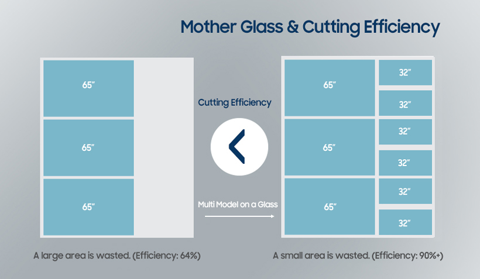
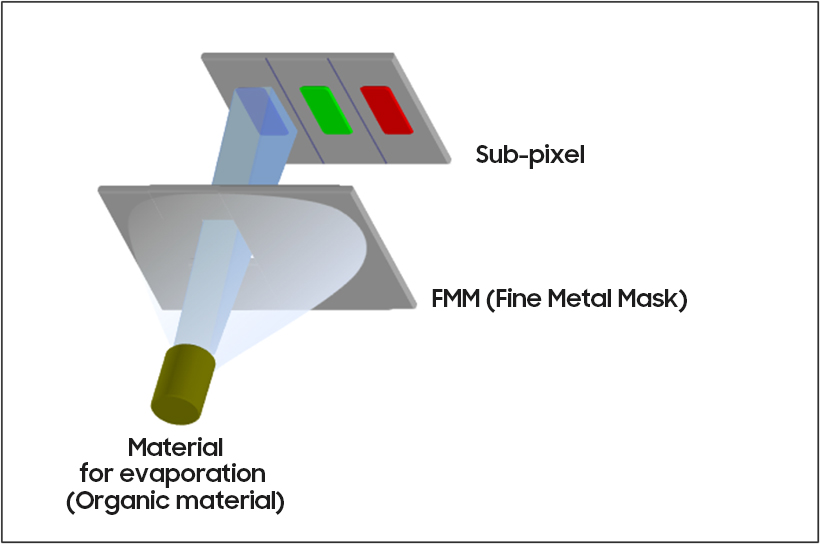
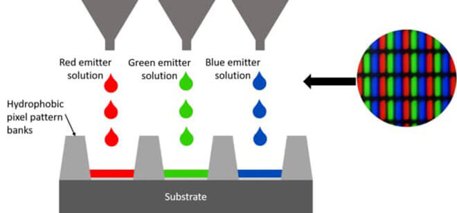
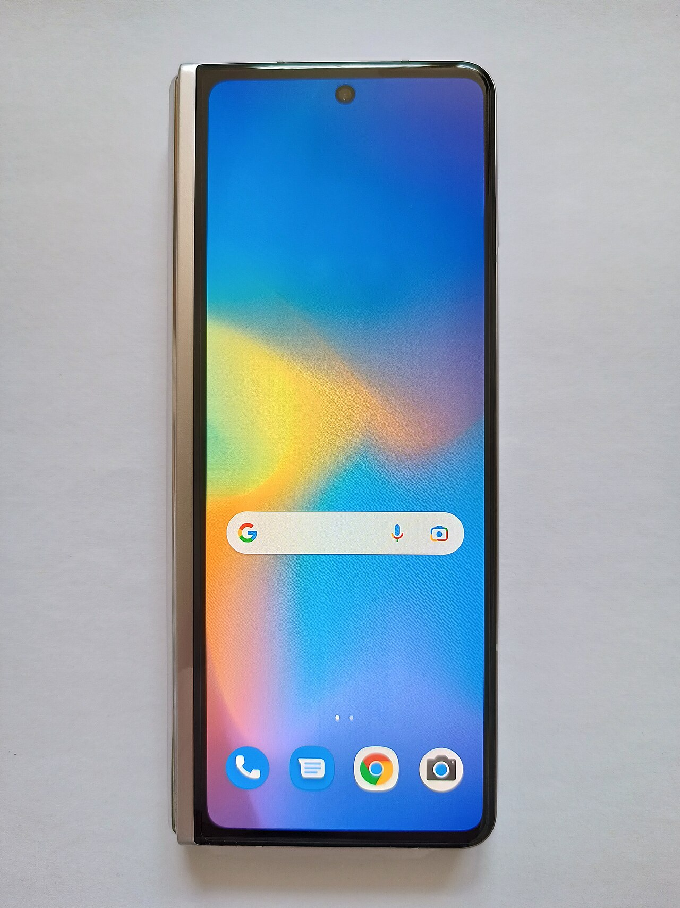

---
#Required fields
title: "Kenapa OLED Mahal? Rahasia di Balik Lini Produksi yang Bikin Insinyur Pusing"
description: "Dari mother glass Gen 8.5 dan 8.6 sampai FMM yang presisinya bikin pusing, kenapa bikin OLED itu susah dan mahal? Plus masa depan: oxide backplane, tandem stack, maskless, dan kapan OLED murah."
pubDate: 2026-09-16
category: "deepdive"
cover: "../../assets/blog/DD_OLED/OLED-6-mother-glass.jpg"
coverAlt: "Kenapa OLED Mahal? Rahasia di Balik Lini Produksi yang Bikin Insinyur Pusing"

#Core Fields
tags:
  - oled
  - oled-manufacturing
  - oled-deepdive-6-manufacturing
  - display-technology
  - manufacturing
  - deepdive
  - deep-dive
  - t-agung

#recommended
author: "Thomas Agung Nugraha"
lang: "id-ID"
slug: "oled-deepdive-6-manufacturing"
excerpt: "Dari mother glass Gen 8.6 sampai FMM yang presisinya bikin pusing, saya jelaskan kenapa memproduksi OLED itu susah dan mahal, plus kapan harganya mulai turun."
updatedDate: 2026-09-12

#Optional-series support
series: "OLED Deep Dive"
seriesOrder: 6

#Optional:SEO & Indexing
canonicalURL: "https://t-agung.id/blog/oled-deepdive-6-manufacturing"
noindex: false

#Optional-table-of-content
showToc: true

#optional-internal linking
relatedPosts:
  - oled-deepdive-5-lifetime-and-degradation
  - oled-deepdive-7-quantum-dot-qd-oled

draft: true
---

*Bagian 6 dari seri OLED Deep Dive*

Saya pernah duduk di meeting room di Tokyo pas masih di tim Sony Mobile / Xperia. Diskusi soal LCD, liquid crystal, backlight, semua sudah mature, yield tinggi, harga terus turun. Terus ada yang tanya: kenapa nggak pindah ke OLED? Jawabannya waktu itu sederhana: karena bikin OLED itu seperti mencoba menabur butiran pasir sehalus debu di atas kain yang bergerak.

Dulu Moko suka rebahan di sofa, ngelihat saya main HP yang make OLED, dan dia cuma mikir: "wah, layar bagus." Dia nggak mikir di balik layar itu ada proses manufaktur yang bikin insinyur di seluruh dunia pusing tujuh keliling. Sekarang sofa itu masih ada, tapi yang suka tidur ngerebah diatasnya udah nggak ada.

## Mother glass dan generasi fab: loyang kue yang semakin gede

Mother glass itu kayak loyang buat bikin kue. Loyang kecil (Gen 4) bisa bikin beberapa kue sekali panggang. Loyang gede (Gen 10.5) bisa bikin puluhan kue sekaligus. Masalahnya, loyang yang lebih besar itu lebih gampang retak, lebih susah dipindah, dan kalau satu sisi gosong, banyak kue yang ikut terbuang.

Industri display mengukur "ukuran loyang" itu dengan sebutan generasi. Gen 4 itu sekitar 1000 x 1200 mm. Gen 6: 1500 x 1800 mm. Gen 8.5: 2200 x 2500 mm. Gen 10.5: 2940 x 3370 mm. Gen 11: 3000 x 3400 mm. 

Semakin besar mother glass, semakin banyak panel yang bisa di-cuts dari satu keping, dan biaya per panel turun drastis. Ini sama logikanya untuk LCD dan OLED. Tapi semakin besar juga artinya semakin rentan terhadap defect. Satu goresan kecil di tengah gelas bisa bikin seluruh keping itu reject. Yield rate, persentase panel yang lolos quality control, jadi metrik paling kritis di industri ini.

Samsung Display duluan di Gen 6 untuk TV OLED (A3). LG Display bikin TV OLED di Gen 8.5. BOE (China) punya lini Gen 8.5 untuk OLED dan sedang bangun Gen 8.6 untuk IT OLED (laptop, tablet, monitor), bukan untuk TV. Gen 10.5 itu untuk LCD, bukan OLED. Generasi ini bukan cuma soal ukuran: setiap lompatan generasi itu investasi miliaran dolar untuk fab baru, dan keputusan yang diambil di sini menentukan posisi kompetitif perusahaan selama 10 tahun ke depan.

### Kenapa TV OLED masih di Gen 8.5, dan IT OLED lompat ke Gen 8.6?

TV 55 inci ke atas butuh mother glass yang cukup besar supaya jumlah waste di edges minimal. LG bikin TV OLED (termasuk 77 inci) di Gen 8.5, satu sheet Gen 8.5 bisa di-cuts jadi beberapa panel 55-77 inci dengan waste di edges. Samsung bikin QD-OLED TV di Gen 6 (A3), lebih kecil, tapi yield-nya sudah cukup untuk TV. Sementara itu, untuk IT OLED (laptop, tablet, monitor), industri sedang lompat ke Gen 8.6 (2290 x 2620 mm), Samsung A6 (Asan) dan BOE B16 (Chengdu) mulai mass production 2026. Kalau kamu beli TV OLED 77 inci, panelnya kemungkinan besar di-cuts dari sheet Gen 8.5, bukan Gen 10.5.

### Generasi dan aplikasi

- **Gen 4 dan 6:** smartphone, tablet, laptop kecil (Gen 6 juga TV OLED Samsung A3)
- **Gen 8.5:** TV OLED besar (LG WOLED), laptop, monitor
- **Gen 8.6:** IT OLED 2026+ (laptop, tablet, monitor) - Samsung A6, BOE B16
- **Gen 10.5:** LCD TV besar (bukan OLED)

<i>Mother glass: lembaran kaca besar yang di-cut jadi puluhan panel. Makin besar generasinya, makin besar lembarkannya, dan makin mahal.</i>

## FMM: mask berongga yang presisinya bikin pusing

FMM, atau Fine Metal Mask, adalah mask berlubang-lubang super kecil yang dipakai di proses evaporation. Bayangkan kamu punya stensil buat nyablon kaos: kamu taruh stensilnya, semprot cat, hasilnya pola yang presisi. Tapi bayangkan stensilnya ukuran billboard dan harus presisi di level mikrometer. Sedikit melengkung saja, hasilnya berantakan.

FMM itu stensilnya. Lubang-lubangnya selebar 10-20 mikrometer, tebalnya cuma 10-50 mikrometer. Saat material evaporated, material yang lolos lubang membentuk sub-pixel R, G, B di panel di bawahnya. Presisinya harus ekstrem: kalau lubang miring 1 derajat saja, warna merah bisa numpuk di sub-pixel hijau, dan panel jadi cacat.

<i>Fine Metal Mask: lembaran logam berlubang-lubang selebar mikrometer. Lewat stensil ini pola sub-pixel R, G, B terbentuk.</i>

### Kenapa FMM mahal?

FMM dibuat dari Invar (paduan besi-nikel ~36% nikel) yang di-fab dengan electroforming, bukan di-etch. Proses fabrikasinya sendiri memakan waktu berminggu-minggu untuk satu mask. Biayanya bisa mencapai ratusan ribu dolar per mask (estimasi industri, angka persis nggak dipublikasikan). Dan mask itu punya umur pakai terbatas: setelah beberapa ribu panel, lubang-lubangnya mulai aus dan presisinya turun.

Ini jadi bottleneck besar di industri OLED. Makin banyak panel yang dibutuhkan, makin banyak FMM yang harus diproduksi, dan makin tinggi biaya per panel. Beberapa perusahaan sudah bereksperimen dengan maskless untuk bypass FMM sama sekali. Kabar baiknya: LG Display baru saja announce FLiPP (FMM-Less innovative Pixel Patterning) di IMID 2026, dan sedang mengonversi sebagian fab 8-Gen WOLED di Paju ke proses maskless. Applied Materials juga punya MAX OLED yang sudah di-order ulang oleh beberapa produsen display besar. Tapi belum ada yang beneran komersial di scale penuh.

### FMM vs maskless

| Aspek                | FMM                       | Maskless (inkjet, photonic)    |
| -------------------- | ------------------------- | ------------------------------ |
| Resolusi             | Sangat tinggi (sub-10 μm) | Terbatas, bergantung nozzle    |
| Biaya per unit       | Turun di volume besar     | Belum terbukti di scale        |
| Fleksibilitas desain | Kaku (mask fix)           | Lebih fleksibel                |
| Umur pakai           | Terbatas (aus)            | Tidak relevan (tidak ada mask) |
| Status 2026          | Standar industri          | R&D / pilot line               |

<i>Maskless inkjet printing: emitter R, G, B di-jet langsung ke pixel bank tanpa stensil. Ini jalur buat lepas dari biaya FMM.</i>

## Evaporation: menabur pasir di atas kain yang bergerak

Proses evaporation di OLED itu mirip bikin lapisan tipis dari logam di dalam ruang hampa. Material (emitter, transport layer, electrode) dipanaskan sampai menguap, dan uap itu mengendap di substrate di bawahnya. Suhu ruang hampa sekitar 10^-6 Torr, dan prosesnya harus berjalan dengan kecepatan dan ketebalan yang sangat terkontrol.

Kebanyakan emiter OLED butuh ketebalan film 100-300 nanometer, atau sekitar 1/1000 dari ketebalan rambut manusia. Variasi ketebalan di atas 5% sudah bisa bikin brightness dan warna tidak merata. Ini yang bikin proses evaporation jadi salah satu langkah paling kritis di lini produksi.

### Evaporator source

Material di-heat di dalam tungku evaporator yang bisa mencapai 800-1500°C tergantung materialnya. Uap yang dihasilkan di-guide menuju substrate lewat FMM. Kecepatan evaporasi, suhu tungku, dan jarak antara source dan substrate semuanya harus dikalibrasi dengan presisi ekstrem.

### Rate monitor dan feedback control

Di atas substrate ada sensor yang mengukur ketebalan film secara real-time. Sistem feedback control menjaga agar ketebalan tetap di target sepanjang proses. Kalau deviasi terlalu besar, batch itu di-flag sebagai suspect dan di-inspeksi lebih lanjut.

## Tandem OLED: menumpuk lapisan untuk umur lebih panjang

Tandem OLED itu dua (atau lebih) stack emiter yang di-tumpuk secara vertikal. Stack pertama emit warna tertentu, stack kedua emit warna lain, dan cahaya dari keduanya di-combine untuk menghasilkan warna yang diinginkan. Manfaat utamanya: umur lebih panjang. Kalau satu stack degrade, stack lain masih bisa carry beban. Hasilnya, total brightness drop lebih lambat.

Tandem sudah jadi standar di TV OLED premium 2023 ke atas. LG G5 (2025) adalah TV tandem pertama yang mainstream, dan LG G6 (2026) pakai "Primary RGB Tandem 2.0" yang disebut-sebut sebagai OLED tercerah sampai sekarang, dengan stack 4 lapis yang sampai 3.9x lebih terang dari panel non-tandem. Samsung QD-OLED (S95F 2025) juga tandem. Di smartphone, tandem mulai muncul di flagship 2025-2026, tapi masih terbatas karena biaya.

### Arsitektur tandem

- **Dual-stack:** dua emiter di-tumpuk, paling umum
- **Triple-stack:** tiga emiter, untuk aplikasi yang butuh umur ekstrem (mobil, komersial)
- **Tandem blue + phosphorescent:** kombinasi blue phosphorescent dengan stack lain untuk efisiensi dan warna

Tandem bukan cuma soal umur: juga soal efisiensi. Dua stack bisa emit di kondisi yang lebih optimal, sehingga CDR (current driving ratio) lebih baik. Tapi biaya material dan proses meningkat karena ada dua kali evaporation pass.

## Oxide backplane: transistor yang bikin OLED lebih efisien

OLED butuh transistor untuk switch setiap sub-pixel on/off. Transistor ini ada di backplane, lapisan TFT (thin film transistor) yang di-deposit di bawah stack OLED. Untuk tahun-tahun awal, backplane OLED pakai a-Si (amorphous silicon). Masalahnya: mobilitas a-Si rendah, sekitar 0.3-1 cm²/Vs, yang bikin transistor lambat dan boros daya.

Oxide TFT, khususnya IGZO (indium gallium zinc oxide), punya mobilitas 10-50x lebih tinggi. Artinya transistor bisa lebih kecil, switching lebih cepat, dan standby power lebih rendah. 

Samsung, LG, BOE, dan Sharp sudah semua pindah ke oxide backplane untuk lini OLED terbaru. Untuk smartphone, oxide backplane sudah jadi standar di flagship. Untuk TV, adopsi masih bertahap karena biaya fab, tapi trennya jelas.

### Oxide vs a-Si

| Parameter          | a-Si               | IGZO oxide        |
| ------------------ | ------------------ | ----------------- |
| Mobilitas (cm²/Vs) | 0.3-1              | 10-50             |
| Uniformitas        | Baik               | Lebih baik        |
| Stabilitas termal  | Sedang             | Tinggi            |
| Biaya fab          | Lebih murah        | Lebih mahal       |
| Aplikasi 2026      | Panel murah, entry | Flagship, premium |

## Yield rate: metrik yang menentukan segalanya

Di industri panel, yield rate itu raja. Kalau kamu bikin 100 panel dan 70 yang lolos QC, yield-mu 70%. Kalau 40 yang lolos, yield-mu 40%. Selisih 30% itu langsung menggerus margin secara signifikan.

Yield OLED secara historis lebih rendah dari LCD, terutama di generasi awal. Defect yang umum:

- **Streak defect:** garis tipis di panel, biasanya dari partikel di evaporator
- **Bright/dark spot:** titik yang lebih terang atau gelap, biasanya dari foreign particle
- **Color uniformity:** warna tidak merata, biasanya dari variasi ketebalan film
- **Burn-in precursors:** area yang sudah menunjukkan tanda degrade dini

Setiap defect type punya countermeasure di lini produksi, tapi yang paling efektif adalah mencegah defect sebelum terjadi: clean room yang lebih bersih, filter udara yang lebih ketat, dan proses evaporation yang lebih stabil.

### Kenapa yield OLED susah naik?

Beberapa faktor:

1. **Sensitivitas terhadap partikel:** lapisan OLED sangat tipis, partikel sekecil 1 μm sudah bisa bikin defect
2. **FMM wear:** mask yang aus bikin variasi presisi antar panel
3. **Material variability:** batch ke batch, material emiter bisa punya sifat berbeda
4. **Multi-layer stack:** semakin banyak layer, semakin banyak peluang defect

## Kapan OLED murah?

Jawabannya: sudah mulai. Tapi bukan langsung murah dan harga jatoh.

Tren harga OLED TV terus turun. 65 inci turun dari $4,499 (G3 2023) ke $3,399 (G5 2025), sekitar 25% dalam 2 tahun. 55 inci turun dari sekitar $3,500 (C7 2023) ke $1,800 (C5 2025), hampir separuh dalam waktu yang sama. 42 inci sekarang $1,399 (C5 2025), ukuran yang 5 tahun lalu belum ada di harga segini. Di smartphone, flagship OLED sudah jadi standar, dan mid-range mulai masuk. Yang belum murah adalah TV OLED ukuran besar (77 inci ke atas) karena biaya mother glass dan FMM masih dominan.

<i>Samsung S95D, TV QD-OLED flagship 2025. Tren harga OLED TV emang turun, tapi ukuran besar masih yang termahal.</i>

Faktor yang akan bikin OLED makin murah:

- **Skala produksi:** volume produksi IT-OLED (Gen 8.6) di Samsung A6 dan BOE B16 terus naik sejak 2026
- **Maskless tech:** kalau photonic inkjet atau electrophoretic berhasil di scale, FMM cost bisa di-eliminasi
- **Tandem efficiency:** tandem yang lebih efisien butuh lebih sedikit material per lumen
- **Oxide backplane:** transistor yang lebih efisien menurunkan standby power, yang penting untuk TV

Realistisnya: dalam 5 tahun, OLED TV 55 inci mungkin sudah seharga LCD 55 inci premium hari ini. Untuk 77 inci ke atas, mungkin 7-10 tahun. Smartphone OLED sudah murah, yang mahal tinggal TV besar.

## Di mana teknologi ini hidup hari ini (Bagian 6)

- **TV OLED:** Gen 8.5 (LG WOLED) / Gen 6 (Samsung QD-OLED), tandem stack, oxide backplane
- **Smartphone:** Gen 4-6, oxide backplane, tandem mulai masuk flagship 2025-2026
- **Laptop/monitor:** Gen 6-8.6, a-Si masih dominan di entry, oxide di premium
- **R&D:** maskless OLED (LG FLiPP mulai dikonversi di fab 8-Gen Paju, Applied Materials MAX OLED), tandem 4-stack (LG G6 2026), perovskite emitter

<i>Galaxy Z Fold series: layar lipat di atas IT OLED Gen 4-6. Tipis, fleksibel, dan presisinya harus ekstra.</i>

## Bottom line

Bikin OLED itu bukan soal menemukan material yang bisa nyala. Sudah ditemukan puluhan tahun lalu. Yang bikin mahal dan susah adalah proses manufakturnya: mother glass yang besar, FMM yang presisinya bikin pusing, evaporation yang harus stabil di level nanometer, dan yield rate yang harus terus dikejar.

Tapi trennya nggak bisa disangkal lagi. Setiap tahun, biaya turun, yield naik, dan aplikasi makin luas. Dalam beberapa tahun, "kenapa OLED mahal?" mungkin jadi pertanyaan yang nggak relevan lagi, karena harganya udah nggak mahal.

Di bagian berikutnya kita masuk ke QD-OLED: teknologi yang menggabungkan quantum dot dengan OLED, bikin warna lebih jernih dan efisiensi lebih tinggi. Tapi ada trade-off yang bikin insinyur pusing.

Kalau kamu suka deep dive teknis kayak gini, follow t-agung.id buat update dari dunia display dan teknologi.

---

> **Part 1** → [Bagian 1: Apa Itu OLED?](/blog/oled-deepdive-1-apa-itu-oled/)  
> **Part 2** → [Bagian 2: Passive vs Active Matrix](/blog/oled-deepdive-2-passive-vs-active-matrix/)  
> **Part 3** → [Bagian 3: Power Consumption & Refresh Rate](/blog/oled-deepdive-3-power-and-refresh-rate/)  
> **Part 4** → [Bagian 4: Luminous Evolution](/blog/oled-deepdive-4-luminous-evolution/)  
> **Part 5** → [Bagian 5: Lifetime & Degradasi](/blog/oled-deepdive-5-lifetime-and-degradation/)  

---

*Bagian 6 dari seri OLED Deep Dive. Ditulis oleh Thomas Agung (t-agung.id).*
