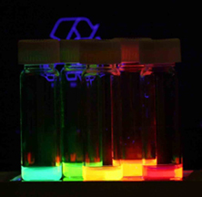
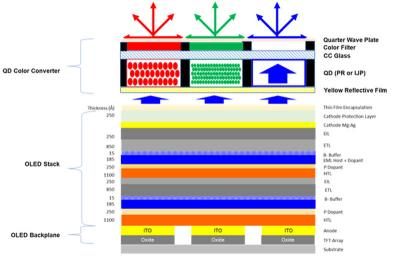
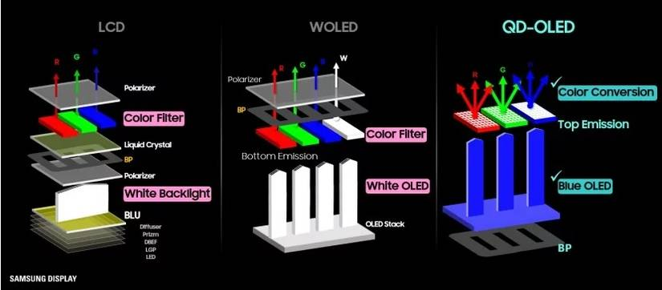
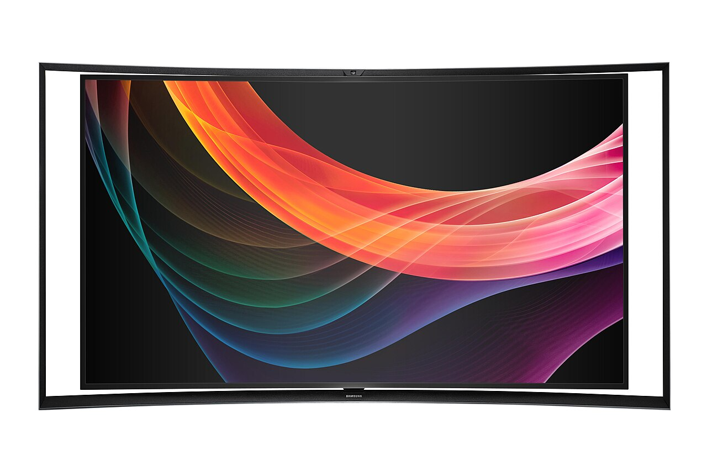
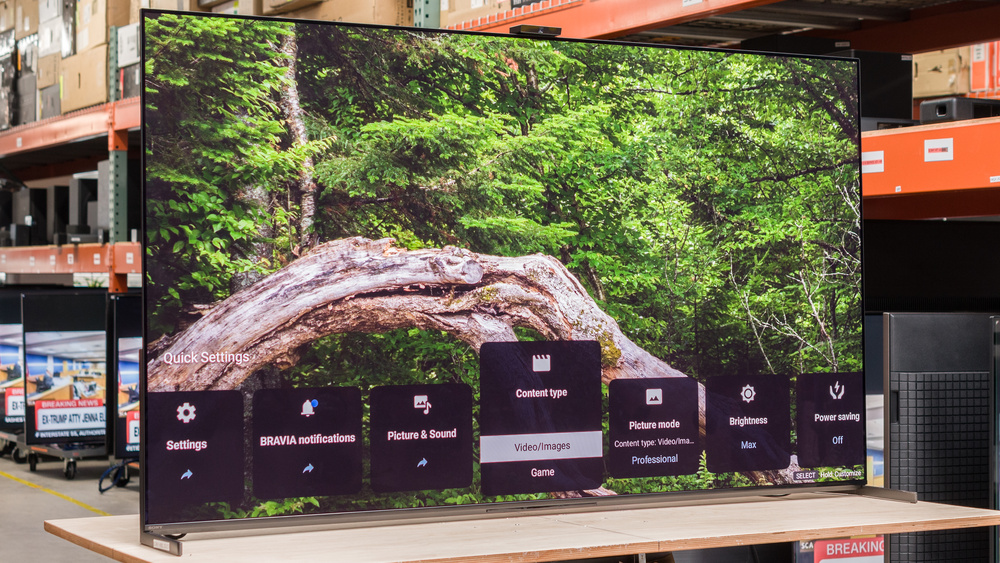

---
#Required fields
title: "Quantum Dot & QD-OLED: Kristal Ajaib yang Bikin Warna OLED Nggak Ada Tandingannya"
description: "Bedah quantum dot sebagai color converter: dari QDEF di TV LCD sampai QD-OLED yang gabungkan OLED biru dengan kristal nano untuk warna paling jenuh, plus regulasi cadmium yang berakhir 2025."
pubDate: 2026-09-18
category: "deepdive"
cover: "../../assets/blog/DD_OLED/OLED-7-quantum-dot-size.jpg"
coverAlt: "Quantum Dot & QD-OLED: Kristal Ajaib yang Bikin Warna OLED Nggak Ada Tandingannya"

#Core Fields
tags: ["OLED"]
author: "Thomas Agung Nugraha"
lang: "id-ID"

#recommended
slug: "oled-deepdive-7-quantum-dot-qd-oled"
excerpt: "Quantum dot ubah satu sumber cahaya biru jadi tiga warna presisi. Dari QDEF di LCD sampai QD-OLED dan regulasi cadmium yang berakhir November 2025."
updatedDate: 2026-09-18

#Optional-series support
series: "OLED Deep Dive"
seriesOrder: 7

#Optional:SEO & Indexing
canonicalURL: "https://t-agung.id/blog/oled-deepdive-7-quantum-dot-qd-oled"
keywords:
  - quantum dot OLED
  - QD-OLED Samsung
  - QDEF QDCF
  - cadmium-free RoHS 39a
  - EL-QD
  - color conversion
noindex: false

#Optional-table-of-content
showToc: true

#optional-internal linking
relatedPosts:
  - oled-deepdive-6-manufacturing
  - oled-deepdive-8-automotive-oled

draft: true
---

*Bagian 7 dari seri OLED Deep Dive*

Dulu, Moko suka banget sama mainan stiker yang kalau disinari senter, warnanya keluar terang banget. Suka dia nempelkan di dinding kamar, lalu nyalain lampu kecil dari atas. Langsung menyala. Kayak magic.

Quantum dot itu prinsipnya sama persis, cuma versi engineering-grade yang presisinya bikin insinyur bisa tidur nyenyak. Ukurannya bisa diatur dalam satuan nanometer, dan warnanya keluar persis seperti yang kamu minta. Bukan sekadar "dekat-dekatan", tapi tepat di panjang gelombang yang kamu targetkan.

Di bagian 6 kita bahas betapa rumitnya manufacturing OLED. FMM jadi bottleneck, yield masih jadi masalah, biaya produksi nggak murah. Nah, di sinilah quantum dot muncul sebagai solusi yang bikin banyak orang di industri display bilang "tunggu dulu, ada cara yang lebih efisien."

Kalau bikin warna dengan material fosfor tradisional itu kayak masak pakai bumbu yang rasanya sudah tetap, kamu nggak bisa ngatur seberapa pedasnya. Quantum dot itu lada yang kamu giling sendiri. Mau seberapa pedas, atur sendiri dari ukurannya.

## Cadmium-free sudah bukan pilihan, tapi keharusan

Sebelum masuk ke teknis, ada satu hal yang perlu kamu tahu: quantum dot generasi pertama pakai cadmium selenide (CdSe) yang memang toksik. Exemption RoHS entry 39(a) untuk cadmium selenide di display sudah HABIS November 2025. Artinya industri display sudah wajib beralih ke cadmium-free.

Ini bukan berita kecil. Ini berarti TV dengan QD-OLED atau QLED yang kamu beli sekarang, sudah pasti pakai quantum dot yang bebas cadmium. InP (Indium Phosphide) adalah alternatif paling matang, perovskite masih riset. Di bagian belakang kita bahas detailnya.

## Quantum Dot: Fisika Kuantum dalam Genggaman

### Apa itu quantum dot?

Quantum dot adalah kristal semikonduktor yang ukurannya 2 sampai 10 nanometer. Sekitar 10.000 kali lebih kecil dari diameter rambut manusia. Di ukuran segitu, fisika yang berlaku sudah bukan fisika klasik, tapi fisika kuantum, dan dari situlah namanya berasal.

Yang bikin quantum dot spesial: warna cahaya yang dipancarkan sepenuhnya ditentukan oleh ukurannya. Bukan materialnya. Bukan komposisi kimianya. Ukurannya.

Quantum dot yang lebih kecil memancarkan cahaya biru. Yang sedang memancarkan hijau. Yang lebih besar memancarkan merah.

Alasannya adalah efek quantum confinement. Elektron di dalam kristal nanoskopis ini terkurung dalam ruang yang sangat kecil, dan jarak antara level energi elektronik berubah sesuai ukuran partikel.

Beberapa gitar punya senar dengan panjang yang berbeda. Senar pendek menghasilkan nada tinggi (biru), senar menengah menghasilkan nada menengah (hijau), dan senar panjang menghasilkan nada rendah (merah). Material senarnya sama, tapi panjangnya yang beda bikin nadanya beda. Quantum dot mirip, cuma yang "dibunyikan" adalah foton cahaya bukan gelombang suara.

### Karakteristik yang bikin quantum dot berbeda dari fosfor biasa

**Spektrum emisi sangat sempit (narrow FWHM):** Quantum dot memancarkan cahaya di range panjang gelombang yang sangat spesifik. Spektrum emisi quantum dot merah bisa selebar 20 sampai 30 nanometer, sementara material fosfor tradisional bisa 50 sampai 100 nanometer. Spektrum yang lebih sempit berarti warna yang lebih murni dan jenuh.

**Efisiensi tinggi (PLQY besar):** Photoluminescence Quantum Yield quantum dot modern bisa di atas 90 persen, bahkan ada yang mencapai 95 persen. Artinya dari 100 foton biru yang masuk, 90 foton merah atau hijau yang keluar. Efisiensi ini jauh lebih baik dari color filter konvensional yang nyaris menyerap separuh cahaya.

**Tunable:** Dengan mengontrol ukuran kristal saat sintesis, kamu bisa "tune" warna yang dipancarkan dengan presisi tinggi. Tidak perlu ganti material, cukup ganti ukuran partikel.

### Quantum dot sebagai photon down-converter

Di display, quantum dot berperan sebagai down-converter atau color converter. Prinsipnya sederhana: quantum dot menyerap foton dengan energi tinggi (cahaya biru atau ultraviolet) dan memancarkan foton dengan energi lebih rendah (cahaya merah atau hijau).

Proses ini disebut photoluminescence. Foton biru masuk, elektron di quantum dot tereksitasi ke level energi lebih tinggi, lalu saat elektron kembali ke ground state, dia memancarkan foton baru yang energinya lebih rendah karena sebagian energi hilang sebagai panas.

Di konteks display, ini sangat berguna karena kamu cuma butuh satu sumber cahaya biru untuk menghasilkan tiga warna. Subpixel biru langsung pakai cahaya biru. Subpixel hijau dan merah pakai quantum dot yang mengkonversi cahaya biru ke hijau dan merah.

## Quantum Dot di LCD: QDEF dan QDCF

### QDEF (Quantum Dot Enhancement Film)

Sebelum masuk ke QD-OLED, kita harus paham dulu bagaimana quantum dot udah dipakai di LCD. Ini adalah penggunaan quantum dot yang paling luas di pasar saat ini, dan Samsung QLED TV yang kamu lihat di toko elektronik itu pada intinya adalah LCD dengan quantum dot, bukan OLED.

QDEF adalah film tipis yang berisi quantum dot merah dan hijau yang diletakkan di depan backlight LED biru. Cahaya biru dari LED masuk ke film, quantum dot mengkonversi sebagian cahaya itu ke merah dan hijau, dan hasil akhirnya adalah cahaya dengan spektrum yang lebih luas dan lebih jenuh dibandingkan white LED konvensional.

Keuntungan QDEF di depan white LED biasa:

- **Gamut warna lebih lebar:** Spektrum yang lebih sempit dari quantum dot berarti warna yang lebih murni. TV QLED dengan QDEF bisa mencapai coverage BT.2020 yang lebih besar dari LCD konvensional.
- **Efisiensi lebih baik:** Daripada pakai white LED yang sudah "kontaminasi" dengan beberapa warna, kamu punya sumber biru yang lebih murni dan konversi yang lebih efisien.
- **Color volume di brightness tinggi lebih terjaga:** Karena sumbernya lebih efisien, warna tetap jenuh bahkan di brightness yang sangat tinggi.

### QDCF (Quantum Dot Color Filter)

QDCF atau QDCC adalah langkah evolusi berikutnya. Daripada taruh quantum dot sebagai film besar di depan backlight, kamu taruh quantum dot langsung di level subpixel, menggantikan color filter konvensional.

Cahaya biru masuk ke panel. Subpixel biru transparan, jadi cahaya biru langsung lewat. Subpixel merah berisi quantum dot merah yang mengkonversi cahaya biru jadi merah. Subpixel hijau berisi quantum dot hijau yang mengkonversi cahaya biru ke hijau.

Perbedaan fundamental dari QDEF: QDCF ngeliminasi color filter sama sekali. Color filter konvensional menyerap cahaya yang nggak sesuai warnanya. Tapi quantum dot sebagai color converter ngubah cahaya, bukan menyerapnya. Artinya lebih banyak cahaya yang sampai ke mata kamu.

Tapi ada tantangan besar: kamu harus pattern quantum dot di level subpixel. Ini bukan gampang-gampang.

### Patterning quantum dot di level subpixel itu sulit

Untuk bikin QDCF, kamu perlu deposit quantum dot merah di posisi subpixel merah, quantum dot hijau di posisi subpixel hijau, dan begitu seterusnya. Presisi yang dibutuhkan setara dengan patterning di level manufacturing semiconductor.

Teknik yang lagi diteliti dan dikembangin:

- **Inkjet printing:** Cetak quantum dot drop-by-drop di posisi yang tepat. Keuntungan: tidak perlu mask, fleksibel, dan bisa di-scale. Tantangan: uniformity setiap tetes dan coffee-ring effect.
- **Photolithography:** Teknik patterning konvensional dari industri semiconductor. Keuntungan: presisi tinggi. Tantangan: proses yang panjang dan cost tinggi.
- **Microfluidic dispensing:** Mengalirkan quantum dot melalui channel mikro ke posisi target. Masih di tahap riset awal.

Kamu harus mengecat dinding dengan tiga warna, tapi setiap area warna harus presisi di level milimeter. Sedikit keluar dari batas, warnanya cross-talk. Dan kamu harus lakuin ini untuk jutaan pixel.

## Isu Cadmium: Yang Sudah Habis, yang Masih Tersisa

### Kenapa cadmium jadi masalah besar

Quantum dot generasi pertama dan yang paling populer itu berbasis cadmium selenide (CdSe). CdSe punya efisiensi tinggi, spektrum emisi sempit, dan udah diteliti puluhan tahun. Tapi cadmium adalah heavy metal yang toksik dan karsinogenik.

Di Eropa, regulasi RoHS (Restriction of Hazardous Substances) membatasi penggunaan cadmium di produk elektronik melalui sistem exemption yang berjangka.

### Regulasi yang sudah berubah

Ini bagian penting yang sering orang lewatkan: **exemption cadmium untuk quantum dot di display sudah HAKIS.**

Pada November 2025, exemption RoHS entry 39(a) untuk cadmium selenide di downshifting quantum dot display resmi berakhir setelah 16 tahun. Artinya produk elektronik dengan Cd-based QD yang dijual di Eropa sudah tidak punya pelindung lagi.

Yang masih tersisa hanya entry 39(b), exemption baru untuk cadmium quantum dot yang di-deposit langsung di atas chip LED untuk aplikasi display dan proyeksi, dan itu pun berakhir Desember 2027.

Jadi situasinya bukan lagi "ada tapi terbatas waktu." Situasi sebenarnya adalah industri display sudah harus beralih ke cadmium-free. Yang masih pakai cadmium itu karena regulasi di pasar non-Eropa yang belum ketat.

### Cadmium-free QD dan alternatif lain

Industri dan akademisi sudah banyak investasi di quantum dot yang bebas cadmium:

- **Indium phosphide (InP):** Ini alternatif cadmium-free yang paling matang. InP punya efisiensi yang sudah cukup baik dan spektrum emisi yang cukup sempit. Beberapa fab sudah mulai produksi quantum dot berbasis InP untuk QLED TV. Tapi efisiensinya masih di bawah CdSe, dan range warna yang bisa dicapai belum selebar CdSe.
- **Perovskite:** Material perovskite untuk color conversion layer lagi banyak diteliti. Keunggulan perovskite: layer-nya bisa jauh lebih tipis daripada film QD konvensional, dan efisiensi photoluminescence-nya sudah di level yang kompetitif. Tantangan: stabilitas jangka panjang. Perovskite sensitif terhadap kelembaban dan panas, dan masih perlu enkapsulasi yang sangat baik.
- **Carbon dot dan graphene quantum dot:** Masih di tahap riset awal, tapi menjanjikan dari sisi non-toxic dan biaya produksi rendah.

Cadmium-based quantum dot itu kayak bensin. Efisien, sudah matang, dan infrastrukturnya lengkap. Tapi semua orang tahu dampaknya, dan industri sedang beralih ke listrik. InP kayak mobil listrik pertama, sudah bagus tapi belum se-smooth mobil listrik terbaru. Perovskite kayak solid-state battery, potensial besar tapi masih perlu waktu matang.

## QD-OLED: Menggabungkan OLED Biru dan Quantum Dot

### Struktur dasar QD-OLED

QD-OLED adalah teknologi yang menggabungkan dua pendekatan yang tadinya dianggap kompetitor. Di satu sisi ada OLED sebagai sumber cahaya. Di sisi lain ada quantum dot sebagai color converter. Gabungannya menghasilkan panel yang punya keunggulan dari keduanya.

Struktur QD-OLED secara sederhana:

Di bagian bawah, ada panel OLED yang memancarkan cahaya biru. Ini bukan white OLED seperti di TV LG. Ini murni blue OLED. Di atas panel OLED biru, ada lapisan quantum dot yang terpattern di level subpixel.

Subpixel biru: cahaya biru dari OLED langsung keluar tanpa melewati quantum dot. Kamu lihat warna biru murni dari OLED itu sendiri.

Subpixel merah dan hijau: cahaya biru dari OLED melewati lapisan quantum dot di atasnya. Quantum dot merah mengkonversi cahaya biru jadi merah. Quantum dot hijau mengkonversi cahaya biru jadi hijau.

Sekarang kamu punya proyektor cahaya biru dan tiga lensa. Lensa pertama transparan, jadi cahaya biru lewat langsung. Lensa kedua berisi kristal ajaib yang ngubah biru jadi merah. Lensa ketiga berisi kristal ajaib yang ngubah biru jadi hijau. Hasilnya: tiga warna dari satu sumber.

### Kenapa QD-OLED menarik

**Warna lebih jenuh dan color volume besar:** Spektrum emisi quantum dot yang sempit menghasilkan warna yang lebih murni daripada color filter di WOLED. Coverage BT.2020 di TV QD-OLED Samsung generasi pertama (2022) sudah di angka 90 persen, jauh lebih baik dari WOLED LG yang biasanya di kisaran 70 sampai 80 persen. Generasi 2025 terukur di kisaran 90 sampai 94 persen. Angka 96 persen yang sering disebut itu milik prototipe smartphone Flex Chroma Pixel di SID 2026, bukan TV.

**Tidak ada white subpixel:** WOLED punya white subpixel yang berfungsi sebagai sumber cahaya putih yang dikonversi oleh color filter. Keberadaan white subpixel mengurangi saturasi warna karena ada komponen putih yang "mengencerkan" warna. QD-OLED tidak punya white subpixel, jadi setiap subpixel emit warnanya murni. Di brightness tinggi, warna QD-OLED tetap lebih jenuh.

**Tetap punya keunggulan core OLED:** Per-pixel dimming, kontras yang sangat tinggi, dan response time cepat. Ini semua keunggulan OLED yang tetap ada di QD-OLED karena sumber cahayanya tetap OLED.

**Efisiensi yang lebih baik dari WOLED:** Quantum dot sebagai color converter lebih efisien daripada color filter. Color filter menyerap cahaya yang tidak sesuai, tapi quantum dot mengkonversi cahaya. Artinya lebih banyak foton yang sampai ke mata kamu per watt listrik yang dipakai.

### QD-OLED versus WOLED

Kalau dibandingkan, perbedaannya ada di sumber cahaya dan cara konversi warnanya:

**WOLED (LG Display):** White OLED sebagai sumber cahaya, dengan color filter di atasnya yang menentukan warna merah, hijau, dan biru. Color filter menyerap cahaya yang tidak sesuai, yang berarti efisiensi rendah. Tapi WOLED sudah matang secara manufacturing dan sudah dipakai di TV LG sejak 2017. (Inget phosphorescent R/G yang kita bahas di Part 4? Itu dia yang bikin merah-hijau WOLED efisien, sementara birunya tetap fluorescent.)

**QD-OLED (Samsung Display):** Blue OLED sebagai sumber cahaya, dengan quantum dot layer yang mengkonversi cahaya biru ke merah dan hijau. Lebih efisien karena tidak ada color filter yang menyerap cahaya. Tapi manufacturing-nya lebih baru dan masih dalam tahap scaling.

| Aspek                         | WOLED                          | QD-OLED                          |
| ----------------------------- | ------------------------------ | -------------------------------- |
| Sumber cahaya                 | White OLED                     | Blue OLED                        |
| Color conversion              | Color filter (absorptive)      | Quantum dot (conversive)         |
| Efisiensi warna               | Lebih rendah (filter menyerap) | Lebih tinggi (QD mengkonversi)   |
| BT.2020 coverage              | 70-80%                         | 90% (2022) hingga 96-100% (2026) |
| Saturasi di brightness tinggi | Mengalami penurunan            | Lebih terjaga                    |
| Peak brightness               | Baik                           | Lebih baik                       |
| Manufacturing maturity        | Matang (sejak 2017)            | Lebih baru (sejak 2022)          |
| Cost panel                    | Lebih rendah                   | Lebih tinggi saat ini            |

WOLED itu seperti lampu putih yang kamu taruh kertas berwarna di depannya. Warnanya keluar, tapi banyak cahaya yang hilang di kertas. QD-OLED seperti lampu biru dengan kristal yang ngubah warna tanpa menyerap cahaya. Hasilnya lebih cerah dan warnanya lebih jenuh.

### Ukuran yang tersedia

Samsung Display memproduksi QD-OLED untuk ukuran 55 inci, 65 inci, dan 77 inci. Produknya nyata: TV Samsung S95F dan S95H, Sony A95L, sampai monitor gaming QD-OLED Alienware dari Dell.

<i>Samsung S95 series, TV QD-OLED yang memakai titik kuantum untuk warna lebih luas.</i>

<i>Sony A95L, salah satu TV QD-OLED paling diacungi jempol kritikus.</i>

Kalau kamu lihat TV Samsung OLED 48 inci atau 83 inci, itu pakai panel WOLED dari LG Display, bukan QD-OLED. Ukuran maksimal QD-OLED Samsung di TV adalah 77 inci. Yang bikin banyak orang salah paham: bukan semua TV Samsung OLED pakai QD-OLED.

## Tantangan QD-OLED: Tidak Cuma Soal Burn-in

### Lifetime emitter biru dan stabilitas QD

Masalah klasik OLED yang kita bahas di bagian 5: emitter biru lebih cepat degrade dibanding merah dan hijau. Di QD-OLED, masalah ini lebih terasa karena seluruh panel bergantung pada blue OLED sebagai satu-satunya sumber cahaya.

Kalau emitter biru di subpixel tertentu lebih cepat degrade, maka subpixel merah dan hijau di area yang sama juga terpengaruh karena keduanya bergantung pada cahaya biru yang sama. Artinya satu masalah biru bisa berdampak ke dua warna lainnya.

Samsung Display mengklaim bahwa mereka sudah optimasi material blue OLED untuk QD-OLED dan meningkatkan lifetime-nya dari generasi ke generasi. TV QD-OLED sudah lima generasi sejak 2022, dan masing-masing generasinya membawa perbaikan. Tapi apakah improvement ini cukup untuk match lifetime WOLED yang sudah bertahun-tahun di pasar, itu masih pertanyaannya.

Selain itu, quantum dot layer sendiri harus stabil. Quantum dot bisa mengalami photo-degradation di bawah paparan cahaya biru berenergi tinggi selama ribuan jam. Panas dari operasi OLED juga bisa mempengaruhi stabilitas quantum dot.

### Burn-in masih mungkin terjadi

QD-OLED tetap OLED, jadi risiko burn-in ada. Kalau kamu nonton news channel 24 jam dan logo station terpaku di posisi yang sama, ada kemungkinan pixel di area itu degrade lebih cepat dan meninggalkan bayangan permanen.

Tapi vendor sudah punya beberapa teknik mitigasi:

- **Pixel shifting:** Menggeser gambar beberapa pixel secara periodik.
- **Pixel refresh:** Mengirimkan sinyal reset ke seluruh panel secara periodik untuk menyeimbangkan wear antar pixel.
- **Luminance compensation:** Mengukur dan mengompensasi perbedaan brightness antar pixel secara real-time.
- **Static image detection:** Mendeteksi konten statis dan otomatis mengurangi brightness di area tersebut.

Yang penting adalah material blue OLED memang punya lifetime yang cukup untuk durasi pemakaian normal. Dan berdasarkan pengalaman saya di Sony VAIO dulu, konsumen rata-rata pakai TV 4-5 jam sehari. Dengan lifetime emitter biru yang terus membaik, burn-in sudah bukan masalah besar untuk penggunaan normal.

### Manufacturing dan patterning cost

Quantum dot layer harus di-pattern di level subpixel. Ini bukan proses yang sederhana:

- **Uniformity:** Setiap subpixel harus punya ketebalan quantum dot yang sama. Sedikit variasi bisa bikin color shift atau brightness non-uniform di seluruh panel.
- **Integration dengan OLED line existing:** Proses quantum dot perlu diintegrasikan ke manufacturing line OLED yang sudah ada. Ini berarti equipment baru, proses baru, dan learning curve untuk operator.
- **Yield:** Karena QD-OLED relatif baru, yield manufacturing masih lebih rendah dibanding WOLED yang sudah mature. Yield lebih rendah berarti cost per panel lebih tinggi.

Kamu sudah punya pabrik roti yang lancar. Sekarang kamu mau tambah produk baru yang butuh oven berbeda, tepung berbeda, dan resep berbeda. Bisa dilakukan, tapi butuh investasi dan waktu untuk yield-nya naik ke level produk lama.

## Ke Depan: Quantum Dot di MicroLED dan Automotive

### Quantum dot di microLED

Quantum dot nggak hanya cocok untuk OLED. Di microLED juga, quantum dot berperan sebagai color converter untuk mencapai warna RGB dari sumber cahaya biru atau ultraviolet.

Konsepnya mirip: blue microLED sebagai sumber tunggal, lalu quantum dot layer mengkonversi ke merah dan hijau. Ini disebut QDCC (Quantum Dot Color Conversion) dan sudah jadi pendekatan utama di beberapa prototipe microLED.

Di microLED, tantangan patterning quantum dot sama: kamu butuh quantum dot merah dan hijau di posisi yang presisi di atas matrix LED mikro. Teknik inkjet printing dan photolithography lagi dieksplorasi.

Ini topik yang bakal kita bahas lebih dalam di bagian 8, kalau kamu penasaran tentang OLED di dunia otomotif.

### Samsung di SID 2026: Apa yang baru?

Samsung Display tampil di SID Display Week 2026 dengan beberapa announcement penting untuk quantum dot:

- **EL-QD 500 nits:** Prototipe electroluminescent quantum dot Samsung sudah mencapai 500 nits, naik 25 persen dari tahun lalu, dan penelitiannya dipresentasikan di SID 2026. EL-QD ini berbeda dari photoluminescent QD karena dia emit cahaya langsung dari listrik, bukan dari cahaya biru.
- **Flex Chroma Pixel OLED:** Panel OLED smartphone dengan brightness 3.000 nits dan coverage 96% BT.2020, paling luas di industri saat ini. Menggunakan material PSF (Phosphorescent Sensitized Fluorescence).
- **Stretchable microLED untuk automotive:** Prototipe microLED yang bisa melengkung, dirancang khusus untuk aplikasi otomotif.

### QD di cockpit otomotif

Display di mobil butuh brightness yang jauh lebih tinggi dari TV atau smartphone. Di bawah cahaya matahari langsung di jalan tol, panel display harus tetap terbaca dengan jelas. Ini berarti peak brightness di atas 1.000 nit, kadang sampai 2.000 nit atau lebih.

QD-OLED dan QDCC cocok untuk aplikasi otomotif karena:

- **Color volume di brightness tinggi terjaga:** Quantum dot sebagai color converter lebih efisien dari color filter, jadi warna tetap jenuh bahkan di brightness yang sangat tinggi.
- **Kontras tinggi:** OLED punya keunggulan kontras yang sangat tinggi, yang bagus untuk readability di kondisi pencahayaan bervariasi.
- **Response time cepat:** Penting untuk display HUD (Heads Up Display) yang butuh update real-time.

Beberapa brand mobil premium sudah mulai pakai OLED di interior. Audi, Porsche, dan Ferrari sudah ngintegrasikan display OLED di dashboard dan center console. Kombinasi QD-OLED dengan requirement otomotif bakal jadi menarik untuk di-watch.

Di Motherson, saya ikut diskusi soal display cockpit yang harus survive di kondisi ekstrem. Brightness 2.000 nit di bawah matahari langsung, suhu bisa sampai 85 derajat di dalam mobil yang terparkir di bawah terik. QD-OLED punya karakteristik yang pas buat "kacamata serba bisa" ini. Kontras tinggi buat malam hari, brightness tinggi buat siang hari.

Tapi ada catatan: perovskite sebagai color converter di lingkungan otomotif masih belum siap. Sensitivitas terhadap kelembaban dan panas bikin dia belum cocok untuk dashboard yang bisa panas 85 derajat. InP dan CdSe masih lebih realistis untuk otomotif.

### Pola yang perlu di-watch oleh engineer muda

Kalau kamu engineer di industri display atau yang berencana masuk ke sini, ada satu pola yang akan muncul terus-menerus: "blue emitter plus color-conversion layer."

Pola ini ada di QLED (blue LED + QDEF), QD-OLED (blue OLED + QD layer), dan microLED (blue microLED + QDCC). Intinya: satu sumber cahaya biru yang efisien, ditambah layer konversi warna yang presisi.

Mengapa pola ini bertahan? Karena blue emitter itu efisien dan matang. Material biru untuk OLED sudah ada puluhan tahun. Blue LED adalah teknologi paling matang di industri pencahayaan. Blue microLED juga relatif lebih mudah dibuat daripada merah dan hijau.

Daripada bikin tiga sumber warna yang masing-masing punya tantangan materialnya sendiri, lebih efisien punya satu sumber biru dan konverter warna yang bagus. Quantum dot adalah konverter warna terbaik saat ini.

Pola ini kayak sistem dapur yang masak nasi putih dengan sempurna. Daripada bikin tiga dapur yang masing-masing masak nasi putih, nasi merah, dan nasi kuning, kamu bikin satu dapur nasi putih dan tiga mesin pencuci yang ngubah warnanya. Lebih efisien, lebih konsisten, dan lebih mudah di-maintain.

> **Di mana teknologi ini hidup hari ini (Bagian 7):**
> 
> - **QD-OLED:** Samsung S95F dan S95H, Sony A95L (TV); MSI dan Dell Alienware (monitor gaming). Ukuran 55/65/77 inci.
> - **WOLED (buat perbandingan):** seluruh TV OLED LG, termasuk TV Samsung 48 dan 83 inci.
> - **Phosphorescent R/G di dalamnya:** sama persis yang dibahas di Part 4 - itu yang bikin WOLED merah-hijau efisien.
> - **EL-QD & Flex Chroma Pixel:** masih prototipe SID 2026, belum produk komersial.
> - **Monitor gaming QD-OLED:** MSI dan Dell Alienware sudah di pasar 2024-2025.

## Penutup

Quantum dot dan QD-OLED adalah contoh bagaimana dua teknologi yang tadinya jalan sendiri bisa digabung untuk menghasilkan sesuatu yang lebih baik dari masing-masing bagian. OLED memberikan per-pixel dimming, kontras tinggi, dan response time cepat. Quantum dot memberikan warna yang jenuh, efisiensi tinggi, dan gamut warna yang luas.

Bagian ini kita bahas quantum dot dari dasar: apa itu quantum dot, bagaimana dia bekerja sebagai down-converter, penggunaannya di LCD melalui QDEF dan QDCF, isu cadmium yang sudah berubah, exemptionnya sudah habis November 2025, dan bagaimana semuanya bertemu di QD-OLED.

QD-OLED bukan solusi sempurna. Ada tantangan di lifetime emitter biru, stabilitas QD, cost manufacturing, dan burn-in. Tapi teknologi ini menunjukkan arah yang jelas: lebih efisien, warna lebih jenuh, dan lebih baik di brightness tinggi. Dan dari sisi regulasi, cadmium-free quantum dot sudah bukan pilihan lagi, sudah keharusan.

Dulu, Moko yang habis liat video kucing di laptop bakal rebah miring di sampingnya, dengan posisi yang nggak masuk akal buat kucing biasa tapi normal banget buat ragdoll. Layar OLED yang kita bahas hari ini, dia cuma lihat sebagai permukaan yang nyala dan nampilin gambar yang bikin dia nyaman. Tapi di balik kesederhanaan itu, ada teknologi quantum dot nanoskopis yang ngubah foton biru jadi merah dan hijau dengan presisi yang luar biasa. Laptop itu masih ada di tempatnya. Yang nggak ada lagi hanya yang suka rebahan di sampingnya.

Kalau kamu engineer muda yang lagi mikir mau fokus ke mana, menurut kamu pola "blue emitter plus color-conversion layer" ini bakal bertahan sampai kapan? Atau ada teknologi lain yang bisa gantikan quantum dot suatu hari nanti? Tulis di kolom komentar, saya penasaran dengar pendapatmu.

Di bagian berikutnya, kita bakal masuk ke dunia otomotif. OLED di mobil bukan cuma soal tampilan keren. Ada requirement yang nggak ada di TV atau smartphone, dan vendor display harus adaptasi teknologi mereka buat lingkungan yang jauh lebih keras.

---

> **Part 1** → [Bagian 1: Apa Itu OLED?](/blog/oled-deepdive-1-apa-itu-oled/)  
> **Part 2** → [Bagian 2: Passive vs Active Matrix](/blog/oled-deepdive-2-passive-vs-active-matrix/)  
> **Part 3** → [Bagian 3: Power Consumption & Refresh Rate](/blog/oled-deepdive-3-power-and-refresh-rate/)  
> **Part 4** → [Bagian 4: Luminous Evolution](/blog/oled-deepdive-4-luminous-evolution/)  
> **Part 5** → [Bagian 5: Lifetime & Degradasi](/blog/oled-deepdive-5-lifetime-and-degradation/)  
> **Part 6** → [Bagian 6: Manufacturing OLED](/blog/oled-deepdive-6-manufacturing/)  

---

*Bagian 7 dari seri OLED Deep Dive. Ditulis oleh Thomas Agung (t-agung.id).*

**Sumber Referensi:**

- Samsung Display: QD-OLED technology overview: https://global.samsungdisplay.com
- Samsung Display SID 2026: EL-QD 500 nits, Flex Chroma Pixel 3.000 nits, stretchable microLED: https://global.samsungdisplay.com/31450
- EU Delegated Directive 2024/1416: RoHS cadmium exemptions, entry 39a expired November 2025: https://eur-lex.europa.eu
- QuantumDots-Info: EU ends cadmium exception in QD displays (November 2025): https://www.quantumdots-info.com
- RTINGS: Sony A95L OLED review (QD-OLED BT.2020 measurements): https://www.rtings.com/tv/reviews/sony/a95l-oled
- FlatpanelsHD: Samsung QD-OLED specs and generations: https://www.flatpanelshd.com
- OLED-Info: QD-OLED technology reference: https://www.oled-info.com/qd-oled
- SammyHub: Samsung showcases next-gen display tech at SID 2026: https://sammyhub.com/2026-05-05/samsung-showcases-next-gen-display-tech-at-sid-2026/