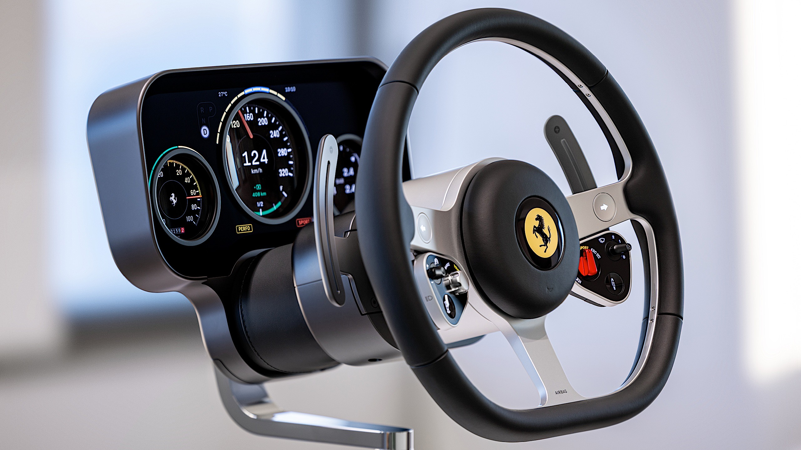
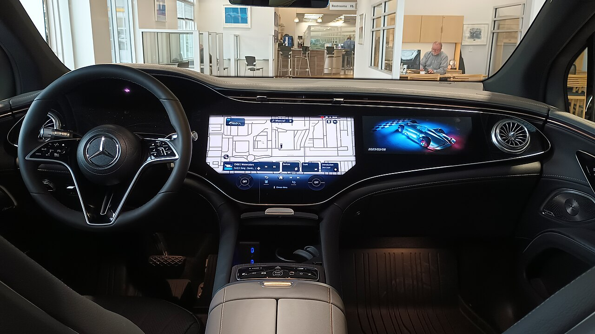
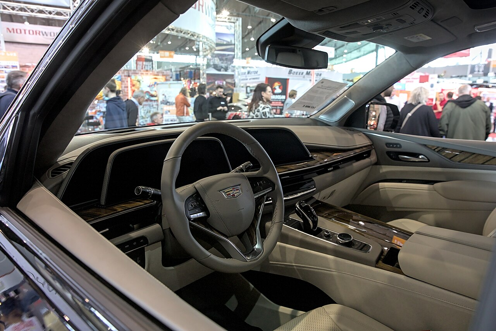
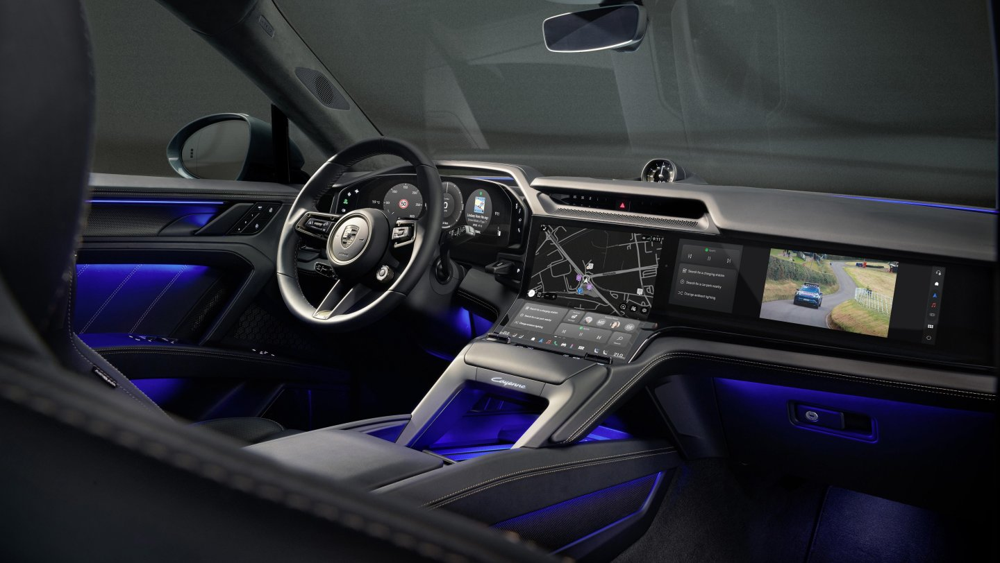
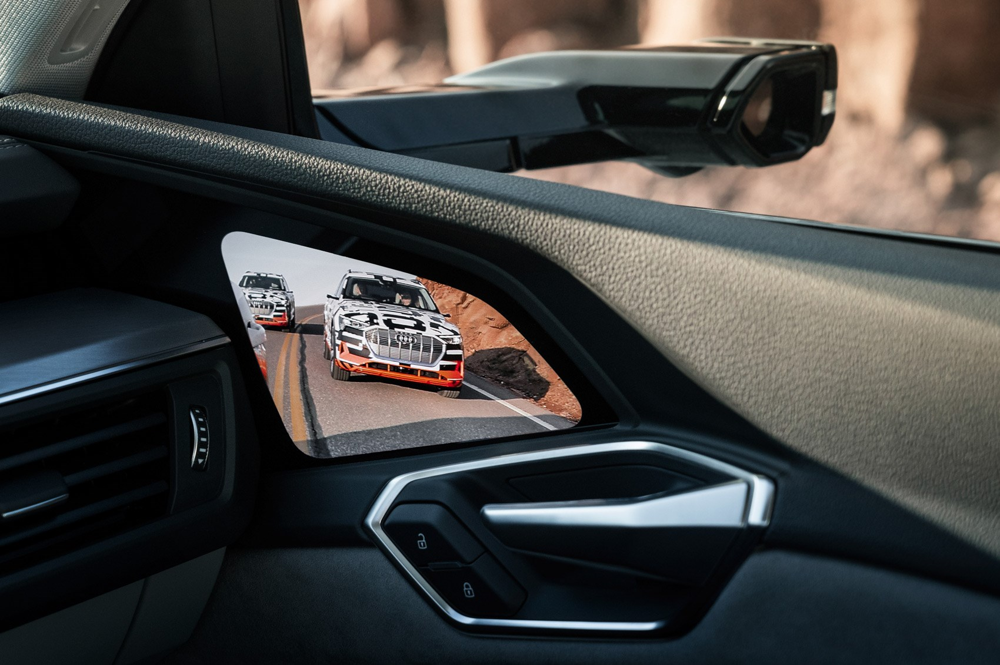

---
#Required fields
title: "OLED di Otomotif: Kenapa Mobil Jadi Layar Raksasa Berjalan"
description: "Dari cockpit Porsche sampai spion virtual Audi, OLED mengambil alih kabin mobil. Kenapa otomotif butuh layar fleksibel, tahan suhu ekstrem, dan aman sesuai standar ISO 26262."
pubDate: 2026-10-04
category: "deepdive"
cover: "../../assets/blog/DD_OLED/OLED-8-ferrari-luce-binnacle.jpg"
coverAlt: "OLED di Otomotif: Kenapa Mobil Jadi Layar Raksasa Berjalan"

#Core Fields
tags: ["OLED"]
author: "Thomas Agung Nugraha"
lang: "id-ID"

#recommended
slug: "oled-deepdive-8-automotive-oled"
excerpt: "Dari dashboard Porsche sampai spion virtual Audi, OLED mengubah kabin mobil jadi layar raksasa. Kenapa otomotif butuh fleksibilitas dan ketahanan ekstrem."
updatedDate: 2026-10-04

#Optional-series support
series: "OLED Deep Dive"
seriesOrder: 8

#Optional:SEO & Indexing
canonicalURL: "https://t-agung.id/blog/oled-deepdive-8-automotive-oled"
keywords:
  - OLED otomotif
  - automotive OLED
  - cockpit digital
  - ISO 26262
  - IATF 16949
  - OLED mobil
  - flexible display
noindex: false

#Optional-table-of-content
showToc: true

#optional-internal linking
relatedPosts:
  - oled-deepdive-7-quantum-dot-qd-oled
  - oled-deepdive-9-oled-vs-microled-automotive

draft: true
---

*Bagian 8 dari seri OLED Deep Dive*

# 

Pernah masuk showroom mobil baru, terus nonton layar dashboard yang nyala satu per satu pas dinyalakan? Bukan cuma animasi keren, tapi display beneran berubah fungsi sesuai konteks. Itu otomotif. Dan itu alasan kenapa industri mobil sekarang berlomba-lomba pakai OLED.

<i>Cockpit Ferrari Luce: binnacle pakai dua panel OLED bertumpuk (multi-layer), indikator digital di layar atas, jarum mekanik di antara lubang HIAA. Source: Ferrari.</i>

## 1. Kenapa OLED di Otomotif Beda dari TV atau HP?

Di TV, OLED dipakai karena kontras bagus dan desain tipis. Di HP, karena ringan dan fleksibel. Di mobil, alasannya lebih serius: **display harus adaptif dan bertahan di kondisi ekstrem**.

Layar TV biasanya cuma nyala di ruang tamu yang suhunya nyaman. Layar HP digenggam di tangan, paling-paling kena panas saku celana. Layar di mobil? Harus bisa dibaca jelas di bawah terik matahari langsung, harus nyala pas suhu minus 40 derajat di Finlandia, harus tetap kerja pas 85 derajat di gurun, dan harus awet minimal 10 tahun tanpa servis.

### 1.1 Temperatur Ekstrem: -40°C sampai 85°C

Ini bukan optional. Komponen grade otomotif, misalnya yang lewat kualifikasi AEC-Q100, umumnya disyaratkan beroperasi di rentang -40°C sampai 85°C. Di belakangnya berdiri dua pilar industri: IATF 16949 sebagai sistem manajemen mutu otomotif, dan ISO 26262 sebagai standar keselamatan fungsional yang bikin spesifikasi ini jadi keharusan, bukan sekadar target. Layar rumah tangga? Cuma di kisaran 0°C sampai 50°C. Jauh lebih mellow.

OLED punya tantangan unik: material organiknya sensitif sama panas dan dingin. Di suhu minus, respons piksel melambat. Di suhu panas, lifetime material drop drastis, detailnya kita bahas di [Bagian 5 soal degradasi](/blog/oled-deepdive-5-lifetime-and-degradation/).

Sama kayak kamu bawa laptop ke pantai tengah hari, CPU langsung throttle karena kepanasan, begitu juga display di kabin. Bedanya, laptop tinggal kamu bawa pulang ke ruangan ber-AC. Panel OLED di mobil harus tahan "pantai tengah hari" itu selama 10 tahun non-stop. Makanya engineer otomotif kerja keras ngatur thermal budget di tiap zona.

### 1.2 Display Adaptif: Satu Layar Bisa Jadi Banyak

Fitur unik OLED di otomotif yang bikin beda sama LCD: **display bisa dipisah jadi beberapa zona independen**. Karena OLED hitamnya murni mati (off), kamu bisa bikin satu panel besar yang secara visual terlihat seperti beberapa layar terpisah.

Contoh nyata: Mercedes-Benz MBUX Hyperscreen, satu kaca melengkung panjang yang membentang dari driver sampai passenger. Di balik kacanya ada tiga display terpisah: instrument cluster 12,3 inci untuk driver (LCD), layar tengah 17,7 inci untuk infotainment (OLED), dan layar passenger 12,3 inci (OLED). Jadi Hyperscreen itu hybrid, satu kaca panjang yang nutupin dua teknologi sekaligus.

<i>MBUX Hyperscreen: tiga display di balik satu kaca melengkung panjang (LCD cluster 12,3 inci, OLED tengah 17,7 inci, OLED passenger 12,3 inci).</i>

Atau Cadillac Escalade: layar 38 inci yang nyaris sepanjang dashboard, sebenarnya tiga panel P-OLED dari LG Display yang disambung, yang terbesar 16,9 inci diagonal. LG sampai bikin siaran pers "World's First In-Vehicle P-OLED Cockpit" pas Escalade model 2021 rilis.

<i>Cadillac Escalade: cockpit P-OLED 38 inci (tiga panel LG Display) yang membentang nyaris sepanjang dasbor.</i>

Setiap zona punya brightness, konten, dan refresh rate masing-masing. Zona passenger bisa nonton film sementara driver fokus jalan.

Di Motherson, saya sering lihat diskusi ini. Customer minta dashboard yang bisa berubah bentuk, kadang jadi satu layar lebar untuk infotainment, kadang jadi dua layar terpisah untuk driver dan passenger. OLED jawabannya. LCD butuh backlight uniform, jadi secara fisik kaku.

### 1.3 Form Factor Fleksibel

Karena OLED tipis dan fleksibel, desain interior mobil dapet kebebasan baru. Bisa melengkung mengikuti dashboard, bisa transparan pas mati, bahkan bisa "mengalir" turun ke konsol tengah.

<i>Porsche Cayenne Electric: Flow Display, layar OLED melengkung yang menyatu mulus ke konsol tengah, dipadu instrument cluster OLED 14,25 inci. Source: Porsche Newsroom.</i>

Contoh paling segar: Porsche Cayenne Electric. Flow Display-nya layar OLED melengkung yang mengalir turun ke konsol tengah, instrument cluster-nya OLED 14,25 inci, ada opsi display passenger 14,9 inci, plus head-up display augmented reality dengan ukuran efektif 87 inci. Bukan konsep lagi, ini production yang mulai masuk pasar.

Layar OLED bisa dibengkokkan mengikuti bentuk dashboard tanpa perlu layer backlight tambahan yang bikin tebal. LCD? Harus tetap rata karena backlight butuh ruang seragam. Di Sony dulu, waktu masih di tim arsitektur VAIO, bayangan kami soal panel cuma sebatas "tipis dan rata." Sekarang di otomotif, lengkungan itu justru jadi fitur desain, bukan batasan manufaktur.

## 2. Masalah-masalah Khusus Otomotif

Bagaimana cara bikin OLED yang tahan panas, tahan dingin, tahan getaran, dan tahan sinar UV langsung 8 jam sehari?

### 2.1 Encapsulation yang Lebih Tebal

Di [Bagian 2 soal matriks aktif vs pasif](/blog/oled-deepdive-2-passive-vs-active-matrix/) kita bahas encapsulation OLED biasa, Thin Film Encapsulation (TFE) dengan silicon nitride. Untuk otomotif, layer ini harus lebih tebal dan lebih banyak lapis.

Kenapa? Karena mobil kena siklus termal ratusan kali: panas di siang hari, dingin di malam hari, masuk AC dari luar yang 40 derajat. Setiap siklus bikin material mengembang dan menyusut, stress mekanis.

Pabrik sekarang pakai multilayer encapsulation: TFE plus glass cover plus hermetic seal plus moisture barrier film. Layer demi layer, sama kayak bungkus kue yang dilapisi plastik, aluminium foil, lalu kardus. Tujuannya sama: jangan sampai oksigen dan air nyentuh material organik di dalam.

### 2.2 Thermal Management

OLED di mobil bukan cuma harus tahan panas, tapi harus bisa membuang panas. Panel display bisa jadi sumber panas sendiri, apalagi pas brightness maks di siang hari.

Solusinya? Heat sink, thermal pad, bahkan active cooling di beberapa desain premium. Di Intel dulu, tim saya sempat terlibat di paten soal kompensasi arus display (EP3098699), di mana driver IC monitor suhu dan turunin refresh rate kalau sudah lewat threshold. Di otomotif, strateginya sama, tapi toleransinya jauh lebih ketat karena layar HMI nyala berjam-jam.

### 2.3 Sinar Matahari Langsung

Ini tantangan yang jarang orang pikirin. Layar mobil kena sinar UV langsung bukan cuma soal readability, UV juga mempercepat degradasi material organik OLED.

Solusi: cover glass dengan UV filter layer, plus encapsulation yang juga tahan UV. Pabrik tambah coating anti-UV di glass depan, sama kayak sunscreen tapi buat display.

### 2.4 Safety dan Functional Safety

Ini yang bikin otomotif beda banget dari consumer electronics: **OLED di mobil harus aman**. Kalau display TV mati, kamu ganti channel. Kalau display speedometer mati di jalan tol? Berbahaya.

<i>Virtual mirror Audi e-tron: display OLED 7 inci tertanam di trim pintu menampilkan feed kamera langsung dari tiang tipis. Produksi massal sejak 2019. Source: CAR Magazine.</i>

Standar ISO 26262 mewajibkan display di dashboard punya redundant path dan failure mode yang aman. Kalau OLED utama mati, harus ada fallback, bisa LCD kecil, bisa HUD, bisa display cadangan di zona lain. Audi sudah jalan di arah ini sejak 2019: virtual mirror berbasis kamera plus display OLED 7 inci di dalam kabin, dan yang pertama masuk produksi massal.

## 3. Siapa yang Masuk, Kapan, dan Berapa?

### 3.1 Adopsi per Tahun

OLED di otomotif sudah dipasok dalam jumlah besar. Angka resmi dari Omdia:

| Tahun | Estimasi Unit OLED di Mobil             | Segmen Utama                          |
| ----- | --------------------------------------- | ------------------------------------- |
| 2024  | ±2,7 juta (diturunkan dari growth rate) | Premium (Mercedes, Porsche, Cadillac) |
| 2025  | ±3 juta (+±12% yoy)                     | Premium + Upper Mid                   |
| 2026  | ±6 juta (proyeksi, naik hampir 100%)    | Upper Mid + Mid                       |

Catat dua hal. Pertama, angka ini mencakup semua aplikasi AMOLED di mobil, kabin maupun eksterior, dan OLED di eksteriar sudah mulai jalan (Audi Q4 e-tron model 2026 dilaporkan pakai taillight OLED). Kedua, pasokan 2026 diproyeksi naik hampir dua kali lipat dari 2025, pertumbuhan paling kencang di antara semua segmen display.

Pasar uang-nya ikut melesat: Omdia estimasi pasar automotive OLED dari $880 juta (2024) ke $4,86 miliar (2030), CAGR 33%. Harga panel sudah turun 15-20% dibanding dua tahun lalu, tapi masih premium dibanding LCD.

### 3.2 Pemain Utama

| Pabrik                     | Tipe OLED                          | Customer Utama                   | Status                                                           |
| -------------------------- | ---------------------------------- | -------------------------------- | ---------------------------------------------------------------- |
| Samsung Display            | Flexible, Tandem, Multi-Lamination | Ferrari (Luce), OEM premium      | Mass production, pangsa ±55,9% (2024, Omdia, berbasis penjualan) |
| LG Display                 | Tandem, P-OLED                     | Cadillac (Escalade), OEM premium | Mass production (tandem automotive sejak 2019)                   |
| BOE                        | Tandem                             | Geely (Galaxy E8), Chery         | Mass production di OEM China                                     |
| Tianma / AUO / Everdisplay | Flexible, Tandem                   | OEM China                        | Ramp-up 2025-2026                                                |

Perhatikan kata "Tandem" muncul di hampir semua pemain besar. Itu bukan kebetulan. Tandem OLED menumpuk dua layer emisif supaya beban per layer cuma separuh, lifetime naik drastis, cocok buat mobil yang dituntut tahan belasan tahun.

### 3.3 Harga

OLED di mobil sekarang masih mahal banget. Angka di bawah ini estimasi dari laporan industri, bukan harga resmi:

- Per unit 10-12 inci: $300-$500 (vs LCD $50-$100)
- Per unit 12-15 inci: $500-$1.000 (vs LCD $100-$200)
- Per unit 15+ inci (hyperscreen): $1.500-$3.000 (vs LCD $200-$400)

Tapi skalanya naik cepat: harga turun 15-20% dalam dua tahun terakhir, dan tekanan harganya belum selesai. Tahun 2027-2028, OLED diprediksi jadi standar di segmen premium semua brand.

## 4. Kenapa Ini Penting Buat Anda?

### 4.1 Sebagai Profesional Display

Kalau kamu kerja di industri display, otomotif adalah pasar dengan margin tertinggi. OLED di mobil bukan cuma soal bagus, tapi soal nilai tambah: design freedom, adaptivitas, form factor fleksibel. Manufacturer mobil rela bayar premium karena OLED kasih diferensiasi yang nyata.

Di Motherson, saya lihat langsung. Customer minta desain interior yang "berubah-ubah" sesuai mood driver. OLED adalah satu-satunya teknologi display yang bisa kasih itu. LCD? Tetap datar dan kaku.

### 4.2 Sebagai Pengamat Teknologi

Ini bukan hype. Otomotif sekarang masuk fase "electrification" di mana interior mobil penuh dengan display, sensor, dan konektivitas. OLED pas banget masuk karena sifatnya yang adaptif, bisa jadi speedometer, infotainment, bahkan augmented reality HUD.

### 4.3 Sebagai Pembaca

Kalau kamu beli mobil baru dalam 3-5 tahun ke depan, kemungkinan besar dashboard mobil kamu pakai OLED. Bukan lagi "opsional", ini jadi standar. Dan sekarang kamu paham kenapa.

## 5. Kesimpulan Singkat

OLED di otomotif bukan cuma soal "layar mobil jadi lebih bagus". Ini soal:

- **Adaptivitas** - satu panel bisa jadi banyak zona, berubah fungsi sesuai konteks
- **Ketahanan** - tahan panas, dingin, getaran, UV, dan siklus termal ratusan kali
- **Desain freedom** - fleksibel, tipis, bisa melengkung mengikuti bentuk interior
- **Safety** - redundant path, fallback mode, standar ISO 26262

Ini alasan kenapa otomotif diprediksi jadi pasar OLED terbesar setelah TV dan HP, dan marginnya jauh lebih tinggi.

> **Di mana teknologi ini hidup hari ini (Bagian 8):**
> 
> - **Cockpit OLED:** Ferrari Luce (produksi, 4 panel Samsung multi-layer), Porsche Cayenne Electric (Flow Display, cluster OLED 14,25 inci), Cadillac Escalade (38 inci, tiga panel P-OLED LG).
> - **Virtual mirror & hybrid cockpit:** Audi e-tron (mirror OLED 7 inci, produksi sejak 2019), Mercedes MBUX Hyperscreen (LCD 12,3 inci + OLED 17,7 inci + OLED 12,3 inci).
> - **Eksterior:** taillight OLED mulai masuk, contoh Audi Q4 e-tron model 2026.
> - **Samsung Display DRIVE:** brand OLED otomotif diluncurkan di IAA Mobility 2025 (Multi-Lamination, FMP, UPC); pangsa pasar ±55,9% (2024, Omdia, berbasis penjualan).
> - **Tandem + TFE tebal:** standar di panel OLED otomotif (Samsung, LG, BOE).

Dulu, kalau ada permukaan yang kepanasan, Moko pasti milih tempat itu buat rebahan. Laptop yang habis dipakai, dasbor yang kena matahari, dia anggap pemanas gratis, nggak peduli sama thermal budget. Material OLED di kabin nggak seberani itu: panas berlebih adalah musuh utama lifetime-nya, makanya thermal management di mobil bukan fitur tambahan, tapi syarat. Laptop itu masih ada di tempatnya. Yang nggak ada lagi hanya yang suka rebahan di atasnya.

Kalau kamu engineer muda yang lagi mikir mau fokus ke mana, menurut kamu OLED bakal tetap jadi raja cockpit mobil 10 tahun ke depan, atau microLED bakal ambil alih? Tulis di kolom komentar, saya penasaran dengar pendapatmu.

Di bagian berikutnya, kita bakal benturkan OLED langsung dengan microLED buat kendaraan: siapa menang di cockpit, HUD, dan display eksterior, plus roadmap 2026-2030. [Bagian 9: OLED vs MicroLED di Mobil](/blog/oled-deepdive-9-oled-vs-microled-automotive/)

---

> **Part 1** → [Bagian 1: Apa Itu OLED?](/blog/oled-deepdive-1-apa-itu-oled/)  
> **Part 2** → [Bagian 2: Passive vs Active Matrix](/blog/oled-deepdive-2-passive-vs-active-matrix/)  
> **Part 3** → [Bagian 3: Power Consumption & Refresh Rate](/blog/oled-deepdive-3-power-and-refresh-rate/)  
> **Part 4** → [Bagian 4: Luminous Evolution](/blog/oled-deepdive-4-luminous-evolution/)  
> **Part 5** → [Bagian 5: Lifetime & Degradasi](/blog/oled-deepdive-5-lifetime-and-degradation/)  
> **Part 6** → [Bagian 6: Manufacturing OLED](/blog/oled-deepdive-6-manufacturing/)  
> **Part 7** → [Bagian 7: Quantum Dot & QD-OLED](/blog/oled-deepdive-7-quantum-dot-qd-oled/)  

---

*Bagian 8 dari seri OLED Deep Dive. Ditulis oleh Thomas Agung (t-agung.id).*

**Sumber Referensi:**

- Omdia via OLED-Info: automotive OLED shipments naik hampir 100% di 2026 (±3 juta unit 2025, ±6 juta unit 2026): https://www.oled-info.com
- BusinessKorea: Samsung Display DRIVE di IAA Mobility 2025 (Multi-Lamination, FMP, UPC): https://www.businesskorea.co.kr
- Porsche Newsroom: Cayenne Electric Flow Display, curved OLED + cluster 14,25 inci: https://newsroom.porsche.com
- Mercedes-Benz supplier portal: MBUX Hyperscreen (LCD ICD 12,3 inci + OLED CID 17,7 inci + OLED CDD 12,3 inci): https://supplier.mercedes-benz.com
- LG Display Newsroom: World's First In-Vehicle P-OLED Cockpit, Cadillac Escalade 2021 (38 inci, tiga panel): https://www.lg.com
- Audi: e-tron virtual exterior mirrors (kamera + display OLED 7 inci, produksi sejak 2019): https://www.audi.com
- BOE: Geely Galaxy E8 8K OLED display: https://www.boe.com
- ISO 26262:2018, Road vehicles - Functional safety: https://www.iso.org/standard/77301.html
