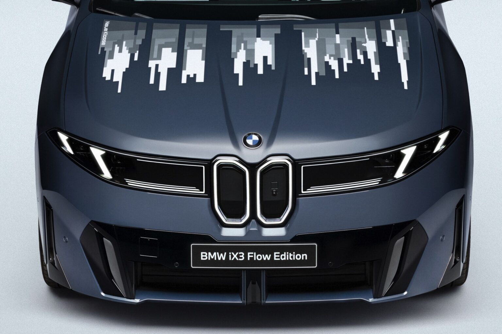
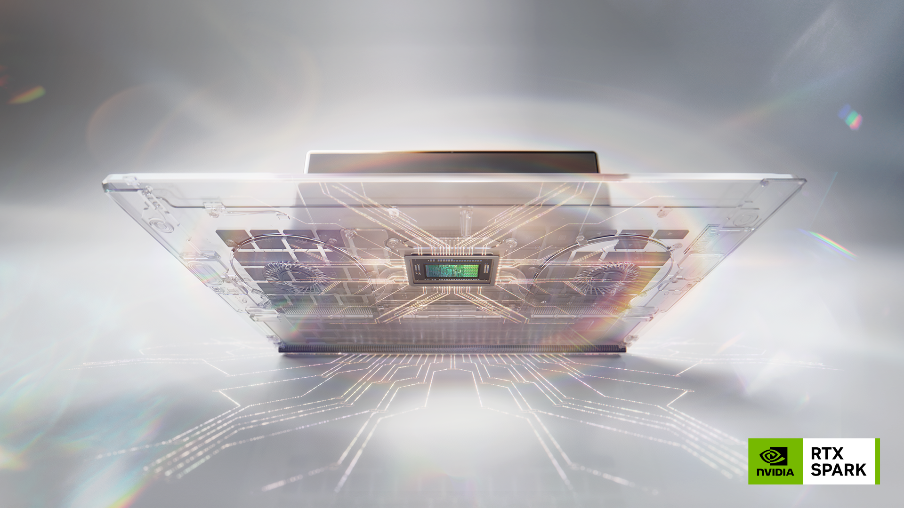
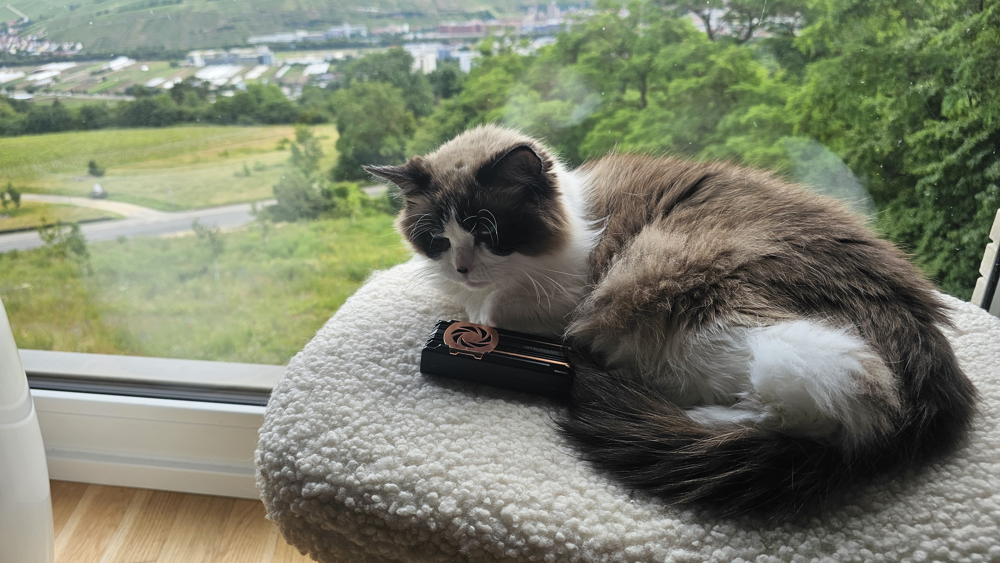

Tiga minggu lalu, konferensi teknologi terbesar di Asia, COMPUTEX 2026 mencatat rekor baru: 111 ribu pengunjung dari 152 negara, angka tertinggi dalam 45 tahun. Yang bikin saya berhenti sejenak bukan produk yang bisa dibeli bulan depan. Ini tentang teknologi dari lab riset yang bikin hardware terasa beda dalam lima hingga sepuluh tahun ke depan.

## E Ink: Bukan Lagi Layar Datar

### BMW iX3 Flow: Mass Production, Bukan Konsep

E Ink itu dikenal sebagai layar Kindle: hitam putih, lambat, hemat baterai. Tapi di COMPUTEX 2026, mereka tunjukin kalau itu bukan lagi batas teknologi ini.

Highlight terbesar: BMW bawa BMW iX3 Flow Edition yang sudah siap produksi massal. Bukan konsep. Bukan prototype. Ini "series-ready", artinya teknologi E Ink Prism sudah lulus uji produksi dan siap masuk ke jalur perakitan.

*BMW iX3 Flow Edition dengan teknologi yg bisa ngerubah motif di hood nya*

BMW pertama kali ngungkap iX3 Flow Edition di Auto China 2026 di Beijing, bulan April. Di COMPUTEX, E Ink memamerkan kap mesin asli dari kendaraan tersebut yang memang sudah memakai E Ink Prism tertanam langsung ke dalam panel bodi, bukan sekadar lapisan di atas cat.

Ini integrasi pertama di dunia yang ngengeban E Ink Prism ke komponen eksterior mobil sebagai bagian struktural. Kap mobil yang bisa berubah warna secara dinamis, dengan 6 warna (putih, merah, kuning, hitam, biru, hijau) yang bisa dikombinasikan jadi pola-pola berbeda. Tanpa backlight. Tanpa panas. Konsumsi daya nyaris nol pas lagi diam.

Teknologi Prism 3 nawarin 6 warna dengan pattern dinamis. Versi Prism 3S yang lebih baru bahkan bisa diaplikasikan ke permukaan 3D kompleks, sesuatu yang belum pernah ada sebelumnya. BMW juga memamerkan side mirror dan wheel hub yang bisa berubah warna, semuanya dikontrol oleh unit pemrogram yang memungkinkan perubahan warna sederhana sampai gelombang pattern yang tersinkronisasi.

Yang paling penting: ini bukan demo lab yang akan disimpan di laci. E Ink sendiri ngaku siap mass production setelah lebih dari lima tahun pengembangan. BMW pakai kendaraan produksi sebagai basis display, bukan model futuristik yang tidak akan pernah sampai ke showroom.

### Speaker Berubah Warna: Display Udah Tidak Lagi Datar

Kalau mobil udah ekstrem, tunggu sampai kalian liat apa yang E Ink tunjukin buat produk consumer.

Di booth COMPUTEX yang sama, mereka memamerkan speaker portable yang bisa berubah warna dan pola sesuai musik yang diputar. Bukan layar yang ditempel di atas casing. Ini E Ink Prism yang bener-bener membentuk permukaan speaker itu sendiri.

 <video src="/videos/13.Eink_portableSpeaker.mp4" width="600" controls>
  Your browser does not support the video tag.
</video>

<em>Eink breakthrough... thermoformed patterned Eink</em>
 

Sebagai orang yang pernah kerja sama display technology, saya sih kaget.

Buat bikin bentuk kayak gini, E Ink Prism harus lewat proses thermoforming. Thermoforming sendiri bukan hal baru. Teknik pemanasan dan pencetakan material ke dalam cetakan 3D udah ada sejak era plastik industri. Tapi nerapinya ke display elektronik? Ini memang hal baru.

Kita masuk ke tahap di mana display nggak lagi datar. Bukan sekadar "bengkok satu sumbu" kayak layar foldable HP yang kita kenal sekarang. Bentuk 3D kompleks, melengkung, bertekstur, ngeikutin kontur produk. Speaker dengan permukaan melengkung yang berubah warna. Mobil dengan body panel yang berubah pattern. Wall art yang bisa berekspansi. Instrumen musik yang berubah warna sesuai nada.

Display bukan lagi "panel yang kamu lihat". Display jadi "permukaan yang kamu sentuh dan hidupi".

## NVIDIA RTX Spark: Tantangan Nyata untuk Apple Silicon

Kalau E Ink ngerusak asumsi kita soal display, NVIDIA ngotot bikin ulang aturan main silicon konsumen.

NVIDIA ngumumin "superchip" RTX Spark pada 1 Juni 2026, pas sebelum COMPUTEX. Ini chip ARM pertama NVIDIA untuk konsumen: merger antara CPU ARM 20-core yang dirakit bareng MediaTek dan GPU Blackwell dengan 6.144 CUDA core, hasil akhirnya 1 petaFLOP performa AI dalam satu chip.

Microsoft langsung nerespon dengan Surface Laptop Ultra. MSI nunjukin Prestige N16 Flip AI+, laptop 2-in-1 pertama dengan RTX Spark. Dell, HP, ASUS, Lenovo, semuanya bawa prototype ke COMPUTEX.

*RTX Spark promotion, sumber : Nvidia*

Tapi pertanyaannya: apakah RTX Spark bener-bener bisa ngejar Apple Silicon?

Jawabannya nggak sesederhana ya atau nggak.

Apple Silicon udah ada sejak 2020, lima tahun lebih dulu. M-series sudah lewat beberapa generasi iterasi dan optimisasi. RTX Spark memang punya spesifikasi mentah yang lebih tinggi: 1 petaFLOP buat AI, GPU dengan jumlah core setara RTX 5070 laptop, dan memori unified sampai 128GB yang jauh ngelewatin apa pun yang Apple tawarin di laptop konsumen.

Tapi di benchmark Clang yang kebocor, RTX Spark cuma 54 persen lebih cepet dari Apple M5. Bukan selisih yang sebesar yang dijanjikan oleh angka 1 petaFLOP. Apple Insider bahkan nyelipin judul "Nvidia's Apple Silicon rival is already two years behind," menyebut kalau GPU dan AI memang lebih kuat, tapi CPU performance dan daily efficiency masih ngelek.

Menurut analis Tom's Guide, RTX Spark bakal geser debat Mac vs Windows dari performance ke harga. Creative Bloq nambahin kalau RTX Spark bisa jadi game changer buat Windows, tapi nggak bakal ngeakhiri debat Mac vs Windows, cuma geser fokus ke value proposition yang beda.

Intinya: RTX Spark menang di AI on-device dan GPU power. Apple Silicon menang di CPU efficiency, battery life, dan ekosistem yang udah matang. Spark buat creator dan gamer yang butuh GPU berat. Apple buat user yang prioritaskan efisiensi dan integrasi.

Yang bikin saya mikir panjang: keduanya pakai arsitektur yang sama. ARM. Unified memory. Chiplet design. RTX Spark bukan sekadar nyoba ngejar Apple, tapi ngasih bukti kalau filosofi Apple Silicon bisa jalan di ekosistem terbuka. Bagi saya ini justru poin paling menarik. Kalau Apple bisa bikin orang mikir lagi soal x86 / x64, NVIDIA mau buktiin kalau model itu juga bisa bekerja di Windows.

## Benang Merah

E Ink Prism nunjukin kalau display nggak harus ngabisin listrik pas lagi nyala. Permukaan pasif yang berubah warna bisa ganti layar konvensional di banyak konteks, dan display itu nggak harus datar lagi. Thermoforming ngebuka kemungkinan hardware kita bakal punya permukaan yang hidup dan interaktif, bukan cuma di layar, tapi di body produk itu sendiri.

NVIDIA RTX Spark nunjukin kalau AI bisa hidup di device, bukan di cloud. 1 petaFLOP dalam satu chip konsumen berarti model AI yang dulu butuh server rack sekarang bisa jalan di laptop.

Timing-nya juga nggak bisa diabaikan. Pas minggu ini, Apple lagi gelar WWDC 2026 di Cupertino. Apakah mereka bakal ngumumin chip baru? Apakah mereka bakal memperdalam integrasi AI di ekosistem? Atau sesuatu yang benar-benar beda? Yang jelas, COMPUTEX dan WWDC terjadi berdekatan bukan kebetulan. Dua kutub dari perang yang sama, dan kita masih lihat permulaannya.

## Penutup

Saya masih ingat era tablet pertama dari Sony, pas layar masih dianggap sebagai panel datar yang nampilin piksel. Terus masa Intel display tech, pas teknologi display mulai ngobrol soal pixel density dan response time, dan extreme energy saving. Sekarang kita punya permukaan yang hidup, nggak datar,  dan nyaris nggak makan energi dengan *EPD* (Electrophoretic Display, technoloinya E-ink). Tambah chip yang bisa ngejalanin AI setara desktop di genggeman tangan.

Perlahan tapi pasti, hardware mulai ngerti apa yang kita butuhkan.

 
*Moko... itu SSD isinya foto kamu doang*

Moko masih ngeliatin portable SSD saya. Mungkin dia masih kurang ngerti bedanya Memory untuk AI dan Memory untuk storage, sambil ngebayangin laptop saya bakal ngejalanin AI lokal setara cloud yang tentunya butuh buanyak banget DDR RAM yg punya bandwidth gede, dia juga kayaknya mimpiin mobil di jalan raya bakal punya motif warna-warni dan motif unik yang bisa ganti-ganti dengan teknologi e-ink.

Tapi sampai saat itu, setidaknya Moko masih mau nemenin saya mikir ilmu yang mau di share. Dan itu udah cukup.
