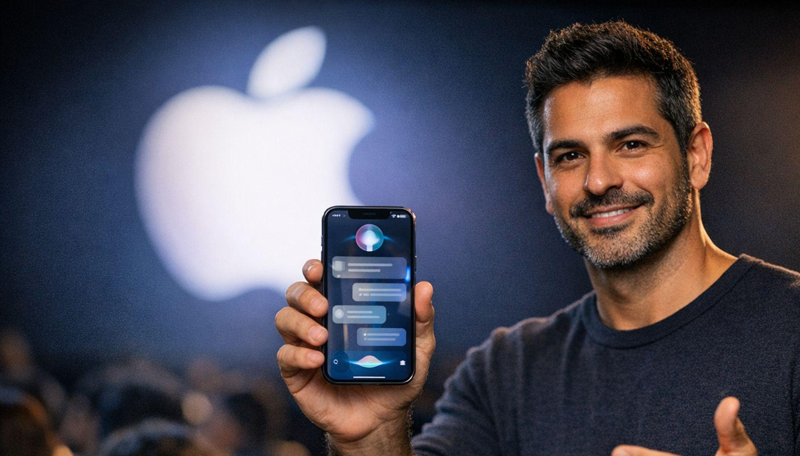
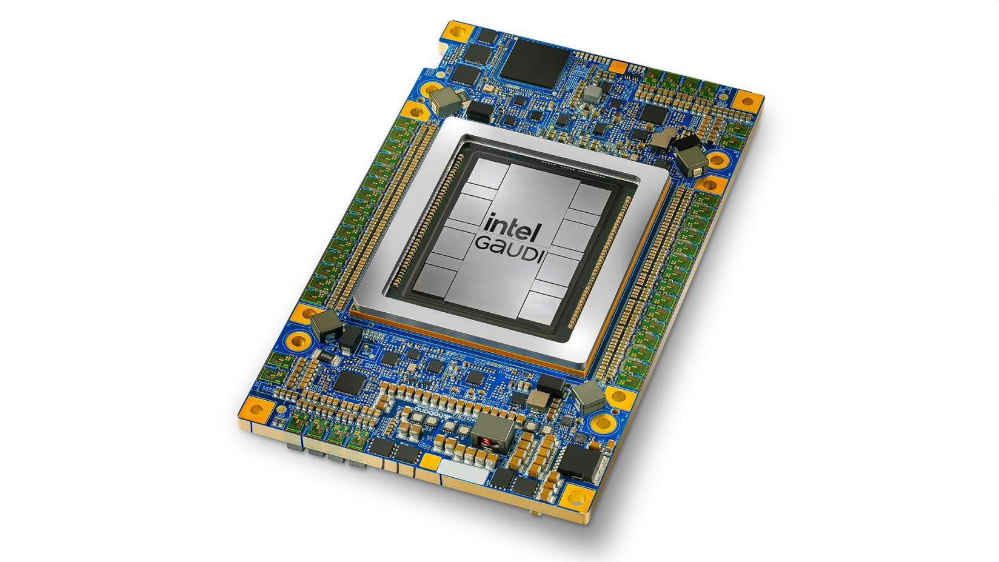
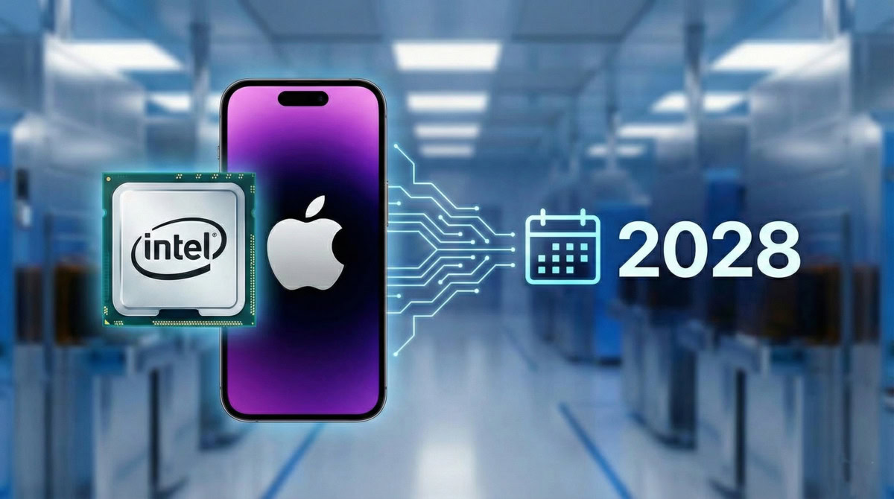
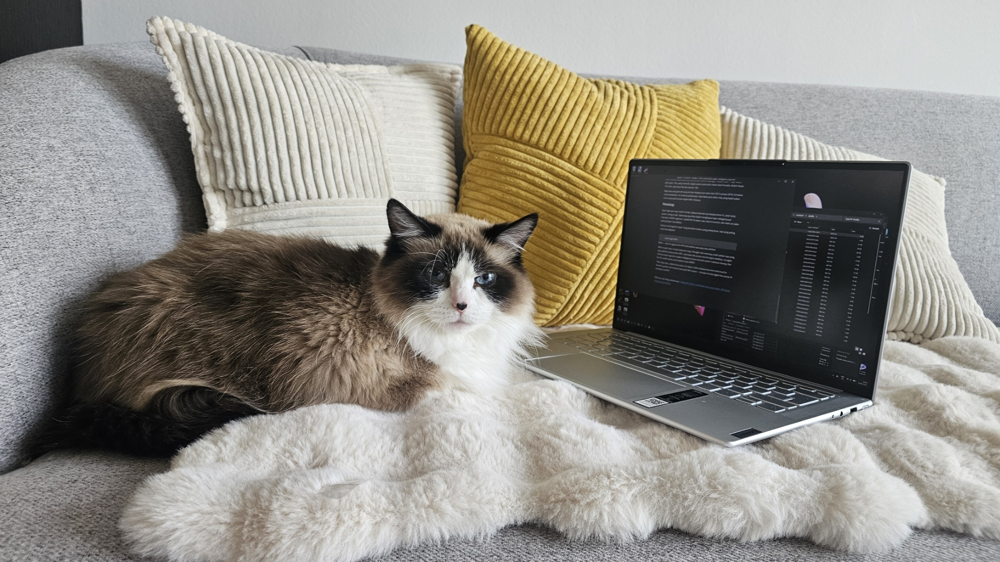

Minggu ini, tepat setelah COMPUTEX ditutup, Apple buka WWDC 2026 di Cupertino. Dua acara, di dua minggu, dua kutub dari perang yang sama. COMPUTEX nunjukin apa yang industri terbuka bisa raih. WWDC nunjukin arah Apple tarik ekosistemnya. Dan arah itu bikin saya mikir ulang soal masa depan display, silicon, dan interface yang kita kenal.

Yang saya lihat dari WWDC 2026 bukan sekadar fitur baru. Ini sinyal: Apple sudah mulai menghapus layar sebagai pusat interaksi, dan chip tanpa NPU tidak punya tempat lagi di ekosistemnya.

## Apple Intelligence 2.0: Siri Dibangun Ulang, NPU Jadi Raja

Siri AI jadi nama barunya, dan ini bukan perbaikan biasa. Apple bener-bener bangun ulang Siri dari nol, kali ini bareng Google Gemini. Bisa tanya pertanyaan terbuka, brainstorm ide, ngobrol bolak-balik secara natural, dan yang paling penting: Siri sekarang paham apa yang ada di layar kamu, ingat konteks personal antar aplikasi, dan sinkronisasi privat dengan Apple Intelligence.

*Siri AI: dibangun ulang dari nol dengan Google Gemini*

Ini bukan sekadar voice assistant yang lebih pintar. Apple Intelligence 2.0 jalan secara on-device. Artinya, semua kemampuan AI ini bergantung pada NPU (Neural Processing Unit) yang ada di chip. M-series sudah punya neural engine dedikasi, dan Apple Intelligence mendorong kebutuhan NPU menjadi fitur wajib, bukan luxury.

Photos app sekarang punya spatial "Reframe". Kamu bisa ubah sudut dan perspektif foto. Safari dapat tools browsing yang dipersonalisasi AI. Writing assistance di seluruh sistem. Semua ini butuh compute AI yang masif, dan Apple memilih jalan on-device, bukan cloud.

Arsitektur yang Apple pilih jelas: ARM + unified memory + NPU dedikasi = AI on-device. Bukan kebetulan. Ini sama persis arsitektur yang NVIDIA tunjukin di RTX Spark COMPUTEX.

## Kamera Jadi HMI: Layar Mulai Kehilangan Mahkotanya

Fitur yang bikin saya berhenti sejenak bukan Siri AI atau Photos Reframe, tapi mode visual di kamera iPhone.

Siri sekarang punya kemampuan memahami konten visual langsung melalui kamera. Kamu arahkan kamera ke sesuatu, tanya apa pun, dan Siri langsung merespon. Bukan sekadar image recognition. Ini camera-as-HMI, atau kamera sebagai interface untuk interaksi dengan dunia nyata. Kamera bukan lagi alat untuk dokumentasi doang.

Ini bukan cuma di iPhone. visionOS 27 bawa Visual Intelligence langsung ke pipeline kamera Vision Pro, dengan spatial reframing yang Mashable sebut sebagai "AI tool paling unik dari WWDC". FaceTime dapat sign language interpretation API, terjemahan bahasa isyarat secara real-time selama video call.

Trennya jelas: AI vision, sensor, kamera, audio spatial. Semua ini jadi layer interface baru. Layar? Mulai kehilangan mahkotanya.

Tema "HMI bukan UI" yang saya tulis di blog pertama saya sekarang punya bentuk baru. Interface terbaik bukan yang kamu sentuh, tapi yang sudah paham konteks kamu dan bertindak sebelum kamu sadar.

## Intel: Bukan Mati, Tapi Harus Cari Jembatan Pulang

macOS 27 "Golden Gate" adalah versi terakhir macOS yang mendukung Intel. macOS 28 musim gugur 2027 akan eksklusif Apple Silicon. Rosetta 2 juga berakhir setelah macOS 27. Sekitar 18.800 aplikasi Intel-only bakal terpengaruh.

Kabar buruk untuk Intel? Ya, kalau kita lihat dari sisi CPU desktop.

Tapi cerita Intel bukan lagi soal CPU x86 yang Apple tinggalkan. Cerita Intel sekarang ada di tempat lain. Dan justru di sinilah ada harapan.

### Intel Punya Tiga Kartu As

**Pertama: Gaudi 3.** Intel Gaudi 3 sudah ada, dan ini bukan maen-maen. Accelerator AI dengan 1.835 TFLOPS BF16 compute, 3.7 TB/s bandwidth HBM2e. Intel klaim 70% lebih cepat training dibanding NVIDIA H100, tapi benchmark independen dari Tom's Hardware menemukan Gaudi 3 lebih lambat di beberapa tes, meski jauh lebih murah. IEEE Spectrum sebut ini sebagai tantangan nyata untuk dominasi NVIDIA di server AI.

*Intel Gaudi 3: AI accelerator dengan harga setengah NVIDIA H100*

**Kedua: Intel Foundry.** Berita paling mengejutkan datang di sini. Pada 8 Mei 2026, Wall Street Journal melaporkan Apple dan Intel sudah mencapai kesepakatan awal untuk manufaktur chip. Apple akan pakai fab Intel untuk memproduksi chip yang Apple desain sendiri. Pemerintah Trump dorong deal ini, dan Intel stock naik 15% pada hari pelaporan, setelah melonjak sekitar 240% sepanjang 2026. Yole Group menyebut ini "penangan foundry eksternal terbesar Intel hingga saat ini".

*Apple dan Intel mencapai kesepakatan manufaktur chip (sumber: WSJ, 8 Mei 2026)*

Ini bukan Intel bikin CPU x86 untuk Apple lagi. Ini Apple bayar Intel untuk produksi chip Apple Silicon di fab Intel, kemungkinan dengan proses 18A yang sudah mulai beroperasi. Strategi Apple jelas: diversifikasi supply chain dari TSMC, yang Apple sebut "Taiwan Risk".

**Ketiga: Intel 18A.** Proses 18A Intel sudah siap produksi. TechPowerUp melaporkan Apple, AMD, Google, dan NVIDIA semuanya sedang pertimbangkan deal dengan Intel Foundry. Ini bukan lagi soal "kapan Intel Foundry siap". Ini soal "siapa yang mau pakai".

### Jalan Pulang Intel

Yang hilang dari Intel bukan kemampuan teknis. Yang hilang adalah kemampuan mengemas semuanya menjadi satu arsitektur yang elegan seperti Apple Silicon.

Apple nunjukin rumusnya: ARM + unified memory + NPU dedikasi. NVIDIA buktikan rumus itu juga jalan di Windows dengan RTX Spark. Intel punya semua komponennya: fab dengan 18A, AI accelerator dengan Gaudi 3, dan sekarang sudah ada deal awal dengan Apple untuk manufaktur, tapi belum merakit semuanya ke dalam formula yang sama.

Jalan pulang Intel bukan dengan bikin CPU x86 yang lebih cepat. Ini dengan pakai Foundry untuk produksi chip Apple, integrasi Gaudi IP sebagai NPU dalam SoC ARM, dan manfaatkan proses 18A untuk kasih Apple alternatif fab selain TSMC.

Intel nggak mati. Intel cuma perlu bikin jembatan dari apa yang mereka punya ke arsitektur yang dunia minta.

## MacBook Neo: Apple Turunkan Harga, Naikkan Standar

Oh ya, MacBook Neo yang diumumin Maret 2026. Laptop Apple termurah pernah ada di harga $599 ($499 education), pakai chip A18 Pro yang sama dengan iPhone, fanless, baterai 16 jam, empat warna baru. Apple klaim "hingga 50% lebih cepat untuk tugas sehari-hari daripada PC terlaris dengan Intel Core Ultra 5 terbaru". Untuk orang-orang nerd teknik kayak kita, mungkin perfurmance masih kurang... tapi untuk kebanyakan orang, ini sudah cukup untuk jadi mesin utama sehari-hari.

MacBook Neo ini bukan cuma soal harga. Ini pesan Apple: Apple Silicon sudah matang sampai bisa pakai chip iPhone di laptop, dan hasilnya bisa saingan dari chipnya Intel. Gap yang dulu ada di awal era M1 sekarang semakin melebar.

## Benang Merah

COMPUTEX tunjukin: display nggak harus datar (E Ink thermoforming), AI bisa hidup di device (RTX Spark), dan surface bisa jadi interface (E Ink Prism di bodi mobil).

WWDC tunjukin: interface nggak harus layar (camera-as-HMI, vision, sign language), AI harus on-device (NPU wajib), dan silicon tanpa NPU nggak punya masa depan di Apple.

Dan di antara dua kutub itu, Intel berdiri di persimpangan. Bukan mati, tapi harus pilih jalan. Dan yang menarik, Apple justru buka pintu lewat deal Foundry. Bukan lewat CPU x86, tapi lewat fab dan proses 18A.

Bagi saya yang pernah kerja di Intel display tech team dari 2015 sampai 2018, ini bukan cerita kekalahan. Ini cerita transformasi. Intel nggak perlu bikin chip yang Apple pakai. Intel cukup jadi tempat Apple bikin chipnya.

## Penutup

Saya ingat pas saya masih di Intel, diskusi internal soal touch controller integrated display driver IC, pixel clock, power saving mode. Sekarang saya lihat Apple menghapus layar sebagai pusat interaksi, NVIDIA ngemas 1 petaFLOP AI dalam satu chip konsumen, dan Intel cari jalan pulang lewat manufaktur.

Industri ini bergerak cepat. Yang bertahan bukan yang paling besar, tapi yang paling cepat beradaptasi.

 
*Moko. Dia sih nggak perlu NPU buat paham apa yang saya pikirkan*

Moko masih negeliatin saya. Mungkin dia memang sudah paham apa yang saya pikirkan tanpa perlu NPU, tapi kalau dia punya neural engine dedikasi, mungkin dia bisa kasih signal ke Apple Intelligence buat otomatis pesen makanan kucing. Dan itu sih sudah terlalu jauh bahkan buat WWDC.

Tapi siapa tahu, dalam lima tahun ke depan, kalau display bisa thermoformed ke bentuk speaker dan kamera bisa jadi HMI utama, kenapa kucing nggak bisa punya AI assistant sendiri?

---

*Referensi dari blog sebelumnya: [COMPUTEX 2026: E-Ink Bukan Lagi Layar Kindle, RTX Spark Tantang Apple Silicon](/blog/blog13_computex_2026_breakthrough/)*
