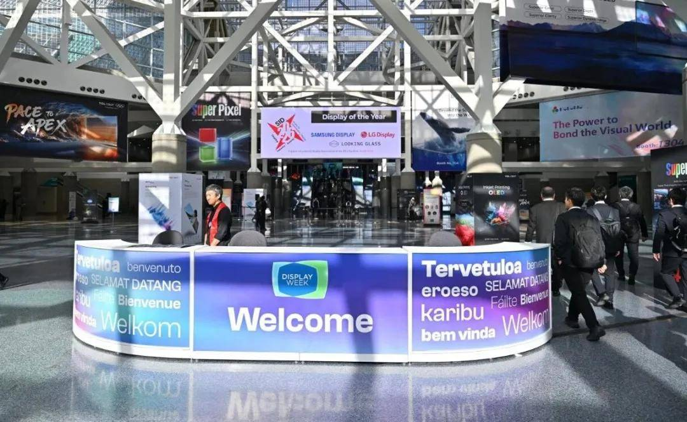
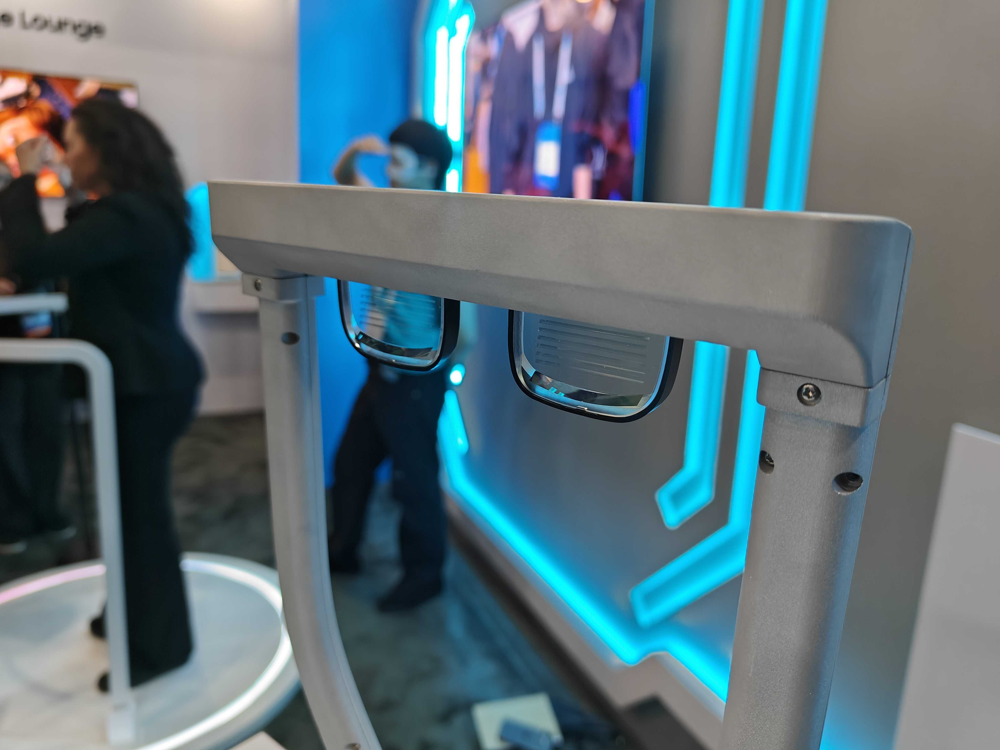
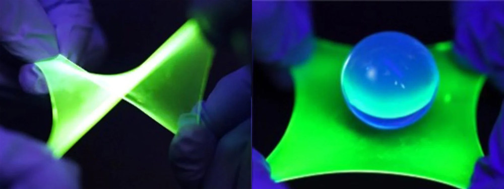
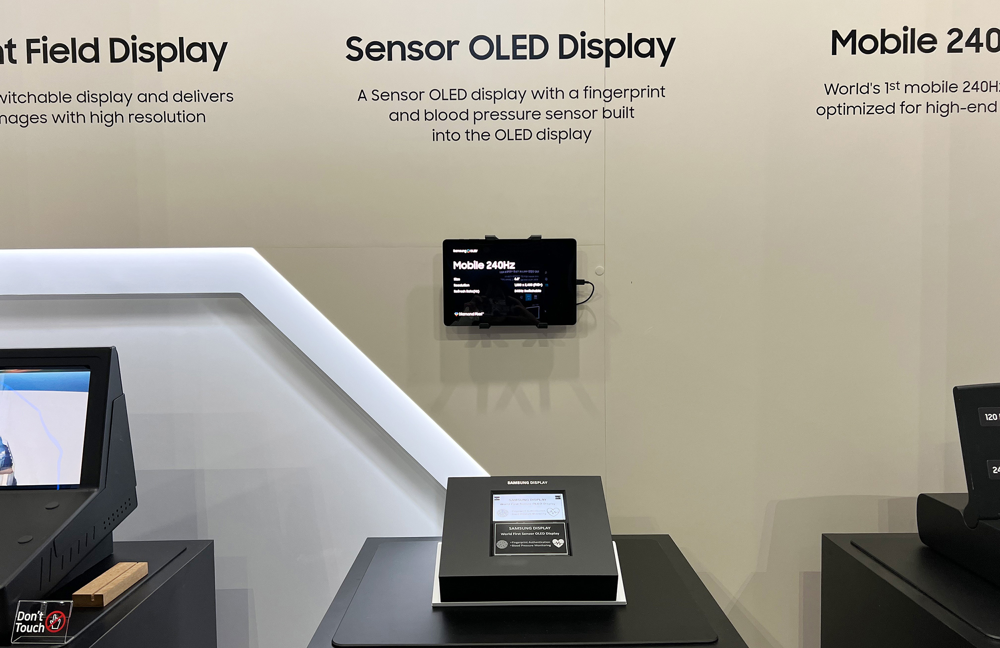

---
#Required fields
title: "SID 2026: Dari Penta-Tandem ke Layar yang Bisa Diregangkan - Evolusi OLED yang Belum Selesai"
description: "Abis bahas COMPUTEX soal penta-tandem OLED dan foldable phone, saya ingat SID 2026 di Los Angeles - forum display expert sejati. eMagin tandem OLED 20K nits, Samsung Sensor OLED, dan stretchable OLED dengan MXene. Evolusi dari kaku ke lipat ke regang."
pubDate: 2026-06-11
category: "exhibition"
cover: "../../assets/blog/15/15.sid2026_banner.jpg"
coverAlt: "Visual representation of SID 2026: Dari Penta-Tandem ke Layar yang Bisa Diregangkan - Evolusi OLED yang Belum Selesai"

#Core Fields
tags: ["SID 2026", "OLED", "eMagin", "Samsung Sensor OLED", "MXene", "Stretchable Display", "Tandem OLED", "Display Breakthrough"]
author: "Thomas Agung Nugraha"
lang: "id-ID"
draft: false

#recommended
slug: "blog15_SID_Display_Tech_breakthrough"
excerpt: "Dari Los Angeles, saya laporkan inovasi layar paling radikal tahun ini: kacamata pintar eMagin 20 ribu nits hingga layar stretchable yang bisa melar bebas."
updatedDate: 2026-07-04

#Optional-series support
#series: ""
#seriesOrder:

#Optional:SEO & Indexing
canonicalURL: "https://t-agung.id/blog/blog15_SID_Display_Tech_breakthrough"
keywords:
  - SID 2026
  - OLED
  - eMagin
  - Samsung Sensor OLED
  - MXene
  - Stretchable Display
  - Tandem OLED
  - Display Breakthrough
noindex: false

#Optional-table-of-content
showToc: true

#optional-internal linking
#relatedPosts:
---

Abis saya nulis blog tentang [COMPUTEX](/blog/blog13_computex_wwdc_2026_breakthrough/) soal penta-tandem OLED Samsung 4K 360Hz dan *latest and greatest of* display lainnya, ada satu hal yang nggak berhenti nge-greget di kepala saya.

COMPUTEX itu keren, tapi itu expo konsumen. Full booth gede, lampu neon, kerumunan yang suka minta demo. Kalau mau liat sesuatu yang beneran dalem, yang nggak dipamerin ke publik, harus ke tempat lain. Tempat di mana para engineer display dari seluruh dunia kumpul, ngobrol, dan sharing langsung dari lab mereka tanpa jurnalis yang nyebelin.

Welcome to SID 2026. Display Week ke-63.

Jadi SID itu gimana? Baru aja selesai bulan kemarin, 3-8 Mei 2026 di Los Angeles Convention Center South Hall. Lebih dari 200 exhibitor, 675 paper dan sesi teknis : angka tertinggi dalam sejarah SID kalau nggak salah. Di sana, Samsung dan anak perusahaannya eMagin nunjukin beberapa hal yang bikin saya ketawa kecil sambil bilang, "Oke, ini bukan iterasi biasa."

*SID Display Week 2026 exhibition hall, Los Angeles Convention Center*

## eMagin: Tandem OLED di Ujung Mata Kaca

eMagin itu perusahaan yang sudah lama main di dunia microdisplay, bikin OLED super kecil buat AR glasses dan headset VR. Tahun 2023, Samsung Display mengakuisisi eMagin sepenuhnya. Dan di SID 2026, mereka nunjukin buah dari akuisisi itu.

Tandem RGB OLED microdisplay: 0.62 inci, resolusi 1292x1036, pixel density 2600 PPI, dan brightness 3.000 nits pada model SXGA096. Sementara untuk teknologi tandem RGB yang mereka perlihatkan, brightness sudah mencapai angka di atas 20.000 nits.

Dua puluh ribu cd/m2!

Buat bayangan aja: monitor gaming OLED terbaik di COMPUTEX itu 1.000 nit. eMagin ini dua puluh kali lebih terang. Tapi bukan di layar besar, ini microdisplay seukuran kepala pin. Moko, kucing ragdoll saya, aja pasti bakal nyelonot kabur kalau liat layar secangkil itu. Kayak nyelipin lampu sorot konser di ujung jarum.

*eMagin tandem RGB OLED microdisplay di concept smart glasses waveguide, SID 2026*

Arsitekturnya tandem. Bukan satu lapisan OLED, tapi beberapa lapisan OLED yang ditumpuk kayak sandwich. Setiap lapisan punya emitter RGB sendiri-sendiri. Hasilnya brightness naik beberapa kali lipat tanpa perlu nambah ukuran atau daya.

Di blog COMPUTEX saya bahas penta-tandem Samsung : lima lapisan buat 4K 360Hz. Di sini, eMagin pakai lapisan multi itu buat kecerahan ekstrem di ukuran mikro. Sama-sama tandem, sama-sama soal brightness, tapi skala yang beda total.

Samsung nunjukin concept smart glasses yang pakai waveguide. Sistemnya begini: cahaya dari microdisplay disalurkan ke tepi lensa, lalu dipantulkan langsung ke mata. Bukan AR glasses yang besar kayak Vision Pro. Ini kacamata tipis, lebih deket ke kacamata biasa yang kamu pakai sehari-hari.

Produksi massal sedang dipersiapkan dengan target skala besar.

Kenapa 20.000 nit penting? Karena AR waveguide butuh brightness yang ekstrem. Efisiensi coupling waveguide cuma **5-15 persen**. Kalau sumber cahayanya kurang terang, AR di bawah matahari siang nggak bakal keliatan. 20.000 nit itu angka ajaib. Bayangin kamu mau nonton film di tengah pantai pas jam dua siang, tapi filmnya tetep keliatan jelas : itu yang mereka kejar.

## Stretchable OLED: Dari Lipat ke Regang

Di blog [foldable phone](/blog/blog11_foldable_phone_display_tech/) saya bahas soal layar lipat. HP yang bisa dilipat itu udah mainstream : Samsung Galaxy Fold, Honor Magic V, Xiaomi Mix Fold. Tapi lipat itu masih "satu sumbu." Layarnya tetap datar, cuma ada engsel di tengahnya.

SID 2026 nunjukin sesuatu yang lebih ekstrem: layar yang bisa diregangkan.

Sebuah tim dari Seoul National University dan Drexel University mempublikasikan temuan mereka di jurnal Nature, Januari 2026. Paper berjudul "Exciplex-enabled high-efficiency, fully stretchable OLEDs."

Angkanya gila: External Quantum Efficiency (EQE) 17 persen di strain 60 persen. Artinya, bahkan saat diregangkan 60 persen dari ukuran aslinya, OLED ini masih mempertahankan efisiensi cahaya yang sangat tinggi. Beberapa demo menunjukkan regangan hingga 160 persen.

Kunci utamanya: MXene.

*Stretchable OLED dengan MXene electrodes, Nature January 2026*

MXene itu material 2D yang pertama kali ditemukan di Drexel tahun 2011. Konduktif, mekanis fleksibel, dan work function-nya bisa di-tune. MXene digabung sama silver nanowires dalam matriks polimer elastis buat bikin elektroda yang bener-bener bisa regang : kayak karet tapi tetap menghantarkan listrik.

Perbedaan dengan ITO yang paling sering dipake: ITO itu rapuh. Tekan dikit, udah retak. MXene tahan regang hingga 60 persen strain tanpa kehilangan konduktivitas. Bedanya kayak genteng sama karet ban.

Ini bukan fleksibel. Ini stretchable. Beda kata, beda dunia. Fleksibel artinya bisa dibengkokkan. Stretchable artinya bisa diregangkan, dikecilkan, diputar, dan tetep kerja. Bayangin layar yang kayak permen karet : ditarik, dikempeskan, dilempar, tetep nyalain. Moko biasanya kalau liat sesuatu yang bisa diregang-renggangin pasti langsung nyentuh dengan cengkeramannya. Kalau layar kayak gini, dia bakal ngira itu mainan baru.

## Bonus: Samsung Sensor OLED, Layar yang Bisa Ngerasa

Di SID, Samsung nunjukin arah evolusi lain yang nggak ada hubungannya dengan kecerahan atau fleksibilitas : layar yang bukan cuma nampilin piksel, tapi juga bisa "merasakannya."

*Samsung Sensor OLED prototype 6.8 inci, SID 2026*

Samsung Display memamerkan prototype Sensor OLED ukuran 6.8 inci, resolusi 500 PPI. Di dalam panel yang sama, Samsung menanamkan Organic Photodiode (OPD) bareng OLED emitters melalui proses co-deposition. Satu proses fabrikasi, dua fungsi sekaligus.

Fungsinya: layar bisa ngecek detak jantung, tekanan darah, bahkan sidik jari langsung dari permukaan display. Bukan sensor terpisah di bawah layar. Sensor ada di dalam layar itu sendiri.

Kenapa ini unik? Karena biasanya display dan sensor itu dua komponen terpisah, kayak dua organ yang nggak berhubungan. Sensor OLED menyatukannya. Setiap piksel yang nyala juga bisa mendeteksi cahaya yang kembali, dan dari situ, ngecek aliran darah di bawah kulit. Kayak mata yang bisa merasakan apa yang dilihatnya.

Ide liar saya: kalau Sensor OLED digabung sama MXene stretchable OLED? Bayangkan plester medis yang menempel di kulit, nampilin data kesehatan secara real-time, dan ngukur detak jantung serta tekanan darah tanpa perlu sensor eksternal. Atau baju olahraga yang permukaannya bisa nampilin statistik latihan dan sekaligus memantau kondisi tubuh. Atau interior mobil yang bukan cuma nampilin informasi, tapi juga mendeteksi kondisi fisik pengemudi dan nyesuain pencahayaan serta suhu secara otomatis.

Ini masih prototype display sih, tapi arah evolusinya udah keliatan jelas.

## Benang Merah

Coba tarik semua benang ini jadi satu.

Di blog 11 saya bahas layar lipat : dari kaku ke fleksibel. Di blog 13 saya bahas penta-tandem OLED COMPUTEX : dari satu lapisan ke lima lapisan buat brightness dan refresh rate ekstrem. Nah, di SID 2026 kita liat layar bisa lebih terang dari matahari di ukuran mikro (eMagin 20K nits), bisa diregangkan bukan cuma dilipat (MXene stretchable), dan bisa ngerasa bukan cuma nampilin (Sensor OLED).

Evolusi OLED nggak berhenti di layar HP atau monitor. Ini bergerak ke kacamata, ke permukaan 3D, ke kulit manusia, ke interior mobil, ke perangkat medis.

Tandem architecture adalah kunci brightness. MXene adalah kunci fleksibilitas mekanis. OPD co-deposition adalah kunci sensor integrasi.

Tiga teknologi, tiga arah evolusi yang berbeda, dari satu platform OLED. Kayak pohon yang tumbuh ke tiga arah sekaligus.

## Penutup

Saya ingat masa Intel display tech, waktu kita bahas soal pixel density dan response time. Terus era Sony dulu, waktu layar mulai dianggap sebagai medium interaktif dengan touch nya, bukan cuma nampilin konten. Sekarang SID 2026 nunjukin kalau display bukan lagi "panel yang kamu lihat, tapi kamu pake." Bisa jadi permukaan yang kamu sentuh. Bisa jadi sensor yang ngawas kesehatanmu. Bisa jadi bahan yang menempel di kulit.

OLED belum selesai berevolusi. Kita baru di awal. Dan saya nggak sabar mau liat apa yang ada di SID tahun depan, dan teknologi ini yang masuk ke produk di 3-5 tahun ke depan.
