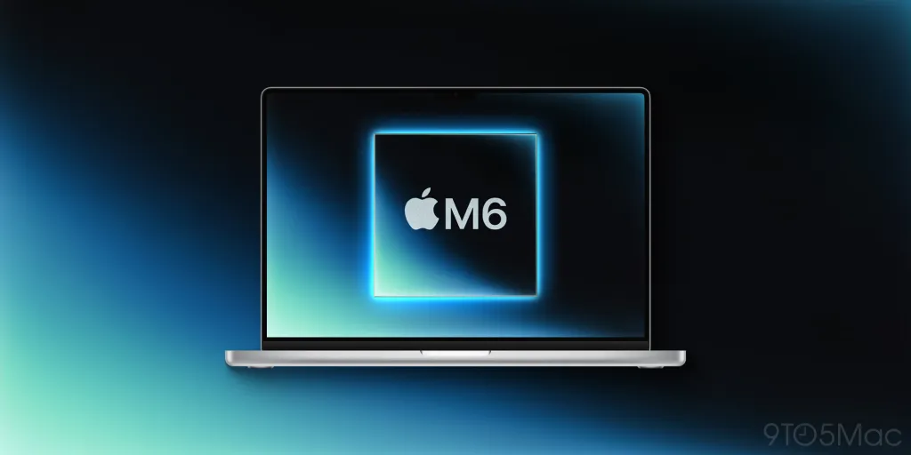
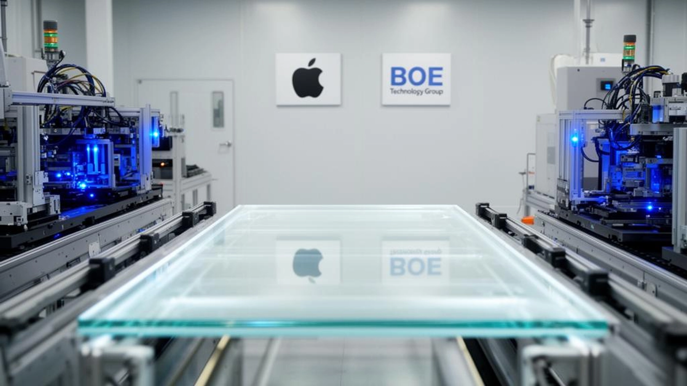
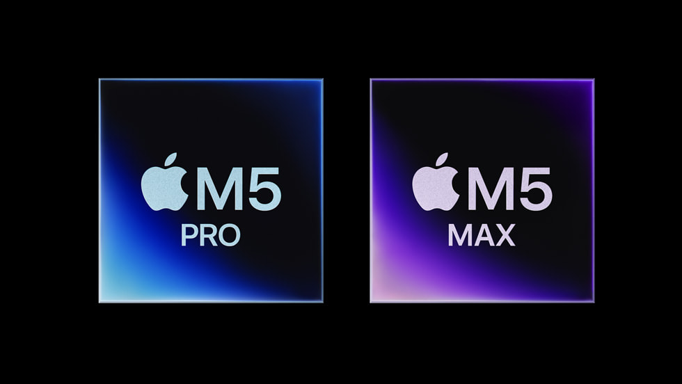
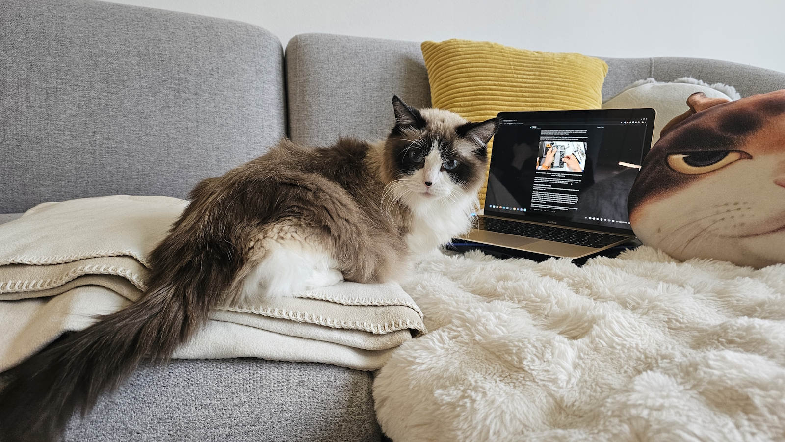

---
#Required fields
title: "MacBook Ultra 2026: Samsung OLED Sendiri Menanggung Apple, BOE Nunggu Di Belakang"
description: "Apple MacBook Ultra dengan layar hybrid OLED 14.3 dan 16.3 inci, Samsung Display supplier tunggal dengan yield 90%+, BOE siap masuk sebagai backup. Supply chain yang biasa multi-supplier kini taruh semua telur di satu keranjang."
pubDate: 2026-06-13
category: "OLED"
cover: "../../assets/blog/16/16.macbook_oled_2026.jpg"
coverAlt: "Visual representation of MacBook Ultra 2026: Samsung OLED Sendiri Menanggung Apple, BOE Nunggu Di Belakang"

#Core Fields
tags: ["MacBook Ultra", "Samsung Display", "Hybrid OLED", "Supply Chain", "BOE", "Apple Silicon"]
author: "Thomas Agung Nugraha"
lang: "id-ID"
draft: false

#recommended
slug: "blog16_macbook_ultra_hybrid_oled"
excerpt: "Bagi saya, keputusan Apple memakai panel hybrid OLED Samsung di MacBook Ultra sangat berisiko. Mari kita bedah rantai pasok layar ini."
updatedDate: 2026-07-04

#Optional-series support
#series: ""
#seriesOrder:

#Optional:SEO & Indexing
canonicalURL: "https://t-agung.id/blog/blog16_macbook_ultra_hybrid_oled"
keywords:
  - MacBook Ultra
  - Samsung Display
  - Hybrid OLED
  - Supply Chain
  - BOE
  - Apple Silicon
noindex: false

#Optional-table-of-content
showToc: true

#optional-internal linking
#relatedPosts:
---

*MacBook Ultra 2026: layar hybrid OLED 14.3 dan 16.3 inci, Samsung supplier tunggal, source image: 9to5mac*

Minggu ini saya lagi baca-baca berita dari WWDC, dan pas liat semua demo Apple Intelligence 2.0 itu, ada satu hal yang langsung muncul di pikiran saya: semua fitur AI keren itu nggak bakal berarti kalau layar laptopmu nggak bisa nunjukin dengan bagus. Moko, si ragdoll kesayangan saya, lagi duduk di keyboard MacBook lama saya. Layarnya masih IPS tahun 2019, warnanya udah agak pudar. Kayaknya dia juga ngerasa laptop itu udah waktunya diganti.

Nah, kabar baiknya buat Apple, dan kabar yang bikin supply chain dunia display harus geleng-geleng kepala, adalah MacBook Ultra. Layarnya OLED. Tapi bukan OLED biasa. Dan yang paling bikin heboh dari sisi industri: cuma Samsung yang bisa bikinnya.

Samsung Display baru saja capai yield di atas 90 persen di lini produksi Gen 8.6 buat OLED laptop. Artinya MacBook Ultra kemungkinan besar datang September 2026. Dan ya, Apple taruh semua taruhan di Samsung doang.

## Hybrid OLED: Bukan OLED Murni, Tapi Campuran yang Lebih Cerdas

MacBook Ultra nggak pakai OLED murni kayak di smartphone. Apple milih hybrid OLED, arsitektur yang nggabungkan oxide TFT backplane (yang biasa dipakai di LCD) sama OLED tandem stack buat lapisan emisinya.

Kenapa hybrid? Karena laptop butuh area layar gede dengan kontrol daya yang ketat. Oxide TFT punya mobilitas lebih rendah dari LTPS, tapi lebih murah dan lebih gampang diskalakan ke layar 14 inci ke atas. Kalau pakai OLED murni dengan LTPS backplane di ukuran segini, dayanya boros dan harganya bakal bikin dompet nangis.

Perumpamaannya kayak gini: hybrid OLED itu persis kayak mobil hybrid. Ambil efisiensi dari sisi yang udah terbukti, tambah performa dari teknologi baru. Ambil kualitas warna dan kontras dari OLED. Ambil efisiensi manufacturing dari oxide TFT yang sudah jalan mulus di industri LCD selama bertahun-tahun. Dua teknologi, satu panel, hasilnya lebih bagus dari keduanya sendirian.

Pas saya masih di Intel ngurusin display tech dari 2015 sampai 2018, konsep hybrid kayak gini sering muncul di meeting. Nggak pernah berhasil karena timing-nya belum pas. Tapi sekarang? Timing-nya beneran pas.

## Samsung Display: Supplier Tunggal, Risiko atau Strategi?

Samsung Display adalah satu-satunya supplier yang dikonfirmasi buat MacBook Ultra. Ini langka banget buat Apple. Perusahaan yang biasa selalu punya minimal dua supplier buat setiap komponen besar, tiba-tiba milih satu.

iPhone punya Samsung, LG Display, dan BOE. MacBook Ultra? Cuma Samsung.

Alasannya sih jelas: Samsung punya lini Gen 8.6 yang khusus dibangun buat IT OLED, dan yield 90 persen-plus itu angka yang luar biasa buat teknologi baru. Produksi pilot dimulai akhir 2025 di lini IT ke-8 (A6) di kampus Asan, Korea Selatan. Mass production komponen dimulai Juni 2026.

Tapi dari sisi supply chain management, ini keputusan yang bikin banyak orang di industri display geleng-geleng kepala. Kalau Samsung punya masalah produksi, entah bencana alam, kebakaran pabrik, atau gangguan geopolitik, Apple nggak punya backup lain yang siap langsung menggantikan.

Pas saya masih di Sony VAIO dari 2008, kita belajar keras sama hal ini. Waktu itu kami bergantung sama satu supplier buat layar LCD. Pas supplier itu ngalamin masalah quality control, seluruh lini produksi langsung berhenti. Rasanya kayak lagi ngemudikan motor di tol dan tiba-tiba ban kempes di tengah jalan. Nggak ada plan B, nyeselnya baru nyesel.

Biasanya, dalam skala kayak gini, multi-supplier lebih diutamakan buat stabilitas. Apple sendiri udah belajar dari masa-masa awal iPhone waktu mereka terlalu bergantung pada Foxconn. Sekarang mereka punya Pegatron, Luxshare, dan Wistron sebagai diversifikasi.

Kenapa Apple ambil risiko ini di display? Saya kira ada tiga alasan.

Pertama, timeline. BOE baru aja nyalain lini Gen 8.6 LTPO OLED mereka di Juni 2026, hampir bersamaan sama Samsung. Dalam dunia display, perbedaan hitungan hari bisa menentukan siapa yang lebih dulu siap supply. Samsung memang udah unggul beberapa minggu karena pilot production sejak akhir 2025.

Kedua, kualitas. Hybrid OLED buat laptop butuh kombinasi presisi yang belum banyak vendor kuasai. Samsung udah mengerjakan ini sejak 2025, sementara BOE masih fase tuning.

Ketiga, Apple mungkin memang berencana bawa BOE masuk sebagai secondary supplier setelah Q4 2026. Pola yang sama kayak iPhone dulu: Samsung ambil bagian pertama, lalu BOE masuk bertahap.

Oh, omong-omong seberapa gede sih Gen 8.6 OLED di BOE ?  itu ukurannya 2,290x2,620mm .. bayangin dia ngeproses OLED segede 2,3 x 2,6 meter sekali proses, itu sama ajah sekitar 88 display MacBook 14 inci di satu gelas !

## BOE: Nunggu Di Belakang, Siap Masuk

BOE nggak diam. Mereka baru aja nyalain lini Gen 8.6 LTPO OLED mereka yang pertama di dunia, dan secara teknologi, lini ini kompatibel sama hybrid OLED maupun flexible OLED. Investasi BOE di lini ini diperkirakan mencapai 8,7 miliar dolar. Kalau dalam rupiah ya sekitar 143 triliun.

BOE udah berpengalaman di panel OLED laptop. Sejak 2024, mereka nyuplai panel OLED fleksibel untuk Huawei MateBook bareng Visionox. Dan mereka juga pernah tampil di SID Displayweek dengan berbagai demo panel. Teknologi oxide TFT mereka sudah matang.

Artinya BOE udah punya teknologi yang relevan. Yang mereka butuhkan cuma waktu buat tuning yield dan dapetin persetujuan Apple, yang terkenal ketat banget soal quality control.

*Apple emang udah banyak make display buatan BOE*

## MacBook Ultra: Spesifikasi yang Diharapkan

MacBook Ultra 2026, nama yang dipakai media. Apple sendiri mungkin tetap menyebut MacBook Pro. Bakal hadir dalam dua ukuran: 14,3 inci dan 16,3 inci. Layarnya hybrid OLED dengan Dynamic Island, dan kemungkinan besar bakal punya touchscreen.

Chipnya? M6 Pro atau M6 Max. Chip M6 udah dikonfirmasi buat MacBook Pro generasi ini, dan dengan NPU yang semakin besar mengingat Apple Intelligence 2.0 butuh compute lokal, prosesor ini bakal punya neural engine yang jauh lebih masif dari seri M5.

*Chip M6 Pro akan punya NPU yang lebih besar untuk Apple Intelligence 2.0*

## Supply Chain: Pelajaran dari Sejarah

Saya ingat masa-masa di Sony VAIO, waktu kami bergantung sama satu supplier buat layar LCD. Pas supplier itu punya masalah quality control, seluruh lini produksi langsung terhenti. Pelajaran yang sama berlaku di industri display sekarang.

Apple mungkin merasa nyaman sama yield 90 persen dari Samsung, tapi angka itu bukan jaminan. Yield bisa turun karena perubahan desain, material baru, atau masalah manufacturing yang nggak terduga. Dan Apple sendiri udah buktiin bahwa mereka nggak mau terjebak di situasi itu lagi.

Omdia memprediksi bahwa hybrid OLED bakal menguasai 89,5 persen dari semua shipment OLED notebook hingga 2033. Pasar OLED laptop diproyeksikan mencapai 4 miliar dolar di 2026, sekitar 63 triliun rupiah, dan tumbuh pesat. Dalam pasar sebesar ini, single-source dependency adalah risiko yang nggak seharusnya Apple ambil jangka panjang.

Saya perkirakan BOE bakal masuk sebagai secondary supplier di 2027. Tapi buat MacBook Ultra yang akan datang di akhir 2026, Samsung adalah satu-satunya nama di balik layar tersebut.

## Penutup

Moko masih duduk di atas MacBook lama saya, yaitu MacBook pertama yang *fanless* yang layarnya masih IPS. Si ragdoll ini nggak bakal tahu kalau tahun ini layar MacBook bakal berubah dari LED-backlit ke OLED. Bagi Moko, itu cuma perbedaan "mana yang lebih hangat kalau saya tidur di atasnya". Dia cuma bengong, ngeliatin saya ngetik ini, dan sesekali ngeludahin bulunya kayak biasa (fakta kalau punya kucing bulunya panjang).

Tapi buat industri display, ini momen yang nyata. Apple, perusahaan yang paling konservatif soal adopsi teknologi baru, akhirnya bawa OLED ke laptop. Dan mereka lakuin dengan arsitektur hybrid yang cerdas. Bukan sekadar niru smartphone, tapi bener-bener menyesuaikan teknologi buat kebutuhan laptop.

Samsung nanggung beban sendirian buat sementara ini. BOE nunggu di belakang, siap masuk. Dan kita sebagai pembaca, pengguna, dan pengamat industri, tinggal nunggu September.

*Moko udah mulai ngiler di keyboard MacBook saya. Kayaknya dia mau bilang: "Tulis yang lebih cepat, nanti MacBook Ultra datangnya lewat."*

---

*Referensi: [Apple Intelligence Tanpa Layar, NPU Jadi Raja, Intel Cari Jembatan Pulang](/blog/blog14_wwdc2026_apple_intelligence_npu/)*
