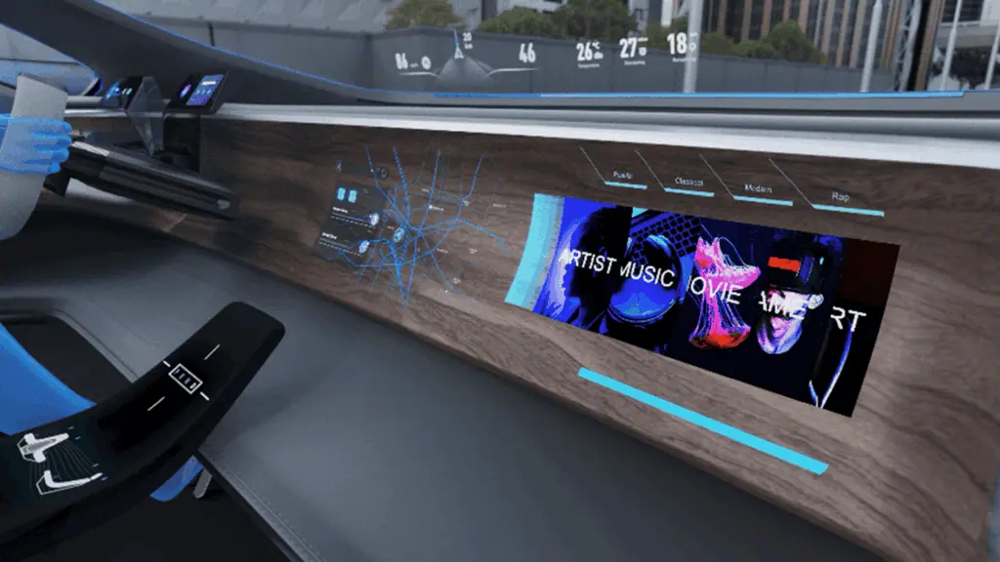
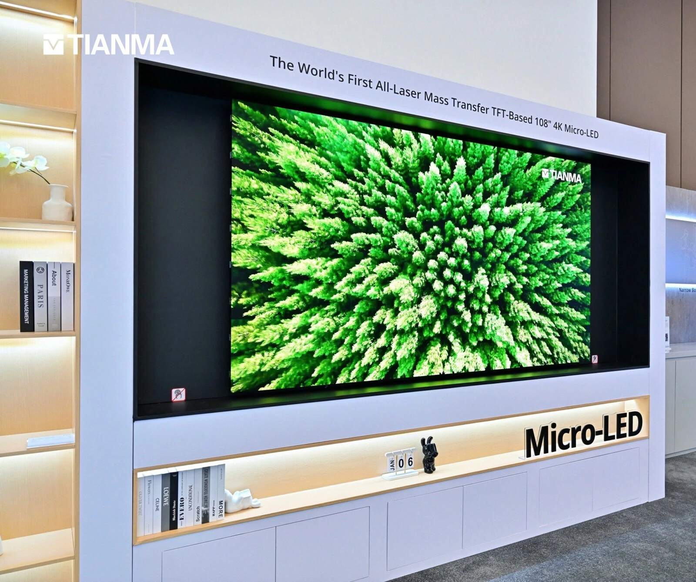
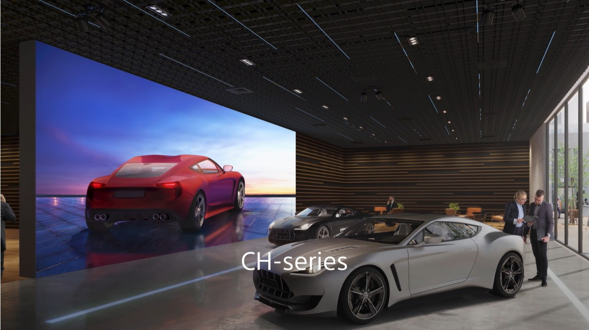
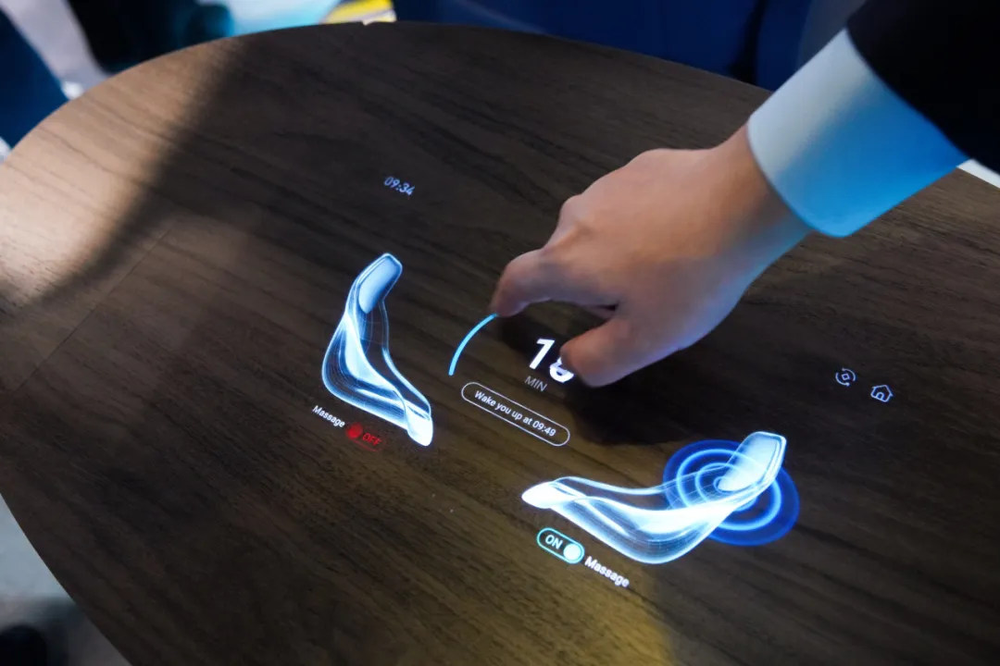
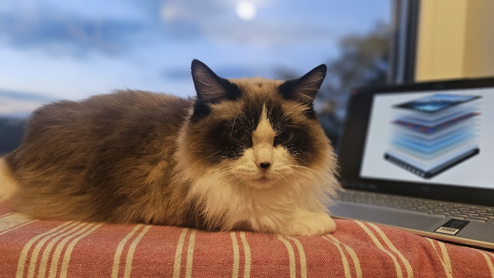

<figure style="text-align: center;">
  
  <figcaption><em>microLED di 2026: dari smartwatch Garmin ke TV Samsung The Wall 110 inci, dari dashboard mobil ke HUD 300.000 nits</em></figcaption>
</figure>

*microLED di 2026: dari smartwatch Garmin ke TV Samsung The Wall 110 inci, dari dashboard mobil ke HUD 300.000 nits*

Saya lagi ngobrol sama orang-orang di industri display tahun ini. Satu nama muncul terus-terusan. Bukan sebagai konsep lab lagi, bukan sebagai teknologi masa depan yang masih menunggu matang. microLED sudah jadi produk nyata, dikirim, dipakai, dan dipakai di kondisi yang kalau dulu kita anggap mustahil buat layar.

Moko ketiduran di atas laptop saya pas saya nulis ini. Dia nggak bisa bedain OLED atau LCD di layar laptop itu, dan jujur, kebanyakan orang pun nggak akan langsung nyadar bedanya. Tapi kalau kamu pernah nemu burn-in di TV OLED setelah beberapa tahun pakai, atau pernah bingung kenapa hitam di LCD kamu nggak pernah benar-benar hitam pekat... nah, microLED ini jawabannya.

Buat pengenalan dulu, baru kita bedah lebih dalam: engineering detail, otomotif, dan timeline harga di bagian-bagian selanjutnya.

## microLED itu apa? Setiap sub-pixel adalah lampu kecil sendiri

Jadi, microLED itu layar di mana setiap sub-pixel merah, hijau, dan biru terbuat dari LED inorganik super kecil, dan masing-masing sub-pixel nyala sendiri sesuai dengan warna yang harus di tampilkan. Nggak ada backlight. Biar lebih jelas, kita bandingin dengan teknologi yang udah ada sekarang.

LCD itu punya backlight yang nyala terus-menerus. Pixel-pixel-nya cuma kerja kayak katup/tirai yang buka-tutup. Efisien? Nggak terlalu. Kontras? Terbatas. Karena walau pixel udah ditutup semaksimal mungkin, tetap ada sedikit cahaya backlight yang selalu tembus.

OLED lebih pinter. Setiap sub-pixel nyala sendiri, tanpa backlight. Kontrasnya sempurna: pixel mati artinya hitam benar-benar hitam, bukan abu-abu gelap. Tapi material emisinya organik. Artinya terdegradasi seiring waktu, juga sensitif dengan lingkungan sekitarnya. Burn-in itu nyata. Dan nggak semua aplikasi bisa toleran.

MicroLED ambil yang terbaik dari keduanya. Setiap pixel nyala sendiri kayak OLED. Tapi materialnya inorganik, kayak LED biasa. LED inorganik itu GaN, gallium nitride (strictly speaking, tergantung warna juga sih..). Material yang sama kayak lampu LED di rumah kamu yang bisa nyala puluhan ribu jam tanpa degradasi berarti.

Gini perumpamaannya: LCD itu kayak lampu ruangan yang dipasangi tirai, cahaya tetap ada, cuma ditutup. OLED kayak lilin di tiap pixel, indah banget tapi cepat habis. microLED kayak lampu LED hemat energi di tiap pixel, terang, awet, dan nggak gampang mati.

## Perbandingan arsitektur: Dari LCD ke microLED

| Parameter     | LCD               | Mini LED                            | OLED                      | microLED          |
| ------------- | ----------------- | ----------------------------------- | ------------------------- | ----------------- |
| Backlight     | Ya (CCFL/LED)     | Ya (LED array rapat)                | Tidak                     | Tidak             |
| Self-emissive | Tidak             | Tidak                               | Ya                        | Ya                |
| Kontras       | 1000:1 s/d 5000:1 | 1.000.000:1+                        | Infinite                  | Infinite          |
| Brightness    | 300-800 nits      | 1000-2000 nits                      | 500-1500 nits             | 1000-10.000+ nits |
| Lifetime      | 60.000 jam        | 60.000 jam (karena tetap pakai LCD) | 30.000 jam (burn-in risk) | 100.000+ jam      |
| Burn-in       | Tidak             | Tidak                               | Ya                        | Tidak             |
| Material      | Inorganik         | Inorganik                           | Organik                   | Inorganik         |
| Cost (2026)   | Terendah          | Rendah-sedang                       | Sedang                    | Sangat tinggi     |

Angka brightness microLED di atas bukan typo. BOE baru saja nunjukin prototype HUD otomotif dengan 300.000 cd/m2 di CES 2026. Bukan 3.000. Bukan 30.000. Tiga ratus ribu nits. Angka ini bukan buat nonton film, tapi buat HUD yang harus terbaca jelas di bawah matahari langsung.

## Kenapa microLED selalu jadi "holy grail"

Dalam dunia display, kita selalu cari segitiga sempurna: warna tajam, kontras tinggi, umur panjang, harga terjangkau. OLED dapet kontras dan warna, tapi masalah di umur. LCD dapet umur, tapi masalah kontras dan tergantung warna dan keterangan display, bisa makan listrik banyak. microLED secara teori bisa dapet semuanya.

Tapi nyatanya, manufacturing-nya yang bikin masalah.

Coba bayangin TV 4K 65 inci. Itu 8,3 juta pixel. Setiap pixel punya tiga subpixel RGB. Jadi **24,9 juta LED mikro** yang harus ditanam satu per satu ke backplane. Bukan direkatkan. Tapi benar-benar ditransfer dari wafer produksinya ke panel tujuan. Dengan presisi mikrometer. Tanpa cacat.

Kalau kamu pernah main puzzle 1000 keping, coba bayangkan versi di mana kepingannya 25 juta, seukuran serbuk, dan kamu cuma punya waktu beberapa menit buat nyusunnya tanpa boleh ada yang salah posisi.

Ini bukan masalah desain. Ini masalah manufacturing scale. Dan ini alasan kenapa microLED sudah ada selama lebih dari satu dekade, tapi terus-terusan dibanderol sebagai "sekarang hampir siap".

## Bottleneck-nya: Masalah mass transfer

Mass transfer adalah proses mengambil jutaan LED mikro dari wafer GaN mereka, lalu memindahkannya ke backplane TFT. Tiga pendekatan utama:

Pick-and-place mekanis. Cara lama. Akurat tapi lambat, bisa butuh berjam-jam buat satu panel. Tidak ekonomis.

Laser-assisted transfer. Di sini, laser dipakai buat melepaskan LED dari wafer sapphire, lalu optik mengarahkannya ke posisi yang benar. Perusahaan seperti Coherent dengan LIFT (Laser-Induced Forward Transfer) dan Samsung dengan LLO (laser lift-off) sudah mencapai kecepatan puluhan ribu dies per detik. Masih jauh dari kebutuhan produksi massal, tapi sudah cukup buat produk premium.

Elastomer stamp. XDisplay pakai teknik stempel yang bisa mengambil seluruh array LED sekaligus. Cocok untuk microdisplay AR dengan pixel pitch di bawah 10 mikrometer, tapi skalabilitas ke panel besar masih belum terbukti.

Tianma baru nunjukin terobosan mereka di CES 2026: proses all-laser mass transfer langsung ke backplane kaca LTPS, bukan PCB. Langkah ini menghilangkan masalah flicker, crosstalk, dan brightness banding yang biasa terjadi pada substrate PCB.

 *Tianma 108 inci microLED dengan all-laser mass transfer ke glass backplane, CES 2026, sumber:Tianma*

## Keadaan microLED di 2026: Sudah ada produk nyata

Garmin fēnix 8 Pro MicroLED, dikembangkan sama AUO. Ini smartwatch pertama di dunia yang beneran pakai microLED sebagai display utama. Layarnya 1,4 inci dengan 326 PPI. Harga peluncuran USD 1.999, turun ke USD 1.699 di Februari 2026. Mahal, ya. Tapi ini bukti microLED sudah bisa diskalakan ke form factor wearable. TAPI.. ternyata microLED yang dipakai di jam ini makan baterai lebih tinggi daripada OLED, dan ini membuat baterai fullcharge  cuma tahan 10 hari vs. versi AMOLED yang awet 27 hari. Trade-off yang masih perlu dikejar. Tapi kecerahan 4.500 nits membuat microLED jauh lebih terbaca di bawah matahari langsung.

*Garmin fēnix 8 Pro MicroLED: smartwatch pertama di dunia dengan layar microLED, hasil kolaborasi dengan AUO*

Samsung masih di puncak dengan The Wall. Selama bertahun-tahun, microLED Samsung hanya tersedia di ukuran besar: 88, 110, dan 146 inci dengan harga mulai dari USD 110.000 untuk 88 inci hingga USD 220.000 untuk 146 inci. Ini beneran self-emissive microLED, bukan LCD dengan backlight. Di CES 2026, Samsung juga meluncurkan TV 130 inci baru yang disebut "Micro RGB". Tapi jangan salah, mereka ini <u>pakai LCD</u> dengan backlight LED RGB yang ukuran mikro, bukan pixel self-emissive. Jadi jangan sampai tertukar: true microLED Samsung tetap di The Wall untuk sekarang.

BOE bikin HUD otomotif dengan kecerahan 300.000 nits. Head-up display ini pakai teknologi microLED panoramic, diperlihatkan di CES 2026 dan Display Week 2025. Ditambah kontrol suara dan gesture berbasis AI dengan tingkat pengenalan 98 persen. Angka segitu bukan buat nonton film. Ini kebutuhan riil buat display yang harus terlihat jelas di bawah cahaya matahari langsung di windshield mobil.

Tianma nunjukin panel microLED 108 inci 4K dengan tiling hampir tanpa bezel, seam width kurang dari 20 mikrometer, dan brightness puncak lebih dari 1.500 nits. Proses all-laser mereka ke glass backplane LTPS bikin kualitas gambar naik level. Nggak ada flicker, nggak ada banding, nggak ada crosstalk.

## Pengalaman saya: Dari Sony VAIO ke Motherson

Tahun 2008 saya mulai nyemplung di dunia professional elektronik, di tim arsitektur Sony VAIO. Zaman itu saya masih ingat duduk di meeting room di Tokyo, diskusi sama tim Jepang tentang liquid crystal yang makin membaik setiap tahun, resolusi naik, warna makin akurat, response time makin cepat, viewing angle makin lebar. Tapi saya selalu merasa ada batas. Backlight itu bottleneck. Seberapa bagus pun liquid crystal, cahaya yang bocor tetap ada. Saya sering mikir pas pulang kerja dari kantor Sony: "Nggak mungkin ini sudah yang terbaik.", dan memang saat itu kita di transisi ke OLED, yang zaman itu masih problematik.

Lalu saya pindah ke Intel dari 2015 sampai 2018, mengurus display tech. Di sinilah OLED mulai jadi mainstream. Kontras sempurna. Hitam yang benar-benar hitam. Tapi masalahnya langsung kelihatan: burn-in. Saya pernah lihat proyek yang coba kompensasi pixel-level buat ngatasin masalah ini. Trade-off-nya selalu ada: kualitas warna turun, atau lifetime memendek.

Ada satu cerita yang ingin saya ceritakan lebih dulu, dari masa-masa saya masih di Sony. Di tahun 2010-2013, saya ikut lihat dari dekat bagaimana microLED mulai dieksplorasi di dalam Sony sebagai teknologi display masa depan. Saat itu, modul-modul microLED masih berupa prototipe internal. Pixel-nya belum sekecil sekarang, yield-nya jauh dari sempurna. Tapi konsepnya sudah jelas: setiap pixel adalah LED inorganik sendiri, tanpa backlight, tanpa material organik yang akan terdegradasi. Saya menyaksikan fondasi ini diletakkan dari dalam.

Beberapa tahun kemudian, di CES 2017, Sony resmi memperkenalkan CLEDIS (Crystal LED Integrated Structure). Dinding video yang terdiri dari panel-panel microLED berukuran 403 x 453 milimeter, dengan pixel pitch 1,25 milimeter, menyusun resolusi setara 8K. Bukan TV buat rumah. Tapi pernyataan yang jelas: Sony punya roadmap untuk microLED, dan mereka serius.

*Sony sudah membawa modular microLED design dari awal, tapi untuk professional dan commercial... lalu Samsung membawa konsep yang hampir sama menargetkan konsumer market, image source: Sony Professional*

CLEDIS kemudian berevolusi menjadi lini produk Sony Crystal LED yang kita kenal sekarang. Seri BH untuk studio broadcast. Seri B dan C untuk film set dan corporate. Crystal LED S untuk display komersial. Semua dipakai di lingkungan profesional: studio siaran yang butuh black level sempurna, kontrol room, space retail mewah yang butuh display yang tidak pernah perlu diganti karena burn-in. Sony membangun ekosistem profesional yang kokoh di atas fondasi microLED itu.

*Sony CH-Series untuk commercial, source: Sony Professional*

Dan sekarang, dua dekade setelah fondasi itu diletakkan, microLED mulai merambah ke konsumen.

Sekarang di Motherson, saya kerja di area HMI otomotif dan additive manufacturing. Di sini kebutuhan display jauh lebih keras: suhu operasi dari minus 40°C sampai 85°C untuk di interiur, lifetime minimal 15 tahun, dan brightness yang harus mengalahkan pantulan matahari di dashboard. LCD masih dominan. OLED mulai masuk, AUDI, Porsche, sudah mulai pakai OLED. Dan semua vendor display yang saya temui di industry event selalu punya satu slide tambahan yang sama: microLED. MicroLED satu-satunya teknologi yang memenuhi semua tiga syarat otomotif sekaligus: brightness tanpa batas, lifetime inorganik, warna tajam dan kontras unlimited.

*BOE demonstrasikan microLED transparan dengan substrate wood grain untuk interior otomotif di CES 2026, bukan konsep lagi, prototype fisik yang bisa disentuh (sumber:eet-china.com)*

*Tianma tunjukkan prototipe 19 inci transparent microLED untuk automotive di SID Displayweek 2026, tiga panel ultra-narrow-border di-join tanpa seam yang terlihat (sumber: computerbase)*

## Market data: Angka yang harus diketahui

Pasarnya masih kecil, tapi tumbuh eksponensial. Beberapa forecast (perhatikan bahwa angka ini sulit diverifikasi secara independen karena definisi "microLED" berbeda di tiap laporan, dan beberapa termasuk miniLED):

Grand View Research memproyeksikan pasar microLED global mencapai USD 25,6 miliar pada 2030, tumbuh dari USD 623,6 juta di 2023, dengan CAGR 77,4 persen. GM Insights memperkirakan USD 15,7 miliar pada 2030 dan USD 163,1 miliar pada 2034. SNS Insider, baru-baru ini di Juni 2026, memproyeksikan USD 27,3 miliar pada 2035 dengan segmen AR/VR sebagai pertumbuhan tercepat.

Angka-angka ini bervariasi tergantung definisi "microLED", beberapa termasuk miniLED, beberapa tidak. Tapi trennya konsisten: ini pasar yang akan tumbuh dari ratusan juta dolar ke puluhan miliar dolar dalam satu dekade.

Tapi forecast itu cuma angka. Pertanyaan yang lebih relevan: kapan microLED masuk ke kantong biasa?

Garmin fēnix 8 Pro MicroLED harganya sekitar USD 1.699 (turun dari USD 1.999). Samsung The Wall 88 inci true microLED mulai dari USD 110.000, 110 inci sekitar USD 150.000, dan 146 inci mencapai USD 220.000. Angka itu jelas bukan buat kita. Tapi Garmin sudah buktiin microLED bisa masuk wearable, dan Tianma buktiin proses all-laser ke glass backplane bisa diskalakan ke panel besar. Setiap teknologi display selalu mulai mahal dulu, lalu turun eksponensial. Dari CRT ke LCD, dari LCD ke OLED, sekarang microLED lagi di fase yang sama.  (sorry Plasma TV... umur kamu terlalu pendek)

## microLED vs OLED vs LCD: Mana yang harus kamu pilih?

Gini rekomendasinya:

Kalau kamu cari TV biasa buat nonton di ruang tamu dengan budget normal, LCD dengan mini LED backlight masih jadi pilihan terbaik di 2026. Harga terjangkau, kualitas sudah sangat baik, dan tidak ada risiko burn-in.

Kalau kamu cinephile yang nonton di ruangan gelap dengan HDR, OLED masih tak tertandingi buat kontras dan akurasi warna di ukuran di bawah 65 inci. Tapi kamu harus terima satu hal: setelah beberapa tahun, terutama kalau nonton konten statis seperti taskbar atau logo TV, ada risiko burn-in.

Kalau kamu pengguna smartwatch outdoor, Garmin fēnix 8 Pro MicroLED sudah bisa dibeli. Kamu dapet display yang bisa dibaca di bawah matahari langsung, dengan umur jauh lebih panjang dari OLED (dengan anggapan baterenya tetap hidup)... tapi ada satu kekurangannya, di jam pintar ini, ternyata microLED lebih boros makan listrik dibanding OLED.

Kalau kamu ingin investasi jangka panjang dan budget bukan masalah, Samsung The Wall true microLED sudah bisa dibeli, mulai USD 110.000 untuk 88 inci. Atau kamu bisa menunggu beberapa tahun lagi saat mass transfer makin cepat, yield naik, dan harga turun. Pertanyaan utamanya: mau bayar premium sekarang, atau sabar menunggu?

## Seri ini berlanjut

Ini baru bagian pertama. Lanjutannya:

Bagian kedua kita masuk ke detail engineering yang biasanya nggak dibahas di press release. Bagaimana microLED dibuat dari wafer GaN, arsitektur driver-nya, backplane LTPS versus MicroIC, dan kenapa, meskipun secara fisik lebih sederhana dari LCD, manufacturing microLED justru jauh lebih menyakitkan.

Bagian ketiga fokus otomotif. Detail HUD 300.000 nits dari BOE, transparent microLED buat instrument cluster, dan cerita langsung saya di Motherson pas lihat prototipe vs mass production gap. Ada satu prototipe yang bikin saya kaget, dan saya cerita di bagian itu.

Bagian keempat timeline dan prediksi harga. Kapan microLED masuk ke rumah biasa, berapa harga yang realistis buat setiap ukuran, dan apakah worth it menunggu atau beli OLED sekarang.

## Penutup

Moko masih di laptop saya. Seperti biasa, dia nggak peduli teknologi layar apa yang dipakai. Yang penting permukaan laptop cukup hangat buat tidur.

Tapi saya peduli. Melihat industri display bergerak dari LCD ke OLED ke microLED itu terasa kayak melihat evolusi fotografi: dari film ke digital ke computational photography. Setiap lompatan terasa kecil sampai kamu benar-benar memakainya sehari-hari.

microLED bukan lagi mimpi. Samsung The Wall sudah dijual di ukuran 88 hingga 146 inci. Garmin sudah kirim smartwatch. BOE sudah nunjukin HUD 300.000 nits. Tianma sudah tunjukkan proses all-laser ke glass backplane. Pertanyaannya bukan "kapan" lagi. Tapi "berapa lama sampai harganya masuk akal". Dan saya bahas itu di bagian keempat.

*Moko yang masih stuck belajar LCD layer dari blog bulan kemarin. Moko!... kita lagi belajar masa depan sekarang *

---

*Referensi: [LCD Stackup Series (blog_04-06)](/blog/blog04_lcd_backlight/), [SID 2026 Recap (blog15)](/blog/blog15_sid2026_display_week/), [MacBook Ultra Hybrid OLED (blog16)](/blog/blog16_macbook_ultra_hybrid_oled/)*

*Catatan teknis: Samsung "Micro RGB" (2025-2026) adalah LCD dengan backlight RGB mikro LED, BUKAN self-emissive microLED. True microLED Samsung adalah "The Wall" dalam ukuran 88", 110", 146".*
