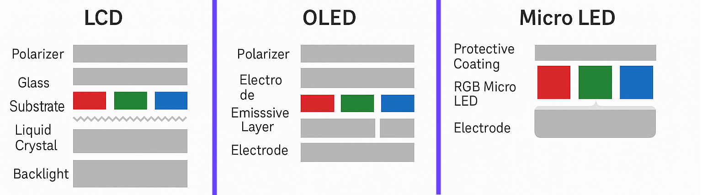
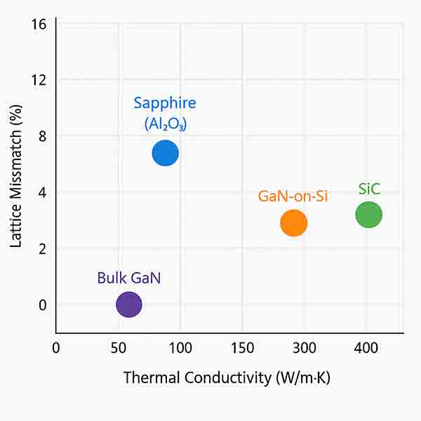

---
#Required fields
title: "microLED Deepdive 2a/4: Stackup, Chip, Material, dan Perang Warna"
description: "Bagian 2-a seri microLED. Bedah lengkap dari wafer GaN, chip 50 mikrometer, masalah green gap, dan kenapa secara fisik lebih sederhana tapi manufacturing-nya jauh lebih menyakitkan dari LCD."
pubDate: 2026-06-16
category: "deepdive"
cover: "../../assets/blog/18/18.LCD_OLED_microled_hero.png"
coverAlt: "Visual representation of microLED Deepdive 2a/4: Stackup, Chip, Material, dan Perang Warna"

#Core Fields
tags: ["microLED", "display", "GaN", "substrate", "quantum dot", "automotive", "HMI", "additive manufacturing"]
author: "Thomas Agung Nugraha"
lang: "id-ID"
draft: false

#recommended
slug: "blog18-a_microled_stackup"
excerpt: "Berdasarkan pengalaman saya, membuat microLED itu luar biasa sulit. Mari saya bedah tantangan fisik wafer GaN hingga masalah warna hijau."
updatedDate: 2026-07-04

#Optional-series support
series: "microLED Deep Dive"
seriesOrder: 2

#Optional:SEO & Indexing
canonicalURL: "https://t-agung.id/blog/blog18-a_microled_stackup"
keywords:
  - microLED
  - display
  - GaN
  - substrate
  - quantum dot
  - automotive
  - HMI
  - additive manufacturing
noindex: false

#Optional-table-of-content
showToc: true

#optional-internal linking
relatedPosts:
  - blog17_microled_intro
  - blog18-b_microled_stackup
---

<center>*microLED dibandingin ama teknologi display lain*</center>

Bagian pertama seri kita sudah kita bahas bareng: microLED itu apa, kenapa semua orang bilang ini holy grail teknologi display, dan produk apa aja yang sudah bisa kamu pegang di tangan tahun 2026. Kalau kamu belum baca, mending balik dulu ke [bagian pertama (microLED Apa Itu?)](/blog/blog17_microled_intro/) biar nggak bingung. Nah, di bagian ini kita langsung masuk ke dapur. Kita bedah detail engineering-nya.

Moko lagi duduk di meja kerja saya, persis di antara keyboard dan secangkir teh yang sudah nggak panas. Ragdoll ini punya insting unik: begitu laptop nyala, dia langsung tahu ini waktu yang tepat buat duduk di atas keyboard. Mungkin dia merasa jadi penjamin kualitas layar, atau mungkin dia cuma suka getik-getik keyboard sambil mata setengah buka. Yang jelas, Moko dan layar itu selalu ada hubungannya.

Tapi kali ini saya bener-bener mau fokus ke sesuatu yang jarang dibahas di press release: bagaimana microLED dibuat, dari wafer mentah sampai jadi panel yang kamu lihat setiap hari. Dan beneran, ini jauh lebih rumit dari yang kebanyakan orang bayangkan.

## Kenapa Lebih Susah dari LCD?

Dulu saya punya asumsi yang keliru. Secara fisik microLED itu lebih sederhana: nggak ada backlight, nggak ada polarizer, nggak ada liquid crystal cell. Logikanya sih pasti lebih gampang dibuat, ya? Ternyata saya salah besar.

LCD itu sudah matang selama 40 tahun. Supply chain-nya sudah berjalan mulus, proses fabrikasinya jalan 24/7 dengan yield di atas 90 persen, dan biaya per inci sudah turun drastis. Kamu beli panel IPS dari pabrik di China, barangnya datang sudah siap pasang. Selesai.

Sedangkan microLED itu? Kamu harus transfer 25 juta LED mikro satu per satu dari wafer GaN ke backplane. Bukan cuma ngangkut. Tapi harus presisi di tingkat mikrometer, harus di-inspeksi satu per satu, harus diperbaiki yang mati, dan harus dikalibrasi brightness-nya per pixel.

Biar lebih gampang dibayangkan, perumpamaannya begini: LCD itu kayak mencetak fotokopi. Kamu setel mesin sekali, terus ribuan lembar keluar rapi. microLED itu kayak merangkai puzzle 25 juta keping, dan setiap keping harus nyala dengan warna serta kecerahan yang persis sama. Kalau satu keping salah, langsung keliatan. Proses fabrikasi LCD itu kayak aliran air yang terus-menerus. Proses microLED itu kayak pick-and-place di skala mikro, yang artinya setiap pixel adalah keputusan engineering tersendiri.

## Kenapa Harus microLED?

Karena microLED punya keunggulan yang nggak bisa ditiru teknologi lain:

- Self-emissive. Setiap piksel memancarkan cahaya sendiri, tanpa backlight.
- Kontras tak terbatas. Piksel hitam itu benar-benar mati, bukan sekadar "diminimalisir kayak LCD."
- Brightness luar biasa. Bisa tembus ribuan nits tanpa masalah.
- Lifetime panjang. Material anorganik, nggak gampang degrade kayak OLED.
- Respons cepat. Switching dalam order microsecond, bukan millisecond.

Gini perumpamaannya: microLED mencoba menggabungkan kelebihan OLED (kontras, respons cepat) dan LED tradisional (durabilitas, brightness) tanpa kekurangan keduanya. Macam kamu mau mobil yang secepat sports car tapi sehemat motor bebek.

## Chip: GaN dan Material Science

Semua microLED, tanpa terkecuali, menggunakan Gallium Nitride (GaN) sebagai material semikonduktor utamanya. Ini material yang sama yang dipakai di charger HP fast-chargingmu, tapi di sini dipakai untuk membuat cahaya, bukan untuk mengalirkan arus.

### Struktur Chip

Setiap RGB sub-pixel di layar microLED itu adalah LED sungguhan. Bukan material organik yang lama-lama luntur kayak OLED, bukan kristal cair yang cuma buka dan tutup. Tapi chip semikonduktor yang benar-benar memancarkan cahaya sendiri.

Materialnya disebut III-V compound semiconductor. Itu istilah nerd teknisnya. Yang perlu kamu pahami: ini bukan silikon biasa. Silikon memang bagus buat prosesor, tapi buruk banget buat memancarkan cahaya. Dia itu indirect bandgap, artinya ketika elektron jatuh ke hole, dia nggak langsung memancarkan foton. Energi itu hilang jadi panas dulu.

microLED pakai GaN, gallium nitride. Material yang sama kayak LED putih di lampu rumah kamu. Bedanya ukuran, dan bedanya itu drastis. LED biasa di lampu rumah ukurannya 200 mikrometer ke atas. microLED? lebih kecil dari 50 mikrometer. Coba bayangkan kamu mengecilkan LED sebanyak empat kali di setiap dimensi. Volumenya jadi 1/64 dari yang asli. Kecilnya bikin kaget. Kalau kamu bisa melihat microLED dengan mata telanjang, rasanya kayak melihat lilin seukuran butiran pasir yang tetap terang benderang.

Setiap chip microLED punya struktur dasar:

```
[ Substrate ]
    |
[ Buffer Layer (AlN) ]
    |
[ n-GaN (layer elektron) ]
    |
[ Active Region — Quantum Wells ]
    |
[ p-GaN (layer hole) ]
    |
[ Kontak Listrik ]
```

Ketika elektron dari sisi-n bertemu hole dari sisi-p di dalam active region, mereka rekombinasi dan melepaskan energi dalam bentuk foton. Panjang gelombang foton itu menentukan warnanya.

Dan di sinilah ceritanya mulai jadi rumit.

### Substrate: GaN on Sapphire vs GaN on SiC

GaN punya lattice constant yang beda jauh dari silikon. Kalau kamu pernah main lego dan mencoba menempelkan dua set yang nggak cocok, ya, situasinya mirip begitu. Ketidakcocokan lattice ini bikin GaN di atas silikon penuh dengan dislokasi, dan dislokasi itu mengurangi efisiensi.

Opsi substrate adalah:

- Silikon: murah, ukuran besar, tapi mismatch lattice parah.
- Sapphire: lebih kompatibel, tapi mahal dan ukuran terbatas.
- Silicon Carbide (SiC): termal konduktivitas terbaik, tapi termahal.
- GaN-on-GaN: ideal, tapi belum bisa diproduksi massal.

Tapi di industri sekarang dua pilihan utamanya:

Sapphire (Al2O3). Ini yang paling umum buat LED putih konsumen. Murah, matang, dan sudah dipakai bertahun-tahun. Tapi thermal conductivity-nya rendah, artinya panas susah keluar. Buat microLED yang udah kecil dan punya current density tinggi, panas itu musuh utama.

Silicon Carbide (SiC). Thermal conductivity-nya jauh lebih baik dari sapphire. Lattice match-nya juga lebih pas. Tapi harganya 2,5-4 kali lebih mahal dari sapphire. Buat produksi massal, ini jadi pertimbangan ekonomi yang berat.

Kompromi abadi antara biaya dan kualitas. Di automotive, biasanya kita pilih kualitas dulu dan baru menghitung biaya (sedikit dmei sedikit berubah dengan pengaruh industri China). Karena kalau display di dashboard mati di tengah jalan tol, itu bukan sekadar "gagal," itu "masalah keamanan."



<center>*Perbandingan GaN-on-Sapphire dan GaN-on-SiC: sapphire murah tapi konduktivitas termal rendah, SiC mahal tapi pelepasan panas jauh lebih baik, dan ini menentukan mana yang bisa dipakai buat microLED massal*</center>

Di atas kamu bisa lihat perbandingan keduanya. Sapphire punya thermal conductivity sekitar 35 W/mK, sementara SiC bisa mencapai 300-400 W/mK, hampir 10 kali lipat. Buat display yang nyala 10 jam sehari, bedanya nyata.

Perumpamaannya kayak memilih lantai rumah. Sapphire itu kayak lantai keramik biasa: murah, gampang dapat, tapi kalau kamu ngepel pakai air panas, lantai itu nyimpan panasnya. SiC itu kayak lantai granit premium: mahal pas dibeli, tapi panas langsung terserap dan keluar. Nah, buat microLED yang harus nyala berjam-jam, lantai granit lebih masuk akal.

Journal Light: Science & Applications baru-baru ini mempublikasikan riset tentang GaN-on-Silicon epilayers yang mencapai brightness di atas 10^7 cd/m² buat pixel 5 mikrometer. Breakthrough ini menarik karena Silicon jauh lebih murah dari SiC dan sudah punya infrastruktur fab 300mm yang matang. Tantangannya: lattice mismatch antara GaN dan Silicon itu 16,4 persen, angka yang sangat besar. Tim riset ini berhasil pakai buffer layer yang sangat teliti. Impressive.

### Mencetak Chip: Epitaksi

GaN ditumbuhkan di atas substrate menggunakan proses yang disebut Metal Organic Chemical Vapor Deposition (MOCVD). Prosesnya: gas organometalik dimasukkan ke dalam reactor dengan suhu di atas 1000°C, lalu lapisan GaN tumbuh atom demi atom.

Bayangkan kamu sedang membangun tembok bata, tapi setiap bata harus pas sempurna. Kalau ada satu yang gak pas atau miring, seluruh tembok jadi beresiko. Itulah epitaksi.

## Masalah Mengecilkan LED: Ukuran Bukan Sekadar Angka

Saat kamu mengecilkan LED, beberapa hal buruk terjadi bersamaan. Kayak efek domino.

Pertama, current density naik. LED dioperasikan dengan arus listrik. Kalau ukuran chip mengecil tapi arus tetap sama, rapat arusnya naik drastis. Di atas threshold tertentu, efisiensi turun. Efek ini disebut *efficiency droop*. Artinya kamu butuh lebih banyak arus buat dapetin brightness yang sama, dan itu menghasilkan lebih banyak panas. Lingkaran setan sudah dimulai.

Kedua, masalah sisi. LED memancarkan cahaya dari area chip dan juga dari sisi chip, dan apa efeknya? *Light leakage*, atau cahaya bocor. Buat LED besar, cahaya dari sisi itu proporsinya kecil banget. Tapi buat LED mikro, area sisi relatif terhadap area chip naik signifikan. Cahaya bocor dari sisi berarti efikasi brightness turun dan color shift terjadi karena cahaya sisi melewati material yang berbeda.

Ketiga, heat dissipation. microLED itu kecil, tapi current density-nya tinggi. Panas harus keluar dari area yang sangat sempit. Kalau panas menumpuk, GaN mengalami thermal quenching, alias brightness turun saat chip menghangat. Di display yang beroperasi 10 jam sehari, ini masalah serius yang nggak bisa diabaikan.

Keempat, dan ini yang paling halus: *size effect*. Makin kecil chip, makin buruk efisiensi konversi energinya. Ini bukan cuma soal fisik yang mengecil — struktur kristal di area aktif jadi lebih rentan terhadap defect, dan efek polarisasi internal makin dominan. Jadi kecilnya bukan soal "mampukah ini nyala" tapi "mampukah ini bertahan".

Biar lebih gampang dibayangkan: kamu punya lampu sorot stadion. Sekarang bayangkan kamu mau hasilkan kecerahan yang sama dari lampu senter. Masalahnya bukan bagaimana menyalakannya, tapi bagaimana menjaga suhu agar tidak meleleh.

## The Green Gap & Red Gap

Ini masalah klasik yang sudah ada sejak era LED biasa dan sampai hari ini belum benar-benar selesai di microLED. bikin insinyur display susah tidur nyenyak.

Kalau kamu nyelokin riset GaN, kamu akan dengar istilah "green gap" dan "red gap". Kenapa keduanya ada?

### Kenapa Hijau dan Merah Lebih Susah?

Pertama, band gap energi. Warna hijau butuh energi foton di tengah spektrum, dan material GaN/InGaN sulit mencapai efisiensi optimal di titik ini. Merah InGaN punya masalah yang sama, tapi lebih parah karena butuh indium lebih banyak untuk mencapai panjang gelombang merah.

Kedua, self-absorption. Foton hijau yang dihasilkan punya energi yang cukup untuk diserap ulang oleh chip itu sendiri sebelum sempat keluar.

Ketiga, polarisasi. Struktur kristal GaN punya polarisasi internal yang bikin medan listrik di dalam chip menghambat rekombinasi elektron-hole, dan efek ini makin kuat di area spektrum hijau-merah.

Keempat, buat LED hijau sekarang, efisiensi masih baru sekitar sepertiga dari target yang ditetapkan dalam roadmap DOE 2035. Ada pemisahan fasa (phase separation) selama pertumbuhan epilayer yang nurunin rekombinasi radiatif. Dan perlu kandungan indium yang tinggi pada material InGaN untuk ngeluarin warna hijau, yang nurunin kualitas material dan efisiensi.

Kalau kamu punya display microLED yang chip hijaunya cuma setengah efisien dari warna lainnya, kamu punya dua pilihan. Opsi pertama: naikin arus ke chip hijau biar seterang merah dan biru. Tapi arus tinggi berarti panas, dan panas berarti degradasi lebih cepat. Moko bakal bilang "sabar dong, nggak semua hal harus dipaksa."

Opsi kedua: terima saja bahwa display kamu bakal sedikit kebiruan, dan coba kompensasi dengan color calibration. Warna jadi nggak akurat.

### Merah Ternyata Justru Lebih Parah

Waktu ukuran chip LED merah diperkecil sampai sekitar 5 mikron, efisiensi bisa turun drastis dari sekitar 60% sampai hanya ~1%. InGaN untuk emisi merah punya medan polarisasi yang kuat di area aktif, yang nurunin efisiensi emisi di panjang gelombang merah. Banyak produsen akhirnya milih material InGaP (indium gallium phosphide) untuk LED merah, tapi material ini juga punya masalah penurunan efisiensi waktu dibuat ke ukuran mikroLED yang sangat kecil.

Berikut perbandingan kasar External Quantum Efficiency (EQE) untuk microLED:

| Warna | Material | EQE (chip kecil)                                     | Catatan                                             |
| ----- | -------- | ---------------------------------------------------- | --------------------------------------------------- |
| Biru  | GaN      | ~30-40% industri, bisa 58% di lab untuk device besar | Sudah matang                                        |
| Hijau | InGaN    | ~7-14% pada chip 40x40 µm, turun jadi <7% di 5 µm    | Size effect parah                                   |
| Merah | InGaN    | <5%                                                  | "Red gap": lebih parah dari green gap               |
| Merah | AlGaInP  | ~20-50%                                              | Butuh substrate GaAs yang beda sama sekali dari GaN |

Lihat satu hal penting. Angka EQE ini untuk chip microLED yang kecil. Makin kecil chip, makin buruk efisiensinya — dan efek ini paling fatal di hijau dan merah.

Gini perumpamaannya: biru itu kayak mesin yang udah dituning ama professional, langsung jalan mulus, ngebut. Hijau kayak mesin yang harus kamu modifikasi sendiri dan hasilnya masih nggak konsisten. Merah InGaN? Itu kayak kamu make mesin mobil jaman 40an. Mau nyalain aja susah, kudu ngengkol dulu.

## Solusi Warna: Tiga Pendekatan RGB

Nah, setelah kita tahu masalahnya, bagaimana industri mengatasi semua ini? Ada tiga pendekatan utama untuk menghasilkan warna merah, hijau, dan biru di microLED.

### Pendekatan 1: Semua Epitaksi (Pure Direct)

Tiga chip berbeda yang masing-masing ditanam untuk menghasilkan warna tertentu:

- Merah: AlGaInP dengan substrate GaAs.
- Hijau: InGaN di atas GaN.
- Biru: InGaN di atas GaN, komposisi indium beda.

Ini pendekatan "murni". Semuanya berasal dari epitaksi langsung. Masalahnya: merah pakai material yang beda sama sekali, sehingga proses manufaktur jadi dua jalur terpisah yang harus disinkronkan. Macam kamu harus masak dua menu di dua dapur yang beda lokasi, tapi harus disajikan bersamaan.

Ada juga riset yang jalan di jalur alternatif: Cubic GaN. Pendekatan ini pakai fase kristal kubik (bukan heksagonal) yang mengurangi atau bahkan ngilangin medan polarisasi internal — salah satu akar masalah green gap. Sudah dilaporkan internal quantum efficiency (IQE) sampai sekitar 32% dengan kandungan indium hanya 16%. Angka ini besar untuk quantum efisiensi. Tapi ini masih di tahap lab, belum production-ready.

### Pendekatan 2: Biru + Quantum Dot

Chip biru untuk semuanya, plus quantum dot converter untuk hijau dan merah. Ini pendekatan paling praktis saat ini. Chip biru sudah matang, dan quantum dot sudah terbukti di TV QLED.

Cara kerjanya: chip biru memancarkan cahaya biru, cahaya itu masuk ke quantum dot, dan quantum dot menyerap cahaya biru lalu memancarkan cahaya hijau atau merah tergantung material quantum dot-nya.

Kelebihannya jelas. Chip biru sudah sangat efisien. Pionir Shuji Nakamura sudah dapat Nobel karena ini. Quantum dot punya konversi yang sangat efisien dan warna yang sangat murni.

Sekian soal kekhawatiran toxicity. Quantum dot modern sudah pakai Indium Phosphide (InP), cadmium-free, dan ini sudah dipakai secara komersial di display modern. Performanya sudah sangat baik. Nggak perlu takut lagi soal kadmium.

Kekurangannya masih ada: menambah satu layer lagi ke dalam stack berarti biaya lebih dan kompleksitas lebih. Quantum dot juga bisa degrade jika terkena panas dan cahaya UV terlalu lama, meskipun stabilnya sudah jauh lebih baik dibanding generasi awal.

Jadi ya, ini bukan solusi sempurna. Tapi ini solusi yang bisa kita jual hari ini. Dan di dunia komersial, "bisa dijual hari ini" seringkali lebih penting daripada "sempurna lima tahun lagi."

### Pendekatan 3: Biru + Color Filter

Chip biru plus filter warna konvensional. Mirip seperti cara LCD bekerja, tapi karena cahaya sudah datang dari sumber yang sama (biru), masalah color uniformity lebih mudah dikelola.

Kekurangannya: color filter menyerap sebagian cahaya, jadi efisiensi turun signifikan. Tapi untuk aplikasi dengan area kecil seperti smartwatch atau AR glasses, ini bisa diterima.

### Pendekatan Bonus: AlGaInP untuk Merah

Kalau kamu pilih AlGaInP untuk chip merah, kamu dapet efisiensi jauh lebih baik dari InGaN merah. Tapi material ini tumbuh di substrate GaAs, bukan GaN. Jadi kamu punya dua jalur manufaktur yang harus disinkronkan — satu untuk GaN (biru + hijau) dan satu untuk GaAs (merah). Ribet, tapi bisa dilakukan. Beberapa produsen besar sudah jalan di jalur ini.

Jadi tidak ada jawaban tunggal. Setiap pendekatan punya trade-off antara efisiensi, kompleksitas manufaktur, dan biaya. Pilihan yang tepat tergantung aplikasi dan target market.

## Driver: IC yang Mengendalikan Jutaan Piksel

Chip microLED nggak bisa hidup sendiri. Dia butuh driver. Driver IC ini menentukan seberapa terang setiap sub-piksel harus menyala, dan dia harus bekerja sangat cepat karena display modern punya refresh rate tinggi.

### Arsitektur Driver

Ada dua pendekatan.

On-chip driver. Transistor integrasi langsung di dalam chip LED. Ini meminimalkan jarak antara kontrol dan emisi, tapi menambah kompleksitas fabrikasi chip.

Off-chip driver. Chip driver terpisah yang terhubung ke LED melalui wire bonding atau flip-chip bonding. Lebih mudah diproduksi, tapi butuh ruang lebih dan koneksi lebih banyak.

### Perhitungan Skala

Ambil contoh display resolusi Full HD 1920 x 1080 dengan tiga sub-piksel per piksel:

```
1920 x 1080 x 3 = 6.220.800 sub-piksel
```

Setiap sub-piksel butuh kontrol arus yang presisi. Kalau driver-nya 24-bit (masuk akal untuk gradasi warna yang halus), berarti setiap piksel perlu menangani data 24-bit x 3 = 72-bit per frame.

Pada 60 Hz, itu berarti:

```
6.220.800 x 72 bit x 60 = 26.967.360.000 bit/second
```

Itu hampir 27 Gbps hanya untuk feed data ke display. Belum termasuk timing controller, interface protocol, dan overhead lainnya.

Moko mungkin nggak ngerti, tapi setiap kali dia duduk di monitor, dia duduk di atas jutaan piksel yang masing-masing dikendalikan oleh sirkuit sekecil semut. Ironis, ya. Kucing paling malas di rumah ini jadi supervisor alami dari sistem yang paling kompleks.

### Masalah Thermal

Driver IC yang mengendalikan arus tinggi ke chip LED juga menghasilkan panas. Di display microLED dengan densitas tinggi, panas dari driver bisa naik ke chip LED dan menyebabkan color shift. Temperatur naik bikin panjang gelombang emisi berubah.

Solusinya? Thermal management yang serius. Heat spreader, thermal via di PCB, dan kadang bahkan active cooling di aplikasi high-end automotive.

## Kesimpulan Bagian 2a

Semua microLED pakai GaN, tapi substrate jadi kompromi abadi antara biaya dan kualitas.

Mengecilkan LED bukan sekadar soal membuatnya lebih kecil — current density, light leakage, thermal quenching, dan size effect semuanya muncul bersamaan dan saling memperparah.

Green gap masih jadi masalah terbuka. Hijau nggak seefisien biru. Merah InGaN bahkan lebih parah, dan industri harus memilih antara AlGaInP dengan substrate yang beda atau jalan pintas biru-plus-quantum-dot.

Tiga pendekatan warna, masing-masing punya trade-off sendiri. Nggak ada jawaban tunggal yang cocok untuk semua aplikasi.

Driver IC harus mengendalikan jutaan piksel dengan presisi tinggi. Dan ini bukan tugas remeh.

Bagian 2b akan membahas sisi yang lebih "berdarah-darah" dari microLED: proses manufaktur, mass transfer, inspeksi, dan angka-angka yang bikin insinyur display kadang merasa perlu liburan panjang.

Moko sudah kembali ke tempat tidurnya. Mungkin lelah melihat saya menulis tentang quantum well selama dua jam. Atau mungkin karena dia cuma kucing yang tidur sampai 18 jam sehari.
