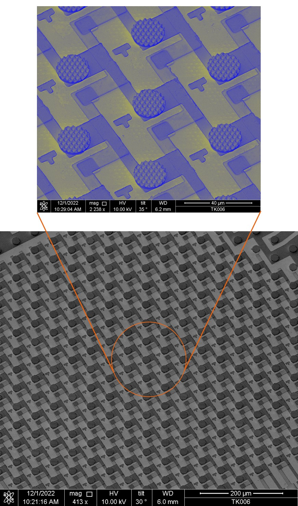

Bagian 2a sudah membahas soal chip, material, dan perang warna hijau. Sekarang kita masuk ke bagian yang lebih berdarah — proses manufaktur yang bikin insinyur display sering merasa butuh cuti panjang.

Kalau kamu pikir epitaksi itu susah, tunggu sampai kamu harus mengambil jutaan chip seukuran 40 mikron dan menempatkannya di posisi yang tepat, satu per satu, tanpa merusak satu pun.

Moko sedang duduk di samping laptop saya dan menatap layar seperti "kamu benar-benar harus menulis tentang ini, Bang?" Ya, benar-benar harus.

---

## Backplane: LTPS atau MicroIC?

Sebelum chip microLED bisa dipasang, kita butuh tempat untuk menaruhnya. Tempat itu disebut backplane — dan ada dua pendekatan yang bersaing.

### LTPS Backplane

LTPS (Low Temperature Polysilicon) adalah teknologi yang sama yang dipakai di panel smartphone premium. Struktur backplane LTPS terdiri dari:

```
[ Glass Substrate ]
    |
[ LTPS TFT Array — satu TFT per sub-piksel ]
    |
[ Capacitor per piksel ]
    |
[ Bonding Pad untuk chip LED ]
```

Kelebihan LTPS:
- **Teruji** — proses ini sudah matang dari industri smartphone selama bertahun-tahun
- **Densitas tinggi** — TFT bisa dibuat sangat kecil, cocok untuk resolusi tinggi
- **Biaya per unit rendah** — skala ekonomi sudah ada

Kekurangan:
- **Glass substrate kaku** — nggak cocok untuk display fleksibel
- **TFT memiliki variasi** — setiap TFT punya karakteristik sedikit beda, perlu kalibrasi
- **Capacitor terbatas** — menyimpan charge untuk dimming punya limit, terutama untuk grayscale yang akurat

### MicroIC (Silicon Backplane)

Pendekatan lain: pakai wafer silikon dengan IC integrasi tinggi sebagai backplane. Setiap area piksel punya driver circuit yang lebih canggih, termasuk circuit kompensasi built-in.

Kelebihan MicroIC:
- **Presisi tinggi** — sirkuit silikon bisa dirancang sangat akurat
- **Kompensasi built-in** — circuit bisa mengkompensasi variasi LED secara aktif
- **Fleksibel** — bisa dikombinasikan dengan substrat fleksibel

Kekurangan:
- **Mahal** — fabrikasi silikon lebih mahal daripada LTPS
- **Pitch terbatas** — minimum pitch lebih besar daripada LTPS, artinya densitas piksel lebih rendah


<center>*Arsitektur MicroIC backplane: array microLED dipadukan dengan driver IC silikon di bawahnya, setiap subpixel dikontrol oleh CMOS transistor yang jauh lebih presisi dari TFT*</center>

### Mana yang Dipakai?

Tergantung aplikasi. Untuk TV dan display besar, LTPS masih dominan karena ekonominya lebih masuk akal. Untuk aplikasi high-end seperti AR/VR atau automotive premium, MicroIC mulai menarik karena presisinya.

Di dunia automotive, kita sering memilih MicroIC karena:
1. Kompensasi aktif sangat penting untuk display yang harus bekerja di suhu -40°C sampai 85°C
2. Biaya bukan faktor utama dibanding keandalan
3. Area display relatif kecil, jadi skala ekonomi kurang krusial

---

## Mass Transfer: Memindahkan Jutaan Kristal

Ini jantung dari masalah manufaktur microLED. Dan ini juga bagian yang paling sering bikin investor ragu-ragu.

**Masalahnya:** kamu punya wafer GaN yang berisi ratusan ribu chip microLED. Kamu harus mengambil semuanya, satu per satu, dan menempatkannya di posisi yang tepat di atas backplane. Setiap chip harus lurus, tidak retak, dan tidak tertukar warnanya.

### Mengapa Ini Sangat Susah?

Bandingkan dengan LCD atau OLED:

- **LCD** — kamu membuat layer material langsung di atas glass. Tidak ada proses pemindahan.
- **OLED** — kamu menguapkan material organik langsung ke substrat melalui shadow mask. Tidak ada proses pemindahan.
- **microLED** — kamu harus memindahkan chip fisik dari satu wafer ke substrat lain.

Ini seperti perbedaan antara memanggang kue di loyang (LCD/OLED) versus mengumpulkan ribuan bunga kecil dari satu kebun dan menyusunnya di loyang lain (microLED).

### Metode Mass Transfer

Ada empat pendekatan yang berkembang:

#### 1. Robotic Pickup-and-Place

Menggunakan micro-nozzle yang vakum untuk mengambil chip satu per satu. Mirip dengan pick-and-place machine di SMT, tapi skalanya 100x lebih kecil.

- Kecepatan: 10.000–50.000 chip/jam
- Akurasi: bagus, tapi lambat
- Cocok untuk: prototyping dan volume rendah

#### 2. Laser Transfer

Prinsip: tempelkan layer yang menyerap laser di bawah chip. Tembakkan laser, layer meleleh, chip terangkat. Lalu chip dijatuhkan ke posisi target.

- Kecepatan: sampai 100.000 chip/jam
- Bisa paralel — banyak laser bekerja bersamaan
- Risiko: energi laser bisa merusak chip sensitif

#### 3. Roll-to-Roll / Gel-Based

Chip dilepaskan ke dalam gel transparan, gel ini dipindahkan ke substrat target, lalu gel dicairkan dan chip jatuh ke posisi yang sudah ditentukan oleh gaya adhesi.

- Kecepatan: potensi tinggi karena transfer paralel massal
- Akurasi: masih perlu penyempurnaan
- Cocok untuk: volume tinggi di masa depan

#### 4. Electrowetting

Menggunakan gaya elektrowetting di dalam tetesan cairan untuk menggerakkan chip. Sangat inovatif, tapi masih di tahap riset.

### Angka yang Bikin Kepala Pusing

Mari kita hitung untuk display 55 inci dengan resolusi 4K:

```
Resolusi: 3840 x 2160 piksel
Sub-piksel: 3 (RGB)
Total chip yang perlu dipindahkan: 3840 x 2160 x 3 = 24.883.200
```

Lewat 25 juta chip. Dan kalau yield transfer-nya 99.9%, berarti masih ada 25.000 chip yang gagal. Kalau yield cuma 99%, berarti 250.000 chip gagal — display itu praktis nggak bisa dipakai.

Itu kenapa yield transfer di atas 99.9% jadi target minimum. Dan mencapai angka itu secara konsisten di produksi massal? Masih tantangan besar.

---

## Inspeksi dan Sorting

Setelah transfer, kita nggak bisa langsung bilang "selesai." Beberapa chip pasti rusak atau tertukar, jadi harus diinspeksi dan diperbaiki.

### Tahapan Inspeksi

**1. Pre-transfer inspection**
Sebelum chip dipindahkan, wafer sumber diinspeksi. Chip yang cacat ditandai supaya nggak dipindahkan. Ini menghemat waktu karena kita nggak buang usaha memindahkan chip yang sudah rusak.

**2. Post-transfer inspection**
Setelah chip dipasang, backplane diinspeksi untuk mendeteksi:
- Chip yang hilang (missing)
- Chip yang pecah (cracked)
- Chip yang tertukar warna (misalignment)
- Chip yang nggak menyala (dead)
- Chip yang warnanya berbeda dari yang lain (binning)

**3. Repair**
Chip yang gagal diinspeksi harus diperbaiki. Biasanya dengan sistem pick-and-place presisi tinggi yang bisa mengangkat chip yang gagal dan menggantinya dengan chip cadangan.

### Teknologi Inspeksi

Inspeksi microLED biasanya pakai kamera resolusi tinggi dengan pencahayaan yang dikontrol, plus algoritma computer vision yang bisa mendeteksi anomali pada skala mikron.

Beberapa metrik inspeksi:

- **Color sorting** — mengukur spektrum emisi setiap chip dan mengelompokkan berdasarkan panjang gelombang
- **Brightness sorting** — mengukur luminansi pada arus tertentu dan mengelompokkan menjadi "bin"
- **Defect detection** — mendeteksi crack, misalignment, dan contamination

### Binning

Karena setiap chip microLED punya variasi kecil dalam performa, chip harus dikelompokkan ke dalam "bin" berdasarkan karakteristiknya. Display yang bagus perlu chip dari bin yang sama supaya warna dan kecerahan seragam.

Masalahnya: makin ketat bin-nya, makin sedikit chip yang lolos. Kalau kamu butuh bin yang sangat sempit untuk color uniformitas premium, bisa jadi hanya 30–40% chip yang layak pakai. Sisanya? Di-recycle atau dipakai untuk aplikasi yang toleran.

---

## Process Flow End-to-End

Alur lengkap dari wafer mentah hingga display jadi:

```
1. Wafer Growth (MOCVD)
   └─ Epitaksi GaN/InGaN di atas substrate

2. Chip Processing
   └─ Patterning, etching, coating, dicing
   └─ Hasil: wafer dengan chip individu

3. Pre-Sorting
   └─ Ukur performa setiap chip
   └─ Kelompokkan ke dalam bin

4. Backplane Preparation
   └─ Buat LTPS TFT array atau Silicon IC
   └─ Siapkan bonding pad

5. Mass Transfer
   └─ Pindahkan chip ke backplane
   └─ Target yield: >99.9%

6. Bonding
   └─ microLED disolder secara termal ke pad di backplane. 
   └─ Biasanya flip-chip bonding.

7. Post-Transfer Inspection
   └─ Deteksi missing, cracked, swapped chip

8. Repair
   └─ Ganti chip yang gagal

9. Final Inspection & Calibration
   └─ Kalibrasi warna dan kecerahan
   └─ Tes fungsional penuh

10. Encapsulation
   └─ Lapisan proteksi untuk mencegah oksidasi dan kelembaban

111. Module Assembly
    └─ Gabungkan dengan driver board, connector, housing
```

Dari awal sampai akhir, ada sebelas langkah utama. Setiap langkah punya tantangan yield-nya sendiri. Anggap ajah setiap langkah cuma yield 95%, total yield akhir jadi:

```
0.95^11 = 0.569
```

Artinya cuma 57% yang lolos. Kalau kita mau yield 80% di akhir, setiap langkah harus punya yield minimal 98%. Dan ini belum termasuk defect yang muncul setelah beberapa bulan pemakaian.

---

## Dari Pengalaman Lapangan

Saat saya kerja di Intel dan Motherson, saya lihat langsung bagaimana tantangan ini terwujud di dunia nyata.

Di Intel, kami mengembangkan teknologi display untuk consumer electronics. Salah satu proyek yang saya kerjakan berkaitan dengan teknik efisiensi energi di display — dan pelajaran terbesar dari sana adalah: di atas kertas, desain yang sempurna sering kali bertabrakan dengan realitas manufaktur.

Contoh nyata: kami pernah merancang struktur chip yang secara teoretis meningkatkan efisiensi 15%. Tapi saat tim manufaktur mencoba membuatnya, yield turun dari 85% ke 40%. Struktur itu terlalu rumit untuk process control yang ada. Akhirnya kami harus memodifikasi desain — mengorbankan 5% efisiensi demi menjaga yield tetap di atas 80%.

Di Motherson, saat mengerjakan proyek automotive HMI, tantangan berubah menjadi keandalan. Display dashboard harus bertahan:

- Suhu -40°C sampai 85°C
- Getaran dari mesin dan jalan
- Paparan sinar matahari langsung selama tahunan

Ini berarti encapsulasi bukan sekadar "lapisan pelindung biasa" — ini harus survive kondisi yang membunuh smartphone dalam hitungan jam.

### Pelajaran dari Aditif Manufacturing

Salah satu proyek yang saya kerjakan di Motherson melibatkan additive manufacturing untuk komponen HMI. 3D printing menawarkan fleksibilitas desain yang luar biasa — kita bisa membuat bentuk yang mustahil dengan injeksi molding konvensional. Tapi yield dan repeatibilitas masih di bawah standar mass production.

Pelajarannya sama dengan microLED: teknologi yang menjanjikan di lab sering kali menemukan tembok saat harus diproduksi massal. Dan jembatan antara lab dan fabrikasi massal itu dibangun dengan iterasi, kompromi, dan kadang-kadang kegagalan yang mahal.

---

## Angka-angka yang Perlu Diketahui

Untuk gambaran skala, berikut angka-angka kunci industri microLED:

| Metrik | Nilai |
|--------|-------|
| Ukuran chip microLED tipikal | 20–100 mikron |
| Pitch piksel (TV) | 1.0–1.5 mm |
| Pitch piksel (AR/VR) | <50 mikron |
| Chip per wafer 6-inch | 100.000–500.000 |
| Target yield mass transfer | >99.9% |
| Biaya produksi per m² (TV) | Masih 10–50x dari LCD |
| Lifetime chip | 100.000+ jam |
| Brightness puncak | 5.000–10.000 nit |
| Refresh rate | 120–240 Hz (consumer), >1000 Hz (AR/VR) |

Perhatikan gap antara pitch piksel TV dan AR/VR. Untuk AR glasses, kita butuh chip yang jauh lebih kecil dan densitas yang jauh lebih tinggi — ini berarti tantangan mass transfer yang jauh lebih ekstrem.

---

## Biaya: Kenapa Masih Mahal?

Kalau kamu pernah lihat harga TV microLED komersial (Samsung The Wall mulai dari Rp. miliaran), kamu mungkin bertanya "kenapa begini?"

Jawabannya: karena setiap langkah dalam process flow di atas jauh lebih mahal daripada padannanya di LCD atau OLED.

- **Wafer GaN** lebih mahal daripada glass substrate LCD
- **Epitaksi** butuh reactor MOCVD yang berharga ratusan miliar rupiah
- **Mass transfer** masih pakai equipment khusus yang belum ada skala ekonomi
- **Yield rendah** berarti lebih banyak waste per unit jadi
- **Inspeksi dan repair** menambah waktu dan biaya per unit

Biar gampang bayanginnya: volume produksi belum mencapai skala ekonomi, biaya per unit tetap tinggi. Harga tinggi, adopsi lambat. Adopsi lambat, volume rendah. Lingkaran setan klasik.

Tapi lingkaran ini perlahan mulai berputar. Display microLED untuk signage komersial sudah ada. Modul small-pitch sudah diproduksi. Setiap tahun, biaya turun sedikit demi sedikit.

Moko mungkin nggak mengerti ekonomi skala, tapi dia mengerti soal kesabaran. Dia sudah menunggu saya selesai menulis ini selama tiga jam, dan dia masih di sana. Jadi ya, saya percaya microLED juga akan sampai di titik di mana harganya masuk akal buat konsumen biasa.

---

## Kesimpulan Bagian 2b

Bagian 2a dan 2b bersama-sama membentuk gambaran lengkap soal stack-up microLED dari hulu ke hilir:

**Bagian 2a** — Chip, Material, dan Warna:
- GaN di atas substrate yang menjadi kompromi abadi antara biaya dan kualitas
- Green gap yang masih menghantui efisiensi warna hijau
- Tiga pendekatan warna, masing-masing dengan trade-offnya sendiri
- Driver IC yang mengendalikan jutaan piksel dengan presisi tinggi

**Bagian 2b** — Manufaktur dan Backplane:
- Backplane LTPS versus MicroIC, masing-masing cocok untuk aplikasi berbeda
- Mass transfer sebagai bottleneck terbesar — memindahkan jutaan chip mikroskopis tanpa merusak satu pun
- Inspeksi, sorting, dan repair yang harus mencapai yield di atas 99.9%
- Process flow sepuluh langkah, di mana setiap langkah menggerus yield
- Biaya yang masih jauh di atas LCD/OLED, tapi perlahan menurun

microLED bukan teknologi yang "hampir sempurna dan tinggal menunggu waktu." Ini punya keunggulan fundamental, tapi juga punya tantangan manufaktur yang nyata — harus diatasi satu per satu.

Bagian 3 dari seri ini akan membahas microLED di dunia nyata — aplikasi automotive, produk komersial yang sudah ada, dan roadmap ke depan. Sampai ketemu di sana.

Moko akhirnya tidur. Saya juga perlu istirahat. Epitaksi dan mass transfer bisa menunggu sampai besok.