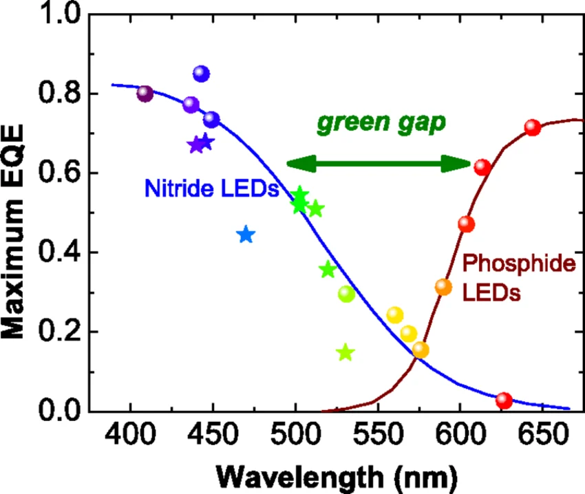
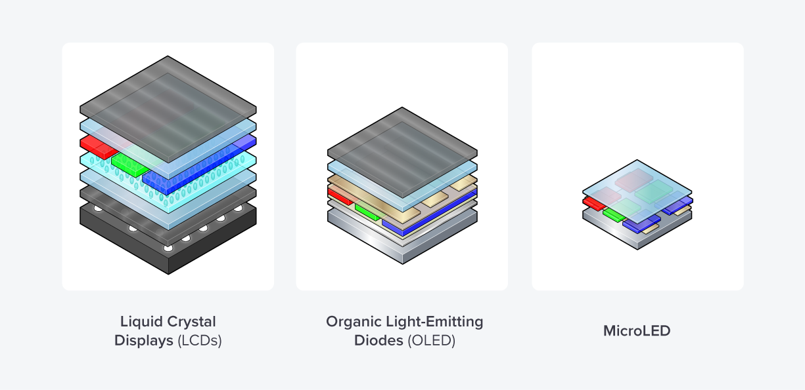

*microLED dibandingin ama teklonogi display lain* 

Bagian pertama seri kita sudah kita bahas bareng: microLED itu apa, kenapa semua orang bilang ini holy grail teknologi display, dan produk apa aja yang sudah bisa kamu pegang di tangan tahun 2026. Kalau kamu belum baca, mending balik dulu ke bagian pertama biar nggak bingung. Nah, di bagian ini kita langsung masuk ke dapur. Kita bedah detail engineering-nya.

Moko lagi duduk di meja kerja saya, persis di antara keyboard dan secangkir kopi yang sudah nggak panas. Ragdoll ini punya insting unik: begitu laptop nyala, dia langsung tahu ini waktu yang tepat buat duduk di atas keyboard. Mungkin dia merasa jadi penjamin kualitas layar, atau mungkin dia cuma suka getik-getik keyboard sambil mata setengah nyembah. Yang jelas, Moko dan layar itu selalu ada hubungannya.

Tapi kali ini saya bener-bener mau fokus ke sesuatu yang jarang dibahas di press release: bagaimana microLED dibuat, dari wafer mentah sampai jadi panel yang kamu lihat setiap hari. Dan beneran, ini jauh lebih rumit dari yang kebanyakan orang bayangkan.

## Kenapa lebih susah dari LCD?

Dulu saya punya asumsi yang keliru. Secara fisik microLED itu lebih sederhana: nggak ada backlight, nggak ada polarizer, nggak ada liquid crystal cell. Logikanya sih pasti lebih gampang dibuat, ya? Ternyata saya salah besar.

LCD itu sudah matang selama 40 tahun. Supply chain-nya sudah berjalan mulus, proses fabrikasinya jalan 24/7 dengan yield di atas 90 persen, dan biaya per inci sudah turun drastis. Kamu beli panel IPS dari pabrik di China, barangnya datang sudah siap pasang. Selesai.

Sedangkan microLED itu? Kamu harus transfer 25 juta LED mikro satu per satu dari wafer GaN ke backplane. Bukan cuma ngangkut. Tapi harus presisi di tingkat mikrometer, harus di-inspeksi satu per satu, harus diperbaiki yang mati, dan harus dikalibrasi brightness-nya per pixel.

Biar lebih gampang dibayangkan, perumpamaannya begini: LCD itu kayak mencetak fotokopi. Kamu setel mesin sekali, terus ribuan lembar keluar rapi. microLED itu kayak merangkai puzzle 25 juta keping, dan setiap keping harus nyala dengan warna serta kecerahan yang persis sama. Kalau satu keping salah, langsung keliatan. Proses fabrikasi LCD itu kayak aliran air yang terus-menerus. Proses microLED itu kayak pick-and-place di skala mikro, yang artinya setiap pixel adalah keputusan engineering tersendiri.

## Bagian pertama: Chip microLED itu apa?

Setiap RGB sub-pixel di layar microLED itu adalah LED sungguhan. Bukan material organik yang lama-lama luntur kayak OLED, bukan kristal cair yang cuma buka dan tutup. Tapi chip semikonduktor yang benar-benar memancarkan cahaya sendiri.

Materialnya disebut III-V compound semiconductor. Itu istilah nerd teknisnya. Yang perlu kamu pahami: ini bukan silikon biasa. Silikon memang bagus buat prosesor, tapi buruk banget buat memancarkan cahaya. Dia itu indirect bandgap, artinya ketika elektron jatuh ke hole, dia nggak langsung memancarkan foton. Energi itu hilang jadi panas dulu.

microLED pakai GaN, gallium nitride. Material yang sama kayak LED putih di lampu rumah kamu. Bedanya ukuran, dan bedanya itu drastis. LED biasa di lampu rumah ukurannya 200 mikrometer ke atas. microLED? lebih kecil dari 50 mikrometer. Coba bayangkan kamu mengecilkan LED sebanyak empat kali di setiap dimensi. Volumenya jadi 1/64 dari yang asli. Kecilnya bikin kaget. Kalau kamu bisa melihat microLED dengan mata telanjang, rasanya kayak melihat lilin seukuran butiran pasir yang tetap terang benderang.

### GaN on Sapphire vs GaN on SiC

GaN itu nggak bisa tumbuh dan nempel langsung di silikon biasa. Lattice mismatch-nya terlalu besar, artinya jarak antar atom di GaN dan di silikon nggak cocok. Kalau dipaksa, kristalnya pecah-pecah jadi cacat. Jadi kita butuh substrate alternatif.

Dua pilihan utamanya:

Sapphire (Al2O3). Ini yang paling umum buat LED putih konsumen. Murah, matang, dan sudah dipakai bertahun-tahun. Tapi thermal conductivity-nya rendah, artinya panas susah keluar. Buat microLED yang udah kecil dan punya current density tinggi, panas itu musuh utama.

Silicon Carbide (SiC). Thermal conductivity-nya jauh lebih baik dari sapphire. Lattice match-nya juga lebih pas. Tapi harganya 2,5-4 kali lebih mahal dari sapphire. Buat produksi massal, ini jadi pertimbangan ekonomi yang berat.

*Perbandingan GaN-on-Sapphire dan GaN-on-SiC: sapphire murah tapi konduktivitas termal rendah, SiC mahal tapi pelepasan panas jauh lebih baik, dan ini menentukan mana yang bisa dipakai buat microLED massal*

Di atas kamu bisa lihat perbandingan keduanya. Sapphire punya thermal conductivity sekitar 35 W/mK, sementara SiC bisa mencapai 300-400 W/mK, hampir 10 kali lipat. Buat display yang nyala 10 jam sehari, bedanya nyata.

Perumpamaannya kayak memilih lantai rumah. Sapphire itu kayak lantai keramik biasa: murah, gampang dapat, tapi kalau kamu ngepel pakai air panas, lantai itu nyimpan panasnya. SiC itu kayak lantai granit premium: mahal pas dibeli, tapi panas langsung terserap dan keluar. Nah, buat microLED yang harus nyala berjam-jam, lantai granit lebih masuk akal.

Journal Light: Science & Applications baru-baru ini mempublikasikan riset tentang GaN-on-Silicon epilayers yang mencapai brightness di atas 10^7 cd/m2 buat pixel 5 mikrometer. Breakthrough ini menarik karena Silicon jauh lebih murah dari SiC dan sudah punya infrastruktur fab 300mm yang matang. Tantangannya: lattice mismatch antara GaN dan Silicon itu 16,4 persen, angka yang sangat besar. Tim riset ini berhasil pakai buffer layer yang sangat teliti. Impressive.

## Masalah ukuran: Kenapa mengecilkan LED itu sulit

Saat kamu mengecilkan LED, beberapa hal buruk terjadi bersamaan. Kayak efek domino.

Pertama, current density naik. LED dioperasikan dengan arus listrik. Kalau ukuran chip mengecil tapi arus tetap sama, rapat arusnya naik drastis. Di atas threshold tertentu, efisiensi turun. Efek ini disebut efficiency droop. Artinya kamu butuh lebih banyak arus buat dapetin brightness yang sama, dan itu menghasilkan lebih banyak panas. Lingkaran setan sudah dimulai.

Kedua, masalah sisi. LED memancarkan cahaya dari area chip dan juga dari sisi chip, dan apa efeknya? *Light leakage*, atau cahaya bocor. Buat LED besar, cahaya dari sisi itu proporsinya kecil banget. Tapi buat LED mikro, area sisi relatif terhadap area chip naik signifikan. Cahaya bocor dari sisi berarti efikasi brightness turun dan color shift terjadi karena cahaya sisi melewati material yang berbeda.

Ketiga, heat dissipation. microLED itu kecil, tapi current density-nya tinggi. Panas harus keluar dari area yang sangat sempit. Kalau panas menumpuk, GaN mengalami thermal quenching, alias brightness turun saat chip menghangat. Di display yang beroperasi 10 jam sehari, ini masalah serius yang nggak bisa diabaikan.

Biar lebih gampang dibayangkan: kamu punya lampu sorot stadion. Sekarang bayangkan kamu mau hasilkan kecerahan yang sama dari lampu senter. Masalahnya bukan bagaimana menyalakannya, tapi bagaimana menjaga suhu agar tidak meleleh. Jadi kecilnya bukan soal "mampukah ini nyala" tapi "mampukah ini bertahan".

## Masalah warna: Green Gap

Kalau kamu nyelokin riset GaN, kamu akan dengar istilah "green gap". Ini masalah klasik yang sudah ada sejak era LED biasa dan sampai hari ini belum benar-benar selesai di microLED.

GaN bagus banget buat memancarkan cahaya biru. Dengan menambahkan Indium jadi InGaN, kamu bisa geser ke hijau. Tapi pas kamu terus menambah In untuk mencapai warna merah murni, efisiensi kuantum internal-nya turun drastis. LED biru dari GaN punya efisiensi internal (IQE) di atas 70 persen. LED hijau? Mulai turun drastis. LED merah? **Sangat rendah**.

*Green gap: efisiensi kuantum eksternal (EQE) turun drastis saat panjang gelombang bergeser dari biru ke hijau ke merah, GaN sangat efisien di biru, tapi hijau dan merah jauh tertinggal*

Di grafik di atas terlihat jelas: Untuk Nitride LEDs di wilayah biru (450 nm) efisiensi hampir puncak. Pas geser ke hijau (520 nm), turun. Pas mau ke merah (630 nm), efisiensi hampir hilang. Ini bukan masalah desain, tapi sifat fisika material GaN/InGaN sendiri.

Kenapa ini masalah? Karena display butuh tiga warna RGB yang seimbang. Kalau merah dan hijau jauh kurang efisien dari biru, kamu harus kasih lebih banyak arus ke merah dan hijau supaya bisa nyamai brightness biru. Dan itu memicu efficiency droop lagi. Lingkaran setan.

Perumpamaannya kayak orkestra. Bayangkan pemain biola itu efisien banget, satu senyawa menghasilkan suara yang indah. Pemain terompet? Butuh usaha berkali-kali biar volumenya nyamai biola. Nah, di microLED, warna biru itu biola, dan warna merah itu terompet yang harus ditiup habis-habisan.

## Tiga cara buat warna penuh

Karena green gap, industri microLED punya tiga pendekatan buat dapetin warna penuh:

### Direct RGB

Ini yang paling murni: tiga chip microLED terpisah untuk merah, hijau, biru. Setiap chip tumbuh di wafer sendiri dengan material yang dioptimasi untuk warna masing-masing. Kelebihannya: efisiensi langsung, nggak ada loss dari color conversion. Tapi kekurangannya juga jelas: kamu butuh tiga mass transfer yang terpisah, dan alignment ketiganya harus presisi sub-mikrometer. Gampangnya, kayak nyusulin jarum di kegelapan, tapi 25 juta kali.

### Phosphor Conversion

Chip biru microLED ditambah lapisan fosfor di atasnya buat convert sebagian cahaya biru jadi merah atau hijau. Mirip prinsip lampu LED putih di rumah kamu. Lebih simpel karena cuma butuh transfer chip biru saja. Tapi ada trade-off: loss energi dari phosphor conversion berarti brightness turun, dan phosphor punya umur yang lebih pendek dari GaN itu sendiri.

### Quantum Dot Conversion

Ini yang lagi panas di dunia riset. Blue microLED ditutupi quantum dot yang convert cahaya biru jadi merah atau hijau dengan efisiensi sangat tinggi. Nature 2023 mempublikasikan riset concurrent self-assembly RGB microLEDs menggunakan gaya magnetik dan dielectrophoresis dalam medium fluidic, dan riset terpisah di Advanced Materials 2024 melaporkan quantum dot pixel-stacked microLED mencapai 3300 PPI dengan color gamut 130,4 persen NTSC dan peak brightness 400.000 nits. Dua riset berbeda, tapi keduanya bikin mulut terbuka.

Keunggulan quantum dot: ukuran partikel menentukan warna, jadi kamu bisa kontrol spektrum emisi sangat presisi. Tapi quantum dot yang pakai Cadmium itu beracun, dan versi Cadmium-free masih belum sama efisiennya. Ditambah masalah thermal stability, quantum dot bisa degrade saat dipanaskan terus-menerus.

Kalau mau pakai perumpamaan, quantum dot itu kayak prisma mini. Cahaya biru masuk, keluar cahaya merah atau hijau tergantung ukuran partikelnya. Mirip cara pelangi bekerja, cuma dalam skala nanometer.

## Bagian kedua: Backplane

Setelah chip microLED siap, kamu butuh sesuatu buat ngendaliin masing-masing chip. Di sinilah backplane masuk.

Backplane itu papan yang punya transistor untuk setiap subpixel. Fungsinya: terima sinyal dari video source, konversi ke arus yang pas, dan kirim ke microLED. Baik OLED maupun microLED sama-sama current-driven device, brightness keduanya tergantung arus yang mengalir. Tapi di microLED, kontrol arus harus presisi banget. Satu subpixel yang dapat arus 10 persen lebih banyak dari yang seharusnya akan terlihat lebih terang, dan itu bikin color uniformity dan accuracy langsung hancur.

Backplane itu kayak konduktor orkestra. Setiap musisi (microLED) punya kemampuan berbeda-beda, tugas konduktor (backplane) memastikan semuanya bermain serempak dengan volume yang pas.

### LTPS TFT Backplane

Low-Temperature Polycrystalline Silicon. Ini yang paling umum sekarang, sama kayak backplane di layar OLED smartphone kamu. LTPS punya mobility yang cukup tinggi untuk kontrol arus microLED, dan bisa dibuat di kaca besar. Kebanyakan produk microLED yang sudah ada pakai LTPS. Juga satu lagi yang jadi *bottleneck* untuk LTPS, aplikasi ke substrate yang gede itu hampir mustahil.

Tapi LTPS punya batasan: mobility-nya terbatas, dan ukuran transistor yang bisa dibuat di kaca besar tidak sekecil di wafer silikon. Artinya current control per pixel nggak sepresisi yang kamu inginkan.

### Oxide TFT (IGZO)

Indium Gallium Zinc Oxide. Mobility-nya lebih rendah dari LTPS tapi lebih stabil dan bisa dibuat di area yang lebih besar dengan biaya lebih rendah. Cocok buat panel besar di mana yield dan area penting. Tapi untuk pixel pitch kecil di bawah 50 mikrometer, IGZO mulai kesulitan karena resolution-nya terbatas.

### MicroIC: Pendekatan baru 2026

Ini yang bikin saya semangat. Riset di IDW 2024, Light: Science & Applications 2025, dan SID Digest 2026 mulai mempublikasikan riset tentang MicroIC backplane. XDC (Lumileds) menunjukkan MicroIC mereka ketebalan kurang dari 10 mikron, bukan 100 mikron seperti chip driver konvensional, tapi benar-benar ultra-tipis. Konsepnya: bukannya pakai TFT di kaca, kamu tanam driver IC silikon langsung di backplane, di samping microLED itu sendiri.

*Arsitektur MicroIC backplane: array microLED dipadukan dengan driver IC silikon di bawahnya, setiap subpixel dikontrol oleh CMOS transistor yang jauh lebih presisi dari TFT*

Gambar di atas menunjukkan bagaimana microLED array diletakkan di atas silicon backplane. Setiap LED mikro punya driver transistor sendiri di bawahnya. Beda dari TFT di kaca yang ukurannya terbatas, CMOS di silikon bisa dibuat dengan node 28nm atau lebih kecil, presisi kontrol arus meningkat drastis.

MicroIC ini adalah chip silikon yang dibuat dengan node CMOS standar, bisa 28nm atau bahkan lebih kecil. Mobility jauh lebih tinggi dari TFT, kontrol arus jauh lebih presisi, dan kamu bisa masukkan circuit yang lebih kompleks di dalam IC: current compensation, gamma correction, bahkan redundancy management.

Tapi MicroIC punya masalahnya sendiri: kamu sekarang harus transfer <u>DUA komponen berbeda</u> ke backplane, microLED dan driver IC. Artinya double mass transfer. Tapi keuntungan presisi dan integrasi cukup besar untuk membenarkan kompleksitas tambahan ini.

Paper di IDW 2024 dan Light: Science & Applications 2025 mempublikasikan riset tentang mass-transfer driver ICs yang menggantikan TFT, dan SID Digest 2026 punya paper tentang Pyramidal MicroLEDs yang pakai cold-bonding flip-chip antara Silicon CMOS driver dan GaN/SiC microLEDs, GaN tumbuh di SiC, bukan langsung di silikon CMOS. Tren ini jelas: industri bergerak dari TFT ke MicroIC.

## Arsitektur driver: Kontrol arus dan grayscale

microLED itu current-driven. Artinya brightness-nya dikontrol oleh berapa banyak arus yang mengalir. Sama kayak OLED, bukan duty cycle seperti LCD. Ini bagus karena responsnya linear, arus dua kali lipat berarti brightness dua kali lipat. Tapi buruknya, kontrol arus di level mikroampere itu susah banget.

Untuk grayscale, microLED butuh kontrol arus yang presisi. Pixel nggak cuma nyala atau mati, dia bisa punya 256 level brightness (8-bit) atau lebih. Artinya driver harus bisa mengatur arus dari hampir nol sampai full scale dengan akurasi tinggi.

Arsitektur driver yang umum:

TFT di backplane berfungsi sebagai current source. Saat pixel harus nyala, TFT buka dan arus mengalir ke microLED. Saat pixel harus redup, TFT mengurangi arus. Tapi TFT itu nggak presisi, karakteristiknya bervariasi dari pixel ke pixel karena variasi fabrikasi. Solusinya: digital calibration. Setiap pixel diuji, dan nilai kalibrasi disimpan di memory yang diakses per frame.

Ini mirip apa yang saya lihat di era Intel: setiap panel OLED yang keluar factory punya correction map. Tapi microLED lebih parah karena variasi current-driven lebih besar dari OLED yang juga current-driven.

Kalau mau pakai analogi, kontrol arus microLED itu kayak mengatur keran air buat mengisi gelas. Kamu nggak cuma mau air keluar atau tidak, kamu mau air mengalir dengan laju yang presisi. Masalahnya, kerannya nggak presisi, dan kamu harus kalibrasi setiap keran secara individual.

## Perbandingan stackup: LCD vs microLED

Sekarang kita bandingkan secara langsung. Ini yang bikin saya kaget: secara fisik, microLED lebih tipis. Tapi secara proses, jauh lebih panjang.

*Perbandingan stackup teknologi display: LCD punya banyak layer (backlight, polarizer, LC cell, color filter), microLED jauh lebih tipis, tapi proses manufacturing-nya jauh lebih kompleks*

Gambar di atas menunjukkan secara visual kenapa microLED bisa lebih tipis. LCD butuh backlight unit yang tebal, dua polarizer, liquid crystal cell, dan color filter. MicroLED? Cukup backplane + chip LED + encapsulasi. Tapi ketebalan yang hilang itu digantikan oleh kompleksitas proses: mass transfer, inspection, repair, calibration per-pixel.

| Layer                                 | LCD (+ LED backlight)                   | microLED                           |
| ------------------------------------- | --------------------------------------- | ---------------------------------- |
| Backlight unit                        | Ya (LED array + diffuser + light guide) | Tidak                              |
| Polarizer (back)                      | Ya                                      | Tidak                              |
| TFT array                             | Ya (a-Si atau LTPS)                     | Ya (LTPS, Oxide, atau MicroIC)     |
| Liquid Crystal cell                   | Ya                                      | Tidak                              |
| Color filter                          | Ya                                      | Tidak (microLED sudah punya warna) |
| Polarizer (front)                     | Ya                                      | Tidak                              |
| Touch layer                           | Opsional                                | Opsional                           |
| Glass cover                           | Ya                                      | Ya                                 |
| **MicroLED chip array**               | **Tidak**                               | **Ya, ini komponen tambahan**      |
| **Mass transfer**                     | **Tidak**                               | **Ya, proses krusial**             |
| **Inspection & repair**               | **Minimal**                             | **Ya, per-pixel**                  |
| **Individual brightness calibration** | **Tidak**                               | **Ya, per-subpixel**               |

Lihat perbedaannya: microLED menghilangkan 5 layer LCD (backlight, polarizer x2, LC cell, color filter). Tapi dia menambahkan proses yang jauh lebih kompleks: mass transfer, inspection, repair, dan calibration per-pixel.

Eliminasi layer itu bagus: display jadi lebih tipis, lebih efisien, dan kontrasnya sempurna. Tapi tambahan proses itu mahal, lambat, dan sulit di-yield.

Perumpamaannya begini: LCD itu kayak rumah bertingkat tiga yang sudah jadi. Tinggal pasang lampu, selesai. microLED itu kayak rumah tanpa atap yang harus kamu susun bata demi bata, dan setiap bata harus kamu cek apakah ukurannya pas. Hasil akhirnya lebih ramping dan kokoh, tapi prosesnya jauh lebih panjang.

## Mass transfer: Proses yang menentukan segalanya

Kita sudah singgung di bagian pertama, tapi ini penting banget sampai harus dibahas lebih dalam.

Tianma baru saja nunjukin proses transfer laser mereka di CES 2026. Panel 108 inci 4K, langsung dari wafer ke glass backplane LTPS, bukan ke PCB. Kenapa ini penting? Karena PCB punya masalah thermal expansion coefficient yang nggak cocok dengan GaN, bikin flicker dan brightness banding. Glass punya CTE yang lebih stabil.

Proses transfer laser Tianma: laser memantulkan lapisan sacrificial di wafer GaN, microLED lepas, optik mengarahkan ke posisi yang pas di glass backplane, dan laser lagi buat bonding. Satu proses, tanpa intermediate carrier. Kayak bedah laser di skala mikro.

XDisplay punya pendekatan berbeda: elastomer stamp. Mereka install alat transfer 300mm pertama di dunia dengan elastomer stamp, dan berhasil transfer microLED untuk AR microdisplay dengan pixel pitch di bawah 10 mikrometer. Cara kerjanya: stempel elastomer menyentuh wafer, microLED menempel pada stempel, lalu stempel menekan ke backplane dan microLED lepas dari stempel. Kecepatan: 20 detik per cycle.

Pendekatan laser dan elastomer itu saling melengkapi. Laser bagus untuk panel besar dengan pitch lebih besar. Elastomer bagus untuk AR microdisplay dengan pitch sangat kecil.

Mass transfer ini kayak sistem logistik raksasa. Bayangkan kamu harus mengirim 25 juta paket ke alamat masing-masing, dan setiap paket harus sampai di koordinat yang benar dalam radius mikrometer. Kalau satu paket salah alamat, pixel itu jadi belang.

## Inspection dan repair: Langkah yang hampir tidak pernah disebut

Setelah transfer, nggak semua LED nyala. Ada yang mati, ada yang terlalu terang, ada yang warnanya nggak sesuai. Proses inspection dan repair ini nggak pernah disebut di press release, tapi ini menentukan apakah display bisa dipakai atau cuma jadi barang rusak.

Inspection: kamera resolusi tinggi memindai seluruh panel, menguji setiap subpixel. AI vision system sekarang sudah bisa deteksi cacat di bawah 0,5 persen. Tapi 0,5 persen dari 25 juta subpixel itu 125.000 cacat. Masih terlalu banyak untuk konsumen.

Repair: ada beberapa strategi. Yang paling umum: redundancy. Setiap pixel punya lebih dari satu LED per warna. Kalau satu mati, driver beralih ke backup. XDisplay demo-kan display dengan 6 microLED per pixel sebagai redundansi. Tapi ini berarti kamu butuh 6 kali lebih banyak microLED untuk pixel yang sama. Biaya naik, pitch mengecil.

Strategi lain: binning. Panel dengan yield tinggi masuk ke konsumen. Panel dengan yield rendah masuk ke segmen B2B atau display outdoor di mana defect rate lebih bisa ditolerir. Strategi ini dipakai Samsung The Wall sekarang.

Moko tadi ngiler pas saya ceritain ini. Dia nggak paham kenapa 125.000 LED yang mati itu masalah besar. Baginya, kalau satu LED mati, tinggal nyalain yang lain, selesai. Sayangnya, dunia microLED nggak se-sederhana itu.

## Dari fab sampai panel: Rangkuman proses

Kalau kita susun semua, proses microLED lengkap terlihat seperti ini:

1. Epitaxial growth: GaN tumbuh di substrate (sapphire, SiC, atau silicon) di MOCVD reactor. Proses ini sudah matang dari industri LED konvensional.

2. Chip fabrication: Wafer di-patterning, di-etch, dan di-metalize jadi array microLED individual. Pixel size bisa 5 um sampai 50 um tergantung aplikasi.

3. Color separation: Untuk direct RGB, wafer biru, hijau, merah dibuat terpisah. Untuk QD conversion, cuma wafer biru yang dibuat.

4. Backplane preparation: Glass dengan TFT atau silicon MicroIC disiapkan.

5. Mass transfer: microLED dipindahkan dari wafer ke backplane. Bisa laser, elastomer, atau pick-and-place.

6. Bonding: microLED disolder secara termal ke pad di backplane. Biasanya flip-chip bonding.

7. Inspection: Setiap subpixel diuji.

8. Repair/Redundancy switching: LED mati diganti dengan backup.

9. Calibration: Brightness per subpixel dikalibrasi.

10. Encapsulation: Panel dilindungi dari kelembaban dan oksigen.

11. Module assembly: Panel digabung jadi module, lalu module digabung jadi display final.

12 langkah. Dibanding LCD yang mungkin 8 langkah tanpa mass transfer, inspection, repair, dan calibration per-pixel.

Proses ini kayak resep masakan yang sangat panjang. LCD itu kayak mie instan: tuang air panas, tunggu 3 menit, makan. microLED itu kayak memasak wagyu di rumah: 12 langkah, tiap langkah punya risiko, dan hasilnya baru enak kalau semuanya pas.

## Pengalaman saya: Fabrikasi semikonduktor dan additive manufacturing

Saya sempat kerja di Intel dari 2015 sampai 2018, di bagian display tech. Di sana saya lihat proses fabrikasi semikonduktor dari dekat. Saya punya paten yang di-assign ke Intel (EP3098699, display integrated antenna). Yang saya ingat paling kuat: di clean room, setiap detail dikontrol ketat banget, suhu, kelembaban, partikel udara. Yield itu segalanya. 90 persen yield di fab 300mm sudah bisa bikin orang tepuk tangan. Rasanya kayak melihat mesin yang bisa menciptakan kesempurnaan, selangkah demi selangkah.

Sekarang saya kerja di Motherson, di bidang automotive HMI. Di sini saya terlibat dengan additive manufacturing untuk prototipe komponen interior. Yang menarik, di additive manufacturing kamu bisa buat prototype dengan presisi tinggi, tapi mass production selalu punya tantangan tambahan: konsistensi, kecepatan, reliability, dan supply chain. Gap antara prototype yang bagus dan produksi yang bisa di-yield selalu ada.

Saya lihat microLED lagi di fase yang sama: prototype luar biasa. Tapi mass production? Itu tantangan yang belum terselesaikan sepenuhnya. Setiap vendor yang saya temui di industry event bisa nunjukin demo yang mengagumkan. Tapi pas saya tanya tentang yield di produksi massal, jawabannya selalu sama: "sedang ditingkatkan". Jawaban yang agak bikin frustrasi sih.

## Angka-angka penting

Beberapa angka dari riset terbaru:

Star Key Semiconductor di Wuhan membuka production line microLED berbasis GaN-on-Silicon 8 inci untuk microdisplay. Ini menunjukkan industri bergerak ke substrate Silicon untuk biaya yang lebih rendah.

Coherent dengan teknologi LIFT (Laser-Induced Forward Transfer) sudah mencapai kecepatan tinggi untuk transfer microLED. Studi independen menunjukkan lebih dari 100 juta microLED per jam bisa dicapai dengan paralelisasi, dan Coherent sendiri mendokumentasikan sistem UVtransfer mereka dengan rep rate 300 Hz dan stage speed 300 mm/detik. Masih jauh dari kecepatan yang dibutuhkan untuk TV 4K massal, tapi cukup untuk produk premium.

Paper di Light: Science & Applications melaporkan riset GaN-on-silicon microLED dengan brightness di atas 10^7 cd/m2 untuk pixel 5 um. Angka ini menunjukkan bahwa secara fundamental, microLED sudah bisa sangat terang. Masalahnya bukan fisika, tapi manufacturing.

## Kesimpulan: Lebih sederhana secara fisik, lebih kompleks secara proses

Ini paradoks microLED: secara fisik, stackup-nya lebih tipis dan lebih sedikit layer. Secara proses, manufacturing-nya jauh lebih panjang dan lebih sulit di-yield.

LCD sudah 40 tahun matang. Setiap bottleneck sudah ditemukan solusinya. microLED masih dalam fase di mana setiap langkah proses adalah riset. Epitaxy sudah matang, tapi mass transfer masih eksperimen. Inspection sudah ada, tapi repair masih bergantung pada redundancy yang mahal. Backplane sudah ada, tapi MicroIC baru mulai komersial.

Yang jelas: microLED bukan mimpi lagi. Proses transfer laser Tianma, elastomer stamp XDisplay, dan MicroIC backplane menunjukkan bahwa setiap bottleneck sedang dipecahkan, satu per satu. Tapi sampai yield mass transfer dan biaya per pixel turun ke level ekonomis, microLED tetap teknologi premium.

## Seri ini berlanjut

Bagian ketiga kita fokus ke otomotif. Detail HUD 300.000 nits dari BOE, transparent microLED untuk instrument cluster, dan cerita langsung saya di Motherson tentang gap antara prototype dan mass production di industri otomotif. Saya punya satu cerita tentang prototipe dashboard yang bikin saya kaget, dan saya akan bahas di sana.

Bagian keempat timeline dan prediksi harga. Kapan microLED masuk ke rumah biasa, berapa harga yang realistis, dan apakah worth it menunggu atau beli OLED sekarang.

## Penutup

Moko sudah pindah dari keyboard ke tempat tidur saya. Seperti biasa, dia nggak peduli bahwa saya sedang membahas proses manufacturing yang bisa menentukan masa depan teknologi display. Yang penting baginya permukaan laptop cukup hangat dan saya masih di sini.

Ragdoll ini memang punya prioritas yang jelas: kenyamanan di atas segalanya. MicroLED yang harus mencapai yield 99,99 persen untuk layak jual? Nggak ada hubungannya sama sekali. Tapi saya suka, karena Moko selalu mengingatkan saya untuk nggak terlalu serius.

Melihat microLED dari sudut engineering itu beda dari melihatnya sebagai konsumen. Sebagai konsumen, kamu lihat brightness dan kontras. Sebagai engineer, kamu lihat 25 juta chip semikonduktor yang harus ditransfer, dikalibrasi, dan diuji satu per satu. Kedua perspektif itu valid, dan keduanya penting.

Kalau kamu ingin memahami kenapa microLED belum murah, sekarang kamu tahu. Bukan karena teknologinya tidak matang. Tapi karena setiap pixel adalah keputusan manufacturing yang belum punya solusi ekonomis. Dan itu sesuatu yang hanya bisa diselesaikan oleh waktu dan skala.

*Moko sudah pindah ke tempat tidur, dia tidak menunggu serial berikutnya. Tapi saya tetap lanjut.*

---

*Catatan teknis: microLED chip size bervariasi dari 5 um (AR microdisplay) sampai 50 um (TV). Green gap masih masalah terbuka, LED merah GaN jauh kurang efisien dari biru. MicroIC backplane adalah tren 2026 yang menggantikan TFT untuk presisi kontrol arus yang lebih baik.*

*Referensi: 

- [microLED Apa Itu? (blog17)](/blog/blog17_microled_intro/), 
- [LCD Stackup Series (blog04-06)](/blog/blog04_lcd_backlight/), 
- Light: Science & Applications "Ultra-high brightness Micro-LEDs with GaN-on-silicon epilayers", 
- Nature 2023 "Concurrent self-assembly of RGB microLEDs", 
- Advanced Materials 2024 "Quantum dot pixel-stacked Micro-LED", 
- SID Digest 2026 "Pyramidal MicroLEDs", IDW 2024 "Mass-transfer driver ICs", 
- Tianma America CES 2026 Press Release, XDisplay Corporation 300mm elastomer stamp announcement, Star Key Semiconductor GaN-on-Silicon production line Wuhan*
