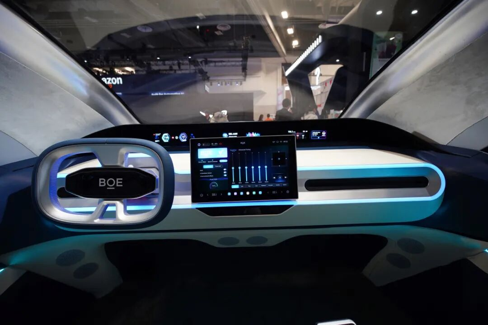
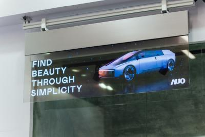
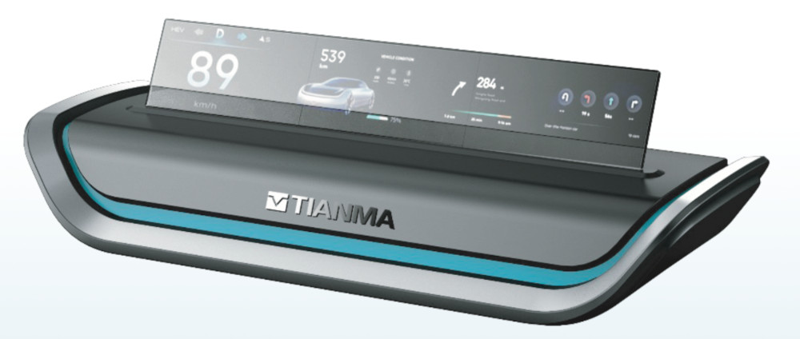
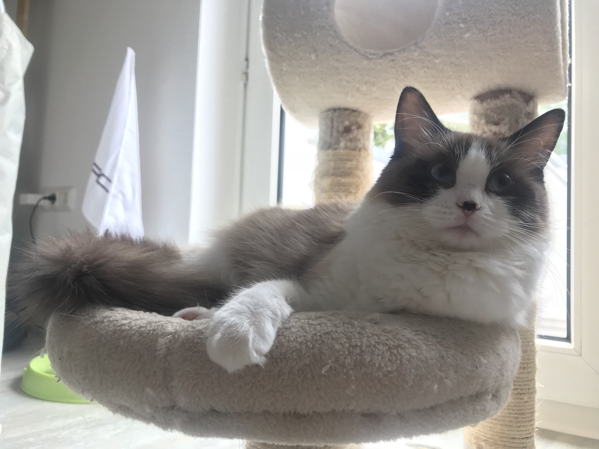

*BOE Panoramic HUD microLED — versi RGB 50.000 nits di CES 2026, versi monochrome tembus 300.000 nits di Display Week 2025 (sumber: BOE)*

Seri microLED masuk bagian ketiga. Dua bagian sebelumnya kita udah bahas apa itu microLED, kenapa semua orang bilang ini holy grail display, dan masuk ke dapur engineering dari wafer GaN, mass transfer, green gap, sampai MicroIC backplane. Kalau kamu belum baca, mending balik dulu. Di sini saya nggak bakal ngulang dasar-dasarnya.

Topiknya: otomotif. Kenapa industri mobil butuh microLED lebih dari industri display lainnya. Dan saya punya cerita langsung dari Motherson, soal gap antara prototipe yang keren banget di booth pameran sama realita mass production yang bikin pusing.

Moko lagi tidur di kursi kerja. Kayaknya dia udah mulai tau pattern-nya. Setiap saya nulis blog tentang teknologi display, dia langsung nyender ke laptop. Mungkin dia berasa jadi quality assurance-nya.

## Otomotif butuh display yang beda

Kalau kamu pernah nyetir di bawah terik matahari sore, kamu tau yang saya maksud. Matahari nembus kaca samping, pantulan cahaya nyasar ke dashboard, display instrument cluster dan display tengah yang tadinya jelas jadi nggak keliatan.

Ini bukan pengalaman langka. Ini pengalaman harian jutaan pengendara.

Di rumah, kamu nonton TV di ruangan yang kecerahannya kamu atur sendiri, matahari masuk jendela, bisa tutup terai, panas ? nyalain AC. Di mobil? Kamu nggak punya kontrol atas lingkungan. Suhu bisa turun ke minus 40 derajat di malam musim dingin di Finland. Naik ke 85 derajat di aspal panas tengah hari di Timur Tengah. Ditambah getaran konstan, guncangan, dan kelembaban yang berubah-ubah.

Ini kenapa komponen otomotif punya standar yang jauh lebih keras dari elektronik konsumen. AEC-Q102 adalah standar kualifikasi untuk optoelektronik di otomotif. Tergantung dari Grade nya, banyak komponen harus survive temperatur cycling dari minus 40 sampai 105 derajat Celsius, high temperature operating life 1000 jam di 125 derajat, thermal cycling 1000 cycle, humidity bias, dan vibration test yang kalau di laboratorium biasa bikin gadget kita langsung mati.

Standar ini nggak bisa di-ignore. Bukan kayak rating energy efficiency di kulkas yang kamu bisa lewatkan. Ini soal keselamatan. Kalau display gagal di jalan tol siang hari, atau HUD hilang pas kamu butuh informasi kecepatan di tikungan, itu bukan cuma soal kenyamanan.

## Kenapa cuma microLED yang jawab semua syarat

Saya kerja di Motherson sekarang, di bagian HMI otomotif dan additive manufacturing. Setiap kali ke industry event, saya lihat vendor display punya slide yang sama: microLED untuk otomotif. Dan mereka bukan lagi bilang "nanti 5 tahun lagi". Mereka nunjukin prototipe fisik, sudah terukur, sudah diuji.

Kenapa? Karena nggak ada teknologi display lain yang memenuhi tiga syarat otomotif sekaligus.

Pertama, brightness tanpa batas. LCD itu limited sama backlight. OLED bagus, tapi brightness maksimum 1500 nits di panel otomotif dan itu masih kalah sama matahari langsung. microLED? Bisa 10.000 nits, 50.000 nits, atau 300.000 nits. Ini bukan angka marketing. Ini kemampuan fisik yang berasal dari sifat inorganik GaN.

Kedua, lifetime inorganik. Material emisif OLED terdegradasi. Di aplikasi otomotif di mana komponen harus bertahan 15 tahun minimal, burn-in bukan cuma soal estetika. Ini soal reliability. microLED pakai GaN yang sama kayak LED lampu jalan, material yang bisa nyala puluhan ribu jam tanpa degradasi berarti.

Ketiga, kontras self-emissive. Pixel mati berarti hitam sempurna. Ini penting banget buat HUD di mana kamu nggak mau informasi yang ditampilkan ada glow atau halo di sekelilingnya. Di LCD, backlight selalu bocor, dan di lingkungan terang, kontras yang rendah membuat HUD sulit dibaca.

Gini perumpamaannya: LCD di dashboard mobil itu kayak kamu baca buku di bawah lampu jalan yang redup, terus ada mobil lewat. OLED kayak baca di bawah lampu meja yang terang, tapi bolanya bisa mati sendiri setelah beberapa tahun. microLED kayak baca di bawah lampu sorot stadion. Nggak pernah redup. Nggak pernah mati. Dan nggak ada bayangan.

## BOE: HUD yang tembus 300.000 nits

*BOE Panoramic HUD microLED, diperlihatkan di CES 2026 (sumber: BOE)*

Di CES 2026, BOE nunjukin HERO 2.0 Smart Cockpit yang ngeruk perhatian dengan microLED Panoramic HUD. Versi RGB yang mereka tonjolkan di CES ini sudah nyentuh 50.000 nits — jauh di atas LCD/OLED konvensional dan cukup buat readability di direct sunlight. BOE juga punya record lebih agresif di display week: versi monochrome hijau yang pernah mereka perlihatkan sebelumnya tembus 300.000 nits, sementara versi full-color RGB 6,2 inci dengan pixel pitch 0,2 mm dan color gamut 110 persen NTSC sudah di angka 30.000 nits.

Angka-angka ini bukan buat nonton film. Ini buat HUD yang harus terbaca jelas di bawah cahaya matahari langsung yang memantul ke kaca depan.

Spesifikasinya: versi monochrome hijau 6,4 inci mampu 300.000 nits. Versi full-color RGB 6,2 inci dengan pixel pitch 0,2 mm, color gamut 110 persen NTSC, mencapai 30.000 nits. Keduanya pakai substrate berbasis kaca. BOE juga pasang AI-based voice dan gesture control dengan klaim tingkat pengenalan 98 persen untuk complex commands.

Di Display Week 2025, BOE sudah nunjukin versi awal. Di CES 2026, mereka bawa prototype yang lebih matang. Termasuk touch-enabled transparent microLED panel di atas substrate wood grain yang ditujukan untuk interior otomotif. Bukan konsep render. Prototype fisik yang bisa disentuh.

Kenapa angka 300.000 nits ini penting? Karena HUD bukan display yang kamu lihat dari jarak 30 centimeter. HUD memproyeksikan informasi ke kaca depan, dan cahaya harus cukup terang untuk mengalahkan cahaya ambient yang masuk dari luar. Matahari langsung di siang hari bisa mencapai 100.000 lux. Buat HUD tetap terbaca, kecerahan sumbernya harus jauh di atas angka itu.

## Transparan microLED: Dashboard yang bukan cuma dashboard

*AUO transparent microLED 54 inci untuk automotive, diperlihatkan di booth AUO Mobility Solutions CES 2026 (sumber: microled-info.com)*

Transparent microLED adalah form factor yang punya potensi mengubah desain interior mobil secara fundamental. Kenapa transparan? Karena di mobil, kamu butuh lihat jalan. Display yang menutupi seluruh dashboard mengurangi visibilitas. Display transparan memberi informasi tanpa menghalangi pandangan.

Di CES 2026, AUO nunjukin beberapa prototipe transparan microLED. Yang paling menonjol: panel 54 inci wide-format dengan brightness tinggi dan transparansi tinggi. AUO bilang panel ini bisa di-tile untuk membuat display yang lebih besar. Mereka juga nunjukin 12,4 inci standardized automotive display module dengan 93 PPI dan 50 persen transparansi.

Omdia, firma riset display, menyebut display transparan AUO sebagai key node yang menghubungkan kendaraan dengan external networks. Dashboard bukan cuma menampilkan informasi, tapi jadi interface aktif antara kendaraan dan lingkungan.

Tianma juga ada di area yang sama. Di SID Display Week 2026, mereka nunjukin prototipe 19 inci transparent microLED untuk automotive, tiga panel ultra-narrow-border yang di-join tanpa seam yang terlihat.

*Tianma 19 inci transparent microLED untuk automotive, SID Displayweek 2026, tiga panel ultra-narrow-border di-join tanpa seam (sumber: microled-info.com)*

Kenapa transparent microLED lebih masuk akal dari transparent OLED? Karena transparent OLED butuh backlight dan polarizer yang mengurangi transparansi. microLED nggak butuh backlight. Jadi area yang nggak dipakai pixel tetap benar-benar transparan. Transparency 50 persen dari AUO berarti setengah area display bisa lihat tembus ke luar. Angka ini masih bisa ditingkatkan saat pixel pitch mengecil.

## Smart cockpit: Dari instrument cluster ke V2X interface

*BOE transparent microLED di atas substrate wood grain untuk interior otomotif, prototype fisik yang bisa disentuh di CES 2026 (sumber: microled-info.com)*

Trend smart cockpit di 2026 nggak lagi soal "berapa banyak layar di dashboard". Sekarang soalnya: layar di mana, bagaimana layar itu berinteraksi dengan pengemudi tanpa mengganggu, dan terintegrasikan dengan indah.

AUO bikin subsidiary baru tahun ini: AUO Mobility Solutions Corporation. Di CES 2026, mereka presentasi tiga pilar strategis: Visual, Computing, dan Connectivity. Bukan cuma display. Tapi integrasi sistem. Display mikro yang tersembunyi di dashboard, transparan saat off dan muncul saat on, terintegrasi dengan sensor AI yang baca gesture dan suara pengemudi.

Di CES 2026, digitimes melaporkan bahwa leading global panel makers fokus pada microLED dan OLED untuk AI-driven smart cockpits. Tren ini bukan cuma dari Taiwan. BOE dari Tiongkok, Samsung dari Korea, dan vendor Jepang semua punya roadmap yang mengarah ke arah yang sama: display yang lebih banyak, lebih terang, lebih terintegrasi.

Innolux juga masuk ke area yang sama. Mereka nunjukin transparent window display dan HUD 50.000 nits berbasis microLED di CES 2026. Angka 50.000 nits lebih rendah dari klaim 300.000 nits BOE, tapi masih jauh di atas kemampuan OLED atau LCD konvensional.

PlayNitride, yang sudah mulai sampling microLED panel untuk 5 potential automotive customer sejak 2022, nunjukin HUD capable of delivering over 20.000 nits di DisplayWeek 2026. Mereka juga nunjukin 38 inci Head-up Display dan 19 inci transparent microLED.

## AEC-Q102: Standar yang nggak bisa di-cuekin

Saya sedikit singgung AEC-Q102 tadi. Ini standar yang dikembangkan Automotive Electronics Council buat kualifikasi optoelektronik di otomotif. Komponen yang nggak lulus standar ini nggak boleh dipakai di kendaraan yang dijual di pasar global.

Test AEC-Q102 yang harus dilalui tergantung grade :

- **Grade 0** (-40°C s/d +150°C): area mesin, lingkungan ekstrem
- **Grade 1** (-40°C s/d +125°C): komponen eksterior — lampu depan, LiDAR, sensor luar
- **Grade 2** (-40°C s/d +105°C): kabin interior — instrument cluster, display tengah
- **Grade 3** (-40°C s/d +85°C): elektronik interior konsumen

Di setiap cycle, komponen harus nyala dan berfungsi normal.

High Temperature Operating Life: 1000 jam di temperatur maksimum grade sambil nyala. Kalau brightness turun di atas 10 persen atau ada pixel mati, gagal.

Vibration test: komponen digetarkan di berbagai frekuensi selama berjam-jam. microLED yang udah di-bonding ke backplane harus survive tanpa delamination.

Humidity bias: 85 derajat Celsius dan 85 persen relative humidity selama 1000 jam. Kondensasi air di dalam display bisa bikin short circuit atau korosi pada koneksi.

Jadi display interior yang pakai Grade 2 cuma butuh cycling sampai 105°C, bukan 125°C. HUD eksterior yang butuh Grade 1 (125°C) atau Grade 0 (150°C) karena memang dekat sumber panas.

Ini kenapa banyak prototipe yang keren di booth nggak langsung jadi produk. Prototipe bisa survive di room temperature di booth pameran. Tapi di gurun Arab tengah hari? Atau di Siberia tengah malam? Harus survive keduanya.

Di bagian kedua kita bahas bahwa microLED lebih gampang secara fisik tapi lebih susah secara proses manufacturing. Di otomotif, tantangannya bukan cuma manufacturing. Tapi juga qualification. Setiap komponen yang masuk ke kendaraan harus lulus AEC-Q102, dan setiap vendor display harus punya data test yang lengkap. Ini proses yang memakan waktu berbulan-bulan, kadang tahun.

## Pengalaman saya: Gap antara prototipe dan mass production di Motherson

Di Motherson, saya lihat langsung bagaimana prototipe HMI yang luar biasa di booth pameran sering kali punya gap yang besar saat masuk ke fase mass production. Dan ini bukan cerita unik di microLED. Ini cerita klasik di industri otomotif.

Contoh klasik: instrument cluster OLED yang didemo di Geneva Motor Show. Di booth, displaynya indah, kontras sempurna, warna akurat. Tapi pas masuk ke qualification test, brightness di bawah 85 derajat Celsius turun 20 persen karena thermal quenching pada material organik. Di minus 40 derajat, response time memburuk. Solusinya? Thermal management tambahan yang menambah berat, biaya, dan kompleksitas modul.

Ada satu cerita yang bikin saya terkejut. Beberapa waktu lalu, saya lihat prototipe dashboard dengan transparent display yang terintegrasi ke dalam panel dashboard. Tampilannya futuristik, informasi muncul langsung di permukaan dashboard, kayak hologram. Saya tanya ke tim engineering mereka, "Kapan ini mass production?"

Jawabannya: "Kita masih di fase prototipe kedua."

Kenapa lama? Karena komponen yang harus survive 15 tahun di kondisi ekstrem harus lulus semua test AEC-Q102. Dan microLED yang baru masuk ke otomotif belum punya track record 15 tahun. Jadi setiap vendor harus buktikan reliability-nya dari nol.

Gap antara prototipe dan mass production di otomotif biasanya 3-5 tahun. Untuk teknologi baru seperti microLED, bisa 5-7 tahun. Ini bukan karena teknologinya belum matang. Tapi karena proses qualification di otomotif memang dirancang untuk memastikan hanya komponen yang benar-benar reliable yang masuk ke kendaraan.

## Transparent microLED di Indonesia

Di Indonesia, industri otomotif masih bergantung pada import komponen display. Tapi saya lihat potensi besar di sini. Bukan untuk membuat panel microLED dari nol, itu butuh fab semikonduktor miliaran dolar. Tapi untuk integrasi modul display ke dalam dashboard, instrument cluster, dan head unit.

Motherson sendiri punya fasilitas additive manufacturing untuk HMI components di beberapa negara. Dengan kemampuan 3D printing dan mold design, integrasi display ke dalam dashboard bisa dilakukan secara lokal. Pertanyaannya: apakah OEM otomotif di Indonesia siap menerima komponen dengan teknologi yang belum mass production?

## Market timeline: Kapan microLED di mobil biasa?

Saya nggak punya kristal bola. Tapi saya bisa baca sinyal dari industri.

Vendor display yang saya temui di CES 2026 dan Display Week 2026 semua punya timeline yang mirip: 2026-2027 untuk sampling ke OEM premium, 2028-2030 untuk mass production awal di kendaraan luxury, dan 2030-2035 untuk penetrasi ke mass market.

Ini timeline yang realistis mengingat proses qualification otomotif. AEC-Q102 butuh 6-12 bulan. Design-in ke OEM butuh 12-24 bulan. Tooling dan line setup butuh 12 bulan lagi. Total: minimal 3 tahun dari prototipe ke produk.

Kendaraan mana yang kemungkinan besar pakai microLED duluan? Premium brand yang sudah investasi di smart cockpit: AUDI, Mercedes-Benz, BMW. Merek China yang agresif di teknologi: BYD, NIO, Li Auto. Dan OEM yang sudah punya hubungan supply chain dengan vendor display Taiwan dan Tiongkok: AUO, BOE, Innolux.

## Perbandingan teknologi untuk otomotif

| Parameter         | LCD (otomotif)    | OLED (otomotif)                   | microLED (otomotif)    |
| ----------------- | ----------------- | --------------------------------- | ---------------------- |
| Brightness max    | 1000-1500 nits    | 1000-1500 nits                    | 10.000-300.000 nits    |
| Lifetime          | 60.000 jam        | 30.000 jam (burn-in risk)         | 100.000+ jam           |
| Kontras           | 1000:1 s/d 5000:1 | Infinite                          | Infinite               |
| Temperature range | -40 s/d 85°C      | -30 s/d 85°C (thermal management) | -40 s/d 105°C+         |
| AEC-Q102          | Sudah matang      | Sedang                            | Mulai kualifikasi      |
| Cost (2026)       | Terendah          | Sedang-tinggi                     | Sangat tinggi          |
| Market status     | Dominan           | Mulai masuk (AUDI, Porsche)       | Prototype dan sampling |

Lihat tabelnya. microLED unggul di hampir semua parameter teknis. Tapi cost-nya masih sangat tinggi dan qualifikasi AEC-Q102 masih berjalan. Ini kenapa LCD masih dominan dan OLED mulai masuk perlahan. microLED? Masih di fase sampling dan prototipe.

## Seri ini berlanjut

Ini bagian ketiga dari empat. Bagian terakhir kita bahas timeline dan prediksi harga. Kapan microLED masuk ke rumah biasa, berapa harga yang realistis buat setiap ukuran, dan apakah worth it menunggu atau beli OLED sekarang. Saya udah punya data market dari beberapa vendor, dan beberapa angka yang mungkin bikin kamu kaget.

Moko masih di kursi kerja. Si ragdoll ini nggak peduli kalau saya sedang membahas teknologi display yang akan mengubah cara kita berinteraksi dengan mobil selama 15 tahun ke depan. Tapi saya peduli.

Di Motherson, saya lihat langsung bagaimana setiap prototipe yang keren di booth pameran harus melewati proses qualification yang panjang sebelum sampai ke konsumen. Dan saya lihat juga bagaimana microLED punya potensi mengubah desain interior mobil secara fundamental. Bukan cuma display yang lebih terang, tapi dashboard yang transparan, HUD yang selalu terbaca, dan instrument cluster yang nggak pernah burn-in.

Teknologi ini beneran ada dan lagi berkembang. Dan saya ikut jadi saksi langsung.

*Moko tidak peduli HUD 300.000 nits. Yang penting ada tempat nongkrong.*

---

*Referensi: 

- [microLED Apa Itu? (blog17)](/blog/blog17_microled_intro/), 
- [microLED Stack-Up (blog18)](/blog/blog18_microled_stackup/), 
- BOE CES 2026 booth (HERO 2.0 Smart Cockpit, Panoramic HUD RGB 50,000 nits, transparent wood grain), 
- BOE Display Week 2025 (monochrome PHUD 300,000 nits, RGB PHUD 30,000 nits, microled-info.com), 
- AUO CES 2026 booth via AUO Mobility Solutions (transparent microLED 54", 12.4" automotive module 93 PPI 50% transparency), 
- Tianma SID 2026 booth (19" transparent automotive, microled-info.com), 
- Innolux CES 2026 (50,000 nits HUD, transparent window display), 
- PlayNitride Display Week 2026 (20,000 nits HUD, 38" HUD, 19" transparent), 
- AEC-Q102 Rev A (Automotive Electronics Council), 
- Omdia Display Dynamics January 2026, 
- Digitimes CES 2026 microLED report, 
- SID Journal CES 2026 Review (Wiley)*

*Catatan teknis: 

AEC-Q102 Grade 0: -40°C s/d 150°C (engine bay). Grade 1: -40°C s/d 125°C (eksterior — lampu, LiDAR, sensor luar). Grade 2: -40°C s/d 105°C (interior kabin — instrument cluster, display tengah). Grade 3: -40°C s/d 85°C (interior konsumen). Untuk display otomotif interior, Grade 2 atau 3 adalah yang umum. 

BOE PHUD 50.000 nits RGB di CES 2026 dan 300.000 nits monochrome di Display Week 2025 adalah prototype, belum produk mass production. AUO Mobility Solutions Corporation adalah subsidiary baru AUO yang fokus pada smart mobility.*
