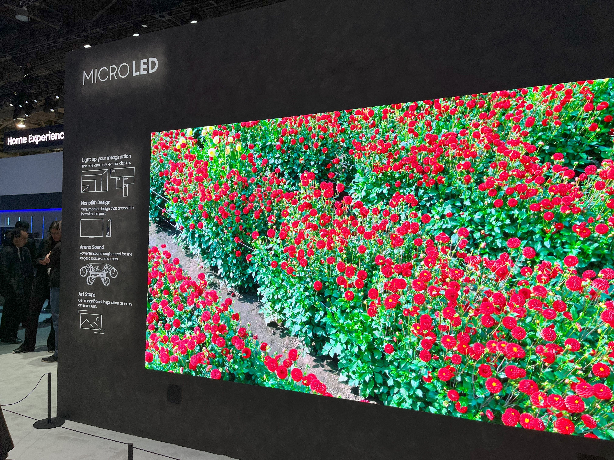
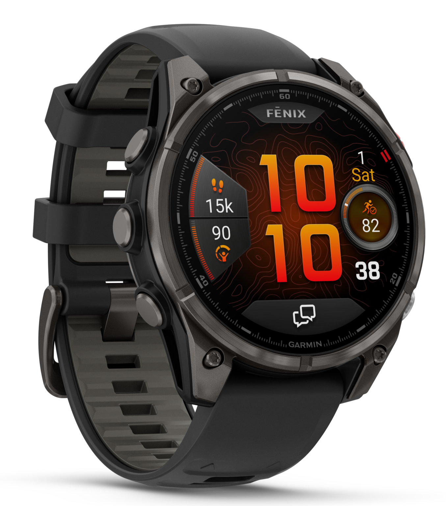
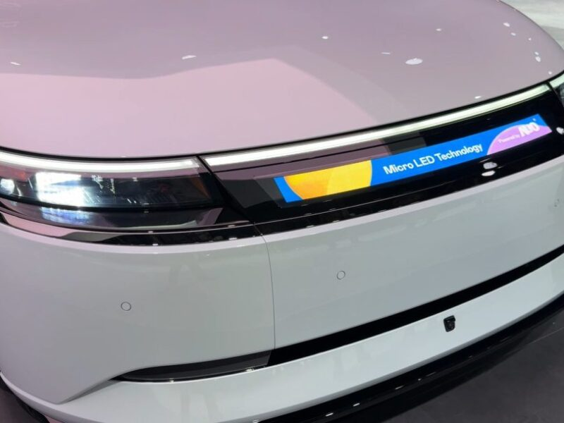
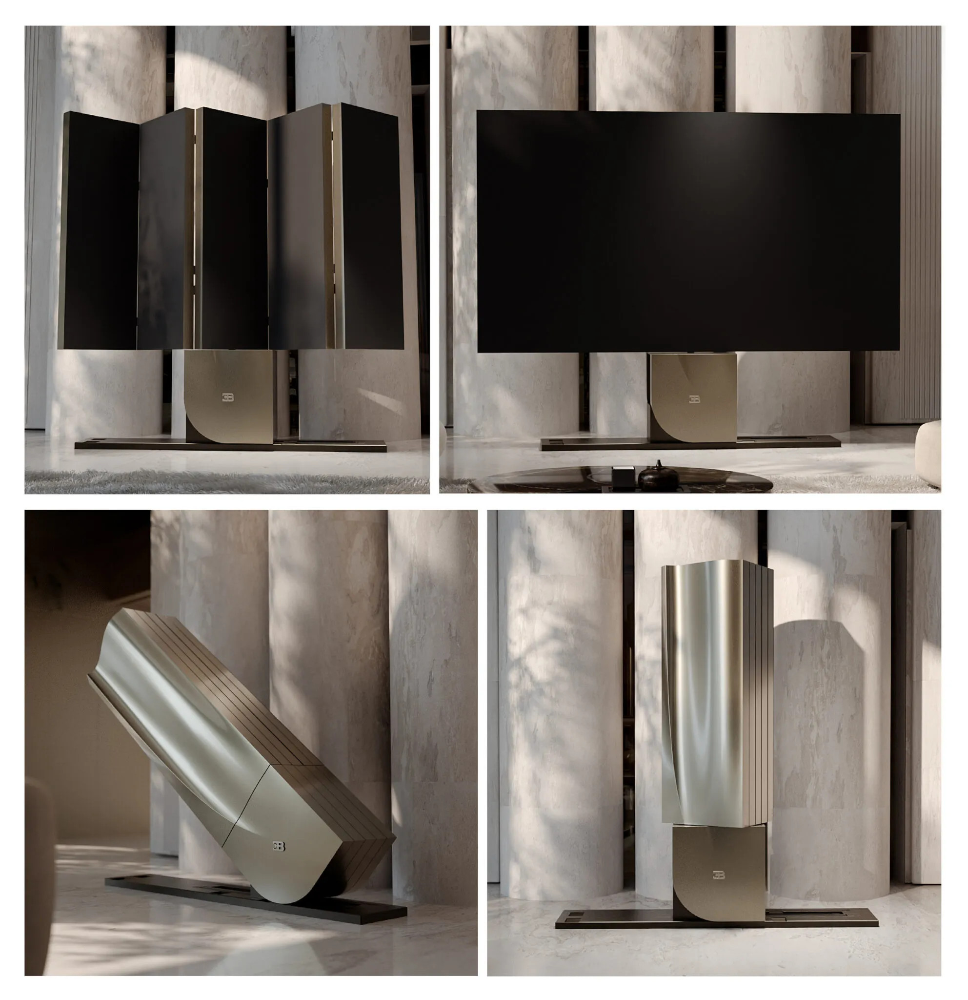

*Samsung The Wall 146 inci microLED — display microLED terbesar di dunia, diperkenalkan CES 2018 (sumber: Samsung)*

Seri microLED masuk bagian keempat dan terakhir. Tiga bagian sebelumnya kita sudah bahas apa itu microLED, engineering di balik mass transfer, green gap, MicroIC backplane, dan kenapa otomotif adalah pasar yang bener-bener butuh microLED. Kalau kamu belum baca, mending balik dulu. Di sini saya tidak bakal mengulang dasar-dasarnya.

Topiknya: kapan microLED sampai ke rumah kita, dan berapa harganya? Dan saya akan tunjukkan kenapa ada display microLED yang harganya Rp. 3 Miliar untuk profesional, sementara TV rumah kita belum tentu bakal ada sebelum 2028.

Moko duduk di atas kotak TV lama. Sekarang dia sering duduk di atas panel panel kaca yang menempel di dinding. Dia tidak mengerti, tapi kita akan coba jelaskan.

Kalau kamu pernah berdiri di depan TV baru di mall, tangan sudah nyaris ngegas, terus mikir "mending nunggu teknologi lebih baik dulu", kamu bakal relate banget sama artikel ini.

## Di mana industri microLED sekarang?

Tahun 2026, microLED sudah ada, tapi belum sampai ke tangan konsumen biasa. Mari kita lihat peta yang sudah ada.

### Profesional: Sudah ada, tapi harganya bikin jantung berdebar

Sony punya Crystal LED (nama aslinya CLEDIS, Crystal LED Integrated Structure, yang diperkenalkan pertama kali di InfoComm 2016 dan di-rebrand sebagai Crystal LED di InfoComm 2018). Panel modular microLED untuk ruang kontrol, studio broadcast, dan ruang komando militer. Teknologi ini sebenarnya sudah ada sejak CES 2012 sebagai konsep 55 inci Full HD, tapi baru komersial di 2016. Versi terbaru menggunakan chip LED dengan area 0,003 mm².

Sony Crystal LED Modular Display di ruang kontrol — panel bisa disusun dari 1 meter persegi hingga dinding raksasa. Source: [Sony Pro](https://pro.sony/en_ME/products/led-video-walls/crystal-led-walls)

Samsung punya The Wall, yang diperkenalkan di CES 2018 sebagai TV modular microLED pertama untuk konsumen dengan ukuran 146 inci. Panel modular dengan pitch mulai dari 0,88 mm untuk versi tertinggi, The Wall Signature. Samsung mengklaim panel ini mencapai 100.000:1 kontras dan bisa menampilkan hitam sempurna.

LG punya MAGNIT, panel modular microLED yang diperkenalkan di CES 2020 dan sudah tersedia untuk komersial dan profesional.

Semuanya mahal, sangat mahal. Samsung The Wall 146 inci dilaporkan mulai dari sekitar USD 220.000 atau sekitar Rp. 3,4 miliar (harga tidak resmi karena Samsung tidak mempublikasikan harga retail). Sony Crystal LED untuk studio broadcast bisa mencapai ratusan juta rupiah per meter persegi.

Kenapa? Karena microLED membutuhkan penempatan jutaan chip LED individual. Setiap chip harus disolder, dites, dan dikalibrasi, dan jika satu chip mati, harus diganti secara individual. Prosesnya kayak kamu disuruh menyusun puzzle 25 juta keping, cuma bedanya kepingannya seukuran serbuk dan kamu nggak boleh salah satu pun.

### Otomotif: Sudah mulai dipakai

Di bagian ketiga kita bahas bagaimana Mercedes-Maybach, BMW, dan Tesla sudah menggunakan microLED untuk display dalam kabin. Di sini microLED punya keunggulan: tahan suhu ekstrem, tahan getaran, dan tahan lama, semua persyaratan otomotif.

### Konsumen rumah: Masih nunggu

LG punya konsep 2020 yang belum keluar ke pasar konsumen, Samsung belum mengumumkan TV microLED untuk rumah. Industri masih menunggu biaya turun ke level yang masuk akal.

### Niche adoption: Yang sudah mulai dipakai duluan

Sementara kita sebagai konsumen rumah masih nunggu, beberapa sektor sudah lebih duluan nyoba microLED. Yole, firma analitik display dari Lyon, menyebut 2025 sebagai fase "make-or-break". Bukan lagi prototipe yang cuma dipamerin di booth expo, tapi produk beneran yang masuk ke tahap produksi. Ini penting, karena produk-produk ini adalah batu loncatan pertama menuju mass market.

Kalau kamu bayangkan teknologi baru itu kayak gelombang ombak, produk-produk niche ini adalah ombak pertama yang mulai pecah di pasir.

**Garmin fēnix 8 Pro MicroLED, smartwatch microLED pertama di dunia.** Diumumkan dan dipasarkan September 2025, smartwatch ini menggunakan display microLED bulat 1,4 inci yang diproduksi oleh AUO (AU Optronics) di lini G4.5 mereka. Layarnya punya resolusi 454x454 piksel, kepadatan 326 PPI, dan kecerahan puncak 4.500 nits, menjadikannya smartwatch paling terang di pasaran. Perbandingan dengan panel AMOLED terbaik yang cuma nyampe sekitar 3.000 nits? Garmin ini benar-benar lompat jauh. Harganya sekitar USD 2.000 untuk versi microLED, premium banget kalau dibanding varian AMOLED biasa. Dan ini angka yang bikin kaget: AUO memproduksi lebih dari 400.000 chip LED individual cuma untuk satu smartwatch.

*Garmin fēnix 8 Pro MicroLED, smartwatch microLED pertama di dunia, 1.4", 4500 nits, diproduksi oleh AUO (sumber: Garmin)*

Kenapa justru smartwatch? Karena microLED di ukuran kecil punya keunggulan yang pas banget: konsumsi daya rendah buat mode always-on, nggak ada risiko burn-in kayak OLED, dan kecerahan luar biasa di bawah sinar matahari langsung. Buat orang yang suka lari pagi, naik gunung, atau cuma jalan-jalan sore, layar yang tetep terbaca jelas di bawah matahari itu bukan gimmick. Ini kebutuhan.

**Sony-Honda AFEELA 1, microLED di luar mobil (proyek dihentikan).** Mobil listrik pertama dari kolaborasi Sony-Honda ini dilengkapi display microLED eksternal ukuran 31,5 inci, yang juga diproduksi oleh AUO. Displaynya bisa nunjukin konten personal kayak video, foto, dan pesan unik ke orang-orang di luar mobil. AFEELA 1 dijadwalkan mulai pengiriman akhir 2026, tapi pada 25 Maret 2026, Sony Honda Mobility resmi mengumumkan penghentian proyek ini. Mobilnya tidak pernah sampai ke pasar.

Ironisnya, display microLED eksternal yang mereka bangun justru jadi bukti nyata bahwa teknologi ini sudah bisa survive di lingkungan luar yang keras. Kalau kamu pikir layar di mobil cuma ada di dalam kabin, ini buktinya layar juga bisa bertahan di luar, kena hujan, kena panas, dan tetep nyala. Sayang mobilnya sendiri yang nggak sampai ke pasar, tapi pelajaran dari prototipe ini nggak akan sia-sia. Teknologi microLED tetap hidup dan terus berkembang.

*Sony-Honda AFEELA 1 dengan display microLED eksternal 31,5 inci oleh AUO (sumber: Sony Honda Mobility)*

**Bugatti x C SEED N1, TV microLED lipat untuk ultra-luxury.** Di Juni 2026, Bugatti bermitra dengan C SEED, produsen display luxury dari Austria, untuk meluncurkan N1 Super TV. Tersedia dalam ukuran 110 inci dan 137 inci, TV ini menggunakan teknologi microLED 4K yang bisa berubah dari meja samping yang terlihat seperti furniture desain menjadi layar bioskop dalam waktu 45 detik. Panel microLED terdiri dari lima modul kaku yang terlipat dengan presisi. Harga? Tidak dipublikasikan secara resmi, tapi berbagai sumber melaporkan antara USD 400.000 hingga USD 500.000. Ini bukan TV untuk rumah biasa. Ini adalah statement piece yang mengambil design language dari Bugatti Tourbillon hypercar.

Kalau kamu pernah lihat TV lipat di film sci-fi, ini versi benerannya. Moko kalau lihat pasti bingung kenapa ada meja yang tiba-tiba berubah jadi layar. Bagi dia, semua itu cuma permukaan baru yang hangat buat tidur.

*Bugatti C SEED N1, TV microLED 137 inci yang terlipat dalam 45 detik, terinspirasi dari Bugatti Tourbillon (sumber: Bugatti Newsroom)*

**L3Harris NOVA, microLED dipertimbangkan untuk kacamata night vision militer.** Di sisi yang sangat berbeda, L3Harris Technologies, kontraktor pertahanan AS, sedang mempertimbangkan display microLED untuk versi berikutnya dari kacamata night vision mereka, NOVA. Sistem NOVA saat ini menggunakan tabung image intensifier Gen III yang sudah matang, dan pada April 2026, Angkatan Darat AS memberikan kontrak senilai hingga USD 465 juta selama tujuh tahun kepada L3Harris melalui program Binocular Night Observation Device (BiNOD). Tapi L3Harris secara terpisah mengumumkan bahwa mereka sedang mengeksplorasi microLED microdisplay untuk upgrade masa depan yang akan menggabungkan thermal imaging dan digital overlay. Jadi microLED di sini bukan produk jadi, tapi jalur riset yang sedang dipursuit. Dengan kontrak senilai setengah miliar dolar, insentif untuk berinvestasi di teknologi baru jelas ada.

*L3Harris NOVA night vision goggle, kontrak USD 465 juta dari Angkatan Darat AS untuk program BiNOD, microLED dipertimbangkan untuk generasi berikutnya (sumber: L3Harris)*

Semua contoh ini punya satu kesamaan: mereka tidak peduli harga karena nilai yang diberikan jauh lebih besar. Smartwatch Garmin untuk atlet outdoor, display AFEELA untuk branding mobil listrik, TV Bugatti untuk kolektor, dan kacamata night vision untuk tentara. Masing-masing punya alasan kuat untuk membayar premium microLED. Dan setiap produk yang masuk pasar seperti ini, sedikit demi sedikit menekan biaya produksi ke bawah.

Kalau kamu pernah lihat harga laptop pertama yang keluar di tahun 2000-an, terus bandingin sama harga laptop sekarang, kamu paham polanya. Teknologi baru selalu mahal duluan, terus makin murah. Setiap produk niche yang berhasil membuktikan bahwa microLED layak dipakai, itu satu langkah lagi ke arah TV microLED yang suatu hari nanti bisa kita temuin di toko elektronik biasa.

## Proyeksi biaya: Kapan microLED bisa terjangkau?

Menurut berbagai analisis pasar, ada beberapa milestone penting:

### 2026-2027: Masa transisi

Saat ini, biaya microLED masih jauh di atas harga TV konsumen biasa. Perbandingan: TV OLED konsumen sekitar USD 1-2 per inci, sementara microLED masih berkali-kali lipat lebih mahal, tapi angka pastinya tidak dipublikasikan secara terbuka.

Samsung mengklaim sudah bisa memproduksi panel 150 inci dengan biaya produksi turun signifikan, mereka menyebut "biaya produksi yang lebih rendah" dalam presentasi 2025. LG juga mengumumkan target "biaya produksi yang kompetitif dengan OLED" untuk tahun 2026.

Tapi "kompetitif" di sini berarti lebih murah dari harga sekarang, bukan harga konsumen biasa. Gini perumpamaannya: kayak mobil listrik yang harganya turun, tapi tetap belum seharga Avanza.

Menurut DSCC (Display Supply Chain Consultants), pasar microLED diproyeksikan mencapai USD 1,4 miliar pada 2028, didorong oleh TV dan wearables.

### 2028-2030: Titik impas konsumen

DSCC (Display Supply Chain Consultants) memproyeksikan pasar microLED mencapai USD 1,4 miliar pada 2028. Analisis dari Omdia dan Grand View Research menyebut bahwa microLED bisa mencapai harga titik impas dengan OLED di ukuran 80-100 inci sekitar 2028-2030.

Ini berarti untuk TV di atas 80 inci, microLED bisa sama harga atau lebih murah dari OLED flagship. Untuk ukuran lebih kecil, masih butuh waktu.

### 2030+: MicroLED menjadi standar premium

Menurut beberapa analisis pasar, jika teknologi pemolesan chip LED, transfer massal, dan kalibrasi terus meningkat, microLED bisa menjadi teknologi display premium untuk TV di atas 70 inci setelah 2030. Beberapa firma riset memproyeksikan pasar microLED akan mencapai USD 12-20 miliar pada 2030, tumbuh dari USD 1,7 miliar pada 2025.

Angka-angka ini kayak janji diet dari teman: terdengar bagus, tapi kita harus lihat eksekusinya. Yang jelas, arahnya positif. Industri display selalu punya pola yang sama, teknologi baru mahal di awal, lalu turun eksponensial. Dari CRT ke LCD dulu pun begitu. Dari LCD ke OLED pun begitu.

## Faktor yang mempengaruhi kecepatan adopsi

### 1. Teknologi transfer chip

Metode transfer chip LED dari wafer ke panel adalah bottleneck utama. Samsung, Sony, dan banyak perusahaan lain mengembangkan metode transfer massal yang berbeda, termasuk metode laser pick-and-place, roll-to-roll transfer, dan teknik baru lainnya.

Semakin cepat dan akurat transfer ini, semakin murah biaya produksi. Bayangkan kamu harus memindahkan 25 juta butir pasir dari satu wadah ke wadah lain, masing-masing harus di posisi yang tepat. Kalau kamu pakai pinset, butuh berhari-hari. Kalau kamu punya alat yang bisa memindahkan seribu butir per detik, jauh lebih cepat. Nah, teknologi transfer ini lah alat "seribu butir per detik"-nya.

### 2. Ukuran chip

Chip microLED saat ini bervariasi, dari area sekitar 0,003 mm² (seperti yang digunakan Sony CLEDIS) hingga lebih kecil. Semakin kecil chip, semakin banyak yang bisa muat di wafer, semakin murah biaya per chip.

Samsung dan Sony terus mengembangkan chip yang semakin kecil. Target industri adalah chip di bawah 20 mikro meter untuk resolusi 4K di ukuran konsumen.

### 3. Yield rate

Yield rate adalah persentase chip yang berfungsi dengan baik dari total yang diproduksi. Saat ini yield rate masih di bawah 90% untuk produksi massal, artinya dari 1 juta chip, sekitar 100.000 cacat dan harus diganti. Angka pastinya bervariasi tergantung produsen dan ukuran chip.

Industri target yield rate di atas 99% untuk produksi konsumen.

Kalau dibayangin, ini kayak kamu beli 100 biji telur di pasar dan 10-15 nya retak. Bisa dipakai sih, tapi kamu harus ganti yang retak itu satu per satu. Makanya harga mahal, bukan karena satu chip-nya mahal, tapi karena proses penyortiran dan penggantian yang makan waktu.

### 4. Kompetisi dengan OLED

OLED masih berkembang. Samsung QD-OLED dan LG W-OLED semakin murah, semakin terang, dan semakin tahan lama. Ini berarti microLED harus benar-benar unggul untuk bersaing, bukan sekadar "lebih baik".

MikroLED harus datang ke pesta dengan gaun yang lebih bagus, bukan cuma yang rapi. Karena tamu lainnya, OLED, terus memperbarui koleksi gaunnya.

## Sony Crystal LED: Kenapa penting untuk profesional?

Kembali ke Sony. Sony Crystal LED (yang dulunya CLEDIS dan CLED) bukan TV untuk rumah. Ini panel display untuk profesional yang membutuhkan:

- **Akurasi warna absolut** untuk studio broadcast, grading film, dan kontrol room
- **Kecerahan tinggi** untuk ruang kontrol yang terang
- **Daya tahan** panel yang bisa menyala 24/7 selama bertahun-tahun
- **Modularitas** panel bisa dipasang dalam konfigurasi apa pun, dari 1 meter persegi hingga dinding 100 meter persegi

Harga untuk profesional itu astronomis, dan itu bukan karena profit margin tinggi. Ini karena:

1. Volume produksi rendah, hanya ratusan panel per tahun, bukan jutaan
2. Setiap panel dikalibrasi individual, bukan batch
3. Material premium dan proses manual masih dibutuhkan
4. R&D biaya sangat tinggi karena teknologi ini masih berkembang

Jadi ketika kita bilang "microLED mahal", konteksnya penting. Untuk profesional, mahal itu wajar karena volume rendah dan persyaratan tinggi. Untuk konsumen, mahal itu harus turun drastis karena volume jutaan panel per tahun.

Gini analoginya: beli obat di apotek per tablet itu mahal sekali. Tapi kalau pabriknya memproduksi jutaan tablet sekaligus, harga per tabletnya bisa turun drastis. MicroLED untuk konsumen butuh skala produksi segitu.

## Kapan saya harus membeli?

Pertanyaan yang paling sering ditanyakan: "Saya harus nunggu microLED atau beli TV sekarang?"

Jawabannya tergantung kebutuhan:

**Beli sekarang jika:**

- Anda butuh TV untuk ukuran di bawah 70 inci
- Anda tidak ingin menunggu 3-5 tahun
- OLED atau Mini LED sudah cukup baik untuk kebutuhan Anda
- Budget Anda di bawah 50 juta rupiah

**Nunggu microLED jika:**

- Anda ingin TV di atas 80-100 inci
- Budget Anda fleksibel dan tidak masalah menunggu 3-5 tahun
- Anda benar-benar ingin teknologi terbaik tanpa kompromi
- Anda bisa menunggu harga turun ke level yang masuk akal

Kalau kamu orang yang selalu nunggu "yang paling baru" buat beli apa pun, jujur, kamu pernah nunggu SSD yang belum rilis, terus beli HDD biasa karena nggak bisa tahan. MicroLED juga begitu. Teknologi yang kamu tunggu sekarang mungkin baru matang dalam 3-5 tahun lagi. Tapi TV yang kamu punya sekarang masih bisa menemani kamu nonton selama itu.

## Kesimpulan

microLED bukan teknologi masa depan yang jauh, sudah ada dan bekerja. Tapi untuk sampai ke rumah kita, masih butuh waktu. Industri masih bekerja untuk menurunkan biaya, meningkatkan yield rate, dan mengembangkan teknologi transfer chip yang lebih baik.

Timeline realistis:

- **2026-2027:** MicroLED untuk profesional dan otomotif terus tumbuh
- **2028-2030:** MicroLED mulai masuk ke TV konsumen ukuran besar (80-100 inci)
- **2030+:** MicroLED bisa menjadi standar premium untuk TV di atas 70 inci

Apakah worth the wait? Jika Anda sudah puas dengan TV sekarang, nunggu tidak masalah. Jika Anda butuh TV baru sekarang, OLED atau Mini LED masih pilihan yang sangat baik.

Industri display itu kayak sungai yang mengalir pelan tapi pasti. Dari CRT ke LCD, dari LCD ke OLED, dari OLED ke microLED. Setiap transisi butuh waktu, tapi arahnya jelas. Dan kita sedang menyaksikan satu transisi besar lagi.

Moko masih ngeliatin luar. Bagi dia, microLED atau OLED tidak ada bedanya, dia cuma butuh tempat hangat untuk tidur. Bagi kita yang suka teknologi, perbedaannya jelas, tapi perbedaan itu akan semakin kecil seiring waktu.

*Moko ngga peduli ama micro LED.*

---

## Sumber

- Samsung The Wall specs, Samsung Press CES 2018 (news.samsung.com/ca/samsung-unveils-the-wall-the-worlds-first-modular-microled-146-inch-tv)
- LG MAGNIT info, LG CES 2020 (lg.com/us/business/about/lg-news/lginvent2020)
- Sony Crystal LED info, Sony Professional (pro.sony/en_sg/solutions/professional-monitors/crystal-led)
- Sony CLEDIS history, MicroLED-Info (microled-info.com/sony-demonstrate-two-crystal-led-displays-ise-2018)
- Micro LED market analysis, DSCC $1.4B by 2028 (microled-info.com/dscc-microled-display-market-reach-14-billion-2028-led-tv-wearables-automotive)
- Market projections, Grand View Research, Business Research Company (2025-2030)
- Transfer technology info, SID Display Week 2025 papers

---

## Serial microLED

- [Bagian 1: Apa itu microLED dan kenapa ini berbeda dari OLED?](blog_17_microled_intro.html)
- [Bagian 2: Engineering stackup microLED, bagaimana membuat jutaan chip LED?](blog_18_microled_stackup.html)
- [Bagian 3: microLED di otomotif dan kokpit, display yang lebih baik untuk mobil dan pesawat](blog_19_microled_automotive.html)
- Bagian 4: Kapan sampai ke rumah kita? Peta jalan industri dari 2026 ke 2030 (artikel ini)

---