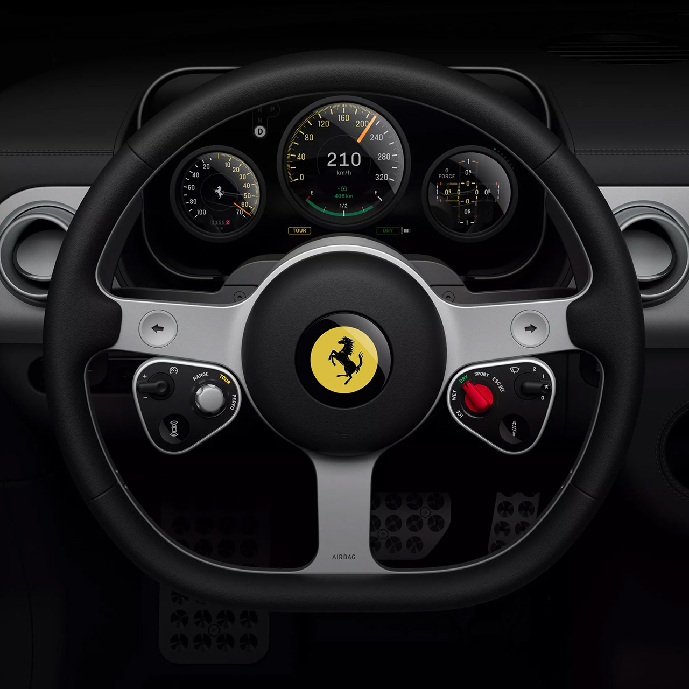
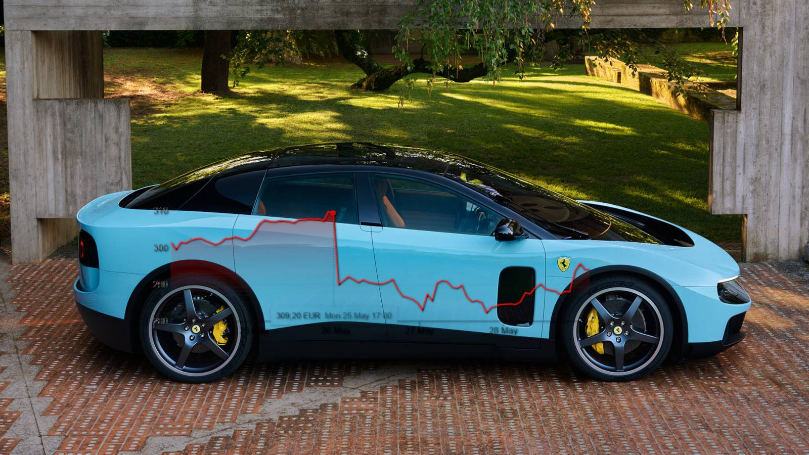
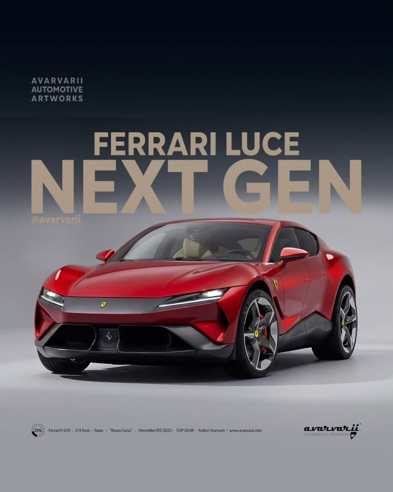
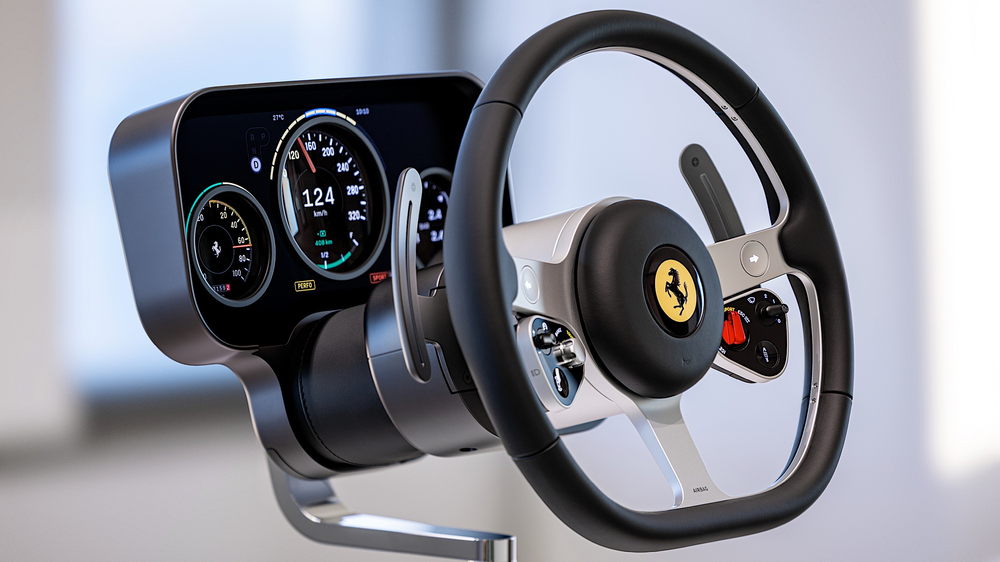
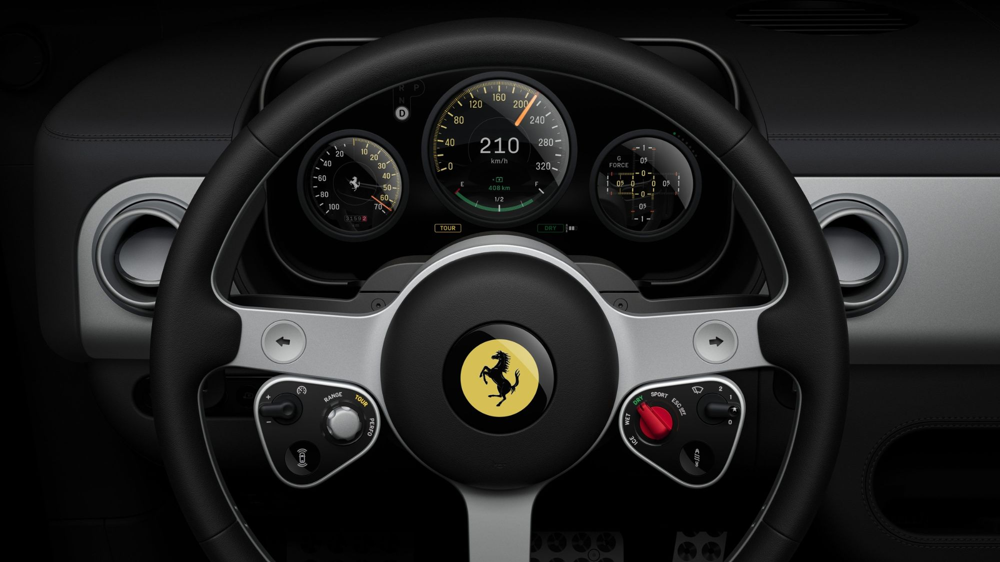
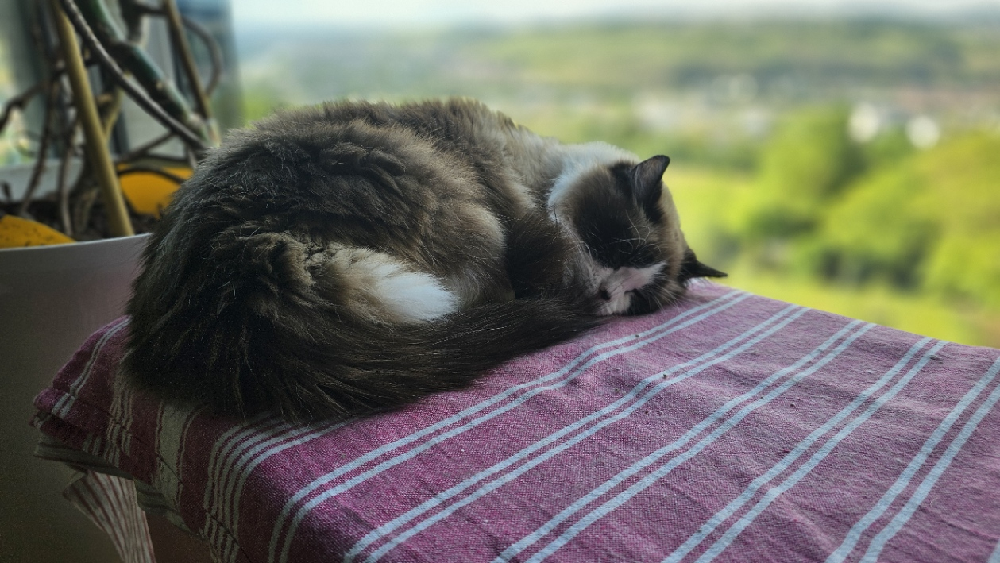

Baru aja saya selesai nulis blog20 soal timeline pasar microLED, Ferrari Luce muncul dan langsung ingetin saya ke satu hal: setiap kali teknologi display baru masuk ke produk ikonik, kontroversi yang muncul selalu lebih besar dari teknologinya sendiri.

Jony Ive, orang yang merancang wajah iPhone, MacBook Pro, dan Apple Watch, sekarang masuk ke dunia otomotif. Bukan jadi konsultan yang dikasih job description samar. Dia bener-bener turun tangan di tim desain Ferrari Luce lewat studio-nya LoveFrom, bareng Marc Newson.

Ini bukan cuma mobil listrik pertama Ferrari. Ini debut Jony Ive di dunia otomotif. Dan internet langsung meledak.

*Jony Ive dan Marc Newson lewat studio LoveFrom, kolaborasi desain Ferrari Luce* source:Forbes

Kamu pernah liat gimana Apple Store buka di kota baru kan? Antusiasme tinggi, ekspektasi ke langit. Terus realita datang, orang-orang mulai ngejudge. Ferrari Luce kena nasib yang sama, cuma skalanya jauh lebih gila.

## Saham Ferrari Jebol: 5 Miliar Dollar Hilang dalam Sehari

Ini bukan cuma soal tweet atau meme. Ferrari Luce bikin Bursa Milan serasa kesetrum.

Saham Ferrari anjlok 8 persen dalam satu hari setelah Luce diungkap. Market cap Ferrari hilang 5 miliar dollar Amerika. Dalam sehari. BBC, Guardian, dan The Telegraph semua cover. Investor langsung panik.

*Saham Ferrari turun 8 persen dalam sehari setelah reveal Ferrari Luce* source:BBC

BBC nyebut investor takut Ferrari Luce jadi ulangan gagal rebrand Jaguar Land Rover beberapa tahun lalu. Ini persis kata BBC: "Investors feared Ferrari's launch could become a repeat of Jaguar Land Rover's controversial failed rebrand."

Creative Bloq langsung bikin headline: "Even more controversial than the new Jaguar."

Di Twitter dan Reddit, orang-orang mulai bandingin Ferrari ini ke mobil yang mereka kenal sehari-hari. Nah ini yang bikin Ferrari sakit hati.

## Perbandingan Nissan Leaf yang Viral

Internet langsung nyamain Ferrari Luce ke Nissan Leaf. Nissan Leaf itu mobil listrik 30 ribu dollar Amerika. Ferrari Luce? 550 ribu euro, atau sekitar 640 ribu dollar. Bedanya 20x lipat. Tapi dari luar, katanya mirip.

Yang paling sakit? Nissan sendiri yang ketawa. Akun Instagram resmi Nissan nge-post: "They say imitation is the sincerest form of flattery, so thank you Ferrari."

Ini bukan cuma bercanda. CNN nge-cover dengan judul soal fans Ferrari yang menyebut desain ini "insulting". The Verge bikin artikel: "How Ferrari bungled the design of its first EV." Forbes: "Jony Ive-designed Ferrari divides the internet."

Motor1 bikin headline yang sangat langsung: "A Ferrari Is Not An iPhone."

TechRadar malah lebih brutal: "Somehow worse than I could ever have imagined."

## Kritik Pakar yang Pedas

Bukan cuma netizen yang nyinyir. Para pakar desain dan otomotif ikut campur.

Mantan CEO Ferrari yang memimpin perusahaan selama 23 tahun langsung minta logo Prancing Horse dilepas dari mobil ini. Politisi Italia ikut masuk, bilang desain ini tidak layak.

Professor Snyder dari Observer kasih skor dua dari lima buat eksterior, dan bandingin sama "a middle-of-the-road sophomore project". Gini perumpamaannya: kayak mahasiswa semester dua yang bikin desain mobil di kelas, terus Ferrari kasih harga 550 ribu euro.

WIRED nanya ke pakar otomotif Italia, hasilnya: "Take away the logo and you don't know where you are." Artinya lepas logonya, kamu gak tau ini Ferrari.

Observer nambah lagi: "It doesn't have any of the emotional factors or sculptural factors or the dynamism and verve that Ferrari should have."

Dezeen sampe bikin podcast khusus berjudul: "Why does everyone seem to hate the new electric Ferrari?"

Kalau kamu buka Wikipedia Ferrari Luce, tulisannya langsung: "Ferrari fans and car enthusiasts strongly criticised the car's design, considering the car unworthy of the brand."

## Meme yang Bikin Ferrari Gemes

Internet gak pernah malu. Meme-meme Ferrari Luce nyebar seperti api.

Forbes quote: "Designed entirely in airplane mode."

Forbes juga: "An Apple Store made a minivan and gave it trust issues."

Seseorang di blog Aftermath bilang: "Looks like a Honda Hydrogen concept from 2002."

Ada yang bilang kayak vacuum cleaner. Ada yang bilang kayak camper.

Di Reddit r/Ferrari, orang langsung bilang: "Heads need to roll at Ferrari for this."

r/OpenAI: "That dumbass just made the Apple car but with a Ferrari logo."

Dan yang paling relate: seseorang di Reddit bilang, "My wife said it looked like some kind of Rivian, and $640k."

*Desain Ferrari Luce yang memicu kontroversi global* source:The Verge

## Tapi Tunggu... Jony Ive Punya Jawaban

Di tengah badai ini, Jony Ive sendiri turun membela karyanya. Dia bilang Ferrari Luce bukan Ferrari untuk fans Ferrari tradisional. Ini Ferrari buat era baru. Dan memang ada satu hal yang hampir semua orang setujui: interior Ferrari Luce itu bener-bener bagus.

AppleInsider nulis: "Jony Ive's interior for the forthcoming Ferrari Luce electric vehicle is typically well thought out, but it divided car fans."

r/Design bilang: "The interior and interaction design led by Jony Ive is truly beautiful."

Yahoo Autos interview sama Marc Newson: "One area where there has been little debate is the interior of the Luce."

Ferrari CEO Benedetto Vigna juga defend the design. Dia bilang Ferrari Luce memang ditargetin ke pemilik EV, bukan fans Ferrari tradisional. Ferrari sedang membangun jembatan ke masa depan, bukan sekadar melukis ulang masa lalu.

Dan memang, Ferrari ini sedan 4 pintu, 5 penumpang. Sedan pertama Ferrari sepanjang sejarah. Gini perumpamaannya: kayak Michelin chef yang buka restoran nasi goreng. Bukan berarti chef-nya gak bisa masak, tapi ini eksplorasi genre baru.

*Interior Ferrari Luce karya Jony Ive yang mendapat pujian. Itu jarumnya jarum beneran, bukan gambar di display !!* source:Yahoo Autos

## Kenapa Ferrari Harus Nebak-nebak?

Ferrari menjual kurang dari 14.000 mobil per tahun. Ini bukan mobil massal, ini statement. Dan Ferrari tau mereka butuh sesuatu buat memenangkan pasar China.

Reddit r/electricvehicles langsung nge-headline: Ferrari Luce built to win back China, not traditional Ferrari fans.

China itu pasar EV terbesar di dunia. Tesla, Nio, Xpeng, BYD... semua bertarung di sana. Ferrari perlu masuk, dan Ferrari Luce adalah tiket masuk mereka.

Yang bikin kita di Indonesia mikir? Benedetto Vigna bilang harga di atas Rp 10 miliar sudah "cocok" untuk inovasi yang Ferrari tawarkan. Cocok? Buat orang yang beli, mungkin ya. Tapi ini provocative banget buat pasar Indonesia yang lagi ngerjain EV ramah harga.

Dan satu detail yang jarang orang tau: Paus sebenarnya sudah naik Ferrari Luce. Men's Journal nge-cover ini. Paus naik Ferrari. Di 2026. Ini dunia yang aneh.

## Sekarang ke Bagian yang Bikin Saya Engineer Berhenti Scroll

Oke, kontroversi desain sudah dibahas. Sekarang masuk ke bagian yang bikin saya, sebagai engineer yang dulu kerja di Sony VAIO, Intel display tech, dan sekarang di Motherson automotive HMI, bener-bener berhenti dan serius.

Teknologi display di dalam Ferrari Luce.

## Empat Panel OLED, Bukan Satu Layar Besar

Banyak artikel yang bilang "Ferrari Luce punya layar OLED". Padahal lebih dari itu. Samsung Display jadi supplier eksklusif empat panel OLED di Ferrari Luce. Dan teknologi yang dipakai bukan panel flat biasa, ini multi-layer OLED stack yang pertamanya di industri.

*Empat panel OLED Samsung di Ferrari Luce* source:Samsung Display

Gini perumpamaannya: panel OLED biasa itu kayak kertas A4. Multi-layer OLED itu kayak dua lembar kertas yang ditempel, tapi masing-masing bisa ditulis beda. Hasilnya? Kedalaman visual yang gak bisa dicapai panel tunggal.

Samsung pasok empat panel OLED berbeda:

- **12,9 inci:** driver binnacle (panel atas, multi-layer)
- **12 inci:** driver binnacle (panel bawah, multi-layer)
- **10,1 inci:** central control panel
- **6,3 inci:** rear passenger control

Jadi totalnya ada tiga zona digital di kokpit. Driver, tengah, dan belakang. Bukan cuma layar center console kayak mobil listrik China yang lagi trend.

Saya kerja di Motherson, ngehandle automotive HMI. Sistem kayak gini bukan cuma soal "berapa inci layarnya". Yang penting gimana display terintegrasi sama arsitektur kokpit. Ferrari Luce pakai pendekatan yang Omdia sebut "structural HMI". Display bukan cuma dipasang di atas dashboard. Display jadi bagian dari struktur kokpit.

Gini perumpamaannya: kayak perbedaan antara tempel stiker di dinding versus bikin lukisan dinding yang menyatu sama desain rueangan.

## Multi-Layer OLED: Industri Pertama

Ini yang paling teknis, dan juga paling menarik dari sisi engineering.

Driver binnacle Ferrari Luce pakai dua panel OLED yang bertumpuk. Panel bawah (12 inci) nampilin grafik background dan gauge indexes. Panel atas (12,9 inci) punya tiga lubang, bukan cacat manufacturing, tapi fitur desain.

Lubang-lubang ini bikin indikator torsi real-time, pop-up notifikasi, dan indikator G-force bisa muncul. Di antara lubang-lubang itu, ada tiga jarum mekanik fisik yang bisa muter 360 derajat.

Jadi Ferrari Luce punya dashboard yang hybrid: digital di layar OLED plus analog di jarum mekanik. Bukan gimmick. Ini pilihan desain yang sadar tradeoff. Jarum mekanik memberikan feedback instan yang otak manusia lebih cepat proses daripada animasi digital.

Saya paham ini karena saya pernah design display circuits di Intel. Response time dari jarum fisik itu nol, karena memang mekanik. Analog selalu lebih cepat untuk deteksi perubahan drastis. Gini perumpamaannya: kamu lebih cepat tau ada bahaya kalau lihat jarum speedometer loncat, daripada baca angka yang berubah di layar. Otak manusia sudah berevolusi ribuan tahun buat baca gerakan fisik.

Samsung Display sebut struktur multi-layer ini "enhances visual depth and gives the cockpit a more dynamic appearance." Tapi dari sudut engineer, ini bukan soal estetika. Ini soal arsitektur sinyal yang terpisah. Panel bawah handle rendering berat (grafik, animasi), panel atas handle overlay (indikator, notifikasi). Seperti GPU rendering di layer terpisah di software, tapi kali ini di hardware fisik.

Waktu saya di Sony VAIO Architecture Team tahun 2008-2013, kita sering pakai pendekatan layering yang mirip untuk display circuits. Tapi di hardware, bukan software. Ferrari Luce ini pertama yang bawa konsep itu ke automotive scale.

## HIAA: Teknologi HP Samsung Jadi Dashboard Ferrari

Yang bikin saya ngakak, teknologi lubang di panel OLED Ferrari Luce itu namanya HIAA (Hole in Active Area). Tech yang sama yang sudah dipakai dari zaman Samsung Galaxy S10 dan Note 10 buat kamera selfie.

HIAA di HP itu lubang berdiameter sekitar 5mm. Di Ferrari Luce? Lubang utama diameternya 100mm. 20x lebih besar.

Gini perumpamaannya: HIAA di HP kayak lubang jarum di dinding. HIAA di Ferrari Luce kayak jendela di dinding. Prinsipnya sama, bikin lubang di area aktif display tanpa kill pixel di sekelilingnya. Tapi skalanya beda banget.

Ini contoh bagus kenapa supply chain display itu unik. Samsung punya teknologi HIAA yang sudah matang di smartphone (Gen 8 line), dan mereka adaptasi ke automotive (Gen 8.6 line). Bukan riset dari nol, tapi engineering scaling problem.

Saya punya pengalaman di supply chain display waktu di Sony dan Intel. Perusahaan yang bisa recycle technology dari consumer ke automotive, atau sebaliknya, punya efisiensi R&D yang jauh lebih tinggi. Samsung lagi mamerin kemampuan ini. Dan jujur, ini smart. Daripada riset dari nol, scale technology yang sudah terbukti.

## Kenapa Samsung, Bukan BOE atau LG?

Pertanyaan yang masuk akal. BOE lagi agresif masuk market OLED besar (Gen 8.6, $9B investment). LG punya WOLED yang yield 95 persen di gaming monitors.

Tapi Samsung punya dua keris sakti:

Pertama, Samsung satu-satunya yang punya Gen 8.6 OLED line yang sudah produce panel laptop 16 inci dan TV QD-OLED. Yield rate di line ini udah matang. Ferrari butuh supplier yang deliverable, bukan yang masih R&D.

Kedua, HIAA technology. Ini proprietary Samsung. BOE gak punya equivalent-nya, LG fokus ke WOLED bukan HIAA. Kalau Ferrari mau desain cockpit dengan lubang di panel OLED, Samsung satu-satunya pilihan yang bisa deliver sekarang.

Saya liat dari pengalaman supply chain dulu di Sony: single-source supplier itu risky. Tapi kalau supplier satu-satunya punya technology yang gak ada di kompetitor, risiko itu jadi trade-off yang worth it. Dan biasanya ditempatkan di produk flagship dulu. Ferrari paham ini.

Omdia Display Dynamics June 2026 sudah bilang jelas: ini "signals a shift from flat cockpit screens toward structural HMI integration." Ferrari Luce bukan cuma mobil. Ini proof-of-concept untuk industri display otomotif premium.

## Harga dan Konteks Indonesia

Ferrari Luce dibanderol 550.000 euro, atau sekitar Rp 11,5 miliar di pasar Eropa. Kalau masuk ke Indonesia, dengan pajak dan bea masuk mobil mewah, realistiknya mungkin tembus Rp 12 miliar ke atas.

Gini perumpamaannya: harga itu setara beli 1300 Hape flagship, atau 1400an TV QLED 55 inci. Panel OLED di dalamnya mungkin total BOM-nya gak sampai 1 persen dari harga mobil. Tapi display ini yang bikin kokpit Ferrari Luce beda dari Ferrari sebelumnya.

Ferrari Luce belum masuk Indonesia secara resmi. Pemesanan Eropa mulai akhir 2026, US mulai 2027. Tapi konteksnya penting buat kita yang di industri display.

GIIAS 2026 Juli ini di BSD bakal bawa 6 brand EV baru: Xiaomi YU7 dengan 3K OLED, Leapmotor B10 dengan Snapdragon 8295, BYD, Arcfox, Denza, XPeng. Ferrari Luce setingkat di atas semua itu, tapi teknologi OLED yang sama. Samsung yang supply MacBook Ultra, supply Ferrari Luce, dan kemungkinan besar supply brand EV China juga (melalui line yang sama).

Ini ekosistem display yang saling terhubung. Bukan "mobil mewah vs mobil murah". Tapi "OLED dari fab yang sama, diaplikasikan ke form factor yang beda."

## Ferrari Bukan Mati, Ferrari Sedang Berevolusi

Di tengah semua kontroversi ini, ada satu hal yang saya mau ingetin: Ferrari sedang cari jembatan ke era baru. Kayak Intel yang cari jalan pulang dari era CPU ke AI PC. Kayak Sony yang dulu harus nerima kenyataan bahwa TV mereka gak bisa bersaing sama Samsung di OLED, tapi mereka survive karena punya lebih dari TV.

Kontroversi ini normal. Setiap brand besar yang ambil risiko besar, pasti kena backlash. Dan Ferrari, dengan kurang dari 14.000 mobil per tahun, punya kemewahan untuk nekad. Mereka bisa salah, mereka bisa bangkit lagi.

Kalau kamu kerja di industri display, automotive HMI, atau supply chain elektronik, Ferrari Luce bukan sekadar mobil. Ini signal. Multi-layer OLED di automotive? Ferrari Luce yang pertama. HIAA scaled ke 100mm di automotive? Ferrari Luce yang pertama. Structural HMI yang Omdia sebut sebagai tren industri? Ferrari Luce yang proof-of-concept-nya. Dan Ferrari Luce yang produksinya sedikit, merupakan target produk yang tepat untuk ngetes gimana matangnya teknologi ini, sekalian lihat acceptance di konsumen.

Mungkin suatu hari nanti, teknologi yang sekarang dianggap "Apple Store minivan" ini bakal jadi standar untuk semua orang yang sekarang ngejekin Ferrari.

## Moko Nge-comment

*Moko menatap Ferrari Luce dengan penuh keraguan* source:Thomas Agung

Moko lagi duduk di atas dashboard Ferrari Luce versi mainan. Mata lebar, lihat jarum mekanik yang muter 360 derajat di antara tiga lubang OLED. Katanya, kalau diterjemahkan ke bahasa manusia: "Jadi ini yang bikin harganya Rp 12 Miliar? Hmm, menarik. Tapi kok kayak Nissan?"

Catnya yang ragdoll itu biasanya tenang. Tapi kalau ada jarum yang muter, dia gak bisa diam. Mungkin itu kenapa dia relate sama dashboard Ferrari Luce. Ada sesuatu yang bergerak, dia harus lihat sampai selesai.

Anna, anak saya yang 8 tahun, nanya tadi: "Papa, Paus naik Ferrari? Paus kan baik hati, kenapa naik Ferrari?" Saya jawab: "Karena di 2026, bahkan Paus butuh mobil listrik." Dia bilang: "Kalau gitu, Paus harus naik Ferrari yang bagus, bukan kayak Nissan."

## Penutup

Ferrari Luce bukan tentang mobil listrik. Dari sudut saya yang dulu ngehandle display di Sony dan Intel, lalu automotive HMI di Motherson, ini tentang bagaimana teknologi display consumer (HP Samsung) bisa di-scale ke automotive grade.

Kontroversi desain? Normal. Jony Ive gak bikin iPhone untuk semua orang, dan Ferrari Luce juga bukan untuk semua orang. Ferrari Luce buat orang yang mau Ferrari di era EV. Buat pasar China. Buat masa depan.

Buat yang penasaran sama teknologi display di mobil listrik, tunggu review saya setelah GIIAS 2026. Leapmotor B10, Xiaomi YU7, dan beberapa brand EV China lainnya punya display yang menarik, dan harganya jauh lebih ramah kantong daripada Rp 12 miliar.

Komen aja: menurut kamu, kokpit hybrid kayak Ferrari Luce (OLED plus jarum mekanik) itu progress atau kemunduran? Dan soal desain eksterior, kamu tim "Ferrari harus tetap Ferrari" atau "Ferrari boleh eksperimen"?

---

**Tags:** #FerrariLuce #JonyIve #OLED #SamsungDisplay #AutomotiveHMI #DisplayTech #EV #KokpitListrik #HIAA #MultiLayerOLED #GIIAS2026 #Kontroversi

**Sources:**

- Samsung Display Official Announcement, May 26, 2026 — https://global.samsungdisplay.com/31455
- Omdia Display Dynamics, June 2026 — https://omdia.tech.informa.com/om145502
- GSMArena, May 26, 2026 — https://www.gsmarena.com/the_ferrari_luce_will_have_samsung_oled_displays_with_holes_and_stacked_design-news-73001.php
- Android Authority, May 26, 2026 — https://www.androidauthority.com/ferrari-luce-samsung-oled-galaxy-phone-tech-3670831/
- SamMobile, May 26, 2026 — https://www.sammobile.com/news/ferrari-luce-first-ev-four-samsung-oled-displays/
- BBC — Ferrari stock drop coverage
- The Verge — "How Ferrari bungled the design of its first EV"
- Forbes — "Jony Ive-designed Ferrari divides the internet"
- Motor1 — "A Ferrari Is Not An iPhone"
- TechRadar — "Somehow worse than I could ever have imagined"
- CNN — Ferrari fans call design "insulting"
- AppleInsider — Interior coverage
- Yahoo Autos — Marc Newson interview
- WIRED — Italian auto expert commentary
- Observer — Professor Snyder review
- Dezeen Podcast — "Why does everyone seem to hate the new electric Ferrari?"
- Creative Bloq — "Even more controversial than the new Jaguar"
- Men's Journal — Pope drives Ferrari Luce
