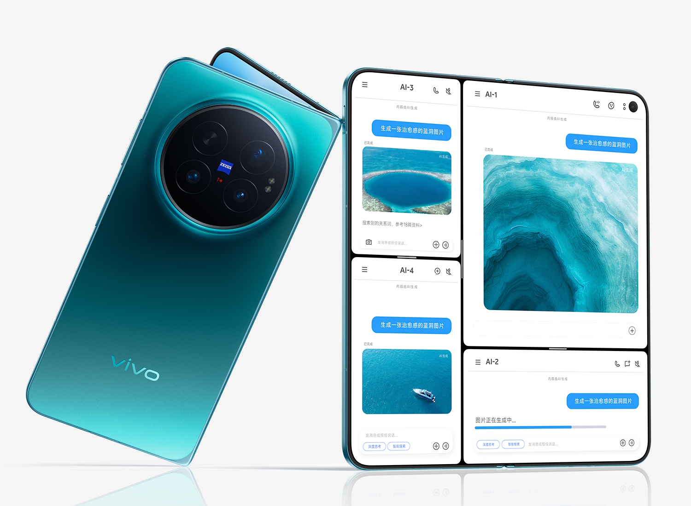
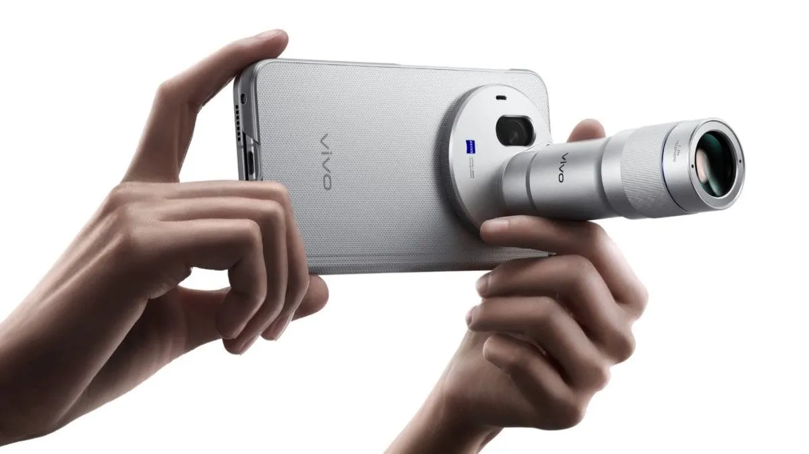
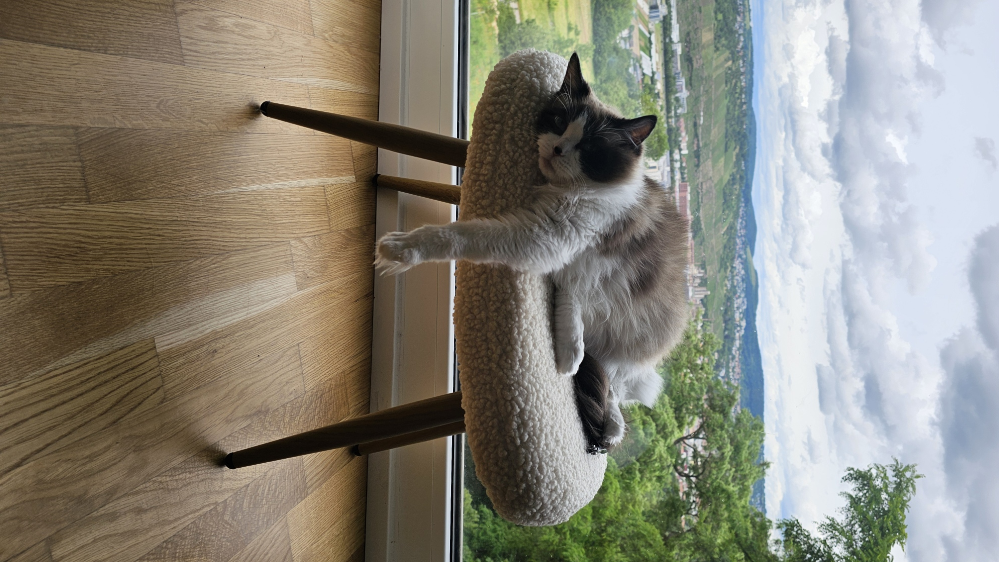

---
#Required fields
title: "vivo X Fold 6: Teknologi Layar Lipat yang Mengubah Aturan Main Smartphone 2026"
description: "vivo X Fold 6 rilis Juni 2026 dengan layar Samsung M14, baterai 7000mAh, kamera 200MP Zeiss, dan Zeiss Teleconverter. HP lipat yang ngejawab semua kelemahan generasi sebelumnya."
pubDate: 2026-06-26
category: "OLED"
cover: "../../assets/blog/22/22.Vivo_X_Fold_6.jpg"
coverAlt: "Visual representation of vivo X Fold 6: Teknologi Layar Lipat yang Mengubah Aturan Main Smartphone 2026"

#Core Fields
tags: ["vivo X Fold 6"]
author: "Thomas Agung Nugraha"
lang: "id-ID"
draft: false

#recommended
slug: "blog22_vivo_x_fold_6_teknologi_layar_lipat_2026"
excerpt: "Saya terkesan dengan panel Samsung M14 di Vivo X Fold 6. Ponsel lipat ini menetapkan standar rekayasa layar baru untuk tahun 2026."
updatedDate: 2026-07-04

#Optional-series support
#series: ""
#seriesOrder:

#Optional:SEO & Indexing
canonicalURL: "https://t-agung.id/blog/blog22_vivo_x_fold_6_teknologi_layar_lipat_2026"
keywords:
  - vivo X Fold 6
noindex: false

#Optional-table-of-content
showToc: true

#optional-internal linking
relatedPosts:
  - blog_11_hp_lipat_crease
---

Foto resmi vivo X Fold 6, source:vivo

Moko dari tadi ngeliatin saya sambil nyeringai. Kayaknya dia tau saya lagi nulis sesuatu yang seru. Ragdoll ini punya kebiasaan unik, kalau saya nulis soal layar, dia suka telentang dengan kaki terangkat kayak lagi test fleksibilitas. Cocok banget jadi pembuka buat hari ini.

Soal HP lipat, saya pernah bahas panjang lebar di blog 11. Masalahnya selalu itu-itu aja: crease yang keliatan, baterai cepet habis, kamera yang gak pernah flagship-level. Nah, vivo baru aja keluarin X Fold 6 dan rasanya kayak semua keluhan yang selama ini bikin orang mikir dua kali beli HP lipat, bener-bener dijawab satu per satu.

X Fold 6 pakai layar Samsung OLED M14 yang bikin crease hampir hilang. Baterai 7000mAh. Buat perbandingan, HP lipat lain rasanya kayak harus nempel terus ke charger. Kamera 200MP Zeiss plus teleconverter, fitur yang gak pernah ada di HP lipat sebelumnya. Terus harganya, bikin Samsung Z Fold jadi mikir ulang.

Kamu pernah beli HP lipat terus nyesal karena baterainya gak kuat seharian? Atau crease-nya bikin awkward setiap kali kamu buka di depan orang? Nah, ini mungkin jawabannya.

## Samsung OLED M14: Layar Lipat yang Crease-nya Hampir Gak Keliatan

Layar dalam vivo X Fold 6 itu 8,02 inci, resolusi 2504 x 2312, refresh rate LTPO 1-120Hz, dan kecerahan puncak 5000 nits. Angkanya memang gila. Tapi yang bikin beda sebenarnya bukan angka-angka itu. Ini soal material layarnya: Samsung M14.

Samsung M14 itu generasi terbaru dari material OLED yang sama dipakai di Galaxy Fold seri terbaru. Angka "14" bukan berarti ke-14 lho. Itu kode internal Samsung buat generasi ke-4 material foldable mereka. Lebih tipis, lebih fleksibel, dan yang paling penting buat kita semua, crease-nya jauh lebih halus dari generasi sebelumnya.

Contoh sederhana: crease di HP lipat generasi pertama kayak lipatan kertas yang keras. Kamu bisa rasain kalau sentuh di areanya. Crease di HP lipat generasi sekarang masih kayak lipatan kain tipis. Ada, tapi kamu harus cari dulu. vivo X Fold 6 dengan M14? Itu kayak lipatan kulit. Masih ada kalau kamu deketin layar dan lihat dari samping, tapi dalam penggunaan sehari-hari, hampir gak terasa.

Layar luarnya juga bukan layar biasa. BOE Q11 AMOLED ukuran 6,51 inci, resolusi 2528 x 1120, refresh rate 120Hz, kecerahan puncak 5000 nits yang sama persis. Penting ini. Karena layar luar HP lipat sekarang sudah bukan cuma buat liat notifikasi. Kamu bisa kerja full pakai layar luar saja.

## 7000mAh: Baterai yang Bikin HP Lipat Bisa Seharian

Angkanya memang bikin kaget. 7000mAh di HP lipat. Buat perbandingan, vivo X Fold 5 punya baterai yang jauh lebih kecil. Samsung Z Fold 7? Cuma 4400mAh.

Coba dipikirin. HP lipat punya dua layar, dua set driver, dua set touch controller. Konsumsi dayanya hampir dua kali lipat HP biasa. Tapi vivo malah kasih baterai yang lebih besar dari kebanyakan tablet. Dulu waktu saya ngerjain Xperia Tablet Z ajah, dia pakai 6000mAh, itu tablet lho. 

Di Intel, saya pernah kerja sama tim yang optimasi power management buat layar besar. Saya sendiri pernah nulis paten soal adaptive refresh rate dan dynamic power scaling. Prinsipnya sama: semakin efisien driver-nya, semakin lama baterai bertahan. vivo X Fold 6 pakai Dimensity 9500 Super Edition yang sudah dioptimasi khusus, plus chip V3+ imaging yang handle pemrosesan gambar tanpa ngerepotkan CPU utama. Ditambah LTPO 1-120Hz yang artinya refresh rate bisa turun ke 1Hz kalau layarnya statis. ini berarti juga menghemat daya yang dipakai di display interface. Semua resep untuk menghemat sepertinya hampir dipakai semuanya.

Situasinya kayak gini: kamu buka HP lipat buat kerja sore, multitasking 3-4 app sekaligus, terus ada meeting Zoom di layar dalam. Lupa bawa charger. Di HP lipat lain, kamu pasti panik cari power bank. Di vivo X Fold 6, kamu lanjutin kerja aja sampai malam.

Baterai 7000mAh ini mendukung charging 80W dan wireless charging 40W. Full charge dari 0 sampai 100 persen cuma butuh sekitar 35 menit.

## Kamera 200MP Zeiss: HP Lipat Pertama dengan Teleconverter

Yang paling unik, dan mungkin paling gak disangka. vivo X Fold 6 adalah HP lipat pertama di dunia yang support Zeiss Teleconverter G2. Buat yang belum tau, teleconverter itu lensa tambahan yang nambah zoom optik. Kamu pernah lihat fotografer pakai lensa teleconverter buat kamera DSLR? Nah, sekarang ada versi buat HP.

Sistem kamera vivo X Fold 6 terdiri dari tiga kamera di belakang:

- Kamera utama 200MP dengan sensor Samsung HP9 ukuran 1/1,4 inci. Sensor yang sama kayak di flagship vivo X300 Ultra, cuma di sini resolusinya naik dari 50MP ke 200MP
- Kamera telephoto 50MP Zeiss APO periscope dengan zoom optik dan support Teleconverter G2
- Kamera ultrawide 50MP Zeiss

Kamera depan 20MP untuk selfie.

Bandingin sama HP lipat lain yang biasanya dikasih kamera "yang lumayan". vivo X Fold 6 dikasih kamera flagship beneran. Kayak kamu beli mobil sport terus dikasih mesin balap F1.

vivo X Fold 6 dengan Zeiss G2 Teleconverter, source:vivo

Zeiss Teleconverter G2 ini lensa fisik yang kamu pasang di kamera telephoto. Dia nambah zoom optik lebih jauh dari yang bisa dicapai periscope lens saja. Dan ini bukan gimmick. Dia benar-benar nambah kemampuan fotografi di HP lipat yang biasanya terkendala ruang internal.

## Dimensity 9500 Super Edition: Prosesor yang Dioptimasi Khusus

MediaTek Dimensity 9500 sudah dipakai di vivo X300 series dan terkenal sebagai chip yang kencang. Tapi "Super Edition" di sini bukan branding kosong. Ini custom silicon yang MediaTek bikin khusus untuk vivo.

Chip ini proses 3nm, CPU lebih kuat dari versi standar Dimensity 9500, dan GPU yang dioptimasi khusus buat multitasking layar lipat. vivo kasih sampai 16GB RAM LPDDR5X quad-channel dan penyimpanan UFS 4.1 sampai 1TB.

Saya sering dengar prototipe HP yang speknya keren di kertas tapi realitanya overheat karena chipnya gak dioptimasi buat form factor khusus. Custom silicon itu penting banget. Bukan cuma soal angka benchmark, tapi soal bagaimana chip bisa manage daya, panas, dan performa secara bersamaan di ruangan yang sempit. vivo X Fold 6 setebal 4,3mm. Lebih tipis dari dua HP biasa yang ditumpuk. Chip custom dari MediaTek adalah jawaban buat tantangan itu.

## Desain: Tipis, Ringan, dan Tahan Air

Vivo X Fold 6 setebal 4,3mm saat dibuka, dimensi 159,7 x 142,3mm. Buat HP lipat dengan baterai 7000mAh, ini angka yang gak buruk.

Warna yang tersedia: Blue Hole, Polar Night, dan Salt Lake. Terjemahan dari nama warna bahasa China. Beda dari X Fold 5 yang punya Green, White, Black, dan Black/Gold.

Yang jarang ada di HP lipat: rating IPX8 dan IPX9. IPX8 untuk perendaman, IPX9 untuk tekanan air tinggi. Penting banget buat Indonesia. Hujan tiba-tiba, cipratan kopi, jatuh ke toilet, HP kamu tetep aman.

## Harga: Naik dari X Fold 5

Ini bagian yang bikin mikir. vivo X Fold 6 di China punya harga:

- 12GB + 256GB: 7.999 Yuan (konversi langsung ~Rp. 18 juta, tapi tanpa pajak)
- 12GB + 512GB: 8.999 Yuan (konversi langsung ~Rp. 20 juta)
- 16GB + 512GB: 9.999 Yuan (konversi langsung ~Rp. 22 juta)
- 16GB + 1TB: 12.499 Yuan (konversi langsung ~Rp. 28 juta)

**Ingat:** Angka Rupiah di atas hanya konversi mata uang langsung tanpa pajak. Kalau HP ini masuk Indonesia resmi, harganya pasti naik 65-75% karena pajak import Indonesia (25% bea masuk + 11% PPN + 10% PPh final). Jadi versi 12/256GB bisa sekitar Rp. 30 juta kalau via jalur resmi.

Bandingin sama X Fold 5 yang harga dasar cuma 6.999 Yuan. Naiknya signifikan. Tapi kalau kamu lihat apa yang didapat: layar Samsung M14, baterai 7000mAh, kamera 200MP Zeiss, teleconverter, IPX9, chip custom, kenaikan ini masuk akal.

Kayaknya begini aja: kamu naik kelas dari ekonomi ke bisnis class. Harganya lebih mahal, tapi kamu dapet ruang kaki yang lebih lebar, makanan yang lebih enak, dan layanan yang lebih personal.

## Bandingkan dengan Kompetitor

Masih ragu-ragu? Ini perbandingan singkat:

| Fitur        | Vivo X Fold 6            | Samsung Z Fold 7       | Honor Magic V6           |
| ------------ | ------------------------ | ---------------------- | ------------------------ |
| Layar Dalam  | 8.02" Samsung M14        | 8.0" Dynamic AMOLED 3X | 7.95" BOE                |
| Layar Luar   | 6.51" BOE Q11            | 6.4" Dynamic AMOLED 2X | 6.4" BOE                 |
| Chip         | Dimensity 9500 SE        | Snapdragon 8 Elite     | Snapdragon 8 Elite Gen 5 |
| Baterai      | 7000mAh                  | 4400mAh                | 6660mAh                  |
| Kamera Utama | 200MP                    | 50MP                   | 50MP                     |
| Telephoto    | 50MP APO + Teleconverter | 10MP                   | 50MP                     |
| Wireless     | 40W                      | 15W                    | 40W                      |
| Rating Air   | IPX8/IPX9                | IPX8                   | IP68/IP69                |
| Harga        | ¥7,999 (China)           | Rp. 32,4 juta          | ~Rp. 22-24 juta          |

**Keterangan harga:**

- **vivo X Fold 6**: Belum masuk Indonesia. Harga ¥7,999 Yuan hanya untuk pasar China. Estimasi jika masuk Indonesia via import: ~Rp. 27-30 juta (setelah pajak 75%: 25% bea masuk + 11% PPN + 10% PPh final).
- **Samsung Z Fold 7**: Rp. 32,4 juta harga resmi Samsung Indonesia (12/256GB). China harganya ¥13,999, jadi rasio China ke Indonesia sekitar 2,3x termasuk pajak resmi dan premium Samsung.
- **Honor Magic V6**: Rp. 21-24 juta dari Shopee/Tokopedia import unofficial (belum ada resmi di Indonesia). China harganya ¥6,999.

Angkanya bicara sendiri, vivo X Fold 6 menang di baterai, kamera, dan harga. Samsung Z Fold 7 masih unggul di ekosistem dan software foldable. Honor Magic V6 ada di tengah.

## Apakah vivo X Fold 6 Nyata?

Vivo X Fold 6 resmi diluncurkan 26 Juni 2026 di China dan mulai dijual 1 Juli 2026 lewat toko online vivo. Bukan rumor. HP ini sudah ada, sudah di-launch, dan sudah bisa dibeli.

Yang belum pasti: kapan masuk Indonesia atau pasar global. vivo biasanya butuh beberapa bulan buat sertifikasi dan lokalisasi. Tapi kalau kamu liat tren 2026, brand China mulai agresif keluar pasar. vivo X300 series sudah masuk beberapa negara. X Fold 6 kemungkinan besar bakal ikut.

## Kesimpulan: Aturan Main HP Lipat Sudah Berubah

Vivo X Fold 6 bukan cuma upgrade dari X Fold 5. Ini pernyataan: HP lipat bisa punya baterai yang kuat, kamera yang flagship, layar yang crease-nya hampir gak ada, dan harga yang lebih masuk akal dari Samsung.

Teknologi lipat sudah matang. Samsung M14 ngejawab masalah crease. Baterai 7000mAh ngejawab masalah daya tahan. Kamera 200MP Zeiss ngejawab kualitas foto. Terus Zeiss Teleconverter G2? Fitur yang belum pernah ada di HP lipat sebelumnya. Ini vivo yang nge-push batas, bukan sekadar ikut-ikutan.

Saya sendiri lebih tertarik lihat bagaimana teknologi layar lipat dari vivo X Fold 6 mempengaruhi industri display secara keseluruhan. Samsung Display bikin material M14 untuk foldable. BOE bikin Q11 untuk layar luar. MediaTek bikin chip custom. Semua ini menunjukkan ekosistem layar lipat sudah punya banyak pemain, bukan cuma Samsung. Waktu saya masih di Intel, saya lihat tren yang sama. Teknologi display selalu berkembang karena kompetisi antar pemain, bukan karena satu vendor yang dominasi.

Kalau kamu sudah pernah coba HP lipat dan masih nunggu generasi berikutnya, Vivo X Fold 6 mungkin worth it buat ditunggu. Tapi ingat, ini HP China dulu. Belum pasti masuk Indonesia.

Moko: "Udah ah.. bukannya HaPe nya masih bisa dipake... ngga usah ngiler terus!" source:tuannya Moko

Moko udah bosen nungguin saya. Seperti biasa, dia ngga peduli apa layarnya punya dua lipatan, tiga lipatan atau bisa di gulung. 

Teknologi ini memang butuh waktu. Setiap generasi bikin perbaikan. Dan kalau kamu masih ingat artikel blog 11 saya tentang kenapa crease HP lipat masih keliatan, vivo X Fold 6 itu jawaban langsung. Crease masih ada, tapi jauh lebih halus. Bukan sulap. Ini ilmu material yang terus berkembang, dari satu generasi ke generasi berikutnya.

*Sumber:*
*Referensi dari blog sebelumnya: [B11: HP Lipat Itu Keren, Tapi Kenapa Masih Keliatan Lipatannya?](/blog/blog_11_hp_lipat_crease/)*

- Gizmochina: [Vivo X Fold 6 arrives with Dimensity 9500, 7000mAh battery, 200MP triple cameras](https://www.gizmochina.com/2026/06/26/vivo-x-fold-6-launched-price-specifications/)
- GSMArena: [vivo X Fold6 camera and display specs officially revealed, to support teleconverter](https://www.gsmarena.com/vivo_x_fold6_camera_and_display_specs_officially_revealed_to_support_teleconverter-news-73267.php)
- Gadgets360: [Vivo X Fold 6 Launched With 7,000mAh Battery, 8.02-Inch Samsung M14 Foldable Display](https://www.gadgets360.com/mobiles/news/vivo-x-fold-6-price-launch-sale-date-specifications-features-11691413)
- FoneArena: [vivo X Fold6 with 120Hz LTPO AMOLED displays, IP5X, IPX8, IPX9 ratings](https://www.fonearena.com/blog/486033/vivo-x-fold-6-price-specifications.html)
- Gizchina: [Vivo X Fold 6 Prices Leaked — and the 40% Jump Is Going to Sting](https://www.gizchina.com/vivo-phones/vivo-x-fold-6-prices-leaked-and-the-40-jump-is-going-to-sting) — **CATATAN:** Artikel ini berdasarkan leak pra-launch; harga resmi berbeda
