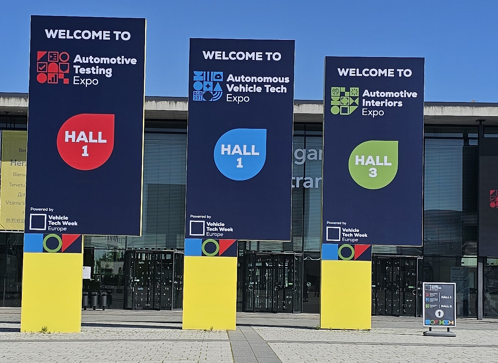
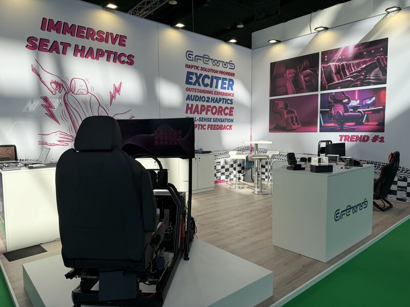
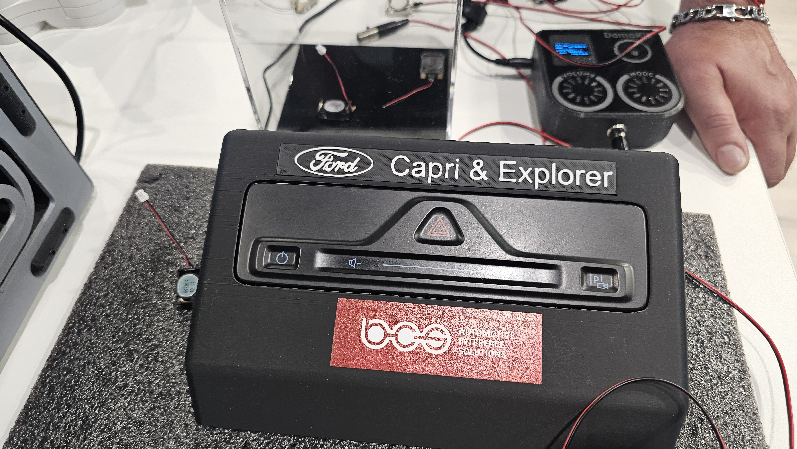
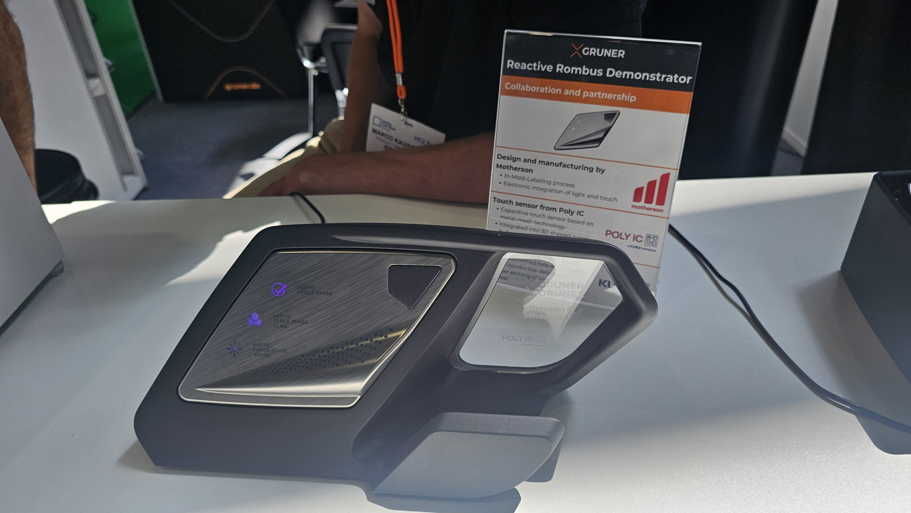

---
#Required fields
title: "Stuttgart Tripel : Kabin Kendaraan Sekarang Jadi Battleground Baru (Bagian 1/2)"
description: "Interior Expo 2026 Stuttgart, kabin kendaraan masa depan dengan sensor sentuh, pencahayaan cerdas, dan desain yang mengubah cara kita berinteraksi dengan mobil."
pubDate: 2026-06-28
category: "exhibition"
cover: "../../assets/blog/23/23.FrontField.jpg"
coverAlt: "Visual representation of Stuttgart Tripel : Kabin Kendaraan Sekarang Jadi Battleground Baru (Bagian 1)"

#Core Fields
tags: ["automotive"]
author: "Thomas Agung Nugraha"
lang: "id-ID"
draft: false

#recommended
slug: "blog23a-vehicle-tech-week-europe-2026-kabin-battle"
excerpt: "Perjalanan singkat saya ke Stuttgart Expo 2026 membuktikan satu hal: kabin mobil kini bukan lagi sekadar tempat duduk, melainkan medan perang teknologi HMI terbaru."
updatedDate: 2026-07-04

#Optional-series support
series: "Stuttgart Tripel"
seriesOrder: 1

#Optional:SEO & Indexing
canonicalURL: "https://t-agung.id/blog/blog23a-vehicle-tech-week-europe-2026-kabin-battle"
keywords:
  - automotive
noindex: false

#Optional-table-of-content
showToc: true

#optional-internal linking
relatedPosts:
  - blog23b-vehicle-tech-week-europe-2026-invisible-intelligence
---

import ImageCarousel from '../../components/ImageCarousel.astro';

import khalilCar01 from '../../assets/blog/23/23.Khalil-car01.jpg';
import khalilCar02 from '../../assets/blog/23/23.Khalil-car02.jpg';
import khalilCar03 from '../../assets/blog/23/23.Khalil-car03.jpg';
import khalilCar04 from '../../assets/blog/23/23.Khalil-car04.jpg';
import khalilCar05 from '../../assets/blog/23/23.Khalil-car-rear.jpg';

*3 Event di kampung halaman Teknologi Otomotif, Stuttgart*

## Kenapa Stuttgart?

Stuttgart bukan kota biasa di peta Jerman. Ini jantung detak industri otomotif Eropa, Mercedes-Benz dan Porsche bertetangga, BMW nggak jauh, dan ratusan ribu supplier, desain studio, serta teknologi startup berkumpul di sini karena kalau nggak ke Stuttgart, Anda praktis nggak ada di peta.

Tiga hari di pertengahan Juni, Messe Stuttgart jadi panggung utama. Tiga expo, satu cerita.

## Tiga Expo, Satu Cerita

Vehicle Tech Week 2026 di Stuttgart tahun ini menghadirkan tiga expo yang kalau dilihat sendiri-sendiri terlihat berbeda, tapi kalau ditarik benang merahnya, semuanya bercerita tentang hal yang sama.

Automotive Interiors Expo: 140+ exhibitor pamer teknologi kabin kendaraan generasi berikutnya. Autonomous Vehicle Tech Expo: sensor, AI, dan sistem otonom yang bikin kendaraan bisa "melihat" dan "berpikir". Material Expo: bahan-bahan baru dari material exotis, tekstil cerdas sampai komposit ringan yang bikin semua itu bisa jadi nyata.

Tiga expo ini nggak terpisah, mereka saling terkait. Interior butuh sensor otonom. Sensor butuh material yang bisa menampungnya. Material butuh desain interior yang bisa memamerkannya. Satu ekosistem, satu arah.

## Kabin Kendaraan Sekarang Jadi Battleground Baru

Dulu, spesifikasi kendaraan itu soal mesin dan kecepatan. Sekarang? Konsumen duduk di dalam kabin selama jam-jam perjalanan. Dan di situlah perang terjadi, siapa yang bisa membuat kabin paling cerdas, paling nyaman, dan paling aman.

Di Motherson, saya ikut diskusi soal bagaimana kabin kendaraan harus bertahan di suhu 85 derajat, tahan getaran, ngga ada *rattling* dan tetap terlihat premium setelah lima tahun digunakan. Sekarang standar itu naik lagi, kabin bukan hanya bertahan, tapi harus pintar.

Di Interiors Expo tahun ini, saya lihat beberapa teknologi yang bikin saya berpikir: "Ini bukan lagi soal interior, ini soal *experience*." Dan ini melanjutkan diskusi yang kita mulai di blog 20 tentang microLED di automotive HMI.

### Permukaan yang Bisa Menyentuh Kembali

Perusahaan-perusahaan di sini tidak hanya membuat tombol dan layar, mereka membuat permukaan kendaraan yang hidup dan merespons.

TouchNetix dari Norway pamer teknologi yang menarik. Chip aXiom mereka membuat permukaan dashboard jadi sentuh dan bisa merasakan tekanan. Tombol yang tersembunyi di balik lapisan lampu, muncul saat Anda mendekatkan jari. Lebih dari itu, teknologi yang mereka sebut Pilot ID bisa membedakan siapa yang menyentuh, apakah si pengemudi atau penumpang, dengan menggunakan sensor kapasitif juga. Bayangkan layar dual-view di mana pengemudi dan penumpang masing-masing punya zona sentuh sendiri, dan sistem tahu persis siapa yang menekan apa (omong-omong, beberapa saat lalu saya melihat prototype dari JDI yang menunjukkan layar dual view yang kualitasnya jauh lebih baik dibanding satu dekade lalu).

 <video src="/videos/23.TNX.mp4" width="600" controls>
  Your browser does not support the video tag.
</video> 

<em>Tombol interaktif yang ngerubah konten, slider interaktif menggunakan sensor kapasitif dan sensor tekanan yang juga ber-basis kapasitif</em>

 <video src="/videos/23.TNX-Taktotek_Demo.mp4" width="600" controls>
  Your browser does not support the video tag.
</video>

<em>Demo kolaborasi Touchnetix dengan Taktotek, nunjukin interactive lighting di dashboard</em>

 

Di booth yang sama, Grewus dari Hamburg pamer aktuator haptik seri HapForce mereka. Ini bukan getaran telepon, ini umpan balik haptic presisi tinggi berbasis voice coil yang juga bisa dipasang di kursi, menawarkan sensasi baru waktu kita main game contohnya.

*Grewus Booth sebelum acara buka* source: Grewus' Linkedin

HMI dengan aktif haptic itu sudah dipakai di Ford lho.

*Ford memakai Grewus actuator mengganti tombol klasik dengan force sensor dan aktif haptik*

### Pencahayaan yang Bisa Bercerita

Lampu di dalam mobil tidak lagi sekadar menerangi, sekarang lampu bisa berkomunikasi.

Boundup, perusahaan dari Wuxi, China, memamerkan LED individually addressable grade otomotif mereka. Artinya setiap lampu bisa dikontrol sendiri-sendiri, bukan lagi satu strip, yang sekarang memang trend di kabin otomotif. Mereka bersaing langsung dengan Iseled dan Osram di segmen yang sama, tapi yang menarik adalah mereka membawa harga dan fleksibilitas yang berbeda ke meja perundingan. Bayangkan lampu interior yang berubah warna sesuai suasana berkendara, atau memberi sinyal visual saat ada notifikasi dengan animasi yang menarik, driver nggak perlu lagi ngeliat layar.

 <video src="/videos/23.Boundup_flowingLED.mp4" width="600" controls>
  Your browser does not support the video tag.
</video>

<em>*Boundup individually addressable LEDs grade otomotif*</em>
 

### Tren Material dan Desain yang Mengejutkan

Khalil Design hadir sebagai presenter Zona Tren expo ini. Bukan galeri seni, mereka studio desain otomotif dengan pengalaman lebih dari 35 tahun, dan booth mereka memang terasa seperti galeri seni. 150 meter persegi menampilkan enam arah tren material masa depan: tekstil cerdas, material berbasis bio, permukaan sensorik, dan lainnya.
Sayangnya saya ngga boleh ngambil foto barang-barang mutakhir mereka, yang benar-benar kayak hasil karya seni.

Tapi..yang bikin ramai juga adalah project mereka yang disebut OQTA Super GYR. Yaitu Mercedes G-Class yang dimodifikasi total. Bodywork karbon, mesin 800 tenaga kuda, interior marmer, headliner bordir dengan efek pencahayaan, dan kursi yang dirancang ulang dari nol oleh Khalil Design. Harga mulai €1,5 juta. Debutnya di Top Marques Monaco 2026, dan pasar yang ditargetkan jelas: Riyadh, Shanghai, Baden-Baden. Ini bukan mobil mewah biasa! ini karya seni yang bisa melaju di gurun. Sudah ada yang beli, katanya.

<ImageCarousel
  images={[
    { src: khalilCar01, alt: 'OQTA Super GYR by Khalil Design front view' },
    { src: khalilCar02, alt: 'OQTA Super GYR by Khalil Design side view' },
    { src: khalilCar03, alt: 'OQTA Super GYR by Khalil Design rear or detail view' },
    { src: khalilCar04, alt: 'OQTA Super GYR by Khalil Design interior or additional view' },
  ]}
/> 
OQTA Super GYR — Mercedes G-Class modifikasi total oleh Khalil Design, €1,5 juta

Sekisui, Molex, dan kolaborasi Intops-Mobis juga menunjukkan hal menarik di expo ini, tapi saya simpan untuk lain waktu, ada terlalu banyak untuk dicakup dalam satu tulisan.

### Kolaborasi yang Belum Selesai

Ada satu kolaborasi yang patut diperhatikan: Gruner AG, Motherson, PolyIC, dan KURZ bersama-sama membuat demonstrasi yang disebut "Reactive Rhombus". Panel HMI yang di-thermoform 3D, bisa disentuh dipencet, dan memberikan umpan balik haptik presisi tinggi untuk setiap interaksi. Sensor kapasitif PolyIC tertanam langsung di dalam permukaan, tak terlihat. Teknologi haptik aktif Gruner memberi "klik" yang terasa nyata. Demonstran ini sudah ditampilkan di CES 2026 dan Embedded World, dan sinyalnya jelas: permukaan di dalam mobil akan semakin cerdas dan semakin tak terlihat.

*Reactive Rhombus : interaktif panel dengan sensor tertanam dan respon balik haptik*

## Lanjutan di Bagian 2

Bagian pertama ini fokus pada apa yang bisa Anda lihat, sentuh, dan rasakan di kabin kendaraan masa depan. Tapi di balik semua yang terlihat ini, ada teknologi "tak terlihat" yang jauh lebih mengubah permainan, yaitu sistem sensor, AI, dan kecerdasan otonom yang membuat kendaraan bisa melihat, berpikir, dan memutuskan sendiri.

Di bagian kedua, saya akan masuk ke Autonomous Vehicle Tech Expo dan teknologi-teknologi yang tidak Anda lihat, tapi menentukan arah masa depan mobilitas.

## Sumber

- TouchNetix: https://touchnetix.com
- Grewus: https://grewus.de
- Boundup: https://boundup.cn
- Khalil Design: https://khalil-design.com
- OQTA Motors: https://instagram.com/oqtamotors
- Gruner AG: https://gruener.com
- Interior Expo Stuttgart 2026: https://interiorexpo.stuttgart