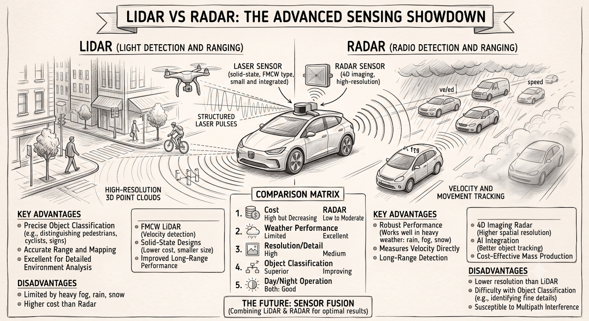
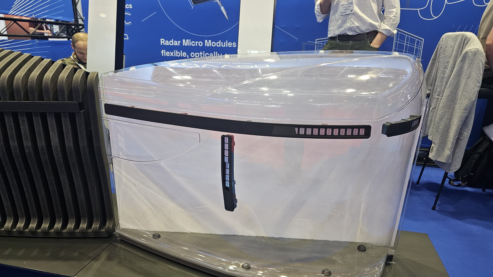
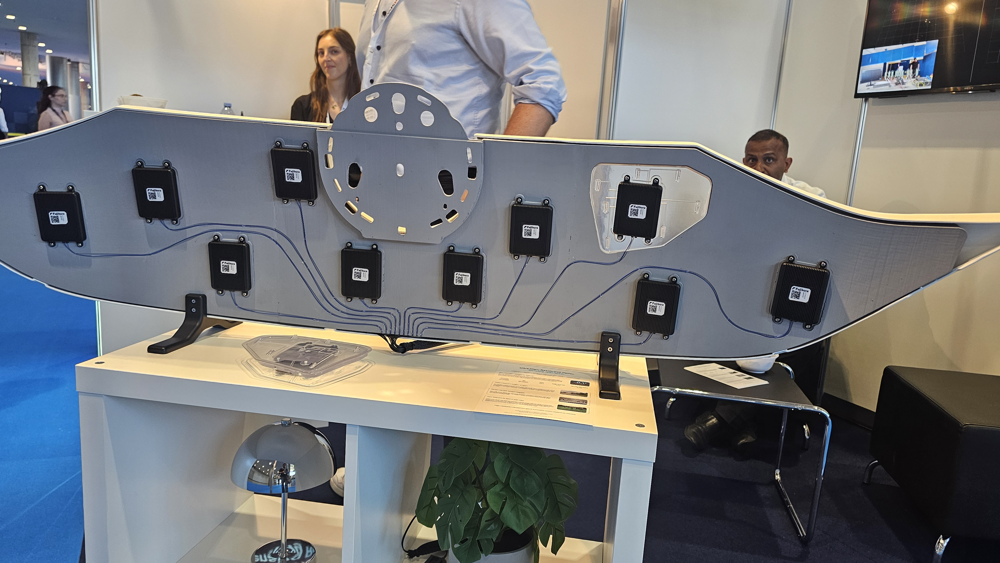
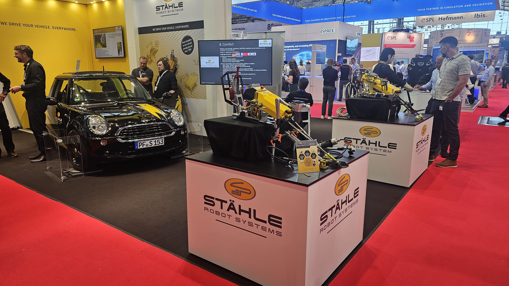
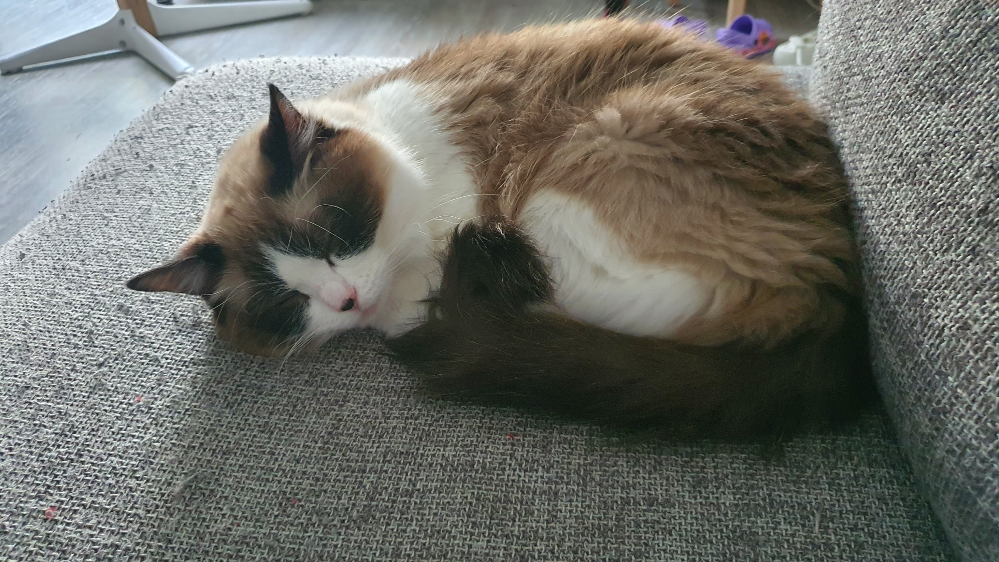

## Teknologi Tak Terlihat yang Mengendalikan Segalanya

Di bagian pertama, kita sudah melihat apa yang bisa Anda sentuh dan rasakan di kabin masa depan. Sekarang masuk ke teknologi yang tidak terlihat mata — tapi justru ini yang mengendalikan segalanya. Ini juga melanjutkan diskusi tentang bagaimana teknologi display dan sensor berkembang dari blog 11 tentang layar lipat, blog 20 tentang microLED, dan blog 22 tentang teknologi crease, semuanya menuju satu arah: kendaraan yang semakin cerdas dan semakin memahami kita.

Autonomous Vehicle Tech Expo di Stuttgart menghadirkan lebih dari 200 exhibitor yang fokus pada satu pertanyaan: bagaimana membuat kendaraan bisa "melihat", "berpikir", dan "memutuskan"?

### LIDAR vs RADAR — Siapa yang Menang?

Pertanyaan ini sudah lama jadi perdebatan. Jawabannya? Bukan siapa menang, tapi bagaimana mereka bekerja bersama.
Saya sendiri bukan ekspert di Lidar dan Radar, dan ini ngasi kesempatan saya untuk belajar juga.

Perbandingan LIDAR vs RADAR source: Google

Coba kita lihat fakta teknisnya, setidak-tidaknya relevan di tahun 2025:

| Fitur           | LIDAR              | RADAR (4D)               |
| --------------- | ------------------ | ------------------------ |
| Jangkauan       | 100-250m           | 150-300m                 |
| Resolusi sudut  | 0.1°               | 1-2° (4D: 0.1°)          |
| Deteksi elevasi | Ya                 | Hanya 4D                 |
| Cuaca buruk     | Terpengaruh        | Tahan cuaca              |
| Biaya           | $500-$1500         | $200-$500                |
| Penggunaan      | Pemetaan 3D detail | Kecepatan + jarak akurat |

LIDAR memberi Anda peta 3D yang presisi, setiap objek di sekitar terlihat jelas. Tapi saat hujan deras atau kabut tebal, LIDAR mulai buta.

RADAR lebih murah, tahan semua cuaca, dan sangat akurat mengukur kecepatan. Tapi RADAR konvensional tidak bisa memberi Anda peta 3D yang detail, sampai muncul RADAR 4D yang bisa mengukur elevasi juga.

Makanya produsen mobil tidak memilih satu. Mereka menggunakan keduanya secara bersamaan. LIDAR untuk presisi di kondisi normal, RADAR untuk keandalan di cuaca buruk. Kedua sistem ini saling melengkapi — bukan saling menggantikan.

### Fiber Optic — Sensor Baru di Horizon?

Di Autonomous Vehicle Tech Expo Europe (bukan Interior Expo, tapi bagian dari Vehicle Tech Week yang sama), Xavveo dari Berlin dan Fujikura dari Jepang memamerkan pendekatan berbeda.

Konsepnya: gunakan fiber optic sebagai media transmisi data sensor, bukan sebagai sensor langsung. Xavveo sendiri mengembangkan "distributed photonic radar" yaitu sistem radar fotonic generasi baru yang mentransmisikan sinyal radar melalui fiber optic, melewati batasan radar elektronik konvensional. Fiber optic tahan terhadap interferensi elektromagnetik, ringan, dan bisa membawa data besar dari sensor.

Demo Xavveo di Vehicle Tech Week Europe 2026: Fiber optic sebagai media transmisi data sensor

 

Xavveo (Berlin) fokus pada distributed photonic radar untuk kendaraan otonom. Fujikura membawa pengalaman 140+ tahun (didirikan 1885) di fiber optic dan karena itu salah satu teamnya memanfaat ekspertise ini dan mengembangkan distributed radar system mereka.

Ini bukan pengganti LIDAR atau RADAR konvensional, ini adalah cara baru untuk menghubungkan semua radar sensor yang komplex itu ke otak kendaraan dengan lebih andal, lebih ringan, dan lebih tahan terhadap gangguan elektromagnetik yang semakin padat di mobil masa depan.

Fujikura juga mengembangkan distributed Radar system, untuk mempertinggi resolusi Radar

### Digital Twin dan Big Data untuk Autonomous Driving

Teknologi otonom tidak gampang untuk diuji di jalan raya, itu terlalu berbahaya, terlalu lambat, dan terlalu mahal. Solusinya? Digital twin.

Konsepnya sederhana tapi powerful: buat replika digital kendaraan dan lingkungannya, lalu uji jutaan skenario di dunia virtual sebelum menyentuh aspal. Perusahaan seperti NVIDIA dengan Omniverse, dllr dengan CARLA, dan Waymo dengan simulator internal mereka sudah menggunakan pendekatan ini.

Tapi digital twin saja tidak cukup. Anda butuh data nyata untuk melatihnya. Di sinilah big data masuk.

Kendaraan otonom modern mengumpulkan terabytes data setiap hari dari LIDAR, RADAR, kamera, dan sensor lainnya. Data ini digunakan untuk:

- Melatih model AI untuk mengenali objek baru
- Mensimulasikan skenario langka (anak kecil tiba-tiba melintas, hewan di jalan, cuaca ekstrem)
- Memperbaiki sistem berdasarkan pengalaman nyata
- Mensimulasikan teknologi baru (sensor, braking system, atau material baru)

Tanpa data, digital twin adalah dunia kosong. Tanpa digital twin, data hanyalah angka yang tidak berarti. Keduanya harus bekerja bersama.

### Ngetes sebenarnya gimana caranya ?
Dulu waktu belum ada robot, manusia yang dipercayakan untuk ngetes mobil yang sedang dikembangkan. Tapi karena manusia yang nyetir, susah untuk 100% mengulang semuanya.
Contohnya, bisa ngga sih kita 100% ngulangin braking di 43%, sambil belok 18° dan ngelepas remnya setelah 1.8 detik ?
Nah untuk memecahkan kesulitan itu, Stähle menunjukkan produknya, yaittu robot yang bisa dipakai untuk driving evaluation.  
Kalau dengar robot, kita ngebayangin kayak terminator gitu kan ya ?  tapi ngga selalu begitu, ini dia robotnya Stähle

Stähle menunjukkan "robot" untuk ngontrol gas dan rem.... ngga kayak terminator ya?

 
Dan ini sistem menunjukkan gimana "robot" itu bekerja :

 <video src="/videos/23.Staehle.mp4" width="600" controls>
  Your browser does not support the video tag.
</video>

<em>Demo robot Stähle, dengan memakai robot, skenario testing bisa dijamin dan di ulang 100% sama</em>

 

## Penutup : Dari Horsepower ke Kecerdasan

Mari kita mundur sejenak.

Dulu, ketika kita bicara tentang mobil, yang kita bahas adalah kecepatan dan tenaga. Mesin berapa liter, berapa tenaga kuda, berapa kecepatan tertinggi. Itu ukuran kemajuan.

Sekarang?

Kemajuan diukur dari seberapa cerdas kendaraan bisa membuat penumpang merasa aman, nyaman, dan terhubung. Dari layar yang bisa membedakan siapa yang menyentuh, hingga sensor yang bisa "melihat" dalam gelap total, hingga AI yang bisa belajar dari jutaan pengalaman berkendara.

Perjalanan dari horsepower ke kecerdasan ini bukan tentang meninggalkan masa lalu, tapi tentang memahami bahwa pengalaman berkendara bukan lagi soal mesin, tapi tentang bagaimana kendaraan memahami kita.

Katanya kucing punya kemampuan sakti tidur 18 jam sehari

 

Moko juga punya pendapat tentang ini: kalau dia bisa naik mobil yang kursinya otomatis menyesuaikan dengan posturnya, pasti dia akan tidur lebih nyenyak dalam perjalanan. Dan itu, menurut saya, adalah inti dari semua teknologi ini, membuat setiap menit di dalam kendaraan lebih nyaman, lebih aman, dan lebih menyenangkan.

Komen aja: menurut Anda, apakah kita bergerak ke arah yang benar? Atau ada yang kita lewatkan di tengah semua kecerdikan ini?

## Sumber

- TouchNetix: https://touchnetix.com
- Grewus: https://grewus.de
- Boundup: https://boundup.cn
- Khalil Design: https://khalil-design.com
- OQTA Motors: https://instagram.com/oqtamotors
- Gruner AG: https://gruener.com
- Xavveo: https://xavveo.at
- Fujikura: https://www.fujikura.com/global/en/
- Interior Expo Stuttgart 2026: https://interiorexpo.stuttgart
- Autonomous Vehicle Tech Expo: https://autonomousvehicletechexpo.com
