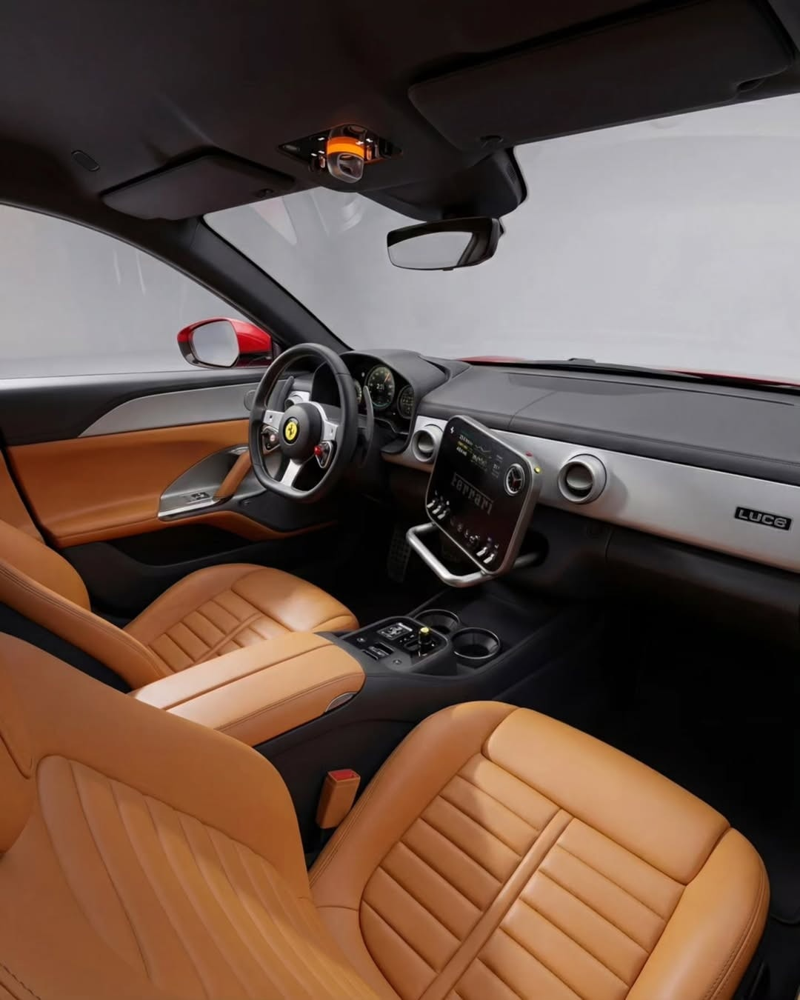
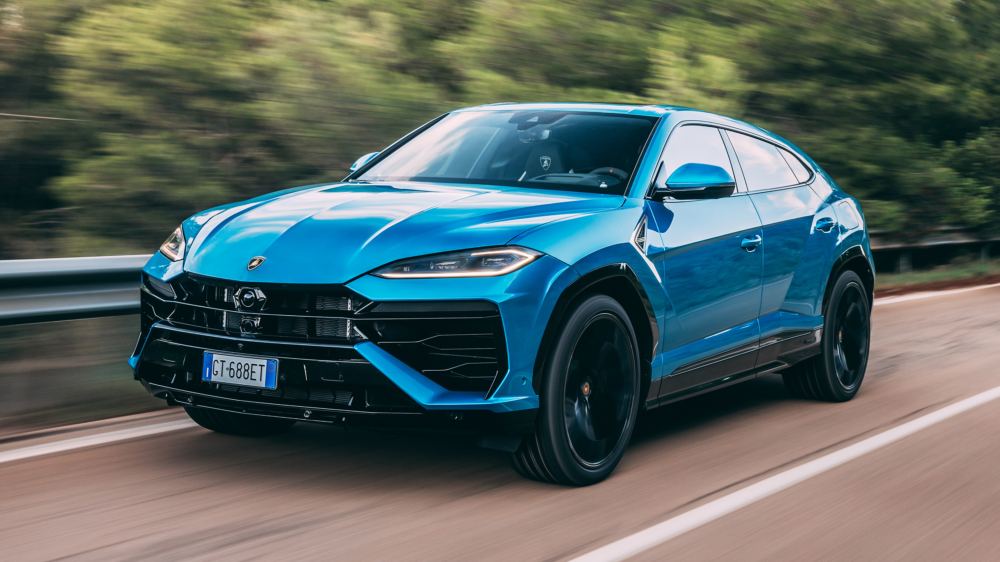
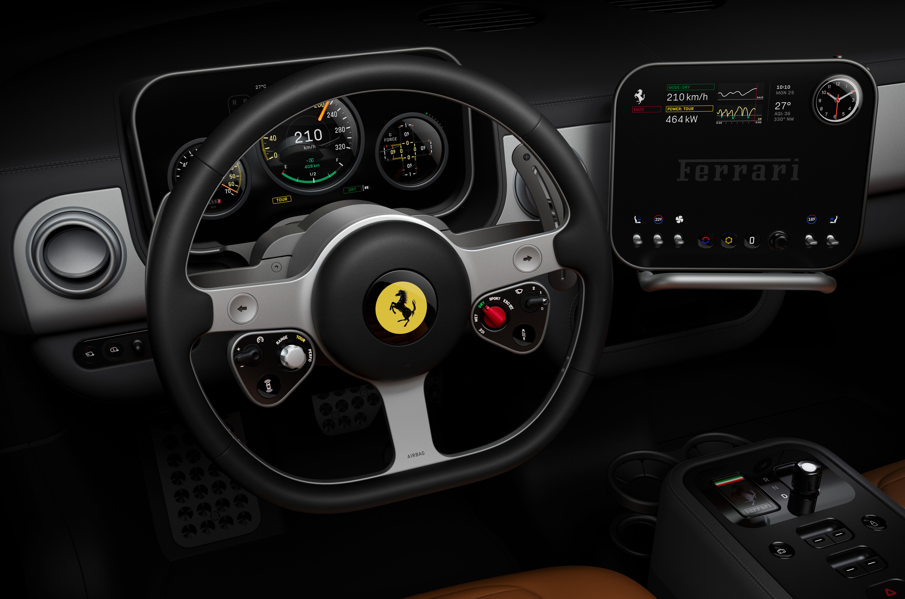
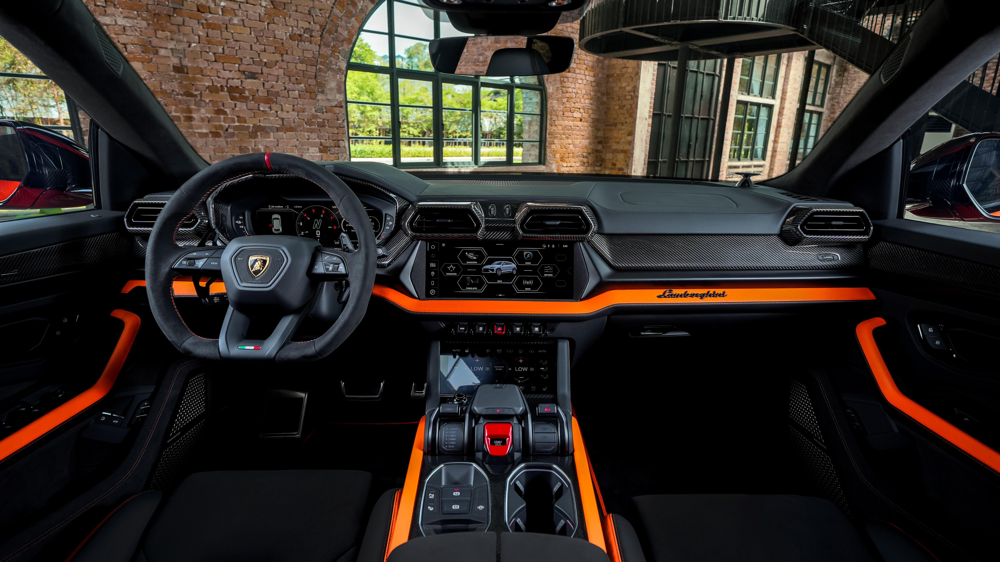
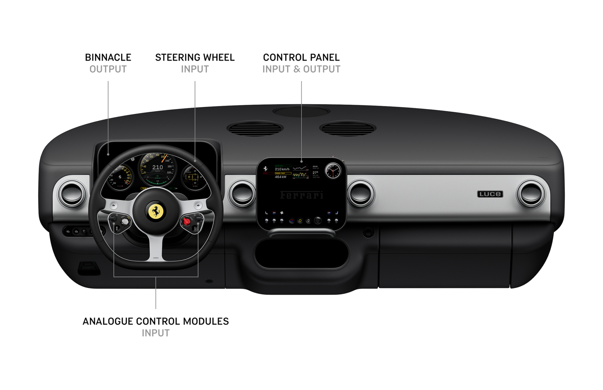
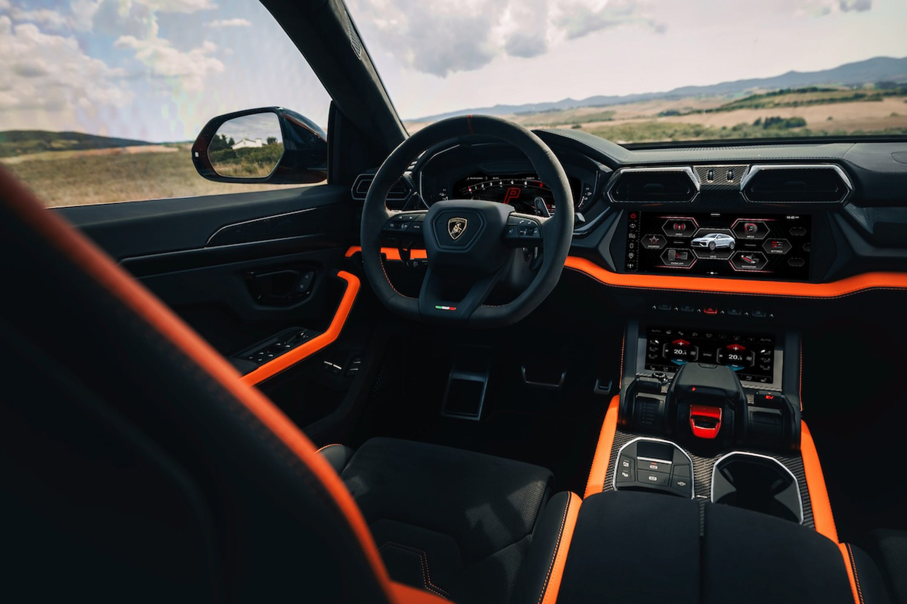
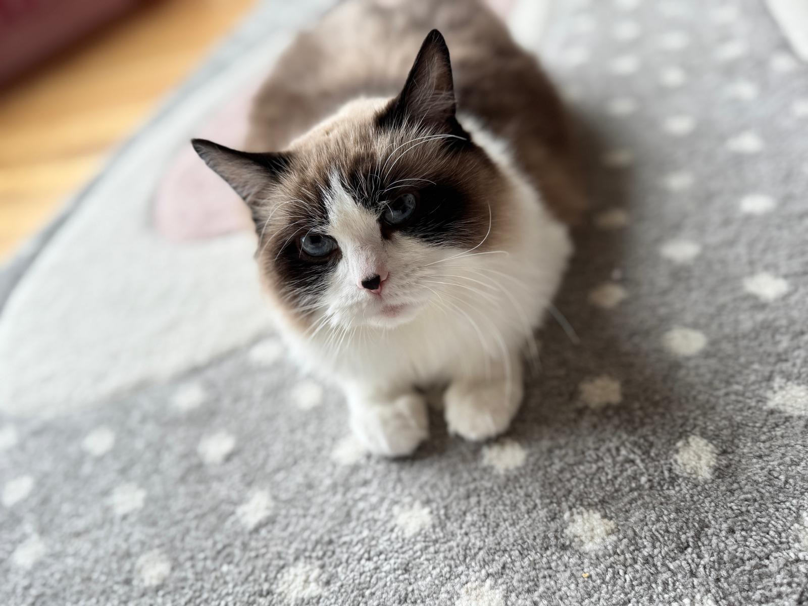

Abis saya nulis blog 21 soal teknologi OLED kokpit Ferrari Luce, ada satu pertanyaan yang terus muncul di pikiran saya: Ferrari Luce bukan satu-satunya mobil high-end yang debut tahun ini. Lamborghini baru saja meluncurkan Urus SE, facelift hybrid yang nambah lebih dari 200 horsepower dibanding generasi sebelumnya.

Dua mobil. Dua brand Italia. Dua filosofi yang sama sekali berbeda soal bagaimana cara menuju masa depan otomotif.  Yang dua-duanya mengingatkan plesetan bahasa indonesia... Lucu dan Kurus...

Saya kerja di bidang automotive HMI sekarang, dulu handle display technology di Sony dan Intel. Kalau ada dua kokpit yang menarik buat dianalisis dari sisi teknologi dan interaksi manusia-mesin, ini dia salah satu contohnya.

Ferrari Luce — sedan listrik pertama Ferrari, desain oleh Jony Ive / LoveFrom, source: Ferrari

## Pertarungan di Atas Kertas: Spesifikasi

Sebelum masuk ke detail, mari lihat angka-angka mentah dulu. Angka ini penting karena menunjukkan ke mana masing-masing brand mengarah.

| Spesifikasi    | Ferrari Luce                     | Lamborghini Urus SE                  |
| -------------- | -------------------------------- | ------------------------------------ |
| Tipe           | BEV (Full Electric)              | PHEV (Plug-in Hybrid)                |
| Powertrain     | Quad-motor AWD (4 motor listrik) | 4.0L Twin-Turbo V8 + 1 motor listrik |
| Total Output   | 1.050 cv (1.036 hp)              | 789 hp                               |
| Torque         | 1.656 Nm                         | 950 Nm                               |
| 0-100 km/h     | 2,5 detik                        | 3,4 detik                            |
| Top Speed      | 310 km/h                         | 312 km/h                             |
| Battery        | 122 kWh (800V)                   | 25,9 kWh                             |
| Electric Range | 530 km (WLTP)                    | ~60 km                               |
| Chassis        | Aluminium 75% daur ulang         | Aluminium + forged carbon (opsional) |
| Weight         | 2.260 kg                         | 2.505 kg                             |
| Body           | 4 pintu, 5 penumpang (Sedan)     | 5 pintu SUV                          |
| Cockpit        | Jony Ive / LoveFrom              | Lamborghini Centro Stile             |
| HMI            | Physical controls + OLED         | Dual touchscreen + haptic feedback   |
| Harga          | €550.000 (~Rp 11,5 Miliar)       | £208.000 (~Rp 4,8 Miliar)            |

Angka-angka ini bukan cuma soal siapa lebih cepat di lintasan lurus. Yang menarik adalah bagaimana setiap angka mencerminkan pilihan filosofi yang berbeda. Ferrari pilih all-in listrik dengan empat motor yang masing-masing mengendalikan satu roda. Lamborghini pilih hybrid, mempertahankan V8 ikonik sambil nambah listrik sebagai boost. V8 itu bukan hanya tenaga, tapi suaranya juga merdu banget.

*Lamborghini Urus SE — hybrid V8 yang mempertahankan jiwa pembakaran di era elektrifikasi*

## Ferrari Luce: Revolusi Tanpa Kompromi

Ferrari Luce bukan sekadar mobil listrik pertama Ferrari. Ini statement bahwa Ferrari serius memasuki era baru tanpa setengah hati.

Powertrain quad-motor-nya unik karena setiap roda dikendalikan oleh motor listrik terpisah. Ini bukan AWD konvensional yang bagikan torsi ke dua poros. Ini torque vectoring level maksimum. Setiap roda bisa diatur torsi-nya secara independen. Di Motherson, saya ikut diskusi soal smart cockpit yang butuh komunikasi real-time antar sensor dan aktuator. Ferrari Luce membawa konsep itu ke level powertrain: empat motor, empat sinyal kontrol, satu respons.

Baterai 122 kWh dengan arsitektur 800 volt bukan angka main-main. 800 volt berarti charging yang jauh lebih cepat daripada standar 400V yang banyak mobil listrik pakai sekarang. Energy density baterai 195 Wh/kg. Ferrari sebut ini "race level performance with low central mass for optimal balance." Baterai bukan cuma sumber daya, tapi bagian dari struktur. Ferrari bilang "battery pack, chassis, and body form an integrated system."

Gini perumpamaannya: kayak perbedaan antara taruh baterai di tas versus bikin baterai jadi bagian dari kerangka sepeda motor. Satu berat, satu terintegrasi.

Chassis-nya pertama di Ferrari yang pakai 75% aluminium daur ulang. Bukan gimmick marketing. Aluminium daur ulang butuh proses ekstrusi dan casting hollow yang presisi untuk tetap meeting structural requirements. Ferrari juga pakai kombinasi hollow castings, extrusions, dan aluminium sheet metal. Semua dirakit di Maranello.

Dan yang bikin Ferrari Luce berbeda dari setiap Ferrari sebelumnya: ini sedan 4 pintu pertama Ferrari, dan Ferrari 5 penumpang pertama. Ferrari yang selama hampir 80 tahun bikin sports car 2 penumpang, sekarang buka pintu buat keluarga. Dan yang nggak perlu saya ulangi lagi, Luce merupakan BEV pertama dari Ferrari.

*Kokpit Ferrari Luce — lebih dari 60 kontrol fisik, tanpa layar sentuh utama*

## Lamborghini Urus SE: Evolusi dengan Jiwa V8

Lamborghini mengambil pendekatan yang berlawanan. Daripada meninggalkan mesin pembakaran, mereka perkuat.

Urus SE bukan facelift biasa. Lamborghini nambah motor listrik permanent-magnet synchronous yang bukan cuma untuk mode EV. Motor ini jadi boost untuk V8. Hasilnya: 789 hp total, naik dari 657 hp Urus Performante. Torque 950 Nm. 0-100 km/h dalam 3,4 detik. Masih 0,9 detik di belakang Ferrari Luce, tapi ingat ini SUV 2,5 ton dengan V8 beneran di dalam.

Yang menarik dari sisi engineering: motor listrik Urus SE bekerja sebagai traction element DAN boost element. Artinya motor listrik tidak hanya mendorong roda, tapi juga membantu V8 di momen akselerasi kritis. Lamborghini sebut ini "perfect synergy." Di dunia otomotif, hybrid approach kayak gini biasanya lebih efisien daripada full BEV untuk kendaraan besar, karena Anda tidak perlu bawa baterai sebesar Ferrari Luce untuk jarak tempuh yang sama.

Baterai 25,9 kWh cukup buat ~60 km full electric. Cukup buat commute harian di kota. Tapi ketika Anda butuh performa penuh, V8 twin-turbo 4.0 liter langsung jadi kuda utamanya. Ini bukan "listrik dulu, bensin nanti." Ini dua sistem yang bekerja bersamaan secara seamless.

Lamborghini juga nambah tiga mode efisiensi: ECO, Eco Drive, dan Eco Sail. ECO mode optimalkan konsumsi energi. Eco Drive nyesuaikan throttle response dan transmission behavior. Eco Sail - yang paling menarik - memungkinkan mobil meluncur dalam mode electric tanpa throttle input, mengurangi drag dan memaksimalkan range.

Pikirin begini: Ferrari Luce kayak marathon runner yang bawa cadangan energi untuk jarak jauh. Lamborghini Urus SE kayak sprinter yang punya cadangan napas di detik-detik kritis.

*Interior Urus SE — forged carbon panel, dual touchscreen LIS III, "Feel Like a Pilot" cockpit*

## Kokpit dan HMI: Perang Filosofi

Di sinilah saya sebagai engineer HMI paling excited. Karena Ferrari Luce dan Lamborghini Urus SE mengambil dua sisi berlawanan dari debat yang sama: apakah interaksi di dalam mobil harus fisik atau digital?

### Ferrari Luce: Tombol, Switch, dan Jarum Mekanik

Jony Ive, orang yang popularisasi layar sentuh di iPhone, sekarang bilang layar sentuh di mobil itu salah. Ferrari Luce menolak tren layar besar dengan penuh kontrol fisik: tombol presisi, dial, toggle, dan switch, semua dari aluminium yang bisa disesuaikan warnanya untuk personalisasi.

Ferrari sendiri tulis di halaman desain mereka: "The Ferrari Luce's HMI represents a deliberate rejection of the large-touchscreen trend dominating modern EVs." Ini bukan kebetulan. Ini pilihan desain yang sadar.

Alasannya logis dari sisi keselamatan: saat Anda berkendara, tangan Anda harus bisa menemukan kontrol tanpa melihat. Tombol fisik punya posisi spasial yang otak sudah hafal. Layar sentuh? Anda harus lihat dulu, baru sentuh. Itu extra kognitif load yang berbahaya saat kecepatan 250 km/h di autobahn.

Di Motherson, saya lihat langsung bagaimana tim engineering otomotif diskusi soal trade-off antara layar besar dan kontrol fisik. Konsensusnya sama: layar bagus untuk visualisasi dan informasi, tapi kontrol krusial harus tetap fisik. Ferrari Luce mengambil langkah paling radikal dengan membuat hampir semua kontrol jadi fisik.

Dan dashboard-nya hybrid: tiga jarum mekanik yang muter 360 derajat, tertanam di panel OLED dengan lubang HIAA. Bukan animasi digital. Jarum beneran. Otak manusia proses gerakan fisik lebih cepat daripada perubahan piksel, ini bukan opini, ini neurologi. Response time jarum mekanik itu nol.

*Dashboard Ferrari Luce — jarum mekanik fisik tertanam di panel OLED 12,86 inci*

### Lamborghini Urus SE: Layar Sentuh dengan Haptic Feedback

Lamborghini mengambil jalur yang berbeda. LIS III (Lamborghini Infotainment System III) mengandalkan dua layar sentuh modern dengan haptic feedback; layar atas untuk entertainment dan navigasi, layar bawah untuk kontrol, ditambah tiga display HD lainnya.

LIS III punya voice commands yang interaktif, dan instrument cluster yang berubah visual-nya sesuai driving mode. Lamborghini juga pertajam connectivity dan safety features.

*LIS III Infotainment : dual touchscreen dengan haptic feedback*

Tapi yang paling menarik untuk kita yang di dunia HMI: **haptic feedback**.

Ini bukan getaran sederhana kayak notifikasi di HP. Haptic feedback di LIS III dirancang untuk memberikan sensasi taktil saat Anda menyentuh kontrol virtual, jadi layar sentuh terasa seperti tombol fisik. Teknologi ini menggunakan active haptic actuator yang bisa menghasilkan getaran frekuensi tinggi dengan presisi mikron.

Contoh sederhana: saat Anda menekan tombol volume di layar, Anda merasa ada "klik" fisik, padahal itu cuma getaran yang disinkronkan dengan sentuhan. Otak tertipu, dan pengalaman terasa lebih natural.

Ini penting karena haptic feedback bisa jadi jembatan antara dua dunia: kenyamanan layar sentuh yang fleksibel dengan kepuasan taktil tombol fisik. Dan industri otomotif mulai serius, di Vehicle Tech Week Europe 2026 yang saya cover di blog 23a, saya lihat Grewus HapForce dan juga Grüner yang menghadirkan haptic actuator generasi baru untuk kokpit kendaraan.

Saya rasa haptic feedback ini layak jadi topik deep-dive tersendiri. Ada banyak yang belum dibahas: jenis-jenis actuator (piezoelectric vs ERM vs LRA vs DDA etc), latency requirements di automotive context, dan kenapa haptic feedback di layar mobil lebih sulit daripada di smartphone. Nanti saya bahas di blog terpisah.

### Perbandingan Langsung

Kokpit Ferrari Luce bilang: "Layar sentuh itu tidak intuitif di mobil. Kita kembali ke fundamental."

Kokpit Lamborghini Urus SE bilang: "Layar sentuh itu masa depan, dan kita perbaiki pengalaman taktil-nya dengan haptic feedback."

Dua pendekatan. Dua jawaban untuk masalah yang sama. Dan jujur, saya pikir keduanya punya merit. Ferrari Luce benar tentang safety dan kognitif load. Lamborghini benar tentang fleksibilitas dan upgradability, software update bisa nambah fitur baru tanpa ganti hardware.

## Inovasi yang Jarang Dibahas

Selain powertrain dan HMI, ada beberapa inovasi di kedua mobil yang jarang disebut di review umum.

**Ferrari Luce — Suara dari As:** Ferrari Luce tidak punya mesin pembakaran, tapi Ferrari tidak mau mobilnya bisu. Ferrari menggunakan sensor getaran pada axle untuk menghasilkan suara yang responsif terhadap akselerasi dan kondisi jalan. Bukan speaker yang putar file audio — ini feedback real-time dari getaran mekanis yang dikonversi ke audio. Inovatif karena suara mobil listrik ini bukan rekaman, tapi benar-benar dihasilkan dari fisika kendaraan itu sendiri.

**Ferrari Luce — Steering Wheel 19 Bagian:** Setir Ferrari Luce dibuat dari aluminium daur ulang dan terdiri dari 19 komponen CNC yang terpisah, lalu disatukan. Bukan injection molding murah — ini presisi machining. Setiap grip area, tombol kontrol, dan struktur penopang dibuat terpisah untuk toleransi yang presisi, lalu dirakit menjadi satu kesatuan. 

**Lamborghini Urus SE — Matrix LED Headlights:** Urus SE nambah matriks LED headlights yang bisa adaptif — menyesuaikan pola cahaya berdasarkan kecepatan, kondisi jalan, dan kendaraan di depan. Teknologi ini sudah ada di premium segment, tapi implementasi Lamborghini terintegrasi dengan driving mode-nya. Setiap mode mengubah bukan hanya performa, tapi juga pencahayaan.

**Lamborghini Urus SE — Forged Carbon Interior (Opsional):** Panel interior Urus SE Full Carbon pakai forged carbon — bukan carbon fiber biasa. Forged carbon punya serat arak yang diresin di bawah tekanan tinggi, menghasilkan pola visual yang unik dan kekuatan struktural yang lebih baik. Setiap panel punya pola yang berbeda, kayak sidik jari. Perlu dicatat bahwa ini tersedia sebagai kustomisasi Ad Personam, bukan standar.

## Harga dan Konteks

Mari bicara jujur soal harga.

Ferrari Luce dibanderol €550.000 atau sekitar Rp 11,5 miliar di Eropa. Di Indonesia, dengan pajak mobil mewah dan bea masuk, realistiknya bisa tembus Rp 12 miliar ke atas. Ini bukan untuk pasar massal. Ferrari menjual kurang dari 14.000 mobil per tahun. Luce ditargetkan ke pasar China yang haus EV premium dan pembeli yang mau Ferrari di era listrik.

Lamborghini Urus SE lebih "terjangkau" di £208.000 atau sekitar Rp 4,8 miliar — tetap sangat premium, tapi bukan level Ferrari. Urus SE juga lebih practical: SUV dengan ruang kargo, lima penumpang nyenyak, dan kemampuan daily drive yang lebih realistis karena ada V8 sebagai backup.

Sederhananya: Ferrari Luce buat orang yang mau statement. Lamborghini Urus SE buat orang yang mau performance DAN practicality.

## Kesimpulan: Bukan Siapa Menang, Tapi Ke Mana Arahnya

Ferrari Luce dan Lamborghini Urus SE tidak bersaing di kategori yang sama. Satu sedan listrik 5 penumpang, satu SUV hybrid. Tapi keduanya menjawab pertanyaan yang sama: bagaimana brand performa Italia bertahan di era elektrifikasi?

Ferrari jawab dengan all-in BEV. Quad-motor, 800V, baterai terintegrasi, desain radikal oleh Jony Ive. Risiko tinggi, hadiah tinggi. Kalau Ferrari Luce diterima pasar, Ferrari punya template untuk semua mobil listrik mereka ke depannya.

Lamborghini jawab dengan hybrid yang mempertahankan jiwa V8. Motor listrik sebagai boost, bukan pengganti. Haptic feedback sebagai jembatan antara digital dan taktil. Pendekatan evolusioner yang lebih aman, tapi tetap menunjukkan arah.

Dari sudut HMI, pertarungan paling menarik terjadi di dalam kokpit. Ferrari bilang tombol fisik adalah jawaban. Lamborghini bilang layar sentuh plus haptic feedback adalah jawaban. Saya rasa jawaban sebenarnya ada di tengah — dan mungkin beberapa tahun lagi kita lihat kokpit yang hybrid: kontrol krusial tetap fisik, kontrol sekunder di layar dengan haptic feedback yang presisi.

Saya lihat tren ini di Motherson. Tim-tim OEM yang saya temui sudah eksplorasi haptic actuator generasi baru, dan beberapa sudah siap masuk mass production tahun 2027-2030. Haptic feedback bukan gimmick, ini kebutuhan real untuk kokpit yang semakin digital.

## Moko Nge-comment

Perbandingan LIDAR vs RADAR source: Google

Moko baru sadar ada dua mobil Italia yang lagi dibanding-bandingkan. Katanya kalau saya terjemahkan dari bahasa kucing: "Ferrari 12 miliar? Itu cukup buat beli 5000 mangkuk makanan kucing premium. Lamborghini 4,8 miliar? Masih mahal, tapi setidaknya ada V8-nya. Saya pilih yang punya mesin ribut, biar bisa beli makanan kucing yang lebih enak."

## Penutup

Dua mobil Italia. Dua cara menuju masa depan. Ferrari nekat dengan listrik murni. Lamborghini hati-hati dengan hybrid yang mempertahankan V8.

Buat saya yang kerja di HMI otomotif, yang paling menarik bukan angka horsepower-nya, tapi bagaimana masing-masing brand menginterpretasi interaksi antara manusia dan mesin di era digital. Ferrari kembali ke fisik. Lamborghini dorong digital dengan sentuhan taktil. Dan haptic feedback yang Lamborghini gunakan? Nanti saya bedah lebih dalam di blog terpisah.

Komen aja: kalau Anda harus pilih antara kokpit penuh tombol fisik kayak Ferrari Luce atau layar sentuh dengan haptic feedback kayak Lamborghini, mana yang Anda pilih? 

---

**Referensi dari blog sebelumnya:**

- [Ferrari Luce: OLED Kokpit Ferrari Pertama](/blog/blog21_ferrari-luce-oled-cockpit/)
- [Vehicle Tech Week 2026: Kabin Kendaraan Sekarang Jadi Battleground Baru](/blog/blog23a-vehicle-tech-week-europe-2026-kabin-battle/)
- [Vehicle Tech Week 2026: LIDAR, RADAR, dan Masa Depan Otonomi](/blog/blog23b-vehicle-tech-week-europe-2026-invisible-intelligence/)

**Sumber:**

- Ferrari Official Engineering Page — https://www.ferrari.com/en-EN/auto/ferrari-luce-engineering
- Ferrari Official Design Page — https://www.ferrari.com/en-EN/auto/ferrari-luce-design
- Lamborghini Urus SE Official — https://www.lamborghini.com/en-en/models/urus/urus-se
- Lamborghini Urus SE Digital Brochure — https://www.lamborghini.com/original/DAM/lamborghini/0_facelift_2025/model_details/urus_se/brochure/2026/02_23/Lamborghini%20URUS_PHEV_DIGITAL_BROCHURE_EN_2026_WCAG.pdf
- Carscoops — Jony Ive Ferrari Luce Interior Coverage
- HMI Gallery — Ferrari Luce HMI Design Analysis — https://www.hmi.gallery/hmi/ferrari-luce-interface
- Autocar — Lamborghini Urus SE Review — https://www.autocar.co.uk/car-review/lamborghini/urus-se
- Car and Bike — Lamborghini Urus Specifications
- EVXL — Ferrari Luce Interior Video Coverage — https://evxl.co/2026/04/15/ferrari-luce-interior-video-jony-ive/
