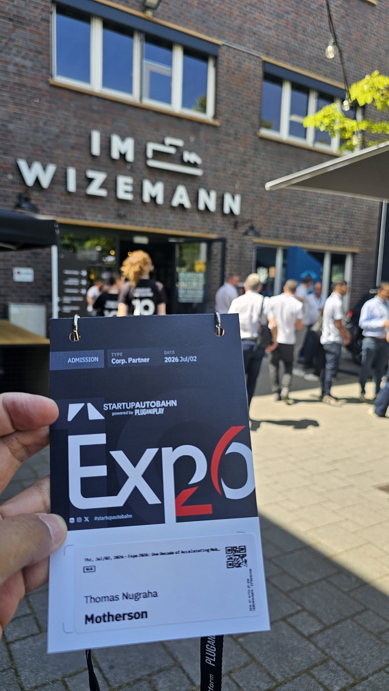
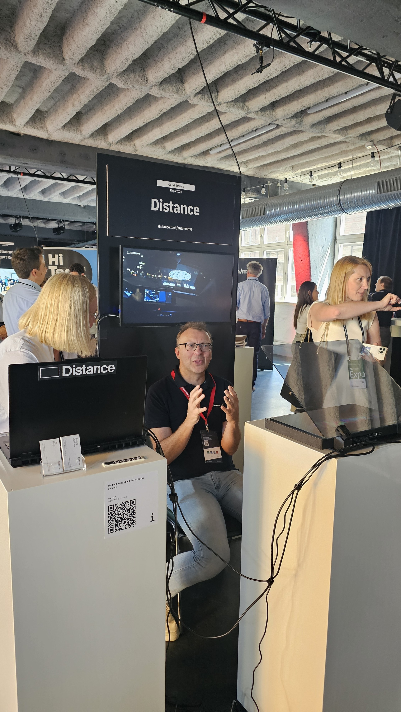

import ImageCarousel from '../../components/ImageCarousel.astro';

import PorscheGreen01 from '../../assets/blog/28/Hall_12.jpg';
import PorscheGreen02 from '../../assets/blog/28/Hall_01.jpg';
import PorscheGreen03 from '../../assets/blog/28/Hall_14.jpg';
import PorscheStrip01 from '../../assets/blog/28/Hall_03.jpg';
import PorscheStrip02 from '../../assets/blog/28/Hall_09.jpg';
import PorscheStrip03 from '../../assets/blog/28/Hall_10.jpg';
import AMGGTXX01 from '../../assets/blog/28/Hall_08.jpg';
import AMGGTXX02 from '../../assets/blog/28/Hall_05.jpg';
import AMGGTXX03 from '../../assets/blog/28/Hall_13.jpg';
import TOGG01 from '../../assets/blog/28/TOGG_Interior_01.jpg';
import TOGG02 from '../../assets/blog/28/TOGG_Interior_03.jpg';
import TOGG03 from '../../assets/blog/28/TOGG_front_04.jpg';
import TOGG04 from '../../assets/blog/28/TOGG_rear_02.jpg';
import Eink01 from '../../assets/blog/28/Eink-04.jpg';
import Eink02 from '../../assets/blog/28/Eink-05.jpg';
import Eink03 from '../../assets/blog/28/Eink-01.jpg';

Moko lagi duduk di pojok meja, ngetat matanya ke layar laptop yang lagi saya pakai buat nulis draft ini. Dia nggak ngerti apa isinya, tapi dia paham satu hal, kalau ada yang menyala, itu layak diperhatikan. Saya malah kepikiran sebaliknya. Di expo kemarin, pertanyaan yang nongol di kepala saya justru: perlukah semua yang menyala itu ada?

Minggu lalu saya pergi ke Wizemann, Stuttgart, di tengah kerumunan sekitar 1.500 orang, para eksekutif OEM, supplier, investor, dan founder startup. Startup Autobahn Expo 2026 ini spesial, karena dia merayakan ulang tahun ke-10 sejak platform ini didirikan pada 2016 bersama Plug and Play. Sepuluh tahun lamanya mereka jadi semacam mak comblang antara startup teknologi dengan perusahaan raksasa otomotif. Di atas kertas itu terdengar klise, tapi di lapangan efeknya nyata, banyak proyek kolaborasi yang lahir dari pertemuan semacam ini.

Contohnya gini, kalau anda pernah ke pameran otomotif biasa, yang dipamerkan hampir selalu mobil. Di sini beda, mobil emang ada, tapi dia lebih berperan sebagai etalase, sebagai alat untuk menunjukkan teknologi di baliknya. Dan tahun ini, setelah keliling hall, saya sadar ada satu hint yang mengganggu pikiran saya sebagai orang display: kita sedang di fase di mana pertanyaan bukan lagi "berapa banyak dan besar layar yang bisa kita pasang", melainkan "perlukah kita pasang layar sama sekali?"

Tulisan ini adalah bagian pertama dari dua seri. Di sini kita fokus ke sisi display dan HMI, bagian yang paling dekat dengan dunia saya. Bagian kedua akan kita lewatkan ke robot dan pabrik yang mulai bisa memprogram dirinya sendiri.

## Mobil-mobil "seksi" di hall, dan kenapa mereka bukan ceritanya

Sebelum masuk ke hal berat, saya harus akui, hall-nya memang pameran visual yang menggoda.

Ada Porsche berwarna hijau yang di-tune abis-abisan, menempel di atasnya pelek (rim) yang harganya bisa beli satu unit mobil kecil kali. Orang berbondong-bondong memotretnya, dan jujur saya pun ikut terkesan. Di sudut lain ada Porsche yang sengaja "dibongkar" sampai hampir telanjang, tidak untuk pameran estetika, tapi untuk eksperimen tenaga mesin. Ini bukan mobil jalanan, ini adalah makhluk laboratorium yang dibiarkan kelihatan agar orang paham seberapa jauh batas yang sedang diuji.

<ImageCarousel
  images={[
    { src: PorscheGreen01, alt: 'Porsche di modif' },
    { src: PorscheGreen02, alt: 'Porsche di modif' },
    { src: PorscheGreen03, alt: 'Porsche di modif' },
  ]}
/> 
Porsche di modif abizz

<ImageCarousel
  images={[
    { src: PorscheStrip01, alt: 'Porsche buat experimen' },
    { src: PorscheStrip02, alt: 'Porsche buat experimen' },
    { src: PorscheStrip03, alt: 'Porsche buat experimen' },
  ]}
/>  
Porsche untuk eksperimen mesinnya

Lalu Mercedes yang membawa AMG GT XX, mobil konsep yang beberapa waktu lalu mencatatkan rekor dunia: menempuh 5.479 kilometer dalam 24 jam di lintasan Nardo, Italia. Angka itu bukan sekadar angka marketing, dia setara dengan lebih dari empat kali jarak Jakarta ke Surabaya, ditempuh dalam sehari tanpa berhenti. Mercedes menyebutnya sebagai salah satu dari 25 rekor yang mereka catatkan, bagian dari ambisi "keliling dunia dalam delapan hari". Bagi saya sebagai engineer, ini adalah demonstrasi bahwa arsitektur powertrain listrik mereka sudah melampaui fase eksperimen.

<ImageCarousel
  images={[
    { src: AMGGTXX01, alt: 'AMG GT XX' },
    { src: AMGGTXX02, alt: 'AMG GT XX' },
    { src: AMGGTXX03, alt: 'AMG GT XX' },
  ]}
/> 

AMG GT XX, yang memecah 25 rekor dunia... cetnya keliatan udah capek

Dan ada TOGG, produsen mobil listrik pertama asal Turki, yang membawa T10X dalam wujud produksi massal. Mobil ini menarik karena dia bukan sekadar "mobil listrik dari negara yang baru main", tapi punya platform skateboard EV yang dikembangkan sendiri, bukan beli jadi. Untuk sebuah negara yang baru masuk ke industri otomotif modern, itu pencapaian yang patut dihormati.

Tapi di sinilah letak ironinya. Di balik semua kemegahan itu, ada satu hal yang membuat saya, seorang ahli display, geleng-geleng pelan.

## TOGG, dan ilusi bahwa lebih banyak layar berarti lebih canggih

TOGG T10X punya tiga layar solid yang menempel di dashboard: satu kluster digital 12,3 inci di depan pengemudi, satu layar sentuh lebar 29 inci yang membentang di tengah, dan satu layar 8 inci di bawahnya untuk kontrol HVAC dan fungsi lain. Belum lagi opsi head-up display di atas kaca depan. Jika kita hitung HUD itu, praktis kita bicara empat permukaan tampilan di satu kabin.

<ImageCarousel
  images={[
    { src: TOGG01, alt: 'TOGG T10X interior' },
    { src: TOGG02, alt: 'TOGG T10X interior' },
    { src: TOGG03, alt: 'TOGG T10X muka' },
    { src: TOGG04, alt: 'TOGG T10X ekor' },

  ]}
/> 

TOGG dari Turki juga nunjukin mobilnya

TOGG memanggil filosofi kabinnya sebagai "third living space", ruang hidup ketiga, setelah rumah dan kantor. Niatnya mulia, mereka ingin kabin mobil jadi tempat yang nyaman, tempat Anda betah berada. Tapi sebagai orang yang menghabiskan belasan tahun memikirkan bagaimana manusia berinteraksi dengan display, dan segala macam HMI, saya punya perasaan campur aduk.

Bayangkan Anda masuk ke ruang tamu yang setiap dindingnya dipasangi televisi. Secara teknis, informasi ada di mana-mana. Secara manusiawi, Anda justru merasa nggak tenang. Itulah yang saya rasakan melihat T10X. Tiga layar lebar yang menyatu menjadi satu dinding kaca raksasa di depan pengemudi menciptakan kesan "maximalis", semua ingin ditampilkan, tapi jadi kekurangan estetis, nggak kelihatan elegan.

Ini bukan soal spesifikasi. Layar 29 inci itu keren, gede, responsif, dan punya resolusi yang memadai. Masalahnya adalah komposisi. Waktu semua permukaan dipenuhi cahaya sendiri, mata orang nggak punya tempat istirahat. Dalam terminologi HMI, kita menyebut ini "visual noise". Perumpamaan yang pas buat kondisi ini, layar yang menumpuk itu kayak notifikasi di HP yang nggak pernah dimatikan, terus kita bingung yang mana yang penting. Otak terus-terusan menerima sinyal bahwa ada yang butuh perhatian, padahal yang dibutuhkan pengemudi dan penumpang justru adalah ketenangan supaya fokus tetap di jalan.

Saya pernah menulis tentang perang OLED di supercar, Ferrari Luce dan Lamborghini Urus SE, dan di sana pun saya tunjukkan bahwa layar bukan sekadar ukuran, tapi bagaimana dia diintegrasikan ke struktur kabin supaya terasa sebagai satu kesatuan, bukan tempelan. TOGG jujur masih berada di fase "kita pasang sebanyak mungkin karena bisa". Itu wajar untuk pemain baru, tapi saya berharap iterasi berikutnya mulai belajar pada restraint, pada seni menahan diri.

Dan anehnya, jawaban atas kegelisahan saya justru ada di hall lain di event yang sama.

## Distance Technologies: mitos lentikular, dan kebenaran light field

Ketika pertama kali mendengar ada startup yang menawarkan "HUD 3D dengan lensa lentikular", jujur saya agak skeptis. Lensa lentikular itu teknik lama, prinsipnya membagi piksel layar menjadi beberapa posisi pandang, biasanya sekitar empat arah, supaya mata kiri dan kanan melihat gambar berbeda dan timbul kesan kedalaman. Masalahnya sudah diketahui lama: karena piksel dibagi-bagi, resolusi visual per mata ikut turun drastis. Layar jadi terasa nggak tajam. Bagi saya, itu bukan solusi, itu kompromi yang mahal.

Tapi setelah saya berdiri di depan demo Distance Technologies, asumsi saya runtuh. Yang mereka bangun bukan lentikular sederhana, melainkan light field berbasis waveguide, teknologi yang jauh lebih berat secara ilmiah.

Coba kita bedah sebentar. Light field pada dasarnya adalah cara merekonstruksi cahaya seolah-olah dia berasal dari titik kedalaman yang berbeda-beda, bukan sekadar proyeksi datar yang ditaruh di satu jarak. Distance menggunakan pelat waveguide, mirip dengan visor yang bisa dilipat turun di depan kaca mobil Anda. Tim mereka bukan sembarang orang, founder-nya berasal dari Varjo, perusahaan yang dikenal dengan headset VR presisi tinggi. Jadi ketika mereka bilang "kita bangun optik komputasional", itu bukan gimmick, itu pedigree yang nyata. Mereka bahkan sudah dipakai oleh Kia untuk konsep Vision Meta Turismo, dan didukung oleh GV, lengan investasi Google.

Nah, bagian yang bikin saya terpaku adalah pengalaman pertama kali melihatnya. Selama bertahun-tahun, keluhan saya terhadap display 2D di mobil selalu sama: ada jurang di otak. Mata kita berfokus ke layar yang jaraknya tetap, tapi gambar virtual yang ditampilkan kadang memaksa kita mempersepsikan jarak yang lain, lebih dekat atau lebih jauh dari layar itu. Otak dan mata jadi tidak sepakat. Itulah sebabnya HUD konvensional sering membuat mata lelah, karena ada ketegangan terus-menerus antara fokus mata dan jarak virtual.

Saat saya lihat demo Distance, untuk pertama kalinya otak saya "percaya" bahwa gambar itu benar-benar berada jauh di depan, di jarak yang wajar, bukan menempel di kaca. Tidak ada sensasi paksa. Mata saya rileks seolah-olah objek itu memang berada di jalan, bukan di panel. Itu sensasi yang sulit dijelaskan, tambah lagi, ketika objek virtual itu dibawa ke dekat mata, otak dan mata saya percaya bahwa itu objek benar-benar lebih dekat.

Tapi saya nggak akan tutup mata pada kelemahan nyata. Masalah terbesarnya adalah kecerahan (brightness). Waveguide itu secara optik tidak efisien, sebagian besar cahaya hilang dalam proses pembiasan di pelat. Demo yang saya lihat cukup terang untuk ruangan indoor, tapi untuk pemakaian nyata di siang hari, itu belum cukup.

Coba kita pakai angka supaya jelas. Untuk terbaca di bawah sinar matahari langsung, sebuah HUD di kaca depan butuh kecerahan di kisaran 10.000 hingga 15.000 candela/m2, bahkan lebih untuk kondisi sangat terik. Sistem waveguide saat ini baru sanggup menghasilkan sebagian kecil dari itu karena efisiensi pelatnya hanya beberapa persen. Jadi secara jujur, teknologi Distance sudah benar secara prinsip optik, tapi dia masih terjebak di gap antara "demo yang menakjubkan di ruangan" dan "alat yang bisa dipakai di jalan raya setiap hari". Itu jarak yang harus mereka tempuh, dan saya percaya mereka akan sampai, tapi belum hari ini.

Yang membuat saya antusias justru arah kemana implementasi HMI ini akan pergi. TOGG menumpuk layar, Distance justru ingin menghilangkannya dengan HUD yang baik. Informasi tidak lagi dipaksa keluar lewat panel kaca raksasa, tapi direkonstruksi di ruang nyata lewat cahaya. Layar jadi tidak kelihatan, karena dia bukan benda lagi, dia menjadi bagian dari dunia. Akhirnya kita akan butuh dua-duanya, layar yang cukup dan estetis, juga HUD yang kontennya nggak mengganggu driver.

## E Ink dan trial injection molded: saat teknologi elektronik menyatu dengan permukaan

Masih soal "menghilangkan layar", ada satu demo yang bagi saya adalah bintang sesungguhnya di expo ini, dan dia menyambung langsung dengan apa yang saya tulis bulan lalu tentang COMPUTEX 2026.

Waktu itu di COMPUTEX, E Ink menunjukkan speaker portabel yang bagian luarnya bisa mengubah pola warna berkat teknik thermoforming pada bentuk kompleks. Kita bicara tentang menekuk dan membentuk material elektronik menjadi permukaan 3D. Tapi di Startup Autobahn kali ini, mereka menunjukkan langkah berikutnya yang jauh lebih berat: trial injection molded E Ink.

Kenapa ini besar? Karena dia menyentuh cara manufaktur itu sendiri. Yang kita bahas di sini adalah In-Mold Electronics, atau IME. Normalnya prosesnya punya empat tahap. Pertama, tinta konduktif dan tinta grafis dicetak di atas film plastik datar. Kedua, komponen seperti LED dan resistor ditaruh di atas film itu masih dalam keadaan datar. Ketiga, film itu dipanaskan dan dibentuk (thermoforming) menjadi struktur 3D. Dan keempat, bagian yang sudah berbentuk itu dimasukkan ke dalam cetakan injeksi, lalu dilapisi resin plastik di belakangnya, menjadikannya satu komponen padat yang kaku.

<ImageCarousel
  images={[
    { src: Eink01, alt: 'Eink:injection molded' },
    { src: Eink02, alt: 'Eink:injection molded' },
    { src: Eink03, alt: 'EinkBooth' },

  ]}
/>

Eink bawa inovasi baru lagi !!

Trial injection molded yang saya lihat di expo ini adalah tahap keempat, dan dia adalah titik balik. Thermoforming saja sudah susah, tapi injection molding adalah level manufaktur otomotif yang sebenarnya, level di mana komponen harus tahan suhu, tahan benturan, dan bisa diproduksi jutaan unit dengan yield tinggi. Jika E Ink bisa bertahan melewati proses injeksi itu dan tetap berfungsi, berarti kita sedang melihat trial pertama di dunianya untuk menghasilkan bagian belakang smartphone, atau casing, yang punya permukaan berubah warna secara massal.

Bayangkan implementasinya di masa depan. Selama ini layar itu seperti lukisan yang digantung terpisah di dinding. IME mengubahnya menjadi lukisan yang justru merupakan dinding itu sendiri. Perumpamaan lain yang lebih sederhana, bayangkan wallpaper yang bisa berubah motif sendiri tanpa perlu diganti, itu intinya. Permukaan mobil, panel pintu, atau casing ponsel tidak lagi sekadar tempat menempelkan layar, tapi dia sendiri yang menjadi layarnya.

Angka dari riset industri mendukung betapa efisiennya pendekatan ini. IME diklaim mampu memangkas bobot komponen hingga 70 persen, mengurangi pemakaian bahan baku sekitar 30 persen, dan memotong waktu perakitan. Itu bukan cuma keren secara teknis, itu masuk akal secara bisnis, dan itulah sebabnya pabrikan mulai serius. Ya, yield produksi dan proses untuk daur ulang masih terlalu kompleks untuk IME, tapi arahannya sudah kelihatan.

Saya tulis di blog COMPUTEX bahwa E Ink Prism sudah mulai masuk ke kendaraan produksi, seperti BMW iX3 Flow Edition. Trial injection molded ini adalah pijakan selanjutnya yang membuat teknologi itu bukan sekadar aksen, tapi struktur. Smartphone atau casing ponsel yang bisa berganti warna sesuai suasana hati, itu bukan fiksi lagi, itu horison yang sudah mulai kelihatan ujungnya.

 <video src="/videos/SA_Eink.mp4" width="600" controls>
  Your browser does not support the video tag.
</video> 

<em>Kolaborasi Eink dan HUF, nunjukin door handle yang berubah warna</em>

 <video src="/videos/SA_Eink-02.mp4" width="600" controls>
  Your browser does not support the video tag.
</video> 

<em>Eink nunjukin flexible material yang berubah warna dan juga prototype lain dari portable speakernya</em>

## Penutup bagian pertama, dan apa yang menyusul

Jadi kalau kita rangkum apa yang saya pelajari di Startup Autobahn Expo 2026 dari sisi display, benang merahnya cukup jelas. TOGG menunjukkan ke arah mana kita mungkin salah melangkah, menumpuk layar sampai kabin jadi dinding kaca. Distance menunjukkan ke arah mana optik komputasional bisa membawa kita, layar yang hilang dan informasi yang lahir di ruang nyata, asalkan mereka bisa menyelesaikan soal kecerahan. Dan E Ink lewat IME menunjukkan masa depan di mana layar bukan lagi benda yang dipasang, melainkan permukaan itu sendiri yang hidup.

Perumpamaannya simpel. Kita sedang bertransisi dari "memberi mobil lebih banyak layar" menjadi "memberi mobil layar yang lebih pintar, lalu perlahan menghilangkannya". Itu adalah arah yang menurut saya jauh lebih indah secara desain dan jauh lebih manusiawi.

Tapi expo ini tidak cuma soal layar. Di sudut lain, saya melihat robot yang bisa mendengar kebocoran pipa, pabrik yang bisa memprogram ulang jalur perakitannya sendiri, dan armada mesin yang mulai menggantikan manusia bukan karena lebih cepat, tapi karena mereka bisa masuk ke tempat yang tidak bisa kita jangkau. Itu cerita bagian kedua, dan dia sama menariknya.

Lanjut ke bagian kedua: [Startup Autobahn Expo 2026 (2/2): Lewat Layar, ke Robot dan Pabrik yang Bisa Memprogram Dirinya](../../blog/blog28_startup_autobahn_expo_2026_part2/).

Komen aja di bawah, menurut kalian kabin mobil ideal itu sebanyak apa layarnya, atau malah sebisa mungkin tanpa layar?
