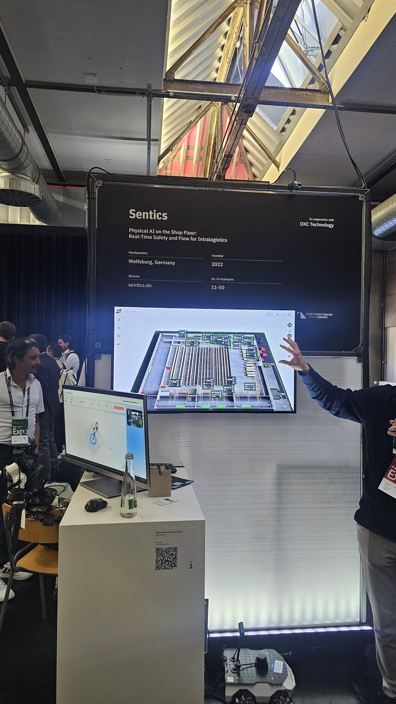
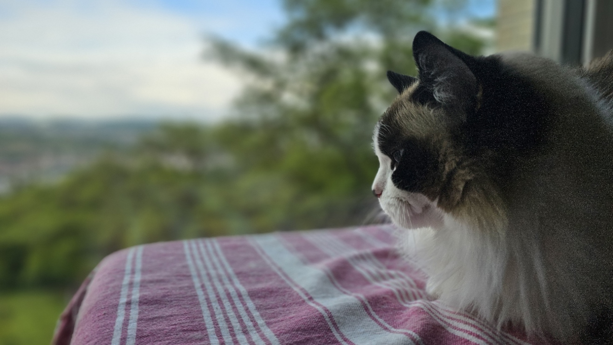

import ImageCarousel from '../../components/ImageCarousel.astro';

import Flexion01 from '../../assets/blog/28/Flexion_Robotics3.jpg';
import Flexion02 from '../../assets/blog/28/Flexion_Robotics2.jpg';
import Flexion03 from '../../assets/blog/28/Flexion_Robotics.jpg';

Di bagian pertama, kita habiskan waktu di depan layar, membahas kenapa TOGG mungkin menumpuk terlalu banyak, kenapa Distance mencoba menghilangkannya lewat light field, dan kenapa trial injection molded E Ink bisa jadi titik balik. Tapi jujur, saat saya keliling hall Startup Autobahn Expo 2026, bagian yang paling membuat saya berhenti lama bukanlah sebuah panel. Itu adalah sesuatu yang bergerak.

Perumpamaannya kayak gini. Kalau bagian pertama adalah soal "bagaimana kita melihat dunia", bagian kedua ini adalah soal "siapa yang bekerja di dalamnya". Dan jawabannya mulai bergeser, pelan tapi pasti, dari manusia ke mesin.

## Robot anjing yang bisa mendengar

Saya berdiri agak lama di stan Boston Dynamics. Spot, anjing robot itu, sudah tidak asing lagi bagi kebanyakan orang yang mengikuti robotics. Tapi apa yang ditunjukkan di expo ini bukan sekadar Spot jalan-jalan. Mereka menunjukkan kemampuan akuistik, sebuah sistem pemindaian suara yang dipasangkan di punggung robot.

 <video src="/videos/SA_Boston_Dynamics.mp4" width="600" controls>
  Your browser does not support the video tag.
</video> 

<em>Anjing barunya Boston Dynamics, katanya udah di pakai di beberapa perusahaan</em>

Cara kerjanya begini. Di punggung Spot terpasang imager akuistik, dalam kasus ini alat Fluke SV600, yang menangkap pola suara di sekitarnya. Mesin lalu memroses sinyal itu dan mencari anomali, misalnya desis halus dari kebocoran udara bertekanan atau perubahan nada pada bantalan yang berputar. Bagi saya sebagai engineer, poin terpenting bukan pada robotnya, tapi pada jenis indra yang dipakai. Selama bertahun-tahun, inspeksi pabrik bertumpu pada kamera, pada cahaya. Di sini, mereka menambah pendengaran.

Itu relevan karena banyak kegagalan mesin dimulai dari suara yang tidak kedengaran oleh manusia sampai terlambat. Kompresor yang mulai bocor, bantalan yang aus, semuanya punya "suara tanduk" sebelum jadi rusak berat. Spot bisa keliling tiap malam, mendengar apa yang tidak sempat didengar teknisi, dan menandai titik yang butuh perhatian. Boston Dynamics melaporkan bahwa pengguna mereka biasanya balik modal dalam sekitar dua tahun, bahkan ada yang di bawah satu tahun, karena kerugian akibat henti operasi mendadak bisa dicegah lebih awal.

Yang membuat saya senang secara pribadi adalah arah filosofinya. Robot tidak disuruh menggantikan manusia di tugas yang manusia kerjakan dengan baik. Dia disuruh ke tempat yang membosankan, berulang, dan berisiko, lalu pulang dengan laporan suara. Itu bukan penggantian, itu pelengkap.

## Pabrik yang bisa menyusun ulang dirinya sendiri

Masih soal kerja, tapi kali ini di level yang lebih besar. Bosch membawa apa yang mereka sebut software-defined manufacturing, pabrik yang didefinisikan oleh perangkat lunak.

Konsepnya menarik bila kita bedah. Bayangkan sebuah produk tidak lagi dirakit di jalur yang tetap. Sebaliknya, proses perakitan dipecah menjadi "kemampuan" kecil-kecil, yang masing-masing disediakan oleh modul yang mereka panggil mechatronic object. Modul-modul ini lalu disusun dan diatur sedemikian rupa sehingga bisa merakit produk yang berbeda. Kalau satu produk butuh langkah A, C, dan E, jalur itu yang terbentuk. Kalau produk lain butuh A, B, dan D, jalur akan menyusun dirinya sendiri tanpa pabrik harus dibongkar.

 <video src="/videos/SA_Bosch.mp4" width="600" controls>
  Your browser does not support the video tag.
</video> 

<em>Bosch : Software Defined Manufacturing</em>

Ini seperti kereta api mainan, tapi keretanya bukan sekadar jalan lurus. Perumpamaan yang lebih akrab, pabrik software-defined ini kayak resep masak yang bisa diacak urutan langkahnya tanpa merusak rasa akhir. Setiap "bak" kecil bisa berhenti di stasiun yang relevan, melewati stasiun yang tidak diperlukan, dan lanjut ke stasiun berikutnya. Untuk produk yang punya banyak varian SKU, di mana tiap unit mungkin butuh atau tidak butuh langkah perakitan tertentu, pendekatan ini mengubah apa yang tadinya butuh perombakan fisik menjadi sekadar perubahan konfigurasi perangkat lunak.

Bosch tidak bergerak sendiri di sini. Mereka memimpin proyek SDM4FZI bersama Universitas Stuttgart dan Karlsruhe Institute of Technology, dengan tiga puluh perusahaan yang mendefinisikan fondasi manufaktur yang didefinisikan perangkat lunak. Uniknya teknologi ini juga, karena robotnya kecil dan jalan di track khusus di atas meja, robot ini nggak perlu sensor-sensor mahal untuk safety, jadi mereka bisa menawarkan solusi produk ini dengan harga yang harusnya kompeten.

Sebagai orang yang melihat manufaktur consumer electronics dan otomotif, saya tahu betapa mahal dan lambatnya mengganti jalur perakitan tiap kali produk berganti varian. Visi Bosch ini, kalau tercapai, mengubah pabrik dari "bangunan yang kaku" menjadi "perangkat lunak yang berwujud fisik". Itu adalah lompatan yang jauh lebih dalam dari sekadar menambah robot ke lini yang ada.

## Kembaran digital yang menjaga manusia tetap aman

Ada satu startup, Sentics, yang menurut saya mewakili arah yang paling manusiawi dari semua yang saya lihat. Mereka membangun platform digital twin, kembaran digital, untuk lantai pabrik secara waktu nyata.

Cara kerjanya: sistem memetakan pergerakan fork lift, manusia, dan mesin bergerak lainnya di satu lantai pabrik, lalu mengawasinya terus-menerus supaya kecelakaan kerja bisa dicegah. Yang lebih menarik, kamera cerdas mereka bisa memperbesar tampilan untuk membaca barcode dan mengenali produk apa yang sedang berada di titik tersebut.

Sentics: platform digital twin lantai pabrik untuk keselamatan kerja

Bagi saya, ini adalah contoh di mana teknologi berkumpul di tempat yang tepat. Kamera sudah menjadi murah luar biasa dalam beberapa tahun terakhir, komputasi tepi sudah cukup kuat, dan kebutuhan akan keselamatan lantai pabrik tidak pernah hilang. Ketika ketiganya bertemu, kita mendapatkan sistem yang dulunya hanya ada di ruang rancang, kini jadi alat praktis yang bisa dipasang tanpa merombak pabrik.

Dulu kita menaruh manusia di pos pemantau supaya dia melihat siapa yang melanggar jalur. Perumpamaan terakhir, kembaran digital itu kayak CCTV yang nggak cuma rekam, tapi ikut ingetin kalau ada yang bahaya. Sekarang, kembaran digital itu yang berjaga 24 jam, dan manusia yang bisa fokus pada pekerjaan yang butuh penilaian, bukan sekadar pengawasan.

## Robot yang belum menggantikan kita, tapi sudah mulai masuk ke tempat yang tidak bisa kita jangkau

 <video src="/videos/SA_Flexion_Robotics.mp4" width="600" controls>
  Your browser does not support the video tag.
</video> 

<em>Flexion Robotics in action</em>

Ada bagian yang agak membuat saya tersenyum tipis. Beberapa startup robotics di expo menunjukkan robot humanoid yang bisa bermanuver melewati rintangan. Flexion, misalnya, startup asal Zurich yang didirikan oleh mantan peneliti NVIDIA, memperlihatkan tumpuan otonomi bernama Reflect v1.0. Salah satu co-founder-nya, Marco Hutter, adalah profesor di ETH Zurich, dan timnya banyak menyerap alumni lab robotika sana. Di ICRA 2026 di Wina, mereka menjalankan 300 demonstrasi otonom langsung selama tiga hari, dengan misi seperti menaiki tangga, mengambil kotak dari lantai, dan menaruhnya di meja. Tingkat keberhasilan misi mereka lompat dari sekitar 38 persen ke 90 persen setelah pelatihan penguatan.

<ImageCarousel
  images={[
    { src: Flexion01, alt: 'Robot yang di pake Flexion' },
    { src: Flexion02, alt: 'Robot yang di pake Flexion' },
    { src: Flexion03, alt: 'Flexion Booth' },
  ]}
/> 
Demonya Flexion Robotics

Duatic, spin-off lain dari ETH Zurich, menunjukkan Alpha, robot yang mendeteksi, mendekat, dan mencengkeram karung seberat 20 kilogram memakai sistem penglihatan dan dua lengan DynaArm.

 <video src="/videos/SA_Duatic_robotics.mp4" width="600" controls>
  Your browser does not support the video tag.
</video> 

<em>Flexion Robotics in action</em>

Dan ada robot keamanan otonom yang berpatroli di area tertentu, serta masih banyak lagi yang bergerak di sudut-sudut hall.

 <video src="/videos/SA_Security_Robotics.mp4" width="600" controls>
  Your browser does not support the video tag.
</video> 

<em>Security robotics... kayaknya masih belum bisa sih ngeganttin anjing galaknya satpam</em>

Tapi kalau boleh jujur, sebagai orang yang melihat lini perakitan nyata, robot-robot ini, dalam demonstrasi mereka, masih sangat lambat. Pekerja manusia bisa menyelesaikan tugas yang sama dalam sepersepuluh waktunya. Jadi bila kita ukur dari kecepatan murni, manusia masih menang telak. Robot belum menggantikan kita.

Tapi pertanyaannya bukan "apakah mereka lebih cepat". Pertanyaannya adalah "ke mana mereka bisa pergi". Ada tempat yang tidak bisa, dan tidak seharusnya, dijangkau manusia, karena berbahaya, karena beracun, karena sempit, atau karena sekadar terlalu membosankan untuk dikerjakan tiap hari tanpa cela. Di situlah nilai sebenarnya dari robot-robot yang masih terlihat kaku ini. Mereka bukan pengganti yang lebih baik, mereka adalah tangan yang bisa menggapai tempat yang kita hindari.

Kita tidak menyewa orang agar mau berdiri di dalam ruang beracun delapan jam sehari. Kita menyewa mesin untuk itu. Robotics tahap awal ini adalah jawaban atas pertanyaan "siapa yang sanggup berada di sana", bukan "siapa yang paling cepat".

## Penutup: dari layar yang menghilang, ke mesin yang hadir

Jika kita tarik benang merah dari dua bagian tulisan ini, ada satu narasi yang menurut saya indah.

Di bagian pertama, kita melihat layar mulai menghilang. TOGG menumpuknya, Distance menguapkannya lewat cahaya, dan E-Ink menyatukannya ke permukaan. Arahnya adalah ketenangan visual, informasi yang hadir tanpa memaksa.

Di bagian kedua ini, kita melihat kebalikannya. Mesin mulai hadir di tempat yang tadinya kosong dari teknologi cerdas. Anjing robot yang mendengar, pabrik yang menyusun diri sendiri, kembaran digital yang menjaga keselamatan, dan lengan yang meraih tempat berbahaya. Arahnya adalah kehadiran, pengawasan, dan kerja di titik yang manusia tidak bisa atau tidak patut jangkau.

Dua arah itu sebenarnya satu. Kita sedang memindahkan beban kognitif dan fisik dari manusia ke sistem, supaya manusia bisa kembali menjadi manusia, berpikir, memutuskan, dan menikmati perjalanan, betapapun bentuk kendaraan atau pabriknya kelak.

Startup Autobahn di usia ke-10 ini, bagi saya, bukan sekadar pameran. Dia adalah potret tengah jalan dari transisi itu. Dan saya senang bisa berdiri di sana, melihat ke arah mana kita sedang berjalan.

Kembali ke bagian pertama: [Startup Autobahn Expo 2026 (1/2): Saat Mobil Mulai Bertanya, Perlukah Layar?](../../blog/blog28_startup_autobahn_expo_2026_part1/).

Komen di bawah, kalau kalian punya robot di pabrik atau bengkel, apa yang paling kalian mau dibiarin dia kerjain sendiri, dan apa yang kalian tetap mau pegang sendiri?

Moko lagi mastiin dia bisa jadi security untuk ngejagain ngga ada kucing lain masuk ke wilayahnya
