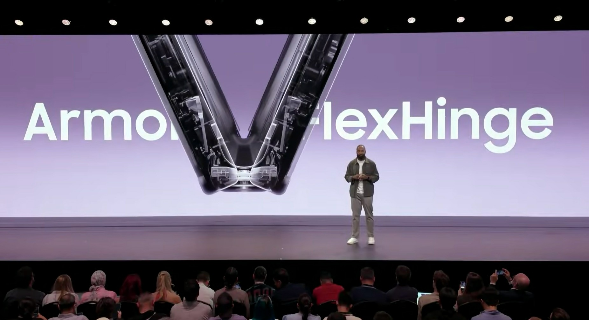
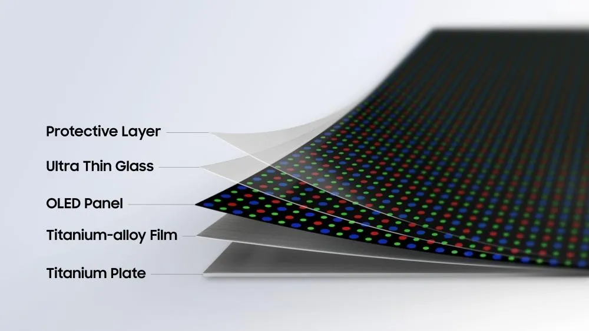
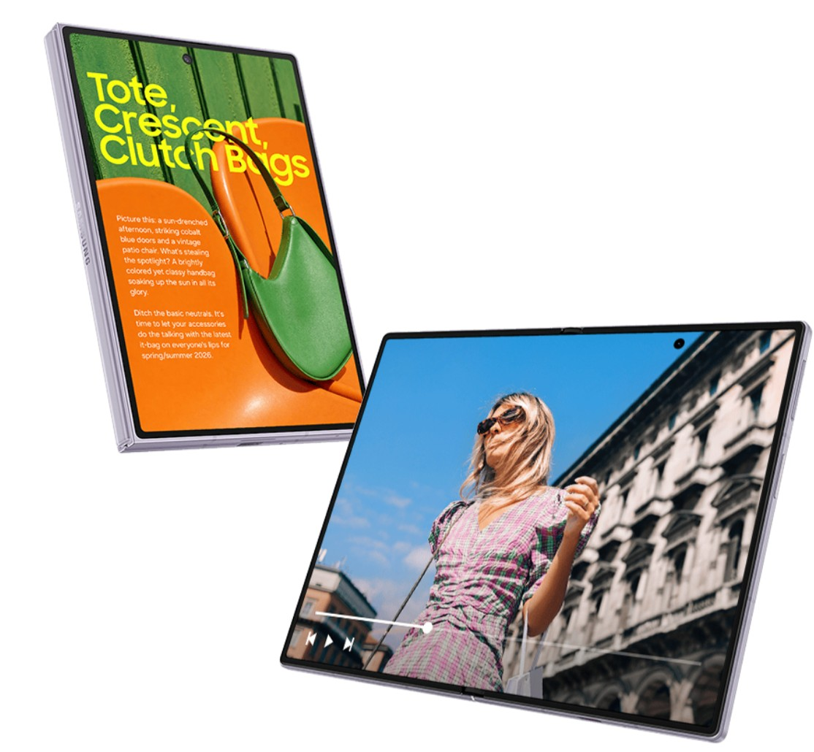
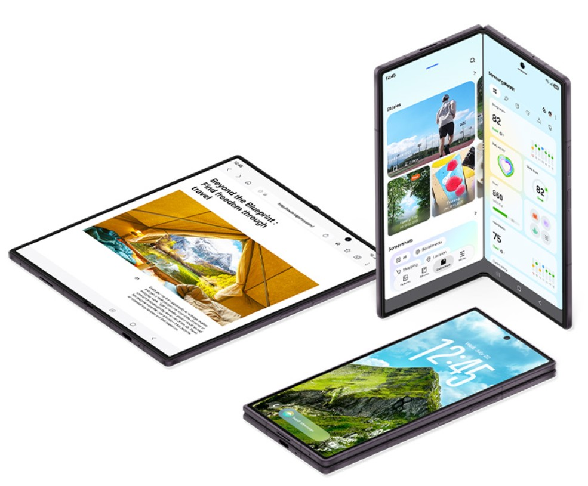
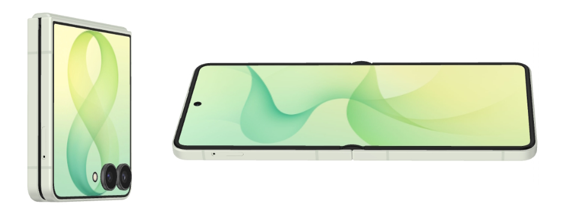
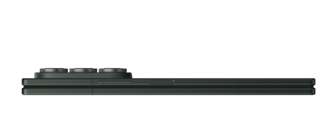
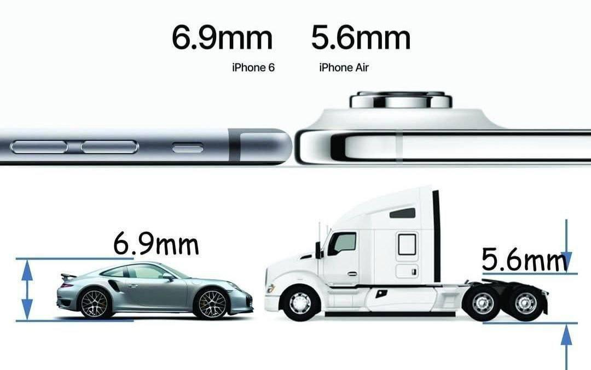

# Stack Layar Lipat Samsung Rubah Total

Stage Samsung Galaxy Unpacked 2026

 
Saya selalu nunggu-nunggu pengumuman Samsung. Mereka *de facto* pemimpin teknologi OLED di dunia, maaf Apple, bukan kamu. Dan saya bilang ini meskipun dulunya saya Sony Engineer.

Moko, si ragdoll, dari tadi telentang di meja kerja sambil ngeliatin layar laptop. Kayaknya dia tau saya lagi nulis sesuatu yang seru. Kebiasaan dia: kalau saya bahas soal layar, dia suka telentang dengan kaki terangkat kayak lagi test fleksibilitas panel OLED. Cocok banget jadi pembuka hari ini.

22 Juli 2026, Samsung gelar Galaxy Unpacked dan langsung ke inti masalah: bukan spesifikasi kamera atau RAM, tapi **struktur fisik layar lipat itu sendiri**.

Untuk pertama kalinya sejak mereka perkenalkan *ultra-thin glass* (UTG) di Galaxy Z Fold 2 tahun 2020, Samsung ganti seluruh lapisan penyangga di bawah panel OLED lipat. Mereka namain ini **Flex Titanium**.

Flex Titanium menjawab persis masalah crease yang kita bahas di [artikel HP lipat dan crease](https://t-agung.id/blog11_hp_lipat_crease_teknologi_gelas_ultra-tipis), plus isu panel Samsung M14 di vivo X Fold 6 ([Part 22](https://t-agung.id/blog22_vivo_x_fold_6_samsung_m14_review)).

---

## Apa Itu Flex Titanium?

Flex Titanium Architecture, Source : Samsung Display

Layar lipat sebelum Flex Titanium pakai **CFRP** (*carbon fiber reinforced polymer*) sebagai lapisan penyangga di bawah panel UTG. Karbon fiber yang sama kayak di mobil F1 sama body MacBook Pro. Tujuannya jelas: kaku, ringan, tahan panel OLED melengkung saat HP dibuka.

Tapi CFRP punya masalah yang udah kita bahas di [artikel HP lipat dan crease](https://t-agung.id/blog/blog_11_hp_lipat_crease/). Meskipun kaku, dia nggak cukup kaku buat sepenuhnya ilangin *air gap* (rongga udara) antar lapisan. Hasilnya? Di cahaya tertentu, Anda liat efek pelangi atau *halo* di sekitar area lipatan.

vivo X Fold 6 yang kita bahas [di sini](https://t-agung.id/blog/blog22_vivo_x_fold_6_teknologi_layar_lipat_2026/) udah kompromi masalah ini dengan panel Samsung M14 yang lebih tipis. Tapi fundamentalnya tetap sama: CFRP sebagai penyangga.

Samsung hari ini bilang: "Lupakan CFRP."

### Tiga Komponen Flex Titanium

Flex Titanium bukan satu lapisan, dia terdiri dari tiga lapisan baru:

**1. Titanium alloy film.** Ini pengganti CFRP. Lembaran tipis dari paduan titanium yang **20 kali lebih kaku dari polymer film lama**, dengan ketebalan kurang dari **0,005 mm**. Sekitar 30% dari ketebalan rambut manusia. Bayangkan sehelai rambut yang dipipihkan jadi sehalus kertas transfer, tapi dua puluh kali lebih kaku dari material penyangga yang dipakai selama ini.

**2. Micro-patterned titanium plate.** Di bawah titanium film, Samsung taruh pelat titanium berpori mikroskopis. Lubang-lubang kecil ini menghilangkan *air gap* antara modul display dan adhesive. Tanpa *air gap*, efek pelangi hilang. Layar terlihat rata sekeping kaca, bahkan di area lipatan.

**3. New optical adhesive.** Laminasi optik baru yang merekatkan seluruh lapisan lebih kuat. Bukan sekadar lem, ini formulasi yang didesain khusus: tetap fleksibel saat dilipat, tapi cukup kaku buat menahan lapisan agar nggak *delaminasi*.

### Apa Artinya?

Efeknya konkret:

- **Crease lebih dangkal**, bukan hilang total (fisika tetap berlaku), tapi jauh lebih sulit terlihat di pencahayaan normal
- **Nggak ada efek pelangi/halo** di area lipatan
- **Daya tahan lipat** 200.000 siklus (uji Samsung sendiri), plus sertifikasi MIL-STD-810H untuk ketahanan lingkungan (suhu, kelembaban, guncangan). Angka yang sama, tapi dengan struktur yang lebih rigid.
- **Lebih tipis saat dilipat**, titanium film lebih tipis dari layer CFRP sebelumnya

Ini evolusi nyata, bukan *marketing incremental*. Bayangin selama enam tahun industri layar lipat kayak bangun jembatan gantung: kabelnya kuat, tapi tengahannya masih goyang. Flex Titanium itu seperti nambah *stay cables* di titik-titik kritis. Struktur dasar sama, tapi rigiditasnya naik satu orde magnitudo.

---

## Z Fold 8: Layar 4:3 yang Bentuknya Paspor, Bukan HP

samsung Z Fold 8, Form factor baru yang kaya paspor, Source : Samsung.com 

Di samping inovasi Flex Titanium, Samsung ngumumin sesuatu yang nggak kita ekspektasi: **Galaxy Z Fold 8** dengan form factor baru.

Model ini langsung jadi Z Fold 8, format lebar 4:3. Dan buat varian tradisional gaya *book-style*, Samsung bikin **Z Fold 8 Ultra** yang lebih premium.

**Perbandingan Z Fold 8 vs Z Fold 8 Ultra:**

|             | Z Fold 8 (Wide) | Z Fold 8 Ultra |
| ----------- | --------------- | -------------- |
| Layar dalam | **7.6"**        | **8.0"**       |
| Layar luar  | **5.5"**        | **6.5"**       |
| Rasio       | **4:3**         | 19.9:15        |
| Resolusi    | **1828 x 2584** | 2232 x 2424 (belum dikonfirmasi)   |
| Prosesor    | Snapdragon 8 Elite Gen 5 for Galaxy | Snapdragon 8 Elite Gen 5 for Galaxy |
| Baterai     | **4800 mAh**    | **5000 mAh**   |
| Bobot       | **201g**        | **215g**       |
| Harga       | **$1,899**      | **$2,099**     |

Rasio 4:3. Bentuk paspor. Bukan HP yang dilipat, tapi tablet yang bisa dilipat.

Kenapa rasio ini penting? Dari sisi pengalaman saya di Motherson mengerjakan HMI, rasio 4:3 adalah standar dokumen, spreadsheet, dan *content consumption*. Layar 16:9 atau 19.9:15 dipotong jadi dua, dan setiap sisinya tetap *sempit*. 4:3 saat dibuka terasa kayak nge-hold dokumen A6 yang benar-benar bisa dipakai.

Untuk profesional yang baca dokumen, nulis email, atau kerjain spreadsheet di HP lipat, ini form factor yang masuk akal.

## Z Fold 8 Ultra: Book-Style yang Benar-Benar "HP Besar"

Samsung Z Fold 8 Ultra, layar luar 6.5 inci hampir kayak HP normal, Source: Samsung.com

Kalau Z Fold 8 Wide adalah eksperimen form factor, Z Fold 8 Ultra buat yang butuh layar lebih besar. Ultra punya identitas yang berbeda.

Yang paling nyata: layar luar 6.5 inci. Z Fold 8 biasa cuma 5.5 inci. Selisih 1 inci di layar luar itu besar. Di Ultra, kamu bisa kerja full dengan layar luar yang hampir sama proporsinya dengan HP flagship normal. Buka email, balas WhatsApp, scroll Instagram, semuanya nyaman di satu tangan.

Layar dalam Ultra juga lebih besar (8.0 inci) dengan resolusi yang lebih tinggi di sumbu horizontal (2232 vs 1848 piksel). Kalau Wide cocok untuk dokumen vertikal, Ultra lebih fleksibel: multitasking, video editing, baca web yang lebih lebar.

Pertanyaannya: apakah premium $200 itu worth it?

Kalau kamu lebih sering pakai layar luar, Ultra jelas lebih masuk akal. Layar 6.5 inci bikin HP lipat terasa kayak HP biasa yang bisa dibuka jadi tablet. Tapi kalau kamu lebih tertarik dengan form factor 4:3 yang unik dan harga yang lebih ringan di kantong, Z Fold 8 Wide sudah cukup.

Saya pribadi? Layar luar 6.5 inci mengubah cara pakai HP lipat secara fundamental. Selama ini HP lipat selalu punya masalah: layar luar terlalu kecil buat kerja. Ultra ngejawab itu.

---

## Z Flip 8: Lebih Tipis, Tapi Masih Lipat

Samsung Z Flip 8, dari 3 bersaudara, ini yang paling langsing, Source : Samsung.com 

Z Flip 8 **nggak dapat Flex Titanium**. Ketipisan 0.4 mm berasal dari **baterai silicon-carbon** yang lebih efisien. Tapi hasilnya tetap terasa: **0.4 mm lebih tipis** dari Z Flip 7 (6.1mm vs 6.5mm), dan **8 gram lebih ringan** (180g vs 188g).

**Spesifikasi Z Flip 8:**

| Spesifikasi       | Detail                                               |
| ----------------- | ---------------------------------------------------- |
| Layar utama       | **6.9"**, 2520 x 1080 |
| Layar cover       | **4.1"** (1048 x 948px)                              |
| Prosesor          | **Exynos 2600** (Snapdragon 8 Elite Gen5 di US saja) |
| Bobot             | **180g**                                             |
| Ketebalan dilipat | **13.1 mm**                                          |

Layar cover lompat jadi 4.1" (naik dari 3.4" pada Z Flip 7), tapi Samsung kasih software upgrade: sekarang Anda bisa buka notifikasi, balas pesan singkat, bahkan navigasi dasar tanpa buka HP. Layar utama lompat jadi 6.9 inci, lebih lebar dari Z Flip 7 yang 6.7 inci.

---

## Harga: Estimasi Pasar Indonesia

Samsung belum ngumumin harga untuk pasar Indonesia. Saya hitung sendiri berdasarkan harga global dan sejarah Galaxy di Indonesia.

### Harga Global (Diumumkan)

| Model           | Harga USD | Harga EUR (Estimasi) |
| --------------- | --------- | -------------------- |
| Z Flip 8        | $1.199    | €1.199               |
| Z Fold 8        | $1,899    | €1,999               |
| Z Fold 8 Ultra  | $2,099    | €2,199               |

### Sejarah Harga Galaxy di Indonesia

Galaxy seri Fold dan Flip di Indonesia biasanya diberi premium sekitar 35-45% di atas harga USD, tergantung tarif impor, PPN, dan margin distributor:

- **Z Fold 6 (2024):** $1.899 → Rp 32,99 juta (premium ~45%)
- **Z Fold 7 (2025):** $1.999 → Rp 30,99 juta (premium ~45%)
- **Z Flip 6 (2024):** $1.199 → Rp 19,99 juta (premium ~42%)
- **Z Flip 7 (2025):** $1.099 → Rp 18,99 juta (premium ~43%)

### Estimasi Harga Indonesia 2026

Berdasarkan pola di atas dan kurs Rp 16.000 per USD (estimasi saat ini):

| Model           | Harga USD | Estimasi IDR      | Catatan                             |
| --------------- | --------- | ----------------- | ----------------------------------- |
| Z Flip 8        | $1.199    | **Rp 20-21 juta** | Konsisten dengan Z Flip 7 + inflasi |
| Z Fold 8 (Wide) | $1.899    | **Rp 32-34 juta** | Sama dengan Z Fold 6                |
| Z Fold 8 Ultra  | $2.099    | **Rp 36-38 juta** | Model baru, premium tertinggi       |

**Catatan TKDN:** Samsung Indonesia udah ngaregistrasikain Z Fold 7 dan Z Flip 7 di program TKDN. Untuk seri Z8, belum ada angka resmi, tapi kalau Samsung bisa capai TKDN yang sama atau lebih tinggi, kemungkinan ada insentif PPN. Launch event Indonesia diperkirakan beberapa minggu ke depan.

---

## Kritik: Bump Kamera Z Fold 8 Ultra

Samsung Z Fold 8 Ultra, bump kamera yang masih menonjol, Source : Samsung.com 

Saya harus jujur: **bump kamera di Z Fold 8 Ultra benar-benar mengganggu**.

Dengan layar luar 6.5 inci yang besar dan berat 215 gram, ini sudah HP yang cukup masif. Terus dibelakangnya ada tonjolan kamera yang nyangkut di kantong dan mengganggu saat HP diletakkan datar. HP goyang kayak meja tiga kaki. Dan saat dimasukkan ke saku celana dari depan, bump kamera bisa langsung menekan paha.

Saya jadi ingat meme dari iPhone Air di bawah ini yang membandingkan kamera iPhone Air sama semi-truck:

Meme iPhone Air vs Semi-Truck kamera bump, Source : Reddit 

Nah, Z Fold 8 Ultra ini rasanya di level yang sama, cuma bentuknya lebih lebar karena modul kamera foldable yang bawa 3 lensa.

Masalahnya bukan cuma estetika, ini ergonomi. Di 2026, dengan teknologi *under-display camera* yang udah ada di Z Fold 5, dan panel UTG yang udah cukup matang, saya bertanya-tanya kenapa Samsung belum sepenuhnya ilangin bump kamera di foldable flagship mereka.

vivo X Fold 6 yang bahas di [artikel sebelumnya](../22_vivo_x_fold_6_indonesia.md) udah berhasil merampingkan profil belakangnya lebih agresif. Samsung punya teknologinya, tinggal soal prioritas.

---

## Apa yang Ini Berarti untuk Industri?

Flex Titanium bukan cuma upgrade incremental, ini **perubahan struktur fundamental** pertama di stack layar lipat sejak UTG diperkenalkan tahun 2020.

Sejak 2020, evolusi layar lipat berjalan dalam dua fase:

1. **Fase 1 (2020-2023):** Ganti plastik jadi kaca (UTG). Hasilnya: layar lebih tahan gores, tapi masih ada crease karena lapisan penyangga CFRP nggak cukup kaku.
2. **Fase 2 (2024-2026):** Perhalus incremental, lebih tipis, crease lebih dangkal, *hinge* lebih presisi. Tapi fundamentalnya tetap sama.
3. **Fase 3 (2026, hari ini):** Ganti CFRP jadi titanium alloy film + micro-patterned plate. Ini bukan perhalus, ini arsitektur ulang.

Apakah crease hilang sepenuhnya? Nggak. Fisika material elastis memastikan akan selalu ada *strain point* di area lipatan. Tapi Flex Titanium bawa crease dari "jelas terlihat" ke "harus dicari dalam pencahayaan tertentu", dan itu lompatan yang signifikan.

---

## Penutup

Samsung Galaxy Unpacked 2026 bukan soal angka-angka: 4800 mAh, Snapdragon 8 Elite Gen 5, layar 7.6 inci. Penting, sih. Tapi bukan yang paling bikin saya berhenti scroll.

Yang bikin saya excited adalah **Flex Titanium**. Pertama kalinya Samsung, dan sejujurnya seluruh industri, ngaku bahwa CFRP selama enam tahun ini cuma solusi sementara, dan mereka punya jawaban yang lebih baik.

Untuk Anda yang udah punya Z Fold 7 atau Z Flip 7, pertanyaannya simpel: apakah Flex Titanium cukup buat *upgrade*?

- **Z Fold 7 ke Z Fold 8:** Upgrade masuk akal kalau Anda sering pake layar lipat di pencahayaan langsung. Crease yang lebih dangkal plus nggak ada efek pelangi, itu terasa secara nyata.
- **Z Fold 7 ke Z Fold 8 Ultra:** Cuma kalau Anda beneran butuh layar 8 inci dan cover display 6.5 inci. 215 gram plus $2099 itu kompromi yang gede.
- **Z Flip 7 ke Z Flip 8:** Layar utama 6.9" vs 6.7" itu perubahan kecil. 0.4 mm lebih tipis dan 8g lebih ringan kurang meyakinkan buat upgrade, tapi baterai silicon-carbon yang bikin lebih langsing itu tetap worth note.

Flex Titanium itu teknologi yang bakal Anda rasakan, bukan cuma baca di spesifikasi. Dan buat pasar Indonesia, Samsung udah punya jejak TKDN dari seri Z7, harga yang kompetitif kemungkinan besar bakal datang lagi.

---

*Artikel sebelumnya yang relevan:*

- [HP Lipat Itu Keren, Tapi Kenapa Masih Keliatan Lipatannya?](https://t-agung.id/blog/blog_11_hp_lipat_crease/) B11: Teknologi crease dan UTG di layar lipat
- [vivo X Fold 6: Teknologi Layar Lipat yang Mengubah Aturan Main](https://t-agung.id/blog/blog22_vivo_x_fold_6_teknologi_layar_lipat_2026/) B22: Samsung M14 display + perbandingan foldable 2026

---
