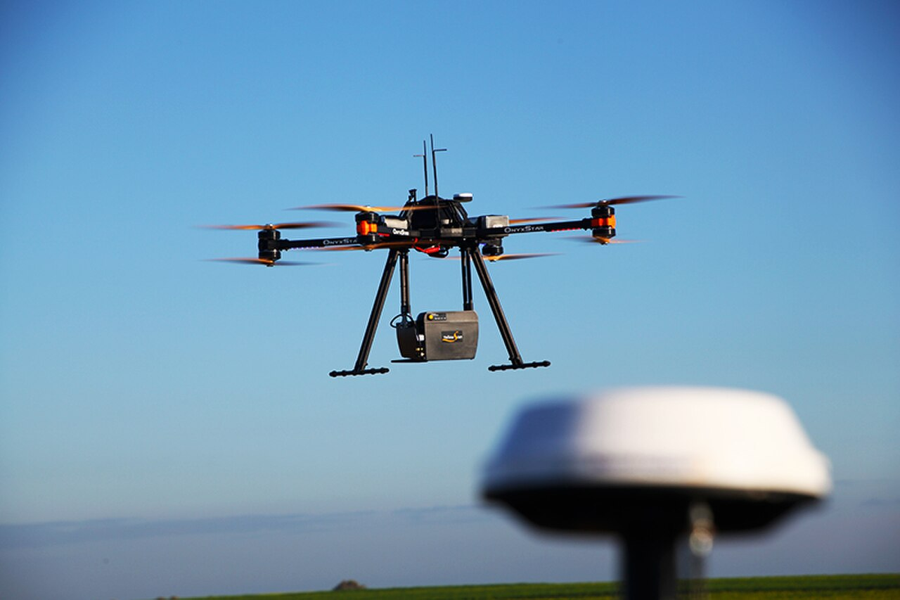
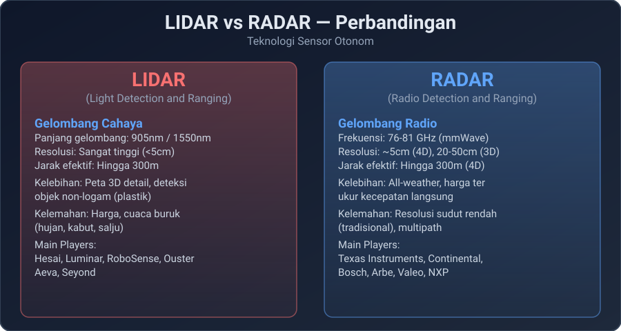
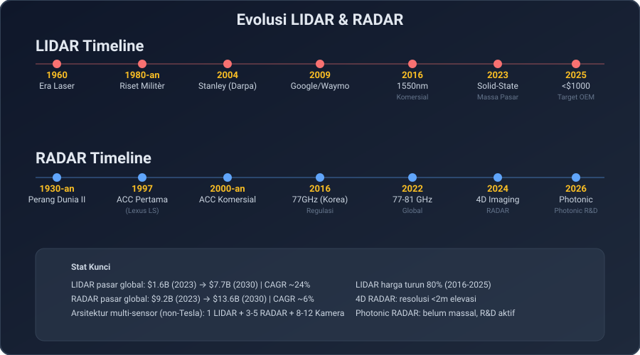
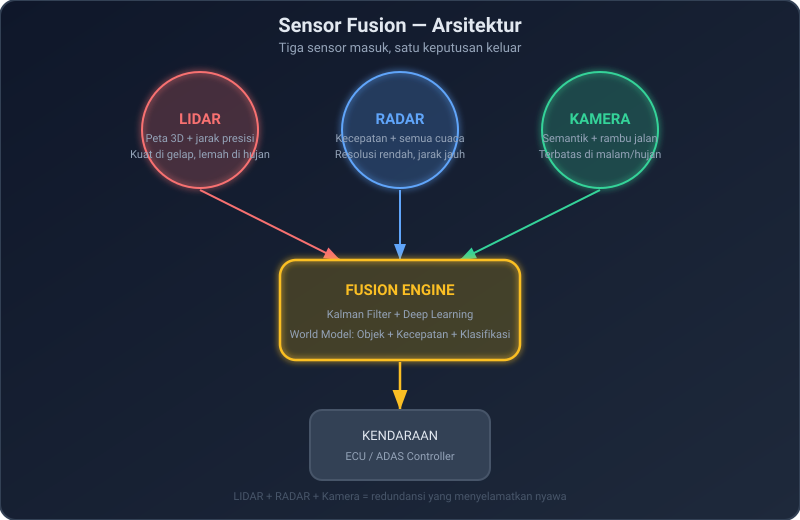

Beberapa waktu lalu saya menulis tentang *invisible intelligence* yang saya lihat di Vehicle Tech Week Europe 2026, bagaimana sensor-sensor kecil di dalam mobil sudah mulai bekerja seperti saraf optik makhluk hidup. [Bisa dibaca lengkap di sini.](https://t-agung.id/blog/blog23b-vehicle-tech-week-europe-2026-invisible-intelligence/)

*LIDAR drone mapping, prinsip yang sama dipakai di mobil otonom, hanya lebih kecil dan lebih murah.*

Kali ini saya masuk lebih dalam ke dua teknologi yang jadi jantung dari semua itu: **LIDAR** dan **RADAR**. Bukan perbandingan permukaan, tapi benar-benar dari fisika, evolusi, pemain besar, sampai ke pertanyaan yang sering bikin diskusi panas di antara orang-orang di industri, apakah keduanya harus ada atau cukup satu?

## Fisika Dasar: Cahaya vs Gelombang Radio

Intinya sederhana: **LIDAR pakai cahaya, RADAR pakai gelombang radio.** Tapi dari kesederhanaan itu muncul perbedaan yang sangat besar.

**LIDAR (Light Detection and Ranging)** memancarkan pulsa laser, biasanya di panjang gelombang **905 nanometer** atau **1550 nanometer**, lalu menghitung waktu balik (Time-of-Flight) untuk membangun peta 3D titik per titik. Bayangkan Anda menutup mata lalu meniup gelembung sabun ke segala arah. Setiap gelembung yang memantul kembali memberi tahu Anda di mana dinding berada. Itulah LIDAR, tapi dengan miliaran "gelembung" per detik.

*Mercedes Benz Sensors, salah satunya adalah LIDAR, yang mendukung Autonomous Driving Level 3 mereka. Source : Mercedes Benz.*

**RADAR (Radio Detection and Ranging)** memancarkan gelombang radio, di dunia mobil sekarang dominan **76-81 GHz (mmWave)**, dan mengukur perubahan frekuensi (Doppler shift) plus waktu balik. Radar bisa langsung mengukur kecepatan objek, sesuatu yang LIDAR harus hitung dari beberapa frame berturut-turut.

Yang penting: **gelombang cahaya dihentikan oleh kabut, hujan deras, dan salju.** Gelombang radio mmWave? Lintas semua itu. Ini bukan teori, ini fisika, dan fisika tidak bisa dinegosiasikan.

## Perbandingan Langsung

*Ringkasan perbandingan LIDAR dan RADAR.*

| Aspek              | LIDAR                          | RADAR                            |
| ------------------ | ------------------------------ | -------------------------------- |
| **Gelombang**      | Cahaya (905nm / 1550nm)        | Radio (76-81 GHz)                |
| **Resolusi sudut** | Sangat tinggi (&lt;0.1°)       | Sedang (1-3°, 4D RADAR &lt;0.5°) |
| **Akurasi jarak**  | &lt;5 cm                       | 20-50 cm                         |
| **Jarak efektif**  | 150-300m                       | 150-300m (4D)                    |
| **Kecepatan**      | Harus dihitung (multi-frame)   | Langsung (Doppler)               |
| **Cuaca**          | Hujan/kabut = bermasalah       | All-weather                      |
| **Deteksi objek**  | Sangat baik (termasuk plastik) | Baik (butuh reflektif)           |
| **Harga**          | $200-$2000+                    | $50-$300                         |
| **Kematangan**     | 2010-an (otomotif)             | 1997 (ACC pertama, Lexus LS)     |

## Evolusi LIDAR: Dari $75.000 ke Pasar Massa

*80 tahun evolusi dua teknologi sensor.*

LIDAR bukan hal baru. Konsepnya lahir tahun 1960-an saat laser ditemukan. Tapi dunia otomotif baru mengenalnya secara serius setelah **Stanley**, mobil otonom tim Stanford, memenangkan Darpa Grand Challenge 2004 dengan Velodyne HDL-64E yang harganya **$75.000**.

Lalu datang **Waymo (Google Self-Driving Car Project, 2009)** yang membuktikan LIDAR bisa bekerja di jalan nyata. Dari situ, perang dimulai.

**Era 905nm vs 1550nm.** Panjang gelombang 905nm lebih murah karena detektornya pakai silicon, tapi tidak aman untuk mata dan jangkauannya terbatas. 1550nm aman untuk mata, jangkauannya lebih jauh, tapi detektornya harus InGaAs yang mahal. Pabrik China, terutama **Hesai** dan **RoboSense**, berhasil menurunkan harga 905nm ke level yang membuat OEM Eropa dan Amerika harus duduk lagi.

**Perubahan besar terjadi tahun 2023-2025:**

- **Hesai** (China), salah satu pemimpin pasar global LIDAR otomotif (RoboSense memimpin berdasarkan volume pengiriman). AT128 sudah massal di mobil China. AT1440 diumumkan CES 2025, mulai dipakai April 2025. Harga di bawah $1000 sudah kenyataan.
- **RoboSense** (China), pemasok Xpeng dan NIO. Fokus ke solid-state MEMS yang lebih tahan getaran.
- **Luminar** (AS), 1550nm, partnership awal dengan Mercedes-Benz (EQS) dan Volvo. Volvo mengakhiri kerjasama November 2025. CEO Austin Russell mengundurkan diri Mei 2025. Luminar mengajukan Chapter 11 bankruptcy Desember 2025, menjual aset ke Microvision ($33M) dan Quantum Computing ($110M), tapi tetap beroperasi di bawah restrukturisasi.
- **Aeva** (AS), FMCW LIDAR, klaim bisa langsung ukur kecepatan seperti radar. Masih tahap validasi OEM.
- **Ouster** (AS), entitas yang bertahan dari merger dengan Velodyne (diumumkan November 2022, selesai Februari 2023). Velodyne masuk Chapter 11 Desember 2022. Ouster fokus ke solid-state flash LIDAR. (Catatan: Aeva TIDAK diakuisisi Velodyne, mereka perusahaan terpisah.)
- **Seyond** (sebelumnya Innovusion, rebrand Desember 2023), LIDAR 1550nm untuk kendaraan komersial, sudah diuji di Tiongkok dengan NIO dan BYD.

Tren jelas: **dari mekanis berputar ke solid-state**, dari $75.000 ke target di bawah $1000, dari alat riset ke komponen yang harus ada di BOM setiap mobil ADAS.

## Evolusi RADAR: Diam-diam Jadi Lebih Cerdas

RADAR jauh lebih tua, ditemukan tahun 1930-an untuk perang. Tapi di otomotif, RADAR baru serius dipakai tahun 1997 untuk sistem Adaptive Cruise Control (ACC) pertama di Lexus LS.

Yang bikin menarik: **RADAR diam-diam berevolusi jauh lebih cepat daripada yang kebanyakan orang sadari.**

**2016, Korea membuka frekuensi 77GHz** untuk otomotif. Dunia sudah menunggu ini. 77GHz memberi bandwidth lebih besar, berarti resolusi lebih tinggi. Eropa dan Jepang segera mengikuti.

**2022, regulasi 77-81 GHz jadi standar global.** Ini penting karena sekarang semua pemain bisa bersaing di frekuensi yang sama.

**2024, 4D Imaging RADAR lahir.** RADAR tradisional cuma punya azimuth (kiri-kanan). 4D RADAR menambahkan **elevasi (atas-bawah)**. Sekarang RADAR bisa membedakan pejalan kaki dari jembatan, atau mendeteksi bola yang melompat ke jalan. Resolusi sudut turun dari 3° ke di bawah 0.5° di beberapa produk.

**2026, Photonic RADAR.** Konsep ini menggunakan serat optik di dalam radar itu sendiri, bukan sebagai pengganti radar, tapi meningkatkan cara radar memproses sinyal. Hasilnya: resolusi mendekati LIDAR, tapi tetap all-weather dan tetap murah. Masih tahap R&amp;D aktif, belum massal.

**Pemain besar RADAR:**

- **Continental** (Jerman), pemimpin pasar sensor otomotif, ARSR (Angular Resolution Sensor) sudah gen 3.
- **Bosch** (Jerman), 4D Imaging Radar sudah produksi. Pemasok OEM besar dunia.
- **Mobileye** (Israel, milik Intel), 4D Radar mereka diklaim bisa menjadi "pengganti LIDAR" untuk beberapa aplikasi karena resolusinya sangat tinggi. Strategi kontroversial: Mobileye mendorong OEM untuk mengurangi ketergantungan pada LIDAR.
- **Arbe** (Israel), Imaging radar 77GHz, sudah diintegrasikan dengan NXP i.MX8. Pendiri: Kobi Marenko dan Roy Oron.
- **NXP** (Belanda), bukan vendor sensor, tapi chip MMIC yang hampir semua vendor radar pakai.
- **Fujikura** (Jepang), photonic radar R&amp;D, fokus ke teknologi optical-based radar.
- **Xavveo** (Swedia), startup 4D imaging radar, partnership dengan NXP.

## Sensor Fusion: Bukan Kompetisi, Tapi Simfoni

*Fusi sensor: LIDAR + RADAR + Kamera = world model yang lebih lengkap daripada bagian-bagiannya.*

Saya sering melihat diskusi "LIDAR vs RADAR, mana yang lebih baik?" di forum teknis. Pertanyaan ini mirip dengan bertanya apakah tangan kiri atau kanan yang lebih penting, keduanya dibutuhkan.

**Fusi sensor** adalah menggabungkan output ketiga jenis sensor, LIDAR, RADAR, dan kamera, menjadi satu *world model*. Kenapa tiga?

- **LIDAR** memberi peta 3D presisi tinggi. Mengetahui bentuk objek, jarak, dan posisi dengan akurasi sentimeter. Tapi hari hujan deras? Performa turun.
- **RADAR** memberi kecepatan langsung dan bekerja di segala cuaca. Tapi resolusinya masih di bawah LIDAR, dan kadang sulit membedakan dua objek yang berdekatan secara vertikal.
- **Kamera** memberi informasi semantik, lampu merah, marka jalan, rambu. Tapi tidak tahu jarak secara langsung dan buta saat silau atau gelap.

Mobil yang menggunakan ketiga-tiganya mendapat **redundansi**: saat kamera silau oleh matahari terbenam, LIDAR masih lihat. Saat LIDAR terganggu kabut tebal, RADAR masih bekerja. Saat RADAR bingung dengan reflektor jalan, kamera memberi konfirmasi.

Dalam pengalaman saya di **Motherson** menangani sistem HMI, keputusan arsitektur sensor bukan soal "yang paling mahal" atau "yang paling canggih." Ini soal **sistem yang survive di kondisi terburuk**, di hujan Jakarta tengah malam, di kabut pagi di pegunungan Jerman, di terik padang pasir. Redundansi bukan pemborosan, itu asuransi.

## Di Mana Kita Sekarang? (2026)

- **China** sudah memimpin. Hesai, RoboSense, Seyond, semua produsen LIDAR China sudah produksi massal. Mobil premium di China, Xpeng, NIO, Li Auto, sudah bawa LIDAR. BYD juga mulai integrate di model atas. Harga turun 80% sejak 2016.
- **Eropa** masih transisi. Mercedes pernah pakai LIDAR dari Luminar di EQS, tapi dengan Luminar bankruptcy Desember 2025 masa depan partnership belum jelas. BMW, Audi, dan Volkswagen masih evaluasi. Continental dan Bosch sudah siap dengan 4D RADAR sebagai alternatif atau pelengkap.
- **Amerika**, Waymo tetap pakai LIDAR custom. Tesla? Saya bahas di bawah.
- **Korea**, Hyundai, Kia, dan Genesis sudah mulai integrate LIDAR dari Hesai dan Mobileye di model baru.

Rata-rata mobil ADAS level 2+ di tahun 2026 sudah punya: **1 LIDAR + 5-7 RADAR + 8 kamera.** Tapi konfigurasi ini belum universal, tergantung strategi OEM.

## Catatan Akhir: Elon Musk, Kamera, dan "Cukup 99%"

*Kamera bisa melihat banyak, tapi apakah cukup?*

Elon Musk sudah bilang berkali-kali: *"LIDAR is a scam."* Dan Tesla benar-benar konsisten, mereka menghapus RADAR belakang tahun 2021, menghapus semua sensor ultrasonik tahun 2022, dan sekarang hanya pakai kamera + neural network.

Saya pribadi **suka kamera**. Di HMI, kamera adalah interface paling natural, mata manusia sudah berevolusi 500 juta tahun untuk memproses gambar. Neural network Vision di Tesla memang sudah bisa cover mungkin 99% kasus driving sehari-hari. Deteksi rambu, marka jalan, pejalan kaki, bahkan gesture tangan supir lain, semua dari gambar.

Tapi **99% itu berarti 1% kasus tersisa.** Dan 1% itu bukan angka kecil kalau Anda berpikir dalam jutaan kilometer per hari. 1% itu adalah:

- Hujan deras malam hari di jalan tanpa penerangan
- Kabut tebal di tol
- Silau matahari terbenam langsung ke kamera
- Objek hitam di aspal hitam saat malam
- Refleksi kaca yang membuat kamera bingung

**LIDAR dan RADAR ada untuk menutup 1% itu.** Bukan karena kamera buruk, kamera bagus banget. Tapi keamanan bukan soal "cukup," keamanan soal "pasti." Dan "pasti" itu butuh lebih dari satu jenis indera.

Ini bukan tentang siapa yang benar atau salah. Ini tentang filosofi: apakah Anda mau sistem yang andal 99% dengan harga lebih murah, atau 99.9% dengan biaya lebih tinggi? Di dunia otonom, 0.9% itu selisih antara "hampir aman" dan "benar-benar aman."

Saya sendiri, dari pengalaman di Sony, Intel, dan sekarang Motherson, selalu percaya: **sistem terbaik adalah yang tidak bergantung pada satu indera saja.** Manusia punya lima indera bukan karena satu cukup, tapi karena dunia terlalu kompleks untuk dilihat dari satu sudut.

*Dan Moko, kucing ragdoll saya, kalau mau menangkap mainan di bawah sofa, tidak pakai satu mata saja. Dia pakai kedua mata, kedua telinga, dan kumisnya. Mungkin ada pelajaran di sana.*

---

**Referensi & Bacaan Lanjut:**

- [Vehicle Tech Week Europe 2026 — Invisible Intelligence](https://t-agung.id/blog/blog23b-vehicle-tech-week-europe-2026-invisible-intelligence/), tulisan saya sebelumnya tentang tren sensor di VEE 2026
  
  
