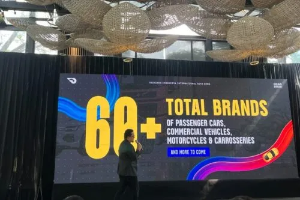
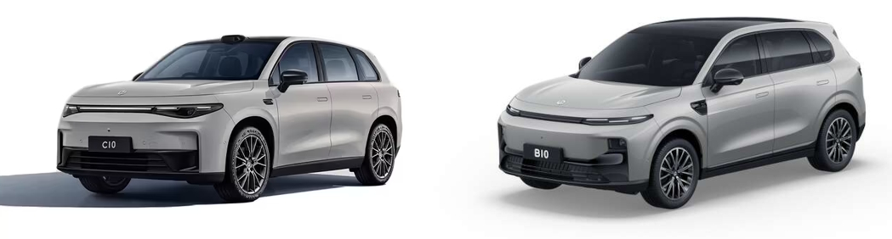
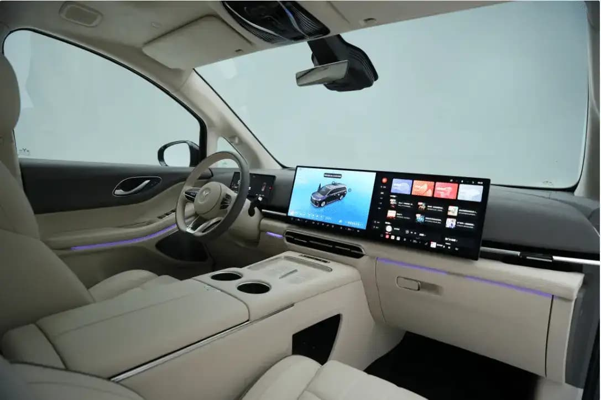
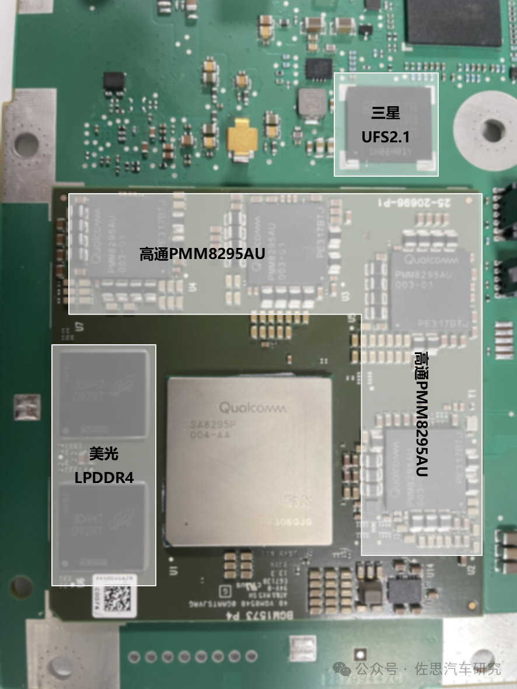

---
# Required fields
title: "GIIAS 2026: 65 Brand, 10 Debutan Baru — Perang Smart Cockpit Dimulai?"
description: "GIIAS 2026 dibuka 30 Juli di ICE BSD dengan 65+ merek dan 10 debutan baru. Bedah smart cockpit dan HMI yang jadi senjata utama mobil listrik China di Indonesia."
pubDate: 2026-07-30
category: "exhibition"
cover: "../../assets/blog/32/giias2026_preview.jpg"
coverAlt: "GIIAS 2026 ICE BSD City — pameran otomotif terbesar di Indonesia dengan 65+ merek dan 6 debutan EV baru"

# Core Fields
tags: ["GIIAS 2026", "EV Indonesia", "Smart Cockpit", "Automotive HMI", "Display"]
author: "Thomas Agung Nugraha"
lang: "id-ID"
draft: false

# Recommended
slug: "blog32_giias_2026_65-brand_6-ev-baru_perang-smart-cockpit"
excerpt: "GIIAS 2026 buka 30 Juli dengan 65+ merek dan 10 debutan baru. Enam brand EV baru masuk Indonesia. Harga EV mulai dari Wuling Aira EV Rp155 juta sampai BMW iX3 Rp2,269 miliar. Tapi cerita utamanya ada di smart cockpit."
updatedDate: 2026-07-30

# Optional: SEO & Indexing
canonicalURL: "https://t-agung.id/blog/blog32_giias_2026_65-brand_6-ev-baru_perang-smart-cockpit"
keywords:
  - GIIAS 2026
  - mobil listrik Indonesia
  - smart cockpit
  - Leapmotor B10
  - Changan Nevo Q05
  - automotive HMI
  - EV Indonesia 2026
  - ICE BSD
  - Wuling Aira EV
  - Polytron G3+
noindex: false

# Optional: table of content
showToc: false

# Optional: internal linking
relatedPosts:
  - blog21_ferrari-luce-oled-cockpit
  - blog24_ferrari_luce_vs_lamborghini_urus
  - blog28_startup_autobahn_expo_2026_part1
---

Pagi hari ini, 30 Juli 2026, ICE BSD City langsung jadi medan pertempuran. GIIAS 2026 resmi dibuka dengan tema "Eye of the Future" dan angkanya gila: lebih dari 65 merek otomotif hadir, rekor tertinggi sepanjang sejarah GIIAS. Tahun-tahun sebelumnya kita fokus pada mesin dan aerodinamika, tahun ini cerita utamanya ada di dalam kokpit.

Perang mobil listrik di Indonesia sudah tidak lagi cuma soal baterai dan jarak tempuh. Perang berikutnya adalah perang smart cockpit. Cina sedang bawa pasukan lengkap.

## GIIAS 2026: Lebih Besar dari yang Pernah Ada

*ICE BSD City : venue GIIAS 2026*

Angka-angkanya:

- **65+ merek** total (43 mobil penumpang, 7 niaga, 13 motor, 5 karoseri)
- **10 merek baru** yang debut pertama kali di Indonesia
- **Theme**: "Eye of the Future" : masa depan otomotif Indonesia ada di depan mata

GIIAS tahun-tahun sebelumnya mirip pasar tradisional yang kita keliling cari barang. Tahun ini lebih kayak mall baru buka: setiap sudutnya ada toko yang belum pernah kita lihat, dan semuanya saling adu desain.

Januari sampai April 2026, penjualan grosir mobil baru di Indonesia naik 12,5% year-over-year, jadi 289.787 unit. Di bulan April saja lonjakannya 55% year-over-year. Pasar sedang panas, dan GIIAS 2026 adalah puncak dari gelombang ini.

---

## 7 Brand Baru Debut Besok (+ 1 Pemain Lama Masuk EV)

Tujuh brand baru debut di Indonesia di GIIAS 2026, plus satu pemain lama yang serius masuk ke segmen EV. Sebagian besar membawa teknologi kabin digital yang jauh lebih canggih daripada apa yang pernah ada di showroom lokal.

### BAW (Beijing Automobile Works)

BAW datang dengan lineup 5 model untuk pasar RHD, mencakup kendaraan premium, off-road, urban mobility, dan green logistics. Mereka sudah resmi bentuk PT. BAW Automobile Trading Indonesia dan mengumumkan proyek KD (knock-down assembly) untuk produksi lokal. Ini berdasarkan pernyataan BAW sendiri, belum dikonfirmasi pihak ketiga.

Spesifikasi HMI belum diumumkan. Kita harus langsung lihat di hall.

### Changan

Changan langsung launch dengan satu produk: **Changan Nevo Q05**, sebuah SUV REEV (Range-Extended Electric Vehicle) dengan harga mulai **Rp 309 juta** OTR Jakarta. Entry point yang menarik untuk segmen SUV listrik.

Spesifikasi layar dan UI-nya masih tertutup. Pertanyaan besar: apakah Changan bawa fitur voice assistant dalam bahasa Indonesia atau cuma Mandarin dan Inggris?

### iCAR

Sub-brand EV dari Chery ini datang dengan **iCAR V27 REEV** dan langsung buka pre-order di GIIAS 2026. iCAR sempat pre-order model 03 di GIIAS 2024, dan V27 diharapkan jadi produk kedua mereka di Indonesia. Harga belum diungkap.

### Leapmotor

Yang ini menarik. Leapmotor launch dua model sekaligus:

- **Leapmotor B10**: compact SUV listrik 5-seater
- **Leapmotor C10**: SUV yang lebih besar dan premium

Distributornya adalah PT Indomobil National Distributor (CEO Tan Kim Piauw), dan dealer pertama sudah buka di Pantai Indah Kapuk, Jakarta Utara. Harga kedua model belum diungkap secara publik. Versi Indonesia bisa saja down-spec dibanding varian China, kita harus lihat gimana sebenarnya.

*Leapmotor B10 dan C10, dua SUV listrik yang debut di GIIAS 2026* source:Unsplash

Di pasar China, Leapmotor dikenal dengan layar sentuh besar dan fitur AI assistant yang responsif. Pertanyaannya: apakah versi Indonesia dapat fitur yang sama, atau ada down-spec?

### Farizon

Farizon hadir dengan 4 kendaraan listrik niaga, 2 di antaranya merupakan produk baru. Segmentasi komersial, jadi fokus HMI-nya lebih ke fleet management daripada pengalaman penumpang. Tetap menarik dari sisi dashboard design untuk kendaraan komersial.

### Solarky Mobility Technologies

Solarky, brand EV China yang relatif baru, debut di Indonesia melalui GIIAS 2026. Informasi spesifik tentang model dan harga belum diumumkan.

### ZEEKR

Sub-brand premium dari Geely Group, ZEEKR juga debut di Indonesia di GIIAS 2026. ZEEKR sudah dikenal di pasar global dengan lineup EV premium yang fokus pada teknologi dan desain. Apakah mereka bawa model yang sama ke Indonesia? Kita cari tahu di hall.

### Polytron (Bukan Brand Baru, Tapi Masuk EV)

Polytron, merek elektronik Indonesia yang sudah kita kenal dari TV dan sound system, hadir dengan **G3+ Special Collaboration**: mobil listrik karya kolaborasi. Polytron sudah leak teaser-nya sebelum GIIAS, dan ini menunjukkan mereka serius masuk ke pasar EV.

Ini unik karena Polytron punya background di display dan consumer electronics. Kalau mereka serius buat smart cockpit untuk G3+, kita bisa lihat apakah pendekatan "elektronik dulu, mobil kedua" ini menghasilkan UX yang berbeda dari pemain China.

---

## Harga Mulai dari Rp155 Juta sampai Rp2,269 Miliar

Ada mobil listrik untuk semua budget di GIIAS 2026.

| Kendaraan        | Tipe | Harga                                   |
| ---------------- | ---- | --------------------------------------- |
| Wuling Aira EV   | BEV  | Rp 155 juta (bisa langsung bawa pulang) |
| Lepas E4         | BEV  | Rp 339 juta                             |
| Changan Nevo Q05 | REEV | Mulai Rp 309 juta                       |
| MG ZS Hybrid+    | HEV  | Rp 299,9 juta                           |
| Leapmotor B10    | BEV  | Belum diungkap                          |
| Leapmotor C10    | BEV  | Belum diungkap                          |
| iCAR V27         | REEV | Pre-order, harga TBD                    |
| GWM Ora 5        | BEV  | Belum diungkap                          |
| Omoda 04 EV      | BEV  | Rahasia (klaim range 553 km)            |
| BMW iX3          | BEV  | Rp 2,269 miliar                         |

Entry point sekarang di **Rp 155 juta** dengan Wuling Aira EV yang bahkan bisa langsung dibawa pulang dari booth. Di ujung atas, BMW iX3 di **Rp 2,269 miliar** menunjukkan bahwa segmen premium tetap ada.

Yang bikin pasar semakin menarik ada di tengah-tengahnya. Changan Nevo Q05 di Rp 309 juta, Lepas E4 di Rp 339 juta. Ini sweet spot di mana konsumen Indonesia mulai mempertimbangkan EV sebagai pilihan realistis.

---

## Smart Cockpit: Cerita Utama yang Jarang Dibicarakan

Interior Voyah Dreamer 2026, salah satu EV dari Cina

Saya pernah kerja di Sony VAIO, Intel, dan sekarang di Motherson di bidang automotive HMI. Satu hal yang saya lihat jelas: perang berikutnya bukan di luar mobil, tapi di dalamnya.

Mobil listrik China yang datang ke Indonesia membawa sesuatu yang belum banyak dibahas di media mainstream: smart cockpit dengan layar besar, voice assistant terintegrasi, dan UI yang didesain untuk pengalaman digital-first. Ini bukan lagi "head unit tambahan". Ini adalah computer yang kebetulan bisa ngebut.

### Kenapa Smart Cockpit Penting?

Di Motherson, saya lihat langsung bagaimana dashboard modern sudah bukan lagi plastik dengan beberapa tombol. Sekarang ini adalah integrated system yang mencakup:

1. **Instrument cluster digital** yang bisa berubah layout sesuai mode berkendara, trend sekarang juga "hidden-til-lit", dimana fungsi HMI tersembunyi dan mengutamakan estetika kokpit.
2. **Central infotainment display** dengan OS sendiri (sering berbasis Android Automotive atau custom Linux)
3. **Voice assistant** yang bisa control navigasi, AC, musik, bahkan window dan seat
4. **Over-the-Air (OTA) update** yang berarti fitur terus bertambah setelah mobil dibeli

Dulu mobil itu kayak TV tabung: beli sekali, pakai sampai mati. Sekarang mobil listrik lebih kayak smartphone: beli sekali, terus update dan dapet fitur baru. Smart cockpit adalah "layar" dari smartphone itu.

### Pengalaman Sony dan Intel

Dari dulu masa di Sony, ke Intel, dan sekarang pun di Motherson, HMI itu fokusnya selalu sama: bagaimana membuat interface antara manusia dan mesin semakin seamless.

Prinsip yang sama diterapkan di kabin mobil sekarang. Bedanya skalanya lebih besar, kompleksitasnya lebih tinggi, dan safety-critical requirementsnya jauh lebih ketat daripada consumer electronics.

Ferrari Luce dengan OLED cockpit-nya sudah kita bahas di [Part 21](blog21_ferrari-luce-oled-cockpit), dan perbandingan Ferrari vs Lamborghini di [Part 24](blog24_ferrari_luce_vs_lamborghini_urus) menunjukkan bahwa bahkan brand premium tradisional sudah menyadari: masa depan ada di layar. Sekarang pertanyaannya, apakah brand China yang bawa EV ke Indonesia bisa eksekusi smart cockpit lebih baik dari Ferrari?

---

## Spesifikasi HMI: Yang Sudah Konfirmasi, Yang Masih Misteri

Setelah research dari berbagai sumber (GAIKINDO, Kompas, CNN Indonesia, IDN Times, Tempo, OTOJATIM, dan lain-lain), realitanya: spesifikasi HMI dan display untuk sebagian besar EV debutan belum diumumkan.

Kita harus turun ke lapangan.

### Yang Kita Tahu

- **Leapmotor**: Di pasar China, dikenal dengan layar sentuh besar dan AI voice assistant. Versi Indonesia untuk B10 dan C10 masih misterius.
- **Changan Nevo Q05**: Harga sudah jelas (Rp 309 juta), tapi detail infotainment dan UI tidak diumumkan.
- **iCAR V27 REEV**: Pre-order terbuka, spesifikasi HMI belum keluar.
- **Polytron G3+**: Cuma ada teaser, nol detail teknis.

### Yang Kita Harus Cari

Qualcomm Snapdragon 8295P, chip smart cockpit yang mungkin dipakai beberapa EV China, kabarnya punya 30 TOPS, sumber : Zoss Automotive Research

Pertanyaan besar yang akan kita cari jawabannya di hall GIIAS:

1. **Chipset apa yang dipakai?** Snapdragon 8295P dari Qualcomm? MediaTek Dimensity Auto? Atau chipset custom dari vendor China? Ini menentukan performa UI, responsivitas, dan kemampuan AI.

2. **Ukuran dan resolusi layar?** Apakah semua brand bawa layar 15 inci ke atas, atau ada yang masih di segmen 10-12 inci?

3. **Voice assistant dalam bahasa Indonesia?** Ini krusial. Kalau voice assistant cuma support Mandarin dan Inggris, pengalaman pengguna lokal bakal terbatas.

4. **OTA update infrastructure?** Apakah brand-brand ini punya backend untuk kirim update fitur secara berkala, atau kita beli mobil dan itu sudah versi terakhirnya?

5. **Dashboard layout dan ergonomi?** Sebagai insinyur HMI, ini yang paling saya care. Bagaimana tampilan instrument cluster? Apakah ada head-up display? Bagaimana integrasi antara layar dan tombol fisik?

---

## Kenapa Kita Sebagai Insinyur Display Harus Peduli

GIIAS 2026 bukan cuma pameran mobil. Ini showcase evolusi display technology di Indonesia.

Saya sudah lihat dari dekat bagaimana teknologi display berkembang, dari CRT ke LCD ke OLED ke MicroLED. Satu hal yang bisa saya bilang: automotive display adalah frontier berikutnya untuk display technology.

Automotive display punya requirements yang unik. Harus tahan suhu ekstrem, getaran tinggi, dan langsung terlihat di bawah cahaya matahari langsung. Challenge yang tidak ada di smartphone atau TV.

Size-nya juga besar. Instrument cluster modern bisa 12-15 inci, dan central display bisa 15-18 inci atau lebih. High-end display yang terpasang di kendaraan yang bergerak.

Integration-nya kompleks. Smart cockpit bukan cuma layar. Gabungan dari display, sensor, processing unit, connectivity module, dan safety system yang harus bekerja sama secara seamless.

Ketika brand-brand China bawa smart cockpit ke Indonesia, mereka bawa ecosystem display technology yang belum banyak ada di sini. Sebagai engineer, kita punya kesempatan langka untuk lihat langsung teknologi apa yang dipakai, bagaimana mereka implement, dan apakah benar-benar cocok untuk pasar Indonesia.

---

## Misi On-Floor: Apa yang Akan Kita Bedah

GIIAS 2026 dibuka pagi ini di ICE BSD City, dan rencana follow-up posts selama GIIAS berlangsung:

1. **HMI review per brand**: review layar, UI, voice assistant, dan responsiveness dari setiap EV debutan
2. **Perbandingan chipset**: identifikasi chipset di balik smart cockpit masing-masing brand
3. **Ergonomi dashboard**: bedah layout dan usability dari setiap kokpit
4. **Voice assistant test**: apakah support bahasa Indonesia, dan bagaimana responsivitasnya
5. **Pricing vs features analysis**: apakah smart cockpit yang ditawarkan sebanding dengan harganya

Update real-time akan saya publish secara berkala selama GIIAS berlangsung sampai 9 Agustus 2026.

---

## GIIAS 2026: Titik Balik

GIIAS 2026 menunjukkan bahwa mobil listrik sudah bukan lagi niche market di Indonesia. 65 brand, 6 debutan EV baru, harga mulai dari Rp 155 juta.

Tapi cerita utamanya bukan cuma soal mobil listrik yang murah. Smart cockpit revolution sedang datang ke Indonesia, dan brand-brand China yang terdepan membawa teknologi ini.

Layar besar, voice assistant, OTA update, dan AI integration. Semua ini bukan lagi fitur premium untuk mobil jutaan dolar. Sekarang datang dalam mobil dengan harga Rp 300-400 juta. Sebagai engineer display dan HMI, saya punya tugas untuk verifikasi: apakah semua klaim ini benar-benar terimplement dengan baik, atau cuma marketing gimmick?

Sayang sekali saya tidak bisa hadir langsung. Dari sini di Jerman, saya hanya bisa mengamati peluncuran dan pengumuman dari berbagai sumber media. Tapi persis karena itulah saya butuh impression langsung dari kalian yang ada di sana. Kirim foto, video, atau cerita apa yang kalian lihat di booth masing-masing. Saya akan kombinasikan dengan data dari outlet berita lain dan publish series follow-up selama pameran berlangsung.

---

## Produk Nyata yang Disebutkan di Post Ini

| Produk           | Brand     | Harga                  | Status                                                     |
| ---------------- | --------- | ---------------------- | ---------------------------------------------------------- |
| Wuling Aira EV   | Wuling    | Rp 155 juta            | Launch di GIIAS 2026, bisa langsung bawa pulang            |
| Changan Nevo Q05 | Changan   | Mulai Rp 309 juta      | Launch di GIIAS 2026, debut pertama di Indonesia           |
| Leapmotor B10    | Leapmotor | TBD                    | Launch di GIIAS 2026, debut pertama di Indonesia           |
| Leapmotor C10    | Leapmotor | TBD                    | Launch di GIIAS 2026, debut pertama di Indonesia           |
| iCAR V27 REEV    | iCAR      | TBD                    | Pre-order dibuka di GIIAS 2026, debut pertama di Indonesia |
| Lepas E4         | Lepas     | Rp 339 juta            | Launch di GIIAS 2026                                       |
| BMW iX3          | BMW       | Rp 2,269 miliar        | Launch di GIIAS 2026                                       |
| GWM Ora 5        | GWM       | TBD                    | Launch di GIIAS 2026                                       |
| Omoda 04 EV      | Omoda/JAC | Rahasia (klaim 553 km) | Launch di GIIAS 2026                                       |
| Polytron G3+     | Polytron  | TBD                    | Teaser sebelum GIIAS 2026                                  |

---

## Referensi

1. GAIKINDO Official: [New car brands to join GIIAS 2026](https://www.gaikindo.or.id/en/various-new-car-brands-to-join-the-giias-2026-2/)
2. GAIKINDO Official: [GIIAS 2026 runs from July 30 to August 9](https://www.gaikindo.or.id/en/the-2026-giias-automotive-exhibition-runs-from-july-30-to-august-9-2026/)
3. Kompas: [Debut Leapmotor B10 dan C10 di GIIAS 2026](https://otomotif.kompas.com/read/2026/07/29/172555415/debut-di-giias-2026-leapmotor-luncurkan-b10-dan-c10)
4. CNN Indonesia: [Deret Mobil Baru Bakal Meluncur di GIIAS 2026](https://www.cnnindonesia.com/otomotif/20260714140306-579-1380543/deret-mobil-baru-bakal-meluncur-di-giias-2026)
5. OTOJATIM: [GIIAS 2026 Opens with 65 Automotive Brands](https://en.otojatim.com/2026/07/giias-2026-opens-65-automotive-brands-indonesia-market.html)
6. iNews: [Polytron Bocorkan G3+ Special Collaboration](https://www.inews.id/otomotif/mobil/intip-deretan-mobil-baru-bakal-meluncur-di-giias-2026-ada-43-merek)
7. IDN Times: [Daftar Merek Mobil dan Motor di GIIAS 2026](https://www.idntimes.com/automotive/car/daftar-merek-mobil-dan-motor-di-giias-2026-q9t01-00-s5qpm-tplp1n)
8. Tempo: [Debut Leapmotor dan Changan di GIIAS 2026](https://www.tempo.co/foto/arsip/debut-leapmotor-dan-changan-di-giias-2026-2279035)
