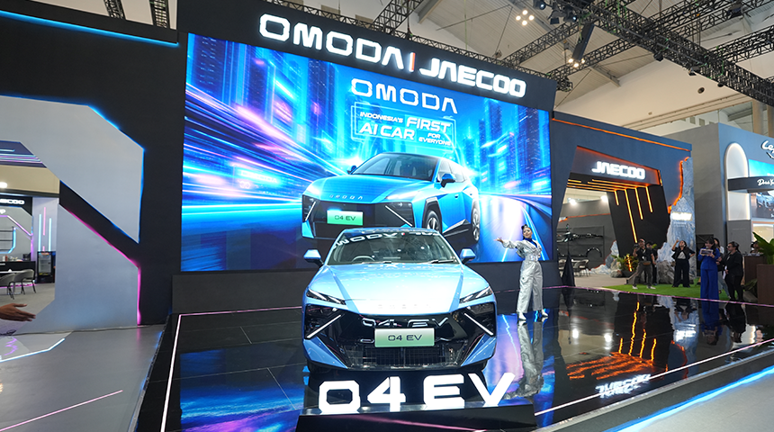
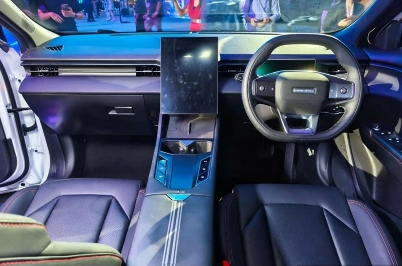
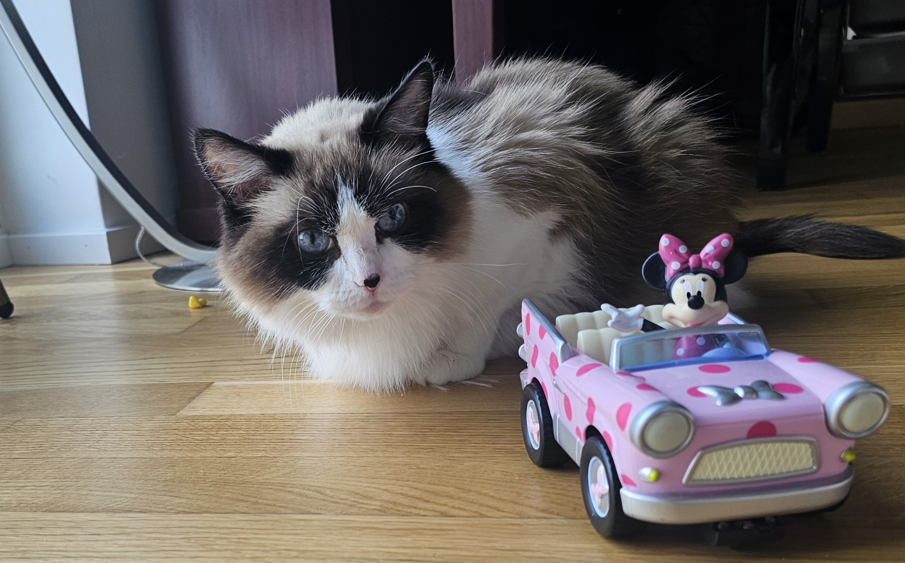

Ada dua hal yang datang ke Indonesia dalam selisih sehari. Keduanya tentang hal yang sama.

30 Juli, OMODA peluncur di GIIAS BSD. Bukan sekadar mobil listrik lagi, tapi mobil yang mengklaim punya "Super AI Cockpit". Satu hari sebelumnya, Google peluncur Gemini Spark di Indonesia. Platform AI yang bisa bertindak sendiri, bukan cuma menjawab pertanyaan.

Dua peluncuran. Satu pola: AI yang bukan lagi sekedar chatbot.

## OMODA O4 EV: Mobil yang Pahami Kebiasaanmu

OMODA O4 EV datang dengan angka-angka yang sudah biasa kita lihat di mobil listrik China: baterai 65,05 kWh, motor 160 kW (218 PS), klaim jarak 553 km (NEDC). Yang bikin beda bukan angka-angkanya, tapi cara mobil ini berinteraksi dengan manusia.

Kokpitnya disebut "AI Cockpit". Sistem yang bisa memahami bahasa natural, merencanakan rute berdasarkan preferensi, bahkan mengelola hiburan di dalam mobil secara kontekstual. Bukan lagi "Hi Mercedes, turn on AC". Tapi mobil yang bisa bilang, "kamu sudah perjalanan tiga jam, ada tempat istirahat 5km di depan."

Indonesia dipilih sebagai negara debut global pertama. Alasan resminya? Pasar mobil listrik Indonesia tumbuh 55% year-over-year di April 2026. Alasan yang lebih jujur? China ingin tunjukkan bahwa AI di mobil bukan lagi dikuasai oleh Silicon Valley. Tiongkok juga bisa membuat dan implemen di produknya.

 Ini Cockpitnya Omoda O4, kalau boleh jujur, design language nya kurang meyakinkan saya

## Apa Itu Agentic AI?

Kata "AI" sekarang dipakai untuk terlalu banyak hal. Jadi kita harus bedakan dua jenis:

**Generative AI** kayak konsultan yang sangat pintar, tapi hanya bekerja kalau kamu duduk di hadapannya. Kamu yang harus datang, bertanya, dan dia menjawab. Hebat, tapi pasif.

**Agentic AI** kayak asisten pribadi yang tinggal di rumah. Dia tahu kamu bangun jam 5, tahu kalau abis sholat Subuh kamu sukanya minum teh hijau, tahu jadwal meetingmu, ngasi tau apa berita "hot" di pagi hari berdasarkan hobbymu. 

Bukan lagi cuma menjawab pertanyaan, tapi dia mengambil tindakan. Di masa depan, mungkin bisa periksa apa yang ada di kulkas kalau kamu bilang "lapar", bisa pesan tiket kalau kamu bilang "mau liburan," bisa menghangatkan mobil kalau kamu bilang "pergi kerja".

Generative AI menunggu perintah. Agentic AI mengambil inisiatif.

Gemini Spark yang Google peluncur di Indonesia masuk kategori kedua. OMODA O4 EV juga. Dua perusahaan berbeda, dua industri berbeda, tapi terasa seperti satu gelombang yang sama.

## Gemini Spark: Google Masuk ke Arena yang Sama

Gemini Spark diumumkan di blog Google Indonesia 29 Juli lalu. Ini bukan versi baru Gemini. Platform ini ngasi kemungkinan AI untuk bertindak nyata. Bukan cuma bikin teks dan gambar, tapi berinteraksi dengan aplikasi lain, mengelola task, dan bahkan mengambil keputusan berdasarkan konteks pengguna.

Tersedia melalui langganan AI Ultra dan AI Pro Google, dalam bahasa Indonesia dan Inggris. AI yang sama yang bisa kamu pakai di kopmuter hari ini, besok bisa ada di mobil.

Pertanyaannya: mengapa Google meluncurkan ini di Indonesia, padahal saya di Jerman, masih belum bisa akses fitur ini?

Mungkin karena Indonesia adalah pasar yang lebih mudah diuji. Di Indonesia, konsumen sudah terbiasa dengan super-app yang melakukan banyak hal. AI yang bisa bertindak sendiri terdengar lebih natural daripada di negara di mana orang masih ragu memberi AI akses ke email mereka.

## Dari Nokia ke Kokpit: Perjalanan 20 Tahun

Saya ingat masa-masa Nokia jadul, layar 2,6 inci, resolusi 240x320 piksel, tombol fisik. Layarnya cuma untuk nunjukin informasi ama mungkin kirim SMS. Kamu yang harus aktif: tekan tombol, pilih menu, ketik SMS. Mobil zaman purba dulu juga begitu. Panel instrumen analog, tombol radio fisik, tombol AC. Semua reaktif.

Lalu datang smartphone. Layar sentuh, multi-touch, aplikasi. Lebih interaktif, tapi masih perlu kamu sentuh dulu.

Sekarang sistem yang memahami bahasa natural. Kamu bilang "Hey Gemini, aku dingin" dan AC otomatis naik, musik berubah, rute disesuaikan. OMODA AI Cockpit dan Gemini Spark sama-sama masuk kategori ini.

| Era | Kontrol | Contoh Nyata |
|---|---|---|
| 2005 | Tombol fisik | Tekan tombol untuk naik volume. Nokia N95, dashboard analog |
| 2015 | Layar sentuh | Geser layar untuk buka navigasi. Smartphone awal, infotainment touchscreen |
| 2020 | Kata kunci aktivasi | "OK Google, berapa suhu luar?" atau "Hey Siri, putar Spotify." Sistem hanya menjawab, tidak bertindak. Google Assistant, Siri, Amazon Alexa |
| 2026 | Bahasa natural, proaktif | "Aku dingin" lalu AC naik sendiri, musik berubah, rute disesuaikan. OMODA AI Cockpit, Gemini Spark |

## Apa Artinya untuk Kita?

Di Motherson, saya mengalami banyak prototipe smart cockpit yang terlihat seperti set film fiksi ilmiah. Layar melengkung, gestur udara, voice assistant yang bisa melakukan hampir apa saja. Tapi antara prototipe dan produk massal, ada jarak yang namanya regulasi, biaya, dan realita pabrik.

OMODA O4 EV menarik karena ini bukan prototipe. Ini produk yang bisa kamu beli. Agentic AI-nya mungkin belum sempurna, tapi ini langkah pertama yang nyata dari Tiongkok ke pasar Indonesia.

Prediksi saya: dalam 2-3 tahun, "AI agent di kokpit" akan jadi selling point standar di mobil listrik segmen menengah ke atas. Bukan lagi fitur premium yang hanya ada di [Ferrari Luce](/blog/blog21_ferrari-luce-oled-cockpit/). Indonesia, berkat kehadiran brand-brand China, bisa jadi salah satu pasar pertama yang melihat ini. Omoda O4 adalah contoh pertamanya.

## Penutup

AI agentic bukan sekedar gimik. Ini evolusi yang alami untuk HMI: dari tombol, ke layar sentuh, ke sistem yang memahami konteks dan bisa bertindak. OMODA O4 EV di GIIAS dan Gemini Spark di Indonesia adalah bukti bahwa evolusi ini sedang terjadi.

Sementara Moko masih mikir gimana caranya mobil mainannya Anna ini bisa bawa wet food favoritnya secara otomatis saat dia pengen, dengan banguan Agentic-AI.

---

**Referensi:**
- [Google: Memperkenalkan Gemini Spark](https://blog.google/intl/id-id/products/explore-get-answers/memperkenalkan-gemini-spark-agen-ai-pribadi-anda-yang-siap-membantu-247/)
- Kompas: [GIIAS 2026: 65 Brand Otomotif Hadir](https://otomotif.kompas.com/read/2026/07/30/060000558/giias-2026-65-brand-otomotif-hadir-di-ice-bung-bung?celebrity=0)
- AutonetMagz: [OMODA O4 EV Diluncurkan di GIIAS 2026](https://www.autonetmagz.com/omoda-o4-ev-diluncurkan-di-giias-2026/)
