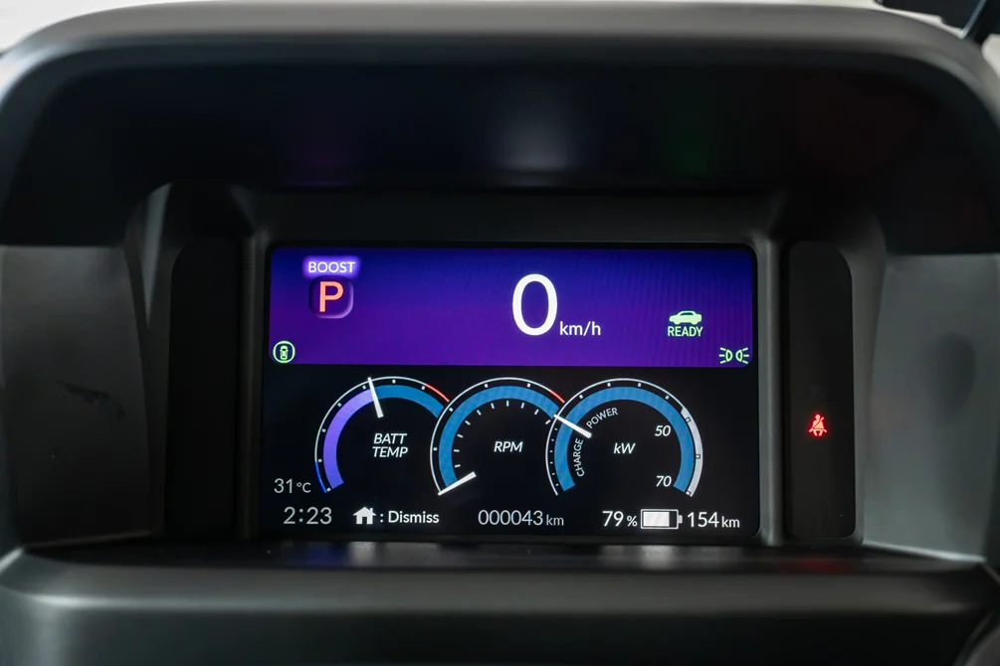
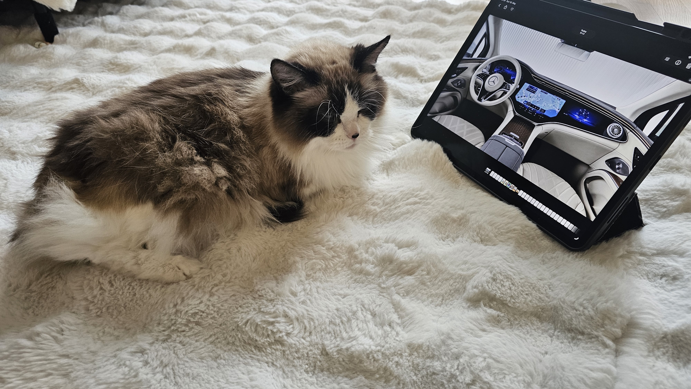

GIIAS 2026 ditutup dikit lagi di tanggal 9 Agustus. Stand-stand di BSD Convention Center udah dibongkar. Tapi kalau kamu masuk grup Facebook atau Telegram komunitas EV Indonesia, bahasannya nggak berhenti, malah makin panas.

Perang layar kokpit di mobil listrik Indonesia nggak melambat. Malah ngebut.

Kali ini kita nggak ngomong soal EV premium jutaan dolar. Kita ngomong soal mobil listrik yang harganya mulai Rp 255 juta, yang bulan depan bisa langsung kamu ambil di showroom.

## Angka-angkanya

Honda resmi umurin harga Super-ONE 5 Agustus: Rp 438 juta OTR Jakarta. Kuota cuma 100 unit buat Indonesia di 2026. Dalam seminggu, permintaan udah lewat kuota. Jadi kalau kamu baca ini dan baru mikir beli, udah telat.

Geely EX2 dijual mulai Rp 239,9 juta (varian Pro) dan Rp 269,9 juta (Max), harga promo peluncuran yang udah habis. Harga normalnya Rp 255 juta buat Pro dan Rp 285 juta buat Max. Lebih dari 2.000 unit udah di gudang Indonesia. Viralnya bukan di spesifikasi, tapi di warna Aether Green-nya di TikTok. Dan Hyundai? IONIQ 3 datang ke GIIAS cuma special display. Belum dijual di Indonesia. Tapi layarnya udah 14,6 inci.

Tiga mobil. Tiga pendekatan yang beda banget. Dan dari kaca mata display engineer, ini menarik.

## Honda Super-ONE: Emosi di Balik Layar 9 Inci

Layar 9 inci dan Triple Meter pada Honda Super-ONE, yang menampilkan simulasi tachometer, suhu baterai, power output, dan regen secara real-time. source: Torque Singapore

Honda Super-ONE nggak ikut perang ukuran layar. 9 inci jauh lebih kecil dari 14,6 inci Geely atau Hyundai. Tapi yang bikin saya tertarik justru ada di detail.

Honda pasang Animated MID (Multi-Info Display) dengan tema ungu-biru. Layar ini bukan cuma nunjukin kecepatan. Ada Triple Meter yang nunjukin informasi sekaligus: simulated tachometer, power output, dan status regen. Di mobil konvensional, tachometer itu ada karena mesin bensin punya RPM. Di EV? RPM-nya simulasi.

Dan ini yang menurut saya keren.

Di Motherson, waktu kita desain HMI buat dashboard otomotif, salah satu tantangan terbesarnya adalah: gimana bikin pengemudi EV ngerasa sesuatu yang emosional, padahal motor listrik nggak punya engine noise, nggak punya gear shift, nggak punya RPM yang beneran?

Jawaban Honda: BOOST Mode.

Tekan tombol, power naik dari 47 kW ke 70 kW. Kenapa tenaganya kecil untuk ukuran EV?  Coba liat juga ukuran mobilnya, ini merupakan kelas "Kei Jidosha" di Jepang, yang setara dengan mobil kecil bermesin 660cc. Jadi tenaga ini diregulasi ama peraturan disana. Di layar muncul Simulated 7-Speed Gear Shift yang animasinya smooth. Active Sound Control bikin suara yang natural, tapi jelas bukan dari mesin bensin. Triple Meter berubah, warna geser dari biru ke ungu, pengemudi ngerasa masuk ke mobil sport beneran.

HMI design yang jujur tapi emosional. Mereka nggak klaim ini RPM asli. Mereka bikin simulasi yang cukup meyakinkan supaya kamu ngerasa.

Kalo kamu pernah naik mobil listrik dan bilang "kurang nendang", Honda paham itu bukan soal tenaga. Itu soal feeling. Dan mereka jawab dengan design.

Fitur lain di Super-ONE: Google built-in di layar 9 inci, wireless Apple CarPlay dan Android Auto, Honda Sensing full suite (ACC, CMBS, RDM, LKAS, AHB), Honda Connect + Digital Key, BOSE premium audio, baterai 29,6 kWh dengan range 274 km. Fast charge 30 menit ke 80 persen, full charge 4,5 jam pakai AC votage.

Konsep "Pocket Rocket" mereka bukan gimmick. Ini mobil yang didesain supaya kamu senyum pas naik. Dan 100 unitnya langsung ludes dalam seminggu.

## Hyundai IONIQ 3: Layar Besar Belum Datang

Hyundai IONIQ 3 hadir di GIIAS 2026 sebagai special display. Artinya kamu bisa lihat, bisa sentuh, tapi nggak bisa beli. Strategi yang nggak asing, Hyundai mau bikin hype dulu sebelum jual.

Mereka bawa layar sentuh 14,6 inci dengan Android Automotive OS — bukan Android biasa yang diinstal di hardware mobil, tapi OS yang beneran terintegrasi sama vehicle system. Kamu bisa akses Google Maps, Google Assistant, Play Store, dan integrasi native sama fitur mobil.

Drag coefficient 0,263 yang diklaim best in class. Hyundai Digital Key 2 dan integrasi route planner bawaan Android Automotive.

Yang bikin perhatian, Hyundai juga nunjukin IONIQ 9 di GIIAS 2026 — SUV listrik premium yang memperkuat posisi Hyundai di segmen EV atas. Sinyalnya jelas, Hyundai serius sama pasar EV Indonesia, dan IONIQ 3 bisa jadi pintu gerbang ke segmen menengah.

Hyundai IONIQ 3 di stand special display GIIAS 2026. Layar 14,6 inci dengan Android Automotive OS belum tersedia untuk pembelian di Indonesia. source: Hyundai

## Geely EX2: Disrupsi Harga-Layar dari China

Geely EX2 dengan warna Aether Green yang viral di TikTok Indonesia. Layar 14,6 inci Flyme Auto di harga Rp255 juta. source: Geely

Kalau ada satu mobil yang bikin industri otomotif Indonesia kaget, itu Geely EX2.

Rp 239,9 juta (promo peluncuran, sekarang Rp 255 juta normal) buat varian Pro, Rp 269,9 juta (promo, sekarang Rp 285 juta) buat Max. Di harga itu kamu dapet layar sentuh 14,6 inci HD dengan Flyme Auto. ADAS Level 2 dengan 12 fitur keselamatan termasuk Blind Spot Detection.

Baterai 40,8 kWh, motor 113 hp, layout RWD, range 395 km (NEDC). Dimensi 4.135 x 1.805 x 1.580 mm. Unit-unit pertama sudah mulai masuk ke gudang Indonesia.

Yang bikin heboh, di TikTok mobil ini viral bukan karena fitur-fiturnya, tapi karena warna Aether Green-nya. Video-video review yang ditonton jutaan kali. Dan komentar-komentar kayak "ini harganya beneran dua ratus jutaan?"

Ini bukan disrupsi biasa. Ini disrupsi harga-terhadap-spek.

## Tabel Perbandingan Langsung

| Fitur              | Honda Super-ONE             | Hyundai IONIQ 3       | Geely EX2                                |
| ------------------ | --------------------------- | --------------------- | ---------------------------------------- |
| Central Display    | 9-inch                      | 14,6"                 | 14,6-inch HD                             |
| Instrument Cluster | Animated MID + Triple Meter | Digital               | —                                        |
| OS                 | Google built-in             | Android Automotive OS | Flyme Auto                               |
| Audio              | BOSE Premium (8 speaker)    | —                     | Standard                                 |
| ADAS               | Honda Sensing full suite    | Level 2+              | Level 2 (12 fitur)                       |
| Harga              | Rp 438 jt                   | Belum dijual          | Rp 255-285 jt (promo: Rp 239,9-269,9 jt) |
| Range              | 274 km (WLTC)               | —                     | 395 km (NEDC)                            |

## Tiga pendekatan, satu pertanyaan

Dari tabel di atas, polanya kelihatan. Tiga cara beda buat jawab satu pertanyaan: kokpit mobil listrik yang ideal itu kayak apa?

Honda ambil jalur "emotional driving". Mereka sadar layar 9 inci nggak menang di angka, jadi fokus ke pengalaman. Animasi MID yang cantik, Triple Meter yang bikin pengemudi merasa terlibat, BOOST Mode dengan simulasi gear shift dan active sound. Layar bukan yang terbesar, tapi pengalaman di atasnya lebih dalam. Google built-in bikin integrasi sama ekosistem Google nggak ribet. Wireless CarPlay dan Android Auto buat kamu yang prefer bawa HP sendiri.

Hyundai ambil jalur "Android as the car brain". Android Automotive OS bukan Android biasa yang kamu install di tablet. Ini OS yang dibangun khusus untuk mobil, dengan akses ke semua data kendaraan, integrasi native sama Google Maps, dan ekosistem Play Store yang bisa dikustomisasi untuk konteks driving. Layar 14,6 inci bukan sekadar canvas besar, itu workspace. Kamu bisa multitask: navigasi di satu sisi, musik di sisi lain, info kendaraan di panel bawah. Pendekatan yang mirip apa yang kita lihat di [Vehicle Tech Week Europe 2026](/blog/blog23b-vehicle-tech-week-europe-2026-invisible-intelligence), tapi dengan hardware yang lebih agresif.

Geely ambil jalur "value-first disruption". 14,6 inci + Flyme Auto + ADAS Level 2 dengan 12 fitur keselamatan, semua di harga Rp255 juta normal. Flyme Auto dikembangkan Meizu setelah diakuisisi Geely, ekosistemnya terintegrasi sama smartphone Flyme. Kalau kamu pake HP Flyme, pengalaman seamless-nya mirip iPhone ke Mac. ADAS Level 2 dengan fitur seperti Blind Spot Detection dulu cuma ada di mobil premium, sekarang ada di mobil Rp255 juta.

## Inversi rasio harga-terhadap-ukuran

Yang bikin saya mikir keras sebagai engineer yang pernah kerja di Sony VAIO, Intel display tech, dan sekarang di Motherson automotive HMI, adalah inversi rasio harga-terhadap-ukuran layar ini.

Honda Super-ONE: Rp 438 juta buat 9 inci. Itu setara Rp 48,7 juta per inci.
Geely EX2: Rp 255 juta buat 14,6 inci. Itu setara Rp 17,5 juta per inci.

Hampir tiga kali lebih murah per inci. Dan ini bukan cuma soal ukuran, tapi soal apa yang bisa dilakukan layar tersebut.

Waktu saya di Intel display tech 2015-2018, saya terlibat dalam display reference design untuk embedded systems. Satu pelajaran yang selalu saya bawa: ukuran layar bukan cuma angka. Ukuran layar tentuin layout, layout tentuin arsitektur HMI, arsitektur HMI tentuin pengalaman pengguna.

14,6 inci bukan sekadar "layar besar". Ini berarti kamu bisa punya tiga kolom informasi paralel: navigasi di tengah, instrumen di kiri, media dan kontrol di kanan. Di layar 9 inci, kamu harus bergantian antara menu dan informasi.

Bayangin begini. Layar 9 inci itu kayak TV di kamar kecil, kamu bisa liat tapi kalau mau lihat detail harus deketin mata. Layar 14,6 inci itu kayak monitor workstation, kamu bisa multitask, bagi layar, taruh info penting di pojok kanan tanpa ngehalangi view utama.

## Simulasi emosi di era tanpa RPM

Soal Triple Meter di Honda Super-ONE, ada konteks yang perlu kita pelajari lebih dalam.

Di industri otomotif, HMI designer menghadapi paradoks yang unik pas transisi ke EV: pengemudi yang udah terbiasa 40 tahun lihat tachometer, RPM gauge, dan engine temperature, sekarang harus lihat apa? Battery percentage? SOC? Voltage?

Semua penting. Tapi nggak bikin kamu senyum.

Triple Meter Honda jawab dengan cerdas. Mereka simulasi tachometer, tapi mereka jujur ini simulasi. Mereka tampilkan power output dan regen secara real-time. Warna tema ganti dari biru (mode normal) ke ungu (BOOST mode). Dan mereka pasang Active Sound Control yang bikin pengalaman akselerasi terasa lebih hidup.

Ini bukan kebohongan. Ini storytelling lewat HMI.

Di Ferrari Luce, mereka pakai layar OLED yang memukau buat nyampein emosi yang sama ([baca tulisannya di sini](/blog/blog24_Ferrari_Luce_vs_Lamborghini_Urus)). Di Honda Super-ONE, mereka capai efek serupa dengan layar 9 inci yang lebih kecil, tapi dengan animasi dan suara yang lebih banyak. Pendekatan beda, tujuan sama: bikin pengemudi merasa.

## Flyme Auto: OS yang belum kamu ketahui

Yang nggak banyak orang tau tentang Geely EX2: Flyme Auto bukan sekadar skin Android. Ini OS yang dikembangkan Meizu, perusahaan smartphone yang diakuisisi Geely 2022. Flyme Auto dirancang dari awal buat integrasi seamless antara smartphone dan cockpit.

Konsepnya mirip Apple CarPlay tapi lebih dalam. Bukan sekadar mirror layar HP ke mobil, tapi seluruh ekosistem yang terhubung. Notifikasi, kalender, musik, navigasi, bahkan pesan, semua terintegrasi. Kalau kamu pake HP ekosistem Flyme, pengalaman di dalam mobil terasa kayak extension dari HP kamu.

Pertanyaannya: apakah ekosistem Flyme bakal dapat adopsi di Indonesia? Geely udah ada di sini dengan lebih dari 2.000 unit EX2 siap kirim. Kalau mereka serius sama ekosistem ini, kita bisa liat integrasi yang lebih dalam di masa depan. Mungkin bahkan integrasi sama layanan lokal kayak Gojek atau Grab.

## Kenapa penting sekarang

GIIAS 2026 udah ditutup. Dampaknya baru dimulai.

Tiga mobil ini mewakili tiga arah perang fitur yang lagi berlangsung di pasar EV Indonesia. Dan arah yang paling mengganggu pabrikan legacy adalah Geely EX2: layar 14,6 inci, ADAS Level 2, range 395 km di harga Rp255 juta.

Pabrikan konvensional yang terbiasa jual mobil A-segment di harga Rp150-200 juta sekarang harus bersaing dengan EV yang fiturnya lebih banyak, layarnya lebih besar, teknologi ADAS-nya lebih canggih. Belum termasuk biaya perawatan yang lebih rendah untuk EV.

Di [artikel Mini-LED saya sebelumnya](/blog/blog_10_mini_led_itu_apa), saya bahas gimana teknologi display terus berevolusi buat kasih kualitas gambar yang lebih baik dengan efisiensi lebih tinggi. Yang terjadi di industri otomotif Indonesia sekarang itu evolusi yang sama, tapi dengan kecepatan yang jauh lebih cepet. Dalam 2 tahun, kita udah bisa liat mobil listrik dengan layar 14,6 inci dan ADAS Level 2 di harga yang dulu cuma beli mobil manual 1.200 cc.

## Prediksinya

Berdasarkan apa yang kita lihat di GIIAS 2026 dan apa yang terjadi setelahnya, ini prediksi saya:

Dalam 6-12 bulan, kita bakal liat lebih banyak mobil listrik di kisaran Rp250-350 juta dengan layar di atas 12 inci. Geely udah buka gerbang, dan pesaingnya bakal datang dengan spesifikasi yang lebih agresif lagi.

Dalam 12-18 bulan, Android Automotive OS dan Flyme Auto masuk ke lebih banyak model di Indonesia. Pertanyaannya: apakah Google built-in ala Honda masih relevan, atau semua produsen bakal beralih ke OS yang terintegrasi lebih dalam sama vehicle system?

Dalam 18-24 bulan, fitur kayak Transparent Chassis dan ADAS Level 2 jadi standar di semua EV di atas Rp250 juta. Yang tadinya fitur premium, sekarang jadi baseline.

Dan yang pasti, layar kokpit mobil listrik Indonesia nggak bakal berhenti di 14,6 inci. Kita udah liat di [Vehicle Tech Week Europe 2026](/blog/blog23a-vehicle-tech-week-europe-2026-kabin-battle) bahwa pabrikan premium udah bawa layar panoramic yang melintasi seluruh dashboard. Nanti akan trickling down ke segmen menengah. Pertanyaannya cuma kapan.

## Penutup

GIIAS 2026 udah hampir selesai. Perang layar kokpit mobil listrik di Indonesia baru memasuki babak yang lebih menarik. Bukan lagi soal siapa yang bawa layar terbesar, tapi soal siapa yang bisa bikin pengalaman di balik layar tersebut beneran bermakna.

Honda pilih emosi. Hyundai pilih ekosistem. Geely pilih disrupsi harga.

Tiga pendekatan beda. Dan yang pasti, semua pihak diuntungkan. Konsumen Indonesia sekarang punya pilihan yang nggak pernah ada sebelumnya: mobil listrik dengan layar besar, teknologi canggih, dan harga yang masuk akal.

Kamu tim mana?

Moko, si ragdoll, lagi protes bilang "ini mobil udah setengah dekade, layarnya lebih gede"... Moko, liat juga dong harganya

---
