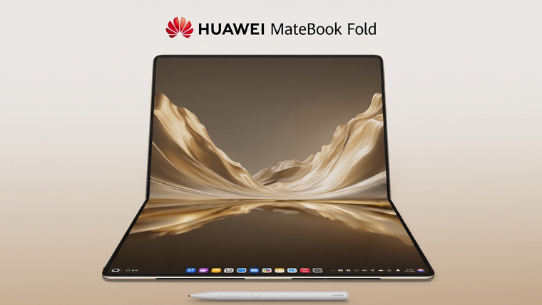
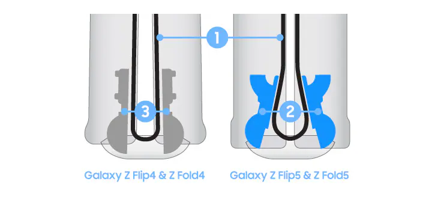
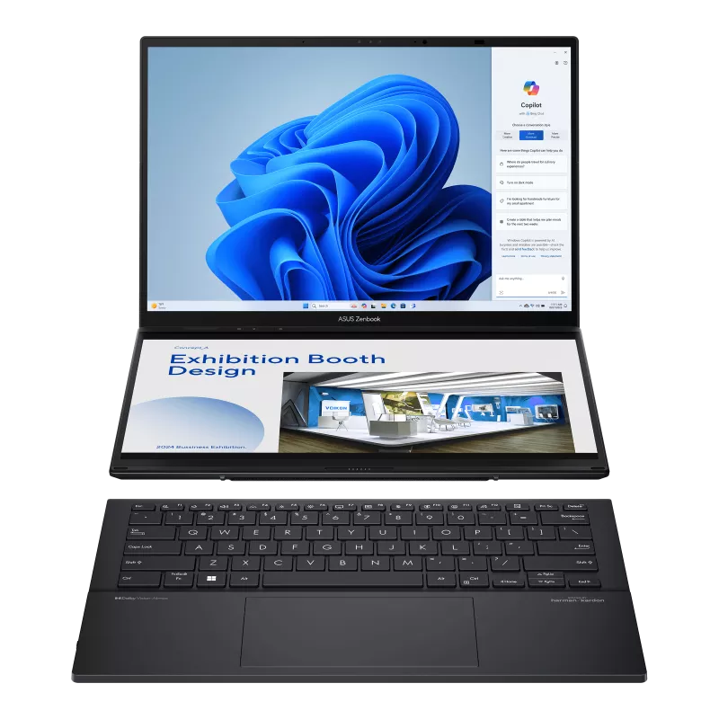
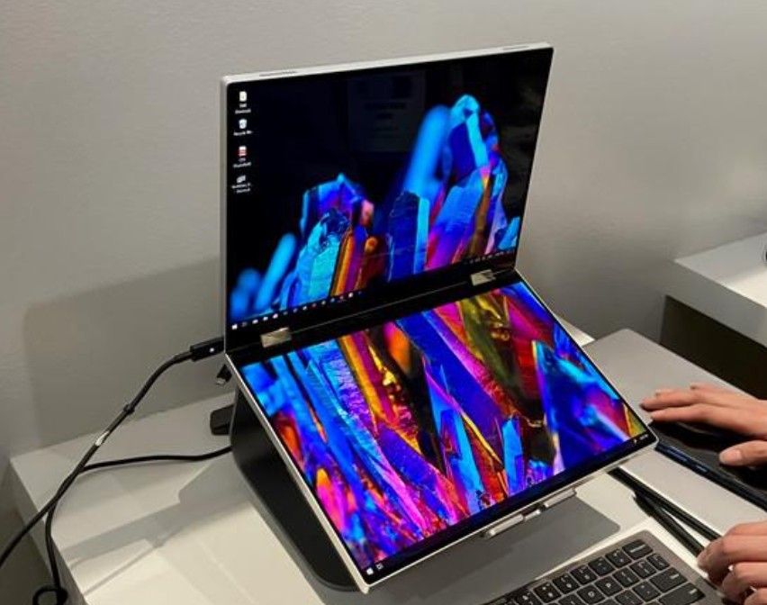
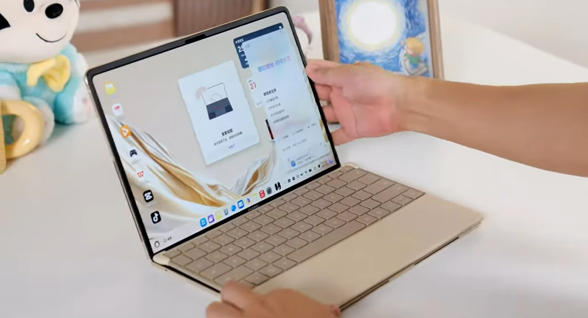

---
#Required fields
title: "Huawei MateBook Fold 2026: Laptop Lipat 18 Inci yang Mungkin Mengubah Definisi PC"
description: "Huawei resmi launching MateBook Fold 2026 dengan layar lipat 18 inci OLED. Apakah ini masa depan laptop, atau cuma gimmick mahal?"
pubDate: 2026-08-09
category: "deepdive"
cover: "../../assets/blog/35/huawei_matebook_fold_unfolded.jpg"
coverAlt: "Huawei MateBook Fold 2026 dalam mode terbuka penuh menampilkan layar 18 inci OLED"

#Core Fields
tags: ["Huawei", "MateBook Fold", "Foldable PC", "OLED", "Laptop", "Kirin X90 Plus", "HarmonyOS"]
author: "Thomas Agung Nugraha"
lang: "id-ID"
draft: false

#recommended
slug: "blog35_huawei_matebook_fold_2026_laptop_lipat_18_inci"
excerpt: "Huawei MateBook Fold 2026 diluncurkan dengan layar 18 inci yang bisa lipat jadi 13 inci. Kirin X90 Plus, Dual-Layer OLED, dan harga 24.999 yuan. Tapi apakah virtual keyboard bisa menggantikan keyboard fisik?"
updatedDate: 2026-08-09

#Optional:SEO & Indexing
canonicalURL: "https://t-agung.id/blog/blog35_huawei_matebook_fold_2026_laptop_lipat_18_inci"
keywords:
  - Huawei MateBook Fold 2026
  - laptop lipat OLED
  - foldable PC
  - Kirin X90 Plus
  - Huawei StarLeap keyboard
  - ASUS ZenBook Duo
  - Dell Concept Duet
  - Lenovo Yoga Book C930
  - haptic feedback keyboard
  - HarmonyOS 6.1
noindex: false

#Optional-table-of-content
showToc: true

#optional-internal linking
relatedPosts:
  - blog_11_hp_lipat_crease
  - blog22_vivo_x_fold_6_teknologi_layar_lipat_2026
  - blog23a-vehicle-tech-week-europe-2026-kabin-battle
  - oled-deepdive-1-apa-itu-oled
---
Baru-baru ini Moko duduk di atas keyboard saya dengan ekspresi khasnya: seperti dia sedang menyetujui, menentang, atau menguji apakah laptop ini bisa menjadi tempat tidur yang layak. Tiga hari sebelumnya, Huawei mengumumkan sesuatu yang menarik perhatian saya: MateBook Fold 2026, laptop dengan layar 18 inci yang bisa dilipat menjadi 13 inci. Satu panel OLED utuh, bukan dua layar yang disambung paksa.

*Huawei MateBook Fold Ultimate Design 2026, layar 18 inci Dual-Layer OLED yang bisa dilipat* source:Huawei

Device ini diluncurkan 5 Agustus lalu di Beijing. Dan sebagai orang yang pernah bekerja di tim arsitektur VAIO Sony, lalu di Intel untuk display technology, dan sekarang di Motherson untuk automotive HMI, saya harus bilang: ini bukan prototype yang akan mati di pameran. Ini produk nyata. Dan ini membuat saya penasaran.

Tapi sebelum kita masuk ke detail, satu hal perlu diluruskan: **ini bukan produk baru**. Huawei sebenarnya sudah meluncurkan MateBook Fold generasi pertama pada 19 Mei 2025, dan mulai dijual 6 Juni 2025. Yang baru-baru ini diumumkan adalah **versi 2026, refresh generasi kedua** dari laptop lipat yang sama.

Jadi pertanyaannya: apa yang berubah?

Secara singkat: hampir semuanya disentuh. Chip-nya naik dari Kirin X90 ke **Kirin X90 Plus**, 25 persen lebih cepat dengan TDP yang tetap di 28 watt. Sistem operasinya dari HarmonyOS 5 ke **HarmonyOS 6.1**. Dan yang paling terasa dari segi hardware, engselnya didesain ulang. Huawei pakai **waterdrop hinge yang lebih besar** dengan komponen liquid metal berbasis zirconium, yang membuat mekanisme lipat lebih mulus dan tahan lama.

Ada juga beberapa fitur yang sebelumnya tidak ada. Tahun ini Huawei akhirnya dukung **AI M-Pencil 3**, stylus yang bisa dipakai untuk annotasi, menggambar, dan kontrol gestur. Charging-nya meningkat signifikan dari 66W ke **140W wired fast charging**, jadi ngecas penuh baterai 74.69Wh tidak butuh waktu lama lagi. Dan untuk pertama kalinya, ada tiga varian memori: 24GB/512GB, 24GB/1TB, dan 32GB/2TB. Versi 2025 hanya ada satu varian 32GB saja.

Harga? Sedikit lebih mahal. Di negeri asalnya, dimulai dari 24,999 Yuan, naik dari 23,999 Yuan di versi 2025. Tapi untuk upgrade yang cukup signifikan, angka itu masuk akal.

## Spesifikasi yang Bikin Ngiler

Mari kita intip dulu apa yang ada di dalam perangkat ini.

Layar utamanya adalah **18 inci Dual-Layer Tandem OLED**, resolusi 3,296 x 2,472 piksel alias 3.3K, dengan rasio aspek 4:3. Peak HDR brightness nyampe 1,600 nits dengan LTPO adaptive refresh rate, rasio screen-to-body 92%, color gamut P3, dan kontras 2,000,000:1. Seluruhnya dilapisi **ultra-thin glass (UTG)** yang cukup kuat untuk dilipat berkali-kali tanpa pecah.

Untuk yang belum familiar dengan Dual-Layer Tandem OLED: ini teknologi di mana dua lapisan OLED ditumpuk vertikal. Hasilnya, brightness bisa meningkat signifikan dibanding OLED konvensional karena setiap lapisan hanya perlu mengeluarkan setengah cahaya. Saya sudah bahas ini mendalam di seri OLED Deepdive kami. Intinya, ini cara Huawei mengatasi masalah brightness pada panel OLED ukuran raksasa.

Di sisi performa, ada **Kirin X90 Plus** dengan TDP 28 watt. Huawei klaim 25 persen lebih kencang dari pendahulunya. RAM tersedia dalam varian 24GB atau 32GB, dan penyimpanan NVMe SSD mulai dari 512GB hingga 2TB. Sistem operasinya adalah **HarmonyOS 6.1 PC Edition**.

Yang cukup mengesankan dari segi engineering: perangkat ini hanya **7,3mm tebal** saat dibuka penuh dan beratnya **1,16kg**. Untuk konteksnya, MacBook Pro 14 inci beratnya 1.6kg, dan itu tanpa layar lipat. Huawei berhasil memasukkan layar 18 inci ke dalam bodi yang lebih ringan dari laptop 14 inci standar.

Baterainya 74.69Wh dengan dual-cell 6,400mAh, didukung charging 140W GaN. Kamera depan 8MP, speaker array 6 unit, dan 4 mikrofon far-field. Ada juga dukungan **AI M-Pencil 3** untuk yang butuh input stylus.

## Engineering di Balik Waterdrop Hinge

Waterdrop hinge udah ada dari zaman dulu waktu Samsung, tapi tantangan untuk make waterdrop hinge di tablet atau laptop beda.

*Samsung udah make Waterdrop Hinge untuk HP lipatnya* source:Samsung

Di sinilah cerita jadi menarik. Engsel yang dipakai Huawei disebut **waterdrop hinge** dengan komponen **liquid metal berbasis zirconium**, jujur saya juga kurang mudeng tentang apa itu zirconium. Tapi katanya ini memungkinkan device untuk di-hover di berbagai sudut antara 30 sampai 150 derajat, dan saat dilipat penuh, gap-nya nyaris nol.

Ketika saya bekerja di Sony VAIO Architecture Team antara 2008 hingga 2013, salah satu tantangan terbesar dalam desain laptop tipis adalah engsel. Engsel harus kuat, presisi, dan bertahan setelah ribuan kali buka-tutup. Layar tidak boleh goyang saat diketuk, dan engsel tidak boleh terlalu kaku sehingga menutup sendiri. Sekarang bayangkan tantangan yang sama, tapi layarnya bisa DILIPAT.

Masalah crease pada layar lipat sudah saya bahas di artikel sebelumnya. Crease itu terjadi karena material OLED memiliki titik di mana lipatan berulang-ulang menyebabkan degradasi. Solusi Huawei di sini melibatkan UTG (ultra-thin glass) yang jauh lebih rigid dari plastik, dikombinasikan dengan hinge design yang meminimalkan tekanan di area lipatan. Waterdrop hinge dirancang supaya panel melengkung perlahan seperti air yang mengalir, bukan melipat tajam seperti kertas.

Ini bukan hal baru di smartphone lipat, tapi melakukan hal yang sama untuk panel 18 inci adalah level engineering yang berbeda sepenuhnya. Area permukaan yang dilipat lebih dari empat kali lipat dibanding foldable phone. Toleransi kesalahan harus lebih ketat. Material fatigue harus diuji lebih lama.

Dan Huawei mengklaim mereka berhasil.

## Sejarah Panjang Kegagalan PC Dua-Layar

Sebelum kita lanjut ke apa yang benar-benar membuat artikel ini penting, kita perlu lihat ke belakang. Karena Huawei bukan satu-satunya yang punya ide laptop dua layar. Ide ini sudah coba berkali-kali, dan semuanya gagal dengan cara yang berbeda-beda.

### ASUS ZenBook Duo: Yang Paling Dekat Tapi Tidak Sampai

ASUS mungkin pemain paling konsisten di ruang ini. Sejak 2020, mereka merilis ZenBook Duo (UX541) dengan layar utama 15.6 inci dan ScreenPad Plus 14 inci di bawahnya. Konsepnya: layar bawah bisa dipakai sebagai extended workspace atau sebagai virtual keyboard.

*ASUS ZenBook Duo dengan ScreenPad Plus, layar kedua yang bisa berfungsi sebagai virtual keyboard* source:ASUS

ASUS perbarui konsep ini beberapa kali. ZenBook Duo 14 di 2021, ZenBook Duo UX5402 di 2024 dengan dua layar 14 inci, dan versi terbaru di 2026 dengan dua layar OLED. Tapi sepanjang enam tahun ini, satu hal tidak pernah berubah: **virtual keyboard-nya selalu terasa seperti kompromi**.

Saya pernah coba konsep dua layar ini di salah satu tech expo beberapa waktu lalu. Layarnya memang keren. ScreenPad Plus-nya memang fungsional untuk multitasking. Tapi begitu saya mencoba mengetik di virtual keyboard-nya, pengalaman itu langsung jatuh. Jari saya mengetuk permukaan kaca datar tanpa feedback apa pun. Setiap huruf yang muncul di layar terasa seperti tebakan, bukan konfirmasi.

ASUS tetap mempertahankan seri ZenBook Duo hingga 2026, tapi produk ini tidak pernah mainstream. Ini tetap produk niche untuk kreator yang butuh layar ekstra. Bukan laptop untuk orang kebanyakan.

### Dell Concept Duet: Yang Tidak Pernah Hadir

Di CES 2020, Dell perkenalkan Concept Duet: dua layar 13.4 inci dengan keyboard magnetik yang bisa dilepas. Desainnya minimalis dan futuristik. Penonton di stan Dell bersorak. Media menulis tentang masa depan laptop.

Tiga tahun berlalu. Dell Concept Duet **tidak pernah diluncurkan**.

*Dell Concept Duet, konsep dua layar yang dipamerkan di CES 2020 tapi tidak pernah dipasarkan*

Mengapa? Karena Dell menyadari bahwa perangkat ini memiliki masalah fundamental: software belum siap, tidak ada killer app untuk dual screen, dan keyboard fisik-nya terasa seperti afterthought. Tapi yang paling fatal, mereka tahu mengetik di kaca tidak pernah akan terasa natural.

### Lenovo Yoga Book C930: Master of None

Lenovo juga pernah coba. Yoga Book C930 di tahun 2018 menggunakan layar e-ink sebagai keyboard sekunder. Konsepnya cerdas: e-ink ringan, tahan lama, dan bisa menampilkan layout keyboard. Masalahnya: **e-ink tidak memberikan feedback tactile sama sekali**.

Reviewer di waktu itu menyebutnya "master of none". Bukan laptop yang baik, bukan tablet yang baik, dan bukan e-reader yang baik. Mengetik di permukaan e-ink terasa seperti mengetuk meja plastik. Jari kamu menyentuh sesuatu yang datar dan tidak responsif. Setelah lima menit, pergelangan tangan mulai tegang. Setelah sepuluh menit, produktivitas sudah turun drastis.

### Benang Merah yang Sama

Tiga brand besar. Tiga pendekatan berbeda. Satu kesamaan: **semuanya mengorbankan sensasi keyboard fisik**.

ASUS mencoba virtual keyboard di layar LCD. Dell mencoba layar datar tanpa keyboard tetap. Lenovo mencoba e-ink yang tidak bisa memberikan tekanan balik. Semua gagal karena satu alasan yang sama: mereka menghilangkan elemen paling fundamental dari sebuah laptop, yaitu **rasa sentuhan jari pada tombol yang memberi feedback**.

## Masalah Keyboard: Jantung Artikel Ini

Mari kita bicara jujur. Apa yang membedakan laptop dari tablet? Layarnya yang bisa dibuka? Bukan. RAM-nya yang lebih besar? Bukan. Sistem operasinya? Bisa jadi tablet juga pakai Windows.

Yang membedakan laptop dari tablet adalah **keyboard fisik**.

Ketika kamu mengetik, jari kamu tidak hanya menyentuh tombol. Jari kamu merasakan tekanan, kedalaman, dan titik di mana karakter tercatat. Sensasi ini disebut tactile feedback, dan ini bukan detail kecil. Ini koneksi langsung antara pikiran dan output. Waktu kita berpikir cepat, jari juga ikut ngetik. Ketika setiap penekanan tombol memberikan konfirmasi fisik, pikiran dan tangan bergerak sebagai satu unit.

Menghilangkan keyboard fisik seperti meminta seseorang menulis surat dengan tongkat bukan pulpen. Tongkat bisa membuat goresan, tapi tanpa sentuhan yang terasa, setiap huruf jadi usaha sadar yang melelahkan. Kamu harus melihat ke layar untuk memastikan hurufnya benar. Alur pikiran terputus. Kecepatan turun. Frustrasi naik.

Saya mengalami ini sendiri saat pertama kali menggunakan Tablet dengan virtual keyboard untuk menulis email panjang. Setelah sekitar 150 kata, saya sadar tangan saya sudah capek. Bukan karena jari saya lelah mengetik, tapi karena otak saya bekerja ekstra untuk memverifikasi setiap huruf. Di laptop, verifikasi itu terjadi di ujung jari, bukan di otak.

Ketika kamu menghilangkan keyboard fisik, kamu memutuskan hubungan antara jari dan pikiran. Mengetik di kaca atau e-ink terasa terputus, seperti berteriak di ruang kosong tanpa gema.

## Pendekatan Huawei: Solusi yang Berbeda

Di sinilah Huawei mengambil jalur yang berbeda dari ASUS, Dell, dan Lenovo.

Huawei **tidak mencoba menggantikan keyboard fisik**. Alih-alih, mereka menyertakan **Huawei StarLeap** sebagai aksesori terpisah: keyboard portabel dengan konektivitas magnetik dan wireless, key travel 1.5mm, dan pressure-sensitive touchpad. Keyboard ini bukan built-in, tapi bisa dipasangkan dan dilepas dengan mudah.

*Berbagai mode penggunaan: tablet dengan virtual keyboard, laptop dengan StarLeap keyboard, dan desktop mode* source:Huawei

Ini adalah filosofi yang berbeda. Huawei bilang: "Ya, kamu bisa pakai virtual keyboard saat layar dilipat setengah. Tapi kalau kamu butuh mengetik serius, kamu punya pilihan keyboard asli."

Device ini memang bisa berfungsi sebagai tablet dengan virtual keyboard saat dilipat sebagian. Bagian bawah layar berubah menjadi virtual keyboard dan touchpad. Tapi kamu juga punya opsi StarLeap dengan key travel 1.5mm yang memberikan sensasi mengetik yang nyata.

Pendekatan ini jauh lebih jujur daripada mencoba meyakinkan pengguna bahwa mengetik di kaca itu oke. Huawei mengakui bahwa untuk produktivitas sesungguhnya, orang butuh keyboard fisik. Mereka tidak menghapusnya. Mereka membuatnya opsional.

Bagi saya yang pernah terlibat dalam desain UX, ini adalah pelajaran yang seharusnya sudah dipelajari industri lebih awal. Tablet yang hebat tetap butuh input fisik yang bagus. Keyboard virtual bisa dipakai untuk hal-hal cepat, tapi untuk kerja serius, jari manusia membutuhkan sesuatu yang bisa dirasakan.

## Teaser: Teknologi Haptic Feedback sebagai Kunci Masa Depan

Kalau virtual keyboard ingin benar-benar menggantikan keyboard fisik, satu teknologi harus matang dulu: **active haptic feedback**. Bukan sekadar getaran motor kecil yang kita kenal dari smartphone. Tapi feedback yang benar-benar bisa dirasakan oleh ujung jari sebagai tekanan, kedalaman, dan klik yang nyata di permukaan datar.

Saya berencana membahas topik ini secara mendalam di artikel mendatang. Tapi untuk petunjuk awal, ingat **Grewus HapForce** yang kita bahas di artikel tentang Interior Expo 2026. Teknologi haptic mereka menunjukkan bahwa permukaan datar bisa disetel untuk memberikan sensasi tekstur dan tombol yang berbeda-beda. Bayangkan jika teknologi seperti ini diterapkan ke keyboard virtual di laptop lipat. Jari kamu akan merasakan tombol-tombol yang tidak ada secara fisik, tapi terasa nyata.

Kalau ini bisa direalisasikan dengan biaya yang masuk akal, maka seluruh narasi tentang "keyboard virtual tidak akan pernah menggantikan keyboard fisik" bisa berubah. Tapi kita belum sampai di situ. Saat ini, haptic feedback masih dalam tahap eksperimental untuk aplikasi consumer. Dan biayanya belum ekonomis untuk mass production, belum lagi complexity dari design-nya.

Jadi sampai teknologi haptic aktif benar-benar matang, keyboard fisik tetap raja.

## Sudut Pandang Display Engineering

Sebagai seseorang yang pernah bekerja di tiga perusahaan yang berurusan langsung dengan display technology, saya punya apresiasi khusus untuk apa yang Huawei capai di sini.

Di Sony VAIO Architecture Team antara 2008 dan 2013, saya belajar bahwa layar laptop bukan hanya display yang harus tipis. Ini adalah ekosistem yang melibatkan thermal management, structural integrity, optical coating, dan mechanical tolerance. Saat Sony merilis VAIO Z series, kami harus memastikan panel tipis tetap flat di bodi yang ramping. Sekarang bayangkan panel yang harus melengkung dan melipat.

Di Intel antara 2015 dan 2018, saya bekerja di tim display technology dan memegang patent EP3098699 terkait display interface optimization. Di sana saya paham betul betapa rumitnya menyinkronkan sinyal display di panel yang berubah bentuk. Saat layar dilipat, koneksi flex cable harus tetap stabil, timing signal harus konsisten, dan color uniformity harus terjaga di seluruh area termasuk sekitar lipatan.

Sekarang di Motherson, di mana saya terlibat dalam pengembangan HMI untuk mobil, saya melihat tantangan serupa di skala yang lebih besar. Dashboard kokpit mobil bisa panjangnya 30 inci lebih, dengan panel yang melengkung mengikuti kontur interior. Manajemen untuk resiko, durability testing, dan thermal expansion di panel melengkung adalah tantangan yang tidak jauh berbeda dengan apa yang Huawei hadapi di MateBook Fold, hanya skalanya berbeda.

Melihat Huawei berhasil membuat panel OLED 18 inci yang bisa dilipat dengan crease yang minimal, dengan waterdrop hinge yang presisi, dan UTG yang cukup kuat untuk tahan terhadap lipatan berulang, ini adalah pencapaian engineering yang serius. Bukan gimmick.

## Harga dan Ketersediaan

MateBook Fold 2026 dijual mulai dari CNY 24,999 untuk varian 24GB/512GB, hingga CNY 29,999 untuk 32GB/2TB. Dalam dolar AS, ini sekitar USD 3,700 hingga 4,440. Dalam rupiah, kira-kira Rp55 sampai 65 juta.

Untuk konteksnya, MacBook Pro 14 inci dengan M3 Pro dijual sekitar USD 1,999. Jadi Huawei meminta hampir dua kali lipat harga MacBook Pro untuk layar lipat 18 inci. Mahal? Ya. Tapi ini bukan laptop untuk pasar massal. Ini device untuk early adopter, kreator, dan profesional yang butuh fleksibilitas ekstrem.

Saat ini, perangkat ini hanya tersedia di China. Tidak ada jadwal resmi untuk peluncuran global. Mau beli di Indonesia? Secara resmi, kemungkinan tidak akan tersedia dalam waktu dekat. Tapi parallel import selalu ada, dan komunitas tech importer di Jakarta sudah cukup mapan untuk barang-barang segini.

Warna yang tersedia: Flowing Light Gold, Horizon White, dan Phantom Black. Tiga opsi yang elegan, meski saya pribadi akan memilih Phantom Black supaya sidik jari tidak terlalu kelihatan.

## Kesimpulan: Bukan Gimmick, Tapi Pertanyaan yang Belum Terjawab

Huawei MateBook Fold 2026 bukan gimmick. Ini adalah pencapaian engineering yang serius, gabungan antara Dual-Layer Tandem OLED, Kirin X90 Plus, waterdrop hinge, dan UTG yang bekerja bersama sebagai satu sistem yang koheren.

Tapi pertanyaan mendasar tetap ada: bisakah laptop benar-benar menggantikan keyboard fisik?

Huawei menjawabnya dengan pendekatan pragmatis: ya, selama kamu punya opsi keyboard fisik di tangan. StarLeap mereka adalah jawaban yang jujur, bukan ilusi. Device ini bisa jadi tablet, bisa jadi laptop, dan bisa jadi hybrid di antaranya. Yang penting, saat kamu butuh mengetik panjang, jari kamu tetap punya tempat untuk bertumpu.

Industri masih mencari jawaban yang lebih elegan. Mungkin jawabannya ada di active haptic feedback yang akan kami bahas nanti. Mungkin jawabannya ada di pendekatan Huawei: jangan hapus keyboard, buat saja opsional. Atau mungkin, jawabannya belum ditemukan sama sekali.

Yang pasti, MateBook Fold 2026 bukan akhir dari cerita. Ini babak baru. Dan saya akan mengikuti perkembangannya dengan mata terbuka lebar, persis seperti Moko saat dia mengamati saya mengetik artikel ini.

---

