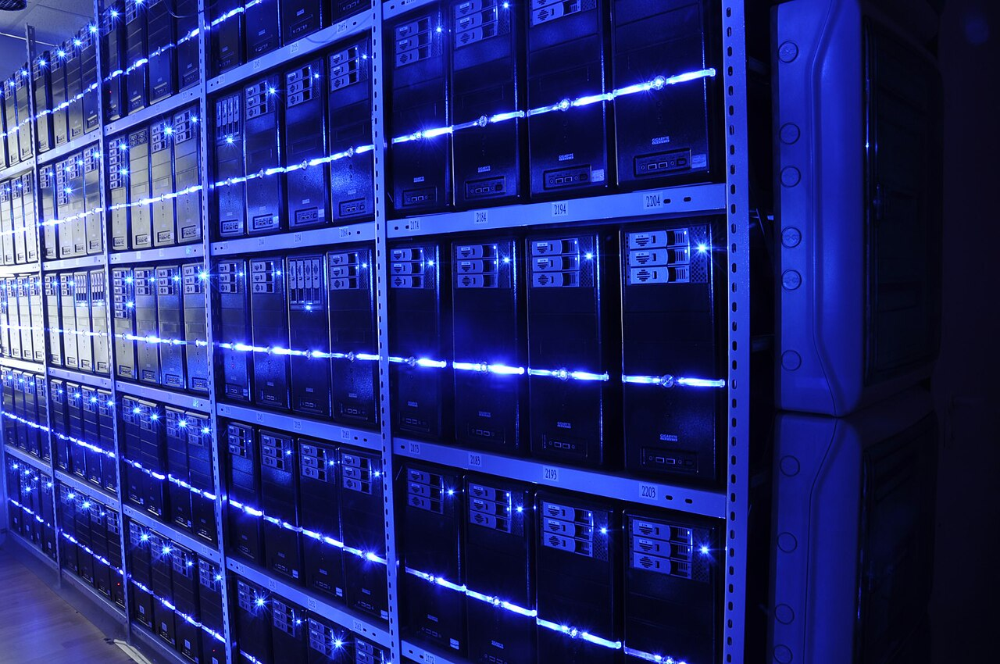
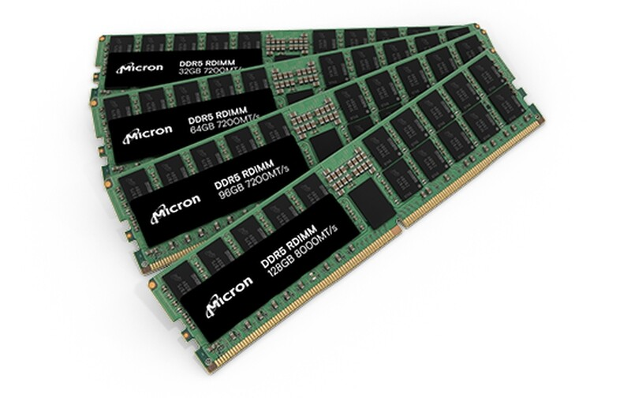
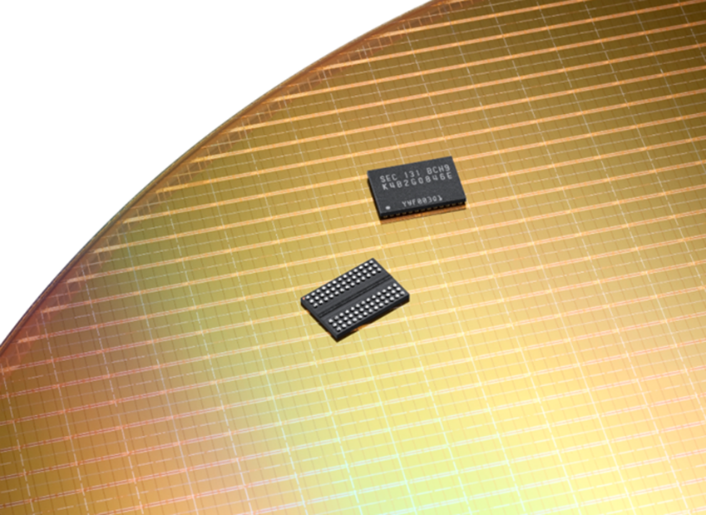
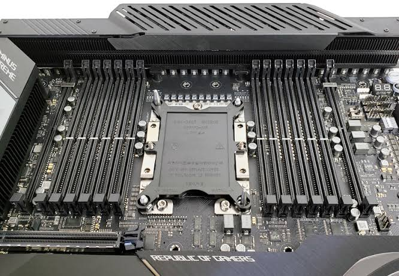
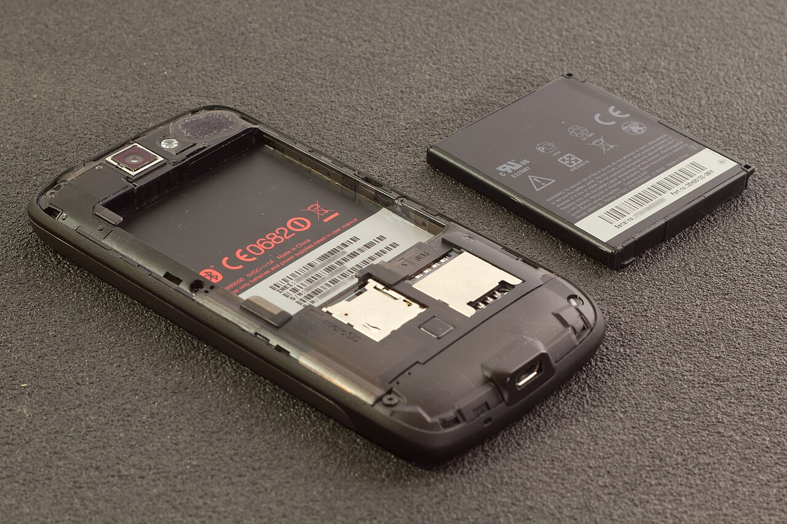

---
#Required fields
title: "Memory Supercycle: AI Bikin RAM Mahal, HP dan PC Kita yang Nanggung"
description: "Boom AI bikin harga DRAM dan HBM melonjak 12,5 kali lipat dalam 3 tahun. Samsung cetak laba rekor, tapi harga HP, PC, dan motherboard kita ikut naik. Ini yang terjadi di dompet kita, dan kenapa pakai lebih awet justru jadi jalan keluar."
pubDate: 2026-08-26
category: "produk"
cover: "../../assets/blog/36/01_datacenter.jpg"
coverAlt: "Barisan rak server di dalam data center yang menggerakkan boom AI"
tags: ["memory supercycle", "RAM", "harga HP", "PC", "AI", "DRAM"]
author: "Thomas Agung Nugraha"
lang: "id-ID"
slug: "blog37_memory_supercycle_harga_hp_pc"
#recommended
excerpt: "Era HP dan PC murah sedang berakhir. Biang keroknya bukan layar, bukan kamera, tapi satu komponen yang jarang kita lihat: memory. AI makan semua supply RAM, dan kita yang beli di kasir yang nanggung."
updatedDate: 2026-08-27
#Optional:SEO & Indexing
canonicalURL: "https://t-agung.id/blog/blog37_memory_supercycle_harga_hp_pc"
keywords:
  - memory supercycle
  - harga RAM 2026
  - harga HP naik
  - PC lebih mahal
  - DRAM HBM
  - Samsung memory laba
  - motherboard diskon
  - baterai bisa diganti
noindex: false
#Optional-table-of-content
showToc: true
#optional-internal linking
relatedPosts:
  - blog33_giias_2026_omoda_o4_ev_agentic_ai_cockpit_gemini_spark
  - blog29_samsung_galaxy_unpacked_2026_flex_titanium
  - blog32_giias_2026_preview
draft: false
---

Belakangan ini banyak yang bilang harga HP dan PC lagi naik, dan itu bukan cuma perasaan. Di balik kenaikan itu ada satu komponen yang jarang sekali kita pikirkan waktu beli gadget: memory, atau RAM. Tahun 2026 ini RAM sedang jadi "raja" yang bikin semua harga ikut naik. Dan yang paling kena? Kita, orang biasa yang beli di toko.

Pertanyaannya sederhana: kenapa HP dan PC tiba-tiba makin mahal, padahal speknya nggak melompat jauh? Jawabannya ada di balik layar, di dunia data center dan pabrik chip yang jarang kita lihat.

## Kenapa memory jadi raja

Semua bermula dari AI. Ketika data center mulai dibangun masif untuk model AI, mereka butuh dua hal utama: GPU dan memory berkecepatan tinggi. GPU buat ngitung, tapi GPU nggak bisa kerja cepat kalau memory-nya lambat. Maka lahir demand yang gila untuk DRAM server dan HBM, yaitu memory 3D-stacked yang ditempel langsung di GPU.

*Barisan rak server di dalam data center. Boom AI di sini yang "memakan" hampir semua supply DRAM.* source:Wikimedia Commons

*Chip DRAM, komponen yang harganya melonjak 12,5 kali lipat dalam 3 tahun karena demand AI.* source:Micron

Masalahnya, DRAM itu pasokannya terbatas. Pabrik chip, baik Samsung, SK Hynix, maupun Micron, punya kapasitas produksi yang sudah "dimakan" dulu oleh pesanan data center dan HBM yang marginnya jauh lebih tebal. Akibatnya, supply DRAM untuk kelas consumer, yaitu RAM untuk HP dan PC, jadi sisa.

Menurut TrendForce, harga export DRAM melonjak sekitar 12,5 kali lipat dalam 3 tahun terakhir. Gartner bahkan memperkirakan kombinasi harga DRAM dan SSD akan naik 130 persen menjelang akhir 2026. Bayangkan, angka 130 persen itu bukan untuk komponen yang baru, tapi untuk komponen yang sudah ada dari dulu.

Saya ingat waktu masih di pabrik di Jepang dulu, komponen sekecil apa pun punya "harga pasar" yang fluktuatif banget. Ada masa di mana satu part yang biasa-biasa aja harganya naik dua kali lipat dalam beberapa bulan gara-gara satu aplikasi baru yang meledak. Waktu itu saya pikir itu cuma siklus biasa. Ternyata 2026 ini adalah versi super dari siklus itu, tapi skala global, dan yang jadi "aplikasi baru" yang meledak adalah AI.

Kalau mau gampang ngebayanginnya, coba pikirin pasar di kampung. Ada pabrik besar datang, beli semua beras yang ada, karena mereka butuh buat produksi dalam jumlah banyak. Nggak lama, warung kecil di pojokan cuma dapat sisa. Harga beras di warung itu pasti naik, bukan karena berasnya jadi langka secara total, tapi karena yang beli paling banyak adalah yang paling mampu. DRAM consumer di posisi warung itu. Pabrik AI beli duluan, kita yang beli di kasir yang dapat harga sisa.

## Samsung: si pemenang

Nah, siapa yang paling untung dari semua ini? Jawabannya jelas: Samsung. Di kuartal II 2026, Samsung mengumumkan pendapatan KRW 171,5 triliun, rekor tertinggi sepanjang sejarah. Laba operasionalnya KRW 89,5 triliun, naik 1.800 persen dibanding kuartal yang sama tahun lalu. Yang jadi mesin utama? Divisi memory: DRAM, HBM, dan NAND.

Tapi ada satu hal yang sering luput dari berita. Di saat divisi chip-nya mencetak rekor, divisi HP Samsung (MX) justru mencatat kerugian di kuartal yang sama, salah satunya karena biaya komponen, termasuk memory, naik. Artinya, bisnis chip-nya yang menang, bisnis HP-nya yang justru nanggung, dan pada akhirnya kita sebagai pembeli yang ikut.

Bahkan para pekerja di divisi chip Samsung dapat bonus yang gila. Lewat kesepakatan profit-sharing 10 tahun yang diratifikasi 27 Mei 2026, pekerja di divisi memory dilaporkan rata-rata menerima bonus sekitar £310.000 per orang, berdasarkan laporan The Guardian. Ini bukan angka kecil, dan bukan cuma satu orang.

Jadi gini rasanya: orang yang bikin RAM-nya yang dapat bonus besar-besaran. Orang yang beli HP-nya yang nanggung harga naik. Itu realita dari memory supercycle ini.

*Wafer semikonduktor. Di pabrik seperti inilah DRAM dan HBM yang jadi mesin laba Samsung diproduksi.* source:Samsung 

## Dompet orang biasa: harga naik, unit turun

Bagian ini yang paling langsung ngena ke dompet kita: harga HP dan PC. Gartner memperkirakan harga PC akan naik sekitar 17 persen dan harga smartphone naik sekitar 13 persen dibanding 2025, akibat lonjakan biaya memory. Yang lebih mengkhawatirkan, pasar PC entry-level di bawah USD 500 diprediksi bakal mulai hilang menjelang 2028.

IDC mencatat pengiriman PC global turun 11,3 persen di 2026. Kenapa turun? Karena harga naik, tapi orang nggak mau bayar harga segitu. Mereka tunda beli. Ini bukan cuma terjadi di Indonesia, tapi global. Istilah yang lagi banyak dipakai analis: "the cheap smartphone era is over." Era HP murah, memang sudah berakhir.

Yang bikin ini terasa dekat bukan cuma angka, tapi perilaku orang di sekitar kita. Banyak yang menunda ganti HP karena harga baru yang keluar sekarang terasa nggak masuk akal. Banyak juga yang tetap pakai HP 4 sampai 5 tahun karena ganti itu "nggak worth it." Dan di dunia PC, banyak yang berhenti merakit PC rakitan karena harga RAM dan komponen lain yang dulu stabil, sekarang melonjak. Kita semua, tanpa sadar, sedang merespons memory supercycle yang sama.

## Motherboard dan DIY PC: ambruk total !

Kalau mau bukti paling nyata bahwa orang mulai berhenti main di dunia PC, lihat motherboard dan komponen DIY. Empat produsen motherboard terbesar, yaitu Asus, ASRock, Gigabyte, dan MSI, memangkas target shipment 2026 mereka hingga 37 persen. Kenapa? Karena AI menguras supply RAM, sehingga harga RAM untuk PC rakitan jadi nggak ekonomis lagi, orang mikir tiga kali, empat kali kalau mau ngerakit PC gaming lagi.

Efeknya, banyak builder berhenti upgrade atau berhenti merakit PC. Motherboard yang tadinya laku, sekarang numpuk di gudang. Numpuknya motherboard itu yang bikin kita lihat diskon-diskon gede di rak-rak toko. Ironisnya, diskon motherboard besar justru tanda pasar DIY sedang lesu, bukan tanda murah dan menguntungkan.

*Slot RAM pada motherboard. Harga RAM yang melonjak bikin pasar rakitan PC lesu.* 

## Squeeze ganda di Indonesia

Di sinilah dompet kita paling kecekik. Di level global, harga HP dan PC sudah naik. Tapi di Indonesia, ada dua lapisan tambahan yang menumpuk di atasnya.

Pertama, inflasi. Menurut BPS, inflasi Juli 2026 berada di 2,88 persen year-on-year, turun dari 3,34 persen di Juni. Angka inflasi memang masih dalam target, tapi inflasi itu tetap menaikkan harga barang, termasuk elektronik, karena biaya produksi dan distribusi ikut naik.

Kedua, nilai tukar rupiah. Rupiah melemah dari sekitar Rp. 16.500 per dolar AS di Agustus 2025 ke kisaran Rp. 17.700 hingga Rp. 18.050 di Agustus 2026, alias melemah sekitar 7 sampai 10 persen dalam setahun. Nah, ini yang sering kita abaikan: hampir semua komponen elektronik, termasuk RAM dan chip, diimpor. Ketika rupiah melemah, harga impor dalam rupiah otomatis naik, bahkan kalau harga globalnya diam.

Jadi hitung-hitungannya begini: harga global naik 13 sampai 17 persen (Gartner), ditambah inflasi 2,88 persen (BPS), ditambah melemahnya rupiah 7 sampai 10 persen. Ketiganya menumpuk. Ambil contoh yang gampang dicerna: sebuah HP yang dulu dijual Rp. 6 juta, kalau biaya globalnya naik 13 persen saja, harga dasarnya jadi sekitar Rp. 6,8 juta. Nanti ditambah komponen impor yang ikut terdampak melemahnya rupiah, dan ditambah inflasi di rantai distribusi. Nggak heran kalau di rak toko harga yang kita lihat sudah di angka yang jauh lebih gigit. Di sinilah memory supercycle benar-benar mendarat di kantong kita, dan efeknya paling keras di produk-produk entry-level yang marginnya paling tipis.

## Jalan keluarnya: pakai lebih awet

Nah, kalau harga terus naik dan kita nggak bisa menghentikan boom AI, apa yang bisa kita lakukan? Jawabannya sederhana: pakai perangkat kita lebih awet.

Bukan cuma soal hemat, pakai lebih lama juga baik untuk lingkungan. Setiap HP atau PC yang kita buang jadi e-waste, yaitu limbah elektronik yang sulit terurai dan banyak mengandung bahan berbahaya. Kalau kita bisa memperpanjang umur perangkat, kita otomatis mengurangi e-waste.

Dan ini bagian yang sering bikin kita salah langkah: kalau baterai HP mulai pendek, solusi paling ekonomis itu ganti baterainya saja, bukan ganti HP baru. Ganti baterai jauh lebih murah, dan HP-nya masih bisa dipakai bertahun-tahun lagi. Selama layar, prosesor, dan komponen lain masih bagus, nggak ada alasan untuk langsung ganti perangkat baru.

*Ganti baterai HP jauh lebih murah daripada ganti HP baru, dan lebih ramah lingkungan. Di awal 2000-an bisa nuker baterai itu normal* 

Ternyata, arah ini mulai diakui lewat regulasi. Uni Eropa lewat Battery Regulation (EU) 2023/1542, khususnya Pasal 11, mewajibkan smartphone dan tablet baru yang dijual di Eropa mulai 2027 memiliki baterai yang bisa dicopot dan diganti oleh pengguna sendiri. Padahal, 15 sampai 20 tahun lalu, di era feature phone, baterai yang bisa dicopot sendiri itu hal yang normal. Yang dulu jadi normal, sekarang harus diwajibkan lewat regulasi.

Memory supercycle ini bukan cerita yang bisa kita lawan dari sisi konsumen. AI akan terus butuh memory, harga akan terus naik, dan rupiah akan terus bergoyang. Yang bisa kita kendalikan hanya satu: berapa lama kita pakai perangkat yang sudah kita miliki. Pakai lebih hati-hati, perbaiki yang bisa diperbaiki, dan ganti hanya bagian yang memang sudah aus. Itu cara paling realistis, paling hemat, dan paling ramah lingkungan di tengah memory supercycle.

# 
