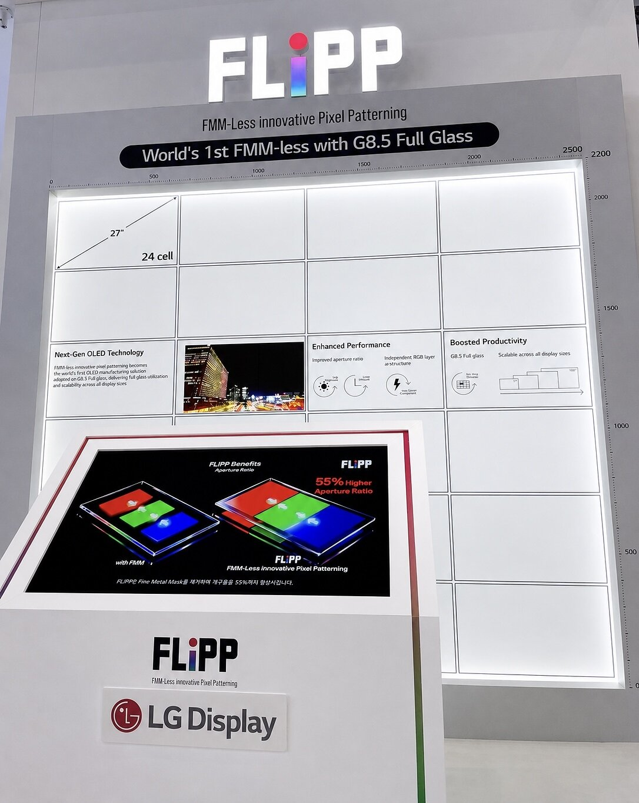

Kalau ada satu hal yang bikin saya frustrasi selama bertahun-tahun duduk di meeting cost review panel, itu bukan material organiknya. Bukan driver IC-nya juga. Mask-nya. Fine Metal Mask, selembar paduan nikel setipis kertas dengan jutaan lubang presisi mikron, yang ternyata menjadi salah satu penyebab utama kenapa panel OLED besar harganya sulit turun.

Dan minggu lalu, di BEXCO Busan, LG Display akhirnya mengumumkan teknologi yang membuang mask itu sepenuhnya. Nama resminya FLiPP, singkatan dari FMM-Less innovative Pixel Patterning. CTO LG Display Choi Young-seok sendiri menyebutnya "dream technology". Di industri display, kata "dream" jarang dipakai untuk teknologi yang sudah bisa diproduksi. Biasanya kata itu dipakai untuk teknologi yang masih di slide presentasi. FLiPP tidak termasuk kategori kedua.

## FMM: Botol Lebar yang Semua Orang Tahu tapi Tak Bisa Diatasi

Buat yang belum familiar, kenapa FMM ini masalah. Ingat pembahasan di artikel [apa itu OLED](/blog/oled-deepdive-1-apa-itu-oled/), di sana saya jelaskan bahwa pixel OLED RGB terbentuk dari deposit material organik ke posisi subpixel yang presisi. Nah, cara konvensional melakukan deposit itu pakai vacuum thermal evaporation: material organik dipanaskan sampai menguap di ruang vakum, lalu diarahkan melewati FMM supaya hanya jatuh di posisi yang benar.

FMM bekerja. Sudah terbukti di skala produksi selama lebih dari dua dekade. Tapi ada dua masalah struktural yang justru makin parah seiring panel membesar.

Masalah pertama soal biaya. Setiap kali produsen ingin membuat panel dengan ukuran atau resolusi berbeda, mask baru harus diproduksi. Mask ini instrumen presisi yang mahal, dan fabrikasinya butuh waktu lead time yang nggak trivial. Ini fix-cost yang tidak bisa dihilangkan lewat negosiasi volume.

Masalah kedua soal fisika. Mask besar terbuat dari logam. Logam punya berat sendiri. Saat proses evaporasi berlangsung, mask yang direntangkan di frame bisa melar atau sagging di bagian tengahnya. Pergeseran beberapa mikron sudah cukup bikin lubang mask tidak lagi sejajar dengan posisi subpixel yang seharusnya. Akibatnya: color mixing, cacat warna antar subpixel, dan yield yang turun.

Di panel kecil seperti layar ponsel, toleransi ini masih OK. Di panel monitor 27 inci, sudah mulai terasa. Di TV 65 inci dengan substrate gen 8.5, FMM praktis tidak bisa dipakai untuk patterning RGB langsung. Inilah alasan fundamental kenapa industri TV OLED selama ini pakai arsitektur WOLED: white OLED yang difilter color filter, bukan RGB langsung. Kualitas warna WOLED memang sedikit kalah murni dari RGB langsung, karena color filter menyerap sebagian cahaya yang dipancarkan. Tapi selama FMM ada, tidak ada pilihan lain.

*Foto resmi LG Display FLiPP dari press release IMID 2026.*

## Bagaimana FLiPP Bekerja: Cetak Dulu, Potong Setelahnya

FLiPP mengganti seluruh konsep stencil dengan pendekatan yang sebenarnya sudah akrab di industri semikonduktor: fotolitografi. Alih-alih menguapkan material organik melewati lubang mask, FLiPP melapisi (coating) material RGB secara berurutan di seluruh permukaan substrate, lalu menggunakan cahaya UV presisi untuk mengukir dan menghilangkan material di area yang tidak dibutuhkan.

Bayangkan FMM itu seperti membuat stiker dengan cara menekan cetakan logam ke kertas, setiap posisi harus presisi sejak awal dan tidak ada ruang koreksi. FLiPP itu seperti mencetak gambar penuh ke kertas dulu, baru menggunting bagian yang tidak diinginkan dengan presisi tinggi. Prosesnya lebih panjang, tapi tidak ada lagi ketergantungan pada satu komponen presisi yang bisa melar.

Dampak langsungnya terlihat di angka aperture ratio, yaitu proporsi area pixel yang benar-benar memancarkan cahaya. Tanpa mask yang memakan space untuk struktur penahan, aperture ratio FLiPP naik sekitar **55 persen** dibanding panel FMM dengan kondisi identik. Angka aperture ratio ini kemudian bisa "dibeli" dalam bentuk yang berbeda tergantung aplikasi:

- Brightness naik hingga **1.6x**, kalau aplikasinya butuh cahaya maksimal, seperti display outdoor atau kokpit mobil
- Umur panel bertambah **2.4x**, kalau aplikasinya butuh lifetime panjang, seperti TV
- Konsumsi daya turun **13 persen**, kalau aplikasinya butuh efisiensi, seperti wearable atau tablet

Satu proses, tiga keuntungan yang bisa dipilih sesuai kebutuhan produk. Fleksibilitas ini yang tidak dimiliki proses FMM konvensional.

## Kejujuran Teknis: Ini Bukan Inkjet Printing

Saya perlu klarifikasi satu hal karena banyak media yang keliru. Ada tren maskless OLED lain yang berbasis inkjet printing, misalnya IJP OLED dari TCL CSOT yang sudah dipakai di Lenovo Legion R9000P. Ada juga jalur fotolitografi lain, eLEAP dari JDI, yang tidak berbasis inkjet. Beberapa laporan awal keliru menulis FLiPP sebagai bagian dari tren inkjet printing itu. Itu tidak tepat.

FLiPP memakai <u>photolithography</u>, bukan inkjet. LG Display secara eksplisit menyebut FLiPP dikembangkan dari proprietary technology mereka sendiri, memanfaatkan infrastruktur produksi Tandem WOLED berukuran besar yang sudah mereka operasikan. Ini penting karena membedakan dua jalur maskless OLED yang berbeda:

| Aspek             | FLiPP (LG)                     | IJP (TCL CSOT)              | eLEAP (JDI)     |
| ----------------- | ------------------------------ | --------------------------- | --------------- |
| Metode patterning | Coating + fotolitografi UV     | Inkjet printing             | Fotolitografi   |
| Status            | Diumumkan, produksi akhir 2027 | Sudah komersial (t12)       | Belum komersial |
| Substrate         | Gen 8.5 satu keping utuh       | 5.5-gen (t12), 8.6-gen (t8) | Belum diumumkan |
| Produk            | Belum ada                      | Lenovo Legion R9000P        | Belum ada       |

Perbedaan jalur ini akan menentukan siapa yang sampai finish lebih dulu, dan siapa yang skalanya lebih murah.

## Gen 8.5 Satu Keping: Angka yang Sering Terlewat

Ada satu klaim LG yang menurut saya paling underrated dari seluruh pengumuman FLiPP: untuk pertama kalinya, panel OLED FMM-less dibuat di mother glass gen 8.5 (2,200 x 2,500 mm) sebagai satu keping utuh, tanpa dipotong dua.

Kenapa ini penting? Karena proses FMM konvensional, dan bahkan beberapa metode maskless lain, terpaksa memotong substrate gen 8.5 menjadi dua bagian (half-cut) sebelum patterning, karena ukuran stick FMM tidak sanggup menutupi substrate penuh. Setengah keping berarti setengah efisiensi. Setengah keping juga berarti garis potong (scribe line) yang memakan area aktif panel.

Dengan FLiPP, seluruh surface gen 8.5 diproses dalam satu run. LG Display mengklaim efisiensi pemanfaatan mother glass naik hingga 64 persen dibanding metode FMM atau maskless lain yang membutuhkan substrate terpotong. Kurang glass yang terbuang, kurang material yang terbuang, dan cost manufaktur turun secara langsung.

Kalau kamu pernah lihat proses fab di mana yield adalah raja, angka 64 persen ini bukan angka marketing. Ini angka yang langsung masuk ke spreadsheet cost engineering. Saya bisa merasakan perbedaan ketika angka seperti ini muncul di meeting: tiba-tiba seluruh asumsi BOM yang selama ini dianggap final, jadi bisa dibuka lagi.

## Roadmap: IT Dulu, TV Terakhir

LG Display nggak buru-buru. Urutan deployment yang mereka umumkan: aplikasi IT dulu, tablet dan monitor, baru diperluas ke wearable dan TV layar besar. Produksi FLiPP tidak akan dimulai sebelum akhir 2027, dengan investasi 3 triliun won (sekitar 2.1 miliar dolar AS) untuk membangun kapasitasnya.

Dalam teori, FLiPP bebas dari constraint ukuran dan resolusi. LG menyebut rentang 1 inci sampai 100 inci bisa diproduksi di line yang sama, termasuk untuk VR dan AR display. Trademark FLiPP sudah difiling di Korea dan pasar global utama.

Ini strategi yang masuk akal. Monitor dan tablet adalah arena dengan volume besar tapi toleransi yang lebih longgar dibanding TV premium, tempat reputasi LG Display di OLED sudah mapan lewat lini TV WOLED mereka. Kalau FLiPP terbukti di IT, ekspansi ke TV menjadi langkah dengan risiko lebih rendah.

## Siapa Lagi yang Mengejar Maskless OLED

FLiPP tidak bermain sendiri. Dunia maskless OLED 2026 punya beberapa pemain dengan pendekatan berbeda:

**JDI** punya eLEAP, juga berbasis fotolitografi, tapi sudah bertahun-tahun menghadapi kesulitan komersialisasi. Ada laporan tentang kolaborasi antara JDI dan LG Display sebelum FLiPP resmi diumumkan, yang membuat posisi JDI kini agak canggung: teknologi serupa sudah diumumkan kompetitor dengan roadmap yang lebih jelas.

**TCL CSOT** memilih jalur inkjet printing yang sudah lebih dulu komersial lewat t12 di Wuhan, dan sedang membangun t8 gen 8.6, fab IJP OLED terbesar di dunia.

**Visionox** menargetkan panel maskless OLED pada 2027. **Samsung Display** juga mengeksplorasi konsep serupa, meski di IMID 2026 mereka lebih fokus menampilkan teknologi lain: wide view foldable 7.6 inci yang mengatasi masalah brightness loss di area lipat, dan stretchable display 20 inci yang ditargetkan untuk digital cockpit otomotif.

Diferensiasi LG di sini bukan cuma soal punya teknologi maskless, tapi menjadi yang pertama melakukannya di substrate gen 8.5 satu keping utuh. Itu adalah posisi yang sulit ditiru cepat, karena membutuhkan infrastruktur Tandem WOLED besar yang sudah ada, bukan fab baru.

## Artinya Apa untuk Indonesia

Indonesia adalah importir panel. Kita tidak punya fab panel OLED, dan dalam 5-10 tahun ke depan kemungkinan tidak akan punya. Tapi setiap efisiensi manufaktur yang terjadi di Paju, Seoul, dan Wuhan langsung menggeser harga panel yang masuk ke sini.

Monitor OLED akan turun harga lebih cepat dari yang diperkirakan. Monitor OLED 27 inci yang sekarang masih di atas Rp 10 juta punya tekanan cost dari dua sisi: aperture ratio lebih tinggi berarti material organik lebih efisien, dan glass utilization 64 persen lebih tinggi berarti cost per panel turun. Saya prediksi dalam 12-18 bulan setelah produksi FLiPP dimulai, kita akan melihat monitor OLED 27 inci masuk range Rp 6-8 juta. Akhirnya kita bisa punya alasan untuk pindah ke layar OLED.

Laptop OLED jadi mainstream lebih cepat. Lenovo sudah memulai dengan IJP OLED dari TCL. Kalau LG masuk lewat FLiPP di segmen tablet dan monitor, vendor lain seperti ASUS dan Dell hampir pasti akan mengadopsi dalam siklus produk berikutnya. Laptop OLED di range Rp 10-15 juta bukan lagi produk niche.

Layar kokpit mobil jadi fitur yang bisa turun ke segmen menengah. Ini yang paling relevan buat kerjaan saya sehari-hari. Di [GIIAS 2026](/blog/blog32_giias_2026_65-brand_6-ev-baru_perang-smart-cockpit/), perang fitur layar EV Indonesia sudah terlihat jelas: 15.6 inci, 17.3 inci, rotatable, panoramic. Semua pabrikan China masuk Indonesia dengan smart cockpit sebagai headline. Tapi cost panel OLED otomotif masih sangat tinggi, yang membuat fitur ini terkunci di segmen premium.

Kalau cost panel turun lewat efisiensi manufaktur seperti yang FLiPP janjikan, layar OLED di kokpit bisa masuk ke mobil Rp 300-400 juta, bukan hanya Rp 600 juta ke atas. Dan itu akan mengubah cara pabrikan memposisikan HMI di pasar Indonesia: dari fitur pembeda di atas, menjadi expected baseline di tengah.

## Tantangan yang Belum Selesai

Saya tidak mau menulis artikel ini seolah FLiPP sudah selesai. Masih ada beberapa pertanyaan terbuka yang harus dijawab sebelum kita bicara adopsi massal:

**Data yield di skala produksi.** Diumumkan tidak sama dengan diproduksi. FLiPP baru selesai R&D selama satu tahun. Yield di volume produksi gen 8.5 belum ada datanya, dan itulah angka yang akan menentukan apakah 64 persen glass utilization itu bisa tercapai di dunia nyata atau hanya di kondisi lab.

**Throughput fotolitografi.** Coating dan patterning UV untuk OLED punya constraint throughput yang berbeda dari evaporasi. Di fab, setiap detik adalah uang. Kalau FLiPP butuh lebih banyak step per panel, sebagian savings dari aperture ratio bisa terkikis oleh waktu siklus yang lebih panjang.

**Reliability jangka panjang.** Data lifetime OLED FMM sudah ada lebih dari 10 tahun. FLiPP baru saja diumumkan. Klaim 2.4x lifespan itu berdasarkan kondisi identik di lab, dan validasinya di kondisi real-world, high brightness, high temperature, masih di depan.

**Material photoresist untuk OLED.** Fotolitografi butuh photoresist yang kompatibel dengan material organik. Ini domain material science yang masih berkembang, dan setiap panel maker harus mengoptimalkan formulanya sendiri.

## Pertanyaannya Bukan Apakah, Tapi Seberapa Cepat Dia Datang

Dari data yang tersedia dan dari pengalaman saya di industri display, satu hal jelas: teknologi maskless OLED bukan lagi pertanyaan "apakah akan berhasil". Pertanyaannya adalah "siapa yang bisa scale lebih cepat dan lebih murah".

LG punya infrastruktur gen 8.5 yang sudah berjalan dan posisi WOLED yang kuat. TCL punya produk komersial dan fab baru yang sedang dibangun. JDI punya teknologi serupa tapi terlambat. Dan di tengah semuanya, konsumen Indonesia adalah yang akan merasakan dampaknya: panel lebih terang, lebih awet, lebih hemat daya, dan lebih murah, di monitor, laptop, tablet, dan akhirnya, di kokpit mobil listrik yang melintas di jalanan kita.

Kalau kamu engineer display, ini waktu yang tepat untuk mulai memahami fotolitografi di konteks OLED, karena dalam 18 bulan ke depan, interview dan project brief akan mulai menyebut FLiPP, eLEAP, dan IJP sebagai pilihan arsitektur, bukan sebagai rumor. Dan kalau lo di sisi procurement atau product management, sekaranglah waktu untuk mulai bertanya ke supplier: kapan kalian pindah ke maskless, dan berapa harganya nanti.

---

## 
