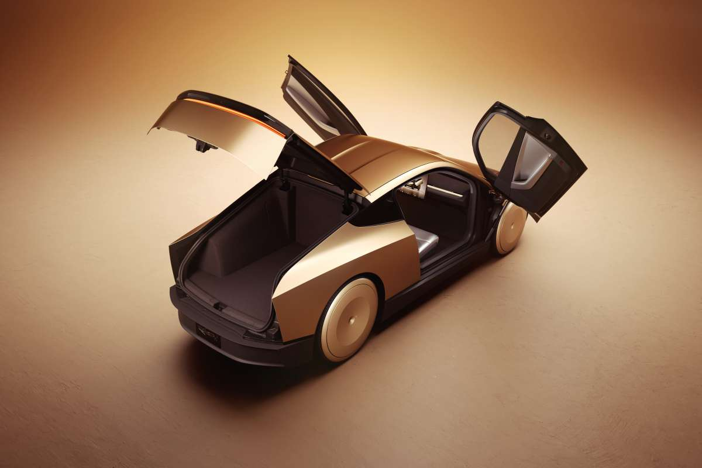
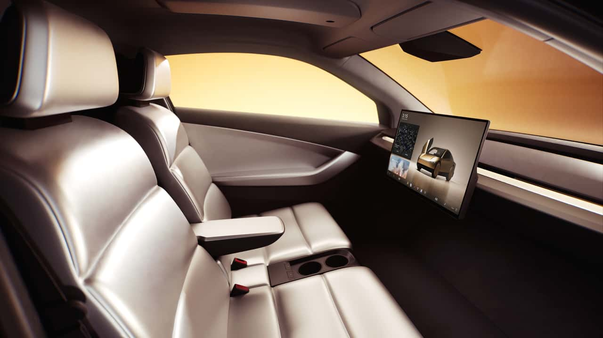
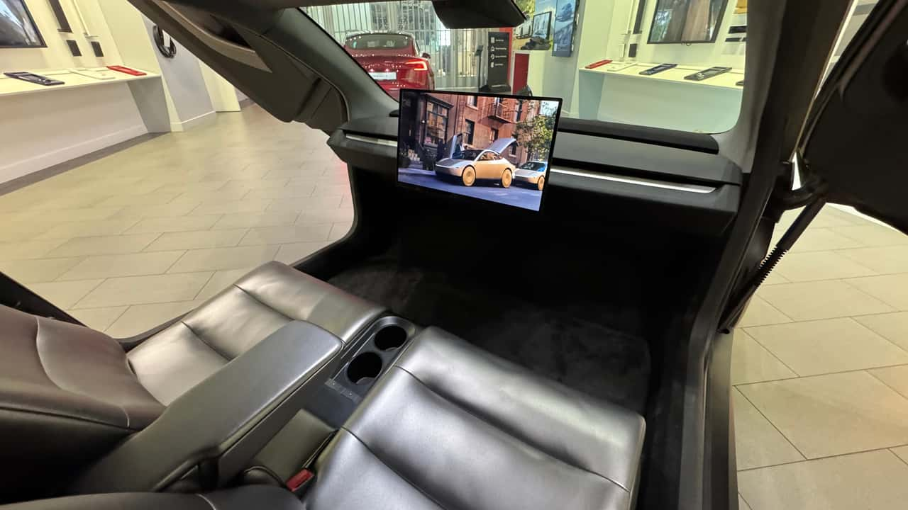
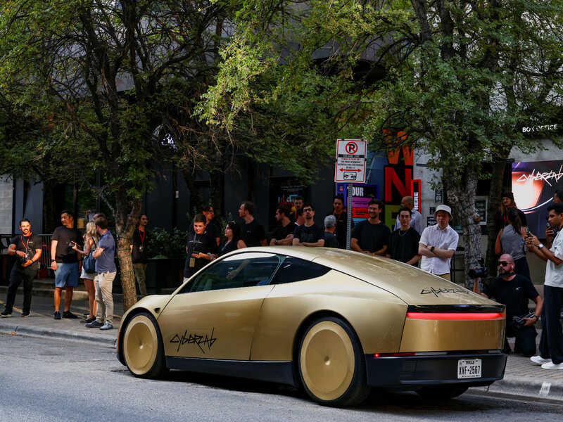

Pada 4 September 2026, Tesla resmi membuka layanan Cybercab untuk publik di Austin, Texas. Tidak ada livestream. Tidak ada panggung. Tidak ada Elon Musk yang melompat ke atas panggung sambil berkata "ini akan mengubah segalanya." Yang ada hanya acara tertutup, tamu undangan influencer, dan mobil mungil di cet emas dengan dua kursi yang mulai mengangkut penumpang di jalanan Austin, Texas.

<i>Tesla Cybercab... Kapan ya masuk Indonesia</i>

Ini nggak kaya Tesla yang biasanya ngumumin produk dengan gembar-gembor. Tapi justru karena itu, bagian yang paling sering terlewat di berita: apa yang terjadi di dalam kabin, saat kamu naik dan nggak ada setir, nggak ada pedal, dan cuma ada satu layar besar di depanmu.

Saya ngamatin gimana reaksi orang di YouTube tentang Cybercab ini. Cybercab buat saya bukan studi kasus biasa di mata implementasi HMI. Bukan karena ia sempurna. Justru karena ia menantang hampir setiap asumsi yang selama ini kita pegang soal cara manusia berinteraksi dengan kendaraan.

## Desain Kabin: Esensial yang keterlaluan

Yang paling mencolok: di dalam Cybercab cuma ada dua kursi, satu armrest di tengah dengan dua cup holder, dan satu layar sentuh besar yang jadi pusat segalanya. Nggak ada panel instrumen. Nggak ada kluster speedometer. Nggak ada setir. Nggak ada pedal. NOL.

<i>Kabin Cybercab. Perhatikan: tidak ada panel instrumen, tidak ada setir, hanya layar dan dua kursi.</i>

Dua kursi itu punya gaya "lounge chair," dengan sandaran datar yang lebih mirip kursi di tempat cukur rambut daripada kursi mobil. Materialnya leatherette (kulit sintetik), mudah dicuci, dan dirancang untuk stasiun sanitasi otomatis antar-ride. Armrest di tengah hanya berisi dua cup holder. Tidak ada laci, tidak ada kompartemen, tidak ada apa-apa.

Motor1 Italia menyebutnya "esensial dalam segala hal." InsideEVs bilang "semuanya berputar di sekitar layar besar di tengah." Dan itu benar. Layar itu satu-satunya interaksi antara penumpang dan kendaraan.

Yang bikin saya berhenti sebentar: di seluruh kabin ini cuma ada tiga tombol fisik. Dua buat menurunkan kaca, satu buat lampu plafon. Nggak ada tombol start/stop, nggak ada tombol hazard, nggak ada tombol panik. Tesla bahkan nggak menempelkan logo atau badge apa pun di mobil ini. Filosofinya: semua orang sudah tahu ini Tesla, jadi nggak perlu dituliskan.

## Apa yang Layar Itu Tampilkan (dan Tidak Tampilkan)

Di sinilah analisis HMI mulai masuk. Dari video yang beredar di X (Twitter) oleh Sawyer Merritt  dan thread Reddit "Cybercab UI", beberapa hal yang kelihatan:

1. **UI-nya mulus dan smooth.** Animasi transisi antar mode (hail, boarding, ride, arrive) terasa halus. Nggak ada lag yang berarti.
2. **Nggak ada turn signal.** Nggak ada indikator belok yang kelihatan dari dalam kabin. Nggak ada bunyi "tik tok tik tok" pas mobil belok.
3. **Nggak ada route selection atau navigasi lengkap.** Penumpang nggak lihat peta total untuk jalan yang bakal dilalui, nggak lihat rute alternatif.
4. **Nggak ada driving dynamics.** Nggak ada speedometer, nggak ada indikator akselerasi, nggak ada info soal apa yang lagi dilakukan FSD.

Cyber_Trailer merangkumnya dengan baik: "Mobil ini dibangun untuk kenyamanan dan membuat pengalaman mengemudi benar-benar menghilang."

Nah, di sinilah ketegangan HMI-nya mulai terasa. Dari sisi desain, ini radikal banget: Tesla sengaja menyembunyikan seluruh dinamika mengemudi dari penumpang. Nggak perlu tahu kecepatan. Nggak perlu tahu ke mana mobil belok (biarpun ditunjukkan di layar sih, tapi nggak ada bunyinya). Nggak perlu tahu apa yang lagi dilakukan kamera dan neural network di dalam mobil. Kamu tinggal duduk, menikmati, dan sampai di tujuan.

Tapi dari kacamata HMI engineer, ini bukan cuma "menyembunyikan informasi." Ini keputusan untuk **menghapus seluruh lapisan feedback** antara manusia dan mesin. Hapus feedback, ya harus ganti dengan sesuatu. Kalau nggak, kamu cuma bikin manusia duduk di dalam kotak hitam.

## Reaksi Publik: Antara Kagum dan Curiga

Respon orang-orang? Campur.

Di Reddit thread "Cybercab Up Close and Personal" (r/TeslaLounge, 64 vote), reaksinya terpecah. Ada yang bilang "I'd buy one if they sold them with a steering wheel as a Model 2," ada yang bilang "This is a deeply stupid vehicle. Almost everything about it is embarrassing," dan ada yang bilang "Finally, a post that feels new regarding the Cybercab."

Di X, Joe Tegtmeyer menulis "The Cybercab experience is truly amazing and this is just the first day!" (22.4 ribu view). Sawyer Merritt membagikan perbandingan biaya: ride 15 menit di Cybercab $9.65, di Model Y $16.99, di Uber $21. Cybercab 54% lebih murah dari Uber. Thread ini mendapat 393 vote dan 168 komentar.

Di sisi lain, TechCrunch mencatat bahwa peluncuran ini "oddly quiet" : tanpa livestream, tanpa konferensi pers, hanya tamu influencer. TechBuzz menyebutnya "control the narrative by controlling who's in the room." Dan NHTSA, badan keselamatan kendaraan AS, sedang menyelidiki self-certification Tesla untuk mobil tanpa setir ini.

Jadi yang saya lihat: kagum sama keberanian desainnya, tapi curiga sama apa yang disembunyikan di balik layar itu.

## Analisis: 7 Hal yang Bisa Di-improve

Sekarang masuk ke bagian yang paling saya nunggu: dari kacamata HMI engineer, apa saja yang bisa diimprove? Saya sudah menyusun 7 poin dari hasil riset.

### 1. Akar Masalahnya: Satu Layar, Satu Modalitas

Ini akar masalahnya, dan hampir semua kritik di bawah ini tumbuh dari sini.

Seluruh interaksi penumpang dengan kendaraan bergantung pada **satu layar sentuh**. Nggak ada backup. Nggak ada panel instrumen sekunder, nggak ada HUD di kaca depan. Satu-satunya cara buat interaksi sama mobil itu dengan **ngomong** atau dengan **nyolek (sentuh)**.

Dua hal ini, satu layar dan satu modalitas, ketemu jadi masalah yang gede. Dan konsekuensinya?

**a. Nggak ada emergency stop fisik.** 

Di seluruh kabin, nggak ada tombol "STOP" yang bisa ditekan pakai satu tangan pas panik. Nggak ada tuas. Nggak ada handle. Nggak ada apa-apa. Waktu di Sony, pas saya ngunjungin tempat produksi/ ngerakit PC, ada standar yang kami pegang: operator harus bisa emergency stop dalam waktu kurang dari 2 detik. Bukan 5 detik. Bukan 3 detik. Dua detik (bahkan idealnya dibawah satu detik !). Karena di momen kritis, otak manusia nggak mikir, dia bereaksi. Dan reaksi itu butuh tombol yang bisa ditemukan dengan mata terpejam. Nah di Cybercab, satu-satunya cara buat berhenti ya: buka layar, cari menu, ketuk "stop" atau "pause," dan berharap UI-nya nggak lag di saat paling kritis.

**b. Kalau layarnya mati di tengah ride, penumpang terjebak.** 

Kalau ada error di elektronik atau software dan Displaynya tiba-tiba mati, penumpang jadi nggak bisa ngapa-ngapain! Nggak bisa lihat ETA Nggak bisa lihat rute. Nggak bisa minta berhenti. Nggak bisa minta info apa pun. Satu-satunya jalan buat ngomong sama mobil ya lewat layar yang udah nggak jalan, atau kudu teriak. Ini bukan skenario ngada-ngada. Layar elektronik bisa mati, software bisa crash. Buat kendaraan otonom yang ngangkut manusia, failure mode kayak gini harus punya mitigasi.

**c. Nggak ada tombol "saya butuh bantuan / lagi nggak enak."** 

Kedengerannya sepele, tapi ini penting: nggak ada tombol fisik buat penumpang yang lagi mual, panik, atau nggak nyaman. Di pesawat, tiap kursi ada tombol buat manggil pramugari. Di kereta, tiap gerbong punya tombol darurat. Nah di Cybercab, satu-satunya cara bilang "saya nggak baik-baik saja" ya buka layar, cari menu, terus ketuk. Buat orang yang lagi mual dan panik, UX-nya nggak manusiawi. Tombol fisik sederhana, mungkin di armrest atau di samping kursi, yang langsung memicu "safe stop" bakal jadi improvement yang gede.

**d. Nggak ramah buat semua orang.** 

HMI yang 100% sentuh itu musuh buat penumpang tunanetra (nggak ada feedback haptic, nggak ada audio description buat tiap elemen UI), penumpang lansia (ngetap target kecil di layar gede pas tangan gemetar itu nggak gampang), dan penumpang dengan disabilitas motorik (swipe, tap, drag butuh kontrol motorik yang nggak semua orang punya). Di mobil biasa, kamu masih bisa pakai suara (voice command), tombol fisik, atau kombinasi keduanya. Di Cybercab, satu-satunya modalitas ya sentuhan di layar.

Bandingkan sama mobil biasa: kalau layar tengah mati, kamu masih punya speedometer, tachometer, indicator, dan segala macam gauge. Kamu masih bisa nyetir. Di Cybercab, kalau layarnya mati, penumpang nggak tahu apa-apa. Nggak tahu kecepatan, nggak tahu arah, nggak tahu ETA, nggak tahu mobil lagi ngapain.

Dalam bahasa HMI, ini disebut **lack of redundancy for safety-critical communications**. Dan buat kendaraan otonom, di mana penumpang nggak bisa ambil alih kendali, ini bukan soal kenyamanan. Ini safety issue.

<i>Cybercab : terlalu minimalistik... mana tombol daruratnya ?</i>

### 2. Dua Penumpang, Satu Layar, Nol Privasi

Cybercab bawa maksimal dua penumpang. Mereka berbagi satu layar. Nggak ada mode dual-user. Nggak ada profil individual. Nggak ada jalan buat satu penumpang nonton video sambil yang lain ngecek rute.

Contoh sederhana: mobil keluarga. Dua orang berbagi satu layar tengah, dan selalu ada yang merasa "itu bukan untuk saya." Di Cybercab masalahnya lebih tajam, karena di sana nggak ada alternatif.  Bisa ajah sih BYOD, atau ngeliatin HP or Tablet sendiri.

### 3. Tidak Ada HUD atau AR di Kaca Depan

Di mobil tanpa setir, kaca depan adalah "instrumen" utama. Kamu lihat jalan lewat kaca itu. Dan Tesla nggak memanfaatkan kesempatan ini.

Bayangin: kaca depan yang bisa nampilkan rute, estimasi waktu, atau bahkan augmented reality yang nyorot objek di jalan. Ini bukan teknologi baru. AR-HUD udah ada di beberapa mobil premium. Tesla punya teknologinya. Tapi di Cybercab, mereka milih nggak pake. Alasannya jelas, karena mahal, dan Tesla mau ngebuat Cybercab ini se-ekonomis mungkin

Kaca depan Cybercab ya kaca biasa. Transparan, tanpa overlay, tanpa info. Buat kendaraan otonom yang seharusnya bikin penumpang ngerasa "diawasi," ini peluang yang terlewatkan.

### 4. Glare: Layar Besar di Bawah Matahari Austin, apalagi kalau datang ke Indonesia

Austin, Texas. Suhu 40 derajat. Matahari terik. Dan di dalam kabin, ada layar sentuh besar yang menghadap langsung ke matahari.

Di tempat sekarang, pas kami nguji prototype display, saya liat sendiri gimana layar di dashboard jadi nggak terbaca pas kena matahari langsung siang hari. Tiga kali iterasi desain sebelum akhirnya nemu angle dan coating yang bener. Solusinya: angle adjustment, anti-glare coating, atau ambient light sensor yang nyesuaiin brightness.

Di Cybercab, kita nggak tahu ada mekanisme kayak gitu apa nggak. Tapi kalau nggak ada, layarnya bakal susah banget dipake di jam-jam tertentu di hari-hari tertentu. Dan buat HMI yang jadi satu-satunya interaksi sama kendaraan, ini bukan trade-off yang bisa dibiarin.

### 5. Voice-First, Touch-Second

Solusi untuk banyak masalah di atas: buat voice command sebagai modalitas utama, dan touch sebagai sekunder.

Bayangkan: "Hey Cybercab, stop." "Hey Cybercab, what's our ETA?" "Hey Cybercab, I feel sick, please stop safely." "Hey Cybercab, show me the route."

Voice command tidak perlu presisi sentuhan. Voice command bisa dilakukan dengan mata terpejam. Voice command tidak bergantung pada glare. Voice command bisa dibagi antara dua penumpang. Dan voice command sudah cukup mature di industri otomotif.

Di Cybercab, ada indikasi bahwa voice command adalah bagian dari UX, tapi seberapa besar dia bisa ngontrol... masih dipertanyakan. Layar sentuh sepertinya masih jadi main interface. Ini pilihan yang berani, tapi tidak didukung oleh redundancy.

### 6. Ambient Light: Ada, Tapi Bukan di Semua Tempat

Cybercab punya ambient lighting, di footwell dan di dashboard. Ini bagus. Lampu ambient di kaki dan dasbor memberi kabin suasana yang lebih hangat, dan membantu orientasi saat gelap.

Tapi ambient lighting dekoratif itu berbeda dengan ambient light sensor. Yang pertama adalah pencahayaan suasana. Yang kedua adalah sensor yang membaca kondisi cahaya luar dan otomatis menyesuaikan brightness layar. Dari video yang beredar, tidak ada indikasi bahwa layar Cybercab punya sensor seperti itu.

Artinya: di malam hari, layar yang terlalu terang akan menyilaukan mata dan membuat penumpang sulit melihat jalan di luar. Di siang hari di bawah matahari Austin, layar yang terlalu redup akan sulit dibaca. Apakah ada mode malam yang menurunkan brightness secara otomatis? Dari video yang beredar, tidak ada indikasi. Untuk HMI yang menjadi satu-satunya sumber informasi di kabin, ini bukan detail kecil.

### 7. Tidak Ada Individual Profiles

Dua penumpang, satu layar. Tapi apa yang terjadi jika satu penumpang ingin mendengarkan musik berbeda dari penumpang lainnya? Apa yang terjadi jika satu penumpang ingin suhu AC berbeda?

Di mobil konvensional, ada dual-zone climate control, ada dual audio, ada dual seat adjustment. Di Cybercab, tidak ada. Semua berbagi satu pengaturan.

Ini mungkin trade-off yang disengaja untuk menyederhanakan kabin. Tapi dari sudut pandang HMI, ini menghilangkan lapisan personalisasi yang membuat penumpang merasa "di rumah."

## Apa yang Tesla Lakukan dengan Benar

Tidak adil jika saya hanya mengkritik. Ada beberapa hal yang Tesla lakukan dengan sangat baik:

1. **Simplicity** : tiga tombol fisik. Tidak ada 20 tombol yang tidak pernah kamu gunakan. Ini benar.
2. **Sanitasi** : kabin yang mudah dibersihkan, tanpa kompartemen tersembunyi, tanpa celah di mana debu dan bakteri bisa bersembunyi. Untuk robotaxi yang dioperasikan 24/7, ini penting.
3. **Biaya** : $9.65 untuk ride 15 menit. 54% lebih murah dari Uber. Ini bukan hanya HMI, ini business model yang mengubah game, semoga di Indonesia akan lebih murah.
4. **Kesan pertama** : UI yang smooth, animasi yang halus, transisi yang clean. Dari video, ini terlihat seperti produk yang sudah dipola, bukan prototipe.
5. **Keberanian desain** : tidak ada setir, tidak ada pedal, tidak ada logo. Ini bukan keputusan yang mudah. Ini butuh kepercayaan penuh pada teknologi. Dan itu menginspirasi.

## Pelajaran untuk Industri

Cybercab bukan hanya tentang Tesla. Ini adalah pernyataan: "Masa depan HMI kendaraan adalah tanpa setir, tanpa pedal, dan dengan satu layar." Dan itu akan memaksa seluruh industri untuk menjawab: apakah kita setuju?

Waymo, yang menggunakan sensor lidar dan radar, punya pendekatan HMI yang berbeda. Mobil mereka (Jaguar I-Pace, Zeekr) masih punya setir dan pedal. Mereka menampilkan lebih banyak informasi ke penumpang. Mereka lebih "transparent" tentang apa yang sedang dilakukan sistem.

Zoox, milik Amazon, punya pendekatan yang lebih mirip Cybercab: kabin tanpa setir, penumpang di belakang. Dari gambar kabin yang beredar, Zoox menyediakan lebih dari satu layar dan menjaga akses ke kendali darurat. Ini kontras dengan Cybercab yang menyederhanakan semuanya menjadi satu layar.

Jadi Cybercab adalah spektrum yang paling ekstrem. Dan itu baik. Karena ekstrem itulah yang akan memaksa industri untuk berpikir: "Apa yang benar-benar dibutuhkan penumpang, dan apa yang hanya kita asumsikan dibutuhkan?"

## Penutup

<i>Cybercab di jalanan Austin.</i>

Sebagai HMI expert, saya tidak bisa tidak terkesan dengan keberanian desain Cybercab. Ini adalah produk yang dibuat oleh orang-orang yang benar-benar percaya pada masa depan tanpa setir. Dan itu menginspirasi.

Tapi keberanian tanpa redundancy adalah keberanian yang berbahaya. Satu layar. Satu titik gagal. Satu modalitas interaksi. Satu cara untuk berkomunikasi dengan kendaraan.

Cybercab adalah awal. Dan awal yang baik adalah awal yang bisa diimprove. Dan improvement itu, menurut saya, sudah jelas: tambah redundancy, tambah voice, tambah tombol fisik, tambah accessibility, dan tambah empati untuk penumpang yang tidak selalu tenang, tidak selalu sadar, dan tidak selalu mampu.

Karena pada akhirnya, HMI bukan tentang teknologi. HMI tentang manusia. Dan manusia tidak selalu sempurna.

---

*Thomas Agung adalah HMI engineer dengan pengalaman 15 tahun di industri otomotif, pernah bekerja di Sony, Intel, dan Motherson. Ia tinggal di Indonesia dan menulis tentang human machine interface, display technology, dan future mobility.*
