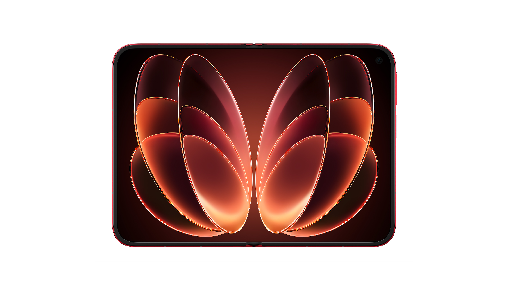
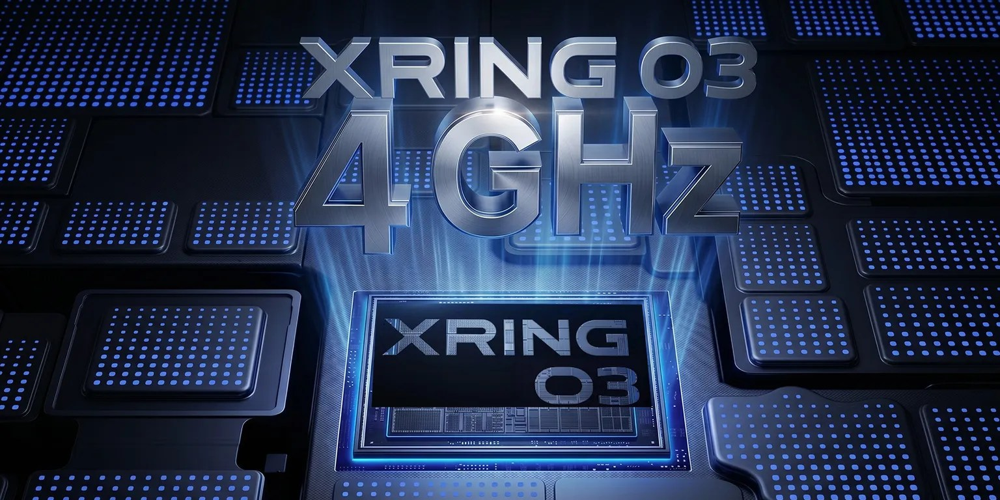
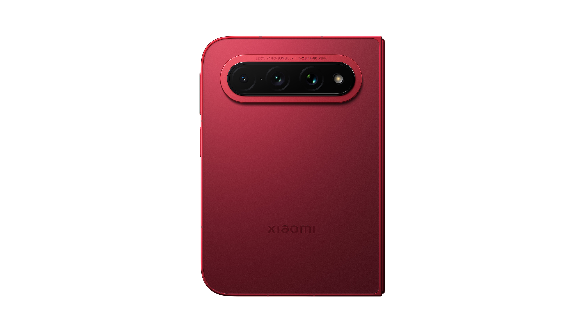
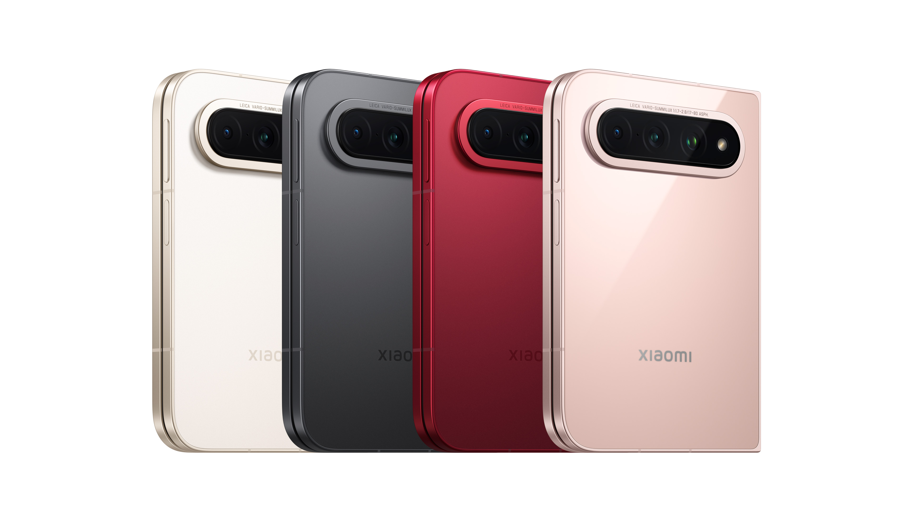

Minggu ini di dunia HP lipat itu ramai banget. 7 September, Xiaomi luncurkan 18 Fold di China. Dua hari kemudian, 9 September, Apple buka event dan luncurkan iPhone lipat pertamanya, iPhone Duo, plus Watch Series 12 dan Ultra 4. Dua brand, dua HP lipat, selisih dua hari. Saya bilang ini "minggu perang HP lipat 2026," dan bukan lelucon.

Tapi sebelum kita masuk ke framing perang, balik dulu ke Xiaomi 18 Fold. Karena ini bukan sekadar "HP lipat Xiaomi yang baru." Ini keputusan engineering yang berani: desain yang Xiaomi sebut "mid-fold" (layar dalam yang lebih lebar dari tinggi, pas dilipat seukuran paspor). Dan di dalamnya, chip XRING O3, generasi terbaru dari SoC in-house Xiaomi di proses 3nm, plus LPDDR6, memori generasi terbaru yang belum pernah ada di HP mana pun.

## Desain Mid-Fold: Bukan Sekadar "Lipat yang Lebih Lebar"

Yang pertama kali terlihat dari Xiaomi 18 Fold: pas dilipat, dia seukuran paspor. Pas dibuka, layarnya lebih lebar dari tinggi. Ini beda dari Galaxy Z Fold 8 yang rasionya 4:3 (7.6 inci, lebih mirip buku), atau buku yang dilipat dua. Xiaomi milih rasio √2:1, persis rasio kertas A4, dan yang bikin menarik: layar dalam DAN layar luar pakai rasio yang sama. Jadi pas kamu buka atau tutup HP, konten nggak perlu di-reflow. Transisinya seamless.

<i>Xiaomi 18 Fold: desain mid-fold, lebih lebar dari tinggi. Desain yang belum pernah ada di HP lipat sebelumnya.</i>

Sekarang, kenapa ini penting? Rasio aspek itu bukan soal "kelihatan bagus." Ini keputusan engineering yang nyangkut di hampir semua bagian: engsel, ultra-thin glass, fleksibilitas panel, bahkan cara aplikasi di-render.

Di Z Fold 8, Samsung milih 4:3, yang lebih mirip buku. Di Xiaomi 18 Fold, mereka milih rasio yang lebih lebar, yang lebih mirip kertas A4 yang dibentangkan. Dua-duanya bisa dilipat. Tapi yang lebar ngasih lebih banyak ruang kerja horizontal, cocok buat split-screen, nonton video, atau baca dokumen. Yang 4:3 lebih natural buat baca buku atau scrolling feed.

Trade-off-nya? Engsel.

Engsel di mid-fold itu harus menahan panel yang lebih lebar. Torque-nya lebih gede. Dan di titik lipatan, di mana panel harus melengkung, tegangan di material lebih tinggi. Di sinilah ultra-thin glass (UTG) masuk. UTG itu kaca yang ketebalannya cuma 30 sampai 50 mikron, setipis rambut manusia, tapi cukup kuat buat dilipat ribuan kali. Di mid-fold, UTG-nya harus lebih lebar, dan itu bikin proses fabrikasi lebih tricky: yield-nya turun, biaya naik.

Xiaomi jawab tantangan ini dengan beberapa keputusan yang, dari sudut pandang saya, menunjukkan engineering yang matang. Engselnya pakai desain tiga-tautan (three-link) yang dipatenkan, melingkar mengitari layar untuk proteksi tambahan sekaligus bikin ruang lebih lega buat panel. Lalu struktur UTG-nya dua lapis: lapisan UTG atas 50 mikron plus lapisan penopang UTG 30 mikron. Di lapisan sentuh, Xiaomi ganti material isolator anorganik lama dengan film organik yang lebih elastis, jadi daya tahan benturan naik. Hasilnya: ketahanan benturan layar dalam naik 258 persen dibanding foldable Xiaomi sebelumnya, dan klaim drop dari ketinggian sampai 1,2 meter. Kedalaman crease rata-rata nggak lebih dari 30 mikron.

Dan fisiknya: 219 gram, 5,02 milimeter pas dibuka, 10,68 milimeter pas dilipat. Itu lebih ringan dari semua foldable Xiaomi sebelumnya. Untuk HP dengan layar 7,58 inci, 5 milimeter itu tipis.

Saya pernah ikut diskusi di Sony soal panel fleksibel untuk perangkat portable. Salah satu poin yang saya ingat: "The hinge is the product." Engsel bukan komponen. Engsel itu produk. Karena kalau engselnya gagal, seluruh HP gagal. Dan mid-fold itu ngasih lebih banyak tekanan ke engsel dibanding book-style. Jadi kalau Xiaomi 18 Fold tahan banting, itu bukan kebetulan. Itu engineering.

## XRING O3: Chip In-House Xiaomi

Nah, XRING O3. Ini SoC in-house kedua Xiaomi, generasi terbaru, proses 3nm. Yang pertama itu XRING O1, dan O3 langsung melompat: 24 miliar transistor, naik dari 19 miliar di O1. Ini bukan sekadar "chip baru." Ini vertikal-integrasi, strategi yang sama dengan Apple M-series.

Apa artinya vertikal-integrasi? Xiaomi nggak lagi beli chip dari Qualcomm atau MediaTek. Mereka bikin sendiri. Dan ini mengubah banyak hal.

Pertama, kontrol atas display pipeline. Chip in-house artinya Xiaomi bisa optimalkan driver untuk panel OLED mereka sendiri. Timing, brightness, refresh rate, power budget, semua bisa di-tune langsung dari silicon. Di chip pihak ketiga, kamu beli apa yang ada. Di chip in-house, kamu bikin apa yang kamu mau.

Kedua, efisiensi daya. Proses 3nm itu sudah efisien. Tapi kalau kamu bikin chip-nya sendiri, kamu bisa cut bagian yang nggak perlu. Di XRING O3, arsitekturnya deca-core, semua core-nya "big core": 2 core Ultra performa tertinggi (sampai 4.35 GHz), 4 core Premium, dan 4 core Pro. GPU-nya G2-Ultra NX 16-core, yang menurut Xiaomi ngasih peningkatan grafis 85 persen dan penghematan daya 64 persen dibanding generasi sebelumnya. Skor AnTuTu 5,22 juta (5.228.014 di V11), chip mobile pertama yang tembus 5 juta, jauh di atas Snapdragon 8 Elite.

Ketiga, biaya. Chip in-house itu mahal di awal. Kamu perlu invest di R&D, fab, dan yield. Tapi di jangka panjang, kalau volume-nya gede, biayanya turun. Xiaomi jual puluhan juta HP per tahun. Dengan XRING O3, mereka nggak lagi bayar royalty ke Qualcomm. Mereka kontrol biaya dan kontrol kualitas.

Keempat, AI. NPU-nya 200 INT8 TOPS, dan menurut Xiaomi decoding video lokal 45 persen lebih cepat. AI on-device bukan gimmick. Di HP lipat yang layar besarnya cocok buat multitasking, AI on-device artinya kamu bisa jalanin model language tanpa kirim data ke cloud.

<i>XRING O3: SoC in-house kedua Xiaomi, proses 3nm, deca-core CPU + 16-core GPU.</i>

Ini mirip dengan yang Apple lakukan sejak 2020 dengan M1. Apple bikin chip-nya sendiri, dan hasilnya: MacBook lebih efisien, iPhone lebih cepat, dan Apple kontrol penuh atas ekosistem. Xiaomi sekarang di jalur yang sama. Bedanya: Xiaomi belum se-mature Apple di silicon. HyperOS, OS mereka, harus di-optimalkan untuk XRING O3. Dan itu tantangan. Samsung pernah struggle dengan Exynos di masa lalu, dan optimasi software untuk chip in-house itu nggak gampang.

## LPDDR6: Memori Generasi Terbaru

Satu lagi yang bikin Xiaomi 18 Fold spesial: LPDDR6. Ini generasi terbaru dari Low Power Double Data Rate memory, dan Xiaomi 18 Fold adalah HP pertama di dunia yang memakainya.

Kenapa LPDDR6 penting? Bandwidth lebih tinggi, konsumsi daya lebih rendah, dan latency lebih kecil. Di HP flagship dengan chip 3nm dan GPU 16-core, memori jadi bottleneck kalau belum cukup cepat. LPDDR6 ngasih headroom untuk AI on-device, gaming berat, dan multitasking di layar lebar.

Dan ini nyambung ke post saya sebelumnya soal memory supercycle. Di post itu, saya bahas bagaimana AI bikin RAM mahal, dan dampaknya ke harga HP dan PC. LPDDR6 itu bagian dari cerita itu: teknologi baru, biaya produksi tinggi di awal, dan vendor memori (Samsung, SK Hynix, Micron) yang jadi pemain kunci. Xiaomi 18 Fold pakai LPDDR6 dari CXMT, vendor memori China yang baru mulai produksi massal. Ini sinyal: China makin mandiri di rantai pasok memori, dan itu bakal ngubah dinamika harga di jangka panjang.

## Layar: 7.58 Inci di Dalam, 5.38 Inci di Luar, Dua-Duanya HyperRGB

Layar dalam Xiaomi 18 Fold: 7.58 inci OLED, rasio √2:1 (lebih lebar dari tinggi). Layar luar (cover): 5.38 inci, rasio yang sama. Dan ini bagian yang bikin saya berdebar sebagai orang display: dua-duanya pakai teknologi HyperRGB, sistem subpiksel full RGB stripe di setiap piksel.

Yang terakhir itu penting. Di kebanyakan panel OLED, ada trade-off antara resolusi efektif dan rendering warna. Di panel dengan subpiksel non-uniform (misal pen arrangement yang nggak uniform), teks kecil bisa kelihatan "shimmer" atau ada color fringing, terutama di mode teks. HyperRGB bikin tiap piksel punya subpiksel merah, hijau, biru yang penuh dan simetris. Hasilnya: rendering teks lebih tajam, color reproduction lebih akurat, dan color volume lebih lebar.

Dan ini dua layar, bukan satu. Xiaomi pakai full RGB stripe baik di layar dalam 7.58 inci mau pun layar luar 5.38 inci. Brightness puncak: 4.000 nits. Refresh rate: 1 sampai 120 Hz adaptif (LTPO). Itu spec yang sama di kedua layar, dan itu keputusan engineering yang berani.

Kamera: 200MP kamera utama Leica HP5 dengan sensor 1/1.56 inci, plus 50MP periscope telephoto (fokus 80mm, zoom optik 2.7x sampai 160mm/6x), dan 50MP ultrawide.

<i>Modul kamera Leica: 200MP HP5 1/1.56 inci, periscope 2.7x, dan ultrawide. Kombinasi yang jarang di HP lipat.</i>

Baterai: 6,000mAh, dengan 67W wired charging dan 50W wireless charging. Untuk HP lipat, itu baterai yang besar. Dan dengan chip 3nm yang efisien, screen-on time-nya harusnya competitive.

## Harga: Mulai RMB 10,999 (Sekitar Rp 23 Juta)

<i>Empat pilihan warna: hitam, putih, merah, dan edisi Ceramic (nitrida silikon) yang cuma ada di varian 16GB+1TB.</i>

Harga resmi di China sudah diumumkan 7 September. Varian 12GB+256GB (hitam/putih/merah) mulai dari RMB 10,999, yang di kurs sekarang sekitar Rp 23 juta. Varian 16GB+512GB di RMB 12,999 (sekitar Rp 27 juta). Varian tertinggi, edisi Ceramic 16GB+1TB dengan bodi porselen nitrida silikon, di RMB 15,999 (sekitar Rp 32 juta).

Untuk perbandingan, Galaxy Z Fold 8 di Indonesia dijual di kisaran Rp 30 sampai 35 juta, tergantung varian. Jadi Xiaomi 18 Fold masuk di segmen yang sama, tapi entry price-nya lebih rendah dari Z Fold 8.

Catatan: harga dan ketersediaan di Indonesia belum dikonfirmasi. Xiaomi 18 Fold diluncurkan di China 7 September, dan belum ada pengumuman resmi soal global rollout. Buat pembaca Indonesia, ini masih "nanti dulu." Tapi karena Xiaomi adalah salah satu merek HP teratas di Indonesia, dan "Xiaomi 18 Fold" adalah search term dengan intent tertinggi, artikel ini tetap relevan.

## Framing: Perang HP Lipat 2026

Sekarang kita balik ke framing perang. 7 September, Xiaomi 18 Fold. 9 September, Apple iPhone Duo. Dua HP lipat, dua brand, selisih dua hari. Ini bukan kebetulan. Ini strategi.

Xiaomi colong start. Mereka luncurkan 2 hari sebelum Apple, dan itu ngasih mereka head start di media coverage. Selama 2 hari itu, "Xiaomi 18 Fold" jadi topik utama. Baru di 9 September, Apple masuk dengan iPhone Duo dan rebut perhatian. Dua-duanya untung: media dapet dua cerita, konsumen dapet dua pilihan.

Dan perbandingan speknya menarik. iPhone Duo: layar dalam 7.6 inci, frame titanium grade-5, chip A20 Pro, panel OLED eksklusif dari Samsung Display (kontrak eksklusif 3 tahun), harga mulai $1.999 (sekitar Rp 31 juta). Xiaomi 18 Fold: layar dalam 7.58 inci dengan rasio √2:1 yang lebih lebar, chip XRING O3 in-house 3nm, LPDDR6 pertama di HP, harga mulai RMB 10,999 (sekitar Rp 23 juta). Dari sudut pandang supply chain, ini menarik: Samsung Display bikin panel untuk iPhone Duo, sementara panel Xiaomi 18 Fold kemungkinan dari vendor lain. Jadi "perang HP lipat" ini juga perang di level panel.

Yang lebih penting: Apple masuk ke segmen foldable dengan harga premium ekstrem ($1.999), sementara Xiaomi masuk dengan harga yang lebih agresif dan teknologi yang lebih eksperimental (LPDDR6, rasio √2:1). Dua pendekatan berbeda ke segmen yang sama.

## Moko dan Wide-Fold

Moko, kucing ragdoll saya yang dulu, kalau dia masih ada, pasti bakal ngeliatin Xiaomi 18 Fold sebentar, lalu tidur lagi. Tapi kalau dia bisa ngomong, saya rasa dia bakal bilang: "Lipat lebar? Kayak aku tidur. Badan penuh, nggak ada celah. Nyaman."

Dan itu, sebenarnya, inti dari wide-fold. Bukan soal "lebih lebar." Tapi soal "lebih nyaman." Lebih banyak ruang, lebih sedikit kompromi. Dan itu yang bikin desain ini menarik.

## Kesimpulan: Apa yang Bisa Kita Pelajari

Xiaomi 18 Fold bukan cuma HP lipat baru. Ini pernyataan: "Kami bisa bikin chip sendiri, kami bisa bikin desain sendiri, dan kami bisa bersaing dengan Apple dan Samsung di segmen premium." Dan itu berani.

Tapi keberanian tanpa eksekusi adalah keberanian yang kosong. XRING O3 harus terbukti se-efisien yang diklaim. HyperOS harus di-optimalkan dengan baik. Wide-fold harus tahan banting. Dan harga harus masuk akal di pasar global.

Kalau semua itu terjadi, Xiaomi 18 Fold bisa mengubah peta persaingan di segmen foldable. Kalau tidak, dia jadi HP lipat bagus yang nggak terlalu berbeda dari yang sudah ada.

Dan dua hari setelah Xiaomi, Apple sudah masuk dengan iPhone Duo. Perang HP lipat 2026 udah dimulai. Pertanyaannya bukan lagi "apakah foldable bakal mainstream," tapi "siapa yang menang di segmen premium ini, dan seberapa cepat harganya turun?"

---
