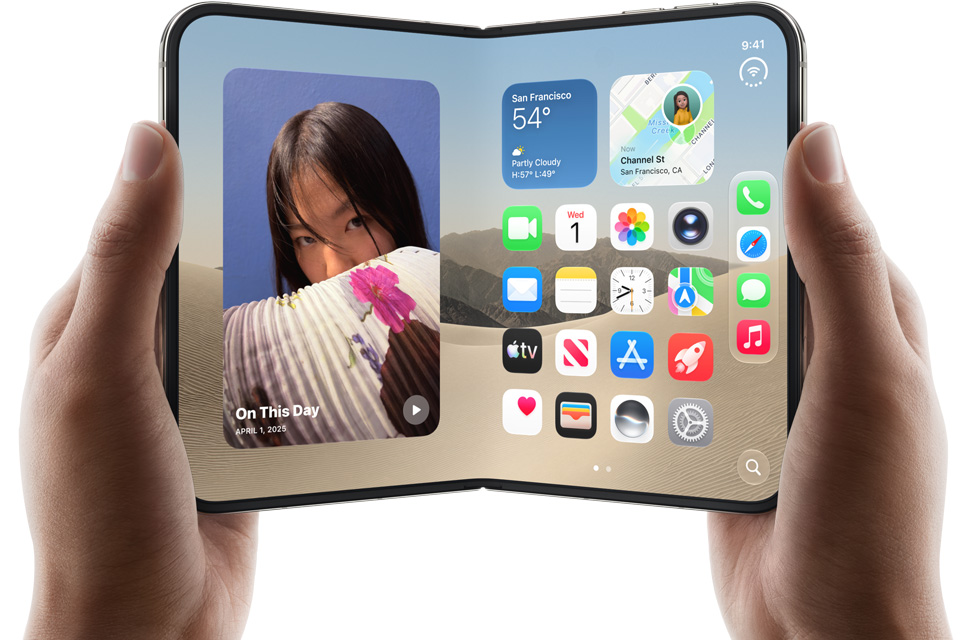
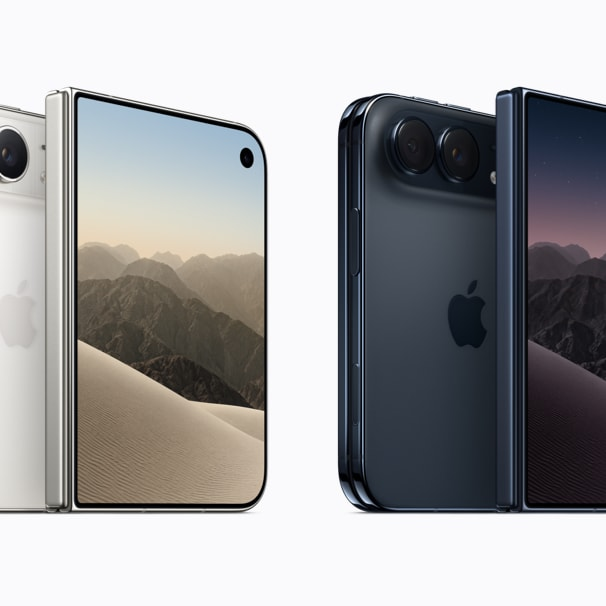
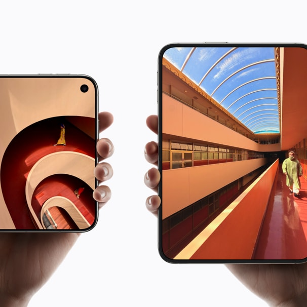
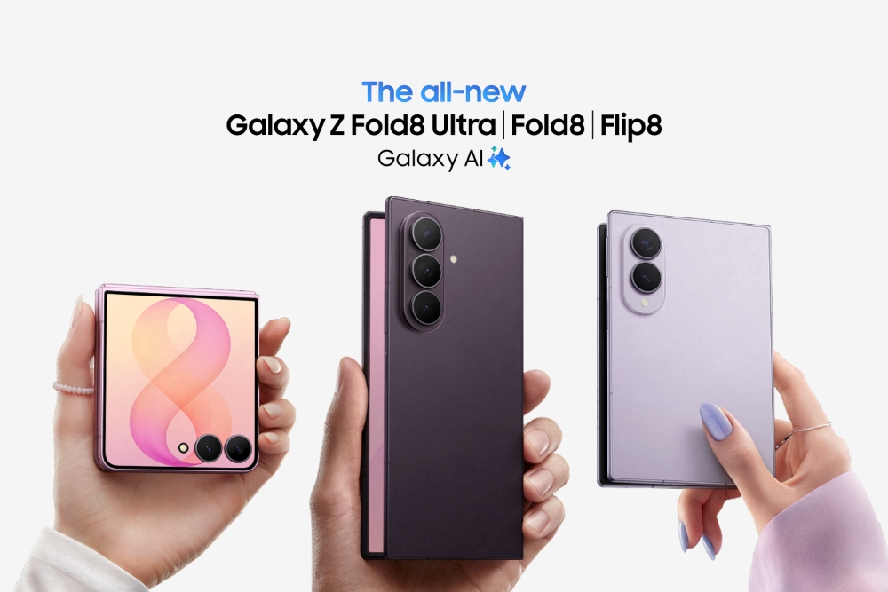

9 September 2026, Apple resmi umumkan iPhone Duo. HP lipat pertama mereka. Dan yang ngumuminnya bukan CEO yang kita kenal lama, tapi John Ternus, yang baru memimpin Apple: "most transformational change to iPhone since the original." Kalimat besar untuk produk yang masih harus terbukti. Saya nulis ini dari Jerman, jadi semua yang saya ulas di sini adalah hasil menonton event dari jauh plus ngopi pelan-pelan sambil baca datasheet. Moko dulu sering nengok layar kalau nongkrong di meja kerja, sekarang Moko udah nggak ada, tapi kebiasaan nulis soal layar itu tetap.

Yang langsung bikin saya berhenti ngetik di tengah jalan: supply chain-nya. Panel OLED di iPhone Duo ini eksklusif dari Samsung Display. Deal tiga tahun, sekitar 22 juta panel dipesan. HP lipat pertama Apple ternyata dibangun, sebagian besar, di atas keahlian Samsung sendiri. Ironi yang nggak bisa dihindari. Dan justru itu cerita paling penting dari artikel ini.

## Apa Itu iPhone Duo, dan Kapan Bisa Beli

*iPhone Duo, HP lipat pertama Apple, diumumkan 9 September 2026* Source: Apple

Singkatnya, iPhone Duo adalah HP lipat gaya buku (book-style), layar dalam 7.6 inci Super Retina XDR yang diklaim Apple sebagai iPhone paling tipis yang pernah dibuka, dan layarnya 50% lebih besar dari iPhone 18 Pro Max. Ada finishing nano-texture yang bikin layarnya matte, mengurangi silau dan juga mengurangi visibilitas crease.

Layar luarnya 5.4 inci Super Retina XDR, 90% dari area layar iPhone 18 Pro. Kedua layar pakai rasio aspek yang sama, ProMotion, Always On, dan brightness puncak 3000 nits di outdoor. Chip-nya A20 Pro, dibantu vapor chamber dan dual-battery (satu baterai di tiap sisi). Kameranya: 48MP Fusion Main dengan 2x optical tele (sensor-shift OIS), plus 48MP Fusion Ultra Wide, sama seperti iPhone 18 Pro. Ada Center Stage front cam dan kamera FaceTime yang disembunyikan di bawah layar dalam. Video sampai 4K120 Dolby Vision.

Bodinya grade-5 titanium yang di-finishing mirror-polished. Cover hinge dicetak 3D. Belakang pakai Ceramic Shield, depan pakai Ceramic Shield 2 yang diklaim 3x lebih tahan gores. Rating IP68. Hinge-nya sendiri terdiri dari 100 lebih komponen, termasuk support ribs dan insert antena fiber keramik.

Untuk auth, Apple meninggalkan Face ID di produk ini. Gantinya Touch ID di tombol samping, plus unlock via Apple Watch. Ada juga tombol Camera Control. Warna yang tersedia: Star White dan Night Sky.

Pre-order dibuka 16 Oktober 2026, ketersediaan 23 Oktober 2026. eSIM-only. Di peluncurannya, iPhone Handoff langsung tersedia untuk T-Mobile di Amerika Serikat dan Telekom di Jerman.

*iPhone Duo dalam dua pilihan warna, Star White dan Night Sky* Source: Apple

Sebelum produk ini lahir, riwayatnya panjang. Paten layar lipat Apple tercatat sejak November 2016, mencakup form factor buku dan clamshell. The Bell bahkan menulis soal layar lipat kerja sama dengan LG Display di tahun 2017. Nikkei melapor soal bottleneck engineering saat testing yang sempat bikin risiko delay. Bloomberg akhirnya menulis: on track untuk September. Dan September itulah yang baru lewat.

## Crease: Apple Tidak Menghilangkannya, Tapi Mengaturnya

Soal crease, ini yang paling sering ditanyakan. Udah kita bahas di [artikel HP lipat dan crease](https://t-agung.id/blog/blog_11_hp_lipat_crease) bahwa crease itu bukan masalah visual semata, ini masalah tegangan mekanis di titik lipatan. Kamu nggak bisa "menutupinya" dengan filter software atau cat. Kamu harus meredam tegangan di material-nya sendiri.

Pendekatan Apple di iPhone Duo: cover layer nano-textured yang merupakan polymer khusus, diklaim sampai 40% lebih kaku dari material industri sejenis. Di atas dan di bawah panel lipat, ada high-strength glass. Di bagian bawah, ada pelat titanium. Plus custom adhesive yang diklaim membuat lapisan "meluncur seperti halaman buku" saat HP dibuka dan ditutup. Coating tahan gores juga ditambahkan di lapisan dalam.

*Ukuran layar iPhone Duo: layar dalam 7.6 inci dan layar luar 5.4 inci, rasio aspek sama* Source: Apple

Dari sudut pandang display engineer, ini rekayasa yang benar. Crease adalah tegangan, jadi solusinya ada di struktur: kaku di tempat yang harus kaku, fleksibel di tempat yang harus fleksibel. Saya pernah mengalami hal mirip di Motherson waktu mengerjakan modul HMI untuk armada bus: panel yang kelihatan "lembek" di bench test, setelah dipasang ke kabin dan kena getaran jalan, retaknya nggak di layar tapi di titik klem. Masalahnya bukan panel-nya, tapi di mana tegangan dialirkan. Apple jelas belajar dari logika yang sama: arahkan tegangan ke material yang sanggup menahannya, dan biarkan sisanya bergerak bebas.

## Ironi Supply Chain: Panel Apple Dibuat Samsung

Inilah bagian yang bikin artikel ini berbeda dari review biasa. Menurut riset TrendForce (April 2026, via ijiwei dan The Bell), peta supply chain iPhone Duo ini nggak biasa.

- **Panel OLED: Samsung Display, eksklusif, deal 3 tahun, sekitar 22 juta panel.** Teknologinya CoE (color-on-encapsulation): color filter ditaruh di atas encapsulation, jadi nggak ada polarizer. Ini penting karena polarizer itu komponen yang retak di titik lenturan. Dan material OLED-nya? M14, material yang sama dengan yang dipakai iPhone 17 Pro Max. Bukan stack baru.
- **Memori: Samsung, 12GB LPDDR5X** di konfigurasi utama. Procuremennya sekitar 2x lipat year-over-year.
- **Kaca UTG, film PET, glass support, dan 3D glass cover: Lens Technology** (Jiangsu, China).
- **Komponen hinge: Shin Zu Shing (SZS)** (Taiwan).
- **Modul support (stainless, titanium, carbon fiber) dan vapor chamber: LY iTECH** (China).
- **Kamera lens: Largan** (Taiwan).
- **Rakitan: Foxconn, eksklusif**, dengan jalur NPI khusus, mass production di kuartal 4 tahun 2026.
- Yang lain-lainnya: FII, Luxshare, BYD, Avary Holding (PCB), Goertek (akustik).

M14 itu panel yang sama dengan yang kita bahas di [artikel vivo X Fold 6](https://t-agung.id/blog/blog22_vivo_x_fold_6_teknologi_layar_lipat_2026/). Artinya apa? Apple memilih stabilitas, bukan novelty. Di produk lipat pertamanya, Apple nggak mau ambil risiko dengan material emissive yang belum teruji. Mereka pakai material yang sudah mereka kenal di iPhone 17 Pro Max, dari supplier yang sudah menguasai foldable. Ini keputusan engineer yang konservatif, dan jujur, ini keputusan yang tepat untuk generasi pertama.

Dan coba dengarkan lagi kata "keputusan". Apple tidak sedang belajar dari nol. Mereka meminjam tujuh tahun kematangan Samsung: UTG yang sudah mereka uji di Z Fold 2, CoE yang sudah diproses jutaan panel, dan M14 yang sudah terbukti stabil di iPhone 17 Pro Max. Di tahun pertama mereka masuk arena, Apple langsung berdiri di pundak pengalaman yang Samsung kumpulkan lewat kegagalan dan iterasi selama tujuh generasi. Ini bukan kebetulan, ini strategi: beli kematangan, jangan bangun sendiri. Apple tahu mereka nggak punya waktu untuk mengulang foldgate 2019, jadi mereka membeli jawaban yang sudah dijawab. Itulah mengapa produk pertamanya langsung terlihat matang, dan mengapa ironi-nya terasa: kematangan yang dipakai Apple itu milik Samsung.

Tapi coba baca ulang daftar di atas. Panel: Samsung. Memori: Samsung. UTG: Lens Technology, vendor yang sama yang memasok industri foldable. Hinge: SZS. Rakitan: Foxconn. Apple memimpin di desain produk, chip, dan software, tapi hampir seluruh "jeroan" layar lipat ini datang dari ekosistem yang selama tujuh tahun dibangun Samsung untuk Z Fold. Ironi ini terasa kayak resep warisan: koki yang baru pertama kali masak nasi goreng, tapi bumbunya semua beli di warung keluarga yang bikin resep aslinya.

Lalu kenapa Samsung membolehkan ini? Jawabannya ada di struktur organisasinya, dan ini poin yang sering terlewat. Samsung Display dan Samsung Mobile adalah dua unit bisnis yang berbeda di dalam Samsung Electronics. Samsung Display adalah unit yang bikin panel OLED, dan iPhone selama bertahun-tahun adalah pelanggan panel mereka yang terbesar. Samsung Mobile adalah unit yang bikin lini HP Galaxy. Jadi ketika Apple datang dengan kontrak panel eksklusif tiga tahun bernilai miliaran dolar, yang tanda tangannya adalah Samsung Display, unit yang pendapatannya jauh lebih besar dari menjual panel ke unit saudaranya sendiri. Dari sudut pandang bisnis, ini murni kalkulasi: kontrak Apple itu lebih menguntungkan daripada mengamankan seluruh panel untuk Galaxy, dan Samsung Display nggak punya insentif untuk menolak pelanggan yang mau bayar premium.

Ini juga bukan hal yang aneh di industri. Samsung sendiri tidak memakai panel Samsung Display untuk semua HP-nya. Untuk lini yang sensitif biaya, Samsung mengambil panel dari vendor China, terutama Visionox, Tianma, dan sebelumnya BOE. Jadi wajar saja: jika Samsung pun tidak eksklusif pakai panel Samsung Display untuk semua produknya, apalagi untuk HP mid-range dan entry-level, maka wajar pula kalau unit display-nya mau menjual ke Apple. Ironi sebenarnya ada di level lain: Samsung Mobile yang bikin Z Fold, dan Samsung Display yang bikin panel untuk iPhone, adalah dua divisi yang saling bersaing di pasar yang sama, tapi saling membutuhkan di level pendapatan.

## Z Fold 8 vs iPhone Duo: Perbandingan yang Tidak Fair, Tapi Jujur

*Galaxy Z Fold 8 (Wide), form factor 4:3 yang bentuknya kaya paspor* Source: Samsung Newsroom

Sebelum tabel, satu pengakuan: perbandingan ini tidak adil. Samsung sudah di generasi kedelapan HP lipat (sejak Z Fold 1 tahun 2019), dan mereka sudah melewati "foldgate" 2019, di mana layar Z Fold 1 pecah-pecah di tangan konsumen. Apple baru di generasi pertama, dengan lock-in panel Samsung selama tiga tahun. Tapi justru karena itu, perbandingannya harus jujur.

| Aspek            | iPhone Duo                                                 | Galaxy Z Fold 8 (Wide)                                               | Z Fold 8 Ultra                          |
| ---------------- | ---------------------------------------------------------- | -------------------------------------------------------------------- | --------------------------------------- |
| Layar dalam      | 7.6", 3000 nits, nano-texture                              | 7.6" 4:3, 3000 nits                                                  | 8.0"                                    |
| Layar luar       | 5.4"                                                       | 5.5"                                                                 | 6.5"                                    |
| Crease treatment | Polymer 40% lebih kaku + glass atas-bawah + titanium plate | Flex Titanium (film titanium 20x lebih kaku + micro-patterned plate) | Flex Titanium                           |
| Uji lipatan      | Belum dipublikasikan (generasi 1)                          | 200.000 siklus                                                       | 200.000 siklus                          |
| Chip             | A20 Pro + vapor chamber                                    | Snapdragon 8 Elite Gen 5 for Galaxy                                  | Snapdragon 8 Elite Gen 5 for Galaxy     |
| RAM              | 12GB LPDDR5X (Samsung)                                     | 12GB LPDDR5X (256/512GB), 16GB (1TB)                                 | 12GB LPDDR5X (256/512GB), 16GB (1TB)    |
| Kamera           | 48MP Main (2x tele) + 48MP Ultra Wide + under-display      | Dual 50MP                                                            | 200MP wide + 10MP tele + 50MP ultrawide |
| Baterai          | Dual-battery (kapasitas belum dipublikasikan)              | 4800mAh, 201g                                                        | 5000mAh, 215g                           |
| Bahan            | Grade-5 titanium, Ceramic Shield 2                         | Flex Titanium structure                                              | Flex Titanium structure                 |
| Auth             | Touch ID di tombol sisi + Apple Watch unlock               | Face Recognition                                                     | Face Recognition                        |
| Software         | iOS 27, Split View, Apple Pencil (USB-C) akhir 2026        | One UI 9, DeX                                                        | One UI 9, DeX                           |
| Harga            | $1,999 (256GB) hingga $3,199                               | $1,899                                                               | $2,099                                  |

Beberapa catatan engineering yang menurut saya penting:

**Crease.** Flex Titanium di Z Fold 8 itu evolusi, bukan revolusi: titanium alloy film yang 20x lebih kaku dari polymer lama, micro-patterned plate yang menghapus air gap (dan efek pelangi/halo yang kita bahas di [Part 29](https://t-agung.id/blog/blog29_samsung_galaxy_unpacked_2026_flex_titanium)), plus adhesive optik baru. Diuji 200.000 siklus lipat. Apple nggak publikasikan angka siklusnya, tapi pendekatan "polymer 40% lebih kaku + glass dua sisi + pelat titanium" secara arsitektur adalah jawaban atas masalah yang sama: redam tegangan, hilangkan air gap, dan buat lipatan lebih dangkal. Dari datasheet, keduanya masuk akal. Yang membedakan: Samsung punya tujuh tahun data field, Apple nol.

**Titanium.** Keduanya grade-5 titanium. Di sini tidak ada yang unggul, keduanya pakai paduan yang sama. Bedanya treatment: Apple mirror-polish plus cover hinge 3D-printed; Samsung pakai film titanium super tipis (<0,005mm) sebagai bagian struktur layar. Dua aplikasi berbeda dari material yang sama, dan dua-duanya bagus.

**Chip.** A20 Pro tetap di depan dari sisi efisiensi dan performance per watt, apalagi dengan vapor chamber. Tapi Snapdragon 8 Elite Gen 5 for Galaxy bukan lawan yang lemah. Di kelas ini, selisihnya terasa di baterai dan thermals jangka panjang, bukan di benchmark satu kali jalan.

**Software.** Ini di mana Apple biasanya menang besar: iOS 27 yang di-reimagine untuk fold, Split View dua aplikasi berdampingan untuk pertama kalinya di iPhone, dukungan Apple Pencil USB-C (nanti akhir tahun ini), Siri AI, dan Duo FaceTime di layar luar. One UI Samsung lebih matang dari sisi multitasking (DeX, taskbar), tapi ekosistem Apple tetap lebih dalam.

## Siapa yang Memimpin Teknologi, Sebenarnya?

Pertanyaan yang pasti kamu tanyakan: apakah Apple masih memimpin teknologi?

Jawaban jujur: sekarang leadership-nya terbagi, dan ini pertama kalinya dalam sejarah HP. Apple memimpin di:

- **Silicon.** A20 Pro, integrasi vertikal chip + vapor chamber + dual battery.
- **Software polish.** iOS 27, Split View, Pencil support.
- **Brand dan integrasi ekosistem.** iMessage, Watch unlock, FaceTime, Apple Intelligence.
- **Vertical integration** di level produk: mereka mendesain seluruh pengalaman, dari hinge sampai antarmuka.

Tapi di **foldable display secara spesifik**, Apple adalah first-timer yang membeli panel Samsung dan memakai material M14 yang sudah mereka kenal. Samsung memimpin foldable display selama tujuh tahun: pionir UTG (Z Fold 2, 2020), survivor foldgate 2019, 40% market share foldable (angka Counterpoint), dan tujuh generasi iterasi hinge. Di bidang ini, Samsung bukan cuma di depan, mereka adalah referensi industri.

Jadi bukan "Apple menang" atau "Apple ketinggalan". Pembagiannya: Apple memimpin phone silicon dan software, Samsung memimpin foldable display dan hinge maturity. Dan karena panelnya memang dari Samsung, kemenangan display Apple di produk ini sebenarnya adalah kemenangan Samsung Display. Ini pembagian peran, bukan dominasi satu pihak.

Buat orang yang nanya "apakah Apple ketinggalan?" Saya bilang: nggak. Apple masuk dengan produk yang desainnya benar, materialnya teruji, dan eksekusinya rapi. Tapi Apple harus sabar: tujuh tahun data field Samsung itu nggak bisa di-skip, dan lock-in panel 3 tahun artinya Apple nggak bisa bikin lompatan display besar sebelum kontraknya habis. Ini posisi yang kuat, tapi bukan posisi juara lama.

## Siapa yang Akan Beli iPhone Duo Ini?

Harga dasar $1,999 untuk 256GB. Di kurs sekarang, itu sekitar Rp 35 juta, dan konfigurasi tertinggi $3.199 (sekitar Rp 56 juta). Ini iPhone termahal yang pernah ada.

Analis punya pandangan yang cukup konsisten, dan saya kutip persis seperti yang mereka bilang:

**Carolina Milanesi (Creative Strategies):** "Apple doesn't usually define who the buyer is, but in this case specifically, they really shied away from it." Apple biasanya tidak mendefinisikan siapa pembelinya. Untuk produk ini, Apple malah menghindari hal itu.

**Neil Shah (VP, Counterpoint Research):** "Definitely there was a little bit of a lapse in positioning... it was not clear whether it's for work or play." Estimasi Counterpoint: sekitar 6 juta unit terjual sampai akhir tahun, atau seperempat dari market foldable global.

**Bob O'Donnell (TECHnalysis):** "It'll be something that'll be lusted after... a status symbol, for a while, because I think it's going to be hard to get." Harga tinggi menyempitkan audiens, terutama generasi muda. Apple diehards yang akan menopang penjualan awal.

**IDC:** foldable di 2026 ini kurang dari 3% market smartphone global, dan angka itu nggak akan berubah banyak di 2027 meskipun Apple masuk. **Omdia** melihat sisi sebaliknya: masuknya Apple adalah kado year-to-year terbesar untuk shipment foldable sejak 2021, dengan prediksi market 2026 di 22,3 juta unit.

Jadi siapa yang beli? Berdasarkan angka dan kutipan di atas, profil pembeli tahun pertama itu:

1. **Apple believers yang sudah punya ekosistem.** Upgrade logis: iMessage, Watch unlock, Pencil, Split View langsung jalan. Mereka beli pengalaman, bukan spec.
2. **Power users dan kreator** yang butuh dua aplikasi berdampingan di layar 7.6 inci dengan integrasi software dalam.
3. **Pembeli status.** O'Donnell bilang "lusted after". Harga $1,999 yang "susah dapat" bikin produk ini simbol status di tahun pertamanya.

Yang nggak bakal beli: pembeli rasional yang menghitung spec per rupiah. Z Fold 8 di $1,899 (sekitar Rp 29.000.000) lebih murah, punya layar luar 10:16 yang lebih praktis untuk harian, kamera utama 200MP di Ultra, dan tujuh tahun track record. Kalau kamu hitung value per rupiah, Samsung menang di tahun ini.

Sisi harga juga ngasih data yang nggak biasa. Survei CNET-YouGov (Agustus 2026) menemukan 75% orang dewasa di AS sama sekali nggak tertarik sama perangkat lipat dari Apple, dan seperempat yang tertarik itu rata-rata cuma mau bayar sekitar $781. Bandingkan dengan harga $1,999. Lalu ada "Apple tax": di banyak negara, iPhone Duo jadi salah satu yang termahal, dan Türkiye konsisten jadi yang paling mahal di dunia untuk produk Apple. Untuk pasar Indonesia, hitung kurs plus PPN dan bea masuk, dan siaplah untuk angka di atas Rp 30.000.000, kemungkinan mendekati Rp 35.000.000 saat resmi dijual.

## Apa yang Katakan Orang di Luar Sana

Samsung nggak tahan. Akun X resmi @SamsungMobileUS langsung balas di hari yang sama, menggoda Apple tanpa menyebut nama: intinya, "kamu telat, dan kamu cuma memanaskan sisa kami" plus tagar #ItsTimeToSwitch. Ini bukan mocking biasa, ini pernyataan: form factor book-style itu sendiri lahir dari Z Fold pertama mereka, dan sekarang Apple yang masuk terakhir.

Dan komunitas memberi balasan. Di forum MacRumors, salah satu: "As if they didn't copy the form factor." Yang lain: "Every year it's the same. So cringe." Ironinya: Samsung yang menggoda, padahal form factor book-style itu sendiri lahir dari Z Fold pertama mereka.

Dari sisi Apple, hands-on MacRumors menulis crease di iPhone Duo "ada, tapi nyaris nggak ketahuan" (judul artikelnya: "The Crease is Still There, But Barely"). Di forum, ada juga: "As someone who is going to buy the Duo... Apple really knocked it out of the park... inner screen engineering truly sets a new bar for foldables."

Skeptisnya? "Foldable phone is just a toy, similar to the Vision Pro... it's just an inferior phone and a tablet." Dan: "foldables sell in vanishingly small numbers, 1-2% market share... wags will dub it the iPhone Dud if it sells in lighter-than-Air quantities."

Yang saya pegang dari semua kebisingan ini: bahkan orang yang bilang foldable itu "mainan" mengakui crease iPhone Duo lebih baik dari Samsung. Itu bukan kemenangan total, tapi itu indikasi bahwa Apple masuk dengan rekayasa, bukan sekadar marketing.

## Penutup

Minggu ini, dunia HP lipat menyaksikan hal yang belum pernah terjadi: Apple masuk arena yang sudah tujuh tahun dikuasai Samsung, dan membawa produk yang secara engineering benar, tapi supply chain-nya hampir seluruhnya berdiri di atas keahlian Samsung sendiri. Ini ironi yang harus kita terima: untuk produk lipat pertamanya, Apple memilih stabilitas, dan stabilitas itu tinggal di Samsung.

Apakah Apple masih memimpin? Di silicon, software, dan brand: ya. Di foldable display maturity: belum, dan butuh waktu. Yang akan kita tahu di minggu-minggu depan: angka pre-order 16 Oktober, dan apakah 6 juta unit estimasi Counterpoint itu realistis. Angka tidak berbohong. Angka hanya menunjukkan siapa yang benar.

Sampai 16 Oktober, dan semoga crease-nya tetap sedangkal yang diklaim. Moko dulu suka nengok layar baru yang tergeletak di meja. Sekarang meja itu lebih sunyi, tapi kerjaan tetap jalan.

---
