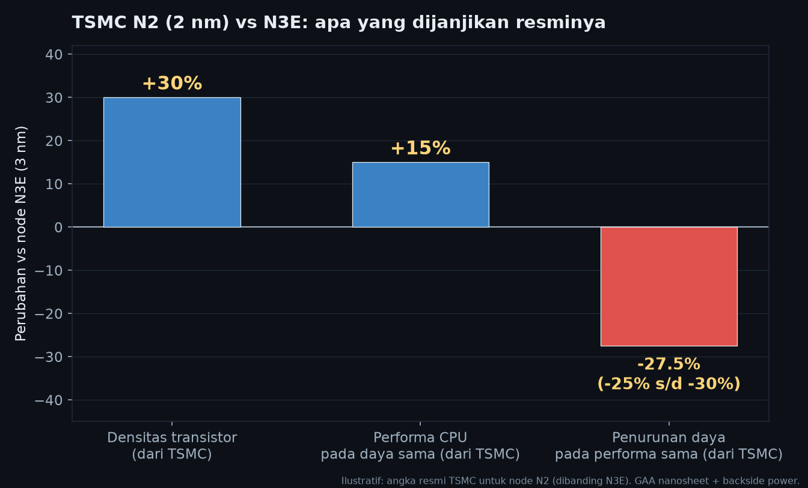
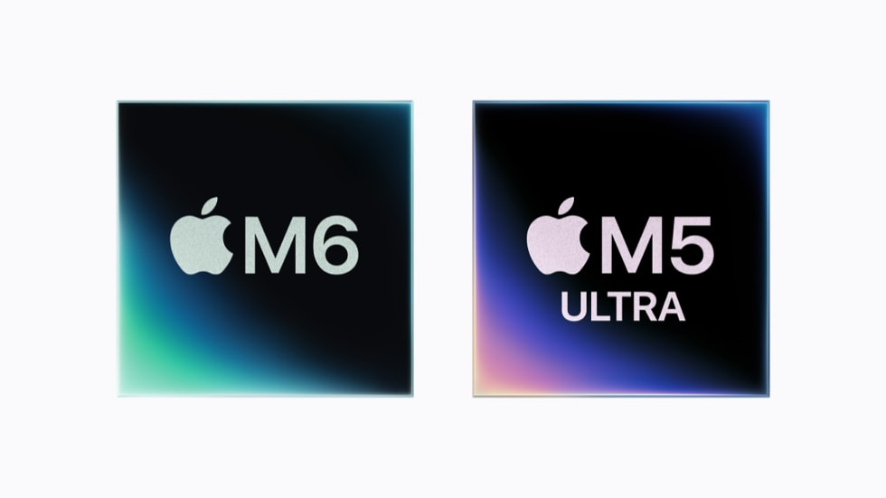
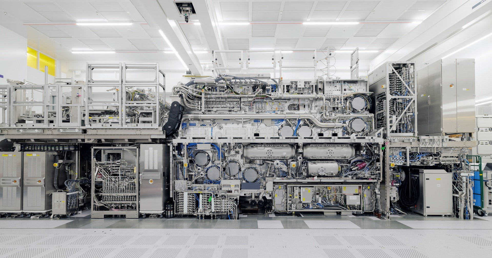
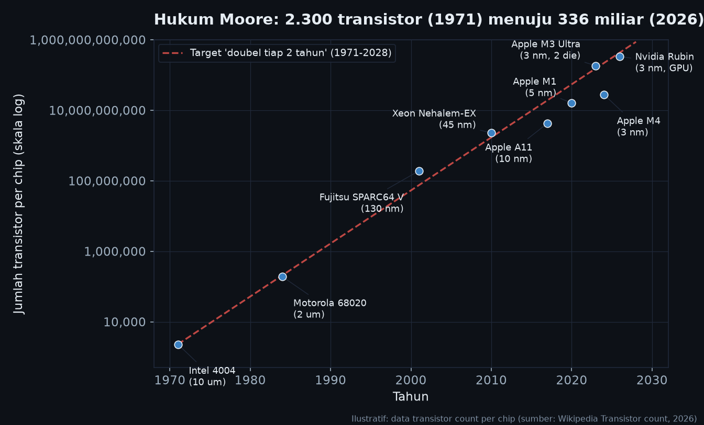

Minggu ini kalau kamu buka feed tech, dua headline yang sama-sama nyebut angka "2" muncul hampir berdekatan. MediaTek umumkan Dimensity 9600 Pro, SoC smartphone <u>2nm pertama di dunia</u>. Dan Apple yang udah diumumkan sejak 25 Agustus, M6, chip <u>konsumen 2nm pertama</u> mereka, siap ikut debut bareng Mac mini baru tanggal 22 September. Dua rilis, satu node, dua raksasa.

Kenapa minggu ini penting? Bukan cuma karena angka "2nm" terdengar futuristik. Tapi karena ini momen di mana kita bisa jawab tiga pertanyaan besar: kenapa sih industri masih terus mengecilin chip padahal makin mahal untuk ngebuatnya, apa sih yang bikin proses di bawah 3nm jadi seberat ini (EUV, GAA, backside power), dan seberapa dekat Tiongkok ke garis depan. Plus satu pertanyaan yang udah berkali-kali dikuburkan: apakah Moore's Law sudah mati?

Jawabannya singkat: belum. Tapi jalannya nggak lagi zig-zag eksplosif kayak dulu. Sekarang lebih seperti pendakian pelan di trek yang tanahnya makin keras.

## Kenapa Semakin Kecil Proses, Semakin Bagus

Sebelum masuk ke chip-nya, kita rapikan dulu konsepnya, karena di sinilah banyak yang masih bingung. Angka "2nm" itu bukan ukuran fisik transistor secara harfiah. Itu nama node, label marketing yang kebetulan masih nyambung ke skala. Yang penting sebenarnya adalah apa yang bisa kamu kemas di dalam satu area wafer.

Tiga hal yang bikin node kecil selalu menang:

**Pertama, kepadatan.** Transistor lebih rapat = lebih banyak core, lebih banyak cache, lebih banyak fitur, di atas die yang sama luasnya. Dan die itu mahal, jadi setiap milimeter persegi adalah uang. TSMC sendiri mengklaim node N2 (2nm) memberi +30% kepadatan dibanding N3E (3nm generasi terbaru).

<i>Klaim resmi TSMC: N2 memberi +30% densitas, atau +15% performa pada daya sama, atau -25% s/d -30% daya pada performa sama</i> source: TSMC

**Kedua, daya.** Channel transistor makin pendek, kapasitansinya (bener gak ya bahasa Indonesianya...) makin kecil, elektron makin gampang "dipindahin". Efeknya: untuk kecepatan yang sama, dayanya lebih hemat, atau dengan daya yang sama, kecepatannya lebih tinggi. TSMC mengkuantifikasinya: di N2, kamu bisa dapat +15% performa pada daya yang sama, atau hemat 25 sampai 30% daya pada performa yang sama. Di HP, ini langsung terasa: baterai awet, bodi nggak panas, nggak perlu vapor chamber sebesar oven.

**Ketiga, performa per watt.** Ini gabungan dua hal di atas, dan justru ini yang bikin konsumen "bisa beli". Chip yang 1,5x lebih cepat tapi 2x lebih boros daya itu kalah di tangan dari chip yang 1,2x lebih cepat tapi setengahnya dayanya. Di era AI on-device, perf/watt adalah raja.

Jadi "2nm lebih bagus dari 3nm" itu bukan janji marketing kosong. Itu ada angkanya, dan angkanya resmi dari TSMC.

## Dua Chip, Dua Cerita

### Apple M6: Chip 2nm Konsumen Pertama

Apple resmi umumkan M6 pada 25 Agustus 2026, dan menurut rilis persnya, ini "Apple's first state-of-the-art 2-nanometer chip". M6 turun di Mac mini baru, yang dijadwalkan 22 September 2026.

<i>Apple M6, chip 2nm konsumen pertama Apple, debut di Mac mini</i> source: Apple

Spesifikasinya, dari rilis pers Apple:

- CPU 12-core baru: 2 super core, 4 performance core, 6 efficiency core (2 core lebih banyak dari M5). Klaimnya: single-thread tercepat di dunia, multithread sampai 1,2x lebih cepat dari M5 dan 2,4x dari M1.
- GPU 12-core, tiap core-nya ada Neural Accelerator. Puncak compute AI naik hampir 30% dibanding M5, dan lebih dari 8x dibanding M1.
- Dual 16-core Neural Engine: sampai 2x peak compute AI dibanding generasi sebelumnya, dan dua engine ini bisa dipakai bersamaan.
- Memori unified sampai 32GB, bandwidth 170GB/s (naik 10% dari M5, 2,5x dari M1).

Yang menarik dari M6 bukan cuma kebaruan node-nya, tapi konteksnya. Apple sengaja nggak rilis jumlah transistor M6 (jadi kita nggak bisa mengutip angka itu, dan saya nggak akan mengarang). Yang kita tahu: M5 Ultra, chip pendamping yang diumumkan bersamaan, pakai arsitektur quad-die pertama Apple, CPU sampai 36 core, GPU 80 core, bandwidth 1,2TB/s, memori sampai 512GB. Itu bukti bahwa strategi Apple sekarang dua jalur: M6 untuk efisiensi harian di 2nm, M5 Ultra untuk monster AI dengan pendekatan "more than Moore" (nanti saya jelaskan istilah itu).

### MediaTek Dimensity 9600 Pro: SoC HP 2nm Pertama

Sisi MediaTek lebih tipis dokumentasinya, detail resminya belum separuh detil rilis pers Apple. Yang tercatat (menurut laporan TrendForce dan media tech): Dimensity 9600 Pro adalah SoC smartphone kelas 2nm pertama, diumumkan sekitar 15 September 2026, dibangun di atas TSMC N2, mendukung LPDDR6 dan UFS 5.0, dengan NPU yang disetel untuk "agentic AI" on-device. Posisinya jelas: menantang Snapdragon 8 Elite.

Kenapa ini penting buat pasar Indonesia? Karena node 2nm di HP flagship berarti dua hal: AI on-device yang benar-benar bisa jalan tanpa panas dan boros baterai, dan efisiensi yang bikin HP tipis nggak perlu kompromi di thermal. Kalau M6 bukti 2nm di desktop, Dimensity 9600 Pro adalah buktinya di kantong jeans kamu.

## Tantangannya: EUV, GAA, dan Uang

Nah, bagian ini yang bikin "2nm" bukan cuma angka kecil di nameplate. Ada tiga hal baru di TSMC N2 yang belum ada di node sebelumnya:

**GAA nanosheet.** Node 2nm adalah node pertama yang *meninggalkan FinFET* dan pindah ke transistor *Gate-All-Around*: gerbangnya sekarang menyelubungi channel dari empat sisi, bukan tiga. Kontrol elektronnya jadi jauh lebih presisi, dan itu yang memungkinkan channel makin pendek tanpa leakage melarikan.

**Backside power delivery.** Di node sebelumnya, jalur catu daya dan jalur sinyal rebutan ruang di sisi depan wafer. Di N2, catu dayanya dipindah ke sisi belakang wafer. Sisi depan jadi "bersih" untuk transistornya. Ini seperti memindahkan seluruh pipa listrik dari dapur ke lantai bawah, supaya dapurnya makin bisa diisi kompor, bukan pipa.

**EUV standard.** Dan di sinilah uangnya. Node 2nm dicetak pakai EUV (Extreme Ultraviolet): cahaya 13,5nm yang dipantulkan lewat puluhan cermin presisi (kaca biasa bakal menelan cahaya EUV, jadi cerminnya harus mulus sampai level atom). Satu mesin EUV ASML itu sekitar $170 sampai $200 juta. Dan ASML adalah satu-satunya di dunia yang membuatnya.

<i>ASML EXE:5000, sistem EUV High-NA dengan NA 0.55 dan resolusi 8nm, siap cetak dengan satu paparan. N2 pakai EUV standard, High-NA ditargetkan untuk node setelahnya</i> source: ASML

Yang layak dicatat: N2 masih pakai EUV standard, bukan High-NA. Mesin EXE:5000 dengan NA 0.55 dan resolusi 8nm itu memang sudah jadi, tapi ditargetkan untuk node setelahnya. Jadi "2nm" ini bukan node paling ekstrem yang bisa dicetak. Itu keputusan cerdas: pakai alat yang sudah matang, tarik yield-nya naik, dan sisakan High-NA untuk node berikutnya.

Dan bicara soal uang, di sinilah sisi gelapnya. Wafer N2 dilaporkan sekitar $24.570 sampai $25.000 per keping, naik sekitar 50% dibanding 3nm. TSMC bahkan dikabarkan menghentikan era "transistor murah" dengan kenaikan harga 5 sampai 10% di node-node advanced. Efeknya langsung: chip makin efisien, tapi perangkat makin mahal. Ini bukan kontradiksi, ini trade-off yang harus kita terima: efisiensi per watt naik, tapi biaya per transistor juga naik.

Saya ingat di Intel, waktu saya terlibat di display reference design untuk embedded systems, pelajaran yang sama terus berulang: pilihan proses bukan cuma soal spek. Proses menentukan biaya wafer, yield, dan akhirnya harga produk yang sampai ke tangan konsumen. Dulu diajari lewat display, sekarang terbukti lagi lewat semikonduktor. Prinsipnya satu: angka kecil di datasheet itu punya tagihan tambahan.

## Moore's Law: Mati Berkali-kali, Tapi Masih Jalan

Sekarang ke pertanyaan yang kamu pasti denger di mana-mana: "Moore's Law sudah mati." Kalimat itu diucapkan setiap tiga tahun sejak 2006, dan tiap tiga tahun berikutnya dibantah. Jadi yuk kita pakai angka, bukan perasaan.

<i>Jumlah transistor prosesor dari Intel 4004 (1971) sampai Nvidia Rubin (2026). Skala log: kenaikan eksponensial selama 50 tahun, lalu melandai</i> source: Wikipedia (Transistor count)

Mari kita lihat jalurnya. Intel 4004 tahun 1971: 2.250 transistor. Motorola 68020 tahun 1984: 190.000. SPARC64 V tahun 2001: 191 juta. Xeon Nehalem-EX 2010: 2,3 miliar. Apple A11 Bionic 2017: 4,3 miliar. Apple M1 2020: 16 miliar. Apple M4 2024: 28 miliar.

Dari 4004 ke M3 Ultra (2023, 184 miliar transistor, rekor mikroprosesor konsumen), jumlah transistor naik sekitar 82 juta kali dalam 52 tahun. Itu angka yang bikin bulu kuduk merinding. Dan secara rata-rata, laju itu sekitar 40% per tahun, yang hampir persis dengan "dobel tiap dua tahun" (1,41x per tahun). Jadi kalau ada yang bilang Moore's Law mati total, angka di atas itu bukti bahwa hukumnya, secara agregat, masih jalan nyaris tepat di kurvanya selama lima dekade.

Tapi. Di sinilah nuansanya, dan di sinilah kamu bisa bilang "ya, ia melambat". Lihat rentang terakhir: M1 (2020) ke M4 (2024) hanya naik 1,75x dalam 4 tahun. Itu sekitar 15% per tahun, jauh di bawah laju klasik 40%. Per node, TSMC sekarang memberi sekitar 1,3x densitas dan +15% performa, bukan 2x. Node ke node, kurva itu melandai.

Jadi jawabannya: Moore's Law tidak mati, ia berevolusi. Industri sekarang bertumpu pada "more than Moore", yaitu cara-cara menambah compute tanpa bergantung pada pengecilan 2D: 3D stacking, chiplet, HBM, quad-die (seperti M5 Ultra), sampai multi-die di batas reticle (seperti Nvidia Rubin GR200 dengan 336 miliar transistor, rekor GPU 2026). Kurva 2D melandai, tapi kurva total compute masih naik, lewat dimensi yang dulu cuma imajinasi.

Coba bayangin Moore's Law itu jalan tol yang 50 tahun terakhir terus di-lebarin. Sekarang lebarnya udah mentok, tapi solusinya bukan menutup tol. Solusinya: bikin tol dua tingkat, tambah jalur, dan bikin kendaraannya lebih hemat bahan bakar. Arus kendaraan (compute) tetap naik, cuma lewat cara yang berbeda.

## Tiongkok: Mengejar di Trek yang Dibatasi

Bagian terakhir, dan yang paling banyak ditanyakan: seberapa dekat Tiongkok?

Jawaban : masih beberapa generasi di belakang, dan batasnya bukan kemampuan desain, tapi litografi. SMIC, foundry paling maju di Tiongkok, menghasilkan chip kelas 7nm (N+2/N+3) dengan teknik multi-patterning DUV, yaitu mencetak pola beberapa kali dengan alat litografi "relatif tua" untuk mendapatkan pola setipis 7nm. Huawei Kirin 9030 yang keluar 2024/2025 jalan di proses itu, dan dilaporkan mereka sedang berupaya merambah kelas 5nm lewat DUV multi-exposure.

Kenapa DUV multi-patterning itu mahal? Setiap lapisan ekstra = masker ekstra, alignment ekstra, yield yang turun, dan biaya yang naik. Ini seperti mencetak gambar yang sama 4x lebih teliti dengan mesin yang resolasinya setengah, lalu menyatukannya dengan presisi. Bisa, tapi hasilnya tidak pernah senapas dengan sekali cetak EUV.

Dan di sinilah export control Amerika Serikat, Belanda, dan Jepang jadi faktor penentu: Tiongkok tidak bisa membeli alat EUV. ASML satu-satunya yang membuatnya, dan penjualan ke Tiongkok terblokir ketiga negara itu. Jadi selama node butuh EUV, Tiongkok harus memutar otak lewat DUV multi-patterning dan investasi litografi domestik (SMEE, kelas DUV 28nm).

Jaraknya sekarang: TSMC, Intel, dan Samsung di 2nm; Tiongkok di kelas 7nm. Itu sekitar 3 sampai 4 generasi node. Generasi, bukan tahun.

Tapi satu hal yang saya perhatikan dari perjalanan ini: setiap kali ada yang bilang "Tiongkok nggak akan pernah bisa", satu dekade kemudian mereka sudah keluar dengan sesuatu yang tak terduga. Huawei membangun ekosistem desain sendiri (HarmonyOS, Kirin in-house). SMIC memperluas kapasitas. Dan investasi di litografi domestik terus berjalan. Pertanyaannya bukan lagi "apakah mereka akan sampai", tapi "berapa lama, dan lewat jalur mana" untuk ngejar teknologi node ini.

## Penutup: 2nm Baru Awal Cerita

Minggu ini, 2nm turun ke tangan konsumen: di Mac mini dengan M6, di HP flagship dengan Dimensity 9600 Pro. Dan yang menarik, dua-duanya membuktikan hal yang sama: node kecil masih menang, tapi caranya sudah berbeda. Bukan lagi "dobel setiap dua tahun", tapi kombinasi 30% densitas, 25% hemat daya, dan "more than Moore" lewat 3D dan multi-die.

Moore's Law belum mati. Ia berubah bentuk: dari lari maraton menjadi pendakian gunung. Lari maraton itu cepat dan lurus. Pendakian itu lambat, tanahnya keras, dan setiap meter butuh energi lebih. Tapi puncaknya, itu tetap puncak.

Bagi kita yang cuma pakai HP dan laptop, artinya sederhana: chip tahun ini jauh lebih hemat daya dari chip 4 tahun lalu, dan AI on-device akhirnya cukup murah untuk jalan di saku. Dan ya, harga wafernya naik sekitar 50%, jadi siap-siap, HP flagship 2nm ini nggak akan murah. Tapi itu trade-off yang menurut saya layak: kita bayar lebih, untuk efisiensi yang selama 50 tahun terakhir selalu membayar lunas.

Sampai jumpa di node berikutnya.

---
