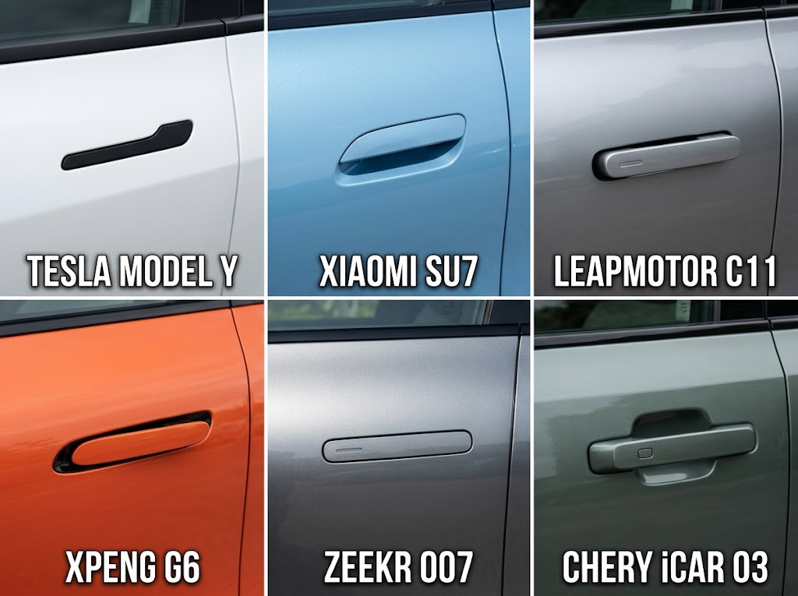

Tanggal 21 Agustus 2026, Tesla dan delapan pabrikan lain mengumumkan recall di China: totalnya 4,3 juta unit. Ini recall terbesar dalam sejarah otomotif China, dan penyebabnya bukan baterai, bukan software yang crash, bukan suspensi. Penyebabnya: gagang pintu yang terlalu rapi.

Lebih tepatnya, bagian yang dipersoalkan regulator adalah mekanisme pelepasan darurat pintunya. Di mobil-mobil ini, pintu biasanya dibuka oleh handle tersembunyi (flush door handle): handle yang rata dengan bodi, keluar secara elektronik saat kunci atau HP Anda terdeteksi. Setelah tabrakan parah, listrik bisa mati, handle tetap rata di bodi, dan pelepasan daruratnya mekanis tapi posisinya nggak jelas: di saku pintu, atau di bawah panel.

Menurut pernyataan Tesla ke SAMR (State Administration for Market Regulation), mekanisme pelepas darurat mekanis bisa sulit diidentifikasi setelah tabrakan parah dan kegagalan sistem kelistrikan. Artinya: penumpang kesulitan keluar, dan tim penyelamat kesulitan masuk.

Detailnya per pabrikan, dari dokumen recall SAMR:

| **Pabrikan / Merek** | **Model Terpengaruh & Rincian**                                                                                           | **Unit Ditarik** | **Tindakan Perbaikan**                             |
| -------------------- | ------------------------------------------------------------------------------------------------------------------------- | ---------------- | -------------------------------------------------- |
| **Tesla**            | **Rakitan China:** Model Y (1.956.713), Model 3 (973.156) / **Impor:** Model 3 (35.590), Model X (8.328), Model S (2.123) | **2.975.910**    | Label peringatan + OTA window drop                 |
| **Xiaomi**           | SU7 (2024 MY)                                                                                                             | **390.435**      | Label peringatan + OTA center-unlock & window drop |
| **Leapmotor**        | C11 (322.575), C01 (48.625)                                                                                               | **371.200**      | Label peringatan + OTA update                      |
| **XPeng**            | G6 (134.588), P7+ (94.688), X9 (35.566)                                                                                   | **264.842**      | Label peringatan di posisi release interior        |
| **Geely (Zeekr)**    | Zeekr 007, Zeekr X                                                                                                        | **92.658**       | Label peringatan + OTA update                      |
| **Chery**            | iCAR 03, Fulwin X3                                                                                                        | **68.488**       | Penggantian fisik cover pelepasan darurat          |
| **Dongfeng**         | Nammi 06, Aeolus L8, eπ 007, eπ 008                                                                                       | **53.452**       | Label peringatan + OTA update                      |
| **BAIC (Arcfox)**    | Arcfox Kaola                                                                                                              | **46.850**       | Penggantian cover dengan label teks                |
| **FAW Hongqi**       | EH7 (7.873), Tiangong 08 (4.035)                                                                                          | **11.908**       | Label peringatan + OTA update                      |
| **Total**            | **9 pabrikan (kampanye gagang pintu)**                                                                                    | **4.275.743**    | -                                                  |

<i>Sumber: dokumen recall SAMR, 21 Agustus 2026. Catatan: perbaikan Chery dan BAIC dilakukan secara fisik (penggantian cover), sisanya kombinasi label dan OTA.</i>

Tesla sendirian menguasai mayoritas kampanye ini dan recall-nya baru mulai dijalankan 25 September 2026. Yang menarik dari tabel di atas: hampir semua perbaikannya ringan (label + OTA), kecuali dua pabrikan yang harus mengganti cover secara fisik. Total keseluruhannya: 4.275.743 unit, angka yang belum pernah terjadi dalam sejarah otomotif China.

Perbaikannya juga khas mobil listrik era ini: mayoritas pabrikan cukup pasang stiker yang menunjukkan posisi release darurat, lalu push OTA update software. Setelah update, jendela akan turun otomatis setelah tabrakan. Hanya Chery dan BAIC yang harus mengganti cover pelepasan darurat secara fisik, jadi dua merek itulah yang unitnya benar-benar masuk bengkel. Sam Fiorani dari AutoForecast Solutions menilai biaya recall-nya tetap terbatas, dan OTA memangkas biaya dan downtime dibanding recall besar di masa lalu.

## Kenapa Handle Rata?

Sebelum masuk ke masalahnya, perlu dilihat dulu kenapa desain ini ada. Gagang pintu flush dipopulerkan Tesla: handle menyatu rata dengan panel pintu, keluar saat Anda mendekat dengan kunci atau HP, dan masuk lagi setelah pintu dibuka. Hasilnya bodi jadi mulus, kesan minimalis, dan drag udara lebih rendah, yang untuk mobil listrik berarti jangkauan beberapa kilometer lebih jauh.

<i>Gagang pintu flush pada enam model yang masuk recall: Tesla Model Y, Xiaomi SU7, Leapmotor C11, Xpeng G6, Zeekr 007, dan Chery iCAR 03. Foto: Wikimedia Commons (CC BY-SA 4.0) dan arsip pabrikan.</i>

Jujur, saya tetap bilang desain flush itu memang keren. Handle Model S saya yang keluar sendiri menyambut waktu saya mendekat itu salah satu detail favorit saya di mobil listrik, dan lihat saja keenam handle di atas: semuanya rapi, semua terasa futuristik. Tapi recall 4,3 juta ini persis momen di mana coolness ditumpuk terlalu jauh: sampai-sampai keselamatan harus bayar tagihannya.

Masalahnya dimulai dari situlah: seluruh fungsi handle tergantung pada listrik dan sensor.

## Cerita di Balik Recall Ini: Satu Kecelakaan

Trigger resmi yang dikutip Reuters adalah kecelakaan fatal sebuah Xiaomi SU7 yang diliput media resmi China pada Oktober 2025: sopir meninggal setelah mobilnya terbakar, dan orang-orang di sekitar dilaporkan tidak berhasil membuka pintunya untuk menolong. Laporan-laporan awal menyebut varian SU7 Ultra, tapi untuk artikel ini saya pakai "SU7" karena itu yang dikonfirmasi Reuters.

Sebelum itu, tekanannya sudah lama terbangun. Beberapa gugatan di AS menuduh desain gagang pintu Tesla menyebabkan cedera dan kematian karena penumpang terjebak di kendaraan yang terbakar. Pengendara juga berkirim keluhan ke NHTSA soal kesulitan mengeluarkan anak dari mobil. JD Power bahkan sudah menandai handle pintu sebagai "percolating problem area" sejak 2023, dan 7 dari 10 model paling bermasalah di area itu adalah EV.

Michael Brooks, executive director Center for Auto Safety, merangkumnya begini: pintu-pintu dengan handle model ini memakai tombol, bukan sistem mekanis. Tanpa pelepasan manual yang jelas saat listrik mati, keluar dari mobil dalam situasi mengancam nyawa jadi susah. Pada beberapa model Tesla, release-nya ada di door pocket atau di bawah panel, tanpa signage yang jelas.

## Perbaikan: Stiker dan Update Software

Yang dilakukan pabrikan dalam recall ini relatif ringan, dan itu bagian yang menarik. Tesla akan mulai 25 September 2026 memasang stiker yang menunjukkan posisi mekanisme pelepas darurat, dan meng-OTA perbaikannya. Fungsi utamanya: setelah tabrakan, jendela otomatis turun, jadi pintu bisa dibuka dari luar tanpa harus memutus jendela atau membongkar. Leapmotor menyatakan hanya melakukan label peringatan dan upgrade software jendela, "sebagai rasa tanggung jawab kepada pengguna." Xiaomi tidak memberikan komentar tambahan.

Jadi secara teknis, "defek" yang diperbaiki regulator adalah: Anda tidak bisa menemukan cara membuka pintu ketika Anda paling panik. Solusinya: tempelkan stiker, dan pastikan ada satu jalur listrik lain (jendela turun) yang bekerja setelah impact.

## Larangan 2027: China Negara Pertama

Bagian yang sebenarnya paling penting dari berita ini bukan recall-nya, tapi apa yang sudah terjadi sebelumnya. Pada Februari 2026, MIIT (kementerian industri China) mengumumkan aturan: mulai 1 Januari 2027, setiap mobil baru yang dijual di China harus punya mekanisme pelepasan pintu mekanis, di dalam dan di luar, untuk setiap pintu. Tailgate dikecualikan. Handle elektronik boleh tetap ada, selama release mekanisnya ada.

Standar resminya adalah GB 48001-2026: model baru wajib patuh sejak approval tipe, dan model yang sudah ter-approve sebelumnya diberi waktu sampai 1 Januari 2029 untuk comply.

China jadi negara pertama yang secara resmi membatasi desain ini. Dan ini bukan kebetulan: tahun 2026, Beijing memang menaikkan pengawasan atas EV, dengan persyaratan keselamatan yang lebih ketat di tengah perang harga yang brutal. Mobil modern semakin dikendalikan software, dan regulator ingin memastikan: software boleh pintar, tapi pintu harus tetap bisa dibuka dengan tangan.

Di sisi lain, NHTSA (regulator AS) bulan Juli 2026 menyatakan masalah door release sebaiknya diatasi lewat standar keselamatan formal baru untuk seluruh pabrikan, bukan lewat recall satu per satu. Saat berita recall China keluar, belum ada satu pun pabrikan yang memberitahu NHTSA soal recall serupa di AS. UNECE juga sedang merancang standar baru supaya handle elektronik bisa dibuka dari dalam dan luar jika listriknya putus.

Artinya: China bergerak lebih cepat. AS dan Eropa sedang menyusul lewat jalur rulemaking yang lebih lambat.

## Kenapa Ini Soal HMI

Di sini saya keluar dari mode berita dan masuk ke mode HMI engineer.

Gagang pintu adalah salah satu interaksi paling mendasar yang ada pada mobil. Selama 100 tahun, jawabannya mekanis: tarik, pintu terbuka. Flush handle mengubah interaksi ini jadi dua langkah: sensor harus mendeteksi Anda, dan motor kecil harus menggerakkan handle keluar. Dua langkah itu, masing-masing, punya failure mode sendiri.

Dalam desain HMI, ada prinsip yang selalu saya pegang: interaksi yang menyangkut keselamatan harus bisa dieksekusi tanpa mengasumsikan sistem bekerja. Setir harus bisa diputar tanpa power steering. Rem harus bisa ditekan tanpa booster. Pintu harus bisa dibuka tanpa listrik. Prinsip ini sama dengan kenapa mobil masih punya pedal cadangan untuk rem, kenapa emergency brake mekanis tetap ada di mobil modern, dan kenapa pilot selalu punya override manual untuk autopilot.

Flush handle melanggar prinsip itu, dan solusinya (stiker + jendela turun otomatis) sebenarnya tidak memperbaiki masalah aslinya. Jendela turun membantu orang luar membuka pintu, tapi orang di dalam yang panik tetap harus mencari release mekanis di tempat yang tidak jelas. Stiker membantu, tapi stiker bisa luntur, bisa terhalang, dan di kegelapan setelah tabrakan, mata manusia bukan pembaca yang andal.

Franz von Holzhausen, head of design Tesla, sudah mengisyaratkan arah yang benar: menggabungkan pelepasan elektronik dan mekanis ke dalam satu tombol. Itu baru solusi HMI yang benar: satu interaksi, satu titik, dua mekanisme. Bukan dua mekanisme yang harus Anda cari di dua tempat.

## Yang Perlu Diketahui Pemilik EV di Indonesia

Bagian yang paling langsung menyangkut kita.

Beberapa EV yang dijual di Indonesia memakai gagang pintu elektrik tersembunyi: BYD Seal dan BYD Sealion 7 (media lokal eksplisit menyebut "gagang pintu elektrik tersembunyi" sebagai salah satu fitur), serta Tesla Model 3 dan Model Y yang masuk lewat jalur impor resmi. Xiaomi SU7 belum masuk resmi ke Indonesia.

Recall 21 Agustus ini hanya berlaku untuk unit yang dijual di China. Tidak ada recall serupa yang diberitakan untuk unit Indonesia. Tapi ada dua hal yang layak dicatat:

**Pertama, kenali mobil Anda.** Jika Anda membeli EV dengan handle tersembunyi, cari sekarang, dalam kondisi tenang dan terang: di mana letak mekanisme pelepas darurat pintunya. Buka manual, atau minta diler tunjukkan. Simpan fotonya di galeri HP. Ini bukan paranoia, ini dua menit yang bisa jadi berbeda sekali di situasi yang tidak Anda harapkan.

**Kedua, jangan anggap ini cuma urusan China.** Standar 2027-nya baru berlaku di China, tapi arah regulatornya jelas: NHTSA sudah menyatakan masalah ini perlu standar formal, UNECE sedang merancang standarnya, dan Eropa sudah menandai desain handle sebagai risiko sejak tahun lalu. Desainer mobil di seluruh dunia sedang melihat recall 4,3 juta ini sebagai preseden. EV baru yang Anda beli dua-tiga tahun dari sekarang kemungkinan besar akan punya kombinasi release mekanis yang lebih jelas. Yang sudah keluar, belum tentu.

Dan ini menariknya: Indonesia belum punya aturan soal ini. Jika tren global berlanjut, bisa jadi satu hari nanti regulasi lokal akan mengikuti. Untuk saat ini, yang bisa kita andalkan adalah manual, dan kebiasaan memeriksa.

## Penutup

Recall 4,3 juta unit ini, pada dasarnya, adalah pelajaran rendah hati bagi seluruh industri: mobil listrik membuat bodi makin mulus, kabin makin bersih, interaksi makin "tanpa sentuhan". Dan di suatu titik, suatu regulasi di suatu negara bertanya: kalau listriknya mati, siapa yang membuka pintu?

Jawaban 100 tahun terakhir selalu sederhana: tangan Anda. Desain yang baik bukan yang menghilangkan tangan dari persamaan, tapi yang memastikan tangan selalu punya tempat untuk bekerja.

Seperti yang sudah saya tulis di [B38](/blog/blog38_cybercab_hmi_satu_layar/): Cybercab berani menyingkirkan setir dan pedal. Keberanian itu indah. Tapi keberanian tanpa redundancy adalah keberanian yang berbahaya. Sekarang kita punya buktinya: 4,3 juta mobil ditarik, bukan karena teknologinya gagal, tapi karena interaksi terkecilnya tidak punya jalur cadangan.

Pintu adalah HMI pertama dan terakhir dari sebuah mobil: di sanalah Anda masuk, dan di sanalah Anda keluar. Dan di situlah, tidak ada yang boleh mengandalkan sensor.

---

*Thomas Agung adalah HMI engineer dengan pengalaman 15 tahun di industri otomotif, pernah bekerja di Sony, Intel, dan Motherson. Ia menulis tentang human machine interface, display technology, dan future mobility.*
