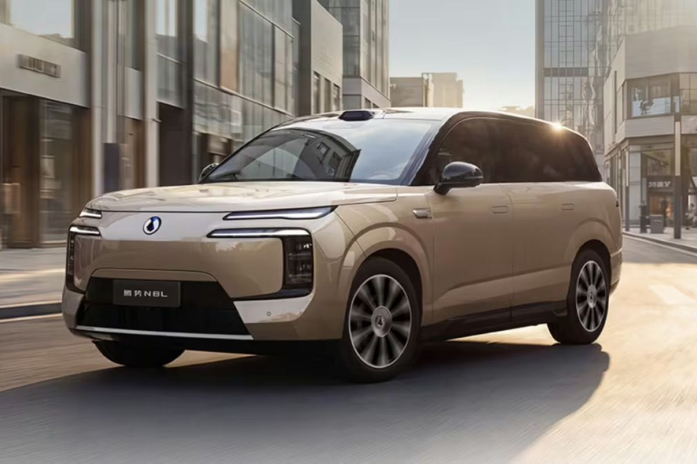
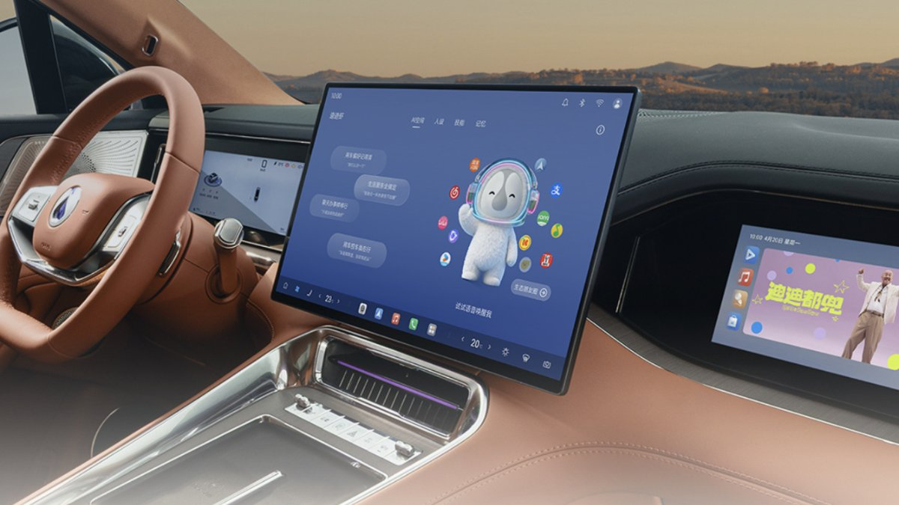
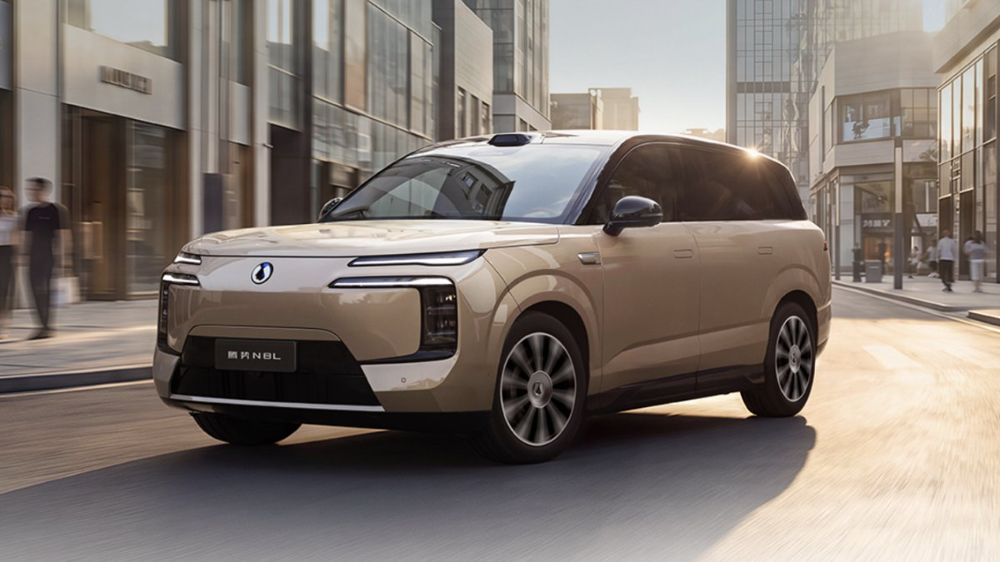
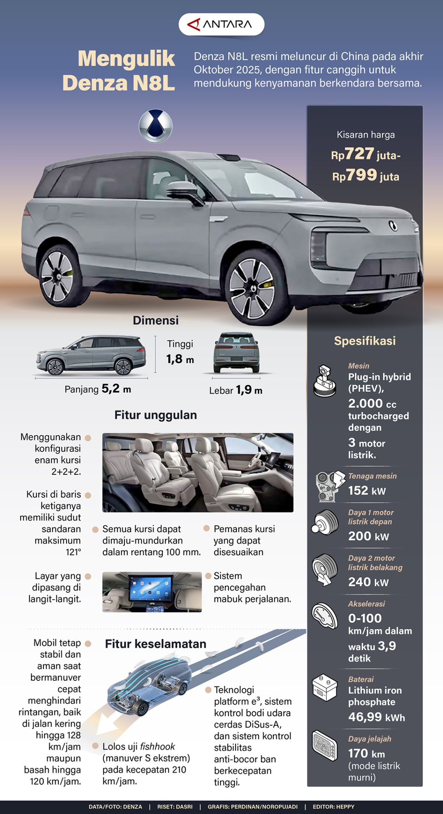
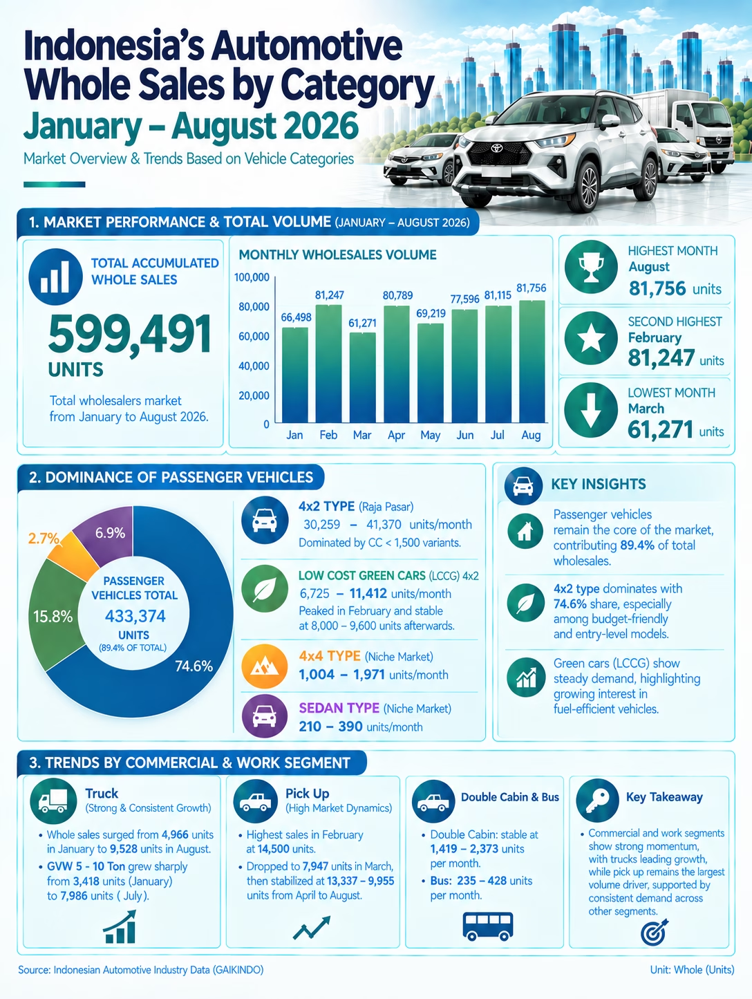

Denza N8L versi all electric baru 13 hari resmi meluncur di China: tanggal 14 September 2026. Tapi orang Indonesia tidak perlu menunggu 13 hari untuk kenal mobil ini. GIIAS 2026, yang baru saja lewat di Juli, sudah memamerkan N8L di arena [menurut laporan Kompas](https://www.kompas.com/otomotif/read/2026-07-14/11253467/denza-n8l-dipamerkan-di-giias-2026-ini-spesifikasi-dan-harganya). Jadi posisinya agak aneh: mobilnya baru lahir di negara asalnya, tapi kita sudah melihatnya lebih dulu.

<i>Denza N8L BEV: SUV 6 kursi dengan jarak tempuh 960 km (CLTC). Foto: Denza via CnEVPost.</i>

Biar tidak salah paham: **Denza N8L belum dijual di Indonesia, dan belum ada harga resmi Indonesia.** Yang ada sekarang hanya harga China. Artikel ini membedah mobilnya apa adanya: enam layar di kabin, jarak tempuh 960 km, dan kenapa mereknya sekarang bukan lagi pendatang baru di sini.

## N8L itu apa sebenarnya?

Denza adalah merek premium di dalam grup BYD, dan N8L adalah SUV di posisi keluarga premium dalam jajaran itu. Nama N8L sendiri bukan baru: versi PHEV-nya (plug-in hybrid) meluncur di China sejak Oktober 2025. GM Denza saat peluncuran awal memposisikannya dengan jelas: N9 adalah bintang teknologi dan keselamatan, N8L adalah SUV premium yang fokus pada keluarga.

Yang bikin orang bingung, satu nama ini punya dua powertrain:

- **N8L BEV** (14 September 2026): listrik murni, baterai 130,15 kWh, mulai 299.800 yuan (sekitar Rp 794 juta) untuk varian Flash Charging Prestige, dan 329.800 yuan (sekitar Rp 873 juta) untuk Flash Charging Flagship.
- **N8L PHEV** (Oktober 2025): mesin bensin turbo plus baterai, mulai 319.800 yuan (sekitar Rp 847 juta) di China.

Angka peluncuran BEV dari [CnEVPost](https://cnevpost.com/2026-09-14/byd-denza-launches-all-electric-n8l/), dan sejarah peluncuran PHEV bisa dibaca di [JPNN](https://www.jpnn.com/news/denza-merilis-suv-hybrid-mewah-harga-mulai-rp-600-jutaan).

Secara fisik, N8L adalah SUV besar: panjang 5,2 meter, lebar hampir 2 meter, tinggi 1,82 meter, dengan panjang sumbu 3,075 meter. Kursinya enam dengan tata letak 2+2+2; baris kedua berupa dua kursi captain yang berdiri sendiri, dan baris ketiga bisa digeser maju mundur. Beratnya sekitar 3,11 ton. Kalau masuk ke Indonesia, pesaingnya langsung jelas: Pajero Sport, Fortuner, dan SUV premium lain di kelas yang sama.

## Kokpit: enam layar, dan kenapa bagian ini yang paling penting

<i>Kokpit N8L BEV: layar tengah menampilkan agen AI DiClaw, lengkap dengan cluster digital dan layar penumpang depan. Foto: Denza via CnEVPost.</i>

Deskripsi resmi saat peluncuran [melalui Antara](https://www.antaranews.com/berita/5746029/denza-n8l-listrik-hadir-dengan-baterai-130-kwh-jarak-tempuhnya-960-km) menyebut kabin N8L BEV punya **enam layar yang saling terhubung**: panel instrumen digital, layar sentuh tengah, layar hiburan penumpang depan, layar hiburan penumpang belakang, kaca spion digital berbasis kamera, dan head-up display AR (augmented reality) berformat ultra lebar.

Orang suka tanya kenapa saya yang 18 tahun di Jepang, 10 tahun di Jerman, dan kerja di bidang HMI dan display, mau repot-repot bedah mobil? Jawabannya ada di bagian ini.

Jumlah layar tidak pernah jadi masalah. Yang menentukan pengalaman kabin adalah arsitekturnya: siapa mengontrol apa, di layar mana, dan seberapa sering sopir perlu memalingkan mata dari jalan. N8L menjawab ini dengan pola yang benar. Informasi krusial untuk mengemudi (kecepatan, navigasi, status ADAS) diletakkan di cluster dan di AR-HUD, tetap di garis pandang. Informasi hiburan dipindah ke layar penumpang dan layar belakang. Efeknya: penumpang tidak lagi berebut satu layar di tengah, dan sopir tidak diganggu notifikasi. Enam zona visual, satu sistem yang merangkai semuanya.

Bayangin kayak gini: ruang kerja yang setiap kursinya punya monitor sendiri, tapi semuanya diatur satu sistem yang sama. Kamu bilang "saya mau ke Bandung besok pagi lewat Cipali", agen AI-nya merencanakan rute lintas provinsi, peta tampil di cluster, info jalan muncul di HUD, dan penumpang depan memilih filmnya sendiri tanpa perlu menyentuh kursimu. Tidak ada yang rebutan, tidak ada yang perlu menunjuk layar.

Yang mengatur semuanya itu adalah **DiClaw**, agen AI dari BYD. Menurut deskripsi peluncuran, DiClaw memahami perintah suara, membantu merencanakan rute lintas provinsi, dan bisa terhubung ke perangkat smart home. Dari kacamata HMI, ini arah yang benar: suara sebagai input utama, sentuh sebagai input sekunder. Tren industri lima tahun terakhir memang bergeser dari "semua lewat layar sentuh" ke "suara dulu, layar mengonfirmasi". Denza tidak ikut pelan-pelan: langsung ke bentuk paling lengkapnya, agen yang bisa bertindak, bukan sekadar menjawab.

Tambahan konteks dari keluarga N8: sebelum BEV ini meluncur, Denza sudah memamerkan kabin N8 dengan **head unit 30 inci** dan **layar panorama selebar 1,1 meter** yang membentang di dashboard tepat di bawah kaca depan, plus tuas perpindah di kolom kemudi, setir D-shape tiga palang, kamera pengawas sopir (DMS) di pilar A, dan kursi depan dengan pemanas, ventilasi, dan pijatan. [Kompas](https://otomotif.kompas.com/new-energy-vehicles/read/2026-09-01/202155915/interior-denza-n8-punya-layar-11-meter-dan-head-unit-30-inci) mencatat konsep ini mirip dengan Xiaomi YU7 dan Avatr 12, jadi bukan klaim "pertama di dunia".

Sebagai engineer display, dua hal yang saya perhatikan dari layar selebar 1,1 meter itu. Pertama: rasio aspek ultra lebar memang pas untuk informasi ambient (peta, visualisasi ADAS), karena mata tidak perlu bergerak jauh ke kiri-kanan. Kedua: tantangannya nyata di iklim tropis. Pantulan matahari dan sudut pandang penumpang adalah dua musuh utama layar selebar itu, dan siang hari di Indonesia adalah ujian terberatnya.

Untuk penumpang, dampaknya paling terasa di perjalanan panjang: anak di baris kedua punya hiburan sendiri, penumpang belakang tidak perlu bertanya "boleh lihat peta nggak?", dan sopir tetap memegang kendali penuh atas informasi yang penting. Saya pernah menulis tentang [Cybercab yang sengaja hanya pakai satu layar](https://t-agung.id/blog/blog38_cybercab_hmi_satu_layar/). N8L adalah ekstrem kebalikannya: enam layar, tapi dengan pembagian tugas yang jelas, bukan tumpukan panel tanpa arsitektur.

## ADAS, suspensi, dan detail yang sering terlewat

<i>N8L BEV di jalanan kota; pod LiDAR terlihat di atap. Foto: Denza via CnEVPost.</i>

Konektor antar layar itu bukan cuma soal visual. N8L BEV dipasarkan dengan sistem ADAS **God's Eye 5.0** (sebelum peluncuran, media menyebutnya dengan nama DiPilot): satu LiDAR di atap, lima radar millimeter-wave, 12 kamera definisi tinggi, dan 12 sensor ultrasonik. Fiturnya: pilot otomatis berbasis navigasi di jalan tol, bantuan mengemudi di area perkotaan (urban driving assistance), dan parkir otomatis.

Paket sensornya adalah kelas atas: LiDAR plus 12 kamera plus radar jarak jauh dan pendek adalah kombinasi yang selama ini dipasang di mobil-mobil premium. Yang membedakan N8L adalah jangkauannya sampai ke area perkotaan, bukan hanya tol. Dan karena HMI-nya sudah lengkap, visualisasi sistem ini punya ruang pamer yang cukup: kamu bisa melihat apa yang "dilihat" mobil tanpa harus menebak.

Di balik suspensinya ada **DiSus-A**: suspensi udara dual-chamber dengan peredam CDC (Continuous Damping Control) yang menyesuaikan redaman sesuai kondisi jalan. Lalu ada fitur yang sering dilewatkan: pengemudian roda belakang (rear-wheel steering) hingga 10 derajat ke dua arah, yang membuat radius belik minimum mobil sepanjang 5,2 meter ini hanya **4,58 meter**. Mobil sebesar ini bisa putar di tempat parkir rumah, bukan cuma di lapangan parkir mall. Di depan, ada **frunk** berkapasitas 208 liter yang terbuka dengan motor elektrik, lengkap dengan saluran pembuangan yang bisa ditutup supaya isinya bisa dibersihkan dengan air.

## Angka-angkanya: 960 km itu dari mana?

Baterai N8L BEV: **130,15 kWh**, Blade Battery generasi kedua (LFP/lithium iron phosphate) dari BYD, di atas arsitektur **800 volt**. Motornya tunggal di roda belakang: **370 kW (sekitar 500 hp)**, dengan kecepatan puncak 240 km/jam.

Jarak tempuhnya **960 km**. Dan angka ini wajib diberi label: itu metode **CLTC**, siklus uji China. Dalam WLTP (metode Eropa, yang lebih dekat ke penggunaan nyata), angkanya **sekitar 780 km**. Dua-duanya panjang, dan 960 km CLTC bisa dibilang salah satu yang terpanjang di kelasnya. Satu catatan penting: angka 1.003 km yang kadang muncul di pemberitaan adalah milik teaser Denza N8, mobil yang berbeda, dan tidak boleh dicampur.

Klaim yang paling viral: pengisian **10 ke 70 persen dalam 5 menit**, atau **10 ke 97 persen dalam 9 menit**. Saya tulis ulang dengan cakupannya, karena angka ini yang paling sering dipotong-potong: itu klaim pabrikan BYD, terukur di **stasiun flash charging milik BYD sendiri di China**, bukan hasil pengujian independen. Per akhir Agustus 2026, BYD sudah membangun sekitar 10.000 stasiun flash charging di China, dengan target 20.000 akhir tahun. Di luar jaringan itu, angka ini tidak dijamin.

Versi PHEV-nya punya spek berbeda, dan [Antara sudah mengulasnya lewat infografik "Mengulik Denza N8L"](https://www.antaranews.com/infografik/5213557/mengulik-denza-n8l): mesin 2.0L turbo plus tiga motor listrik (200 kW di depan, 240 kW di belakang), **0-100 km/jam dalam 3,9 detik**, baterai 46,99 kWh (LFP), dan jarak tempuh mode listrik murni **170 km**. Catatan penting: infografik itu memakai spek versi peluncuran Oktober 2025. Versi PHEV teranyar di China sudah naik ke baterai 75,26 kWh dengan jarak mode listrik sekitar 430 km, jadi spek Indonesia (kalau datang) kemungkinan mengikuti versi yang lebih baru.

<i>Infografik "Mengulik Denza N8L" dari Antara (data dan foto: Denza) dengan spek lengkap versi PHEV.</i>

Infografik yang sama menyebut **kisaran harga Rp 727 juta sampai Rp 799 juta** untuk PHEV versi peluncurannya. Versi teranyar di China mulai 319.800 yuan (sekitar Rp 847 juta). Sekali lagi: semua angka itu perkiraan media atau konversi dari harga China, bukan harga resmi Indonesia.

## Kenapa mobil ini penting untuk Indonesia

<i>Grafis resmi Gaikindo: whole sales mobil Indonesia per kategori, Januari sampai Agustus 2026. Sumber: Gaikindo.</i>

Karena cerita N8L di sini bukan soal satu mobil, tapi soal BYD. Data whole sales Gaikindo Januari sampai Agustus 2026: pasar mobil nasional 599.491 unit, dan BYD berada di **peringkat kelima** dengan **37.696 unit**, di belakang Toyota (175.931), Daihatsu (100.884), Suzuki (47.908), dan Mitsubishi (43.753). Di bulan Agustus 2026 saja, BYD **mendominasi segmen mobil listrik dan hibrida**: 7.870 whole sales dan 6.861 retail, di atas Jaecoo (3.300) dan Geely (2.121). Sumber: [Gaikindo](https://www.gaikindo.or.id/indonesias-automotive-whole-sales-by-category-january-august-2026/).

Di sisi produksi, BYD baru meresmikan pabrik di **Subang senilai sekitar Rp 16 triliun** untuk total investasi di Indonesia (pabrik plus infrastruktur pendukung) ([Tempo](https://www.tempo.co/ekonomi/byd-resmikan-pabrik-di-subang-senilai-rp-16-triliun-2285312)), dan [sudah berhenti mengimpor mobil ke Indonesia](https://www.antaranews.com/berita/5724855/byd-setop-impor-mobil-ke-indonesia-beralih-penuh-ke-produksi-lokal), beralih penuh ke produksi lokal. Artinya model-model berikutnya akan datang lewat jalur CKD, bukan CBU. Denza Indonesia saat ini memajang D9 dan B8 di situs resminya, dan N8L adalah kandidat natural untuk langkah berikutnya.

N8L dipamerkan di GIIAS 2026, dan dalam bahasa industri, memajang mobil yang belum dijual adalah sinyal permintaan. Orang Indonesia sudah melihat mobil ini, fotonya sudah tersebar, dan pertanyaan "kapan masuk, berapa harga" sudah berkeliaraan. Itu bukan noise, itu data pasar. Kalau kamu mengikuti [tulisan saya tentang perang layar EV di GIIAS 2026](https://t-agung.id/blog/blog34_giias2026_perang_layar_ev/), N8L adalah bukti bahwa arah itu datang lebih cepat dari yang diperkirakan.

Tapi ada satu hal yang bikin saya ragu: klaim flash charging 9 menit hidup di ekosistem jaringan BYD di China. Infrastruktur charging publik di Indonesia hari ini belum merata. Jadi ketika N8L masuk, dua hal yang menentukan nilainya bukan cuma harga: apakah 960 km CLTC itu terasa di rute nyata (Jakarta-Bandung, Jakarta-Yogyakarta), dan apakah BYD membawa strateginya soal charging, bukan hanya mobilmnya.

Soal harga, satu-satunya angka rupiah yang bisa dikutip hari ini adalah konversi: mulai Rp 727 juta (versi peluncuran PHEV, infografik Antara) sampai Rp 847 juta (versi PHEV teranyar), dan Rp 794 juta sampai Rp 873 juta untuk BEV (dari harga China). Semua bukan harga resmi Indonesia. Kalau memang masuk di kisaran Rp 800 juta sampai Rp 1 miliar, pesaingnya langsung jelas: Pajero Sport, Fortuner, dan gerombolan EV premium asal China di kelas itu. N8L datang dengan argumen yang sulit ditandingi di kelas tersebut: enam kursi, enam layar, dan jarak tempuh yang panjang.

## Yang perlu ditonton berikutnya

1. **Peluncuran resmi di Indonesia.** Denza sudah ada di sini lewat D9 dan B8. Apakah N8L menyusul, dan kapan?
2. **CKD di Subang.** Pabrik di Subang sudah berjalan, dan BYD sudah beralih ke produksi lokal. Model mana yang dibuat lokal berikutnya akan jadi sinyal serius soal komitmen harga.
3. **Infrastruktur flash charging.** Apakah BYD membangun jaringan chargernya sendiri di Indonesia, atau N8L akan hidup dari jaringan pihak ketiga yang belum serapi di China?

## Verdict: kokpit yang lebih menarik dari angkanya

Kalau saya harus menilai N8L dari kursi saya sekarang, begini: ini mobil yang bagian kokpitnya lebih menarik daripada angka-angkanya, dan angka-angkanya sendiri sudah cukup untuk membuat merek lain waspada. 960 km CLTC, enam layar dengan arsitektur yang benar, ADAS kelas atas dengan LiDAR, dan radius belik 4,58 meter untuk mobil sepanjang 5,2 meter.

Kelemahannya juga jelas: harga yang saya perkirakan di atas Rp 800 juta, dan janji charging 9 menit yang untuk saat ini hanya bisa dinikmati di China. Tapi BYD bukan perusahaan yang datang ke pasar baru dengan setengah komitmen. Mereka bawa pabrik, berhenti mengimpor, dan naik ke peringkat kelima merek terlaris dalam delapan bulan. N8L adalah langkah logis berikutnya. Yang kita tunggu sekarang bukan lagi "apakah masuk", tapi "kapan, dan berapa".

Dan dari sisi HMI, yang paling ingin saya lihat: AR-HUD ultra lebar dan layar panorama 1,1 meter itu, di bawah matahari Indonesia. Kalau BYD mau serius di sini, ujian pertamanya ada di situ.
