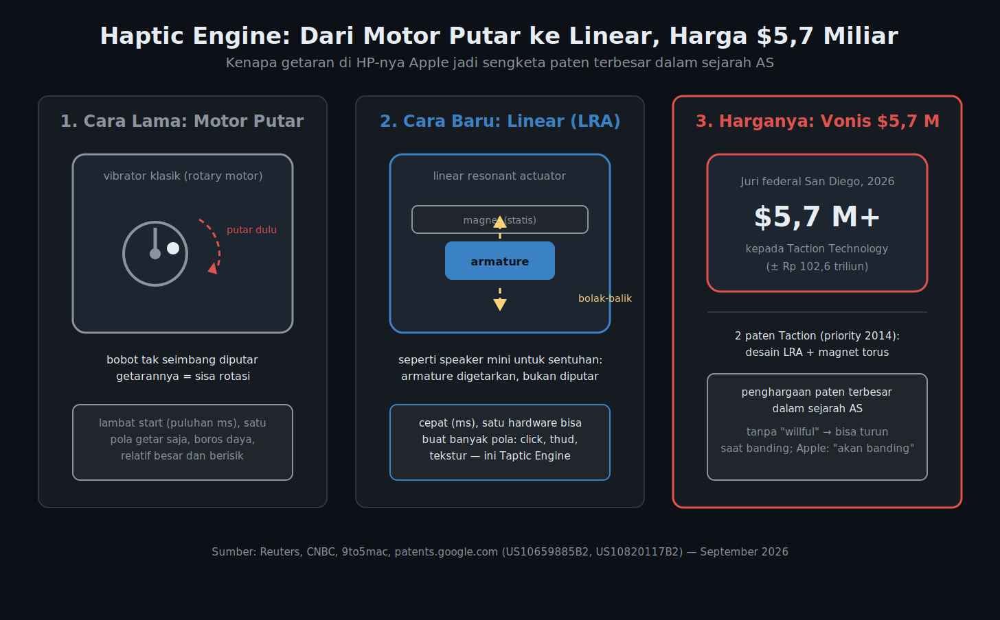

---
#Required fields
title: "Apple Divonis $5,7 Miliar Gara-Gara Getar HP-nya: Paten Taptic Engine"
description: "Juri federal San Diego memvonis Apple bayar lebih dari $5,7 miliar (~Rp 102,6 triliun) ke Taction Technology atas paten Taptic Engine. Vonis paten terbesar dalam sejarah AS, dan kenapa komponen getar sekecil itu begitu berharga."
pubDate: 2026-09-29
category: "produk"
cover: "../../assets/blog/44/B44_haptic_engine_verdict.png"
coverAlt: "Diagram tiga panel: motor putar klasik, linear resonant actuator, dan vonis $5,7 miliar"

#Core Fields
tags: ["Apple", "Taptic Engine", "Haptics", "HMI", "Paten"]
author: "Thomas Agung Nugraha"
lang: "id-ID"
draft: true

#recommended
slug: "blog44_apple_vonis_5_7_m_taptic_engine"
excerpt: "Apple divonis lebih dari $5,7 miliar karena Taptic Engine. Vonis paten terbesar dalam sejarah AS, sekaligus pelajaran kenapa haptics itu cabang tersendiri dalam HMI."
updatedDate: 2026-09-29

#Optional:SEO & Indexing
canonicalURL: "https://t-agung.id/blog/blog44_apple_vonis_5_7_m_taptic_engine"
keywords:
  - Apple Taptic Engine
  - paten haptik
  - Taction Technology
  - linear resonant actuator
  - haptic feedback
  - HMI
  - vonis paten Apple
noindex: false

#Optional-table-of-content
showToc: true

#optional-internal linking
relatedPosts:
  - blog38_cybercab_hmi_satu_layar
  - blog31_lidar_vs_radar_deep_dive
---

Jumat, 25 September 2026, waktu Amerika Serikat, sebuah juri federal di San Diego membacakan sesuatu yang belum pernah terjadi dalam sejarah hukum paten Amerika: Apple harus membayar **lebih dari $5,7 miliar** kepada Taction Technology, perusahaan haptik yang bermarkas di kota yang sama. Kalau dikonversi dengan kurs sekarang, 1 USD sekitar Rp 17.993, angkanya mendarat di kisaran **Rp 102,6 triliun**.

Reaksi pertama saya, dan mungkin juga reaksi kamu: kaget. Rp 102,6 triliun, untuk apa? Untuk getaran kecil yang terasa saat notifikasi masuk di HP, saat tombol sentuh ditekan, saat jam di pergelangan mengetuk pelan. Komponennya sekecil apa, sampai nilainya bisa sebesar itu?

Jawaban pertanyaan itu yang bikin kasus ini menarik buat saya. Bukan cuma soal uang. Di balik vonis itu ada cerita desain: kenapa komponen kecil yang tidak pernah kita lihat bisa sesulit itu untuk didesain, dan kenapa di blog HMI ini kasusnya layak dibedah dari sisi teknik, bukan cuma dari sisi hukum.

## Apa yang Sebenarnya Terjadi

Juri di pengadilan federal San Diego (U.S. District Court for the Southern District of California) membacakannya Jumat, 25 September 2026: Apple divonis melanggar dua paten milik Taction Technology dan wajib membayar lebih dari $5,7 miliar. Menurut Reuters dan Al Jazeera, ini vonis damages terbesar dalam sejarah kasus paten di Amerika Serikat.

Dua patennya:

- US10659885B2, "Systems and methods for generating damped electromagnetically actuated planar motion for audio-frequency vibrations", yang menyangkut linear resonant actuator (LRA) berbasis magnet dan armature.
- US10820117B2, dengan judul yang sama, "Systems and methods for generating damped electromagnetically actuated planar motion for audio-frequency vibrations".

Kedua paten punya priority date 24 September 2014 dan keduanya dipatenkan pada 2020. Yang divonis adalah cara Apple memakai teknologi paten Taction untuk "mem-power haptic feedback" di iPhone dan Apple Watch: getaran yang kamu rasakan saat notifikasi masuk atau saat tombol ditekan.

Taction sendiri bukan perusahaan tanpa produk. Fokusnya haptik untuk headphone dan headset sejak sekitar 2013, dan dua paten ini bagian dari lini teknologi itu.

Kasusnya panjang, lima tahun dari gugatan sampai vonis:

- 2021: Taction menggugat Apple dengan complaint setebal 31 halaman.
- 2023: hakim federal justru memutuskan Apple tidak melanggar.
- 2025: pengadilan banding (Federal Circuit) membatalkan putusan itu dan menghidupkan kembali kasus.
- 2026: juri San Diego memvonis Apple kalah, dengan angka lebih dari $5,7 miliar.

Respons kedua pihak keras. Attorney Taction, Lance Yang, mengatakan mereka "happy the jury found for Taction and vindicated its patent rights". Apple membalas dengan statement resmi: Taptic Engine "fundamentally different" dari teknologi Taction, bahkan "Taction's own testing of Apple's products confirmed" hal itu selama persidangan, dan Apple akan banding. Artinya, angka Rp 102,6 triliun itu belum final. Prosesnya masih berjalan, dan uang belum berpindah tangan.

## Taptic Engine: Getar yang Didesain, Bukan Sekadar Getar

*Motor putar vs LRA vs vonis. Sumber: Reuters, CNBC, 9to5mac, patents.google.com, September 2026*

Sebelum masuk ke angka, kita perlu paham dulu apa itu Taptic Engine. Inti persoalannya ada di situ.

HP zaman dulu bergetar dengan cara yang sederhana: ada motor putar kecil (rotary eccentric mass motor) yang memutar beban tidak seimbang, dan putaran itu membuat bodi bergetar. Rasanya seperti apa? Seperti kipas kecil yang harus berputar dulu sebelum kamu merasakan anginnya: ada jeda, ada dengung, dan getarannya rata. Kamu tidak bisa minta motor putar itu menghasilkan klik yang presisi, apalagi membedakan getaran notifikasi dari getaran tombol.

Taptic Engine beda cara kerjanya. Ini **linear resonant actuator (LRA)**: komponen kecil di mana massa yang bergetar bergerak bolak-balik secara linier, bukan berputar. Perbandingannya paling dekat dengan speaker mini. Sama seperti speaker yang bisa memainkan nada apa pun lewat gelombang listrik yang tepat, LRA bisa membentuk pola getar yang berbeda: klik yang pendek, thud yang berat, tekstur, double-tap, semuanya dari satu hardware yang sama.

Sisi teknisnya: respons LRA jauh lebih cepat (dalam milidetik, bukan puluhan milidetik), lebih hemat daya, lebih kecil, dan lebih senyap. Tapi masalahnya juga di situ. Satu actuator harus mampu meniru banyak pola sensasi yang berbeda, mengatur timing, frekuensi, dan amplitudo per pola, tanpa sensasinya terasa kacau. Ini bukan soal "menyambung vibrator". Ini desain sistem: mekanik, magnet, piringan resonansi, chip pengontrol, dan software yang mengorkestrasi semuanya.

Sejarahnya singkat:

- Apple Watch (2015): Taptic Engine debut, menghasilkan haptic tap di pergelangan tangan.
- iPhone 6s / 6s Plus (2015): Taptic Engine masuk ke iPhone, menggantikan vibration motor lama, dan memungkinkan 3D Touch, di mana tekanan yang berbeda menghasilkan aksi yang berbeda.
- iPhone 7 (2016): tombol Home fisik diganti dengan tombol virtual yang digerakkan Taptic Engine. Getarannya terasa seperti tombol fisik yang benar-benar ditekan, padahal tidak ada tombolnya.
- Apple Watch Series 6 (2020): Taptic Engine generasi baru yang bisa meniru berbagai sensasi, tekanan, getaran, sentuhan, dengan intensitas yang berbeda.

Semua itu terjadi dalam lima tahun, di komponen yang muat di genggaman jari. Dan dua paten Taction yang divonis dilanggar itu persis menyangkut jantung teknologinya: cara LRA-nya bekerja, dan bentuk armature-nya.

Sesudah kasus ini ramai, saya baru sadar satu hal. Selama 18 tahun di Jepang, antara kuliah dan kerja di perusahaan Jepang, hal yang paling sering saya perhatikan dari produk Jepang justru soal sentuhan: keypad ATM di gang-gang sempit, tombol remote kunci mobil, controller dari Sony, sampai tombol-tombol di kabin mobil Jepang. Setiap tombol punya klik yang presisi, terasa benar di jari. Bandingkan dengan produk Eropa yang saya kaji selama 10 tahun di Jerman, di mana sensasi tombolnya cenderung lebih berat, lebih mekanis. Waktu itu saya nggak mikir lebih jauh dari itu. Sekarang saya paham: sensasi kecil yang terasa "benar" itu hasil keputusan desain sistem, dan bisa bernilai miliaran dolar.

## Kenapa $5,7 Miliar: Angka Besar, Tapi Belum Final

Angka ini belum mengunci nasib Apple. Ada tiga hal yang perlu dipahami:

Pertama, juri secara eksplisit menemukan bahwa Apple **tidak melakukan pelanggaran secara sengaja** (no willful infringement). Ini bukan detail kecil. Dalam hukum paten Amerika, pelanggaran yang disengaja bisa kena enhanced damages, di mana angka vonisnya bisa dimultiplikasi hingga tiga kali lipat sesuai 35 U.S.C. § 284. Karena juri tidak menemukan unsur kesengajaan, kemungkinan itu tertutup, dan angka akhirnya justru bisa turun saat proses post-trial.

Kedua, Apple sudah menyatakan akan banding. Jadi posisi hari ini: vonis sudah dibacakan, uang belum berpindah tangan, dan ada proses hukum di depan. Klaim "Apple pasti kalah" maupun "pasti menang" sama-sama spekulasi. Yang bisa dikonfirmasi: ini vonis paten terbesar dalam sejarah Amerika, dan proses bandingnya akan jadi salah satu perkara paten paling ditonton dalam beberapa tahun ke depan.

Ketiga, konteks pasarnya. Saham Apple turun sekitar 2% pada Senin, 28 September. Satu hal yang jarang diliput: saham dari dana pendanaan litigasi (litigation funders) justru naik, karena mereka yang membiayai pihak penggugat berpotensi dapat porsi dari hasil akhirnya. Satu lagi yang sering dilupakan: September 2026 ini, John Ternus baru saja menggantikan Tim Cook sebagai CEO Apple, setelah Tim Cook memimpin 15 tahun. Vonis sebesar ini mendarat di hari-hari awal kepemimpinan barunya.

## Dari Kaca HP ke Kokpit: Haptics, Pancas Kelima HMI

Bagian favorit saya dari kasus ini justru yang paling jarang dibahas: HMI-nya.

Selama ini antarmuka manusia dan mesin dibangun dari empat pancas: visual (layar), audio (speaker), taktil klasik (tombol dan saklar fisik), dan gesture (gerak tangan, sentuhan di layar). Haptics digital adalah pancas kelima: UI yang tidak cuma dilihat dan didengar, tapi **dirasakan**. Layar memberitahu, speaker mengonfirmasi, haptic membuatmu merasakan bahwa sesuatu benar-benar terjadi. Getaran di pergelangan dari Apple Watch contohnya: tidak ada perubahan visual, tidak ada suara, tapi kamu tetap tahu ada pesan masuk.

Di mobil, pancas kelima ini sudah masuk kokpit. Setir yang bergetar sebagai peringatan, sabuk pengaman dengan feedback haptic, tombol virtual di center stack yang memberi "klik" lewat getaran. Arah industrinya juga jelas: mobil listrik semakin mengurangi tombol fisik, dan setiap tombol yang hilang butuh pengganti agar sensasi "klik" tidak ikut hilang. Haptic adalah jawabannya.

Tapi di situlah tantangannya. Satu actuator harus meniru ratusan sensasi yang berbeda di lingkungan yang jauh lebih keras daripada HP: getaran mesin, guncangan kursinya, dan suhu. Desainnya harus menjaga agar setiap sensasi tetap terasa "benar" di tangan sopir, tanpa berubah jadi noise yang bikin pusing. Makanya komponen sekecil Taptic Engine bisa bernilai miliaran dolar. Ini bukan fitur, ini cabang desain tersendiri.

Soal haptics, ke depannya topik ini akan saya cakup juga di blog: inovasi, kompleksitas desain, dan arah teknologinya, bukan cuma kasus hukumnya. Kalau kamu penasaran kenapa getaran di HP terasa "mahal" dan getaran di HP lain terasa "murah", jawabannya ada di detail-detail desain yang tidak pernah terlihat mata.

## Penutup

Soal uangnya, posisinya sekarang: Rp 102,6 triliun belum final. Vonis belum dieksekusi, Apple akan banding, dan hasil post-trial bisa mengubah angkanya. Yang sudah final: juri San Diego memihak Taction, dan itu vonis paten terbesar yang pernah dibacakan di Amerika. Haptics, cabang HMI yang sering dianggap sepele, kini punya preseden hukumnya sendiri.

Coba perhatikan HP di tanganmu. Saat notifikasi masuk, getarannya terasa seperti klik yang presisi dan cepat, atau seperti dengung yang lama? Kalau kamu bisa membedakan keduanya, baru saja kamu merasakan sendiri perbedaan antara motor putar dan linear resonant actuator. Pertanyaannya: di mobilmu, pancas mana yang paling sering kamu rasakan? Saya tunggu ceritanya di komentar.

## Referensi Gambar

- Diagram tiga panel di atas (motor putar vs LRA vs vonis $5,7 miliar): diolah dari laporan Reuters, CNBC, 9to5mac, dan data paten di patents.google.com, September 2026.
- Saran foto pendukung (halaman file di Wikimedia Commons sudah diverifikasi ada):
  - Apple Watch Series 4: https://commons.wikimedia.org/wiki/File:Apple_Watch_Series_4_40mm_space_gray_Aluminum.jpg
  - iPhone 7 (depan): https://commons.wikimedia.org/wiki/File:IPhone_7_-_A1778_Rose_Gold_-_Front.jpg
  - Gedung pengadilan federal San Diego: https://commons.wikimedia.org/wiki/File:Jacob_Weinberger_U.S._Courthouse,_San_Diego,_CA_Jun_03.jpg
- Placeholder (opsional, maksimal dua):
  - [PLACEHOLDER: close-up HP di tangan saat notifikasi masuk, fokus ke layar]
  - [PLACEHOLDER: foto kokpit mobil listrik dengan center stack tanpa tombol fisik]
