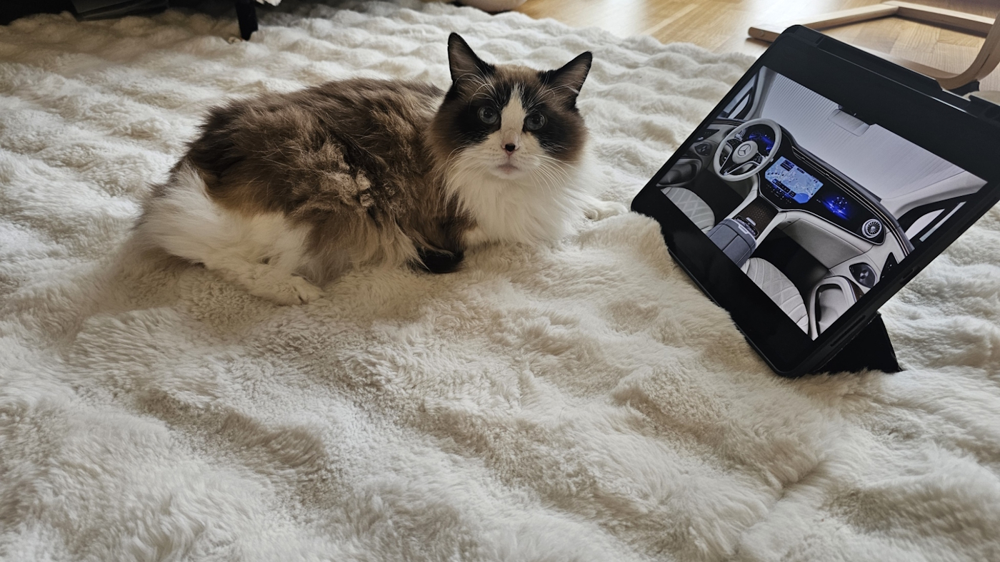

---
#Required fields
title: "HMI Bukan UI:Sudut pandang Engineer"
description: "Bedanya HMI dan UI"
pubDate: 2026-04-25
category: "HMI"
cover: "../../assets/blog/my-first-post/1_moko-EQS.jpg"
coverAlt: "Trend yang pergi terlalu jauh, pillar-to-pillar display"

#Core Fields
tags: ["HMI", "UI", "display"]
author: "Thomas Agung Nugraha"
lang: "id-ID"
draft: false

#recommended
slug: "blog_01_my-first-post"
excerpt: "Banyak orang mengira UI itu sama dengan HMI. Sebagai engineer, saya gemas karena HMI mencakup seluruh interaksi fisik dan sistem, bukan sekadar visual."
updatedDate: 2026-07-04

#Optional-series support
#series: ""
#seriesOrder:

#Optional:SEO & Indexing
canonicalURL: "https://t-agung.id/blog/blog_01_my-first-post"
keywords:
  - HMI
  - UI
  - display
noindex: false

#Optional-table-of-content
showToc: true

#optional-internal linking
relatedPosts:
  - blog_03_lcd_oled_microled_hmi
---

"Menurut Moko, HMI itu bukan UI, dan dia selalu benar"

## HMI Itu Bukan UI

Setiap kali saya bilang "saya kerja di bidang HMI" reaksi orang itu kayak kamu bilang kamu kerja di blockchain, mata berkaca-kaca, ngangguk-ngangguk dan terus bilang "oh gitu ya." seakan seperti saya ngomong tentang hal yang jauh dari kehidupan sehari-hari.

Padahal HMI (Human-Machine Interface) itu selalu di depan muka kita. Kamu naik mobil, sentuh layar AC, pencet tombol cruise control, itu HMI. Cuma kita nggak pernah mikir kenapa tombolnya di situ, kenapa warnanya begitu, atau kenapa latencynya harus di bawah 80 milidetik kalau nggak mau kamu crash.

Jadi begini ceritanya. HMI bukan UI. Bedanya jauh. Dan saya bakal jelasin dari sisi engineer, kenapa HMI itu jauh lebih ribet dari yang kamu kira.

---

### UI vs HMI : Apa Bedanya?

Bayangin kamu makan nasi goreng.

UI itu kayak **cara penyajiannya**. Piringnya bagus, telurnya bulet dan ditaruh rapih, daun jeruknya (kalau ada) ditaruh cantik, fotonya instagramable. Nah, UI itu soal tampilan.

HMI itu soal **seluruh pengalaman makan**. Sendoknya enak nggak dipegang? Piringnya nggak panas kalau disentuh? Gelas untuk minumnya gampang ngga diambil ?

HMI ngerjain semua itu.

Kalau UI cuma "bagaimana tombolnya terlihat," HMI ngerjain:

- **Latency** : kamu pencet, berapa milidetik sampai respons keluar
- **Lingkungan** : layarnya dipakai di bawah matahari terik, dalam mobil yang getar-getar, dengan tangan basah atau pakai sarung tangan
- **Haptic atau audible response** : sistemnya ngeresponse bahwa dia tau apa yang kamu mau lakukan
- **Keselamatan** : tombol emergency stop-nya warna gelap dan kecil? Orang nggak bakal nemuin pas lagi panik

---

### Latency di HMI Itu Soal Nyawa

Pas saya masih di Sony di Jepang, kerja sama tim Display/Touch dan sensory devices, kita pernah nyangkut di masalah yang kelihatannya kecil tapi bikin stress — latency 120ms di salah satu aplikasi di tablet.

Waktu itu, pengaruhnya kurang besar dengan *responsive* UI, tapi hal ini akan beda kalau HMI itu berkaitan dengan HMI di mobil.

120 milidetik di mobil itu artinya apa ?

Kalau kamu nyetir 120 km/jam dan nge-rem, 120ms itu jarak 4 meter. Ya ampun.

Di consumer electronics, 120ms itu "boleh-boleh aja." Di automotive HMI, itu beda antara "oh tombolnya responsif" dan "lah, kok nggak langsung nge-respon?"  dan pas lagi nyetir, "lah, kok ?" itu berbahaya.

Latency itu kayak lagi chat sama pacar baru. Dia jawab di 2 detik, kamu mikir "wajar." Dia balas 2 menit, kamu mulai curiga "dia marah ya? ada apa?"

Di HMI, kalau latencynya diatas 200 ms, usernya mikir "sistemnya ngga respon nih, harus dipencet lagi." Terus dia pencet lagi. Sistemnya double-command. Di mobil, double-command bisa berarti AC nyala-mati terus atau navigasi yang berubah arah tanpa kamu mau.

---

### HMI Harus Bertahan di Dunia Nyata

Ini yang sering dilupain orang yang cuma mikir "UI yang cantik."

Desain HMI, apalagi untuk otomotif kayak bikin baju yang harus dipakai di 3 kondisi: di AC kantor yang dingin banget, di bawah terik matahari Blok-M, dan di tengah hujan Bogor. Kayaknya sama-sama "baju," tapi materialnya, jahitannya, cara pakainya... beda total.

Contoh konkret yang pernah saya ngadepin:

**Suhu ekstrem.** Di Motherson, kita kerja sama project display untuk kendaraan yang harus jalan dari minus 40 derajat Celsius (Finlandia) sampai 85 derajat (gudang mobil di Australi). Di minus 40, LCD-nya jadi super lambat, bisa-bisa kelihatan seperti berbayang. Di 85 derajat, backlight-nya bisa kepanasan. Kita harus pilih material dan desain yang survive di kedua kondisi — dan ini bukan cuma soal "ganti LCD yang lebih mahal," tapi engineering level sistem. Memikirkan heat dissipation, mencari LCD material yang pas, dan setiap formula itu selalu ada pros-and-cons nya.

**Getaran.** Mobil itu getar. Banyak. HMI harus tetap bisa dibaca dan disentuh akurat meskipun lewat jalan rusak atau ngebut di tol. 

**Tangan yang nggak ideal.** User nggak selalu pakai jari yang bersih dan kering. Tangan bisa basah, pakai sarung tangan musim dingin, atau bahkan sarung tangan kerja. Di otomotif, kita harus test HMI dengan semua kondisi itu, sarung tangan kulit, lateks, jari basah. Level detail kayak gini nggak ada di web design.

---

### "Human" di Human-Machine Interface

HMI harus paham psikologi manusia, bukan cuma teknologi.

HMI kayak masak di dapur. Kamu bisa punya wajan anti-stick paling mahal dan kompor induksi paling canggih. Tapi kalau kamu nggak paham gimana rasa manusia bekerja — pedas, manis, asin, gurih — makanannya tetap nggak enak.

Sama juga di HMI. Kamu bisa punya layar OLED yang paling modern, tapi kalau nggak paham gimana otak manusia memproses informasi di bawah tekanan, desainmu tetap gagal.

Beberapa contoh:

**Kognitif load.** Berapa banyak informasi yang bisa diproses user dalam 1 detik saat lagi nyetir? Sedikit banget. Makanya HUD (Head-Up Display) itu penting — informasi ditampilkan di depan mata, nggak perlu bolak-balik pusingin pandangan. Juga informasi yang ditampilkan ngga terlalu banyak, supaya usernya ngga bingung.

**Warna dan konteks.** Tombol merah itu bahaya. Tapi di beberapa budaya, merah itu keberuntungan. HMI internasional harus pilih warna yang universal dipahami.

**Ukuran target.** Jari manusia di layar 10 inci butuh tombol minimal 7mm buat tap yang akurat. Nggak bisa cuma "kecil-kecil biar aesthetic."

Untuk *konsumen elektronik*, peran psikologi manusia akan lebih berpengaruh. Waktu saya harus kerjasama dengan Image Quality team di Sony untuk tabletnya, kita harus memikirkan juga yang namanya "memory color" dimana warna-warna yang kita ingat kadang lebih kuat (saturated) dibanding warna sebenarnya, tapi memory ini beda dengan ingatan warna kulit, dimana kita akan lebih sering mengigat warna kulit sebenarnya.

---

### Kenapa Ini Penting Sekarang?

Sekarang semua mobil punya layar. Bukan cuma AC, tapi navigasi, infotainment, ADAS, bahkan kontrol kemudi. Semua butuh HMI yang dirancang benar, bukan cuma UI yang cantik.

Di Motherson, kita kerja sama project "smart cockpit" di mana seluruh interior mobil jadi HMI, dashboard, pintu, steering wheel, semuanya bisa interaksi. Di level ini, desain HMI udah bukan soal tampilan. Ini safety-critical engineering.

Di Eropa dan beberapa tempat di Amerika, truk besar sudah mulai memakai "*digital mirror*," menggantikan spion konvensional dengan kamera dan layar di dalam kokpit. Layar yang dipakai untuk layar yang dekat dengan pengemudi biasanya lebih kecil daripada layar yang ditempatkan jauh dari pengemudi (di daerah co-driver), ini karena kita harus mempertimbangkan seberapa besar objek yang harus ditampilkan di layar tersebut dan ini terkadang tidak didefinisikan dengan ukuran sentimeter, tapi dengan *angular degree*.

---

### Intinya

HMI itu UI, cuma ditambah latency, lingkungan fisik, psikologi manusia, dan safety.

Kalau kamu kerja di UI design, respect. Tapi kalau kamu mikir HMI itu sama kayak UI, coba pikirin lagi, karena di dunia nyata, perbedaan antara tombol yang cantik dan tombol yang bisa diandalkan di tengah badai bisa berarti keselamatan nyawa.
