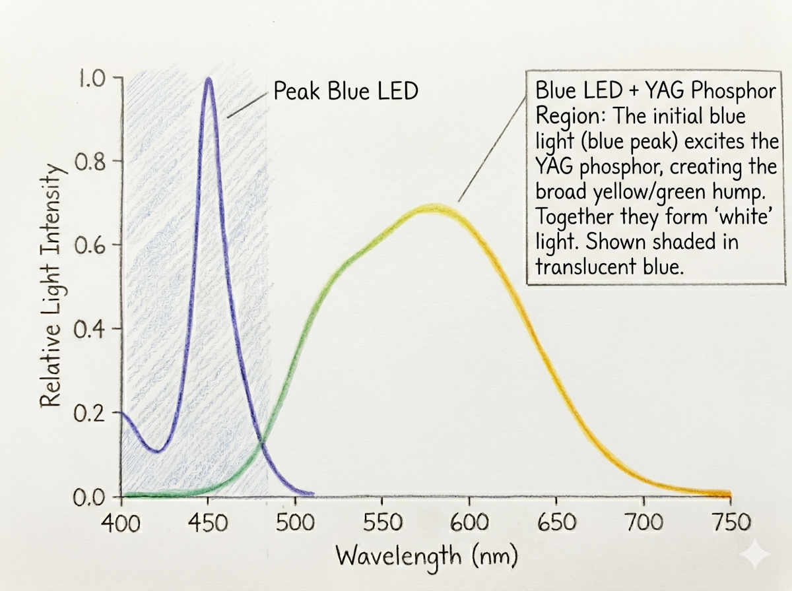
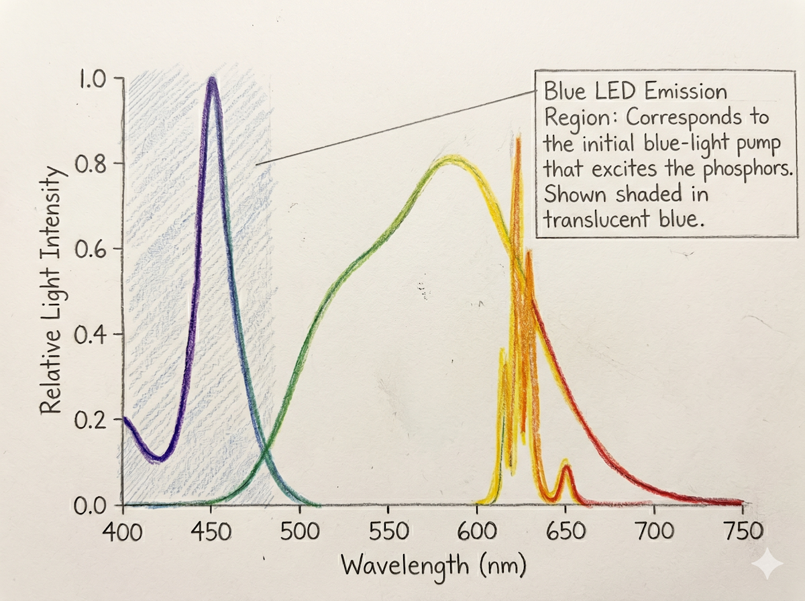

---
#Required fields
title: "LCD Display Stack-Up Part 1 : LED, Reflector, LGP, Diffuser"
description: "Membedah LCD secara detail"
pubDate: 2026-05-03
category: "deepdive"
cover: "../../assets/blog/4/4.Moko_LCDStackup.jpg"
coverAlt: "Visual representation of LCD Display Stack-Up Part 1 : LED, Reflector, LGP, Diffuser"

#Core Fields
tags: ["HMI", "display", "LCD Components"]
author: "Thomas Agung Nugraha"
lang: "id-ID"
draft: false

#recommended
slug: "blog_04_LCD_stackup_part1_light_source"
excerpt: "Banyak yang mengira LCD itu sederhana. Di sini saya akan membedah rumitnya backlight unit sebagai pondasi awal pencahayaan layar."
updatedDate: 2026-07-04

#Optional-series support
series: "LCD Display Stack-Up"
seriesOrder: 1

#Optional:SEO & Indexing
canonicalURL: "https://t-agung.id/blog/blog_04_LCD_stackup_part1_light_source"
keywords:
  - HMI
  - display
  - LCD Components
noindex: false

#Optional-table-of-content
showToc: true

#optional-internal linking
relatedPosts:
  - blog_05_display_stackup_part2_focus_polarizer
  - blog_06_display_stackup_part3_lc_touch_oled
---

"Moko : Pusiing, nggak mau belajar kayak ginian ah..."

## Intro: Stack-Up Itu Bukan Sekadar "Lapisan"

Setiap kali saya bilang ke orang bahwa display LCD itu terdiri lebih dari 10 lapisan material yang masing-masing punya fungsi presisi, reaksi mereka kayak saya ngomong bahasa alien.

"Lah, bukannya cuma glass ama liquid crystal ya?"

Nggak. Itu cuma satu bagian dari banyak. Dan justru bagian yang bikin layar itu jadi *terang* keliatan... backlight unit : itu nggak kalah kompleks dari LC (Liquid Crystall) cell-nya sendiri.

Artikel ini saya bagi tiga bagian. Part 1: kita bahas **bagian cahaya** : dari LED sampai diffuser. Part 2: kita bahas **bagian recycling light-nya** : BEF, DBEF, dan polarizer. Part 3: kita bahas **bagian otak** : LC cell, top polarizer, dan untuk yg ada touchnya; touch layer, optical bonding, dan kenapa semua ini bikin OLED mulai ngambil alih display, ngga cuma di Hape, tapi juga tablet dan laptop.

Ini saya tulis buat engineer muda yang mau paham *mengapa* display behave begini, bukan cuma *apa* yang terjadi.

Kita jadi agak scientific ya.... ambil kopi ama cemilan biar ngga ngantuk !

"Contoh high-end display stackup, beberapa lapisan bisa berbeda tergantung displaynya"

---

## 1. LED: Bukan Sekadar "Cahaya Putih"

### White LED Itu Tipuan mata : Tapi Bukan Cuma Satu Cara buat nipu.

LED putih sebenernya ada **dua pendekatan utama**, dan keduanya punya karakter spektrum yang beda:

**1. Blue LED + YAG Phosphor (Single Phosphor)**

Yang paling umum. Blue LED (450-460nm) + phosphor YAG (Yttrium Aluminum Garnet:Ce³⁺) yang nberubah blue → yellow (~550-570nm). Mix dari blue + yellow = mata manusia baca sebagai "white".

Tapi spektrum yang dihasilkan **bukan spektrum penuh**. Ada "blue spike" yang tinggi dan "red valley" yang dalam. Ini yang bikin white LED native cuma bisa cover **NTSC ~72%** color gamut.

"Spektrum dari BlueLED + YAG Phosphor"

**2. Blue LED + YAG + KSF Phosphor (Dual Phosphor)**

KSF itu **K₂SiF₆:Mn⁴⁺** (Potassium Silicate Fluoride dengan Manganese activator). Dia emits **narrow red peak** di ~660nm : jauh lebih narrow dari YAG.

Jadi kalau kamu combine: blue LED + YAG (yellow) + KSF (narrow red) → spektrum yang jauh lebih "lengkap". Red valley-nya terisi → **color gamut bisa naik ke NTSC 90-95%** tanpa perlu Quantum Dot.

"Spektrum dari BlueLED + YAG + KSF Phosphor, lihat spectrum purity nya di red region"

### Spektrum LED = Gamut & Color Accuracy

Gamut itu sebenernya **area di chromaticity diagram** yang bisa di-reach oleh tiga primary color (R, G, B) dari LED. Kalau spektrum LED-nya narrow (peak tajam), primary color-nya lebih "pure" → gamut lebih luas. Kalau spektrum-nya broad (peak lebar), primary color-nya "mencampur" → gamut lebih sempit.

Ini yang bikin **Quantum Dot (QD)** game-changer. QD itu nanopartikel semiconductor (CdSe atau InP) yang kalau disinari blue light, emits light di wavelength spesifik yang sangat narrow. Red QD dan Green QD → peak spektrum super tajam → **NTSC 100%+ / DCI-P3 95%+**.

**Analogi:** Spektrum LED itu kayak **radio**. Kalau spektrumnya narrow, kayak radio yang cuma dapet satu stasiun yang jernih. Kalau broad, kayak radio yang dapet banyak stasiun sekaligus : suaranya "kecampur" dan gak jernih lagi.

**Insight dari kerja di Intel (2013):** Pas kami test panel consumer dengan YAG white LED vs QD-enhanced, Delta E color accuracy dari 2.5 turun ke 1.2. Dan cost-nya naik sekitar 30% per unit. Trade-off yang harus dihitung.

### KSF+YAG vs Quantum Dot : Mana yang Menang?

KSF dan QD itu sebenernya **kompetitor** di ruang yang sama : keduanya berusaha improve color gamut white LED.

| Parameter             | KSF Phosphor                   | Quantum Dot                   |
| --------------------- | ------------------------------ | ----------------------------- |
| **Emission peak**     | Narrow red (~660nm)            | Narrow red + green            |
| **Gamut**             | NTSC 85-95%                    | NTSC 100%+                    |
| **Cost**              | ~20% lebih mahal dari YAG only | ~30-40% lebih mahal dari YAG  |
| **Thermal stability** | Better (inorganic crystal)     | Worse (organic semiconductor) |
| **Yield**             | High (mature process)          | Medium (still improving)      |
| **Application**       | Mid-high end consumer          | Premium consumer, automotive  |

**Analogi:** KSF+YAG itu kayak **nasi goreng yang dikasih telur**. Udah lebih enak dari nasi goreng biasa. QD itu kayak **nasi goreng yang dikasih telur + udang + ayam**. Lebih mantaaab, tapi harganya naik.

Di lain waktu nanti kita diskusikan lagi tentang sejarahnya aplikasi Quantum Dot di display ya.

### LED Binning dan Thermal Roll-Off

Nah, kita udah ngomong panjang lebar tentang wide spectrum LED.... nah, tapi, biarpun sama-sama 1 rumpun dan golongan, nggak semua LED sama semua. Pabrik nge-sort LED berdasarkan:

- **Color bin** (CCT: 6500K vs 10000K : mempengaruhi white point)
- **Intensity bin** (lm per mA : mempengaruhi brightness uniformity)
- **Wavelength bin** (peak nm : mempengaruhi color point)

Kalau kamu campur LED dari bin berbeda di satu backlight panel, hasilnya = **color shift** dari kiri ke kanan. Dan **thermal roll-off**: LED yang panas, intensitasnya turun dan wavelength-nya shift. Makin panas → makin kuning. Di automotive HMI (-40°C sampai +85°C), ini critical issue.

---

## 2. Reflector: Putih atau Perak, Bukan Sama

### White Reflector (TiO₂-based)

Material: white plastic dengan Titanium Dioxide (TiO₂) scattering particles. Cara kerja: **diffuse reflection** : cahaya masuk, tersebar ke banyak arah. Efisiensi: **~85-90% reflection**. Murah. Tapi diffuse reflection = sebagian cahaya "nyasar" ke samping, nggak ke depan.

### Silver Reflector (Metallized)

Material: metal coating (aluminum atau silver plating) di atas substrate plastic. Cara kerja: **specular reflection** : cahaya pantul dengan sudut yang terkontrol, kayak cermin. Efisiensi: **~95-98% reflection**. Mahal, tapi lebih banyak cahaya sampai ke depan.

### Kenapa Ini Penting?

Di edge-lit backlight (yang pakai LED di pinggir), reflector di bawah light guide plate peranannya besar. Cahaya dari LED yang nggak langsung masuk ke light guide → harus dipantulkan reflector ke depan. Kalau reflector cuma 85% efficient, 15% cahaya hilang = lebih banyak LED yang dibutuhkan = biaya naik + panas naik.

---

## 3. Backlight Unit: Edge-Lit vs Direct-Lit

### Edge-Lit

LED di pinggir (satu atau dua sisi). Cahaya masuk ke **Light Guide Plate (LGP)** : biasanya acrylic injection molded dengan dot pattern di belakangnya. Dot pattern itu sebenernya micro-texture yang scatter cahaya keluar dari LGP secara uniform.

Kelebihan: **tipis** (1-3mm), murah.
Kekurangan: **uniformity** di corner suka lebih redup. Kalau ada LED mati satu, "shadow"-nya keliatan.

### Direct-Lit (kadang dibilang LED array)

LED di belakang panel, langsung facing forward. LGP-nya lebih sederhana (atau nggak ada). Bisa **local dimming** : part tertentu lebih gelap, part lain terang. Kontras lebih tinggi.

Kelebihan: **uniformity bagus**, kontras tinggi.
Kekurangan: **tebal** (10-15mm), mahal, lebih banyak LED.

**Untuk consumer high-end display:** edge-lit collimated LGP = standar karena tipis dan uniformity bisa dijaga. Direct-lit = untuk TV besar atau display yang butuh local dimming.

### Collimated Light Guide: Kenapa Ini Special?

Collimated LGP itu nggak diffuse. Dia pakai micro-lens array di surface-nya buat redirect cahaya keluar secara parallel. Artinya: cahaya yang keluar dari LGP itu **sebagian besar dalam satu arah**.

Kenapa ini penting? Karena **DBEF (yang akan kita bahas di Part 2) butuh cahaya collimated buat kerja optimal**. Kalau cahaya yang masuk ke DBEF itu diffuse (semua arah), efisiensi polarization recycling-nya turun drastis.

Collimated LGP = cahaya keluar parallel = DBEF kerja optimal = **DBEF brightness gain 20-30% bisa tercapai penuh**. Tanpa collimated LGP, DBEF cuma dapet sebagian dari gain itu.

**Trade-off:** collimated LGP lebih mahal daripada diffuse LGP. Tapi kalau kamu pakai DBEF, investasinya balik.

---

## 4. Diffuser: Nggak Sekadar "Nyebar Cahaya"

### Dua Jenis Haze : Jangan Keliru

**Backlight Diffuser Haze** (layer di belakang polarizer):

- Fungsi: bikin backlight **uniform**
- **Nggak bikin gambar blur** : karena dia BEHIND image-forming elements
- Haze 70-85% = target optimal untuk consumer display
- **Trade-off utama: light loss.** Makin tinggi haze = makin uniform tapi makin banyak cahaya hilang (5-15% brightness turun)

**Front Cover Glass Haze (AG Coating)** (layer di permukaan depan):

- Fungsi: kurangi **ambient glare/reflection**
- **Bikin perceived sharpness turun** : karena scatter cahaya depan
- Trade-off: clarity vs reflection control

### Backlight Diffuser Layer Structure

Biasanya ada beberapa sub-layer:

- **Haze layer**: scattering particles (silica, acrylic) di dalam film. Haze value 50-90%
- **Prism layer** (kalau ada): micro-prism di surface buat redirect cahaya ke depan
- **Adhesive layer**: buat tempel ke layer lain

---

## 5. Cost Breakdown: Berapa Masing-Masing Layer?

| Layer                  | Estimasi Cost % (Consumer High-End) | Yield Impact                         |
| ---------------------- | ----------------------------------- | ------------------------------------ |
| LED + Phosphor/QD      | 15-20%                              | Medium (binning)                     |
| Reflector              | 5-8%                                | Low                                  |
| LGP (incl. collimated) | 10-15%                              | Medium (dot pattern precision)       |
| Diffuser sheets        | 5-10%                               | Low                                  |
| BEF                    | 15-25%                              | Medium (prismatic pattern precision) |
| DBEF                   | 20-30%                              | High (multilayer birefringent)       |
| Rear polarizer         | 10-15%                              | Medium (PVA quality)                 |

**Catatan:** Estimasi biaya berdasarkan pengalaman industri dan laporan publik : bukan data resmi dari supplier. Angka bisa bervariasi berdasarkan ukuran display, resolusi, volume produksi (👈 ini pengaruh banget), dan supplier.

---

## Kesimpulan Part 1

Backlight unit = mesin rumit. Dari LED spectrum sampai diffuser haze, setiap layer punya fungsi presisi dan trade-off yang harus dihitung.

Di Part 2: kita lanjut ke BEF, DBEF, dan polarizer : bagian yang bikin cahaya dari backlight sampai ke mata kita dengan efisiensi optimal.

---
