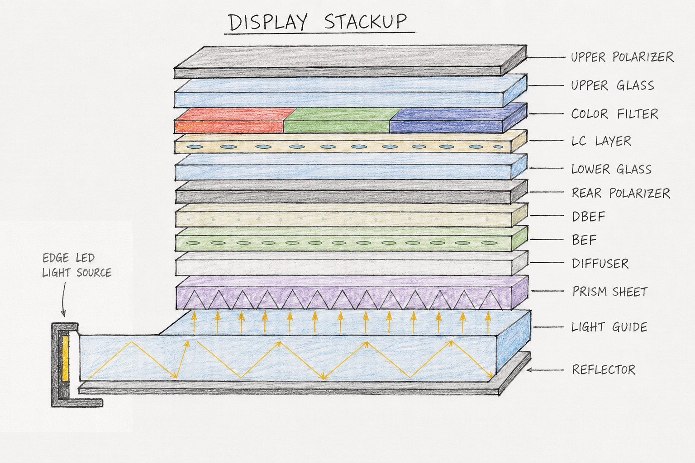

## Intro: Dari Part 1

Part 1 kita bahas backlight — dari LED, reflector, LGP, sampai diffuser. Sekarang cahaya sudah terang dan uniform. Tapi cahaya dari backlight itu **semua arah** dan **nggak terpolarisasi**. LC cell butuh cahaya yang **arahnya ke depan** dan **sudah terpolarisasi** biar bisa work.

Masuk peran: **BEF, DBEF, dan Rear Polarizer**. Ini bagian paling sering salah dipahami dan paling banyak bikin light loss kalau nggak di-design dengan benar.

"Bawaan dari LCD Stackup : Part 1 "

---

## 1. BEF (Brightness Enhancement Film): Prismatic Film yang Redirect Cahaya

BEF itu **dual-axis prismatic film**. Surface-nya punya micro-prism ridge pattern yang redirect cahaya yang datang dari sudut → ke depan.

### Cara Kerja

Cahaya dari diffuser itu keluar ke **banyak arah**. Sebagian besar sudah mengarah ke depan, tapi masih ada yang "kabur kesamping" — keluar di sudut 30-60° dari normal. BEF tangkap cahaya miring itu dan **dipantulin ke depan** menggunakan total internal reflection di micro-prism.

**Analogi:** BEF itu kayak **cermin di koridor sempit**. Kalau kamu berdiri di koridor dan lihat ke samping, kamu nggak liat ujung koridor. Tapi kalau ada cermin di samping, cahaya dari samping dipantulkan ke depan — dan kamu bisa lihat lebih jauh. BEF "mencerminkan" cahaya yang miring biar ke depan.

### Spesifikasi biasanya kayak gini : 

- **Material:** Polycarbonate (PC) atau PET dengan micro-prism ridge pattern
- **Prism pitch:** 0.2-0.3mm (ukurannya micro, nggak keliatan mata telanjang)
- **Efficiency:** redirect 30-40% cahaya yang "miring" ke depan
- **Angle sensitivity:** BEF kerja optimal di viewing angle ±60° dari normal
- **Cost:** lebih murah dari DBEF

### Kenapa "Dual-Axis"?

BEF yang biasa cuma punya ridge pattern di satu arah (single-axis). Dual-axis punya ridge pattern di dua arah (X dan Y), jadi bisa redirect cahaya dari **semua arah** ke depan. Efisiensi lebih tinggi.
kalau kamu ngeliat dari belakang BEF ini, bayangan dari image di depan BEF jadi agak aneh... coba liat deh kalau ada kesempatan ngebongkar Layar LCD.

---

## 2. DBEF (Dual Brightness Enhancement Film): Game Changer yang Sering Salah Dipahami

DBEF itu **bukan prismatic film**. Dia adalah **reflective polarizer** berbasis multilayer birefringent structure (biasanya cellulose acetate bilayer).

Ini beda fundamental dari BEF. BEF cuma redirect cahaya. DBEF redirect cahaya **dan** recycle polarized light.

### Fungsi Utama: Polarization Recycling — Ini Intinya

Cahaya dari LED itu **unpolarized** (50% P-polarized, 50% S-polarized). Rear polarizer cuma lewatkan 50% (P-polarized). Sisa 50% (S-polarized) → **absorbed oleh rear polarizer** = cahaya hilang.

Tanpa DBEF, 50% cahaya dari backlight langsung hilang di rear polarizer.

DBEF **nggak nyerep cahaya**. Dia **mantulin S-polarized light sambil muter polarization ~90°** → hasilnya **jadi P-polarized** → dan bisa lewat rear polarizer lagi → **second chance through LC cell**.

**Efeknya:** ~40% dari S-polarized light yang tadinya hilang, sekarang **recycled** dan dipakai. Ini = brightness naik signifikan tanpa tambah LED.

### Mekanisme Step-by-Step

1. Cahaya unpolarized dari backlight → 50% P-polarized, 50% S-polarized
2. Rear polarizer lewatkan 50% P-polarized, absorb 50% S-polarized
3. P-polarized → masuk LC cell → LC rotate polarization (sebagian berhasil, sebagian gagal)
4. Cahaya yang gagal → **mantul balik** dari DBEF
5. DBEF reflect + rotate polarization ~90° → jadi P-polarized lagi
6. P-polarized → lewat rear polarizer lagi → **second chance through LC cell**

**Analogi:** DBEF polarization recycling itu kayak **ujian ulang di sekolah**. Kamu ujian pertama (LC cell ronde 1), nilainya nggak cukup. Tapi DBEF bilang, "Gak apa-apa, coba lagi." Dia rotasi polarisasimu (ngajarin kamu), trus kamu ujian lagi (LC cell ronde 2) dan kali ini nilainya cukup. Tanpa DBEF, kamu langsung drop out setelah ujian pertama. Dengan DBEF, kamu dapet kesempatan kedua — dan lebih banyak cahaya yang lulus.

### Kenapa DBEF Butuh Collimated Light?

DBEF polarization rotation-nya **angle-sensitive**. Kalau cahaya datang dari banyak arah (diffuse), rotation-nya nggak konsisten → efficiency turun. Makanya collimated LGP + DBEF = kombinasi optimal.

**Trade-off:** collimated LGP lebih mahal daripada diffuse LGP. Tapi kalau kamu pakai DBEF, investasinya balik.

### DBEF vs BEF Comparison

| Parameter             | BEF                      | DBEF                                      |
| --------------------- | ------------------------ | ----------------------------------------- |
| **Fungsi utama**      | Redirect cahaya ke depan | Recycle polarized light + redirect        |
| **Brightness gain**   | 30-40%                   | 50-70%                                    |
| **Angle sensitivity** | Moderate                 | High (butuh collimated light)             |
| **Cost**              | Lower                    | Higher                                    |
| **Material**          | Prismatic polycarbonate  | Multilayer birefringent cellulose acetate |
| **Application**       | Budget-mid range         | High-end consumer, automotive             |

---

## 3. Rear Polarizer: Fungsi yang Sering Diabaikan

Rear polarizer itu **absorptive polarizer** (biasanya PVA film + iodine dye).... yesm iodine, yang ada di garem dikit untuk nyegah gondongan. 
Cara bikinnya itu, iodine di plastik transparan, ditarik di satu arah,dan jadilah dia polarizer (agak sedkit lebih rumit tapi proses sebenarnya)
Fungsi polarizer:

- **Polarize unpolarized light from backlight**: hanya lewatkan satu polarization axis (P-polarized)
- **Define initial polarization state** untuk LC cell

### Kenapa Ini Penting?

Liquid crystal **nggak bisa kerja yang benar tanpa polarized light**. LC cuma rotate polarization — dia nggak bisa create polarization. Jadi rear polarizer itu wajib.

### Material dan Tipe

- **Standard PVA polarizer:** murah, tapi absorb 50% cahaya + sensitive ke UV/heat
- **Wide-band polarizer:** lebih mahal, tapi work di wavelength range lebih luas (penting untuk QD displays)
- **Protective polarizer (dengan overcoat):** lebih tahan UV/heat, lebih mahal lagi

**Insight dari engineer: ** Upgrade display consumer dari standard PVA ke wide-band polarizer, cost naik 15% tapi color accuracy improve 20% di high-brightness mode.

### Light Loss di Rear Polarizer

Rear polarizer **meneruskan hanya 50% cahaya** — ini light loss terbesar di seluruh stack-up, makanya kita butuh BEF dan DBEF, supaya bisa recycle cahaya yang terbuang. Ini salah satu alasan kenapa OLED nggak butuh backlight — OLED emit light yang sudah terpolarisasi, jadi nggak ada loss 50% di polarizer.

Saya agak susah memahami dulu waktu nyoba memahami gimana polarized light ini bekerja, jadi kayaknya akan saya bahas lagi satu blog khusus tentang gimana Polarization ini bekerja di LCD.

---

## 4. LC Cell: Intro (Detail di Part 3)

Sebelum masuk detail LC cell di Part 3, kita perlu paham konteksnya di Part 2.

### Apa Itu LC Cell?

LC cell = **liquid crystal sandwiched antara dua glass substrate**. Glass di belakang ada TFT array (transistor). Glass di depan ada color filter. Liquid crystal di tengah, dikontrol oleh TFT.

Cara kerja:

1. TFT di belakang glass nyalakan/off-kan voltage di pixel
2. Voltage bikin liquid crystal rotate (atau nggak)
3. Liquid crystal yang rotate = rotate polarization cahaya
4. Polarization yang dirotate → bisa lewat front polarizer atau nggak
5. Yang lewat = pixel terang. Yang nggak lewat = pixel gelap

**Analogi:** LC cell itu kayak **tombol di pintu**. Rear polarizer = cahaya masuk ke pintu. LC cell = tombol yang bisa buka/tutup pintu. Front polarizer = pintu yang beneran buka/tutup.

### Kenapa LC Cell Butuh Polarized Light?

Karena LC cuma **rotate** polarization — dia nggak bisa **create** atau **absorb** light. Jadi rear polarizer (buat bikin cahaya terpolarisasi) dan front polarizer (buat filter hasil rotasi) itu wajib.

---

"Ini sunglass juga make polarizer, tapi beda ama yang di display kayaknya 🐈 "

## 5. Kesimpulan Part 2

Kita sudah bahas:

- **BEF:** redirect cahaya miring ke depan (prismatic film)
- **DBEF:** recycle polarized light (reflective polarizer) — game changer untuk brightness
- **Rear polarizer:** polarize backlight (absorptive polarizer) — light loss 50% terbesar di stack-up

Semua ini kerja bareng biar cahaya yang masuk ke LC cell itu terang, uniform, sudah terpolarisasi, dan fokus ke depan.

Part 3: kita bahas **bagian otak** — LC cell detail (TN, VA, IPS/FFS), front polarizer, touch layer, optical bonding, cover glass, dan kenapa semua ini bikin OLED mulai ngambil alih laptop.

---