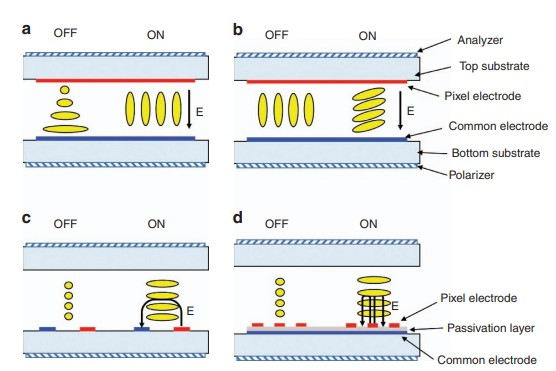

## Recap: Dari Part 1 dan Part 2

Part 1: kita bahas sumber cahaya : *[LED spectrum, reflector, light guide plate, diffuser.](/blog/blog_04_lcd_stackup_part1_light_source/)*

Part 2: kita bahas bagian fokus : *[BEF, DBEF, rear polarizer.](/blog/blog_05_display_stackup_part2_focus_polarizer/)*

Sekarang: **bagian otak** : LC cell, polarizer depan, touch layer, bonding, cover glass. Dan kenapa semua ini bikin OLED mulai ngambil alih display di consumer electronics, bukan hanya di *HaPe.*

---

## 1. Glass Substrate + TFT Array: Fondasi LC Cell

"Gelas jendela ama gelas di display sama ngga ya..."

### 6.2 Juta Transistor

Glass substrate yang kita bahas bukan kaca biasa. Ini **glass dengan thin-film transistor (TFT) array** yang dicetak di permukaannya. Untuk display FHD (1920x1080), ada **~6.2 juta transistors** : masing-masing control satu sub-pixel.

TFT array ini yang jadi "saklar" buat setiap pixel. Voltage yang beda-beda → liquid crystal rotate polarization beda-beda → brightness pixel beda-beda.

### Glass Thickness dan Yield

Glass substrate untuk display consumer biasanya **0.3-0.7mm** (belum termasuk cover glass). Makin tipis = makin ringan, tapi makin susah handlingnya saat manufacturing.

Yield bottleneck-nya ada di **TFT array fabrication**. Satu defect di satu transistor = satu pixel mati. Dan di display premium, 1 dead pixel = panel reject. (kita ada quality acceptance criteria yg tertulis berapa diterima dead-subpixel, dan biasanya 0 always on pixel) 

---

## 2. Liquid Crystal Types: TN, VA, IPS, FFS

"Minjem dari https://www.nature.com/articles/lsa2017168.pdf "

Liquid crystal = material yang bisa rotate polarization berdasarkan voltage. Tapi ada beberapa tipe, masing-masing punya trade-off.

### TN (Twisted Nematic)

**Cara kerja:** Liquid crystal molecules twisted 90° di antara dua polarizer. Tanpa voltage → cahaya lewat. Dengan voltage → molecules lurus → cahaya blocked.

- **Response time:** 1-5ms (paling cepat)
- **Viewing angle:** ±30° (terbatas)
- **Contrast:** 500:1 - 1000:1
- **Cost:** paling murah
- **Yield:** tinggi

**Analogi:** TN kayak **orang yang cepat jawab tapi sederhana**. Dia langsung respond, tapi nggak terlalu dalem.

### VA (Vertical Alignment)

**Cara kerja:** LC molecules berdiri tegak (vertical) tanpa voltage. Dengan voltage → molecules miring → cahaya lewat.

- **Response time:** 10-25ms
- **Viewing angle:** ±60° (baik, tapi nggak se-IPS)
- **Contrast:** 3000:1 - 5000:1 (paling tinggi : "black" yang beneran hitam)
- **Cost:** menengah
- **Yield:** menengah

**Analogi:** VA kayak **orang yang emosional**. Dia bisa kasih kontras yang tinggi (hitam yang beneran hitam), tapi viewing angle-nya nggak selebar IPS.

**Insight dari Sony VAIO (2008-2010):** Pas kami pakai VA panel buat satu VAIO Series, customer review banyak bilang "hitamnya VAIO Z emang beda, beneran hitam." Tapi ada professional yang complain kalau liat dari samping, warnanya agak berubah.

### IPS (In-Plane Switching)

**Cara kerja:** Electrode di sisi yang sama (horizontal). LC molecules bergerak horizontal, bukan vertical.

- **Response time:** 5-15ms
- **Viewing angle:** ±89° (paling luas)
- **Contrast:** 800:1 - 1500:1
- **Cost:** menengah-tinggi
- **Yield:** menengah-rendah

**Analogi:** IPS kayak **orang yang seimbang**. Viewing angle luas, color bagus, tapi nggak sekontras VA.
IPS ini jadi terkenal dari Apel, karena waktu dulu dia menjual IPS ini sebagai kelebihan dari layarnya, yang warnanya konsisten dari semua sudut pandang (sebenarnya ngga juga sih...)

### FFS (Fringe Field Switching) : Evolusi IPS dari Samsung

**Cara kerja:** Electrode interdigitated (saling berselang). Electric field "fringe" = lebih banyak LC molecules yang bergerak.

- **Response time:** 5-12ms
- **Viewing angle:** ±89° (seperti IPS)
- **Contrast:** 1000:1 - 2000:1 (lebih baik dari IPS)
- **Color gamut:** lebih luas dari IPS (karena lebih banyak LC bergerak)
- **Cost:** menengah-tinggi
- **Yield:** menengah-rendah

**Trade-off:** FFS lebih mahal dan yield-nya lebih rendah daripada IPS biasa. Tapi color gamut dan contrast-nya lebih baik.

### LC Comparison Table

| Tipe | Response | Viewing | Contrast | Gamut | Transmissivity | Cost | Yield | Aplikasi |
|---|---|---|---|---|---|---|---|---|
| TN | 1-5ms | ±30° | 500-1000:1 | Rendah | Tinggi | Murah | Tinggi | Budget, monitor gaming |
| VA | 10-25ms | ±60° | 3000-5000:1 | Menengah | Menengah | Menengah | Menengah | TV, monitor premium |
| IPS | 5-15ms | ±89° | 800-1500:1 | Tinggi | Menengah | Menengah-tinggi | Menengah-rendah | Profesional, laptop premium |
| FFS | 5-12ms | ±89° | 1000-2000:1 | Tinggi+ | Menengah | Menengah-tinggi | Menengah-rendah | High-end smartphone, tablet |

Kayaknya kita harus ngebahas satu blog sendiri masalah jenis LC ini deh, soalnya dengan milih satu teknologi, banyak juga kriteria lainnya yang berubah.

---
## 3. Upper Glass & Color Filter
Jadi, Liquid Crystal diatas itu diapit ama 2 gelas, bottom glass, yang diatasnya ada sirkuit untuk driving display, dan upper glass, 
yang ada color filter di setiap sub-pixelnya.
Color filter ini yang membuat kita bisa ngeliat Red, Green dan Blue. Juga material dari color filter ini yang menentukan berapa luas *color gamut* dari display tersebut (tentunya setelah spectrum matching dengan light source ya...)

## 4. Front Polarizer: Filter Terakhir

"Ngutip lagi dari LCD Stackup : Part 1 "

**[Image: Touch Panel Layer Structure]**

Setelah cahaya melewati LC cell (polarization sudah di-rotate) → harus melewati **front polarizer** buat jadi image.

### Linear vs Circular Polarizer

- **Linear polarizer**: standar, murah, tapi reflection lebih tinggi
- **Circular polarizer**: ada quarter-wave plate di atas linear polarizer. Reflection lebih rendah, lebih mahal.

### Wide-Band Polarizer untuk QD/OLED

Kalau display pakai Quantum Dot atau OLED, wide-band polarizer lebih dipilih karena spectrum-nya lebih luas.

**Insight dari pasar:** untuk upgrade display dari standard polarizer ke wide-band polarizer, color accuracy improve signifikan di high-brightness mode. Tapi biasanya cost bisa naik ~15%.

---

## 5. Touch Layer: In-Cell vs On-Cell vs External
Topik kebawah ini hanya sentuhan sedikit ajah ya... soalnya topiknya cukup dalem, dan akan dibahas dilain waktu.

### External Touch (Capacitive)

Touch sensor di atas display, terpisah. Cara kerja: **capacitive sensing** : jari kamu touch → electric field berubah → posisi touch terdeteksi.

Kelebihan: gampang repair, murah.
Kekurangan: tambah ketebalan, refleksi di antara touch dan display.

### On-Cell

Touch sensor di-**atas** LC cell, di dalam display module.

Kelebihan: lebih tipis dari external.
Kekurangan: masih ada refleksi antar-layer.

### In-Cell

Touch sensor di-**dalam** LC cell, di atas TFT array. ITO (Indium Tin Oxide) electrodes double-duty: control LC + detect touch.

Kelebihan: paling tipis, nggak ada refleksi tambahan.
Kekurangan: complex fabrication, yield lebih rendah.

---

## 6. Optical Bonding: Kenapa Ini Penting?

### Tanpa Bonding = Udara Di Antara Layer

Kalau display nggak di-bond, ada **udara** di antara cover glass dan display module. Udara punya refractive index 1.0, glass punya 1.5. Beda refractive index = **Fresnel reflection ~4% per interface**.

Artinya: tanpa bonding, **~8% cahaya** hilang di dua interface (cover glass → udara → display). Dan outdoor, refleksi dari lingkungan bikin kontras turun drastis.

### OCA vs LOCA

- **OCA (Optical Clear Adhesive)**: sheet-based, gampang apply, tapi ada bubble risk
- **LOCA (Liquid Optical Clear Adhesive)**: liquid-based, lebih uniform, lebih mahal

**Insight dari Motherson:** Di automotive HMI, bonding **mandatory**. Karena di suhu -40°C, udara di antara layer bisa condense dan bikin display "berkabut". Bonding ngilangin udara → ngilangin masalah.

---

## 7. Cover Glass / Cover Lens: Pelindung yang Harus Tahan Banting

Cover glass ini kita punya berbagai jenis material, dari *Soda Lime*, *Ion Exchanged chemically strengthened glass*, dan bahkan ada yang pakai *Sapphire Crystal* !

Diatas gelas ini kita biasanya tambah lagi satu lapisan kimia :

### AR Coating (Anti-Reflection)

Cover glass dengan AR coating: **reflection dari 4% turun ke <1%**. Makin jernih, makin sedikit pantulan dari lingkungan.

### Oleophobic Coating

Lapisan yang bikin **jarng gampang slide** dan **nggak gampang kotor** oleh sidik jari. Penting buat smartphone dan tablet.

Kesusahan tambahan lapisan kimia adalah.... dia akan "ngelupas" seiring waktu.
Pernah ngerasain kan kok HP baru fingerprint nggak berbekas, tapi pas udah 2 tahun, layarnya jadi berminyak banget ?
Itu salah satu tanda bahwa chemical layer nya udah mengelupas.

---

## 8. Full Stack-Up Summary

| No | Layer | Fungsi |
|---|---|---|
| 1 | LED + Phosphor/QD | Sumber cahaya |
| 2 | Reflector | Pantul cahaya ke depan |
| 3 | Light Guide Plate | Distribusi cahaya uniform |
| 4 | Diffuser | Bikin backlight uniform |
| 5 | BEF/DBEF | Fokus + recycle cahaya |
| 6 | Rear Polarizer | Polarize cahaya |
| 7 | Glass + TFT Array | Saklar pixel |
| 8 | Liquid Crystal | Rotate polarization |
| 9 | Front Polarizer | Filter terakhir |
| 10 | Touch Layer | Detect touch |
| 11 | Optical Bonding | Eliminasi refleksi |
| 12 | Cover Glass | Pelindung |

---

## 8. Kenapa OLED Mulai Ngambil Alih Laptop

### Cerita dari VAIO Z Series (2010)

Pas saya di Sony VAIO tahun 2010, kita bikin notebook premium ultra-tipis. Dan kita stuck di satu masalah: **backlight unit adalah musuh**.

Backlight = 70% BOM cost. Tebal 5-8mm. Kontras terbatas 1000:1. Viewing angle terbatas. Dan di outdoor, brightness-nya nggak cukup.

**Di meeting internal, saya bilang:** "Kita butuh display yang nggak butuh backlight."

Dan itu sebenernya **OLED**. OLED = setiap pixel emit cahaya sendiri. Nggak butuh backlight. Nggak butuh polarizer. Nggak butuh LC cell. Kontras infinite (karena pixel mati = beneran hitam). Viewing angle 180°. Response time 0.1ms.

### Tapi Kenapa LCD Masih Relevan?

- **Cost**: LCD masih lebih murah untuk ukuran besar
- **Outdoor brightness**: LCD bisa 1000+ nits, OLED masih terbatas
- **Burn-in**: LCD nggak ada masalah burn-in
- **Harsh environment**: LCD lebih tahan suhu ekstrem (automotive)

**Sumber:** Display Search (2025) : "OLED adoption in laptops grew 40% YoY in 2025, driven by thinner designs and superior contrast. However, LCD remains dominant in automotive and outdoor applications due to brightness and cost advantages."

---

## Kesimpulan Series

Display stack-up itu bukan sekadar "lapisan". Setiap layer punya fungsi presisi, trade-off cost-performance-yield, dan story tersendiri.

Dari LED spectrum sampai cover glass, dari backlight unit sampai LC cell : ini yang bikin display bisa menampilkan gambar yang kita lihat.

Dan OLED? Dia adalah evolusi logis dari semua keterbatasan LCD. Tapi LCD masih punya tempat di dunia ini.

---

## Coming Next: Color Gamut & Accuracy

Nah, kita baru aja bahas spektrum LED dan pengaruhnya ke color gamut. Tapi **color gamut** sebenernya topik yang bisa kita gali lebih dalam.

Di artikel berikutnya, kita bakal bahas:
- **NTSC, sRGB, DCI-P3, Rec.2020** : kenapa ada banyak standard gamut?
- **Delta E** : cara ukur color accuracy yang beneran ilmiah
- **Wide-Gamut Displays** : kenapa laptop gaming dan creative workstation butuh gamut luas?
- **OLED vs LCD Gamut** : kenapa OLED punya native gamut yang lebih luas?
- **Color Management** : kenapa display yang "bisa" tampilin warna luas, belum tentu akurat?

Nanti juga bakal ada **perumpamaan khas** dan **Moko yang mungkin bakal keliatan lagi**.

Stay tuned, dan jangan lupa comment di bawah kalau ada topik spesifik yang mau kamu bahas!

---

