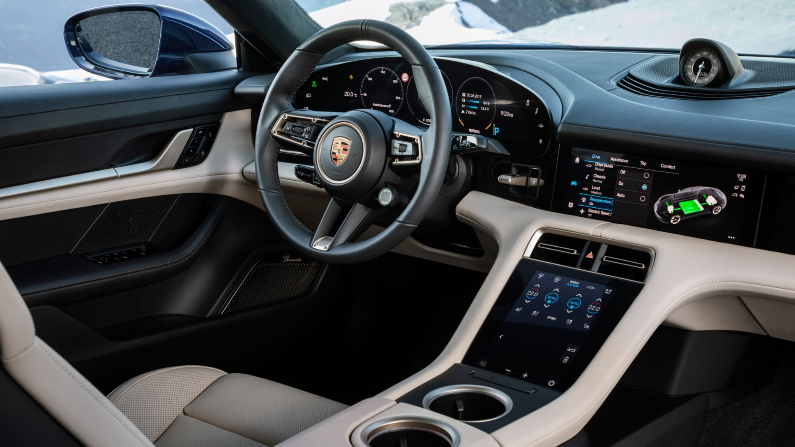
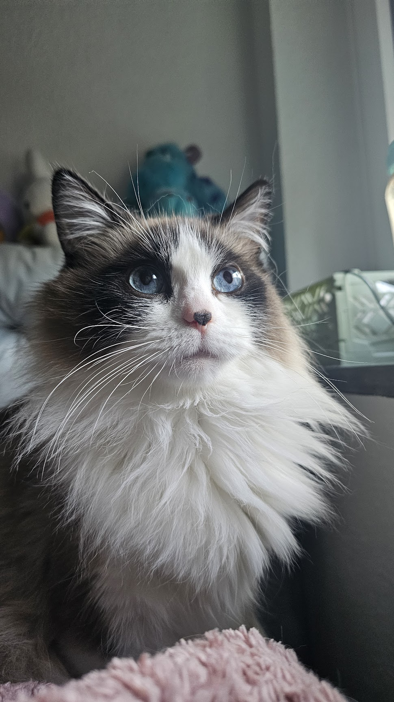

"Ada berapa ya total display di *Porsche Taycan* ini ?"

## Angka yang Bikin Senang, Pertanyaan yang Jarang Ditanyakan

April 2026. Penjualan kendaraan di Indonesia naik 55 persen, total 80.776 unit (data Gaikindo). BYD tumbuh 85,6 persen dengan pangsa pasar EV 48,2 persen (Focus2move). Wuling Cloud EV hadir dengan display 15,6 inci sebagai selling point utama. Semua media heboh.

Tapi ada satu hal yang jarang dibahas: supply chain display untuk mobil listrik di Indonesia masih diimpor hampir 100 persen.

Bolt.Earth menulis: "Given the insufficient supply of domestic components, Indonesia imports most components that go into EV production."

Ini bukan kritik. Ini fakta. Dan sebagai display engineer yang 15 tahun kerja di industri, saya ingin bahas kenapa grade display itu penting, terutama untuk iklim tropis Indonesia.

## Component Grade Bukan Soal Harga, Soal Lingkungan Kerja

Biar fungsinya sama-sama nampilin gambar, display itu punya empat grade yang umum di industri:

**Consumer grade** -- untuk TV, laptop, HP. Lingkungan terkontrol. Suhu 24 derajat C (ada AC). Utamanya dipakai untuk sehari-hari, di pribadi atau keluarga.

**Industrial grade** -- untuk pabrik atau kadang outdoor. IP65/IP67, biasanya tahan debu dan air, operasional 24 jam 7 hari. Fokusnya ketahanan fisik dan uptime.

**Medical grade** -- untuk rumah sakit. Tidak butuh tahan suhu ekstrem (rumah sakit ber-AC), tapi butuh akurasi warna dan color & luminance uniformity yang sangat tinggi. Delta E kurang dari 2, luminance uniformity di atas 80 persen.

**Automotive grade** -- untuk kendaraan. Ini yang paling menantang untuk tahan suhu lingkungan. Suhu -40°C sampai 85°C (Grade 2 AEC-Q100). Getaran 10-150 Hz selama 10 tahun. Humidity 95 persen RH. Thermal cycling 1.000 kali antara -40°C dan 105°C. Plus safety standard ISO 26262 untuk komponen yang berkaitan dengan keselamatan.

**Display grade** ini kayak bedain sepatu. Consumer grade = sepatu treadmill, nyaman tapi cuma buat dalam ruangan. Industrial grade = sepatu safety, tebal dan berat. Medical grade = sepatu operasi, presisi tinggi tapi cuma buat lingkungan steril. Automotive grade = sepatu hiking di gunung, harus survive segala kondisi.

"Waduh.. nggak mudeng nih...ada display grade mainan ngga ?"

## Kenapa sih Automotive Grade Paling Gokil?

Mobil adalah salah satu lingkungan paling ekstrem untuk elektronik. Parkir di bawah matahari Jakarta, suhu kabin bisa 70°C. Bawa ke Bogor saat hujan deras, kelembaban 95%. Bawa ke pegunungan, suhu minus. Plus getaran terus-menerus selama 10 tahun.

Standar AEC-Q100 yang dipakai untuk semikonduktor otomotif punya 4 grade:

| Grade       | Suhu                  | Lokasi                               |
| ----------- | --------------------- | ------------------------------------ |
| Grade 0     | -40 sampai 150° C     | Engine compartment                   |
| Grade 1     | -40 sampai 125° C     | Under dashboard                      |
| **Grade 2** | **-40 sampai 105° C** | **In-cabin (infotainment, display)** |
| Grade 3     | -40 sampai 85° C      | Jarang dipakai oleh produsen mobil   |

Sebagian besar display dashboard ada di Grade 2. Artinya komponen harus survive dari -40° C sampai 105° C tanpa gagal.

Bukan cuma suhu. Ada thermal cycling -- komponen dipanaskan dan didinginkan 1.000 kali. Setiap siklus, material ekspansi lalu kontraksi. Kalau materialnya tidak tepat, solder crack, connector lepas, panel muncul artifact.

## Realita Supply Chain Indonesia

Indonesia sedang membangun ekosistem EV dengan cepat. Wuling, BYD, Great Wall, MG, semuanya masuk pasar. Pabrik baterai Wuling-LG Energy Solution di Karawang sudah beroperasi. CATL dan Huayou juga bangun fasilitas baru.

Tapi supply chain komponen display masih belum matang. IBC Bulletin menulis: "Indonesia lacks a robust base of local component suppliers for EV parts and needs a trained workforce skilled in battery technology, power electronics, and software."

Ini berarti hampir semua komponen elektronik, termasuk display, diimpor dari China atau Korea. Tidak ada yang salah dengan impor, tapi ada beberapa hal yang perlu dipahami:

**1. Grade display tidak selalu transparan untuk konsumen**

Kalau kamu beli satu mobil EV yang harganya ekonomi banget, tapi datang dengan display 15,6 inci, spec sheet akan bilang resolusi, brightness, dan fitur. Tapi jarang yang bilang "AEC-Q100 Grade 2 qualified."

Ini berbeda dari pasar Eropa yang punya regulasi UN ECE R10 (EMC) dan R100 (ADAS). Di Indonesia, belum ada regulasi yang mewajibkan pabrikan menyatakan grade komponen display.

Ini seperti beli obat di pasar tanpa label expiry date. Kelihatan sama, tapi siapa tahu, sudah lewat masa optimalnya.

**2. Iklim Indonesia butuh grade yang tepat**

Indonesia bukan negara empat musim. Iklim tropis kita punya tantangan unik: suhu tinggi, kelembaban tinggi, dan kadang variasi suhu yang signifikan antara siang dan malam. Display yang cuma survive sampai 50° C (consumer grade) akan bermasalah di dalam mobil yang terparkir di bawah matahari.

LCD akan slow response di waktu dingin, dan kontras akan jelek saat kepanasan. OLED bisa burn-in lebih cepat. Connector mulai korosi karena kelembaban. Bukan mati total, tapi flicker, artifact, color shift; hal-hal yang bikin kamu kesal tiap kali nyalain infotainment.

**3. Regulasi lokal content 40 persen (2026)**

Pemerintah Indonesia punya target 40 persen local content untuk EV pada 2026. Saat ini fokusnya di baterai, motor, dan electronic control. Tapi display belum masuk dalam kategori prioritas.

WIPC menulis: "Strategi 1: Anchor Localization, Build an Industrial Chain Ecosystem. Treat Indonesia as a strategic hub for long-term development, not just a sales market. Actively leverage abundant local nickel resources to prioritize the local production of core components like batteries, motors, and electronic controls."

Display belum disebut. Ini peluang dan tantangan sekaligus.

## Apa yang Bisa Dilakukan?

Sebagai industry insider, saran saya:

**Untuk OEM**: Transparansi grade komponen di spec sheet. Bukan cuma ukuran dan resolusi. Konsumen berhak tahu apa yang mereka beli.

**Untuk regulator**: Pertimbangkan standardisasi minimum untuk display kendaraan listrik di Indonesia. Tidak harus sekeras Eropa, tapi setidaknya ada baseline.

**Untuk supply chain lokal**: Mulai bangun capability AEC-Q100 testing. Indonesia butuh ekosistem komponen otomotif yang mandiri, termasuk display.

**Untuk konsumen**: Tanya dealer soal standar komponen. Kalau tidak bisa jawab, itu red flag. Bukan berarti produk buruk, tapi berarti transparansi belum jadi prioritas.

## Kesimpulan

Grade bukan soal harga. Grade soal seberapa tangguh sebuah komponen bisa bekerja tanpa gagal.

Consumer grade = rumah dengan AC.
Industrial grade = pabrik 24 jam nonstop.
Medical grade = ruang ICU, presisi mutlak.
Automotive grade = jalan tol dari Jakarta ke Surabaya, survive segala cuaca.

Semua punya tempatnya sendiri. Untuk mobil yang kamu pakai setiap hari di iklim tropis Indonesia, kamu butuh komponen yang dirancang untuk itu.

Kamu nggak bisa ngebandingin Indomie dan steak wagyu terus bilang "kan sama-sama makanan."

---

## Referensi

1. [Wikipedia: Automotive Electronics Council](https://en.wikipedia.org/wiki/Automotive_Electronics_Council)
2. [RS-online: Consumer vs Industrial vs Automotive](https://www.rs-online.com/designspark/consumer-vs-industrial-vs-automotive-electronics)
3. [VCG: Temperature and Reliability](https://www.vcg-ic.com/consumer-vs-industrial-electronics/)
4. [RS-online: Medical Device Standards](https://www.rs-online.com/designspark/electronics-in-medical-devices-standards-requirements)
5. [Wuling Cloud EV Official](https://wuling.id/id/cloud-ev)
6. [Indonesian Vehicle Sales April 2026 +55%](https://www.just-auto.com/news/indonesian-vehicle-sales-surge-55-in-april/), Gaikindo data
7. [BYD Indonesia +85.6%](https://www.focus2move.com/indonesian-vehicles-sales/), Focus2move data
8. [Indonesia EV Landscape - Bolt.Earth](https://bolt.earth/blog/ev-landscape-in-indonesia)
9. [IBC Bulletin: Indonesia EV Ecosystem 2025](https://ibc-bulletin-vol4.vercel.app/)
10. [WIPC: Indonesia 2026 EV Policy 40% Local Content](https://wipc.com/uncategorized/decoding-indonesias-2026-ev-policy-the-40-local-content-mandate-arrives-how-can-chinese-enterprises-seize-post-subsidy-opportunities/4407/)

---