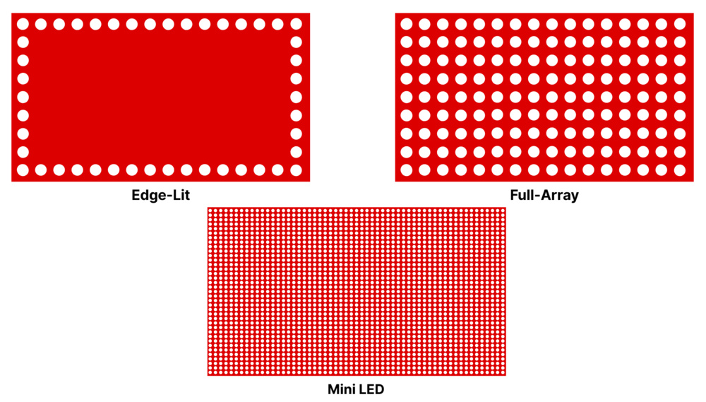
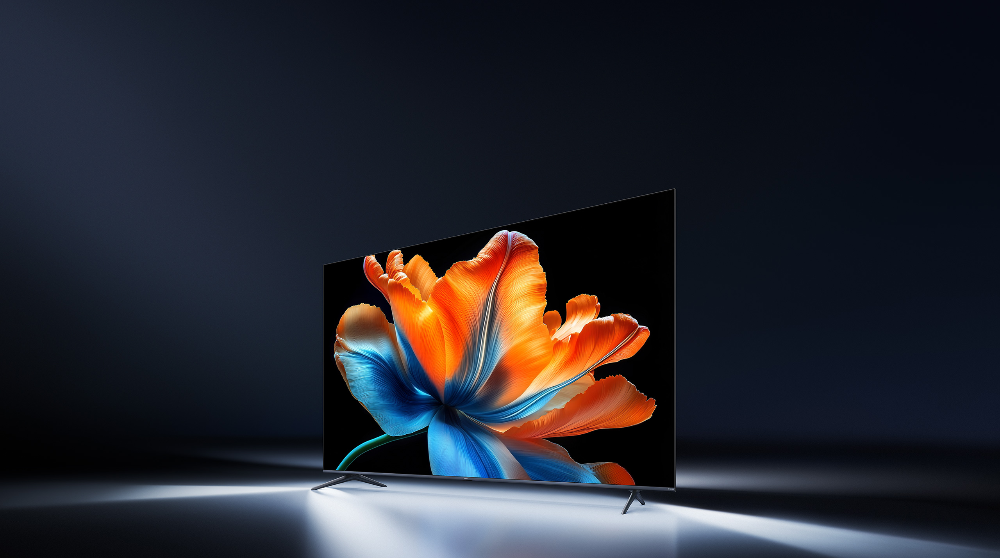
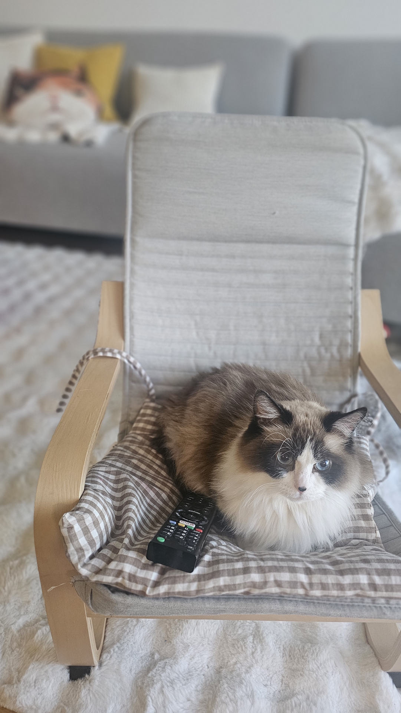
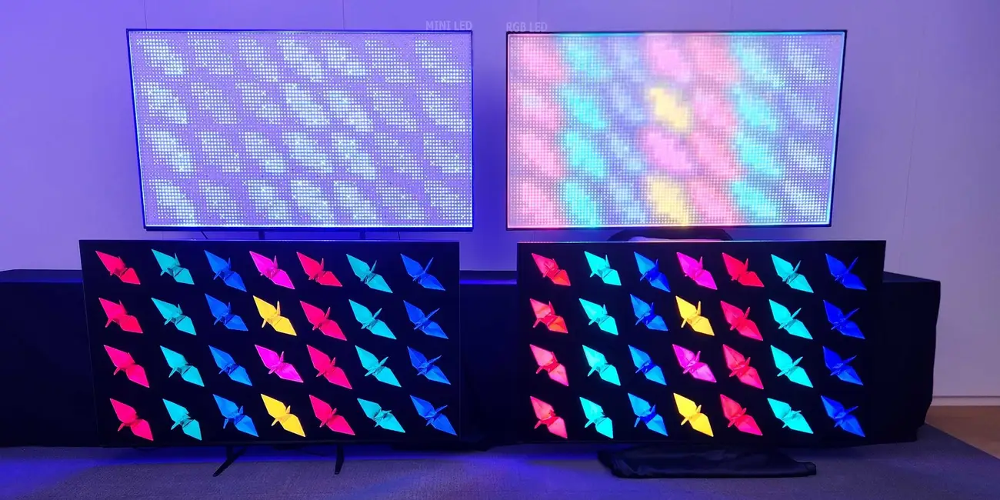
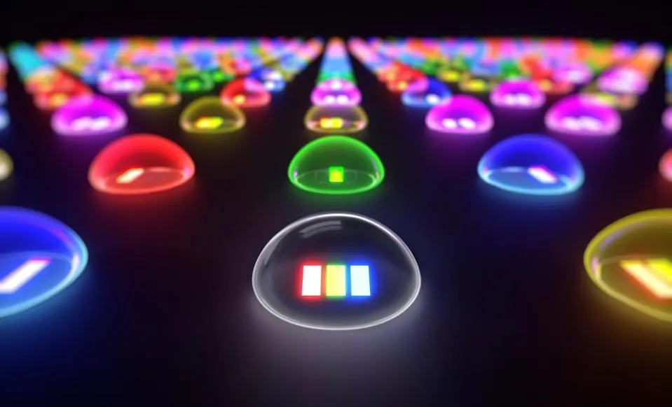
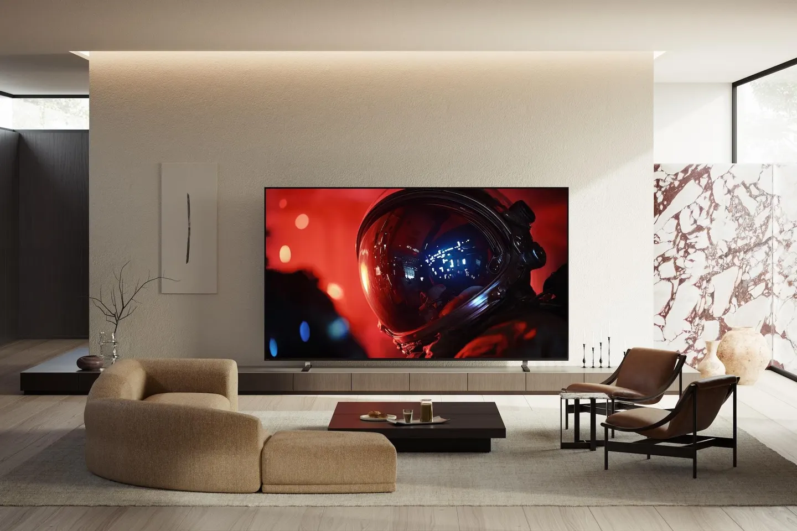
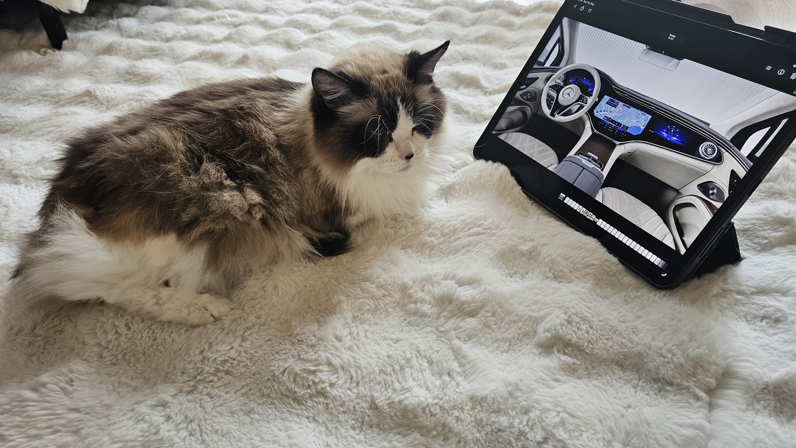

---
#Required fields
title: "LCD Bangkit dari Kubur dengan mini LED: Dari Xiaomi Rp.10 Juta Sampai Sony True RGB yang Mengguncang OLED"
description: "Xiaomi baru aja launching TV Mini LED seharga Rp.9,9 juta, dan ini bikin LCD bangkit dari kubur. Tapi di level atas, Sony True RGB dengan 15.000 zones dan 4.000 nits mengubah aturannya. Ini bedah teknisnya."
pubDate: 2026-05-24
category: "mini led"
cover: "../../assets/blog/9/9.Rtings_led-backlighting-medium.jpg"
coverAlt: "Visual representation of LCD Bangkit dari Kubur dengan mini LED: Dari Xiaomi Rp.10 Juta Sampai Sony True RGB yang Mengguncang OLED"

#Core Fields
tags: ["mini-LED", "LCD", "Dimming Zone", "Xiaomi TV", "Sony TV"]
author: "Thomas Agung Nugraha"
lang: "id-ID"
draft: false

#recommended
slug: "blog_09_mini_led_revolution"
excerpt: "Saat saya bekerja dengan layar, Mini LED muncul sebagai penyelamat LCD. Persaingan teknologi display premium kini jauh dari kata selesai."
updatedDate: 2026-07-04

#Optional-series support
#series: ""
#seriesOrder:

#Optional:SEO & Indexing
canonicalURL: "https://t-agung.id/blog/blog_09_mini_led_revolution"
keywords:
  - mini-LED
  - LCD
  - Dimming Zone
  - Xiaomi TV
  - Sony TV
noindex: false

#Optional-table-of-content
showToc: true

#optional-internal linking
relatedPosts:
  - blog_10_mini_led_itu_apa
---

Xiaomi baru aja launching TV Mini LED seharga Rp. 9,9 juta. LCD yang dulu kita anggap teknologi tua, sekarang ngebut balik.

Jujur, kalau kamu masih mikir LCD itu cuma layak buat TV 40 inci di warung kopi, kamu perlu update. Tahun 2026 ini LCD bukan cuma bertahan, dia menyerang balik. Dan senjatanya: Mini LED.

Tapi biar sama-sama Mini LED, dia ada hirarkinya. Dari entry-level Xiaomi yang bikin harga anjlok, sampai Sony True RGB yang bikin para penggemar OLED mulai gelisah. Kita bedah dari yang murah sampai yang bikin dompet nangis.

## Apa Itu Mini LED, Dong?

Kalau kamu sudah tahu, langsung scroll ke bawah.

Mini LED itu evolusi dari LED backlight biasa yang ada di semua LCD TV selama satu dekade terakhir. Bedanya ada di ukuran LED dan jumlah zona dimming.

LCD TV konvensional dulunya hanya pakai *edge backlight*. Tapi di satu dekade terakhir udah mulai make *direct full-array backlight* dimana LED nya ditaro langsung dibelakang layar. Tapi model jadul ini hanya pake segelintir LED yang relatif besar yang dikelompokkan jadi 10 sampai 50 zona dimming. Bayangin kamu punya banyak lampu panggung tapi cuma punya 3 saklar. Satu saklar nyalain seluruh panggung. Mau bikin satu sudut gelap? Susah. Hasilnya halo effect, lingkaran cahaya di sekeliling objek terang di layar gelap.

Mini LED pecahin masalah ini. LED-nya diperkecil jadi ukuran mini. Karena lebih kecil, kamu bisa menjejeh ratusan, bahkan ribuan LED di belakang panel. Dan karena lebih banyak, kamu bisa bikin ribuan zona dimming yang dikontrol independen.

Kembali ke analogi warung: LCD biasa itu kayak lampu temaram satu saklar di warung bakso. Mini LED itu kayak smart lighting di mall. Setiap pojok bisa diatur sendiri. Bagian layar yang hitam, beneran mati. Bagian yang terang, meledak. Kontrasnya jadi beda kelas.

Tapi jangan tertipu. Ada Mini LED yang beneran bagus, dan ada yang cuma marketing.

 *Mini LED backlight vs konvensional: semakin banyak zona dimming, semakin presisi kontrol cahaya. Sumber: RTINGS*

Dan tentunya ngontrol ratusan bahkan ribuan LED ini sambil sinkronisasi dengan gambar yang ditampilkan di LED bukan hal yang gampang. Makin banyak LED nya makin kompleks sistem image processing dan LED kotrolnya.

## Xiaomi TV S Mini LED 2026: Specs dan Harga Lengkap

Xiaomi tidak main-main. Mereka bawa Mini LED ke harga yang sebelumnya nggak terbayang.

Harga di Indonesia:

- 65 inci: Rp.  9.999.000
- 75 inci: Rp. 14.999.000
- 85 inci: Rp. 22.999.000
- 98 inci: Rp. 29.999.000

Spesifikasi teknis, varian 65 inci sebagai referensi:

- Panel: QD-Mini LED (Quantum Dot + Mini LED backlight)
- Dimming zones: 308 zones (55 inci), 384 zones (65 inci), 512 zones (75 inci), 640 zones (85 inci), 880 zones (98 inci)
- Peak brightness: 1.200 nits
- Refresh rate: 120Hz (65 inci) / 60Hz (55 inci) / 144Hz (85 inci, 98 inci)
- HDR: Dolby Vision, HDR10, HDR10+
- Audio: 34W quad speakers, Dolby Atmos
- Platform: Google TV
- Smart features: Google Assistant, Chromecast built-in, support berbagai streaming apps

Tiga ratus delapan puluh empat zona dimming di harga Rp. 9,9 juta. Gokil banget ini. Dua tahun lalu kamu nggak bisa nemuin TV dengan 100 zona dimming di harga di bawah Rp. 30 juta !!

 *Xiaomi TV S Mini LED 2026 85" dengan QD-Mini LED technology. Sumber: Xiaomi*

### Yang Bagus

Cost-Performance. Titik. Di segmen ini nggak ada yang nandingin value-nya. Panel QD-Mini LED dengan 1.200 nits udah kasih pengalaman HDR yang jauh lebih hidup dari LCD biasa. Warna dari Quantum Dot-nya cukup akurat buat konsumsi harian: Netflix, YouTube, nonton bola di living room, semuanya oke.

Refresh rate 120Hz di ukuran 65 inci juga bikin ini pilihan solid buat gamers budget. PS5 dan Xbox Series X bisa output di 120Hz, TV ini handle. (Untuk ukuran 85 dan 98 inci, refresh rate naik ke 144Hz.)

### Yang Kurang

Jangan ekspektasi perfection. 384 zones untuk layar 65 inci berarti setiap zona cukup besar. Halo effect masih keliatan di scene dengan kontras ekstrem, misalnya teks putih kecil di atas background hitam pekat. Prosesornya juga entry-level, jadi motion processing dan upscaling nggak sehalus TV mid-range.

Audio-nya 34W, cukup buat ruang tamu kecil. Buat home cinema beneran, kamu tetep butuh soundbar atau sistem audio terpisah.

## Tapi Ini Bukan Mini LED Terbaik yang Ada...

Xiaomi TV S Mini LED 2026 itu entry-level Mini LED. Dia bawa teknologi premium ke harga massal, dan itu sudah luar biasa. Tapi di atasnya masih ada dunia Mini LED lain yang belum banyak orang tahu.

Sekarang kita coba pinjak ke level dunia TV dewa di 2026 ....

Dunia Sony True RGB.

 Moko! Jangan kebanyakan nonton TV!!

## Sony True RGB: The Bleeding Edge

Sony resmi launching teknologi "True RGB" April 2026. Produk pertamanya, Bravia 9 II dan Bravia 7 II, mulai tersedia akhir Mei 2026. Ini bukan sekadar upgrade incremental. Ini fundamental shift di cara LCD TV ngehasilin warna.

Sony Bravia 9 II, spesifikasi:

- Panel: True RGB Mini LED
- Dimming zones: 15.000 zones (Bravia 9 II) / 5.100 zones (Bravia 7 II)
- Peak brightness: 4.000 nits (Bravia 9 II) / 2.000-2.500 nits (Bravia 7 II)
- Sizes: Bravia 9 II tersedia 65 inci, 75 inci, 85 inci, 115 inci / Bravia 7 II tersedia 50 inci, 55 inci, 65 inci, 75 inci, 85 inci, 98 inci
- HDR: Dolby Vision, HDR10, HLG
- Processor: XR Processor (Sony proprietary AI image processing chip)
- Platform: Google TV dengan Gemini AI integration
- Audio: Acoustic Surface Audio+, Dolby Atmos
- Harga US MSRP: Bravia 9 II 65 inci $3.599,99 / Bravia 7 II mulai $2.099,99 (50 inci)

Lima belas ribu zona dimming. Empat ribu nits. Angka-angka yang terdengar kayak sci-fi. Dan ini bukan angka marketing yang dibesar-besarkan. Udah dikonfirmasi multiple reviews dan hands-on dari Rtings, AVForums, Business Insider, dan TechRadar.

 *Sekelompok red, green, blue LEDs independen di belakang panel LCD: inti dari Sony True RGB. Sumber: Business Insider*

## Kenapa True RGB Itu Game Changer

Di sini bagian teknis yang paling seru buat saya. Sebagai display engineer, saya udah ngeliat evolusi backlight technology selama 18 tahun. Dari era CCFL ke LED, dari edge-lit ke full-array, dari Blue LED + yellow phosphor ke blue LED plus quantum dot. Dan True RGB dari Sony itu salah satu lompatan terbesar dalam satu dekade.

Apa bedanya?

LCD Mini LED biasa, termasuk Xiaomi S Mini LED 2026, pake blue LED plus quantum dot layer (atau dengan yellow phosphor). Blue LED nembak ke lapisan quantum dot. Quantum dot nyerap cahaya biru dan mancarkan kembali sebagai merah dan hijau (merah + hijau = apa hayo?). Dan ada beberapa sisa cahaya biru yang nggak terserap melewati filter. Hasil akhirnya cahaya putih yang kemudian difilter lagi oleh panel LCD buat ngehasilin warna. Dua tahap konversi, dua tahap kehilangan cahaya, dua tahap kehilangan akurasi warna.

Sony True RGB pake tiga LED independen: merah, hijau, dan biru. Setiap warna datang langsung dari LED-nya sendiri. Nggak ada quantum dot layer. Nggak ada konversi warna sekunder. Cahaya merah dari LED merah, hijau dari LED hijau, biru dari LED biru. Langsung ke panel LCD. Satu tahap filter aja.

 *Visualisasi RGB LED matrix dari Sony TrueRGB. Sumber: Sony*

Buat orang yang suka kuliner, LCD Mini LED biasa itu kayak bikin nasi goreng pake bumbu instan, kamu campur bahan-bahan, hasilnya oke-oke aja. Sony True RGB itu kayak masak pake bahan segar dari pasar, setiap bahan dipilih terpisah, dimasak dengan presisi, hasilnya jauh lebih kaya rasa.

### Konsekuensi Teknis dari Perbedaan Ini

Warna lebih murni. Karena setiap warna datang dari sumbernya sendiri, color gamut yang bisa dicapai jauh lebih luas. Sony klaim coverage yang signifikan melebihi DCI-P3, dan review awal dari Rtings konfirmasi ini.

Brightness lebih tinggi. Nggak ada quantum dot layer yang nyerap dan menghamburkan cahaya, lebih banyak foton sampai ke layar. 4.000 nits bukan angka asal-asalan.

Efisiensi energi lebih baik. Konversi blue ke red plus green via quantum dot itu nggak efisien secara energi. True RGB ilangin langkah itu.

Viewing angle lebih luas. Ini menarik. Karena warna nggak bergantung pada filter LCD sebanyak sebelumnya, angle dependency berkurang. Dari posisi side-view, warna masih lebih stabil.

Nggak ada risiko cadmium. Quantum dot konvensional pake cadmium, yang jadi masalah regulasi di beberapa negara. True RGB ilangin ini sama sekali.

### Tapi Ada Trade-off

Biaya. Jauh lebih mahal. Produksi tiga jenis LED yang beda dalam skala mini, dengan kontrol independen per-zona, dan driver electronics yang 3 kali lebih kompleks, semua ini nambah biaya produksi secara signifikan. Bravia 9 II 65 inci di harga $3.599,99 itu bukan buat semua orang.

## Head-to-Head: Xiaomi vs Sony

| Spesifikasi         | Xiaomi TV S Mini LED 65 inci 2026    | Sony Bravia 9 II 65 inci True RGB      |
| ------------------- | ------------------------------------ | -------------------------------------- |
| Harga               | Rp. 9.999.000                          | ~Rp. 55.000.000 (estimasi, US $3.599,99) |
| Teknologi Backlight | QD-Mini LED (blue LED + quantum dot) | True RGB Mini LED (R+G+B independen)   |
| Dimming Zones       | 384                                  | 15.000                                 |
| Peak Brightness     | 1.200 nits                           | 4.000 nits                             |
| Refresh Rate        | 120Hz                                | 120Hz native                           |
| HDR                 | Dolby Vision, HDR10, HDR10+          | Dolby Vision, HDR10, HLG               |
| Processor           | Entry-level                          | XR Processor + AI                      |
| Audio               | 34W quad speakers, Dolby Atmos       | Acoustic Surface Audio+, Dolby Atmos   |
| Platform            | Google TV                            | Google TV + Gemini                     |

Angka-angkanya sendiri udah cerita. 384 vs 15.000 zona dimming. 1.200 vs 4.000 nits. Rp.9,9 juta vs Rp.55 juta.

## Kamu Dapat Apa Sesuai Harga yang Kamu Bayar

Mari kita jujur. Bedanya Rp9,9 juta dan Rp55 juta itu 5,5 kali lipat. Tapi apa yang kamu dapet?

15.000 zona dimming vs 384 zona. Itu 39 kali lebih banyak zona. Setiap zona di Sony itu sangat kecil, hampir mendekati tingkat piksel. Halo effect? Hampir nggak ada. Black level? Mendekati OLED.

4.000 nits vs 1.200 nits. Itu 3,3 kali lebih terang. Di konten HDR yang beneran nge-manfaatkan highlight, film-film kayak Dune, Oppenheimer, atau game kayak Cyberpunk 2077, perbedaannya kerasa banget. Highlight-nya beneran meledak di Bravia 9 II.

True RGB vs Quantum Dot. Ini bukan soal angka. Ini soal kualitas warna yang fundamental beda. True RGB kasih warna yang lebih natural, lebih jenuh tanpa keliatan over-saturated, dan lebih konsisten di berbagai angle.

Waktu dengan tim Sony Xperia, kita sering berdebat soal color accuracy versus color vibrancy. Tim Jepang ingin warna yang benar-benar akurat, sementara tim marketing menginginkan warna yang "menjual", yang kadang membuat warna kulit manusia terlihat aneh. Kompromi akhirnya tercapai di XR Engine dan turunannya, yang dikembangkan bersama tim TV Bravia. Sekarang, dengan adanya True RGB sebagai tambahan hardware, Sony bisa memuaskan kedua kubu sekaligus: warna akurat sekaligus tetap hidup dan menarik.

Otak di balik layar juga beda level. XR Processor Sony jauh lebih unggul dibanding prosesor entry-level karena Sony punya warisan processing yang sangat dalam. Saya pribadi masih ingat zaman mengembangkan tablet dan smartphone di Sony, di mana tim display engineering benar-benar obsesif dengan image processing juga ketika bekerjasama dengan tim TV Bravia. Setiap frame dianalisis, didekonstruksi, dan direkonstruksi oleh chip AI yang memahami konten secara kontekstual. Karena itu, upscaling dari 1080p ke 4K, noise reduction, dan motion interpolation terasa jauh lebih halus di Sony. Bukan cuma angka di atas kertas.

Tapi apakah kamu beneran butuh semua itu...?

Itu pertanyaannya. Dan jawabannya tergantung pada siapa kamu dan berapa tebal dompetmu.

## Verdict: Siapa Seharusnya Beli Apa?

Beli Xiaomi TV S Mini LED 2026 kalau:

- Budget kamu terbatas tapi kamu pengen pengalaman HDR yang nyata
- Kamu mostly nonton streaming (Netflix, Disney+, YouTube) di kondisi pencahayaan normal
- Kamu gamer casual yang main di 60-120Hz dan nggak terlalu pedulian perfection
- Kamu pengen TV besar 65 inci tanpa harus jual ginjal
- Kamu punya ruang tamu dengan pencahayaan campuran (nggak total gelap, nggak terlalu terang)

Xiaomi ini best cost-performance Mini LED di pasaran saat ini. Di harga Rp. 9,9 juta, nggak ada kompetitor yang bisa ngadekati speknya.

Beli Sony Bravia 9 II True RGB kalau:

- Kamu serious about picture quality dan nggak mau kompromi
- Kamu punya home cinema setup dengan pencahayaan terkendali
- Kamu nonton konten HDR dalam volume besar (4K Blu-ray, HDR streaming, PC gaming)
- Kamu pengen black level dan contrast yang mendekati atau bahkan ngelewatin OLED
- Budget bukan masalah, dan kamu pengen TV yang tetep relevan dalam 5 bahkan sampai 10 tahun ke depan
- Kamu punya room yang cukup besar buat nikmatin 4.000 nits brightness tanpa silau

Bravia 9 II ini bukan TV biasa. Ini statement piece. TV yang kamu beli karena kamu beneran peduli sama kualitas gambar.

Beli Sony Bravia 7 II True RGB kalau:

- Kamu pengen teknologi True RGB tapi dengan harga yang lebih masuk akal
- Kamu tetep peduli sama kualitas warna dan brightness tapi nggak butuh 4.000 nits
- 5.100 zones dan 2.000-2.500 nits udah cukup buat kebutuhanmu

Bravia 7 II ini sweet spot antara value dan performance di ekosistem True RGB.

 *Sony Bravia 9 II True RGB dalam home cinema setup. Sumber:Sony*

## Penutup: Mini LED Adalah Masa Depan LCD, dan 2026 Adalah Tahunnya

Dua tahun lalu, semua orang bilang OLED itu king. TV terbaik, contrast terbaik, black level terbaik. Mini LED? Masih ngejar.

Sekarang? Sony True RGB dengan 15.000 zones dan 4.000 nits udah secara demonstratif ngejegal, dan di beberapa metrik ngelewatin OLED kelas atas. Black level dari 15.000 zona dimming yang ultra-presisi itu beneran mendekati pixel-level control dari OLED. Dan brightness 4.000 nits? OLED bahkan nggak bisa ngadekati angka itu.

Di ujung lain spektrum harga, Xiaomi bawa Mini LED ke harga massal. Rp9,9 juta untuk TV 65 inci dengan QD-Mini LED dan 1.200 nits. Ini bukti bahwa Mini LED bukan lagi teknologi premium eksklusif. Ini udah mainstream.

Jadi ya, 2026 ini tahun Mini LED. Tahun di mana LCD bangkit dari kubur bukan dengan teknologi lama, tapi dengan pendekatan baru yang beneran ngubah aturan main.

Kalau kamu punya pertanyaan teknis, tinggal comment di bawah. Saya seneng banget breakdown lebih detail.

 iPad pro 12.9" katanya juga make mini-LED kan ? tapi denger-denger maximum luminance nya 1600 cd/m2 ya ?.

Dan Moko, kalau kamu baca ini dan merasa tercekam sama teknologi... sorry, kamu nggak bisa escape dari dunia Mini LED.

---
*Referensi:*

- Mini led VS OLED: https://www.rtings.com/monitor/learn/mini-led-vs-oled
- Business insider review : https://www.businessinsider.com/guides/tech/sony-true-rgb-tv-technology-first-look-2026-4