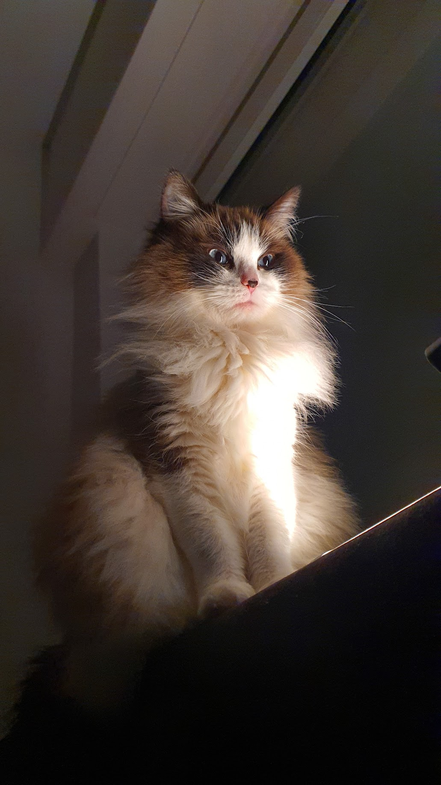
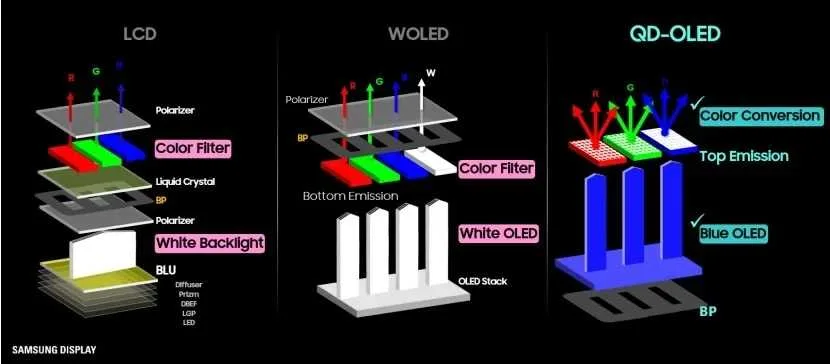
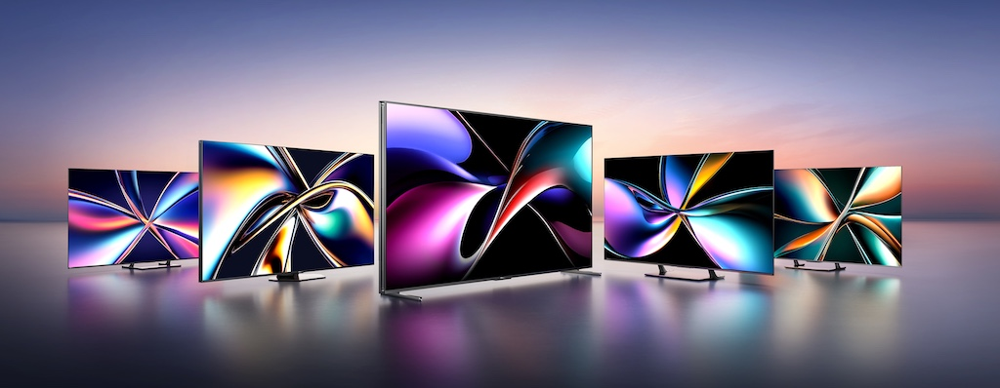
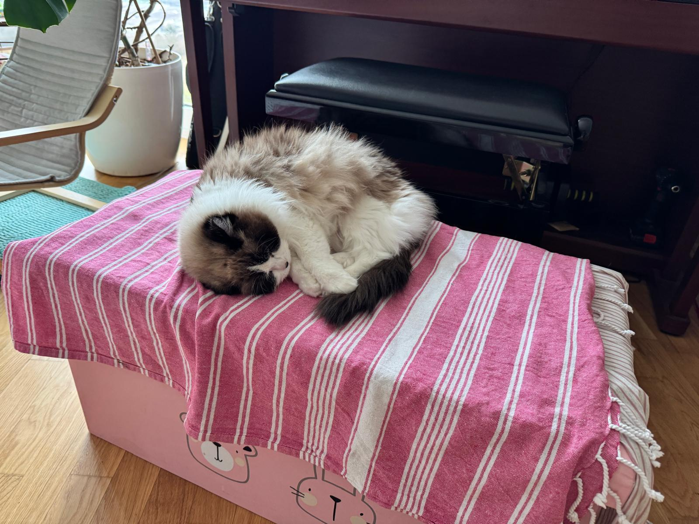

 *Visualisasi RGB LED matrix dari Sony TrueRGB. Sumber: Sony*

Kamu lagi browsing TV di toko elektronik. Jalan ngeliat-liat, ada satu pertanyaan: "Mini LED? Itu apa?" Sales di toko juga senyum-senyum: "Pak, ini teknologi terbaru. Kontrasnya hampir kayak OLED tapi lebih terang." Kamu denger-denger aja, bayar, bawa pulang. Nonton film pertama malam itu: wah, beneran hitam pekat pas adegan gelap, tapi terang banget pas scene outdoor.

Tapi, sama-sama mini LED, TV 65 inci Mini LED dari Hisense harganya 11-16 juta (U7Q/U8 series). OLED LG ukuran sama? 18-22 juta, SONY yang ngebangga-banggain TrueColor sampe lewat 50 Juta.

- **Xiaomi TV A Pro 65" Mini LED** — Rp9.900.000 (entry-level Mini LED, white LED + QD, sekitar 500 zones)
- **Hisense U7Q 65" Mini LED** — Rp11-16 juta (Mini LED + QD, ~2.000 zones)
- **LG QNED85 65" Mini LED** — Rp18-21 juta (Mini LED + QD, ~400 zones, alpha7 processor)
- **TCL C855 65" Mini LED** — Rp18-21 juta (Mini LED + SQD, ~1.500 zones)
- **Sony BRAVIA 9 65" True RGB Mini LED** — Rp42-45 juta (True RGB, ~1.500 zones, XR Backlight Master)

Xiaomi masuk paling murah, Sony paling mahal. Beda 4x lipat buat ukuran yang sama.

Setelah 15+ tahun di industri display, dari kerja di Sony VAIO Architecture Team, Sony Tablet S, Xperia Tablet Z, lalu Intel ngurusi display tech dan display ecosystem, sampai sekarang di Motherson maen-maen ama automotive HMI: saya bisa kasih jawaban yang nggak cuma marketing talk. Kita bahas dari yang murah dulu, baru naik ke yang mahal.

## Mini LED Itu Apa?

Mini LED bukan panel. Bukan teknologi display yang bikin pixel-mu nyala sendiri kayak OLED. Mini LED itu backlight. Dia masih LCD: kristal cair yang disorot dari belakang. Bedanya, lampu sorotnya jauh lebih kecil dan jauh lebih banyak.

Anggap aja begini: LCD itu kayak jendela yang kamu atur transparansinya dari belakang. Pixel LCD adalah tirai yang bisa naik atau turun. Tapi kalau nggak ada cahaya dari belakang, tirai pun nggak bisa nampilin apa-apa. Backlight adalah lampu yang nyorot ke tirai itu.

LED biasa di TV LCD ukuran sekitar 2-4 mm. Mini LED? Sekitar 100-200 mikrometer. Ini 10 sampai 20 kali lebih kecil. Perumpamaannya: LED biasa itu kayak bola lampu bohlam di ruang tamu. Mini LED itu kayak LED strip yang kamu tempel di dapur, cuma jauh lebih kecil lagi.

Kecilnya memungkinkan kita taruh ribuan LED di belakang panel, bukan cuma puluhan. Banyak LED kecil ini dikelompokkan ke dalam "dimming zones": area-area yang bisa diatur terang atau gelap secara independen. TV Mini LED sekarang punya ratusan sampai ribuan zones. Hisense U8Q punya sekitar 2.000 zones (versi internasional 65 inci; US model U8QG mencapai 5.600 zones). Sony BRAVIA 9 punya sekitar 1.500 zones (65 inci) tapi kualitas kontrolnya jauh lebih presisi berkat algoritma Sony yang sudah puluhan tahun disempurnakan.

Perumpamaan lain: bayangkan kamu punya lampu di ruang konser. Kalau cuma ada satu lampu besar di atas panggung, seluruh area terang sama rata. Tapi kalau kamu punya 5.000 lampu kecil yang masing-masing bisa diatur, kamu bisa bikin area panggung terang banget sementara tribun tetap gelap. Hasilnya? Kontras yang jauh lebih tinggi dari LCD biasa.

Semakin banyak zones, semakin presisi kontrol cahayanya. Area hitam bisa lebih gelap, highlight bisa lebih terang.

## Kenapa Butuh Mini LED? Masalah LCD yang Lama

LCD punya satu masalah utama: dia nggak bisa mati total. Pixel hitam di LCD masih disorot cahaya dari belakang, jadi yang keluar bukan hitam murni tapi abu-abu gelap. Ini kayak kamu coba nonton film horor di kamar tapi lampu tidur di pojok masih nyala redup. Ketar-ketir-nya jadi ilang.

 Moko lagi experiment baclight, katanya: "*kalau lampu ini backlight.. biar ada saya di depannya tetep ajah cahayanya bocor ke belakang ya*"

TV LCD biasa punya kontras sekitar 1.000:1 sampai 2.000:1. OLED bisa mencapai kontras tak terbatas karena pixel-nya beneran mati. Bedanya jauh.

Solusi pertama: local dimming. Alih-alih satu lampu besar yang nyala penuh di belakang layar, kita bagi jadi beberapa zona. Zona yang nampilin gambar gelap bisa diredupkan atau dimatikan. Tapi masalahnya, LED biasa terlalu gede. Jumlah zones-nya terbatas. Hasilnya: area gelap masih terlalu terang, atau malah muncul "blooming": cahaya dari zona terang yang nyebar ke zona gelap di sebelahnya.

Blooming itu kayak kamu lagi foto malam hari dengan flash: obyeknya terang banget tapi sekelilingnya malah silau, nggak tajam.

Mini LED perbaiki ini. Karena LED-nya kecil, kita bisa punya jauh lebih banyak zones. Dari 30-60 zones di TV FALD biasa, sekarang kita punya 500-5.000 zones. Blooming jauh berkurang. Area gelap bisa benar-benar gelap sementara area highlight tetep terang banget. Kontras dinamis bisa nyampe 10.000:1 sampai 100.000:1 (tergantung kualitas kontrol). Static kontras Mini LED di kisaran 5.000:1 – 15.000:1 (tergantung panel VA/IPS).

## Evolusi Backlight: Dari CCFL Sampai Mini LED

Backlight LCD udah ngalami evolusi panjang. Setiap generasi bikin hal yang sama tapi dengan cara yang jauh lebih efisien.

**2000-an awal: CCFL (Cold Cathode Fluorescent Lamp)**\
Ini lampu neon mini di belakang LCD. Kontras rendah, efisiensi jelek, dan desainnya tebal. LCD jadul yang masih *tebuel*, itu pakai CCFL. Kayak lampu neon putih yang bentuknya tabung panjang itu lho, bedanya ini dibuat agak tipisan.

**2008: Edge-lit LED**\
LED ditaruh di tepi layar, cahaya disebar pakai light guide plate. Desain jadi super tipis. Tapi tanpa local dimming: seluruh layar terang seragam. Kontras masih jelek. Banyak TV "LED" murah sampai sekarang masih pakai ini. Kayak lampu sorot satu di langit-langit kamar: terang sih, tapi nggak bisa diatur mana yang terang mana yang gelap.

**2010-an awal: Direct-lit LED**\
LED ditaruh di belakang seluruh layar, bukan cuma di tepi. Pencahayaan lebih uniform, tapi masih tanpa local dimming atau cuma beberapa zones. Langkah ke arah yang lebih baik, tapi belum cukup.

**2010-an tengah: Full Array Local Dimming (FALD)**\
LED di belakang layar dibagi ke dalam zones yang bisa diatur independen. Biasanya 60-128 zones. Kontras mulai membaik, blooming masih ada. Samsung dan Sony push teknologi ini di TV premium mereka. Sudah kayak lampu di restoran yang bisa diatur per meja, tapi belum per piring.

**2019: Mini LED masuk market**\
Apple pakai Mini LED di iPad Pro. Samsung ngelanjutin di Neo QLED. Hisense langsung masuk dengan seri U8. Sekarang 2026: Mini LED udah jadi standar untuk TV LCD premium, bahkan mulai turun ke mid-range. Hisense juga rilis Vidda S Mini TV (sub-brand) di China dengan harga bersaing, tapi ini belum tersedia di Indonesia.

**2025-2026: True RGB Mini LED**\
Generasi terbaru: bukan cuma white LED yang mini, tapi LED merah, hijau, biru yang masing-masing dikontrol independen. Hisense rilis 116 inci RGB-MiniLED di Indonesia dengan harga Rp400 juta, sesuai report detikInet. Samsung, Sony, dan LG juga masuk ke arena ini di CES 2026.\
Perubahan signifikan di sini: bukan cuma naikin jumlah LED, tapi mengubah cara LCD menghasilkan warna. Bukan lagi dari backlight putih yang difilter, tapi dari cahaya warna yang langsung dikontrol.

## White LED Backlight: YAG, KSF, dan Quantum Dot

Sebelum masuk ke True RGB, kamu harus paham dulu bagaimana backlight putih itu bekerja. Mayoritas Mini LED TV sekarang masih pakai white LED.

Ada tiga cara bikin cahaya putih dari LED. Perumpamaannya: kayak bikin nasi putih. Bisa pakai beras biasa, beras premium, atau beras organik impor. Hasilnya putih, tapi rasa dan kualitasnya beda.

**1. YAG (Yttrium Aluminum Garnet) Phosphor**\
Blue LED ditutupi lapisan fosfor YAG yang convert sebagian cahaya biru jadi kuning. Biru ditambah kuning hasilnya putih. Ini metode paling murah dan paling umum. Kayak bikin kopi susu dari sachet: cepat, murah, lumayan enak.

Tapi spektrum cahaya putih-nya kurang ideal. Puncak kuning yang lebar "mengotori" channel merah dan hijau. Warna yang keluar kurang jenuh. Color coverage biasanya sRGB atau DCI-P3 yang nggak penuh. Merah nggak secemerah bendera, hijau nggak secemerah daun muda di musim hujan.

**2. KSF (Potassium Strontium Fluoride, K₂SiF₆:Mn⁴⁺) Phosphor**\
Blue LED ditutupi fosfor KSF yang emit merah sempit. Ditambah green phosphor untuk lengkap. Spektrum merah lebih narrow dibanding YAG, jadi warna merah lebih jenuh. Color coverage bisa nyampe DCI-P3 90-95%. Kayak kopi dari biji single origin: lebih karakter, lebih enak.

Masih bagus, tapi ada trade-off: KSF kurang stabil di suhu tinggi dan butuh enkapsulasi lebih baik. Panas terlalu lama, kualitas warna turun. Juga light decay timenya ngga secepat YAG, jadi masih kurang cocok untuk dipakai untuk miniLED di *high refresh rate* displays.

**3. Quantum Dot (QD)**\
Blue LED disinari ke quantum dot film. QD ini partikel semikonduktor nano yang emit warna sangat sempit tergantung ukurannya. QD merah emit merah yang sangat murni. QD hijau emit hijau yang sangat murni. Biru dari LED langsung. Hasilnya: warna paling jenuh dan akurat. Color coverage bisa nyampe Rec.2020, standar HDR paling luas.

Perumpamaannya: kalau YAG itu kayak cat dinding biasa, KSF kayak cat premium, Quantum Dot itu kayak cat artist yang warnanya beda banget sama yang ada di toko bangunan. Merah-nya merah yang beneran merah.

Tapi quantum dot punya masalah material. QD konvensional pakai cadmium (Cd) yang beracun. EU punya regulasi RoHS yang batasi pemakaian. Solusinya: cadmium-free QD (InP-based) yang lebih aman tapi kurang efisien dan kurang stabil. Atau QD yang dienkapsulasi rapat-rapat supaya cadmium nggak keluar. Trade-off klasik antara performa dan keamanan.

 Mekanisme Quantum Dot, contoh dari Samsung yang pakai OLED sebagai light source-nya.  Sumber : Samsung Display

## Perbandingan: White LED vs Quantum Dot

| Aspek          | YAG White LED     | KSF White LED                  | Quantum Dot                                  |
| -------------- | ----------------- | ------------------------------ | -------------------------------------------- |
| Color Coverage | sRGB - DCI-P3 80% | DCI-P3 90-95%                  | DCI-P3 95-99%, Rec.2020                      |
| Warna Jenuh    | Sedang            | Baik                           | Sangat baik                                  |
| Efisiensi      | Tinggi            | Sedang                         | Sedang-tinggi                                |
| Biaya          | Paling murah      | Sedang                         | Mahal                                        |
| Material Risk  | Rendah            | KSF degradation di suhu tinggi | Cadmium toxicity (Cd-QD), InP kurang efisien |
| Market         | Entry-mid range   | Mid-premium                    | Premium                                      |

Samsung Neo QLED, TCL C7/C8 series, dan Hisense U7/U8 semuanya pakai kombinasi Mini LED + Quantum Dot. Hasilnya: backlight yang sangat terang (2.000-4.000 nits peak) dengan warna yang sangat jenuh. Ini keunggulan utama mereka atas OLED: brightness jauh lebih tinggi. OLED non-MLA di 2026 berkisar 800-1.200 nits peak untuk area penuh (full screen), sementara MLA OLED (LG G4/G5, Sony A95L) nyampe 2.000-2.500 nits. Mini LED bisa 3.000-5.000 nits, bahkan model flagship 10.000 nits.

## Branding Mini LED: Siapa Bilang Apa

 Linup Hi-sense TV.... semoga fotonya bukan AI

Setiap TV maker punya nama sendiri buat teknologi Mini LED mereka. Ini kayak nama-nama menu nasi goreng di warung berbeda: "Nasi Goreng Spesial", "Nasi Goreng Kampung", "Nasi Goreng Premium". Intinya sama, cuma bumbu dan harganya yang beda.

**Samsung: "Neo QLED"**\
Mini LED + Quantum Dot. Samsung nggak pernah sebut "Mini LED" secara eksplisit di marketing utama mereka, mereka pakai "Neo QLED". Semua TV QLED premium mereka (QN90, QN85 series) pakai Mini LED backlight. Samsung juga punya "Micro RGB" versi mereka di CES 2026: 130 inci Micro RGB TV yang diklaim sebagai "puncak inovasi kualitas gambar".

**LG: "Mini LED" dengan α AI Processor**\
LG fokus di processor dan algoritma mereka. TV Mini LED LG pakai branding QNED (QNED85, QNED92, QNED70, dst), bukan seri OLED (A1/A2/A3/A4). Processor yang dipakai bervariasi: α7 buat entry-level, α8 buat mid-range, α9 cuma di QNED9M 8K flagship. LG juga punya "Micro RGB evo" di CES 2026. Kelebihan LG: anti-glare coating di model premium, native 144Hz panel. LG itu kayak chef yang nggak banyak bicara, tapi hasil masaknya selalu pas bumbunya.

**TCL: "QD Mini-LED" / "SQD Mini-LED"**\
TCL pakai Super Quantum Dot (SQD) yang klaimnya lebih efisien dan lebih stable dari QD biasa. TCL C855/C755 series di Indonesia tersedia di harga Rp18-21 juta untuk 65 inci, Rp.35-40 juta untuk 85 inci. TCL agresi di harga: mereka bikin Mini LED terjangkau. TCL itu kayak warung yang buka 24 jam: harga bersahabat, kualitas.... oke lah.

**Hisense: "ULED MiniLED" / "RGB-MiniLED"**\
Hisense paling agresif push Mini LED. Mereka punya lineup lengkap: U6 (entry Mini LED), U7 (mid), U8 (premium), dan UX (RGB-MiniLED flagship). Hisense juga yang paling murah: U7Q 65 inci di kisaran 11-16 juta, U6Q di kisaran Rp.7-10 juta. Sub-brand Vidda S Mini dijual di China sekitar Rp5 jutaan (65 inci) tapi belum tersedia di Indonesia. Hisense resmi rilis TV 116 inci RGB-MiniLED di Indonesia dengan harga 400 juta!

**Sony: "XR Backlight Master" / "True RGB"**\
Sony fokus di kualitas kontrol dan jumlah zones yang besar. BRAVIA 9 pakai sekitar 1.500 zones (65 inci) sampai 2.000 zones (75 inci) dengan algoritma XR Backlight Master yang sangat presisi. Sony juga punya teknologi "True RGB" untuk Mini LED generasi berikutnya.

Intinya semua teknologi yang sama: Mini LED backlight dengan atau tanpa Quantum Dot. Bedanya di kualitas kontrol, jumlah zones, algoritma, dan harga.

## Mini LED vs OLED: Mana yang Worth It?

Ini pertanyaan yang paling sering ditanyakan. Jawabannya tergantung kebutuhanmu dan dompetmu:

**Milih Mini LED kalau kamu:**

- Nonton TV di ruangan terang. Mini LED dengan 3.000-4.000 nits peak brightness ngerasa jauh lebih nyaman di siang hari. OLED di ruang terang? Kayak coba baca buku di bawah lampu lilin.
- Mau ukuran gede (75-98 inci) di harga yang masuk akal. OLED di ukuran ini harganya eksponensial. OLED 97 inci bisa nyampe ratusan juta.
- Khawatir burn-in. Mini LED adalah LCD: nggak ada risiko burn-in. OLED punya risiko burn-in, terutama kalau kamu nonton TV berita atau channel yang ada watermark logo tetap di layar.
- Nonton konten HDR banyak. Mini LED bisa push brightness lebih tinggi, highlight lebih terang.

**Milih OLED kalau kamu:**

- Nonton film di ruangan gelap. OLED punya kontras sempurna karena pixel beneran mati. Hitam-nya hitam beneran, bukan abu-abu gelap yang dikira hitam.
- Mau response time lebih cepat. OLED lebih responsif, penting buat gaming competitive.
- Tidak mau blooming. OLED nggak punya blooming karena pixel independen, bukan zones.
- Mau desain yang lebih tipis. OLED tanpa backlight, jadi lebih ramping. Nempel di dinding kayak bingkai foto.

Secara harga di Indonesia: Mini LED 65 inci mulai 5-10 juta. OLED 65 inci sekitar 15-25 juta. Beda signifikan. Mini LED memang pilihan paling masuk akal dari segi price-to-performance. Tapi kalau kamu mau pengalaman sinematik di ruang gelap, OLED masih raja.

## Material Risk & Sustainability

Ada hal teknis yang jarang dibahas konsumen: risiko material di balik teknologi display ini. Ini penting, terutama buat kamu yang peduli sustainability.

Mini LED white LED pakai YAG atau KSF phosphor yang relatif aman. Quantum Dot? QD konvensional pakai cadmium yang beracun. Produsen di EU harus patuh RoHS: batasi cadmium di bawah 0,01% by weight. Solusinya InP-based QD yang cadmium-free tapi kurang efisien. Trade-off klasik antara performa dan sustainability.

KSF phosphor punya masalah lain: degradation di suhu tinggi. LED Mini LED yang push brightness ke 4.000 nits menghasilkan panas. KSF yang lama-lama bisa degradasi, mengubah spektrum warna. Produsen premium pakai enkapsulasi dan thermal management lebih baik untuk mitigasi. Ini kayak soal kualitas bahan bangunan: yang murah gampang lapuk kena hujan panas, yang premium butuh material lebih tebal dan lebih mahal.

LED merah sendiri punya efisiensi paling rendah di antara tiga warna RGB. Ini kenapa white LED (blue + phosphor) lebih efisien: kamu nggak perlu LED merah yang boros. Tapi True RGB Mini LED butuh LED merah, hijau, dan biru yang masing-masing dikontrol. Efisiensi turun, kontrol warna naik. Lagi-lagi trade-off.

## Masa Depan: Ke Mana Arah Backlight?

Arahnya jelas: semakin presisi kontrol cahaya. Mini LED white + QD adalah langkah besar. Tapi ada langkah lebih jauh lagi.

**True RGB Mini LED:** Bukan cuma intensitas, tapi juga warna yang dikontrol per zona. Setiap zone punya LED merah, hijau, biru yang masing-masing bisa diatur. Hasilnya: warna yang jauh lebih akurat, color volume yang lebih baik di berbagai level brightness. Hisense, Samsung, Sony, dan LG udah mulai masuk arena ini di 2026.

Tapi ada satu hal yang lebih jauh lagi. Dan ini yang bikin saya sebagai display engineer agak deg-degan kalau dipikir terlalu lama.

Bayangkan Mini LED: ribuan LED mini di belakang panel LCD, dikontrol per zona. Sekarang bayangkan kalau LED-nya bukan di belakang panel, tapi LED itu sendiri yang jadi pixel-nya. Setiap pixel punya sub-pixel merah, hijau, biru yang masing-masing adalah chip LED mikro. Nggak butuh LCD panel. Nggak butuh backlight. Pixel nyala sendiri.

Itu **Micro LED**.

Dan kompleksitasnya? Mini LED butuh kontrol per zona: mungkin 1.000-5.000 zona. microLED butuh kontrol per pixel: 8 juta pixel di 4K, masing-masing punya 3 sub-pixel yang dikontrol independen. 24 juta elemen yang harus dikalibrasi, di-drive, dan dimonitor.

Mini LED itu kayak ngatur lampu di stadion: ratusan lampu yang kamu atur per area. microLED itu kayak ngatur lampu di stadion tapi lampu-nya itu masing-masing kursi, dan kamu harus ngerjainnya per kursi.

Bayangkan yield-nya: kalau satu chip LED mikro mati, satu pixel mati. Bayangkan repair-nya: kamu harus ganti chip LED individual, bukan module. Ini kenapa Samsung The Wall dan Sony Crystal LED masih di kisaran ratusan juta untuk ukuran 100+ inci.

Jadi ya, Mini LED memang pilihan solid sekarang. Sweet spot antara performa dan harga. Tapi microLED? Itu frontier. Dan kompleksitasnya bukan sekadar "LED-nya lebih kecil". Itu perbedaan level.

Teaser untuk post berikutnya: kita bakal bahas microLED lebih dalam. Gimana cara bikin 24 juta chip LED mikro yang nyala konsisten. Kenapa yield masih jadi masalah utama. Dan apakah microLED beneran bisa jadi "perfect display" yang industri janjikan selama dua dekade terakhir.

Sampai ketemu lagi di sana ya, Moko udah ngantuk.

Udah.... gak.... kuat....

---

