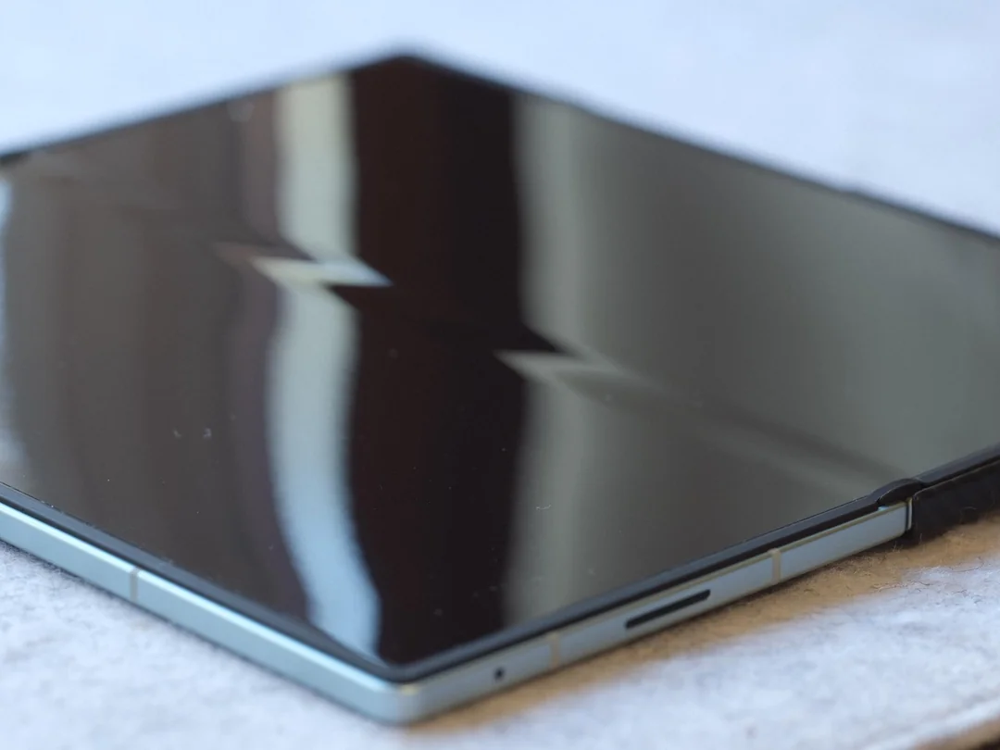
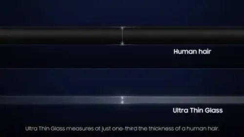
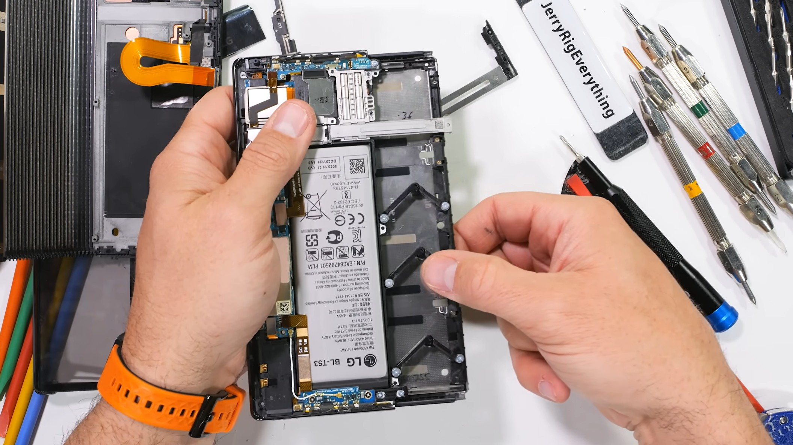
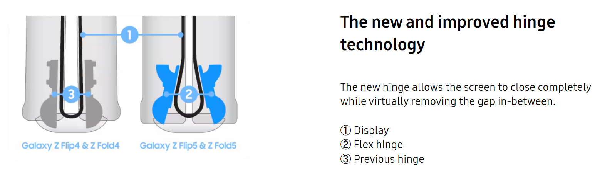
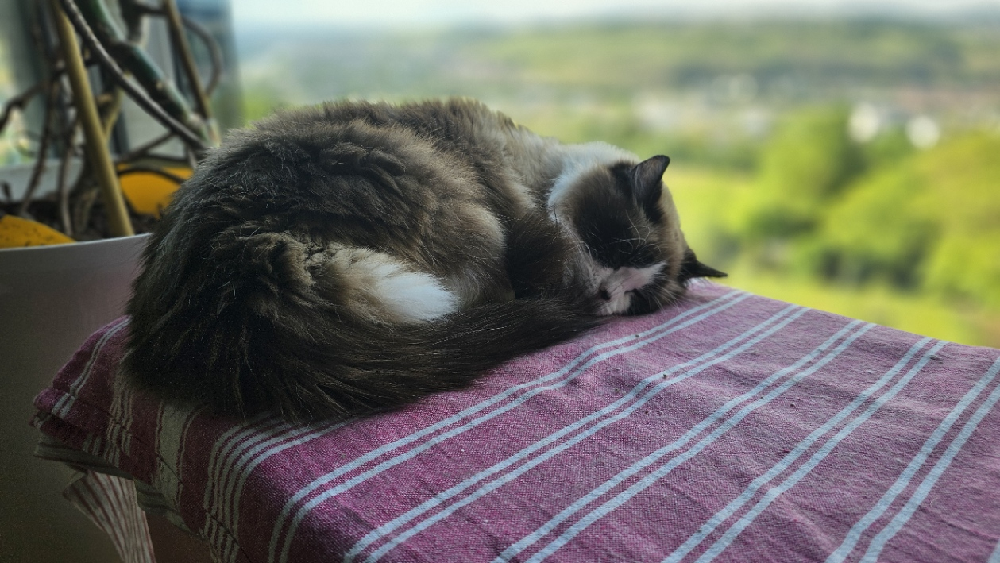

---
#Required fields
title: "HP Lipat Itu Keren, Tapi Kenapa Masih Keliatan Lipatannya?"
description: "Apa sih Crease itu ? kenapa susah ngebenerinnya ?"
pubDate: 2026-05-31
category: "OLED"
cover: "../../assets/blog/11/11.fold7Crease.jpg"
coverAlt: "Visual representation of HP Lipat Itu Keren, Tapi Kenapa Masih Keliatan Lipatannya?"

#Core Fields
tags: ["HP Lipat", "Crease", "OLED", "UTG"]
author: "Thomas Agung Nugraha"
lang: "id-ID"
draft: false

#recommended
slug: "blog_11_hp_lipat_crease"
excerpt: "Menghilangkan crease pada layar lipat adalah mimpi buruk teknik mekanis. Sebagai engineer, saya tahu betapa rumitnya struktur engsel tersebut."
updatedDate: 2026-07-04

#Optional-series support
#series: ""
#seriesOrder:

#Optional:SEO & Indexing
canonicalURL: "https://t-agung.id/blog/blog_11_hp_lipat_crease"
keywords:
  - HP Lipat
  - Crease
  - OLED
  - UTG
noindex: false

#Optional-table-of-content
showToc: true

#optional-internal linking
relatedPosts:
  - blog22_vivo_x_fold_6_teknologi_layar_lipat_2026
---

Weekend kemarin saya main ke counter Samsung di mall dan ngeliat demo Z Fold terbaru. Pas di buka layarnya, "Wah, layar gede beneran!" kata salah satu abang di belakang.

Saya senyum, tapi mata saya langsung nengok ke tengah layar. Ada garis tipis di situ. *Crease*. Ini yang selalu bikin orang ragu pas lagi mikir mau beli HP lipat.

Saya sih udah 15 tahun main di dunia display, pernah kerja di Sony, Intel, dan sekarang di Motherson. Jadi pas liat crease ini, yang keliatan di mata saya bukan sekadar "garis di layar", tapi seluruh engineering challenge yang ada di balik itu. Jujur aja, masalah crease ini jauh lebih ribet dari yang para reviewer biasanya ngomongin.

---

## Crease Itu Sebenarnya Apa?

Coba kamu ambil selembar kertas A4, lipatin jadi dua, terus dibuka. Ulangi terus sampai 50 kali. Bekas lipatannya kan makin dalam, makin jelas, meskipun udah kamu ratain pakai telapak tangan.

Crease di HP lipat itu prinsipnya persis kayak gitu. Bedanya, yang dilipat bukan kertas, tapi panel OLED yang kamu buka-tutup ribuan kali sehari. Dan panel OLED jauh lebih sensitif dari kertas.

Biar gampang ngerti, saya jelasin dari sisi fisika dulu. Pas kamu lipat HP, material di bagian dalam tekukan itu dikompresi, alias dipencet sampai mampet. Material di bagian luar tekukan itu ditarik, alias diregangkan. Masalahnya, material layar HP itu nggak elastis sempurna. Kayak karet band yang udah ditarik terlalu lama, lama-lama bentuknya nggak kembali kayak dulu. Setiap kali kamu buka-tutup, materialnya dikompresi dan diregangkan berulang, dan sedikit demi sedikit dia nggak bisa balik ke posisi sempurna rata lagi. Hasilnya? Munculah garis di tengah layar. Itulah crease.

Ini sih kayak kamu lipatin selimut kesayangan Moko, si kucing ragdoll kita. Dia suka tidur di atas sofanya di tempat yang sama, dia neken terus tuh sofa pakai badan. Pas dia pergi dan sofanya ada bagian yang nggak pernah benar-benar rata lagi. Udah udah coba ditarik-tarik, pukul-pukul, tetep aja ada bekasnya biarpun sedikit. Bedanya, tekanan di HP lipat itu panel OLED seharga puluhan juta rupiah, dan kamu nggak bisa mukul-mukul itu.

 Crease di Samsung Z Fold 7 — masih terlihat tapi sudah jauh lebih dangkal dibanding generasi pertama. Sumber: reddit

---

## Sejarah Material Layar Lipat: Dari Plastik Sampai Kaca Super Tipis

Sebelum masuk ke teknis, kita perlu tahu dulu perjalanan industri HP lipat. Evolusi materialnya cukup panjang.

### Generasi 1 (2019): CPI, Plastik Transparan

Samsung Galaxy Fold pertama, yang rilis tahun 2019, pake material bernama CPI atau Colorless Polyimide. Intinya ini plastik transparan yang bisa ditekuk. Masalahnya? Gampang baret parah, crease-nya dalam banget, dan keliatan jelas banget pas layar nyala. Kayak kamu bawa balon ke dalam mobil. Sekilas keren, tapi satu tusuk jarum aja udah selesai.

### Generasi 2 (2020-2025): UTG, Kaca Super Tipis

Tahun 2020, Samsung mulai pake UTG (Ultra-Thin Glass) buat pertama kalinya di Galaxy Z Flip. Bukan plastik lagi, ini kaca beneran, cuma dipoles super tipis. Sekitar 30 mikrometer doang. Buat gambaran, sehelai rambut kita itu 50 sampai 70 mikrometer. Jadi UTG ini lebih tipis dari satu rambut kamu. Z Fold 2 rilis tahun 2021 dan jadi folder pertama yang pake UTG.

UTG ini jauh lebih tahan baret dan bikin crease-nya jadi lebih dangkal. Mulai Z Fold 2 sampai Z Fold 7, Samsung tetep pake UTG. Z Fold 7 bahkan naikin ketebalan UTG-nya 50 persen dibanding Fold 6, biar crease-nya makin ilang. Tapi ilangnya bukan 100 persen, cuma makin samar.

### Generasi 3 (2025-2026): Dual-Layer UTG + Self-Healing Polymer

Yang terbaru ini menarik banget. Generasi terbaru pake dua lapis UTG ditambah polymer yang bisa self-healing, ya, dia bisa memperbaiki diri sendiri. OPPO Find N6 klaim layar mereka udah crease-less, alias tanpa crease. Samsung Z Fold 8? Rumornya crease-nya berkurang 20 persen dibanding generasi sebelumnya. Masih dalam pengembangan, belum sempurna, tapi arahnya udah benar.

 Penampang Ultra-Thin Glass (UTG) — hanya 30 mikrometer, lebih tipis dari rambut manusia. Sumber: Samsung

---

## Teknologi Anti-Crease per Vendor

Setiap brand punya pendekatan masing-masing. Bedah satu per satu yuk.

### OPPO Find N6

OPPO pake apa yang mereka bilang Auto-Smoothing Flex Glass, ditambah Titanium Flexion Hinge generasi kedua. Hasilnya? Hampir flat beneran. Mereka klaim udah di-test 400 ribu kali lipat tanpa masalah. HP ini udah diluncurkan global buat pasar APAC terpilih pada 17 Maret 2026, tapi belum resmi masuk Indonesia. Jadi buat yang di sini, masih harus nunggu.

### Samsung

Pendekatan Samsung beda jalur. Mereka taruh lapisan UTG-nya di bawah panel OLED, bukan di atas. Ditambah desain hinge yang khusus dibuat biar tekukan lebih halus. Z Fold 7 pake UTG yang 50 persen lebih tebal dari Fold 6. Sementara rumor CES 2026 bilang Z Fold 8 bakal ngurangin crease 20 persen lagi dengan dual-layer UTG. Pelan-pelan, tapi pasti.

### Apple iPhone Fold (Rumor)

Apple diklaim bakal rilis iPhone Fold di September 2026. Rumornya, mereka pake dual-layer UTG plus UFG, alias Ultra-Flexible Glass. Ditambah liquid metal hinge yang lebih presisi. Layar dalam ukuran 7,8 inci. Harga? Diprediksi antara $2,000 sampai $2,500. Kalau Apple beneran masuk ke arena foldable, ini bakal bikin gempa.

### Huawei

Huawei ambil jalur beda lagi. Mate X6 Pro (2025) pake lapisan UTG dari Corning, dikombinasi dengan desain hinge yang bikin crease berkurang signifikan. Ada juga desas-desus soal self-healing polymer dari Huawei, tapi ini belum dikonfirmasi resmi di model komersial apa pun. Ide menarik sih, polymer yang bisa nambal mikro-scratches dan perlahan meratakan crease. Tapi kita harus lihat dulu apakah ini beneran works di pemakaian sehari-hari.

---

## Rollable vs Foldable: Kenapa HP Rollable Itu Jalan Buntu?

Bab ini coba bahas serius. Selama 6 tahun terakhir, kita udah disodorkan konsep HP rollable dari semua pemain besar. LG, Samsung, Motorola, Oppo, bahkan Tecno. Dan jawabannya simpel. NOL. Gak ada satu pun produk rollable yang pernah dikirim ke konsumen. Bukan prototipe di stage konferensi. Kita butuh produk beneran yang bisa dibeli di counter.

Ini daftarnya.

LG Rollable Concept (2021). Dipamerkan, bikin heboh, terus... beneran? Tidak pernah rilis.
Samsung Flex Slidable (2022) dan varian-varian berikutnya. Selalu konsep, selalu "coming soon", sampai 2026 belum juga keluar.
Motorola Rizr (2023). Konsep yang tampil di MWC, gak pernah jadi produk.
Tecno Phantom Ultimate (2024). Lagi-lagi konsep.
Oppo X 2021. Konsep. Gak pernah rilis.

Enam tahun. Lima pemain besar. Nol produk komersial. Kalau kamu tanya kenapa, jawabannya ada di detail teknis yang kebanyakan orang gak pernah bahas.

### Teardown LG Rollable: Mesin yang Gila di Dalam HP

Tahun 2026, Zack Nelson dari JerryRigEverything ngebongkar LG Rollable Concept yang dipamerkan tahun 2021. Hasilnya? Kamu akan kaget sama kompleksitas yang ada di dalam kotak sebesar HP.

Di dalamnya ada dua motor bertenaga yang ngedriving layar naik-turun pakai rel bergigi. Bukan satu, dua motor. Terus ada tiga lengan mekanik yang pakai pegas, tugasnya bikin layar tetap flat pas udah kelar ngeroll. Ada juga linkage berbentuk kayak ritsleting di sepanjang pinggir layar, plus bulu-bulu kecil di dalam buat ngejaga debu gak masuk. Dan ini yang paling gokil: LG masukin audio chime, alias bunyi dings, cuma buat nutupin suara motor yang terlalu ribut. Iya, mereka masukin sound effect biar kamu gak denger suara mesin di dalam HP kamu.

Layarnya nge-expand dari 5.5 inci jadi 7.5 inci. Dinilai tahan 200.000 siklus expand. Kedengarannya keren kan? Tapi ingat, ini konsep yang sampai 2026 TETAP BELUM PERNAH RILIS.

 Bongkar LG Rollable — dua motor, tiga lengan pegas, ritsleting linkage, dan bulu pembersih debu. Sumber: JerryRigEverything

Analoginya kayak gini: kamu punya pintu garasi otomatis yang berat banget, butuh dua motor, tiga pegas, ritsleting, bulu pembersih, dan bunyi musik biar gak ribut. Terus kamu pengen masukin mekanisme segede itu ke dalam saku celana kamu. Gak masuk akal kan?

### Samsung: Semua Patent, Nol Produk

Samsung adalah raja konsep rollable. Mereka punya lebih banyak patent rollable dari siapa pun di dunia. Tapi nol produk. Nol.

Tahun 2022, mereka nunjukin Flex Slidable, layar yang bisa nge-expand ke atas dan ke bawah. Keren banget pas di stage.
CES 2025, Samsung munculin Slidable Flex Vertical. Layar dari 5.1 inci nge-expand jadi 6.7 inci. Semua orang tepuk tangan.
MWC 2026, mereka nunjukin Mobile Slidable. Resolusinya 426 ppi, dan Samsung bilang "under development". Artinya? Masih di lab, belum siap jual.
Mei 2026, Samsung dapet patent baru soal rollable yang pake modul kamera yang bisa bergerak. Patent, bukan produk.

Dan ini yang paling bicara: di laporan keuangan Q2 2025, Samsung sebutin foldable dan XR sebagai prioritas mereka. Nol kata rollable. Mereka sendiri tau bahwa rollable belum siap.

### Galaxy Z TriFold: Bukti Bahwa Masalah Mekanik Itu Serius

Kamu mungkin mikir, "Samsung mah mahir bikin mekanik, mereka pasti bisa rollable." Tapi coba liat Galaxy Z TriFold. Ini HP yang bisa dilipat tiga kali, jadi kayak tablet 10 inci. Secara mekanik, TriFold masih "lebih sederhana" dibanding rollable karena cuma ada dua hinge yang bergerak, bukan layar yang ngeroll.

Dan hasilnya? Samsung cuma produksi 20.000 sampai 30.000 unit. Harganya Rp. 42 Juta, sekitar $2,899. Dan setelah 3 bulan, langsung discontinued. Dihentikan produksinya.

Kalau Samsung, perusahaan terbesar di dunia yang bikin HP lipat, bahkan gak bisa sustain produk tri-fold yang "sederhana", kamu pikir ekonomi rollable yang jauh lebih kompleks bakal lebih baik? Gak mungkin.

### Foldable Menang di Setiap Metrik Praktis

Yuk kita bandingkan satu per satu.

Daya Tahan: Foldable udah teruji di jutaan unit yang dipakai sehari-hari. Rollable? Belum ada satu unit pun di tangan konsumen.
Perbaikan: Kalau hinge foldable rusak, kamu tinggal ganti hinge. Kalau mekanisme rollable rusak, kamu mungkin harus ganti seluruh unit karena terlalu banyak komponen bergerak.
Harga: Z Flip 7 mulai Rp. 13 Juta. HP rollable kalau beneran rilis, harganya pasti di atas Rp. 40 Juta, mengingat kompleksitas mekaniknya.
Waterproofing: Foldable terbaru udah IPX8. Coba masukin mekanisme rollable dengan motor, pegas, dan ritsleting ke dalam air... ya gak bakal waterproof.
Permintaan Konsumen: Foldable dijual dalam jutaan unit setiap tahun. Rollable? Nol.
Lompatan Layar: Fold 7 nambah area layar hampir dua kali lipat saat dibuka. Rollable? Maksimal nambah 30 sampai 40 persen area layar.

Foldable udah nyoba, udah berhasil, dan terus ditingkatkan. Rollable cuma ada di presentasi PowerPoint.

### Masa Depan Rollable: Mungkin di Laptop atau Tablet

Bukan berarti rollable gak punya tempat sama sekali. Teknologi ini mungkin bakal dapet rumah di laptop atau tablet dulu. Kenapa? Karena laptop punya toleransi harga yang lebih tinggi, gak perlu selipinnya di saku celana, dan kebutuhan daya tahan ekstremnya lebih rendah dibanding HP.

Jadi kalau kamu nemuin laptop rollable di toko 3 tahun lagi, jangan kaget (sekarang masih banyak yg prototype-nya doang). Tapi buat HP? Kayaknya rollable memang buntu.

### Kesimpulan: Foldable adalah Satu-satunya Jalan

Rollable itu kayak mobil konsep di auto show. Kelihatan keren banget, semua orang foto-foto, bikin video buat Instagram, tapi gak ada satu pun yang bisa produksi massal dengan harga masuk akal. Terlalu banyak bagian bergerak, terlalu gampang rusak, dan cost-of-ownership-nya bakal bikin dompet nangis.

Sementara foldable? Cukup satu hinge, satu panel yang ditekuk. Sederhana, lebih kuat, lebih realistis. Dan yang paling penting, foldable beneran dijual, beneran dipakai, dan beneran makin baik setiap tahunnya.

Moko aja lebih suka tidur di kasur lipat sederhana daripada kasur yang harus dirul-rul tiap malem. Kucing pun tau mana yang praktis.

---

## Harga HP Lipat di Indonesia (Mei 2026)

Lanjut ke harga, karena ini biasanya jadi pertanyaan pertama.

Samsung Z Flip 7: sekitar Rp. 13 Juta sampai Rp. 15 Juta, tergantung varian. Masih jadi pintu paling murah buat masuk ke dunia HP lipat.

Samsung Z Fold 7: Rp. 28.499.000 buat varian 256GB. Layar gede, produktivitas tinggi, tapi kamu harus siap bayar premium.

Samsung TriFold: Rp. 40 Juta sampai Rp. 48 Juta. Ini tablet 10 inci yang bisa dilipat tiga kali. Lebih ke gadget than phone, tapi keren banget buat yang suka multitasking level dewa.

Apple iPhone Fold: belum rilis. Estimasi $2,000 sampai $2,500, yang artinya kalau udah masuk Indonesia, bisa Rp. 32 Juta sampai Rp. 40 Juta.

OPPO Find N6: udah diluncurkan global di pasar APAC terpilih, belum resmi di Indonesia. Harga global sekitar $1,799.

---

## Apa yang Sebenarnya Bikin Crease Hilang?

Banyak orang bilang, "crease mah soal material, ganti material lebih keras, selesai." Padahal nggak semudah itu. Desain hinge sama pentingnya dengan material layar.

Hinge yang bagus harus memenuhi tiga hal:

Pertama, radius tekuk harus cukup besar. Kalau radius tekuknya terlalu kecil, material dikompres terlalu keras di satu titik, dan itu bikin crease dalam.

Kedua, tekanan harus merata. Panel harus tertekan sama rata di sepanjang area tekuk, bukan cuma di satu titik.

Ketiga, celah atau gap harus minimal. Kalau ada celah di area tekuk, itu keliatan kayak garis. Dan garis itu crease.

Analoginya gampang banget sih. Bayangin engsel pintu rumah kamu. Engsel yang bagus, pintu menutup mulus, gak ada celah. Engsel yang jelek, ada celah, pintu susah ditutup, dan setiap kali kamu lewat di depan pintu itu, pasti inget betapa engselnya jelek. Crease di HP lipat prinsipnya sama, cuma ukurannya mikroskopis dan toleransinya jauh lebih ketat.

 Detail hinge Samsung Z Flip 5 — dual cam mechanism yang bikin tekukan lebih halus. Sumber: Samsung 

---

## Menuju Layar yang Benar-Benar Fleksibel

Kalau kamu nanya kapan crease ilang total, jawabannya masih belum tau. Tapi ada satu teknologi yang bikin optimis. MicroLED di atas substrat fleksibel.

Kalau microLED beneran berhasil dipindah ke substrat fleksibel, kita dapat layar yang bisa dilipat tanpa crease, tanpa burn-in, dan terang banget dengan brightness 10.000 nits ke atas.

Masalahnya? Memindahkan 24 juta microLED chip ke permukaan yang fleksibel itu kayak nyusun puzzle 24 juta keping sambil berdiri di atas trampolin di tengah badai. Belum ada yang berhasil bikin ini scalable dan affordable.

Jadi buat sekarang, crease masih ada. Tapi semakin kecil, semakin nggak kelihatan. Dan itu udah cukup buat kebanyakan orang. Kayak Moko tuh, pas dia mau tidur, dia juga gak peduli selimutnya ada bekas lipat atau nggak. Yang penting sejuk tapi hangat (yang mana nih ?!!). Heh Moko, bangun !!.

 Moko tidur di selimut berlipat — crease bekas ditidurinnya tetep keliatan, tapi tetep nyaman. Kayak HP lipat: crease ada, tapi nggak ganggu. Sumber: Moko Studio

---

*Artikel ini ditulis berdasarkan riset dan pengalaman di industri display. Harga dapat berubah sewaktu-waktu dan bergantung pada distributor.*

---

# 