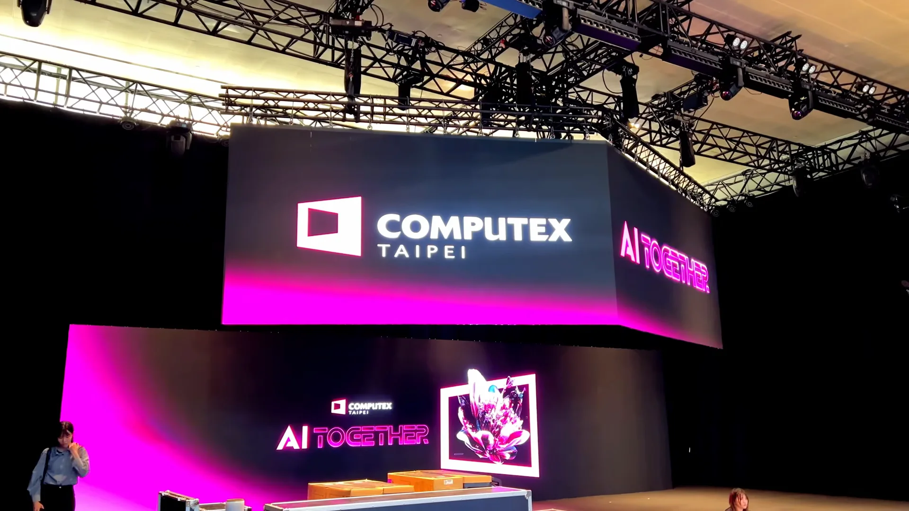
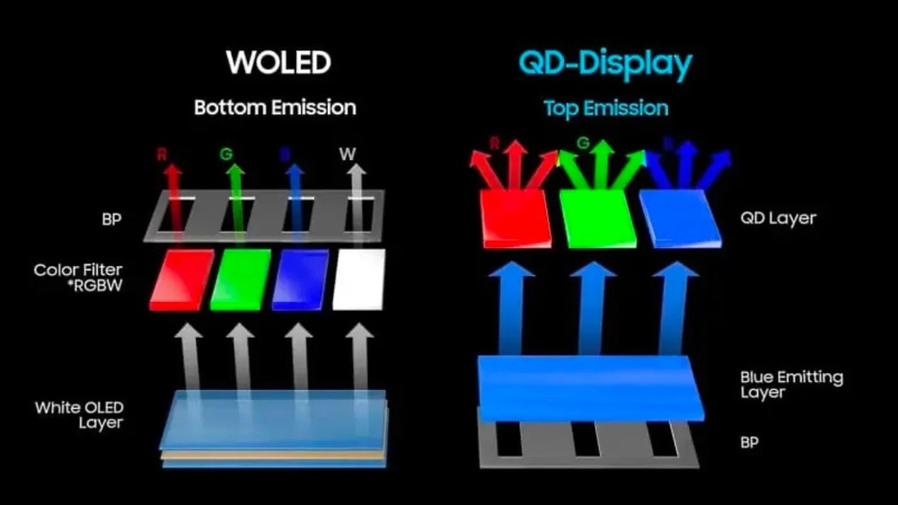
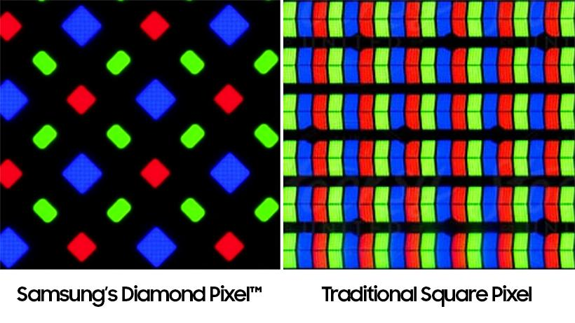
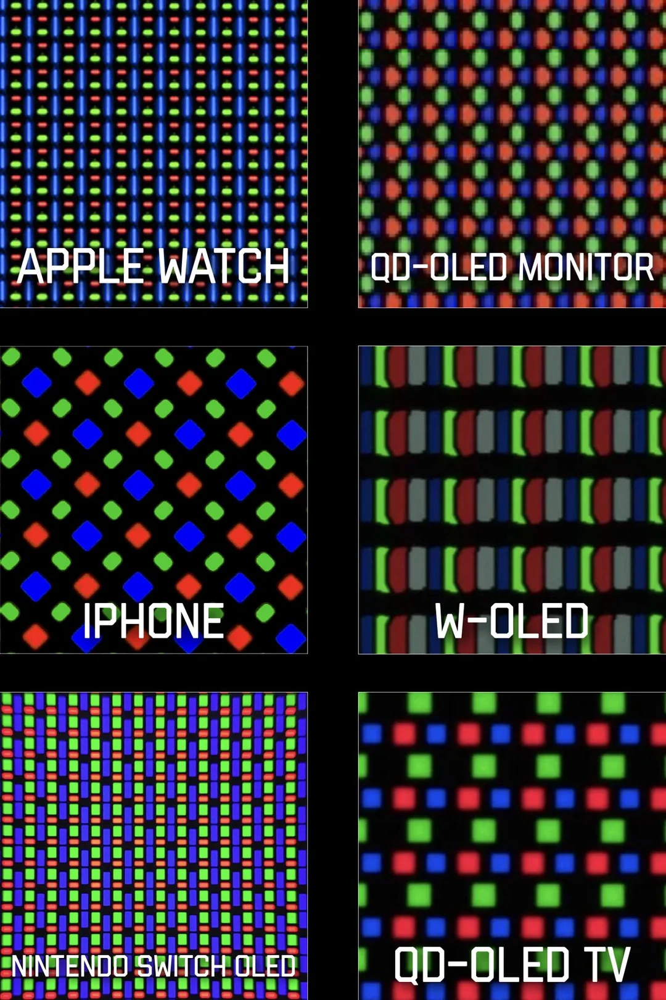
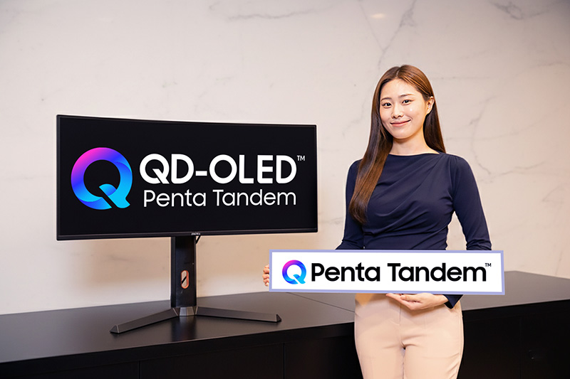

---
#Required fields
title: "Perang OLED: Samsung QD-OLED vs LG W-OLED - Siapa Raja di COMPUTEX 2026?"
description: "Samsung pamerkan QD-OLED Penta Tandem 4500 nits, LG balik dengan RGB Stripe W-OLED. Bedah teknis lengkap: arsitektur, pixel layout, triple-mode, AI monitor, dan semua monitor OLED baru dari COMPUTEX 2026."
pubDate: 2026-06-04
category: "exhibition"
cover: "../../assets/blog/12/computex-2026.jpg"
coverAlt: "Visual representation of Perang OLED: Samsung QD-OLED vs LG W-OLED - Siapa Raja di COMPUTEX 2026?"

#Core Fields
tags: ["COMPUTEX 2026"]
author: "Thomas Agung Nugraha"
lang: "id-ID"
draft: false

#recommended
slug: "blog_12_Computex2026"
excerpt: "Saya memantau sengitnya duel QD-OLED Samsung vs RGB Stripe LG di COMPUTEX 2026. Berikut analisis teknis saya mengenai keduanya."
updatedDate: 2026-07-04

#Optional-series support
#series: ""
#seriesOrder:

#Optional:SEO & Indexing
canonicalURL: "https://t-agung.id/blog/blog_12_Computex2026"
keywords:
  - COMPUTEX 2026
noindex: false

#Optional-table-of-content
showToc: true

#optional-internal linking
relatedPosts:
  - blog13_computex_2026_breakthrough
---

*Acara tahunan di Taipei dimana produsen show-off teknologi terakhirnya*

Pagi itu Anna, anak kita yang baru genap 8 tahun, duduk di depan laptop dengan mata melek lebar. "Eh, di sini ada tulisannya 120 Hertz, itu artinya apa sih?" Tanya dia sambil nunjuk stiker yg ditempel disamping touchpad yang baru aja kita buka buat nulis ini. 
Momen kecil itu ngingatkan saya kalau dunia display udah berubah total. Kalau dulu kita ribut antara IPS dan VA, sekarang ceritanya jauh lebih seru. COMPUTEX 2026 di Taipei baru aja tutup, dan dua raksasa Korea Selatan, Samsung Display dan LG Display, udah mempertontonkan siapa yang punya teknologi OLED paling mematikan.

Ini bukan soal siapa yang lebih mahal. Ini soal siapa yang punya arsitektur lebih cerdas, lebih terang, lebih awet, dan lebih nyaman buat mata.

## Apa Itu COMPUTEX?

COMPUTEX adalah pameran teknologi terbesar di Asia, digelar tahunan di Taipei. Bayangin ini kayak Geneva Motor Show, cuma buat dunia komputer dan komponen. Di sini para pabrikan panel kayak Samsung Display dan LG Display, plus brand monitor kayak ASUS, MSI, Acer, Alienware, dan Dell, nge-unveil senjata baru mereka. Ditambah player yang saya prediksi akan mulai jadi raksasa di tahun dekat, yaitu E-ink (kita bahas ini di lain waktu ya...)

Apa yang kamu lihat di COMPUTEX biasanya masuk ke pasaran dalam 2-4 bulan. Artinya, semua yang dibahas di artikel ini udah bakal tersedia di Indonesia sebelum akhir tahun 2026.

## Dua Arsitektur, Dua Filosofi dari Dua Raksasa

Sebelum masuk ke angka-angka, kita perlu paham dulu bedanya QD-OLED dari Samsung dan W-OLED dari LG. Bayangin ini kayak dua cara bikin warna pelangi, tapi pakai resep yang beda.

**Samsung QD-OLED** itu kayak punya lampu biru super terang, lalu ditempeli lapisan quantum dot, yaitu partikel nano yang bisa ngubah cahaya biru jadi merah dan hijau. Hasilnya? Warna yang kereng banget dan hitam yang bener-bener pekat kayak malam tanpa bulan.

**LG W-OLED** itu kayak punya panel cahaya putih yang terang benderang, lalu ditempeli color filter mirip-mirip kaca berwarna. Setiap piksel punya sub-piksel merah, hijau, dan biru yang masing-masing difilter dari cahaya putih itu.

Keduanya OLED, keduanya punya pixel yang nyalain dirinya sendiri. Tapi jalurnya beda.

*Diagram arsitektur QD-OLED (biru + quantum dot) vs W-OLED (putih + color filter), sumber:Samsung*

## Masalah Lama: PenTile - Kenapa Teks di OLED Buram?

Sebelum kita bandingin siapa yang unggul, ada satu masalah klasik OLED yang harus dibahas dulu, yaitu masalah yang bikin banyak orang enggan pakai OLED buat kerja sehari-hari... *Pentile subpixel structure*.

### Apa Itu PenTile?

OLED konvensional menggunakan layout sub-piksel yang disebut PenTile. Kalau monitor IPS atau VA punya tiga sub-piksel merah, hijau, biru yang tersusun rapi bersebelahan buat setiap piksel, PenTile punya susunan yang beda, yaitu lebih banyak sub-piksel hijau, dan merah serta biru yang lebih sedikit, tersusun secara diagonal atau zigzag.

Kenapa begitu? Karena material organik hijau lebih efisien daripada merah dan biru, jadi pabrikan mengurangi jumlah sub-piksel merah dan biru buat ngehemat daya dan nambah umur panel.

 
RGB standar punya 3 sub-piksel sejajar, PenTile punya susunan yang lebih kompleks dengan lebih banyak hijau, sumber: Samsung

Efeknya? Teks yang kamu baca di layar OLED jadi berasa ada yang kurang gitu, karena panel PenTile punya fringing, yaitu garis halus berwarna di tepi teks. Bukan efek yang parah sih, tapi kalau kamu kerja seharian di depan layar, coding, nulis artikel, baca dokumen, mata kamu pasti lebih cepat lelah karena harus mengkompensasi garis ini.

Ini kayak baca koran pakai kacamata minus yang sedikit terlalu tinggi. Bukan nggak bisa baca, tapi setelah 3 jam, matanya udah mulai perih.

### Solusi: RGB Stripe dari Samsung dan LG

Kabar baiknya, kedua raksasa panel udah ngerjain masalah ini:

**Samsung V-Stripe** adalah layout sub-piksel baru yang menyusun merah, hijau, biru secara vertikal kayak garis tegak. Bukan lagi zigzag yang acak.

**LG RGB Stripe** adalah layout standar RGB yang disusun berurutan, persis kayak monitor IPS tapi dengan keunggulan OLED. LG udah memulai produksi massal sejak Mei 2026.

 
Biar sama-sama OLED, ada beberapa struktur piksel, tujuannya supaya menambah keterangan layar" Credit: Reddit

Artinya, kalau dulu kamu pakai OLED dan merasa teks Windows agak gak tajem karena PenTile, sekarang masalah itu udah hampir ilang. Baik Samsung maupun LG udah punya solusi yang masuk produksi massal.

## Samsung Penta Tandem: 5 Lapisan, 2x Umur Panel

 
 *Samsung mamerin penta-tandem monitor* Source:Samsung

Samsung datang dengan senjata berat: **QD-OLED Penta Tandem**. Ini bukan sekadar upgrade, ini re-desain dari akar.

Penta Tandem berarti panel ini punya **5 lapisan** material organik yang ditumpuk vertikal. Bandingin sama generasi sebelumnya yang cuma punya 2 atau 4 lapisan. Analogi simpelnya: kalau OLED biasa itu kayak satu kran air yang harus mengalirkan semua warna, Penta Tandem itu kayak punya 5 kran yang kerja bareng. Beban tiap kran jadi lebih ringan, hasilnya lebih deras.

Angka yang bikin heboh:

- **Panel TV**: mencapai **4.500 nits** peak brightness (3% OPR)
- **Panel Monitor**: mencapai **1.300 nits** peak brightness (3% OPR)
- **Efisiensi**: 1.3x lebih efisien dari QD-OLED standar
- **Umur panel**: **2x lebih panjang** dari QD-OLED biasa

MSI udah langsung pakai panel Penta Tandem di monitor 2026 mereka, jadi ini bukan sekadar prototype, ini udah produksi.

Samsung juga umumin **4K 360Hz QD-OLED** sebagai pertama di dunia. Bukan dual-mode yang bolak-balik resolusi, tapi 4K **_dan_** 360Hz secara bersamaan. Buat ukuran panel 32 inci, ini angka yang belum pernah ada sebelumnya.

## LG RGB Stripe W-OLED: Balik Seru dengan Produksi Massal

Kalau Samsung fokus ke "berapa banyak lapisan yang bisa kita tumpuk", LG punya pendekatan yang beda: "bagaimana kita bikin W-OLED punya layout piksel yang sempurna."

LG udah mulai **produksi massal** panel **240Hz RGB Stripe OLED** sejak Mei 2026, tepat sebelum COMPUTEX. Ini penting banget karena artinya panel ini bukan cuma konsep, panel ini udah tersedia buat dibeli.

Teknologi utama LG di COMPUTEX 2026:

**Primary RGB Tandem 2.0** artinya LG menumpuk cahaya merah, hijau, dan biru di lapisan yang independen. Bukan cuma 2 lapisan, tapi struktur yang dirancang khusus buat memaksimalkan efisiensi cahaya. Hasilnya, panel RGB Stripe W-OLED dari LG bisa capai **90% BT.2020**, yaitu angka color gamut yang sangat tinggi dan mendekati standar warna HDR profesional.

Ada juga **prototipe 27 inci 5K Tandem W-OLED** yang ditunjukkan di SID 2026: resolusi 5120 x 2880, refresh rate 120Hz, dengan sertifikasi VESA DisplayHDR True Black 400.

Yang bikin heboh di sisi LG adalah Alienware AW3926QW yang pakai panel **RGB Stripe Tandem OLED dari LG**, yaitu empat lapisan, tiga sub-piksel RGB. Monitor 39 inci curved 1500R, 5K2K (5120 x 1440) ini punya dua mode: 5K penuh di 165Hz, atau resolusi lebih rendah di 330Hz buat gaming kompetitif. Harga yang diisukan sekitar **$1.099 USD**, kira-kira **Rp. 17 Juta** di Indonesia.

## Triple-Mode: Satu Monitor, Tiga Kepribadian

Ini tren paling hidup di COMPUTEX 2026. Monitor triple-mode bisa beralih antara tiga kombinasi resolusi dan refresh rate:

- Mode 1: Resolusi tinggi + refresh rate tinggi buat cinematic gaming (misalnya 4K 360Hz)
- Mode 2: Resolusi sedang + refresh rate lebih tinggi buat keseimbangan (misalnya 2K 520Hz)
- Mode 3: Resolusi lebih rendah + refresh rate tertinggi buat competitive gaming (misalnya 1080p 680Hz)

MSI MPG OLED 322URDX36 jadi yang pertama memperkenalkan triple-mode di panel QD-OLED. Triple-mode saat ini cuma tersedia di lini MSI, belum ada kompetitor ASUS yang nawarin fitur serupa.

Kenapa ini penting? Karena kamu nggak perlu lagi milih antara "monitor buat main game" dan "monitor buat kerja". Satu monitor bisa main peran keduanya. Mirip kayak pisau lipat Swiss Army, satu alat, banyak fungsi.

## AI Masuk ke Layar Monitor

AI emang lagi hot topic dimana-mana, dan ini sampai ke monitor juga. MSI MEG X klaim sebagai "World's First Agentic AI QD-OLED Gaming Monitor." Di dalamnya ada LuckyClaw AI assistant yang bisa:

- AI Tracker buat analisis gameplay
- AI Gaming suite buat tuning otomatis
- AI Robot Lite buat kontrol berbasis suara

Plus proteksi OLED Care 3.0 dengan AI Care Sensor berbasis NPU, DarkArmor Film, dan Uniform Luminance.

Ini kayak ada asisten pribadi yang diam-diam tinggal di dalam monitor. Bukan kayak AI yang cuma gimmick di iklan, ini AI yang bener-bener terintegrasi sama fungsi hardware. Dari pengalaman saya kerja di automotive HMI di Motherson, integrasi AI ke dalam sistem display memang masa depan. Di mobil, AI udah mulai dicoba dipakai buat nyesuaikan tampilan dashboard berdasarkan kondisi pengemudi. MSI bawa konsep yang sama ke monitor gaming.

## Tabel Perbandingan: Samsung QD-OLED vs LG W-OLED

| Spesifikasi                          | Samsung QD-OLED Penta Tandem                              | LG W-OLED RGB Stripe Tandem                                     |
| ------------------------------------ | --------------------------------------------------------- | --------------------------------------------------------------- |
| **Arsitektur dasar**                 | Blue OLED + Quantum Dot layer                             | White OLED + Color Filter                                       |
| **Jumlah lapisan organik**           | 5 lapisan (Penta Tandem)                                  | 2-4 lapisan (Tandem)                                            |
| **Layout sub-piksel**                | V-Stripe (vertikal RGB)                                   | RGB Stripe (standar berurutan)                                  |
| **Layout lama**                      | PenTile (generasi 1-3)                                    | PenTile (generasi 1-2)                                          |
| **Peak brightness (TV)**             | 4.500 nits                                                | Belum diumumkan                                                 |
| **Peak brightness (monitor)**        | 1.300 nits                                                | 250 nits (prototipe 5K)                                         |
| **Color gamut**                      | QD-OLED gen sebelumnya 95% DCI-P3                         | 90% BT.2020                                                     |
| **Efisiensi cahaya**                 | 1.3x vs QD-OLED standar                                   | Diklaim memaksimalkan efisiensi                                 |
| **Umur panel**                       | 2x lebih panjang dari QD-OLED biasa                       | 60% lebih panjang (Tandem WOLED)                                |
| **Refresh rate tertinggi (monitor)** | 360Hz di 4K / 720Hz di 720p                               | 240Hz (mass production)                                         |
| **Status produksi**                  | Sudah dipakai di monitor MSI 2026                         | Sudah produksi massal sejak Mei 2026                            |
| **Monitor flagships**                | MSI MEG X, MSI MPG 322URDX36, ASUS ROG Swift, Acer X34 F1 | Alienware AW3926QW, ASUS XG259QWPG Ace                          |
| **Keunggulan utama**                 | Kecerahan ekstrem, warna sangat jenuh, umur panel 2x      | Text clarity lebih baik, color gamut BT.2020 luas, lebih matang |
| **Kelemahan**                        | V-Stripe masih baru, belum banyak monitor                 | Brightness masih rendah di prototipe 5K                         |

## Analisis Teknis: Kenapa Ini Penting?

Sebagai ex-display engineer dari era tablet pertama Sony, pengalaman saya bilang satu hal: konsumen nggak butuh angka tinggi di kertas. Konsumen butuh layar yang nggak bikin mata capek setelah 6 jam melototin display, butuh display yang nunjukin teks yang jelas buat ngebaca text atau untuk coding, dan yang bisa ngelakuin semuanya tanpa burn-in setelah 2 tahun.

**Masalah text clarity udah selesai.** Baik Samsung dengan V-Stripe maupun LG dengan RGB Stripe, keduanya udah bergerak ke layout sub-piksel yang bener-bener RGB murni. Artinya, masalah PenTile yang bikin teks buram udah hampir ilang. Kalau kamu dulu menghindari OLED karena alasan ini, sekarang udah waktunya coba lagi.

**Kecerahan Samsung masih di depan.** 1.300 nits di panel monitor itu angka yang jauh di atas panel LG prototype 5K yang cuma 250 nits. Tapi ini belum fair comparison karena panel LG yang diumumin adalah prototipe 5K. Panel produksi LG kemungkinan bakal punya angka yang lebih tinggi.

**Color gamut LG impresif.** 90% BT.2020 itu angka yang luar biasa, bahkan buat monitor profesional. Samsung belum ngungkapin angka color gamut spesifik buat Penta Tandem, tapi dari pengalaman generasi sebelumnya, QD-OLED Samsung biasanya udah di atas 95% DCI-P3.

**Umur panel Samsung 2x lebih panjang.** Ini poin yang sering diabaikan. Burn-in sudah bukan lagi musuh utama OLED, tapi panel yang awet dua kali lipat berarti kamu bisa pakai monitor lebih lama sebelum performa mulai turun. Di sisi LG, Tandem WOLED juga mengklaim umur panel 60% lebih panjang dari WOLED generasi sebelumnya.

**Triple-mode adalah game changer.** MSI jadi yang pertama bawa triple-mode ke QD-OLED 4K. Ini berarti satu monitor bisa handle cinematic gaming di 4K 360Hz, lalu beralih ke 2K 520Hz buat FPS, dan 1080p 680Hz buat esports. Kamu nggak perlu lagi punya dua monitor terpisah.

**AI di monitor bukan gimmick lagi.** MSI MEG X dengan LuckyClaw AI assistant, OLED Care 3.0 berbasis NPU, dan DarkArmor Film nunjukin kalau monitor udah bukan lagi panel pasif. Dari pengalaman di automotive HMI, tren ini udah jelas, display yang cerdas akan menyesuaikan diri sama pengguna.

## Semua Monitor OLED dari COMPUTEX 2026

Mari kita susun dari yang paling terjangkau sampai yang paling premium.

**ASUS ROG Strix OLED XG27AQMR** - sekitar Rp. 7,2 Juta ($460)
27 inci QD-OLED Samsung gen 4, triple-mode: 1440p di 360Hz, 1080p di 540Hz, 720p di 720Hz. Pilihan paling masuk akal buat competitive gamer.

**ASUS ROG Swift PG27AQN5DZ** - sekitar Rp. 11 Juta ($700)
27 inci QD-OLED Samsung gen 4, 1440p 360Hz, response time 0,03ms. Rilis Agustus 2026. Udah direview oleh Gamers Nexus dengan rating solid.

**ASUS ROG XG259QWPG Ace** - sekitar Rp. 13-19 Juta (estimasi $800-1.200)
24,5 inci 1080p Tandem WOLED dengan RGB Stripe dari LG, 540Hz, response time 0,02ms. Ini "world's first OLED esports monitor." Ukuran 24,5 inci 1080p itu standar setup turnamen esports selama 15 tahun, karena pemain butuh pixel yang besar dan layar yang pas di jarak pandang dekat. Brightness naik 15%, color volume naik 25%, umur panel 60% lebih panjang.

**Acer Predator X34 F1** - sekitar Rp. 17,5 Juta ($1.100)
34 inci ultrawide curved 1800R, WQHD (3440 x 1440), QD-OLED Penta Tandem, 360Hz, 0,03ms. Rilis Q3-Q4 2026. Lebih murah dari Alienware AW3926QW tapi refresh rate 360Hz jauh lebih tinggi.

**Alienware AW3926QW** - sekitar Rp. 17,5 Juta ($1.099 - harga belum resmi, rumor luas)
39 inci curved 1500R, 5K2K (5120 x 1440), RGB Stripe Tandem OLED dari LG, peak HDR 1.300 nits, dual-mode 165Hz/330Hz, coating glossy. Alienware launching ini sambil merayakan ulang tahun ke-30 mereka.

**Acer Predator X27U F8** - sekitar Rp. 20,5 Juta ($1.300)
26,5 inci QD-OLED, dual-mode: 1440p di 540Hz dan 720p di 720Hz, response time 0,03ms, brightness peak HDR 1.500 nits (DisplayHDR True Black 500), USB-C 90W, KVM switch, 99% DCI-P3. Brightness peak 1.500 nits itu sangat terang, HDR highlight bener-bener akan meledak di monitor ini, meskipun SDR brightness normal di 335 nits.

**MSI MPG OLED 322URDX36** - harga belum diumumkan
31,5 inci 4K UHD, QD-OLED Penta Tandem Samsung gen 5, triple-mode: 4K di 360Hz, 2K di 520Hz, 1080p di 680Hz. Pertama di dunia yang nawarin triple-mode di panel QD-OLED 4K.

**MSI MEG X** - harga belum diumumkan
34 inci ultrawide curved, Penta Tandem QD-OLED gen 5 dengan V-Stripe, 360Hz, 0,03ms, LuckyClaw AI assistant, OLED Care 3.0, DarkArmor Film. Ini monitor paling canggih dari COMPUTEX 2026.

## Siapa yang Menang?

Jujur? Tergantung kebutuhan kamu.

Kalau kamu gamer kompetitif yang main Valorant atau CS2 di 720p atau 1080p, **Samsung QD-OLED Penta Tandem** lewat triple-mode monitor dari MSI atau ASUS adalah pilihan yang lebih kuat. Refresh rate 680-720Hz itu bukan marketing gimmick, di level profesional, selisih 1-2 frame bisa menentukan apakah kamu headshot atau nggak.

Kalau kamu content creator yang butuh color accuracy luas dan text clarity yang sempurna, **LG W-OLED RGB Stripe** lewat Alienware AW3926QW adalah taruhan yang bagus. 90% BT.2020 plus layout RGB Stripe yang bikin teks tajam kayak cetak di kertas baru.

Kalau kamu serius soal gaming e-sports, **ASUS ROG XG259QWPG Ace** di 24,5 inci 1080p 540Hz adalah monitor yang dirancang khusus buat turnamen. Ukuran ini udah jadi standar industri e-sports selama 15 tahun.

Buat user umum yang cuma butuh monitor bagus buat kerja dan maen-maen di sore hari, entry-level OLED di kisaran **Rp. 6-8 Juta** kayak Lenovo Legion 27Q-10 atau ASUS ROG Strix XG27AQMR udah cukup buat ngubah cara kita memandang layar.

## Kesimpulan

COMPUTEX 2026 nunjukin kalau perang OLED udah bukan lagi soal "OLED bagus atau nggak." Pertanyaannya sekarang adalah "OLED mana yang lebih bagus?" Samsung dan LG udah nyiapin jawaban yang beda, dan untungnya buat kita, kedua jalur ini saling mendorong inovasi.

Samsung bawa Penta Tandem yang bikin panel lebih terang dan lebih awet, plus V-Stripe yang menyelesaikan masalah text clarity. LG bawa RGB Stripe yang udah lebih matang di produksi massal, dengan color gamut BT.2020 yang impresif dan umur panel yang lebih panjang.

Dua tren baru yang muncul: triple-mode dari MSI yang bikin satu monitor punya tiga kepribadian, dan AI assistant yang terintegrasi langsung ke hardware monitor.

Dan Moko? Kucing kita tetep nggak peduli sama refresh rate. Buat dia, 60Hz udah cukup buat nonton video ikan berenang.

