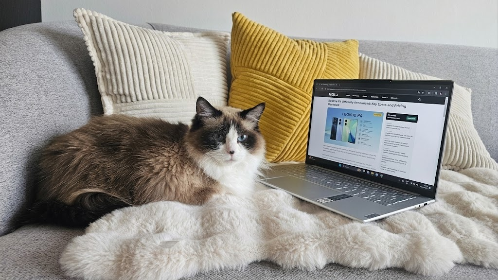
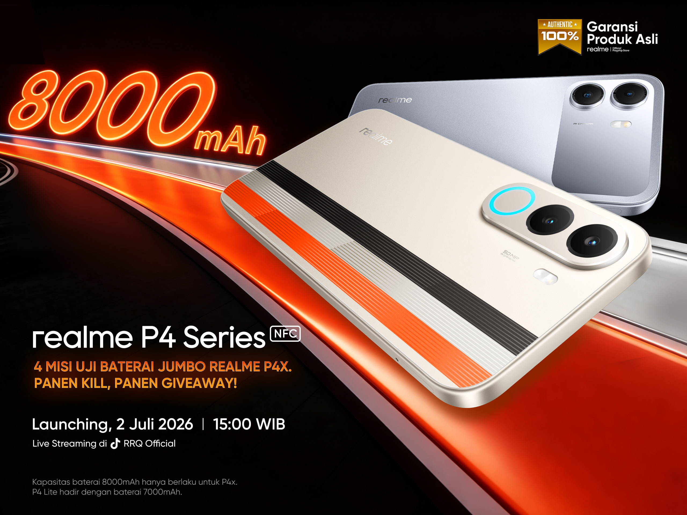
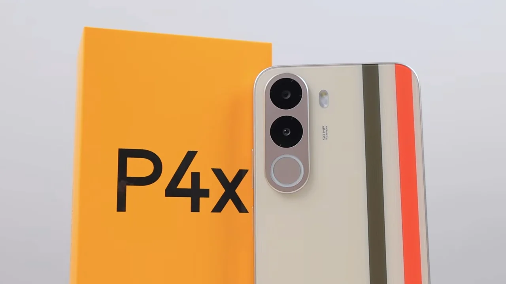

Moko duduk di atas laptop saya, menatap layar yang menampilkan press release Realme P4 Series. Dia tidak bisa baca, tapi ketertarikan pada sesuatu yang menyala itu universal. Ironis juga, karena artikel ini justru tentang HP yang baterainya tidak gampang habis.

 Moko:..."Apa lagi nih".. 

 

Saya baca press release-nya malam tadi sambil ngerjain review DFM untuk client. Realme resmi meluncurkan P4 Series di Indonesia pada Kamis, 2 Juli 2026. Dua model: **Realme P4x** dan **Realme P4 Lite**. Keduanya eksklusif online, dan keduanya fokus pada satu nilai jual utama yaitu baterai besar untuk gaming yang tahan lama.

P4x bawa 8.000 mAh. P4 Lite bawa 7.000 mAh. Harganya mulai Rp 1,7 jutaan.

 Banner Realme P4 series launch. Sumber: Realme

 
Pertanyaannya: Gimana Realme nyelipin 8.000 mAh ke dalam bodi smartphone seharga Rp. 2 jutaan, tanpa bikin beratnya nyampe 400 gram? Mari kita bedah dari sisi rekayasa, bukan dari press release.

---

## Spesifikasi yang Benar: Tanpa Marketing Fluff

Saya nggak suka artikel tech yang penuh klaim "monster" atau "revolusioner" tanpa angka. Sebagai engineer, angka adalah bahasa universal. Ini data yang sudah saya verifikasi dari sumber resmi:

### Realme P4x

- Layar: IPS LCD 6,8 inci, 120Hz, HD+ (720×1570)
- Chipset: Unisoc T7250 (12nm, 4G only)
- CPU: Octa-core (2x Cortex-A75 @ 1.8 GHz + 6x Cortex-A55 @ 1.6 GHz)
- GPU: Mali-G57 MC2
- RAM: 4 GB (varian) / 6 GB (varian atas), LPDDR4X
- Storage: 128 GB / 256 GB, eMMC 5.1
- Baterai: 8.000 mAh Titan Battery
- Charging: 45W Fast Charging (via USB-C)
- Fitur tambahan: Reverse charging 10W, Bypass Charging, AI Gaming Partner
- Kamera utama: 50 MP
- Kamera depan: 5 MP
- OS: Android 16 dengan realme UI
- Ketahanan: ArmorShell (drop-resistant)
- Harga: Rp 2,499,000 (4/128 GB), Rp 2,999,000 (4/256 GB), Rp 3,299,000 (6/128 GB)

### Realme P4 Lite

- Layar: IPS LCD, 120Hz
- Chipset: Unisoc T7250 (12nm, 4G only)
- Baterai: 7.000 mAh Titan Battery
- OS: Android 16 dengan realme UI
- Harga: Mulai Rp 1,7 jutaan

Sumber: [realme.com/id](https://www.realme.com/id/realme-p4x), [realme P4 Lite specs](https://www.realme.com/id/realme-p4-lite), Kompas Tekno, Detik Inet, Jagatreview, 91mobiles Indonesia, Laptophia, Carisinyal, Medcom.id.

### Catatan penting: ini bukan AMOLED

P4x dan P4 Lite sama-sama menggunakan **IPS LCD**, bukan AMOLED. Ini bukan typo. Ini keputusan rekayasa yang sengaja diambil oleh tim engineering realme.

Di segmen entry-level dengan BOM di kisaran 1,5-2 juta, layar LCD masih jauh lebih murah dari panel OLED. Bahkan panel OLED yang paling entry-level sekalipun, biayanya masih 30-50% lebih mahal dari IPS LCD setara. Realme mengalokasikan budget yang menghemat dari display ke baterai.

Saya paham ini mengecewakan buat yang berharap AMOLED di harga segini. Tapi sebagai engineer yang pernah ngerancang display di era Sony Xperia, saya respek sama trade-off ini. Budget terbatas, fitur tidak bisa semuanya premium. Kamu tidak bisa dapetin layar AMOLED 144Hz, baterai 8000 mAh, chipset flagship, bodi tipis, dan kamera 108 MP dalam satu paket harga 2 jutaan. Realme memilih baterai. Ini bukan keputusan buruk, ini keputusan yang jujur tentang prioritas.

---

## Hierarchy yang Kompleks

Sebelum masuk ke bedah teknik, penting dipahami dulu landscape Realme P4 Series secara keseluruhan:

- **Realme P4 5G** (global/India, Agustus 2025): Dimensity 7400 Ultra, AMOLED 6,77 inci, 144Hz, 4500 nits peak, 7.000 mAh
- **Realme P4 Pro 5G** (global): Varian premium
- **Realme P4x 4G** (Indonesia/ASEAN): Unisoc T7250, IPS LCD 6,8 inci, 120Hz, **8.000 mAh**
- **Realme P4 Lite** (Indonesia): Unisoc T7250, IPS LCD, 120Hz, 7.000 mAh

P4x Indonesia adalah **4G-only** device dengan chipset entry-level dan baterai terbesar di seri ini. Ini bukan downgrade dari P4 5G global. Ini positioning yang berbeda. Realme tahu pasar Indonesia butuh baterai lebih besar daripada layar AMOLED di segmen harga ini.

---

## 8.000 mAh dalam Smartphone Budget: Bagaimana Caranya?

Ini bagian yang menarik secara teknik. Baterai lithium-polymer 8.000 mAh itu volume dan beratnya signifikan. Bandingkan:

- Smartphone flagship rata-rata (2026): 4.500-5.500 mAh
- Realme 15T 5G (segregator di atas P4x, Rp3 jutaan): 7.000 mAh
- Samsung Galaxy A15: 4.995 mAh
- Redmi 13C: 5.000 mAh
- Realme P4x: **8.000 mAh** di harga Rp2 jutaan

Selisihnya bukan tipis-tipis. 8.000 mAh itu 60% lebih besar dari Samsung A15, dan dari Redmi 13C.

Realme menyebutnya "Titan Battery". Mari kita bedah apa artinya dari sisi engineering.

### Cell chemistry dan stack design

Baterai smartphone modern menggunakan lithium-polymer cell. Untuk mencapai 8.000 mAh di form factor smartphone, ada beberapa pendekatan yang mungkin dipakai Realme:

**Dual-cell parallel stack** yaitu dua sel lithium-polymer yang disusun paralel, sehingga kapasitas digandakan tanpa meningkatkan tegangan. Ini pendekatan umum di smartphone dengan baterai di atas 5.000 mAh, dipakai oleh beberapa model Redmi Note dan Infinix dengan baterai 6.000-7.000 mAh.

**Energy density optimasi** yaitu material elektroda dan elektrolit yang lebih efisien untuk memaksimalkan kapasitas per satuan volume. Lithium-polymer generasi terbaru bisa mencapai 600-700 Wh/L, naik dari 500-600 Wh/L di generasi sebelumnya.

**Thermal management layer** yaitu baterai kapasitas besar menghasilkan panas lebih banyak saat charging dan discharging. Realme pasti memasukkan thermal layer yang lebih tebal di antara cell baterai dan bodi, untuk mencegah thermal runaway dan menjaga kinerja chipset.

**BMS (Battery Management System)** yaitu sistem manajemen baterai yang lebih canggih untuk monitoring sel-level, balancing charge, dan protection circuit. Dual-cell stack membutuhkan balancing agar kedua sel tetap seimbang selama siklus charge-discharge.

Mengeksekusi desain ini di harga jual 2 jutaan itu tantangan yang beda levelnya. Kompetitor di segmen yang sama pakai single-cell 5.000 mAh yang lebih murah dan lebih sederhana. Realme ambil risiko engineering yang lebih tinggi untuk angka 8.000 mAh.

### Trade-off: berat dan ketebalan

Baterai besar berarti berat. Saya belum pegang unit fisik Realme P4x, tapi dari pengalaman merakit desain di erasmartphone  di Sony Xperia dan kerjasama dengan battery engineer di Intel, baterai 8.000 mAh di smartphone itu minimal menambah 40-60 gram dibanding unit 4.000 mAh. Realme juga mengklaim bodi tangguh lewat ArmorShell. Teknologi ini biasanya menambah ketebalan karena menggunakan material pelindung tambahan di sudut dan back panel.

Kalau kamu sering main Mobile Legends atau PUBG selama berjam-jam, tambahan berat ini mungkin tidak terlalu terasa. Kamu fokus ke layar, bukan ke tangan. Tapi buat yang pakai HP buat browsing, WhatsApp, dan foto-foto, kamu pasti ngerasa perbedaannya di saku celana.

Di Intel, saya biasa bilang ke tim saya: "engineering is the art of choosing which compromise you can live with." Realme memilih: baterai besar di atas segalanya. Kompromi yang mereka terima adalah layar LCD, chipset entry-level, dan konektivitas 4G. Kompromi yang konsumen terima adalah berat dan ketebalan.

---

## Unisoc T7250: Chipset yang Sering Diabaikan

Ini bagian yang jarang dibahas media mainstream Indonesia: **Realme P4x adalah perangkat 4G, bukan 5G.** Chipset Unisoc T7250 adalah SoC entry-level dari Spreadtrum Communications (sekarang Unisoc), bukan MediaTek Dimensity.

Spesifikasi Unisoc T7250:

- Proses: 12nm TSMC
- CPU: Octa-core (2x Cortex-A75 @ 1.8 GHz + 6x Cortex-A55 @ 1.6 GHz)
- GPU: Mali-G57 MC2
- Connectivity: 4G LTE Cat.12 (download hingga 600 Mbps), tidak support 5G NR
- NPU: Ada, tapi kemampuan terbatas dibanding NPU di chipset MediaTek atau Qualcomm
- RAM: LPDDR4X
- Storage: eMMC 5.1

Untuk gaming entry-level dan penggunaan harian yaitu browsing, WhatsApp, Instagram, YouTube, T7250 cukup kompeten. Mali-G57 sudah dipakai di banyak chipset budget, jadi driver dan optimasi game sudah matang. Tapi jangan berharap bisa jalan Genshin Impact di settings ultra atau PUBG di Extreme 60fps.

Kenaikan dari 5G ke 4G di varian Indonesia ini menarik dari perspektif strategi produk. Realme P4 5G global yang diluncurkan Agustus 2025 pakai Dimensity 7400 Ultra dengan layar AMOLED 144Hz dan 4.500 nits peak brightness, tapi itu di segmen harga lebih tinggi. P4x Indonesia adalah keputusan strategis: turunkan chipset ke entry-level, naikkan baterai ke 8.000 mAh, jaga harga di Rp2 jutaan.

Kayak beli motor di Jakarta. Kamu bisa pilih motor matic 150cc yang kenceng tapi boros bensin, itu Realme P4 5G global. Atau motor 110cc yang pelan tapi irit, bisa jalan seharian tanpa ganti bensin, itu Realme P4x. Dua-duanya valid, tergantung kebutuhanmu.

### Kenapa 4G di Indonesia masih relevan

Indonesia punya jaringan 4G yang sudah cukup matang. Di kota besar, 4G Cat.12 dengan download 600 Mbps sudah cukup untuk streaming, video call, dan gaming online. 5G di Indonesia masih terbatas di area tertentu: Jakarta, Surabaya, beberapa kota besar lainnya. Untuk target market Realme P4x yang kemungkinan besar di tier 2 dan tier 3 cities, 4G sudah mencukupi.

Realme tahu ini. Mereka tidak mau nambah biaya modem 5G yang bisa Rp200-300 ribu per unit, kalau konsumen target mereka tidak dapetin sinyal 5G di daerah masing-masing. Keputusan bisnis yang pragmatis.

---

## Fitur Tambahan yang Penting: 45W Fast Charging dan Bypass Charging

Ini bagian yang tidak semua artikel bahas. Realme P4x punya dua fitur charging yang sebenarnya penting:

**45W Fast Charging** mengisi baterai 8.000 mAh jauh lebih cepat dari yang kamu bayangkan. Charging 0 sampai 100% diperkirakan dalam kisaran 70-90 menit. Untuk referensi, HP dengan baterai 5.000 mAh dan charging 18W butuh sekitar 1,5 jam. Jadi 45W di 8.000 mAh tetap efisien.

**Bypass Charging** fitur yang lebih jarang dikenal tapi sangat berguna untuk gamer. Saat bypass charging aktif, daya dari charger dialirkan langsung ke sistem tanpa mengisi baterai. Ini berarti saat kamu main game sambil ngecas, baterai tidak mengalami charge-discharge cycle bersamaan yang menghasilkan panas berlebih. Panas lebih rendah, performa lebih stabil, dan baterai awet lebih lama.

Di Intel, kami punya prinsip: "features that solve real problems, not problems that features create." Bypass charging di HP gaming dengan baterai 8.000 mAh adalah contoh fitur yang meaningful. Di HP dengan baterai 3.000 mAh tanpa bypass charging, kamu ngecas sambil main game, baterai panas, performa drop, dan kesehatan baterai turun lebih cepat.

---

## Reverse Charging 10W, Fitur yang Sering Terlupakan

Kedua model support reverse charging 10W melalui USB OTG. Kamu bisa ngecas earbuds atau smartwatch langsung dari P4x tanpa perlu charger dinding. Dengan baterai 8.000 mAh, fitur ini jadi berguna dan bukan gimmick.

Bayangkan: kamu di luar kota, charger tidak bawa, tapi earbuds Bluetooth kamu mati. P4x bisa jadi powerbank darurat. Output 10W cukup untuk ngecas earbuds typical (50-100 mAh) dalam waktu kurang dari 1 jam.

Catatan dari halaman resmi realme: reverse charging memerlukan kabel USB-C ke USB-C yang kompatibel, dan output OTG bergantung pada perangkat yang terhubung. Bukan semua earbuds atau smartwatch support charging via OTG. Tapi buat yang support, ini fitur yang practical.

---

## Android 16 dan 48 Bulan Smooth Performance

Realme P4x dan P4 Lite keluar dengan Android 16, versi terbaru dari Google saat ini. Ini signifikan untuk segmen budget. Biasanya versi Android terbaru selalu mendarat di flagship dulu, baru turun ke mid-range 6-12 bulan kemudian.

realme UI di atas Android 16 kemungkinan membawa perubahan berikut:

**Permission model yang lebih granular** yaitu Android 16 memperkenalkan kontrol permission yang lebih detail, terutama untuk akses kamera, mikrofon, dan lokasi. Di HP entry-level yang sering dipakai keluarga, fitur ini penting.

**Background app restriction** yaitu Android 16 lebih agresif membatasi app yang jalan di background. Ini bagus untuk baterai 8.000 mAh: kapasitas lebih lama terpakai karena app background lebih sedikit yang nyedot daya.

**On-device AI features** yaitu AI Gaming Partner yang disebutkan realme kemungkinan menggunakan on-device NPU di T7250 untuk optimasi frame rate, adaptive resolution scaling, dan thermal throttling management. Tapi Unisoc belum terlalu transparan soal kemampuan NPU di T7250, jadi level AI-nya masih perlu verifikasi setelah unit tersedia.

Selain itu, varian P4x 6GB+128GB atau lebih tinggi mendapat sertifikasi "48-Month Smooth Performance" dari realme Lab. Artinya realme mengklaim performa tetap lancar selama 4 tahun. Hasil aktual tentu bervariasi tergantung kondisi penggunaan, tapi klaim ini menunjukkan realme menargetkan umur device yang lebih panjang, bukan sekadar jual dan lupakan.

---

## Kesehatan Baterai 7 Tahun : Klaim yang Perlu Dipahami

Realme mengklaim "Kesehatan Baterai 7 Tahun" untuk P4 Series. Dari halaman resmi realme, klaim ini berbunyi: kapasitas baterai diperkirakan tetap di atas 80% setelah 7 tahun penggunaan terus-menerus.

Secara teknis, klaim ini berdasarkan:

- Data uji laboratorium realme
- Asumsi pengguna mengisi daya sekali sehari
- Siklus charge-discharge standar (0-100% dianggap satu siklus)

Di dunia nyata, baterai lithium-polymer mengalami degradation seiring jumlah siklus charge. Industri standar menganggap baterai masih "sehat" sampai kapasitas turun ke 80% dari nominal. Setelah 800-1000 siklus penuh, kebanyakan baterai lithium-polymer memang masih di atas 80%, tapi ini asumsi kondisi ideal.

Di iklim tropis Indonesia, suhu tinggi mempercepat degradation baterai. Kalau HP kamu sering dipakai di bawah terik matahari atau ditinggal charging semalaman di ruangan panas, kesehatan baterai bisa turun lebih cepat. Jadi klaim 7 tahun ini valid secara laboratorium, tapi di dunia nyata mungkin 4-5 tahun lebih realistis.

Realme juga mencatatkan rekor MURI: "10 Jam Gaming Non-Stop dengan Baterai 8000 mAh" yang divalidasi langsung dari acara launch virtual mereka. Menarik, tapi tetap uji lab. Di dunia nyata, session gaming dengan suara penuh, WiFi, dan layar terang mungkin 7-8 jam lebih realistis.

---

## Perbandingan dengan Kompetitor

Di harga Rp. 2 jutaan, siapa kompetitor langsung Realme P4x?

### Samsung Galaxy A15 (Rp. 2,5 jutaan)

- Baterai: 4.995 mAh
- Layar: Super AMOLED 6,5 inci, 90Hz
- Chipset: Exynos 1330 (5G)
- Verdict: Layar AMOLED jauh lebih bagus, tapi baterai lebih kecil hampir separuh.

### Redmi 13C (Rp. 1,5 jutaan)

- Baterai: 5.000 mAh
- Layar: IPS LCD 6,74 inci, 90Hz
- Chipset: MediaTek Helio G85
- Verdict: Lebih murah, tapi baterai 5.000 mAh vs 8.000 mAh. Refresh rate juga lebih rendah.

### OPPO A58 (Rp. 2,5 jutaan)

- Baterai: 5.000 mAh
- Layar: IPS LCD 6,72 inci, 90Hz
- Chipset: MediaTek Helio G85
- Verdict: Desain lebih premium, tapi baterai standar 5.000 mAh.

Realme P4x menang telak di metrik baterai. 8.000 mAh di kelas harga Rp2 jutaan tidak punya kompetitor langsung di Indonesia. Tapi kamu kehilangan AMOLED, 5G, dan chipset yang lebih powerful. Trade-off yang jelas.

---

## Intinya

Realme P4 Series adalah contoh engineering trade-off yang jelas dan konsisten. Realme tahu target marketnya: pengguna budget yang butuh daya tahan baterai panjang, terutama untuk gaming mobile dan penggunaan sehari-hari yang intensif. Mereka tidak mencoba menjadi segalanya untuk semua orang.

Sebagai engineer, saya apresiasi kejelasan ini. Banyak brand yang mencoba kasih fitur premium di harga budget, hasilnya setengah-setengah: layar AMOLED tipis-tipis, chipset medium, baterai medium, kamera medium. Realme memilih fokus: baterai 8.000 mAh, chipset entry-level, layar LCD standar, charging 45W dengan bypass charging. Konsisten. Tidak ada yang setengah-setengah.

Tapi sebagai pembaca, kamu perlu tahu batasannya. Ini bukan HP dengan layar terbaik di kelasnya. Tidak AMOLED. Tidak 5G. Tidak flagship. Tapi baterai 8.000 mAh di harga Rp. 2 jutaan? Itu ngga banyak pesaingnya di Indonesia.

Moko lagi tidur di atas sofa. Dia ngga ngerti apa itu mAh atau IPS LCD. Tapi dia ngerti kalau layar mati itu ngga seru. Dan Realme P4x bikin layar hidup lebih lama. Untuk itu saja, sudah cukup.

---
